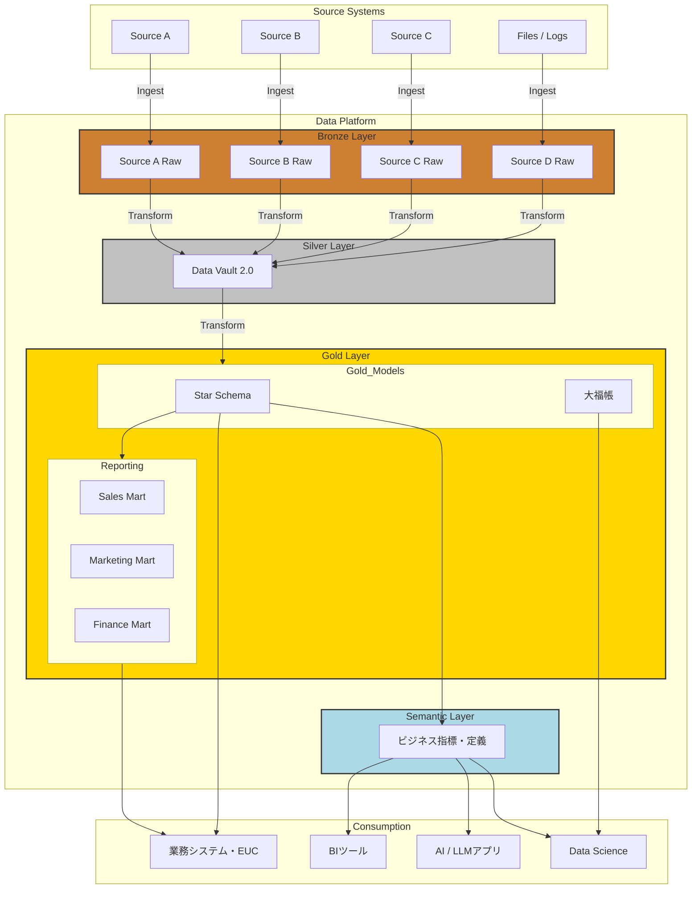
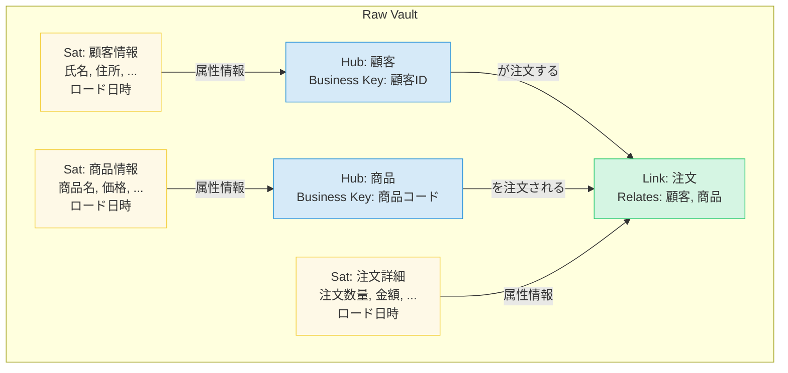
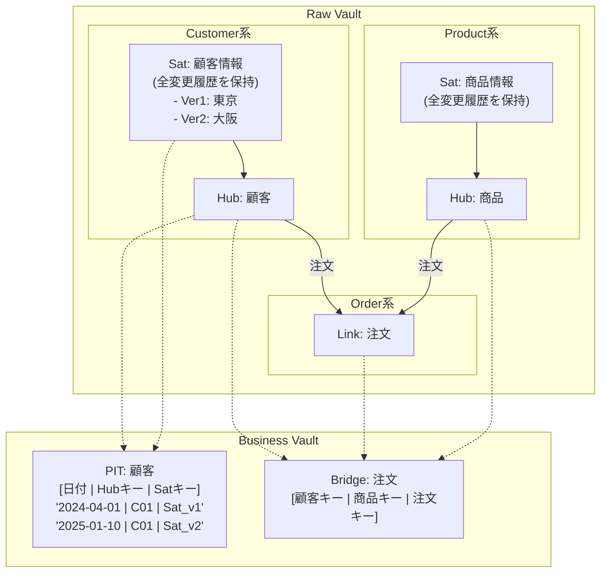
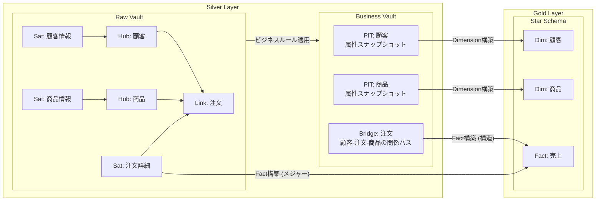
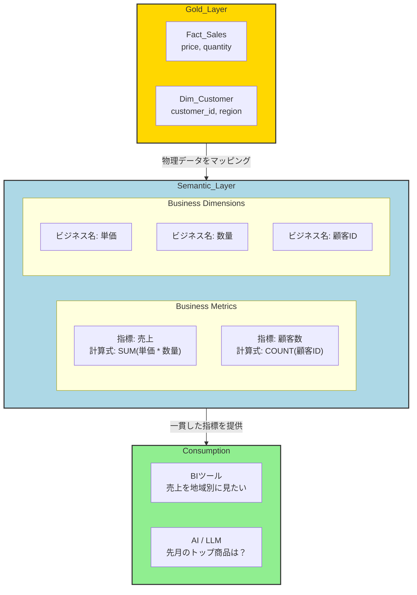
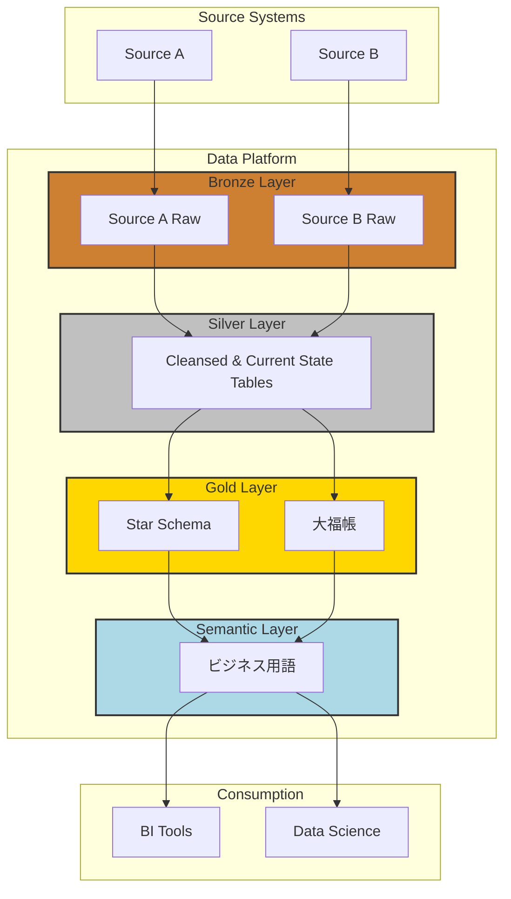

### はじめに

現代のデータ駆動型企業は、「信頼性・監査性の高いデータ基盤」と「ビジネス変化に即応する俊敏性（アジリティ）」という、二つの相反する要求に応えなければならないという共通の課題を抱えています。

この記事では、この課題を解決するための**ハイブリッドデータアーキテクチャ**を解説します。このアーキテクチャは、データ処理の段階を明確化する **Medallionアーキテクチャ** をベースにして、堅牢なデータ統合を実現する **Data Vault 2.0** と、高速な分析性能を持つ **次元モデリング** を組み合わせます。各モデルの強みを最大限に活かすことで、エンタープライズレベルのガバナンスと、現場が求める分析のアジリティを同時に実現します。

このアーキテクチャが解決する核心は、 **安定的で監査可能な統合データコア（Silverレイヤー）** と、 **高速で柔軟なデータアクセス（Goldレイヤー）** の両立です。さらに、物理データ構造をビジネスユーザーから抽象化する **セマンティックレイヤー** を設けることで、全社で一貫した指標定義を共有し、データプラットフォームを信頼できる意思決定支援システムへと進化させます。


### 第1章 アーキテクチャ

#### 1.1 アーキテクチャ概念図

この記事で詳述する統合データプラットフォームの全体像は以下の通りです。データはソースシステムから**Bronze、Silver、Gold**の各レイヤーを経て品質と構造を向上させ、最終的に**セマンティックレイヤー**を通じてエンドユーザーに届けられます。



| 要素名 | 説明 |
| :--- | :--- |
| **Source Systems** | データの発生源となる各種業務システムやファイル、ログ。 |
| **Bronze Layer** | ソースシステムの生データを**一切加工せず**そのままの形で取り込み、不変の履歴として保存する層。 |
| **Silver Layer** | 生データを**Data Vault 2.0モデル**で統合し、監査可能で全社的な視点を持つデータコアを構築する層。 |
| **Gold Layer** | 特定の分析要件に合わせ、**スタースキーマ**や**大福帳**といった、読み取りに最適化されたデータマートを構築する層。 |
| **Semantic Layer** | 物理的なデータ構造をビジネス用語に変換し、指標の定義を一元管理する抽象化層。 |
| **Consumption** | BIツールやAIアプリケーションなど、エンドユーザーがデータを活用する各種ツール群。 |

#### 1.2 組織原則としてのMedallionアーキテクチャ

Medallionアーキテクチャは、データプラットフォーム全体の構造を規定する組織原則です。データを**Bronze、Silver、Gold**という3つの論理的なレイヤーを通して段階的に処理し、その構造と品質を継続的に向上させることを目的とします。

  * **Bronze (Raw): 生データ**
      * ソースシステムから受け取ったデータを、一切加工せずにそのままの形で格納するランディングゾーン。
      * ソースデータの完全な忠実性を維持し、監査や再処理のための**不変の履歴アーカイブ**を提供します。
  * **Silver (Cleansed & Conformed): 統合済みデータ**
      * 統合と検証の役割を担い、Bronzeの生データをクレンジング・統合・調整します。
      * ビジネスエンティティ、概念、トランザクションに関する **「全社的な視点（Single Source of Truth）」** を提供します。
  * **Gold (Curated & Business-Ready): 分析用データ**
      * 消費レイヤーとして、特定のビジネス要件や分析用途に合わせてデータを集約・加工します。
      * エンドユーザーが直接利用するための、非正規化された**読み取り最適化モデル**を提供します。

このフレームワークにより、各データ処理段階の目的が明確化され、その目的に最も合致した技術やモデリング手法を選択できます。

#### 1.3 Medallionフレームワーク内でのモデリング手法の戦略的配置

本アーキテクチャの中核は、Medallionの各レイヤーに、その目的に最も合致したデータモデリング手法を戦略的にマッピングすることです。

  * **Silverレイヤー：Data Vault 2.0**
      * **目的:** 複数ソースのデータを統合し、監査可能で完全な履歴を持つ企業のデータコアを構築する。
      * **理由:** ソースシステムの変更に強く、データの来歴を完全に追跡できるため、安定的でスケーラブルな基盤に最適です。
  * **Goldレイヤー：スタースキーマと大福帳**
      * **目的:** ビジネスユーザーによる直接的なデータ消費を可能にする。
      * **理由:** 構造化された定型分析には**スタースキーマ**が、探索的分析には**大福帳モデル**が、それぞれ高いパフォーマンスと利便性を提供します。
  * **Goldレイヤーの上位：セマンティックレイヤー**
      * **目的:** 技術的なデータ構造とビジネス上の意味を橋渡しする、普遍的な翻訳・ガバナンス層を構築する。
      * **理由:** ここで定義された一貫性のあるビジネス指標を、各業務向けデータマートやBIツールに提供し、指標のブレを防ぎます。


### 第2章 データ基盤の礎：Bronze & Silverレイヤー

#### 2.1 Bronzeレイヤー：不変の履歴アーカイブ

Bronzeレイヤーは、外部ソースシステムからのデータを「そのままの姿で」受け入れることを唯一の目的とします。

  * **目的と特性**
      * **履歴保全:** ソースデータの完全な履歴アーカイブを提供します。
      * **再処理可能性:** 後段の処理で問題が発生した場合でも、いつでもこのレイヤーからデータを再処理できます。
      * **監査対応:** データの発生源から追跡可能な完全なリネージを確保し、監査要件を満たします。
      * **最小限の変換:** 変換は、ロード日時やソースIDといった管理用メタデータの付与に限定されます。
  * **スキーマとフォーマット**
      * **スキーマ:** 原則としてソースシステムのスキーマをそのまま反映します。
      * **フォーマット:** Databricks Delta LakeやApache Icebergのようなモダンなテーブルフォーマットを採用し、スキーマの変更に柔軟に対応します（Schema Evolution）。

#### 2.2 Silverレイヤー：Data Vault 2.0によるエンタープライズコア

Silverレイヤーでは、Bronzeの生データを統合し、企業全体の視点を提供するデータコアを構築します。この要件を満たすため、**Data Vault 2.0**を標準モデリング手法として採用します。

| 特性 | 説明 |
| :--- | :--- |
| **監査可能性と履歴管理** | 「全てのデータを常に保持する」原則に基づき、データの変更履歴を完全に追跡。金融やヘルスケアなど、厳格な規制要件にも対応できます。 |
| **スケーラビリティと柔軟性** | **Hub, Link, Satellite**のモジュール構造により、既存モデルを破壊せずに新しいデータソースや属性を柔軟に追加可能。ビジネスの変化に迅速に対応できます。 |
| **並列ロード性能** | 各コンポーネントが疎結合なため、データロード処理の高度な並列化が可能。大規模データの取り込みパフォーマンスを最大化します。 |

##### 2.2.1 Raw Vault：ビジネスの構造をモデリング

Data Vault 2.0の中核である**Raw Vault**は、ビジネスルールを適用せず、ソースからのデータを構造的に統合することに専念します。

  * **Hub（ハブ）**
      * 企業の中心的なビジネス概念（例：顧客、商品）を表現します。
      * システム横断で一意なビジネスキーと、サロゲートキーを格納します。
  * **Link（リンク）**
      * Hub間の関係性やトランザクション（例：顧客が商品を注文する）をモデル化します。
      * 本質的には多対多の関連テーブルです。
  * **Satellite（サテライト）**
      * HubやLinkに付随する、文脈的、記述的、履歴的な属性情報を格納します。
      * 属性値に変更があった場合、古いレコードは残し、新しいレコードを追加挿入することで**完全な変更履歴を保持**します。

この構造により、ビジネスの **不変の構造（HubとLink）** と、 **変化しやすい文脈情報（Satellite）** が明確に分離され、柔軟性と回復力が生まれます。




### 第3章 ビジネス価値の提供：Goldレイヤー以降

Goldレイヤーの役割は、Silverレイヤーの統合済みデータを、ビジネスユーザーが直感的かつ高性能に利用できる形式に変換することです。

#### 3.1 統合から洞察へ：Business Vaultの役割

Raw Vaultと最終的な消費モデルとの間に **「Business Vault」** という中間レイヤーを設けることがあります。ここでは、分析クエリを簡素化しパフォーマンスを向上させるために、ビジネスルールが適用されたり、事前に計算されたデータが格納されます。

  * **Point-in-Time (PIT) テーブル**
      * 特定時点における正しいSatelliteレコードのバージョンをスナップショットとして保持します。
      * これにより、分析クエリの複雑な時間軸での結合が単純な等価結合に変換され、**履歴データの問い合わせ速度を飛躍的に向上**させます。
  * **Bridge（ブリッジ）テーブル**
      * 複数のHubとLinkを横断するような、頻繁に利用される関係パスを事前に結合しておきます。
      * クエリの結合数を削減し、複雑な関係性の分析を簡素化します。



#### 3.2 業務特化型マートの構築

Goldレイヤーでは、特定の業務領域に特化した非正規化モデルが構築されます。

##### 3.2.1 構造化分析のためのスタースキーマ

  * **目的と用途**
      * BIツール、定型ダッシュボード、標準レポーティングにデータを提供する主要なパターンです。
      * 中央の **ファクトテーブル（事実・数値データ）** と、それを取り囲む **ディメンションテーブル（分析の切り口）** で構成されます。
      * ビジネスユーザーにとって直感的で、OLAPスタイルの分析に最適化されています。
  * **Data Vaultからの構築方法**
      * **ディメンションテーブル:** 特定のHubとその関連Satelliteを結合して作成します。PITテーブルを利用すると効率的です。
      * **ファクトテーブル:** Linkとその関連Satellite、またはBridgeテーブルから作成します。Linkがトランザクションの粒度を、Satelliteが数値的なメジャー（測定値）を提供します。



##### 3.2.2 探索的分析のための大福帳（One Big Table）

  * **目的と用途**
      * 分析に必要な全ての情報を意図的に一つの非常に横長のテーブルに集約します。
      * ユーザーが**JOINを記述することなく**、直感的にアドホックな探索的分析を行えるようにします。
  * **利用シナリオ**
      * プロジェクトの初期段階や、分析要件が固まっていない探索フェーズで有効です。
      * SQLのJOINに不慣れなビジネスアナリストやデータサイエンティストのデータ活用障壁を低減します。
  * **パフォーマンスとトレードオフ**
      * **注意点:** 著しいデータ冗長性を生み、ストレージコストの増大やデータ更新の複雑化を招きます。また、異なるビジネスプロセスを無理に一つのテーブルに押し込めると、データの解釈が困難になるリスクがあります。
      * **位置づけ:** あくまで特定の目的のための**戦術的なデータマート**として利用すべきです。

大福帳作成クエリのイメージ
```sql
WITH
-- ステップ1: PITを使い、各顧客の最新情報を取得
LatestCustomerAttributes AS (
    SELECT
        pit.CUSTOMER_HK,
        hub.customer_id,
        sat_details.customer_name,
        sat_cleansed.prefecture
    FROM biz_vault.PIT_CUSTOMER pit
    JOIN raw_vault.HUB_CUSTOMER hub ON pit.CUSTOMER_HK = hub.CUSTOMER_HK
    JOIN raw_vault.SAT_CUSTOMER_DETAILS sat_details ON pit.CUSTOMER_HK = sat_details.CUSTOMER_HK AND pit.SAT_DETAILS_LDTS = sat_details.LOAD_DATETIME
    JOIN biz_vault.COMPUTED_SAT_CUSTOMER_CLEANSED sat_cleansed ON pit.CUSTOMER_HK = sat_cleansed.CUSTOMER_HK AND pit.SAT_CLEANSED_LDTS = sat_cleansed.LOAD_DATETIME
    WHERE pit.SnapshotDate = (SELECT MAX(SnapshotDate) FROM biz_vault.PIT_CUSTOMER) -- 最新のスナップショットを選択
),

-- ステップ2: 各顧客の「最後の注文」を特定
LastOrder AS (
    SELECT
        CUSTOMER_HK,
        ORDER_HK,
        order_id,
        order_date,
        order_amount,
        PRODUCT_HK
    FROM (
        SELECT
            l.CUSTOMER_HK,
            l.ORDER_HK,
            s_ord.order_id,
            s_ord.order_date,
            s_ord.order_amount,
            l_prod.PRODUCT_HK,
            ROW_NUMBER() OVER (PARTITION BY l.CUSTOMER_HK ORDER BY s_ord.order_date DESC) as rn
        FROM raw_vault.LNK_CUSTOMER_ORDER l
        JOIN raw_vault.SAT_ORDER_DETAILS s_ord ON l.ORDER_HK = s_ord.ORDER_HK
        JOIN raw_vault.LNK_ORDER_PRODUCT l_prod ON l.ORDER_HK = l_prod.ORDER_HK -- 簡略化のため注文と商品は1:1と仮定
    )
    WHERE rn = 1
),

-- 最後の注文の商品情報を取得
LastProduct AS (
    SELECT
        lo.CUSTOMER_HK,
        s_prod.product_name,
        s_prod.product_category
    FROM LastOrder lo
    JOIN raw_vault.SAT_PRODUCT_DETAILS s_prod ON lo.PRODUCT_HK = s_prod.PRODUCT_HK
)

-- ステップ3: 全てを結合して大福帳を完成させる
SELECT
    cust.CUSTOMER_HK,
    cust.customer_id,
    cust.customer_name,
    cust.prefecture,
    ord.order_id AS last_order_id,
    ord.order_date AS last_order_date,
    ord.order_amount AS last_order_amount,
    prod.product_name AS last_product_name,
    prod.product_category AS last_product_category
FROM LatestCustomerAttributes cust
LEFT JOIN LastOrder ord ON cust.CUSTOMER_HK = ord.CUSTOMER_HK
LEFT JOIN LastProduct prod ON cust.CUSTOMER_HK = prod.CUSTOMER_HK;
```

#### 3.3 抽象化レイヤー：セマンティックレイヤー

セマンティックレイヤーは、技術的なデータ資産とビジネスユーザーとの間のギャップを埋める、アーキテクチャの最上位に位置する重要な抽象化レイヤーです。

  * **ポジショニングと目的**
      * Goldレイヤーの物理データモデルと、エンドユーザーの消費ツールとの間に配置されます。
      * 複雑なテーブル名やカラム名を、使い慣れたビジネス用語（例：「売上」「顧客数」）に変換します。
      * ビジネス指標とその定義に関する、統治された**「信頼できる唯一の真実の源（Single Source of Truth）」**を創造します。
  * **主要な利点**
      * **指標の一貫性:** ある指標の計算ロジックを一度定義すれば、接続されている全てのツールで再利用されます（DRY原則）。
      * **データの民主化:** ビジネスユーザーがSQLを記述することなく、セルフサービスでデータを探索可能になります。
      * **ガバナンスとセキュリティ:** アクセス制御やデータマスキングを一元的に適用できます。
      * **AI/LLMの活用促進:** 自然言語でのデータ問い合わせ（Text-to-SQL）を実現するための重要な基盤となります。




### 第4章 実装パターンとガバナンス

#### 4.1 エンドツーエンドのデータフロー

顧客による商品注文イベントがプラットフォームを流れる際の、実践的なウォークスルーは以下の通りです。

1.  **取り込み (Ingestion):** 注文システムの変更をCDC（Change Data Capture）で捉え、BronzeレイヤーのDeltaテーブルに「そのままの形」で書き込みます。
2.  **統合 (Integration):** Bronzeのイベントを処理し、SilverレイヤーのData Vaultモデル（Hub, Link, Satellite）にロードします。
3.  **ビジネスロジック適用 (Business Logic):** Raw Vaultのデータから、分析を高速化するBusiness Vault構造（PIT, Bridgeテーブル）を更新します。
4.  **消費モデル構築 (Consumption Modeling):** Business Vaultを基に、Goldレイヤーの消費モデル（スタースキーマ、大福帳）を構築します。
5.  **クエリ実行 (Querying):** ユーザーのリクエストをセマンティックレイヤーが解釈し、Goldレイヤーに対する最適化されたSQLを自動生成して実行。結果をBIツールに返します。

#### 4.2 各レイヤーにおける処理イメージ

| フロー | 目的 | 処理イメージ |
| :--- | :--- | :--- |
| **Bronze → Raw Vault** | ソースデータをそのままの姿で取り込み、監査可能な履歴アーカイブを構築。 | 生データを読み込み、ハッシュキー生成など最小限の技術的変換のみを適用してRaw Vaultにロード。 |
| **Raw Vault → Business Vault** | ビジネスルールやクレンジングを適用し、分析しやすいBusiness Vaultを構築。 | Raw Vaultをソースに、表記揺れの統一やコード値のデコード、派生属性の作成などの変換ロジックを適用。 |
| **Business Vault → スタースキーマ** | BIツールでの定型分析に最適化されたスタースキーマを構築。 | PITテーブルを起点にHub/Satelliteを高速に等価結合してディメンションを作成。Link/Bridgeからファクトを作成。 |
| **Business Vault → 大福帳** | 探索的分析のために非正規化された一つのワイドテーブルを作成。 | 中心となるエンティティを定義し、関連情報をBridgeやLink経由で取得して横持ちで結合（非正規化）。 |

#### 4.3 モダンなツールと自動化

この複雑なデータフローを効率的に管理するには、最新のツールセットと自動化が不可欠です。

  * **dbt (data build tool)**
      * データ変換における事実上の標準ツール。
      * SQLベースで変換ロジックを定義し、依存関係管理、テスト、ドキュメント生成などの機能を提供します。
  * **Data Vaultの自動化**
      * **AutomateDV**といったdbtパッケージを活用し、Data Vaultの定型的な実装作業を自動化。
      * 開発時間を大幅に短縮し、実装の一貫性を保証します。
  * **クラウドデータプラットフォーム (Snowflake/Databricks)**
      * ストレージとコンピュートの分離による柔軟なスケーリングなど、本アーキテクチャの理想的な実行基盤を提供します。

#### 4.4 ヒューマンレイヤー：運用モデルとガバナンス

高度な技術アーキテクチャは、それを支える適切な組織構造とガバナンス体制がなければ成功しません。

  * **データプラットフォームチーム**
      * プラットフォームを構築・維持する専門スキルを持つチーム。
      * プラットフォームを組織内サービスとして提供し、信頼性、スケーラビリティ、パフォーマンスに責任を持ちます。
  * **Analytics Center of Excellence (CoE)**
      * 全社的なデータ活用を推進する統括組織。
      * データに関する標準やベストプラクティスを策定し、アーキテクチャがビジネス目標と整合していることを確認します。
  * **データガバナンス**
      * 本アーキテクチャの成功に不可欠なプログラムです。
      * 多くのデータプロジェクトの失敗は、経営層の支援不足や不明確な役割といった組織的な問題に起因します。CoEがこれらの課題に対処します。


### 第5章 戦略的分析と代替アプローチ

#### 5.1 モデリング手法の比較分析

各レイヤーの目的に応じて最適なデータモデリング手法を使い分けることが、本アーキテクチャの核心です。

| モデリング手法 | 主要レイヤー | 中核的な目的 | 長所 | 短所 | 主要なユースケース |
| :--- | :--- | :--- | :--- | :--- | :--- |
| **Data Vault 2.0** | Silver | 複数ソースのデータを監査可能かつ柔軟な形で統合し、企業の履歴データコアを構築。 | - 高い監査性と完全なデータリネージ<br/>- ソース変更に対する高い柔軟性と拡張性<br/>- 高度な並列ロードによる取り込み性能 | - 直接の分析クエリが複雑で非効率<br/>- 実装には専門的な知識が必要<br/>- テーブル数が多くなりモデルが複雑に見える | 企業全体のデータ統合ハブ、規制対応が求められる業界でのデータウェアハウスコア。 |
| **スタースキーマ** | Gold | ビジネスユーザーが直感的に理解できる形式でデータを提供し、BIツールでの定型分析を高速化。 | - クエリ性能が非常に高い<br/>- ビジネスユーザーにとって理解しやすい構造<br/>- BIツールとの親和性が高い | - ビジネス要件の変更に対する柔軟性が低い<br/>- データ冗長性が存在する<br/>- 複雑な関係性の表現には不向き | BIダッシュボード、定型レポート、OLAP分析、各業務部門向けデータマート。 |
| **大福帳** | Gold | JOINを不要にし、SQLに不慣れなユーザーでもアドホックな探索的分析を容易にする。 | - クエリが単純化される<br/>- モデリングコストが低い<br/>- 特定の横断分析が容易 | - データ冗長性が非常に高い<br/>- 拡張性とメンテナンス性が低い<br/>- データの解釈が困難になるリスク | データサイエンスの初期探索、非定型のアドホック分析、プロトタイピング。 |

#### 5.2 導入ロードマップと成功要因

価値を早期に示しながらリスクを管理する、反復的なアプローチを推奨します。

  * **フェーズ1：基盤構築 (Foundation)**
      * **活動:** CoEを立ち上げ、技術選定を完了。1〜2の中核ドメインを対象にBronzeレイヤーとSilverレイヤーのData Vaultを実装します。
      * **目標:** 技術基盤と組織体制を確立し、最初のデータ統合を実現します。
  * **フェーズ2：最初の価値提供 (First Value Delivery)**
      * **活動:** ビジネスインパクトの大きいユースケースに焦点を当て、最初のGoldレイヤーデータマートとセマンティックレイヤーを構築・提供します。
      * **目標:** 具体的なビジネス価値を早期に示し、プロジェクトへの支持を獲得します。
  * **フェーズ3：スケールと拡大 (Scale and Expand)**
      * **活動:** 統合するソースシステムを順次追加し、対象ドメインを拡大。新たな要件に応じてGoldレイヤーとセマンティックレイヤーを拡充します。
      * **目標:** データプラットフォームの全社的な展開と多様なユースケースへの対応を実現します。

#### 5.3 代替アプローチ：Data Vaultを省略した軽量アーキテクチャ

データ基盤をゼロから構築する際、迅速な価値提供と実装のシンプルさを優先する場合、Data Vaultを省略した軽量アーキテクチャは有効な選択肢です。

##### アーキテクチャの構成

このアプローチは、Data Vaultが持つ厳密な履歴管理と監査可能性の代わりに、アジャイルな開発と分析の即時性を重視します。



| 要素名 | 説明 |
| :--- | :--- |
| **Bronze Layer** | （変更なし）ソースシステムの生データをそのままの形で取り込み、履歴として保存。 |
| **Silver Layer** | **（役割が変化）** 生データをクレンジング・統合し、ビジネスエンティティの **「最新状態」** を保持するテーブル群を構築。 |
| **Gold Layer** | **（実装が変化）** Silverレイヤーの最新状態テーブルをソースとして、データマートを構築。 |
| **Semantic Layer** | （変更なし）物理的なデータ構造をビジネス用語に変換し、指標定義を一元管理。 |
| **Consumption** |（変更なし） BIツールやデータサイエンス用途で、データを活用。 |

##### 利点と注意点

この軽量なアプローチは、明確な利点がある一方で、Data Vaultが解決していた課題が再び発生します。

| 項目 | 長所（メリット） | 短所（注意点） |
| :--- | :--- | :--- |
| **実装・開発** | アーキテクチャがシンプルになり、開発速度が向上する。 | ソースシステムの変更が後続レイヤーの修正に直結し、手戻りが発生しやすい。 |
| **クエリ** | Silverレイヤーの構造がシンプルなため、クエリが容易。 | 複数ソースからのデータ統合ロジックを個別に作り込む必要があり、複雑化しやすい。 |
| **履歴管理** | - | 過去の特定時点におけるデータの状態を正確に再現することが困難になる。 |
| **監査性** | - | データの変更履歴を完全に追跡する厳密な監査要件への対応が困難になる。 |

**戦略的判断:** プロジェクトの目的や期間、規制要件などを考慮すると、この軽量アーキテクチャは合理的な判断となり得ます。まずはこのアプローチで迅速に価値を提供し、将来的に厳密な履歴管理が必要になった際に、SilverレイヤーにData Vaultを導入してアーキテクチャを拡張することも可能です。


### まとめ

この記事で紹介した統合データプラットフォームは、現代の企業がデータから持続的な価値を引き出すための、包括的かつ実践的なアーキテクチャです。**Medallionアーキテクチャ**を組織原則とし、Silverレイヤーに**Data Vault 2.0**を、Goldレイヤーに**次元モデル**を戦略的に配置し、**セマンティックレイヤー**で統括するこのハイブリッドアプローチは、データ統合の堅牢性と分析の俊敏性を高いレベルで両立させます。

このアーキテクチャの導入は、単なる技術的なアップグレードではありません。それは、データガバナンス、組織構造、そしてデータ文化そのものを見直す、**企業全体の変革プログラム**です。成功のためには、技術的な卓越性だけでなく、明確なビジョン、経営層の強力なコミットメント、そしてCoEを中心とした組織的な推進体制が不可欠です。

この記事が、皆さんのデータプラットフォーム検討の一助になれば幸いです。
少しでも参考になった、あるいは改善点などがあれば、ぜひリアクションやコメント、SNSでのシェアをいただけると励みになります！

---

### 参考リンク

  * **アーキテクチャ総合・比較**

      * [Medallion Architecture vs Data Vault 2.0: Which Should You Choose ...](https://medium.com/@valentin.loghin/medallion-architecture-vs-data-vault-2-0-which-should-you-choose-and-when-0c47765a148c)
      * [Unifying Strengths: How Data Vault and the Medallion Architecture Accelerate Enterprise Data Success - 7Rivers](https://7riversinc.com/insights/unifying-strengths-how-data-vault-and-the-medallion-architecture-accelerate-enterprise-data-success/)
      * [Star Schema vs Data Vault - Matillion](https://www.matillion.com/blog/star-schema-vs-data-vault)
      * [OBT vs Star Schema vs Data Vault vs Inmon and more](https://www.blockmill.co.uk/post/how-to-choose-the-right-data-modelling-technique-for-your-project)
      * [Kimball vs. One Big Table vs. Data Vault in Data Modeling | by Avin Kohale - Medium](https://medium.com/towardsdev/kimball-vs-one-big-table-vs-data-vault-in-data-modeling-fa5f63326b84)
      * [Data Vault vs. Dimensional: Choosing the right foundation for your data strategy - biGENIUS](https://www.bigenius-x.com/blog/data-vault-vs-dimensional-choosing-the-right-foundation-for-your-data-strategy)
      * [Data Vault vs Star Schema vs Third Normal Form: Which Data Model to Use? - Matillion](https://www.matillion.com/blog/data-vault-vs-star-schema-vs-third-normal-form-which-data-model-to-use)
      * [DWHにおけるデータモデル関連資料 のメモ - Zenn](https://zenn.dev/airspace_nobo/articles/9a28cb9fb59af0)
      * [Data Vault or Dimensional Modelling? : r/dataengineering - Reddit](https://www.reddit.com/r/dataengineering/comments/19dmm6t/data_vault_or_dimensional_modelling/)
      * [データウェアハウスのデータモデリングを整理してみた - Qiita](https://qiita.com/zumax/items/41458d3509859f310ed8)

  * **Medallionアーキテクチャ**

      * [Medallion Architecture - Data Engineering Blog](https://www.ssp.sh/brain/medallion-architecture/)
      * [What is a Medallion Architecture? - Databricks](https://www.databricks.com/glossary/medallion-architecture)
      * [Medallion Architecture, Explained: How Bronze–Silver–Gold Layers Supercharge Your Data Lakehouse, Mesh, and Data Quality - - BIX Tech](https://bix-tech.com/medallion-architecture-explained-how-bronzesilvergold-layers-supercharge-your-data-lakehouse-mesh-and-data-quality/)
      * [What is the medallion lakehouse architecture? | Databricks on AWS](https://docs.databricks.com/aws/en/lakehouse/medallion)
      * [Medallion Architecture in Databricks | by Badrish Davay - Medium](https://medium.com/@badrish.davay/medallion-architecture-in-databricks-e56be1b7516b)
      * [What is the medallion lakehouse architecture? - Azure Databricks | Microsoft Learn](https://learn.microsoft.com/en-us/azure/databricks/lakehouse/medallion)
      * [Medallion Architecture with dbt. Introduction | by Sai Prabhanj Turaga - Medium](https://tsaiprabhanj.medium.com/medallion-architecture-with-dbt-a40050743be3)
      * [AWSで実現するメダリオンアーキテクチャとSparkを活用した効率的なデータ変換 - Zenn](https://zenn.dev/penginpenguin/articles/741bf19ea03a5f)

  * **Data Vault 2.0**

      * [Data Vault 2.0 using Databricks Lakehouse Architecture on Azure](https://techcommunity.microsoft.com/blog/analyticsonazure/data-vault-2-0-using-databricks-lakehouse-architecture-on-azure/3797493)
      * [Data Vault in the Silver Layer of Medallion - YouTube](https://www.youtube.com/shorts/2vlg5oHrH8Q)
      * [Data Vault 2.0 - Qiita](https://qiita.com/ExtremeCarvFJ/items/1f82ca51f0d4103ad418)
      * [Data Vault 2.0 in action: The Finance Industry](https://data-vault.com/data-vault-2-0-in-action-the-finance-industry/)
      * [Data vault modeling - Wikipedia](https://en.wikipedia.org/wiki/Data_vault_modeling)
      * [Guide to Data Vault Modeling in Snowflake | by Arihant Shashank | Medium](https://medium.com/@arihant.shashank01/a-comprehensive-guide-to-data-vault-modeling-in-snowflake-962d0fa9bd83)
      * [Data Vault Modeling: Key Concepts and Practical Applications - Acceldata](https://www.acceldata.io/blog/data-vault-modeling-key-concepts-and-practical-applications)
      * [Can someone explain Star schema and Data vault modeling to me? : r/BusinessIntelligence](https://www.reddit.com/r/BusinessIntelligence/comments/ev63ax/can_someone_explain_star_schema_and_data_vault/)
      * [Data Vault: Scalable Data Warehouse Modeling - Databricks](https://www.databricks.com/glossary/data-vault)
      * [Data Vault Point in Time (PIT) Tables in DV 2.0 Standard - Resultant](https://info.resultant.com/hubfs/RES_Whitepapers/Data%20Vault%20Point%20in%20Time%20\(PIT\)_%20Resultant.pdf)
      * [Raw Data Vault to Star Schema - Kyvos Insights](https://www.kyvosinsights.com/blog/raw-data-vault-to-star-schema/)
      * [Data Vault Point In Time tables in BimlFlex - Varigence Documentation](https://docs.varigence.com/bimlflex/delivering-solutions/delivering-data-vault/data-vault-implementation-pit.html)
      * [What are PIT & Bridge Tables? - Data Vault 2.0](https://forum.ukdatavaultusergroup.co.uk/t/what-are-pit-bridge-tables/164)
      * [Bridge Tables 101: Why They Are Useful - Data Vault - Scalefree](https://www.scalefree.com/blog/data-vault/bridge-tables-101/)
      * [Data Vault Bridge tables in BimlFlex - Varigence Documentation](https://docs.varigence.com/bimlflex/delivering-solutions/delivering-data-vault/data-vault-implementation-bridge.html)
      * [Modernizing Data Warehousing with Snowflake and Hybrid Data Vault](https://www.snowflake.com/en/blog/modernizing-data-warehousing/)
      * [Data Vault 2.0: The Complete Implementation Guide - Coalesce](https://coalesce.io/data-insights/data-vault-2-0-the-complete-implementation-guide/)
      * [What is a Data Vault? Modeling & Architecture - Qlik](https://www.qlik.com/us/data-warehouse/data-vault)
      * [Data Vault on Snowflake: Feature Engineering & Business Vault](https://www.snowflake.com/en/blog/feature-engineering-business-vault/)
      * [Data vault 2.0 : r/dataengineering - Reddit](https://www.reddit.com/r/dataengineering/comments/1gk1ofe/data_vault_20/)
      * [Why are hubs, links and satellites separate tables? - Data Vault 2.0](https://forum.ukdatavaultusergroup.co.uk/t/why-are-hubs-links-and-satellites-separate-tables/1746)
      * [Joining a project and finding a half built nightmare - Data Vault 2.0](https://forum.ukdatavaultusergroup.co.uk/t/joining-a-project-and-finding-a-half-built-nightmare/1853)
      * [Data vaulting: from a bad idea to inefficient implementations - TIMi](https://timi.eu/blog/data-vaulting-from-a-bad-idea-to-inefficient-implementation/)

  * **次元モデリング（スタースキーマ / 大福帳）**

      * [スノーフレーク と スタースキーマ の違いと比較 - Integrate.io](https://www.integrate.io/jp/blog/snowflake-schemas-vs-star-schemas-what-are-they-and-how-are-they-different-ja/)
      * [単なるテーブルではなく、スタースキーマを使うべき３つの理由](https://excel.value.or.jp/?p=1121)
      * [スタースキーマ (Star schema) を理解する - Databricks](https://www.databricks.com/jp/glossary/star-schema)
      * [Understanding Star Schema - Databricks](https://www.databricks.com/glossary/star-schema)
      * [分析ユーザーに大福帳(One Big Table)を提供してはならない - Zenn](https://zenn.dev/dataheroes/articles/b61f170e518753)
      * [デジタルバンクにおけるデータマート構築に関する実践：みんなの銀行を事例として](https://www.ipsj.or.jp/dp/contents/publication/58/TR0502-03.html)
      * [Power BI でスタースキーマを構築するのはやめとけ - Zenn](https://zenn.dev/yuichi_dev/articles/8881aa5c81e3e4)
      * [データマートのモデリングとパフォーマンスチューニング｜zono](https://note.com/zono_data/n/nd2ed1f25a159)
      * [Snowflakeパフォーマンスのカギはやっぱりデータモデリング - Zenn](https://zenn.dev/dataheroes/articles/34624130412e14)
      * [Data Denormalization: The Complete Guide - Splunk](https://www.splunk.com/en_us/blog/learn/data-denormalization.html)
      * [ワイドデータセット (Wide-Dataset) をご存知ですか？ - HEARTCOUNT COMMUNITY](https://community.heartcount.io/ja/wide-dataset/)
      * [In what way does denormalization improve database performance? - Stack Overflow](https://stackoverflow.com/questions/2349270/in-what-way-does-denormalization-improve-database-performance)
      * [【データ分析基盤】スタースキーマについて理解する - Coffee Tech Blog](https://coffee-tech-blog.com/star_schema/)
      * [Dimensional Modeling Design: Why Does It Matter? - Cube Blog](https://cube.dev/blog/dimensional-modeling-design-why-does-it-matter)

  * **セマンティックレイヤー**

      * [Semantic Layer に関する整理 - Zenn](https://zenn.dev/manabian/scraps/a683faca3a92e0)
      * [Semantic Layer: What it is and when to adopt it | dbt Labs](https://www.getdbt.com/blog/semantic-layer-introduction)
      * [The semantic layer 101: Embracing metrics for data democratization - Validio](https://validio.io/blog/semantic-layer-101-for-metrics-over-data)
      * [dbt Semantic Layer ( MetricFlow ) の理解を深める - Speaker Deck](https://speakerdeck.com/tanuuuuuuu/dbt-semantic-layer-metricflow-noli-jie-woshen-meru)
      * [Looker のモデリング | Google Cloud](https://cloud.google.com/looker-modeling?hl=ja)
      * [Metrics Layer - Data Engineering Blog](https://www.ssp.sh/brain/metrics-layer/)
      * [Build, centralize, and deliver consistent metrics with the dbt Semantic Layer](https://www.getdbt.com/blog/build-centralize-and-deliver-consistent-metrics-with-the-dbt-semantic-layer)
      * [Metrics Layer: A Single Source of Truth for All KPI Definitions - Atlan](https://atlan.com/metrics-layer/)
      * [dbt Semantic Layer | dbt Developer Hub - dbt Docs - dbt Labs](https://docs.getdbt.com/docs/use-dbt-semantic-layer/dbt-sl)
      * [Looker modeling - Google Cloud](https://cloud.google.com/looker-modeling)
      * [dbt Semantic LayerとStreamlitで硬く作るデータプロダクト](https://takimo.tokyo/14e4aebf66ad8019abdbe4e4ba34bb4f)
      * [dbt Semantic Layer architecture | dbt Developer Hub - dbt Docs](https://docs.getdbt.com/docs/use-dbt-semantic-layer/sl-architecture)
      * [「コードでデータ分析に関わる指標を管理できる ”Semantic Layer”、dbtとLookerで何が違うの？」あなたのこの疑問、解消します - Speaker Deck](https://speakerdeck.com/sagara/kododedetafen-xi-niguan-waruzhi-biao-woguan-li-dekiru-semantic-layer-dbttolookerdehe-gawei-uno-anatanokonoyi-wen-jie-xiao-simasu)
      * [LookML 简介| Looker - Google Cloud](https://cloud.google.com/looker/docs/what-is-lookml?hl=zh-cn)
      * [Google 資料視覺化工具介紹(下) - Looker Studio Pro - CloudMile](https://mile.cloud/zh/resources/blog/introduction-to-google-data-visualization-tools-part2_651)
      * [Introduction to LookML | Looker - Google Cloud](https://cloud.google.com/looker/docs/what-is-lookml)

  * **実装とツール（dbt / クラウドプラットフォーム）**

      * [Comprehensive Guide to Optimize Databricks, Spark and Delta Lake Workloads](https://www.databricks.com/discover/pages/optimize-data-workloads-guide)
      * [Data Vault 2.0 with dbt Cloud | dbt Developer Blog](https://docs.getdbt.com/blog/data-vault-with-dbt-cloud)
      * [Getting started with Data Vault on AutomateDV and dbt Cloud](https://www.getdbt.com/blog/getting-started-with-data-vault-on-automatedv-and-dbt-cloud)
      * [Data Vault 2.0 — a hands-on approach with dbt and BigQuery (Part 1) - Astrafy](https://astrafy.io/the-hub/blog/technical/data-vault-2-0-a-hands-on-approach-with-dbt-and-bigquery-\(part-1\))
      * [Getting Started - dbtvault - Read the Docs](https://automate-dv.readthedocs.io/en/v0.9.1/worked_example/)
      * [Data Vault Modeling in Snowflake Using dbt Vault - phData](https://www.google.com/search?q=https://www.phdata.io/blog/data-vault-modeling-dbt-snowflake)
      * [Case Study Liveops - AutomateDV](https://automate-dv.com/case-study-liveops/)
      * [Snowflake - Datavault Builder](https://datavault-builder.com/snowflake/)
      * [Snowpipe Streaming and Dynamic Tables for Real-Time Ingestion (CDC Use Case)](https://quickstarts.snowflake.com/guide/CDC_SnowpipeStreaming_DynamicTables/index.html)
      * [Efficient Data Ingestion in Cloud-based architecture: a Data Engineering Design Pattern Proposal - arXiv](https://arxiv.org/html/2503.16079v1)
      * [Streaming architecture patterns using a modern data architecture - AWS Documentation](https://docs.aws.amazon.com/whitepapers/latest/build-modern-data-streaming-analytics-architectures/streaming-analytics-architecture-patterns-using-a-modern-data-architecture.html)
      * [Databricks Cost Optimization is a Priority So What is the Fastest Way to Get Started?](https://www.unraveldata.com/insights/databricks-cost-optimization/)
      * [Databricks Cost Optimization: 8 Tips To Maximize Value - CloudZero](https://www.cloudzero.com/blog/databricks-cost-optimization/)
      * [Best practices for cost optimization - Azure Databricks | Microsoft Learn](https://learn.microsoft.com/en-us/azure/databricks/lakehouse-architecture/cost-optimization/best-practices)

  * **データガバナンスと組織論**

      * [Data platform team - Secoda](https://www.secoda.co/blog/data-platform-team)
      * [What is data platform engineering? - GetDX](https://getdx.com/blog/data-platform-engineering/)
      * [Modern Data Team 101: A Roster of Diverse Talent - Atlan](https://atlan.com/modern-data-team-101/)
      * [What's an analytics center of excellence? Insight - Keyrus](https://keyrus.com/us/en/insights/whats-an-analytics-center-of-excellence)
      * [Ultimate Guide to Analytics Center of Excellence - phData](https://www.phdata.io/blog/ultimate-guide-to-analytics-center-of-excellence/)
      * [How to create a data analytics center of excellence in healthcare - Milliman](https://us.milliman.com/en/insight/how-to-create-a-data-analytics-center-of-excellence-in-healthcare)
      * [Microsoft Fabric adoption roadmap: Center of Excellence - Power BI](https://learn.microsoft.com/en-us/power-bi/guidance/fabric-adoption-roadmap-center-of-excellence)
      * [Identifying the Business Value of Data Governance and Data Stewardship - EWSolutions](https://www.ewsolutions.com/identifying-business-value-data-governance-data-stewardship/)
      * [Why Your Data Governance Strategy Is Failing (And How to Fix It) - Immuta](https://www.immuta.com/blog/this-is-why-your-data-governance-strategy-is-failing/)
      * [Understanding the Potential Failures of a Data Governance Program - DATAVERSITY](https://www.dataversity.net/understanding-the-potential-failures-of-a-data-governance-program/)
      * [Five Reasons Your Data Governance Initiative Could Fail - Stibo Systems](https://www.stibosystems.com/blog/five-reasons-your-data-governance-initiative-could-fail)
      * [Why is data governance important? - Collibra](https://www.collibra.com/blog/importance-of-data-governance)
      * [The top 7 benefits of data governance for your teams - DataGalaxy](https://www.google.com/search?q=https://www.datagalaxy.com/en/blog/benefits-of-data-governance)
      * [The Importance of Data Governance in Today's Business Environment - Park University](https://www.park.edu/blog/the-importance-of-data-governance-in-todays-business-environment/)
      * [Data Lakehouse: Overcoming Challenges & Unlocking Benefits - RightData](https://www.getrightdata.com/resources/private-chapter-5-data-lakehouse-challenges-and-benefits)
      * [Top 10 Mistakes I've Seen (and Made) in Data Lakehouse Architecture — A Senior Engineer's Perspective | by Santhosh Kumar Veeramalla - Stackademic](https://blog.stackademic.com/top-10-mistakes-ive-seen-and-made-in-data-lakehouse-architecture-a-senior-engineer-s-1241cdc1ed80)
      * [Top 5 Challenges of Implementing a Lakehouse and How to Overcome Them](https://lakehouse.app/article/Top_5_Challenges_of_Implementing_a_Lakehouse_and_How_to_Overcome_Them.html)
      * [Data Governance Is Failing — Here's Why - CDO Magazine](https://www.cdomagazine.tech/opinion-analysis/data-governance-is-failing-heres-why)