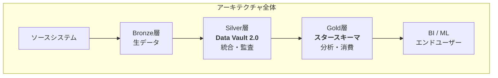
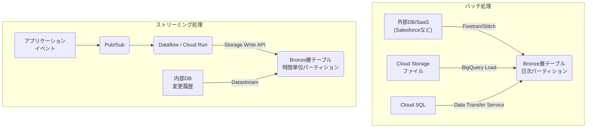
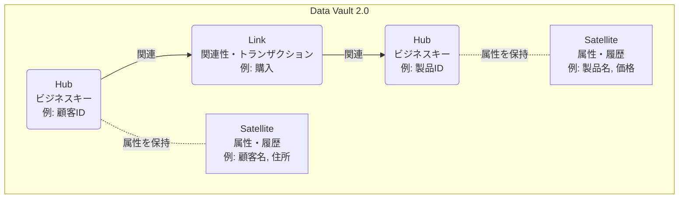
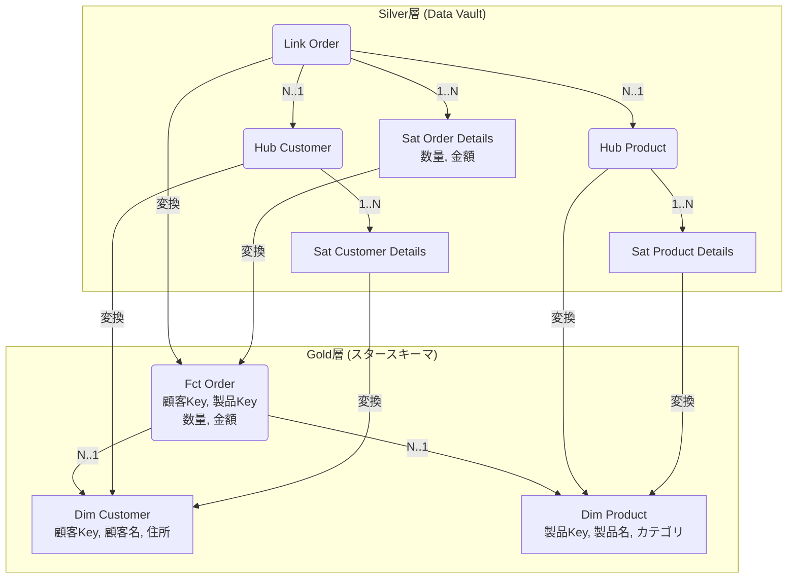
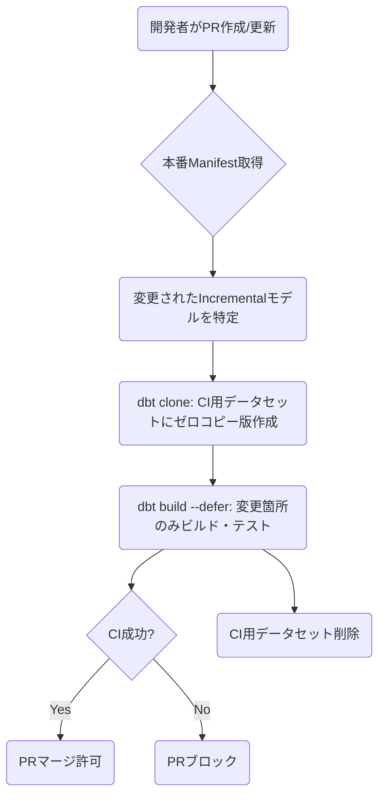
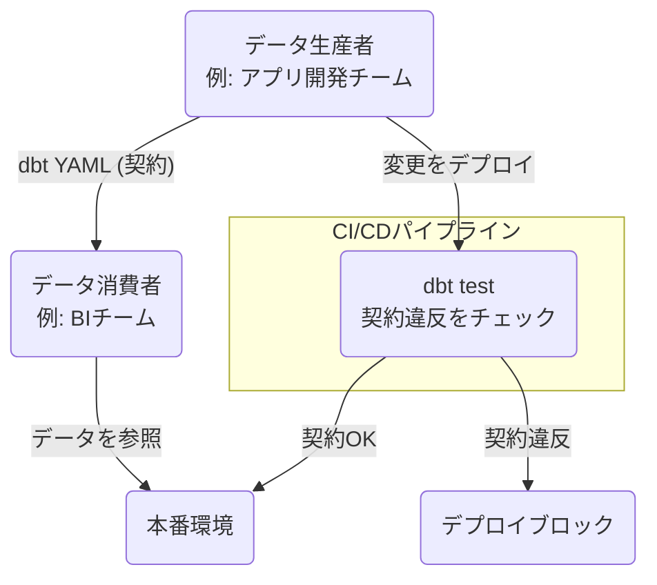

## はじめに

モダンデータスタック(MDS)の中核として、**Google BigQuery**と**dbt Core**の組み合わせは、今やデファクトスタンダードの一つです。しかし、その強力な基盤の上で、いかにして「スケーラブル」で「信頼でき」、「保守性の高い」データプラットフォームを構築するかは、多くのデータエンジニアが直面する共通の課題です。

- *「メダリオンアーキテクチャを採用したいが、BigQuery上でどう実装するのが最適か？」*
- *「Silver層（統合層）が複雑化し、変更に弱くなってしまった...」*
- *「dbtのCI/CDパイプラインを、GCP環境でどう組むのがベストプラクティス？」*

この記事は、これらの課題に対する一つの**実践的な設計図**です。


**記事の位置づけ：Databricks版に対する「BigQuery版」**

以前、Databricks (Delta Lake) を基盤としたデータプラットフォーム構築に関して、以下の2つの記事を公開しました。

https://zenn.dev/suwash/articles/data_pf_arch_20250902

https://zenn.dev/suwash/articles/databricks_dbt_cicd_20250905

この記事は、GCPに特化した内容です。アーキテクチャの論理設計から、BigQuery特有の物理設計（パーティショニング・クラスタリング）、dbtパッケージを用いたData Vaultの具体的な実装、そして「Slim CI」や「Blue/Greenデプロイ」など、データプラットフォームのライフサイクル全体を網羅的に解説します。


## 第1章 アーキテクチャの全体像：メダリオン、Data Vault、スタースキーマの統合

現代のデータ駆動環境において、データプラットフォームのアーキテクチャは競争優位性の根幹です。本章では、Google BigQueryとdbt Coreを技術基盤とするアーキテクチャの全体像を示します。全体的なフレームワークとして**メダリオンアーキテクチャ**を採用します。その中で、データモデリング手法として**Data Vault 2.0**と**スタースキーマ**を戦略的に配置します。この設計は、アジリティ、ガバナンス、スケーラビリティ、パフォーマンスを高い次元で両立するため、意図的な構造分離に基づきます。

### 1.1. GCP上のモダンデータスタック：パラダイムシフト

データプラットフォームは、モノリシックなオンプレミスDWHから、クラウドネイティブな「モダンデータスタック」へ移行しました。この新しいスタックは、各機能領域で最適なツールを組み合わせ、柔軟性と拡張性を最大化することを特徴とします。この文脈において、BigQueryはサーバーレス基盤として、dbtはデータ変換レイヤーのデファクトスタンダードとしての位置づけです。

このアーキテクチャは、**ELT（Extract, Load, Transform）** という思想に基づきます。従来のETLとは異なり、まず生データをそのままDWHにロード（Load）します。その後、BigQueryの強力な計算能力を活用して変換（Transform）を実行します。このアプローチは、変換ロジックの変更を容易にします。また、生データを常に保持するため、将来のユースケースにも対応できる柔軟性を確保します。

### 1.2. メダリオンアーキテクチャ：段階的なデータ成熟度のフレームワーク

メダリオンアーキテクチャは、データを論理的に整理し、品質と構造を段階的に向上させるデータ設計パターンです。データのライフサイクルを3つの明確な層（Bronze, Silver, Gold）に分割し、パイプラインの複雑さを管理します。

  * **Bronze（生データ層）**
    ソースシステムからのデータを一切変更せず、そのままの形で格納する不変のランディングゾーンです。主な目的は、ソースデータの完全な履歴アーカイブを提供し、監査可能性を確保する点です。また、下流のロジック変更時に、ソースシステムに再接続せずデータを再処理できるようにします。この層のデータは、下流のテーブルを再構築するための信頼できる基盤です。
  * **Silver（クレンジング・適合済みデータ層）**
    統合と検証のレイヤーです。Bronze層の生データをここでクレンジングします。重複排除、標準化、他データソースとの結合（適合）、エンリッチメント（情報付与）を実行します。Silver層の目標は、主要なビジネスエンティティ（顧客、製品など）に関する「全社的な視点」を提供し、信頼できる単一の真実の源（Single Source of Truth）を構築する点です。
  * **Gold（ビジネス利用向けデータ層）**
    最終的なプレゼンテーションレイヤーです。Silver層のデータを、特定のビジネス要件やユースケースに合わせてさらに集計、非正規化、構造化します。BIツールによるレポーティング、アドホック分析、機械学習（ML）モデルのフィーチャーストアなど、エンドユーザーが直接利用するデータ製品をこの層に配置します。

### 1.3. シナジーと戦略的配置：SilverにData Vault、Goldにスタースキーマ

本アーキテクチャの核心は、それぞれの長所が最大限に発揮される層に、モデリング手法を戦略的に配置する点です。

  * **Silver層におけるData Vault 2.0**
      * **目的:** スケーラブルで柔軟、かつ監査可能な統合データコアの構築。Data Vault 2.0は、変化し続ける複数ソースからのデータを調和させ、完全で追跡可能な履歴を保持する能力に優れています。
      * **長所:** その構造（ハブ、リンク、サテライト）は、スキーマの変更やビジネスプロセスの進化に対して高い耐性を持ちます。これは、様々なデータが交錯する統合レイヤーにとって理想的な特性です。ビジネスキー（ハブ）、関連性（リンク）、記述的な属性（サテライト）を分離し、並列でのデータロードやアジャイルな開発を可能にします。
  * **Gold層におけるスタースキーマ**
      * **目的:** エンドユーザー（BIツール、アナリスト）が消費するための、シンプルで高性能なデータモデルの提供。
      * **長所:** 中心となるファクトテーブルと、それを取り囲む非正規化されたディメンションテーブルという構造が、複雑なJOINを最小限に抑え、クエリのパフォーマンスを劇的に向上させます。また、ビジネスユーザーにとって直感的に理解しやすい構造であるため、セルフサービス分析を促進します。これは分析に最適化された形式であり、統合のための形式とは異なります。

<!-- end list -->



| 要素名 | 説明 |
| :--- | :--- |
| **ソースシステム** | データの発生源（例: CRM, ERP, アプリログ） |
| **Bronze層** | ソースデータをそのままの形式で格納する層 |
| **Silver層** | Data Vault 2.0モデルを使用し、データを統合・クレンジング・履歴管理する層 |
| **Gold層** | スタースキーマモデルを使用し、ビジネス分析用にデータを最適化・集計する層 |
| **BI / ML** | Gold層のデータを消費するエンドユーザーやアプリケーション |

このアーキテクチャ設計は、**「統合」の問題と「消費」の問題を意図的に分離する**設計思想に基づきます。従来のDWH設計では、これら二つの問題が混同され、硬直的で変更が困難なモデルを生み出す傾向がありました。メダリオンアーキテクチャはこの分離のためのフレームワークを提供します。Data Vaultは「統合」の問題（Silver層）に、スタースキーマは「消費」の問題（Gold層）に、それぞれ特化した最適な解決策を提供します。

このハイブリッドアプローチにより、Silver層のData Vaultが安定した監査可能な基盤として機能し、その上でGold層のアジリティを確保します。ビジネスニーズの変化に応じて、部門ごと、あるいはユースケースごとに多数のスタースキーマ・データマートを迅速に構築、変更、あるいは破棄することを可能にします。このとき、Silver層の歴史的な完全性は損なわれず、ソースデータの再統合も不要です。

**メダリオンアーキテクチャの各層の責務**

| **層** | **主な目的** |
| :--- | :--- |
| **Bronze** | 生データの取り込みとアーカイブ |
| **Silver** | 統合、適合、履歴管理 |
| **Gold** | プレゼンテーション、ビジネス集計 |

**Data Vaultの特性（スタースキーマとの比較）**

| **主要な特性** | **Data Vault 2.0 (Silver層)** |
| :--- | :--- |
| **正規化** | 高度に正規化（ハブ、リンク、サテライトへの分離） |
| **柔軟性/アジリティ** | 高い。新規ソースの統合が容易で、既存モデルへの影響が少ない。 |
| **監査可能性** | 非常に高い。ロード日時とソースを記録し、完全な履歴を保持する設計。 |
| **クエリパフォーマンス** | 低い。分析クエリには多数のJOINが必要となり、複雑で低速。 |
| **BIツールでの利用** | 困難。ビジネスユーザーが直接クエリするには複雑すぎる。 |

### 1.4. エンドツーエンドのデータフロー概要

このアーキテクチャにおけるデータの流れは、以下の通りです。

1.  **抽出とロード (Extract & Load):** FivetranのようなELTツールやカスタムパイプラインを用いて、様々なソースシステムからデータを抽出します。一切の変換を加えずBigQueryの**Bronze層**にロードします。
2.  **Silver層への変換:** dbtを用いて、Bronze層の生データを変換します。**Silver層**にData Vault 2.0モデル（ハブ、リンク、サテライト）として格納します。この段階で、データのクレンジング、ビジネスキーのハッシュ化、重複排除などを実行します。
3.  **Gold層への変換:** 再びdbtを用いて、Silver層のData Vaultモデルからデータを抽出します。ビジネスロジックを適用しながら、分析に最適化された**Gold層**のスタースキーマ（ファクトテーブル、ディメンションテーブル）へと変換します。
4.  **データ消費 (Consumption):** BIツール（例：Looker）、MLモデル、その他のデータアプリケーションがGold層のデータマートに接続し、インサイトを生成します。

この一貫した流れにより、生データの取り込みから価値あるインサイトの提供まで、追跡可能で信頼性が高く、効率的なデータパイプラインを実現します。

## 第2章 Bronze層：生データ基盤の確立

Bronze層は、データプラットフォーム全体の信頼性と監査可能性を支える礎です。この層の設計と運用が不十分な場合、下流のSilver層やGold層で洗練されたモデリングを行っても、その価値は大きく損なわれます。「ガベージイン、ガベージアウト」の原則は、ここから始まります。本章では、Bronze層の基本原則、BigQueryへの具体的なデータ取り込みパターン、そしてこの層におけるdbtの役割とベストプラクティスを詳述します。

### 2.1. Bronze層の基本原則

Bronze層を構築する上で遵守すべき基本原則は、データの完全性と再現性を保証する点に集約します。

  * **不変性 (Immutability):** 一度Bronze層に書き込まれたデータは、更新・削除を避けてください。データは常に追加（append-only）し、ソースシステムで発生した全ての変更履歴を保持します。
  * **生の状態 (Raw Structure):** データはソースシステムのスキーマ構造をそのまま維持します。カラム名の変更やデータ型のキャストといった変換は、この層では原則として実行しません。これにより、ソースとのトレーサビリティを明確にします。
  * **完全な履歴アーカイブ (Full Historical Archive):** Bronze層は、ソースデータの完全な履歴を保持する「コールドストレージ」としての役割を果たします。これにより、将来的に下流の変換ロジックが変更されたり、誤りが発見されたりした場合でも、いつでもBronze層からパイプラインを再実行し、正しい状態を再構築できます。

これらの原則を徹底し、Bronze層をデータプラットフォーム全体の信頼できる出発点とします。

### 2.2. データ取り込み戦略：Extract & Load

dbtはあくまで変換（Transform）ツールであり、データの抽出（Extract）やロード（Load）は責務外です。したがって、Bronze層へのデータ取り込みは、dbtの外部にあるプロセスが実行します。ソースシステムの場所（GCP内部か外部か）とデータの性質（バッチかストリーミングか）に応じて、最適な取り込み戦略を選択します。



| 要素名 | 説明 |
| :--- | :--- |
| **バッチ処理** | 定期的なデータ同期（例: 日次）のパターン |
| **ストリーミング処理** | リアルタイムまたはニアリアルタイムなデータ取り込みのパターン |
| **Fivetran/Stitch** | SaaSや外部DBからのデータ取り込みを自動化するELTツール |
| **BigQuery Load** | GCS上のファイルからBigQueryへロードするバッチジョブ |
| **Data Transfer Service** | GCP内サービス（Cloud SQLなど）からBigQueryへデータを転送するマネージドサービス |
| **Pub/Sub** | イベントデータを受け取るためのスケーラブルなメッセージングサービス |
| **Dataflow / Cloud Run** | ストリーミングデータを処理し、BigQueryへ書き込むためのコンピュートサービス |
| **Datastream** | DBの変更履歴（CDC）をキャプチャし、BigQueryへストリーミングするサービス |
| **BQ\_Batch / BQ\_Stream** | BigQuery内のBronze層テーブル。取り込みパターンに応じたパーティショニングが重要。 |

#### 2.2.1. バッチ処理パターン

定期的なデータ同期で十分な場合に適しています。ロード処理の実行サイクルに合わせてBronze層のテーブルをパーティショニングすることが極めて重要です。

  * **GCP内部ソース (例: Cloud SQL):**
      * **BigQuery Data Transfer Service:** Cloud SQLなどのGCP内データベースからの定期的なデータ転送を、コーディングなしで設定できるマネージドサービスです。シンプルで信頼性の高いバッチロードの第一候補です。
  * **GCP外部ソース (例: Salesforce, オンプレミスDB):**
      * **自動ELTツール (推奨):** FivetranやStitchといったマネージドELTサービスは、SaaS APIや外部データベースからのデータ取り込みにおけるベストプラクティスです。スキーマ変更の追跡などを自動化し、最小限の工数で高い信頼性を提供します。
      * **Cloud Storageからのバッチロード:** カスタムデータソースや大規模なファイル転送で一般的なパターンです。データをGCSに配置し、BigQueryのロードジョブを起動します。

#### 2.2.2. ストリーミング処理パターン

リアルタイム性が求められるユースケースで採用されます。書き込み性能を最優先し、rawテーブルはシンプルな構造にするのが鉄則です。

  * **GCP内部ソース (例: Cloud SQLの変更履歴):**
      * **Datastream for BigQuery:** GCPネイティブのCDC（Change Data Capture）サービスです。Cloud SQLなどのデータベースの変更を低遅延でキャプチャし、BigQueryに直接同期します。
  * **GCP内外のイベントデータ:**
      * **Pub/Sub + Dataflow/Cloud Run:** GCPにおける標準的なストリーミングパターンです。Pub/Subを介してデータを受け取り、BigQuery Storage Write APIを使用してBigQueryに直接書き込みます。Dataflowは高度な集計やウィンドウ処理、Cloud Runは軽量な個別メッセージ処理に適しています。

### 2.3. Bronze層のテーブルレイアウトとパーティショニング

データの取り込み方式によって、Bronze層のテーブルレイアウトは異なります。

  * **バッチ処理の場合 (構造化レイアウト):**
    ソースシステムのスキーマをそのまま反映した構造化テーブルとしてロードします。日次バッチであれば、日次パーティションを作成すると、後続のdbt処理のスキャン量を劇的に削減できます。
    **テーブルレイアウト例 (bronze\_fivetran\_salesforce.orders):**

    ```sql
    CREATE TABLE bronze_fivetran_salesforce.orders (
      Id STRING,
      AccountId STRING,
      OrderNumber STRING,
      TotalAmount FLOAT64,
      EffectiveDate DATE,
      _fivetran_synced TIMESTAMP
    )
    PARTITION BY
      DATE(EffectiveDate);
    ```

  * **ストリーミング処理の場合 (半構造化レイアウト):**
    書き込み性能とスキーマ変更への耐性を最優先するため、キー項目とJSONペイロードのようなシンプルなレイアウトを推奨します。取り込み時間による細かい粒度（例：時間単位）でのパーティショニングが必須です。
    **テーブルレイアウト例 (bronze\_streaming.events):**

    ```sql
    CREATE TABLE bronze_streaming.events (
      event_id STRING,
      ingestion_timestamp TIMESTAMP,
      payload JSON
    )
    PARTITION BY
      TIMESTAMP_TRUNC(ingestion_timestamp, HOUR);
    ```

### 2.4. Bronze層におけるdbtの役割

Bronze層へのデータロードはdbtの責務外です。しかし、dbtはこの層においてデータガバナンスとパイプラインの信頼性を確保するための重要な役割を担います。

  * **ソースの定義:**
    dbtの最も重要な役割は、取り込まれた生テーブルを`sources.yml`ファイル内で`source`として宣言する点です。これにより、dbtはこれらのテーブルをデータリネージ（系統）グラフの起点として認識し、パイプライン全体の依存関係を可視化できます。
  * **ソース鮮度（Freshness）のチェック:**
    `sources.yml`ファイルに`freshness`ブロックを設定し、データ取り込みプロセスを監視できます。dbtは、指定された`loaded_at_field`（ロード日時を記録したカラム）の最新タイムスタンプをチェックします。設定した閾値（`warn_after`, `error_after`）を超えてデータが更新されていない場合に警告やエラーを発生します。これにより、取り込みジョブの遅延や失敗を早期に検知し、データパイプライン全体の信頼性を維持できます。
    ```yaml
    # models/staging/jaffle_shop/sources.yml
    version: 2

    sources:
      - name: jaffle_shop
        database: raw
        schema: jaffle_shop
        tables:
          - name: orders
            loaded_at_field: _etl_loaded_at # Ingestion process must add this column
            freshness:
              warn_after: {count: 12, period: hour}
              error_after: {count: 24, period: hour}
    ```
  * **初期ステージングモデル（Staging Models）:**
    Bronze層の生テーブルの上にステージングモデルを作成するプラクティスを強く推奨します。これらのモデルの役割は、ごく基本的な変換に限定し、後続のモデルにクリーンで一貫性のあるインターフェースを提供します。データの流入パターンによって、最適な物理実装（マテリアライゼーション）が変わります。
      * **バッチ処理の場合 (view):**
        Bronze層が既に構造化されているため、stgモデルはカラム名の変更やデータ型のキャストといった軽量な変換のみ行います。`view`としてマテリアライズし、ストレージコストをかけずに常に最新のBronze層データを反映できます。
        **dbtモデル例 (models/staging/salesforce/stg\_salesforce\_orders.sql):**
        ```sql
        {{ config(materialized='view') }}

        SELECT
            Id AS order_id,
            AccountId AS account_id,
            OrderNumber AS order_number,
            TotalAmount AS total_amount,
            EffectiveDate AS effective_date,
            _fivetran_synced AS _synced_at
        FROM
            {{ source('salesforce', 'orders') }}
        ```
      * **ストリーミング処理の場合 (incremental):**
        Bronze層のJSONペイロードをパースする処理は計算コストが高いため、stgモデルを`incremental`な`table`として実体化します。これにより、高コストなパース処理を一度だけ実行し、その結果（構造化されたテーブル）を後続のモデルで再利用できます。
        **dbtモデル例 (models/staging/streaming/stg\_streaming\_events.sql):**
        ```sql
        {{
            config(
                materialized='incremental',
                partition_by={'field': 'event_timestamp', 'data_type': 'timestamp', 'granularity': 'day'}
            )
        }}

        SELECT
            JSON_VALUE(payload, '$.event_id') AS event_id,
            CAST(JSON_VALUE(payload, '$.timestamp') AS TIMESTAMP) AS event_timestamp,
            JSON_VALUE(payload, '$.user_id') AS user_id,
            ingestion_timestamp
        FROM
            {{ source('streaming', 'events') }}

        
        WHERE ingestion_timestamp > (SELECT MAX(ingestion_timestamp) FROM {{ this }})
        
        ```

### 2.5. Bronze層のベストプラクティス

  * **メタデータの付与:**
    すべてのデータ取り込みプロセスは、ロードするデータに加えて、メタデータカラムを付与します。最低限、`_ingestion_timestamp`（取り込み日時）、`_source_system_identifier`（ソースシステム識別子）、`_batch_id`（バッチID）などを含めると、監査可能性と増分処理の信頼性が大幅に向上します。
  * **データセットの分離:**
    BigQueryでは、ソースシステムごと、あるいは取り込みツールごとにデータセットを分離すること（例：`bronze_fivetran_salesforce`, `bronze_gcs_applogs`）を推奨します。これにより、論理的な分離を明確にし、権限管理も容易にします。

Bronze層の厳格な管理は、データプラットフォーム全体の信頼性と監査可能性を直接的に決定します。メダリオンアーキテクチャが約束する「生データからの下流テーブルの再構築可能性」は、この層のデータが完全かつ不変であり、その出所を理解するための十分なメタデータと共にキャプチャされている場合にのみ有効です。

## 第3章 Silver層：Data Vault 2.0による統合・監査可能コアの構築

Silver層は、データプラットフォームの心臓部として、多様なソースから集められた生データを、全社的に信頼できる統合された資産へと昇華させる役割を担います。本アーキテクチャでは、この重要な層のモデリング手法としてData Vault 2.0を採用します。Data Vault 2.0は、その柔軟性、拡張性、監査可能性から、現代のデータ環境における統合レイヤーとして最適な選択肢です。本章では、Data Vault 2.0の核心的な概念を確認し、dbtパッケージを活用してこのモデルをBigQuery上に効率的に実装する具体的な手順を詳述します。

### 3.1. Data Vault 2.0の核心概念

Data Vault 2.0は、ビジネスの関心事を3つの基本的なエンティティタイプに分解します。この構造が、モデルの柔軟性と拡張性の源泉です。

  * **ハブ (Hubs):**
    ビジネスにおける中核的な概念（顧客、製品、店舗など）を一意に識別する「ビジネスキー」を格納します。例えば、`customer_id`や`product_sku`が該当します。ハブはモデルの構造的な背骨を形成し、最小限のメタデータ（ビジネスキーのハッシュ値、ロード日時、ソースシステム）のみを保持します。記述的な属性は含みません。
  * **リンク (Links):**
    ハブ間の関連性やトランザクション（取引）を表現します。例えば、「顧客が製品を購入する」というイベントは、顧客ハブと製品ハブを結びつけるリンクとしてモデル化します。リンクは本質的に、関連するハブのハッシュキーを外部キーとして保持する多対多のJOINテーブルです。
  * **サテライト (Satellites):**
    ハブやリンクに関する記述的、文脈的、歴史的な属性情報を格納します。顧客の氏名や住所、製品の色や価格といった、時間とともに変化する可能性のあるデータをすべてサテライトに保持します。サテライトは、ロード日時をキーの一部として持ち、属性のすべての変更履歴を追跡します。

<!-- end list -->



| 要素名 | 説明 |
| :--- | :--- |
| **Hub (ハブ)** | ビジネスの中核概念（顧客、製品など）の「ビジネスキー」を格納 |
| **Link (リンク)** | ハブ間の関連性やトランザクション（購入、契約など）を表現 |
| **Satellite (サテライト)** | ハブやリンクに紐づく、時間と共に変化する属性情報（名前、住所、価格など）と完全な履歴を格納 |

この3つのコンポーネントにデータを分離することで、例えば新しいソースから「顧客」に関する新たな属性が追加された場合、既存のハブやサテライトを変更せずに、新しいサテライトを追加するだけでモデルを拡張できます。この変更への耐性が、Data Vaultの最大の利点の一つです。

### 3.2. dbtによるRaw Data Vaultの実装

Data Vaultモデルをゼロから手作業で実装するのは、ハッシュキーの計算や変更差分の検出など、非常に複雑でエラーが発生しやすい作業です。そのため、専用のdbtパッケージを利用することが、事実上の標準であり、クリティカルなベストプラクティスとなります。これらのパッケージは、複雑なSQLロジックをマクロとして抽象化し、開発者がメタデータを定義するだけで、必要なDML文を自動生成します。

  * **dbtパッケージの選択:**

      * **AutomateDV (旧 dbtvault):** 最も広く利用されているパッケージの一つです。自動化指向で、迅速なデプロイメントに適しています。
      * **datavault4dbt:** より新しいパッケージで、Data Vault 2.0標準への準拠性が高いことや、より多くのエンティティタイプをサポートしていることを特徴とします。

  * **実装ステップ・ウォークスルー:**
    dbtパッケージを使用したData Vaultの実装は、通常、以下のステップで進めます。

    1.  **ステージング層の準備 (Staging):**
        Vaultにデータをロードする前の極めて重要な準備段階です。このステージングモデルは、Vaultロード用マクロが要求する形式にデータを整形する役割を担います。

          * **ハッシュキーの計算:** ハブのビジネスキーやリンクの関連キーから、ハッシュ関数（BigQueryなら`MD5`など）を用いて一意なハッシュキーを生成します。
          * **ハッシュ差分 (Hash Diff) の計算:** サテライトに格納する属性群（ペイロード）を連結し、そのハッシュ値を計算します。これにより、属性に変更があったかどうかを効率的に検出できます。
          * **メタデータカラムの標準化:** `record_source`（レコードソース）、`load_dts`（ロード日時）といった必須のメタデータカラムを付与し、名前を標準化します。

        dbtパッケージ（AutomateDVなど）は、これらの処理を自動化する便利な`stage`マクロを提供しますが、その内部で行われている処理のイメージは以下のようになります。

        **dbtモデル例 (models/staging/salesforce/stg\_salesforce\_customers\_for\_vault.sql):**

        ```sql
        -- このステージングモデルは、dbtvault.stageマクロを使うか、
        -- もしくは以下のように手動でハッシュキーを計算する

        WITH source_data AS (
            SELECT
                Id AS CUSTOMER_ID,
                Name AS CUSTOMER_NAME,
                BillingAddress AS CUSTOMER_ADDRESS,
                _fivetran_synced AS LOAD_DATE,
                'SALESFORCE' AS RECORD_SOURCE
            FROM {{ source('salesforce', 'customers') }}
        ),

        -- dbtvault.stageマクロを使うと、以下のハッシュ計算や
        -- メタデータカラムの追加を自動化できる
        hashed_stage AS (
            SELECT
                -- 1. ハッシュキー (PK): ビジネスキーから生成 (dbtvaultはデフォルトでMD5を使用)
                TO_HEX(MD5(CAST(CUSTOMER_ID AS STRING))) AS CUSTOMER_PK,
                
                -- 2. ハッシュ差分 (Hashdiff): 属性カラムを連結してハッシュ化
                TO_HEX(MD5(
                    IFNULL(CAST(CUSTOMER_NAME AS STRING), '') || '|' ||
                    IFNULL(CAST(CUSTOMER_ADDRESS AS STRING), '')
                )) AS HASHDIFF,
                
                -- 3. ペイロード (属性カラム)
                CUSTOMER_NAME,
                CUSTOMER_ADDRESS,
                
                -- 4. メタデータ
                LOAD_DATE,
                RECORD_SOURCE,
                
                -- 5. ビジネスキー (NK)
                CUSTOMER_ID AS CUSTOMER_UK -- dbtvaultのマクロ用に別名をつける
            FROM source_data
        )

        SELECT * FROM hashed_stage
        ```

        このステージングモデルにより、後続の`hub`や`satellite`マクロは、標準化されたカラム名（`CUSTOMER_PK`, `HASHDIFF`, `LOAD_DATE`など）を参照するだけで、冪等性（べきとうせい）を持ったロード処理（差分更新）を実行できます。

    2.  **ハブの構築 (Building Hubs):**
        パッケージの`hub`マクロを使用します。入力として**上記で作成したステージングモデル**を指定し、ビジネスキーとして使用するカラムを`src_nk`で指定します。マクロは、ステージングモデルに存在する新しいビジネスキーのみをハブテーブルに挿入するSQLを生成します。
        **dbtモデル例 (models/silver/hubs/hub\_customer.sql):**

        ```sql
        {{ config(materialized='incremental') }}

        
        
        
        
        

        {{ dbtvault.hub(src_pk=src_pk, src_nk=src_nk, src_ldts=src_ldts,
                         src_source=src_source, source_model=source_model) }}
        ```

    3.  **リンクの構築 (Building Links):**
        `link`マクロを使用します。ステージングモデル、リンク自身の主キー、そして外部キーとして参照する親ハブのハッシュキーを指定します。

    4.  **サテライトの構築 (Building Satellites):**
        `satellite`マクロを使用します。ステージングモデル、親となるハブまたはリンクのハッシュキー、属性ペイロード、および変更検出に使用するハッシュ差分カラムを指定します。マクロは、ハッシュ差分が既存のレコードと異なる場合にのみ新しいレコードを挿入するロジックを生成し、効率的に変更履歴をキャプチャします。
        **dbtモデル例 (models/silver/sats/sat\_customer\_details.sql):**

        ```sql
        {{ config(materialized='incremental') }}

        
        
        
        
         -- 有効開始日としてLOAD_DATEを使用
        
        

        {{ dbtvault.satellite(src_pk=src_pk, src_hashdiff=src_hashdiff,
                               src_payload=src_payload, src_eff=src_eff,
                               src_ldts=src_ldts, src_source=src_source,
                               source_model=source_model) }}
        ```

dbtパッケージの活用は、Data Vaultの実装を、エラーが発生しやすく手間のかかる手作業から、メタデータ駆動の自動化されたプロセスへと変革します。dbtのマクロとパッケージシステムにより、導入の複雑さと開発オーバーヘッドが大幅に軽減します。開発者は複雑なDML文の記述から解放され、メタデータの定義に集中できます。

### 3.3. 高度なData Vault概念

Data Vaultモデルは、基本的なエンティティに加え、より複雑なビジネスシナリオを表現するための高度なパターンも提供します。

  * **多重アクティブサテライト (Multi-Active Satellites):**
    一つのビジネスエンティティが、同時に複数の有効な状態を持つ場合に使用します。例えば、一人の顧客が同時に複数の有効なローン契約を持つ場合、各ローン契約の詳細は多重アクティブサテライトに格納します。
  * **従属キー (Dependent-Child Keys):**
    親エンティティなしには存在し得ない子エンティティという階層関係を表現するために使用します。例えば、銀行口座に紐づく複数の署名者などが該当します。

これらの高度なパターンはモデルの表現力を高め、同時に複雑性も増します。ビジネス要件を慎重に分析した上で適用を検討します。

### 3.4. ビジネスボルト (Business Vault)

これまで説明してきたハブ、リンク、サテライトは、ソースデータをビジネスルールを適用せずに格納する「**Raw Vault**」を構成します。これに対して、「**Business Vault**」は、Raw Vaultの上に構築されるオプションのレイヤーです。

Business Vaultでは、複数のソースからのデータを統合して導出された情報や、ビジネスルールに基づいて計算された結果（例：顧客生涯価値）を、引き続きData Vaultの構造で格納します。

Raw Vaultをソースの忠実な記録として純粋に保ちつつ、再利用性の高いビジネスロジックを中央集権的に適用する場所を提供します。これにより、後続のGold層（データマート）の構築を簡素化し、ロジックの一貫性を維持できます。

## 第4章 Gold層：スタースキーマとデータマートによるビジネス価値の提供

Gold層は、データプラットフォームの最終成果物をエンドユーザーに届けるためのプレゼンテーションレイヤーです。Silver層にData Vaultとして統合・保管されたデータは、監査可能で柔軟性がありますが、そのままでは分析クエリに不向きです。Gold層の役割は、この複雑なData Vaultモデルを、ビジネスユーザーが直感的に理解でき、BIツールが高速にクエリできる、目的に特化したデータマートへと変換する点です。本アーキテクチャでは、そのための主要なモデリング手法としてスタースキーマを採用します。

### 4.1. 分析のためのディメンショナルモデリングの原則

スタースキーマは、実績のあるディメンショナルモデリング手法です。その構造はシンプルで強力です。

  * **ファクト (Facts):**
    ビジネスプロセスにおける測定可能なイベントや数値（例：「売上金額」や「注文数量」）を格納します。ファクトテーブルは通常、数値データと、ディメンションテーブルへの外部キーで構成します。
  * **ディメンション (Dimensions):**
    ファクトを分析するための文脈（コンテキスト）を提供します。「誰が」「何を」「いつ」「どこで」といった情報を格納します。例えば、「顧客ディメンション」には顧客の氏名、年齢、住所などが、「製品ディメンション」には製品名、カテゴリ、ブランドなどが含まれます。

スタースキーマの目標は、ビジネスユーザーの分析的な思考プロセスに沿ったデータ構造を提供することです。非正規化されたディメンションテーブルにより、分析クエリは少数のJOINで完結し、高いパフォーマンスを発揮します。

### 4.2. dbtによるData Vaultからスタースキーマへの変換

Silver層のData VaultからGold層のスタースキーマへの変換は、高度に正規化された構造を、分析目的に合わせて非正規化するプロセスです。これは、データに特定のビジネス的な視点、つまり「意見」を付与する行為でもあります。



| 要素名 | 説明 |
| :--- | :--- |
| **Silver層 (Data Vault)** | 高度に正規化された統合データ（ハブ、リンク、サテライト） |
| **Gold層 (スタースキーマ)** | 分析用に非正規化されたデータ（ファクト、ディメンション） |
| **Hub / Satellite** | 結合・非正規化され、ディメンションテーブル (`Dim`) を構築 |
| **Link / Satellite** | 結合・集計され、ファクトテーブル (`Fct`) を構築 |

  * **ディメンションテーブルの構築:**
    ディメンションテーブルは、Data Vaultのハブと、それに紐づく一つ以上のサテライトをJOINして構築します。
    **dbtモデル例 (models/marts/core/dim\_customers.sql):**

    ```sql
    {{ config(materialized='table') }}

    WITH latest_satellite AS (
        SELECT
            customer_pk,
            customer_name,
            customer_address,
            -- ウィンドウ関数を使い、顧客ごとの最新のレコードを特定
            ROW_NUMBER() OVER(PARTITION BY customer_pk ORDER BY load_date DESC) as rn
        FROM {{ ref('sat_customer_details') }}
    )
    SELECT
        -- ディメンションテーブル用の代理キー（サロゲートキー）を生成
        h.customer_pk as customer_dim_key, -- DVのハッシュキーをそのまま使うか、dbt_utils.generate_surrogate_keyでも良い
        h.customer_uk as customer_business_key, -- 元のビジネスキー
        ls.customer_name,
        ls.customer_address
    FROM {{ ref('hub_customer') }} h
    LEFT JOIN latest_satellite ls
        ON h.customer_pk = ls.customer_pk
    WHERE ls.rn = 1 -- 最新のレコードのみを選択
    ```

  * **ファクトテーブルの構築:**
    ファクトテーブルは、主にData Vaultのリンクと、それに関連するサテライトから構築します。
    **dbtモデル例 (models/marts/finance/fct\_orders.sql):**

    ```sql
    {{ config(materialized='incremental', partition_by={'field': 'order_date', 'data_type': 'date'}) }}

    SELECT
        -- ファクトテーブル用の代理キーを生成
        {{ dbt_utils.generate_surrogate_key(['l.order_pk', 's.load_date']) }} as order_fact_key,
        dc.customer_dim_key,
        dp.product_dim_key,
        l.order_date, -- LinkまたはSatから取得
        s.quantity,
        s.price,
        s.quantity * s.price as line_total
    FROM {{ ref('link_order') }} l
    LEFT JOIN {{ ref('sat_order_details') }} s
        ON l.order_pk = s.order_pk
    LEFT JOIN {{ ref('dim_customers') }} dc
        ON l.customer_pk = dc.customer_dim_key
    LEFT JOIN {{ ref('dim_products') }} dp
        ON l.product_pk = dp.product_dim_key

    -- サテライトは履歴を持つため、最新のレコードのみをJOIN対象とする
    WHERE s.load_date = (
        SELECT MAX(s_inner.load_date) 
        FROM {{ ref('sat_order_details') }} s_inner 
        WHERE s_inner.order_pk = s.order_pk
    )

    
    -- 増分ロードのロジック (例: 直近3日分を再処理)
    AND l.order_date >= date_sub(current_date(), interval 3 day)
    
    ```

このSilverからGoldへの変換プロセスは、客観的な生データをビジネスの文脈に合わせて解釈し、意味を付与する重要なステップです。安定したSilver層を持つことの真価がここにあります。もしビジネスの視点が変わった場合でも、同じSilver層の「真実」から、全く新しいGold層のデータマートを迅速に構築できます。ソースからの再処理は不要です。

### 4.3. ユースケース特化型データマートの作成

Gold層は単一の巨大なスタースキーマである必要はありません。むしろ、特定のビジネスドメインや分析要件に特化した複数のデータマートの集合体として構築します。例えば、財務部門向けの`finance_mart`、マーケティング部門向けの`marketing_mart`といった形で、それぞれの部門が必要とするディメンションとファクトを組み合わせた、自己完結型のマートを構築します。

さらに、ダッシュボードの表示速度を向上させるために、頻繁に利用される高コストな集計処理をあらかじめ計算し、その結果を格納しておく「集計テーブル（サマリーテーブル）」を作成するプラクティスも重要です。

### 4.4. Gold層のマテリアライゼーション戦略

Gold層のモデルは、エンドユーザーやBIツールから頻繁に直接クエリされるため、最高のパフォーマンスを求めます。したがって、マテリアライゼーション戦略として`table`または`incremental`を選択することがほぼ必須です。

`view`としてマテリアライズすると、クエリ実行のたびにSilver層からGold層への複雑な変換処理が実行され、パフォーマンスが著しく低下します。事前に計算結果を物理的なテーブルとして保持すると、ユーザーは瞬時に分析結果を得られます。

## 第5章 dbt CoreとBigQuery：プラットフォーム特化のベストプラクティス

アーキテクチャの論理設計が優れていても、技術スタック上での物理的な実装が最適化されていない場合、その価値は半減します。特に、BigQueryのような従量課金制のDWHでは、非効率な実装はパフォーマンスの低下だけでなく、予期せぬコスト増大に直結します。本章では、dbt CoreとBigQueryを最大限に活用し、本アーキテクチャを効率的、経済的、かつ持続可能に運用するための、具体的なベストプラクティスを詳述します。

### 5.1. 最適なdbtプロジェクト構造

dbtプロジェクトのディレクトリ構造は、コードの保守性、可読性、拡張性を決定する重要な要素です。メダリオンアーキテクチャの論理的な層構造を、dbtプロジェクトの物理的なディレクトリ構造に反映させる点が、一貫性を保つ上で極めて重要です。

以下に、本アーキテクチャに最適化された推奨ディレクトリ構造を示します。

| 項目 | 推奨dbtプロジェクトディレクトリ構造 (models/) |
| :--- | :--- |
| **ディレクトリ** | **目的と内容** |
| models/staging/ | **ステージング層:** ソースごとにサブディレクトリを作成（例：models/staging/salesforce/）。カラム名の変更、データ型のキャストなど、基本的な変換を行うモデル（stg\_プレフィックス）を配置。 |
| models/intermediate/ | **中間層:** 複数のソースを結合したり、複雑なビジネスロジックの中間ステップをカプセル化したりするなど、最終的な成果物ではないが再利用される変換ロジックを配置。 |
| models/silver/ | **Silver層:** Data Vault 2.0モデルを格納。サブディレクトリでエンティティを整理（例：models/silver/hubs/, models/silver/links/, models/silver/sats/）。 |
| models/marts/ | **Gold層:** エンドユーザー向けのデータマートを格納。ビジネスドメインごとにサブディレクトリを作成（例：models/marts/finance/, models/marts/marketing/）。ファクト（fct\_）、ディメンション（dim\_）、集計テーブルなどを配置。 |

この構造に従うことで、データのリネージを理解しやすくなり、新しい開発者がプロジェクトに参加する際の学習コストも低減します。

### 5.2. dbtによるBigQueryのパフォーマンス最適化

dbtの`config`ブロックを利用し、SQLモデル内からBigQueryの強力なパフォーマンス最適化機能（パーティショニング、クラスタリング、増分モデル）を宣言的に制御できます。

これらの物理設計を適用する際、\*\*Silver層（Data Vault）**と**Gold層（Star Schema）\*\*では、その目的と主なクエリパターンが根本的に異なるため、最適化の戦略も明確に区別することが不可欠です。

  * **Silver層の最適化:** 主にdbtジョブによる\*\*書き込み（ETL）\*\*の効率化を目的とします。
  * **Gold層の最適化:** 主にBIツールやアナリストによる\*\*読み取り（分析クエリ）\*\*のパフォーマンス向上を目的とします。

#### 1. パーティショニング (Partitioning)

巨大なテーブルを日付やタイムスタンプなどの列の値に基づいて小さなセグメント（パーティション）に分割する機能です。クエリ実行時に`WHERE`句でパーティション列を指定すると、BigQueryは不要なパーティションのスキャンをスキップ（パーティションプルーニング）し、処理データ量を劇的に削減できます。

##### Silver層のパーティショニング

  * **目的:** dbtによる増分ビルド（書き込み）の高速化。
  * **推奨キー:** **`load_date`** または **`load_timestamp`**（ロード日時）。
  * **理由:** Silver層へのクエリは「前回の実行以降にロードされたデータは何か？」というETLパターンが中心です。`load_date`でパーティショニングすることで、dbtの増分モデルは最新のパーティションのみをスキャンすればよくなり、日々のETLコストが大幅に削減されます。

**dbt設定例 (`models/silver/sats/sat_customer_details.sql`):**

```sql
{{
    config(
        materialized='incremental',
        partition_by={
            "field": "load_date",       -- ロード日時カラム
            "data_type": "timestamp",
            "granularity": "day"
        }
    )
}}
```

##### Gold層のパーティショニング

  * **目的:** エンドユーザーの分析クエリ（読み取り）の高速化。
  * **推奨キー:** **`order_date`**, **`event_timestamp`** などの**ビジネスイベント発生日**。
  * **理由:** Gold層へのクエリは「先月の売上は？」といったビジネス日付に基づく期間指定が中心です。`order_date`でパーティショニングすることで、ユーザーのクエリに対して不要な期間のデータをスキャン対象から除外でき、ダッシュボードの表示速度が劇的に向上します。
  * **対象:** 主に**ファクトテーブル**が対象です。ディメンションテーブルは通常パーティショニング不要です。

**dbt設定例 (`models/marts/finance/fct_orders.sql`):**

```sql
{{
    config(
        materialized='incremental',
        partition_by={
            "field": "order_date",      -- ビジネスイベントの日付カラム
            "data_type": "date",
            "granularity": "day"
        }
    )
}}
```

#### 2. クラスタリング (Clustering)

パーティション内で、指定した1つ以上の列の値に基づいてデータを物理的に並べ替えて格納する機能です。`WHERE`句でのフィルタリングや`JOIN`のキーとして頻繁に使用される高カーディナリティの列（例：`customer_id`）をクラスタリングキーに指定すると、BigQueryはスキャンするデータブロックをさらに細かく限定できます。

  * **Silver層での活用:** `customer_pk`（Hubのキー）などでクラスタリングすると、特定の顧客の履歴を追跡する監査クエリが効率化されます。
  * **Gold層での活用:**
      * **ファクトテーブル:** `customer_dim_key`, `product_dim_key`（ディメンションキー）でクラスタリングし、JOINパフォーマンスを向上させます。
      * **ディメンションテーブル:** `customer_id`（JOINキー）でクラスタリングし、ファクトテーブルとのJOINを高速化します。

#### 3. 増分モデル (Incremental Models)

特にサテライトやファクトテーブルのような、イベントベースで追記されていく巨大なテーブルに対して最も重要な戦略です。毎回テーブル全体を再構築するのではなく、前回の実行以降に発生した新規または変更されたレコードのみを処理します。

  * **merge戦略 (デフォルト):** `unique_key`に基づいて既存行の更新と新規行の挿入を行う、一般的なUPSERT処理です。
  * **insert\_overwrite戦略:** パーティションテーブルと組み合わせて使用する場合に非常に強力です。行単位の`MERGE`ではなく、パーティション単位でデータを一括で上書きするため、大規模なデータ更新をはるかに効率的に実行できます。これは、前述の`load_date`（Silver層）や`order_date`（Gold層）によるパーティショニングと非常に相性が良い戦略です。

#### dbtにおけるBigQuery最適化設定（早見表）

| 機能 | dbt config ブロック |
| :--- | :--- |
| **日次パーティショニング (Gold層)** | `{{ config(partition_by={'field': 'order_date', 'data_type': 'date', 'granularity': 'day'}) }}` |
| **日次パーティショニング (Silver層)** | `{{ config(partition_by={'field': 'load_date', 'data_type': 'timestamp', 'granularity': 'day'}) }}` |
| **月次パーティショニング** | `{{ config(partition_by={'field': 'event_timestamp', 'data_type': 'timestamp', 'granularity': 'month'}) }}` |
| **クラスタリング (Goldファクト)** | `{{ config(cluster_by=['customer_dim_key', 'product_dim_key']) }}` |
| **クラスタリング (Silverサテライト)** | `{{ config(cluster_by=['customer_pk']) }}` |
| **増分モデル (Merge)** | `{{ config(materialized='incremental', unique_key='order_id') }}` |
| **増分モデル (Insert Overwrite)** | `{{ config(materialized='incremental', incremental_strategy='insert_overwrite', partition_by={'field': 'order_date', 'data_type': 'date'}) }}` |

これらの物理設計を怠ると、論理的に正しいアーキテクチャであっても、運用コストやパフォーマンスの問題で失敗するリスクが非常に高まります。dbtとBigQueryの機能を組み合わせ、各層の目的に合わせてこの複雑さを効果的に管理できます。

### 5.3. コスト管理戦略

BigQueryのコストは主にストレージ料金とコンピュート料金（クエリによってスキャンされたバイト数）で決まります。dbtを用いた開発プロセスにコスト意識を組み込みます。

  * **コンピュートコストの削減:**
      * **`SELECT *`の回避:** 常に必要なカラムだけを明示的に指定します。
      * **早期のフィルタリング:** `WHERE`句を可能な限り早い段階で適用し、処理の早い段階で不要な行を除外します。
      * **増分モデルの徹底:** 定期実行されるパイプラインでは、増分モデルを利用してスキャン量を最小限に抑えます。
      * **中間結果の具体化:** 複雑で高コストな計算は、`intermediate`モデルとして`table`マテリアライゼーションで具体化し、複数回再計算されるのを防ぎます。
  * **ストレージコストの削減:**
      * 開発用や一時的なデータセットには、テーブルの有効期限ポリシーを設定し、不要なデータが残り続けないようにします。
      * BigQueryは90日間アクセスのないデータを自動的に低価格な長期ストレージに移行します。この挙動を認識します。

### 5.4. CI/CD戦略の全体像

dbtプロジェクトにCI/CD（継続的インテグレーション/継続的デプロイメント）パイプラインを導入することは、アナリティクスコードにソフトウェアエンジニアリングのベストプラクティスを適用し、品質と信頼性を保証するために不可欠です。この戦略は、「CI」と「CD」という2つの独立しつつも連携したプロセスから成ります。

| フェーズ | 目的 | 主な戦略 | 鍵となるdbt機能 |
| :--- | :--- | :--- | :--- |
| **CI (継続的インテグレーション)** | Pull Requestの変更を**マージ前に**検証し、本番環境への破壊的な変更を防止。 | **Slim CI (clone + defer ハイブリッド)** | dbt clone, dbt defer, state:modified |
| **CD (継続的デプロイ)** | mainブランチへのマージ後、**エンドユーザーに影響を与えずに**本番環境を安全に更新。 | **Blue/Greenデプロイ** (View Promotion) | dbt build, dbt test, run-operation |

### 5.5. フェーズ1：CI - Pull Requestの事前検証 (Slim CI)

これは、開発者が加えた変更がmainブランチにマージされる前の「品質ゲート」として機能します。

  * **目的:**
      * Pull Request（PR）ごとに、変更されたモデルとその下流への影響のみをテストします。
      * プロジェクト全体をビルドせず、**CIの実行時間とコストを劇的に削減**します。
      * 特に不安定さを生みやすい**Incrementalモデルの増分ロジックを正確にテスト**し、「本番で初めて問題に気づく」事態をCI段階で防ぎます。
  * **ベストプラクティス：clone + defer ハイブリッド戦略**
    最も堅牢なアプローチは、dbt cloneとdbt deferを組み合わせ、それぞれの長所を活かすことです。

<!-- end list -->



| 要素名 | 説明 |
| :--- | :--- |
| **本番Manifest取得** | 現在の本番環境の状態（`manifest.json`）を取得し、変更差分を検知 |
| **dbt clone** | Incrementalモデルの本番テーブルを、CI環境にゼロコピーで複製（増分テストのため） |
| **dbt build --defer** | 変更されたモデルのみをビルド・テスト。変更のない上流モデルは本番環境のものを参照（`defer`） |
| **CI用データセット削除** | テスト完了後、一時的に作成したリソースをクリーンアップ |

  * **GitHub Actions Workflow サンプル (.github/workflows/dbt\_ci.yml)**
    以下は、この「clone + defer ハイブリッド戦略」を実現するためのGitHub Actionsワークフローの具体例です。PRが作成または更新されるたびにトリガーされます。

    **このワークフローの主な流れ:**

    1.  **環境設定:** GCPへの認証やdbtのセットアップを行います。
    2.  **本番マニフェスト取得:** GCSから現在の本番環境の`manifest.json`をダウンロードし、`prod_manifest`ディレクトリに配置します。これが差分検知の基準となります。
    3.  **dbt clone (増分モデルのみ):** `state:modified`セレクタと`config.materialized:incremental`を使い、変更された増分モデルのみをCI用データセット（`ci_pr_...`）にゼロコピーで複製します。
    4.  **dbt build (Slim CI):** `state:modified+`セレクタ（変更点とその下流）と`--defer`フラグ（上流は本番を参照）を使い、CIビルドを実行します。
    5.  **クリーンアップ:** テストの成否に関わらず、CI用に作成した一時データセットを`bq rm`で削除します。

    <!-- end list -->

    ```yaml
    name: dbt Slim CI on Pull Request

    on:
      pull_request:
        branches: [ "main" ]

    env:
      GCP_PROJECT_ID: "your-gcp-project-id"
      PROD_MANIFEST_BUCKET: "your-gcs-bucket-for-manifests" # 本番マニフェストを保存するGCSバケット

    jobs:
      slim_ci:
        runs-on: ubuntu-latest
        steps:
          - name: Checkout code
            uses: actions/checkout@v4

          - name: Authenticate to Google Cloud
            uses: 'google-github-actions/auth@v2'
            with:
              credentials_json: '${{ secrets.GCP_SA_KEY }}' # GitHub SecretsにGCPサービスアカウントキーを保存

          - name: Setup dbt
            uses: actions/setup-python@v5
            with:
              python-version: '3.11'
          - run: pip install dbt-bigquery

          - name: Download Production Manifest
            id: download-manifest
            uses: 'google-github-actions/download-cloud-storage@v2'
            with:
              bucket: '${{ env.PROD_MANIFEST_BUCKET }}'
              source: 'manifest.json'
              destination: 'prod_manifest'
              continue_on_error: true

          - name: Run dbt clone (for incremental models)
            if: steps.download-manifest.outcome == 'success'
            run: |
              dbt clone \
                --select "state:modified,config.materialized:incremental" \
                --state ./prod_manifest \
                --target ci \
                --vars '{ "ci_schema": "ci_pr_${{ github.event.pull_request.number }}" }'

          - name: Run dbt build (Slim CI)
            run: |
              if [[ -f "prod_manifest/manifest.json" ]]; then
                # 本番マニフェストが存在する場合 (Slim CI)
                dbt build \
                  --select state:modified+ \
                  --defer \
                  --state ./prod_manifest \
                  --target ci \
                  --vars '{ "ci_schema": "ci_pr_${{ github.event.pull_request.number }}" }'
              else
                # 本番マニフェストが存在しない場合 (初回実行など)
                dbt build \
                  --target ci \
                  --vars '{ "ci_schema": "ci_pr_${{ github.event.pull_request.number }}" }'
              fi

          - name: Cleanup CI Dataset
            if: always() # このジョブが成功しても失敗しても必ず実行
            run: |
              bq rm --recursive --force --dataset ${{ env.GCP_PROJECT_ID }}:ci_pr_${{ github.event.pull_request.number }}
    ```

### 5.6. フェーズ2：CD - 本番環境へのゼロダウンタイムデプロイ

これは、CIをパスした変更をmainブランチにマージした後の「本番反映プロセス」です。

  * **目的:**

      * エンドユーザー（BIツールやアナリスト）が、デプロイ作業中の不完全なデータやエラーに遭遇することを完全に防ぎます（**ゼロダウンタイム**）。
      * デプロイ前に新しいデータセットの品質を完全にテストし、問題があれば**即座にデプロイを中止**します（Write-Audit-Publishパターン）。
      * デプロイ後に問題が発覚した場合、**瞬時にロールバック**できる仕組みを提供します。

  * **ベストプラクティス：Blue/Greenデプロイ (View Promotion戦略)**
    BigQueryにはデータセットの`SWAP`や`RENAME`機能がないため、ビューの参照先を切り替えるこの方法が最適です。

  * **本番デプロイジョブの自動化フロー:**

    1.  **トリガー:** Pull Requestをmainブランチにマージします。
    2.  **環境判別:** オーケストレーターが、現在のLive環境（例: `prod_blue`）を判別し、Staging環境（例: `prod_green`）を決定します。
    3.  **Write (書き込み):** `dbt build`を実行し、安定したSilver層を読み取り元として、**Gold層の全モデルをStaging環境に構築**します。
    4.  **Audit (監査):** `dbt test`を実行し、Staging環境に構築された**新しいGold層のデータ品質を徹底的に検証**します。
    5.  **Publish (公開) or Halt (中止):** テスト成功時のみ、`dbt run-operation`でカスタムマクロを実行します。エンドユーザーが参照するビューの参照先をStaging環境へ**瞬時に切り替え**ます。テストが失敗した場合はデプロイを中止し、アラートを送信します。
    6.  **CIへの連携:** デプロイ完了後、今回生成された**新しいLive環境の`manifest.json`をGCSに上書き保存**し、次のCIジョブが参照できるようにします。

  * **GitHub Actions Workflow サンプル (.github/workflows/dbt\_cd.yml)**
    以下は、「Blue/Greenデプロイ」をmainブランチへのマージ時に実行するワークフローの具体例です。

    **このワークフローの主な流れ:**

    1.  **ターゲット判別:** GCSに保存された状態ファイル（`current_live_env.txt`）を読み込み、現在のLive環境（例：`blue`）と、今回デプロイすべきStaging環境（例：`green`）を決定します。
    2.  **Write (書き込み):** Staging環境（`prod_green`）をターゲットとして`dbt build`を実行し、Gold層のモデル群を構築します。
    3.  **Audit (監査):** `dbt test`を実行し、Staging環境に構築されたデータの品質を検証します。
    4.  **Publish (公開):** テストが成功した場合のみ、`dbt run-operation`でカスタムマクロ（`swap_views`など）を実行し、エンドユーザーが見ている`prod_views`データセット内のビューの参照先を、Staging環境（`prod_green`）に一斉に切り替えます。
    5.  **状態更新:** GCSの状態ファイルを新しいLive環境（`green`）に更新し、次回デプロイに備えます。
    6.  **マニフェスト更新:** 正常にデプロイが完了したため、`target/manifest.json`をGCSにアップロードし、次回のCIジョブが参照する「最新の本番状態」として保存します。

    <!-- end list -->

    ```yaml
    name: dbt CD (Blue/Green Deployment)

    on:
      push:
        branches: [ "main" ]

    env:
      GCP_PROJECT_ID: "your-gcp-project-id"
      PROD_MANIFEST_BUCKET: "your-gcs-bucket-for-manifests"
      BLUE_GREEN_STATE_FILE: "current_live_env.txt" # 現在のLive環境を記録するファイル名

    jobs:
      blue_green_deploy:
        runs-on: ubuntu-latest
        steps:
          - name: Checkout code
            uses: actions/checkout@v4

          - name: Authenticate to Google Cloud
            uses: 'google-github-actions/auth@v2'
            with:
              credentials_json: '${{ secrets.GCP_SA_KEY }}'

          - name: Setup dbt
            uses: actions/setup-python@v5
            with:
              python-version: '3.11'
          - run: pip install dbt-bigquery

          - name: Determine Blue/Green Targets
            id: set-targets
            run: |
              # GCSから現在のLive環境を示すファイルをダウンロード (なければblueをデフォルトに)
              gsutil cp gs://${{ env.PROD_MANIFEST_BUCKET }}/${{ env.BLUE_GREEN_STATE_FILE }} . || echo "blue" > ${{ env.BLUE_GREEN_STATE_FILE }}
              LIVE_ENV=$(cat ${{ env.BLUE_GREEN_STATE_FILE }})
              if [[ "$LIVE_ENV" == "blue" ]]; then
                STAGING_ENV="green"
              else
                STAGING_ENV="blue"
              fi
              echo "LIVE_ENV=$LIVE_ENV" >> $GITHUB_ENV
              echo "STAGING_ENV=$STAGING_ENV" >> $GITHUB_ENV
              echo "Deploying to $STAGING_ENV, Live is currently $LIVE_ENV"

          - name: Write - Run dbt build on Staging
            run: dbt build --target prod_${{ env.STAGING_ENV }}

          - name: Audit - Run dbt test on Staging
            run: dbt test --target prod_${{ env.STAGING_ENV }}

          - name: Publish - Promote Staging to Live by swapping views
            # 'swap_views' はdbtプロジェクトのmacros/に独自に定義する必要があるカスタムマクロ
            run: |
              dbt run-operation swap_views --args '{ "target_schema": "prod_${{ env.STAGING_ENV }}" }' --target prod_views

          - name: Update Live Environment State
            run: |
              echo "${{ env.STAGING_ENV }}" > ${{ env.BLUE_GREEN_STATE_FILE }}
              gsutil cp ${{ env.BLUE_GREEN_STATE_FILE }} gs://${{ env.PROD_MANIFEST_BUCKET }}/

          - name: Upload New Production Manifest for CI
            uses: 'google-github-actions/upload-cloud-storage@v2'
            with:
              path: 'target/manifest.json'
              destination: '${{ env.PROD_MANIFEST_BUCKET }}'
              parent: false
    ```

## 第6章 ガバナンス、品質、そして運用

堅牢なアーキテクチャと効率的な開発プラクティスを導入しても、データそのものの品質が低く、その意味が理解されず、パイプラインの障害が検知されない場合、データプラットフォームは信頼を失い、やがて利用されなくなります。本章では、構築したデータプラットフォームが長期にわたって信頼され、維持可能であり続けるために不可欠な、データガバナンス、品質保証、日々の運用に関する要件を論じます。

### 6.1. 包括的なテスト戦略

テストはdbtの哲学の中核をなす要素であり、本番稼働するデータプラットフォームにとっては譲れない要件です。dbtは、データ品質を保証するための多層的なテスト機能を提供します。

  * **Generic Tests（汎用テスト）:**
    `unique`, `not_null`, `relationships`（参照整合性）, `accepted_values`（許容値）といった、dbtに組み込まれている一般的なテストです。これらはモデルの`.yml`ファイル内で宣言的に定義でき、基本的なデータ整合性を簡単に保証できます。
    ```yaml
    # models/marts/core/dim_customers.yml
    version: 2

    models:
      - name: dim_customers
        columns:
          - name: customer_dim_key # Golder層のキー
            tests:
              - unique
              - not_null
          - name: customer_business_key # 元のビジネスキー
            tests:
              - relationships:
                  to: ref('stg_salesforce_customers_for_vault') # stg層のキーと参照整合性チェック
                  field: customer_uk
    ```
  * **Singular Tests（個別テスト）:**
    `tests/`ディレクトリ内にカスタムSQLクエリを記述し、より複雑なビジネスロジックを検証します。例えば、「ファクトテーブルの売上合計額は、ステージング層の決済テーブルの金額合計と一致するべき」といった独自のルールをテストとして定義できます。
  * **ソースデータテスト:**
    テストは下流のモデルだけでなく、`sources.yml`で定義したソース自体にも適用します。データ取り込みの段階で品質問題を検知し、不正なデータがパイプライン全体に伝播するのを防ぎます。

### 6.2. データリネージとドキュメンテーションの確保

データの信頼性は、その出所と意味が明確であることによって担保します。

  * **リネージ（系統）:**
    dbtは、モデル間の`ref()`および`source()`関数の参照関係を解析し、データがどのように変換されてきたかの依存関係グラフを自動的に生成します。これはdbtが提供する最も強力な機能の一つであり、データの流れを可視化し、変更の影響範囲を特定する上で不可欠です。
  * **ドキュメンテーション:**
    `dbt docs generate`コマンドを実行すると、dbtはプロジェクト内の`.yml`ファイルに記述された説明（`description`）を基に、インタラクティブなデータカタログサイトを生成します。すべてのモデル、カラム、ソースに対して意味のある説明を記述するプラクティスが重要です。これにより、データアナリストやビジネスユーザーは、セルフサービスでデータの意味を理解し、データディスカバリーを促進できます。ドキュメントが整備されていることは、データへの信頼を醸成する上で決定的な役割を果たします。

### 6.3. 監視とアラート

データパイプラインは、一度構築したら終わりではありません。日々の安定稼働を保証するための監視と、異常発生時の迅速な通知メカニズムが必要です。

  * **ジョブ実行の監視:**
    dbtの実行をAirflowのようなワークフローオーケストレーターやdbt Cloudと統合し、ジョブの失敗時にSlackやメールでアラートを受信できます。
  * **ソース鮮度の監視:**
    第2章で述べた`dbt source freshness`コマンドを定期的に実行し、データ取り込みパイプラインの遅延を監視します。これは、データが最新であることを保証するための重要な監視項目です。
  * **パフォーマンスとコストの監視:**
    BigQueryの`INFORMATION_SCHEMA`ビューをクエリし、dbtジョブの実行時間、スキャンされたバイト数、スロット使用量などを監視できます。これにより、コストが異常に高いモデルや、パフォーマンスが劣化したモデルを特定し、最適化の対象にできます。

dbtは単なる変換ツール以上の役割を果たします。それは、ガバナンス、品質管理、ドキュメンテーションの中心的なハブです。dbtのYAMLファイルに宣言的に記述されたメタデータ（テストの定義、カラムの説明、ソースの鮮度基準など）は、単なるドキュメントではなく、CI/CDパイプラインを通じて「実行可能で強制力のある」プラットフォームの仕様書です。

### 6.4. データコントラクト：次なるフロンティア

データプラットフォームが成熟するにつれ、データ生産者（データを作成するチーム）とデータ消費者（データを利用するチーム）間のコミュニケーションが重要です。データコントラクトは、この関係性を形式化し、破壊的な変更を防ぐための先進的なアプローチです。

データコントラクトは、データのスキーマ、セマンティクス（意味）、品質、鮮度などに関する保証を、生産者と消費者の間の公式な「契約」として定義します。dbtのYAMLファイルとテストは、このデータコントラクトを実装し、その遵守を自動的に強制するための優れたメカニズムとして機能します。



| 要素名 | 説明 |
| :--- | :--- |
| **データ生産者** | データのソースを提供するチーム（例: バックエンドエンジニア） |
| **データ消費者** | データを分析やレポートに利用するチーム（例: BIアナリスト） |
| **dbt YAML (契約)** | `schema.yml` などにデータの仕様、品質テストを「契約」として定義 |
| **CI/CDパイプライン** | 生産者が変更を加えた際、`dbt test` を実行して契約が守られているか自動検証 |
| **デプロイブロック** | テストが失敗（契約違反）した場合、本番環境へのデプロイを自動的に停止 |

例えば、生産者がAPIの仕様を変更しようとした場合、その変更がデータコントラクト（dbtのテストで表現される）に違反していれば、CI/CDパイプラインがデプロイをブロックします。これにより、下流のダッシュボードやMLモデルが予期せず破損する事態を防ぎます。

## まとめ

Google BigQueryとdbt Coreを基盤とし、メダリオンアーキテクチャの下でSilver層にData Vault 2.0、Gold層にスタースキーマを配置する、先進的かつ実践的なデータプラットフォームの設計と実装を詳述しました。このアーキテクチャは、現代の企業が直面する、データの多様化、変化の高速化、ガバナンス要件の厳格化という複雑な課題に対する、体系的な解決策を提示します。

この設計の核心は、**「統合」と「消費」という二つの異なる関心事を、アーキテクチャの異なる層で、それぞれに最適なモデリング手法を用いて解決する**という戦略的な分離にあります。

  * **Silver層のData Vault 2.0**は、複数のソースシステムからのデータを、その完全な履歴と出所を保持したまま、柔軟かつスケーラブルに統合するための、監査可能な「単一の真実の源」を構築します。これは、企業のデータ資産の安定した基盤です。
  * **Gold層のスタースキーマ**は、この安定した基盤の上に、特定のビジネス分析要件に特化して最適化された、高性能で直感的なデータマートを提供します。これにより、データアナリストやビジネスユーザーは、複雑さを意識することなく、迅速にインサイトを導き出せます。

この論理的な分離は、dbt CoreとBigQueryという強力な技術スタックが物理的に実現します。dbtは、ソフトウェアエンジニアリングのベストプラクティス（バージョン管理、テスト、CI/CD）をデータ変換プロセスに持ち込み、複雑なモデルの構築と管理を体系化します。一方、BigQueryは、そのサーバーレスアーキテクチャと高度な最適化機能により、スケーラブルでコスト効率の高い処理基盤を提供します。

このアーキテクチャの導入と運用を成功させるためには、以下の点が重要です。

1.  **原則の遵守:** Bronze層の不変性、Silver層の監査可能性、Gold層の目的特化という各層の原則を厳格に守ります。
2.  **自動化の徹底:** dbtパッケージによるData Vault実装の自動化、CI/CDによるテストとデプロイの自動化を積極的に推進し、手作業によるミスを排除し、開発のアジリティを高めます。
3.  **物理設計の最適化:** BigQueryのパーティショニング、クラスタリング、dbtの増分モデルといった機能を最大限に活用し、パフォーマンスとコストを継続的に最適化します。
4.  **ガバナンスの組み込み:** テスト、ドキュメンテーション、監視を開発ライフサイクルの不可欠な一部として組み込み、データの信頼性をプロアクティブに担保します。

最終的に、ここで提唱するアーキテクチャは、単なる技術的な設計図にとどまらず、変化に強く、信頼でき、かつビジネス価値を迅速に提供し続けることができる、持続可能なデータカルチャーを組織に根付せるための戦略的なフレームワークです。

この記事が少しでも参考になった、あるいは改善点などがあれば、ぜひリアクションやコメント、SNSでのシェアをいただけると励みになります！

-----

## 参考リンク

  - **アーキテクチャとモダンデータスタック (Medallion, データコントラクト)**
      - [Modern Data Stack: The Key to Data Success | Devoteam](https://www.devoteam.com/expert-view/building-a-scalable-and-agile-modern-data-stack/)
      - [Modern Data Stack: Architecture, Benefits, and Best Practices - Acceldata](https://www.acceldata.io/blog/modern-data-stack-architecture-benefits-and-best-practices)
      - [Best-in-Breed Data Stack: BigQuery, dbt, and Looker | Analytics8](https://www.analytics8.com/blog/best-in-breed-data-stack-platform-bigquery-dbt-and-looker/)
      - [Medallion Architecture 101: How the Three Layers Work (2025) - Chaos Genius](https://www.chaosgenius.io/blog/medallion-architecture/)
      - [What is a Medallion Architecture? - Databricks](https://www.databricks.com/glossary/medallion-architecture)
      - [Mastering Medallion Architecture for managing Bronze, Silver and Gold | by Thành Phương - Medium](https://phoenix-analytics.medium.com/mastering-medallion-architecture-for-managing-bronze-silver-and-gold-d5cc6d932d01)
      - [Data Modeling approaches in modern data-times - dbt Community Forum](https://discourse.getdbt.com/t/data-modeling-approaches-in-modern-data-times/1128)
      - [Medallion Architecture vs Data Vault 2.0: Which Should You Choose and When? - Medium](https://medium.com/@valentin.loghin/medallion-architecture-vs-data-vault-2-0-which-should-you-choose-and-when-0c47765a148c)
      - [Medallion Architecture and DBT Structure : r/dataengineering - Reddit](https://www.reddit.com/r/dataengineering/comments/1n1ptjq/medallion_architecture_and_dbt_structure/)
      - [Medallion Architecture vs Data Vault: Which Data Modeling Approach Wins? - Branch Boston](https://branchboston.com/medallion-architecture-vs-data-vault-which-data-modeling-approach-wins/)
      - [Medallion Architecture- Datavault and Marts : r/dataengineering - Reddit](https://www.reddit.com/r/dataengineering/comments/1gx1lei/medallion_architecture_datavault_and_marts/)
      - [Data Contracts: The Backbone of Modern Data Architecture with dbt and BigQuery | by Sendoa Moronta | Oct, 2025 | Medium](https://medium.com/@sendoamoronta/data-contracts-the-backbone-of-modern-data-architecture-with-dbt-and-bigquery-8a027fd924b4)
  - **Data Vault 2.0**
      - [Star Schema vs Data Vault - Matillion](https://www.matillion.com/blog/star-schema-vs-data-vault)
      - [Data Vault: Scalable Data Warehouse Modeling | Databricks](https://www.databricks.com/glossary/data-vault)
      - [3NF vs Data Vault - Matillion](https://www.matillion.com/blog/3nf-vs-data-vault)
      - [Building a Data Vault using dbtvault with Google BigQuery - D ONE](https://www.d-one.ai/blog/building-a-data-vault-using-dbtvault-with-google-bigquery-7-relations-via-2-tags-datavault-big-query)
      - [Data Vault 2.0 — a hands-on approach with dbt and BigQuery (Part 1) - Astrafy](https://astrafy.io/the-hub/blog/technical/data-vault-2-0-a-hands-on-approach-with-dbt-and-bigquery-\(part-1\))
      - [Data Vault 2.0 — a hands-on approach with dbt and BigQuery (Part 2) - Astrafy](https://astrafy.io/the-hub/blog/technical/data-vault-2-0-a-hands-on-approach-with-dbt-and-bigquery-\(part-2\))
      - [Can someone explain Star schema and Data vault modeling to me? - Reddit](https://www.reddit.com/r/BusinessIntelligence/comments/ev63ax/can_someone_explain_star_schema_and_data_vault/)
      - [Data vault 2.0 for mid size organisation : r/dataengineering - Reddit](https://www.reddit.com/r/dataengineering/comments/1h4v7aj/data_vault_20_for_mid_size_organisation/)
      - [Building a Scalable Data Vault 2.0 Architecture with DBT: A Detailed Guide - Medium](https://medium.com/@midhunpottmmal/building-a-scalable-data-vault-2-0-architecture-with-dbt-a-detailed-guide-c70396bab7fe)
      - [Data Vault Data Modeling with Python and dbt - Ghost in the data](https://ghostinthedata.info/posts/2023/2023-02-26-data-vault-data-modelling-with-python-and-dbt/)
      - [Data Vault 2.0 with dbt Cloud | dbt Developer Blog - dbt Docs](https://docs.getdbt.com/blog/data-vault-with-dbt-cloud)
      - [Data Vault 2.0 with DBT – Part 1 – Data Tools - Scalefree](https://www.scalefree.com/blog/tools/data-vault-2-0-with-dbt-part-1/)
      - [Data Vault Modeling in Snowflake Using dbt Vault - phData](https://www.phdata.io/blog/data-vault-modeling-dbt-snowflake/)
      - [Data Vault 2.0 in BigQuery: A Modern Data Foundation for Banking (Part 2) - Medium](https://medium.com/google-cloud/data-vault-2-0-in-bigquery-a-modern-data-foundation-for-banking-part-2-b7323cea5042)
      - [Quick Guide of a Data Vault 2.0 Implementation - Scalefree](https://www.scalefree.com/blog/data-vault/quick-guide-of-a-data-vault-2-0-implementation/)
  - **スタースキーマとディメンショナルモデリング**
      - [Dimensional Data Modeling with dbt (hands-on) | Y42](https://www.y42.com/blog/dimensional-modeling)
      - [Dimensional Modeling Demystified: Star vs Snowflake vs Vault in ... - Medium](https://medium.com/@sriramarun/dimensional-modeling-demystified-star-vs-snowflake-vs-vault-in-dbt-0936dfd32264)
      - [Structuring a dbt project for fact and dimension tables? : r/dataengineering - Reddit](https://www.reddit.com/r/dataengineering/comments/1lbrlb0/structuring_a_dbt_project_for_fact_and_dimension/)
  - **dbt ベストプラクティス**
      - [Transform data at scale with dbt + BigQuery - dbt Labs](https://www.getdbt.com/data-platforms/bigquery)
      - [Understanding dbt Architecture & How It Works - Hevo Data](https://hevodata.com/data-transformation/dbt-architecture/)
      - [How to write raw ingestion code when working with dbt? : r/dataengineering - Reddit](https://www.reddit.com/r/dataengineering/comments/114pa8z/how_to_write_raw_ingestion_code_when_working_with/)
      - [Quickstart for dbt and BigQuery | dbt Developer Hub - dbt Docs](https://docs.getdbt.com/guides/bigquery)
      - [freshness | dbt Developer Hub](https://docs.getdbt.com/reference/resource-properties/freshness)
      - [Guide to Using dbt Source Freshness for Data Updates - Secoda](https://www.google.com/search?q=https://www.secoda.co/learn/dbt-source- freshness)
      - [dbt Core and BigQuery: A Complete Guide to Automating Data ... - blog.dataengineerthings.org](https://blog.dataengineerthings.org/dbt-core-and-bigquery-a-complete-guide-to-automating-data-transformations-with-github-ci-cd-0b46121c66db)
      - [Best practices for working with dbt and Bigquery - A practitioner's guide | Y42](https://www.y42.com/blog/dbt-bigquery-best-practices)
      - [Data Build Tool BigQuery: Optimize Your dbt Setup - Orchestra](https://www.getorchestra.io/guides/data-build-tool-bigquery-optimize-your-dbt-setup)
  - **Google BigQuery (ロード, パフォーマンス, コスト)**
      - [Introduction to loading data | BigQuery - Google Cloud Documentation](https://docs.cloud.google.com/bigquery/docs/loading-data)
      - [Loading and transforming data into BigQuery using dbt | by Lak Lakshmanan | Google Cloud - Medium](https://medium.com/google-cloud/loading-and-transforming-data-into-bigquery-using-dbt-65307ad401cd)
      - [How to reduce BigQuery costs without compromising performance - dbt Labs](https://www.getdbt.com/blog/reduce-bigquery-costs)
      - [BigQuery configurations | dbt Developer Hub](https://docs.getdbt.com/reference/resource-configs/bigquery-configs)
      - [Use the legacy streaming API | BigQuery - Google Cloud](https://cloud.google.com/bigquery/docs/streaming-data-into-bigquery)
      - [BigQuery Partitioning vs Clustering: Key Differences - Galaxy](https://www.getgalaxy.io/learn/glossary/partitions-vs-clustering-in-bigquery)
      - [BigQuery ingestion-time partitioning and partition copy with dbt | dbt Developer Blog](https://docs.getdbt.com/blog/bigquery-ingestion-time-partitioning-and-partition-copy-with-dbt)
  - **ツールとエコシステム (ELT, 比較)**
      - [The Essential Modern Data Stack Tools for 2025 | Complete Guide - Airbyte](https://airbyte.com/top-etl-tools-for-sources/the-essential-modern-data-stack-tools)
      - [Best ELT Tools for 2025 and how dbt enhances them - dbt Labs](https://www.getdbt.com/blog/best-elt-tools)
      - [Fivetran vs dbt: Comparing Data Integration and Transformation Tools - Domo](https://www.domo.com/learn/article/fivetran-vs-dbt)
      - [Stitch vs. Fivetran: key differences 2024 - Orchestra](https://www.getorchestra.io/guides/stitch-vs-fivetran-key-differences-2024)
