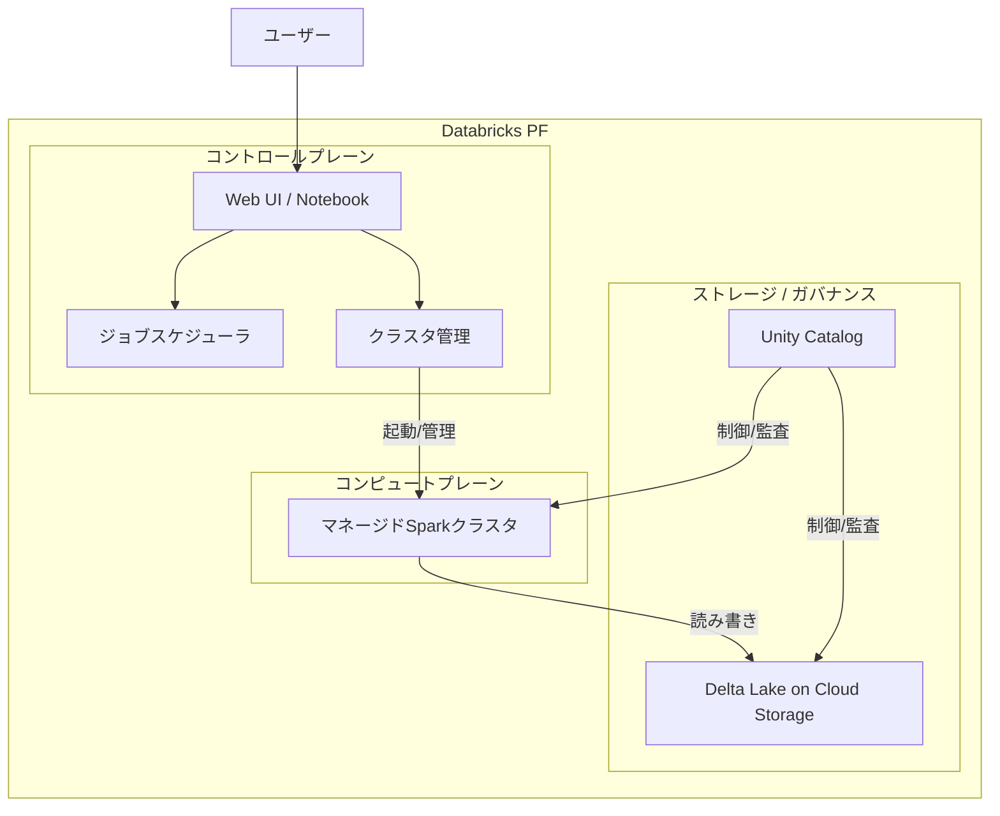
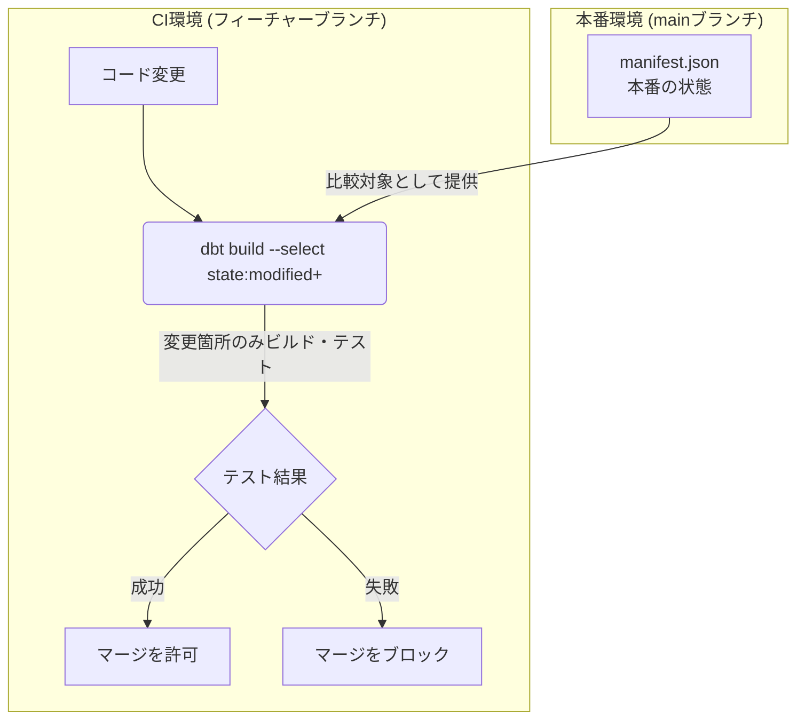
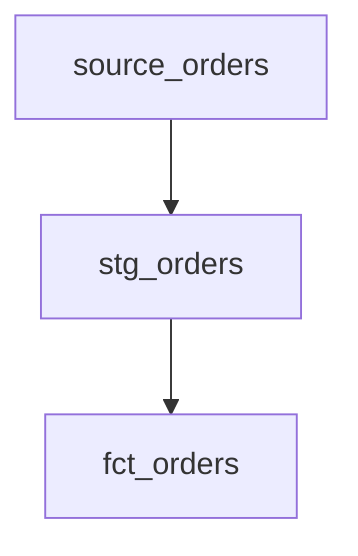
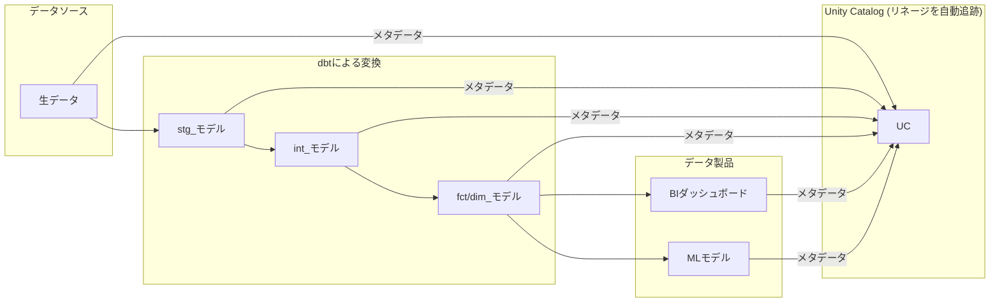

この記事では、商用版Databricksとdbt Coreを組み合わせたモダンデータスタック環境で、継続的インテグレーション（CI）と継続的デプロイメント（CD）を実装するための方法を解説します。

データパイプライン開発にソフトウェアエンジニアリングのライフサイクルを適用し、スケーラブルで信頼性の高いデータエコシステムを構築するための、実践的かつ体系的な知識を提供します。特に、Databricks Asset Bundles（DABs）の登場を境とした、従来のアプローチと最新のアプローチを比較しながら解説します。


### 第I部 Databricksレイクハウスにおけるアーキテクチャの基礎

このセクションでは、利用するテクノロジースタックの構成要素と、それらがDatabricksプラットフォーム上でどのように統合され、一貫性のあるレイクハウスアーキテクチャを形成するのかを解説します。

#### 1.1 モダンデータスタックの構成要素

Databricksプラットフォームは、それぞれが特定の役割を担うオープンソース技術を、緊密に統合されたマネージドサービスとして提供します。

  * **マネージドApache Spark**
      * 大規模データ処理のための統合エンジンです。
      * Databricksがクラスタ管理を抽象化するため、ユーザーはデータ処理ロジックに集中できます。
  * **Delta Lake**
      * トランザクション機能を持つストレージレイヤーです。
      * ACIDトランザクション、スキーマエンフォースメント、タイムトラベルといった機能により、データレイクに高い信頼性をもたらします。
  * **dbt Core**
      * データ変換（Transformation）を担うエンジンです。
      * モジュール化、バージョン管理、テストといったソフトウェアエンジニアリングの原則を分析ワークフローに適用します。
  * **統合MLflow**
      * MLOps（機械学習基盤）のフレームワークです。
      * 実験追跡からモデル管理、デプロイまで、機械学習のライフサイクル全体をシームレスに支援します。
  * **Unity Catalog**
      * 統一されたガバナンスレイヤーです。
      * データやAIモデルなど、全ての資産に対する一元的なアクセス制御、監査、データリネージ（データの系譜）を提供します。これはCI/CDと連携したガバナンス自動化の基盤となります。

これらのコンポーネントが一体となり、データレイクの柔軟性とデータウェアハウスの信頼性を両立させる「レイクハウス」アーキテクチャを実現します。

#### 1.2 システムアーキテクチャ

Databricksのアーキテクチャは、Databricksが管理する「コントロールプレーン」と、ユーザーのクラウド環境でデータ処理を実行する「コンピュートプレーン」に分かれます。



| 要素名               | 説明                                                                                             |
| :------------------- | :----------------------------------------------------------------------------------------------- |
| コントロールプレーン | Databricksが管理するバックエンドサービス。Web UI、Notebook、ジョブスケジューラなどが含まれます。 |
| コンピュートプレーン | ユーザーのクラウド環境内で起動されるSparkクラスタ。実際のデータ処理を実行します。                |
| Delta Lake           | クラウドストレージ上に構築され、データ資産を格納します。                                         |
| Unity Catalog        | 全てのデータ資産とアクセス権を一元管理します。                                                   |

商用版Databricksを選択することで、インフラの運用負荷を削減し、統合されたガバナンスの下で迅速にプラットフォームを導入できます。


### 第II部 アナリティクスエンジニアリング開発ライフサイクル

このセクションでは、チームがdbtプロジェクトで効果的に作業するための開発ワークフローと規約を体系化します。

#### 2.1 スケーラブルなdbtプロジェクトの構造

dbtプロジェクトの成功は、明確に定義された構造と規約に基づきます。

  * **ディレクトリレイアウト**
      * `models/staging`、`models/intermediate`、`models/marts`のようにフォルダを階層化し、保守性を維持します。
  * **命名規則**
      * モデル名に接頭辞（例: `stg_`, `fct_`, `dim_`）を付け、発見可能性と依存関係の理解を容易にします。
  * **モデリング原則**
      * 「1モデル1変換」の原則を守り、生データへの参照は`source`定義に限定します。
  * **スタイルガイドとリンティング**
      * `sqlfluff`のようなリンティングツールをCIプロセスに組み込み、コードの一貫性と可読性を自動的に維持します。

#### 2.2 環境管理の進化

##### 2.2.1 従来のアプローチ: `profiles.yml`による接続管理

Databricks Asset Bundles（DABs）登場以前は、`profiles.yml`ファイルで環境ごとのデータベース接続情報を管理していました。

  * `dev`（開発）、`ci`（CI）、`prod`（本番）といったターゲットを定義します。
  * トークンなどの機密情報は、`env_var()`関数を使い環境変数から安全に読み込みます。
  * 開発者ごとに動的なスキーマを割り当て、並行開発を可能にします。
  * `dbt run --target prod`のように、コマンドラインで実行環境を切り替えます。

このアプローチでは、dbtの接続設定とDatabricksのリソース定義（ジョブ、クラスタ）が分離しており、両者の同期を保つ必要がありました。

```yaml
# ~/.dbt/profiles.yml
my_databricks_project:
  target: dev
  outputs:
    dev:
      type: databricks
      host: <dev_workspace_host>
      http_path: <dev_cluster_http_path>
      schema: "dbt_{{ env_var('USER') }}"   # 開発者ごとの動的スキーマ
      token: "{{ env_var('DATABRICKS_DEV_TOKEN') }}"
      threads: 4

    ci:
      type: databricks
      host: <ci_workspace_host>
      http_path: <ci_cluster_http_path>
      schema: "dbt_ci_pr_{{ env_var('PR_NUMBER') }}" # PRごとの一時スキーマ
      token: "{{ env_var('DATABRICKS_CI_TOKEN') }}"
      threads: 8

    prod:
      type: databricks
      host: <prod_workspace_host>
      http_path: <prod_cluster_http_path>
      schema: analytics   # 本番用スキーマ
      token: "{{ env_var('DATABRICKS_PROD_TOKEN') }}"
      threads: 16
```

##### 2.2.2 最新のアプローチ: Databricks Asset Bundlesによる統合管理

Databricks Asset Bundles（DABs）は、dbtモデル、Databricksジョブ、クラスタ設定など、プロジェクトの全アセットを単一のYAMLファイル（`databricks.yml`）で宣言的に管理するInfrastructure as Code（IaC）のアプローチです。

`databricks.yml`は`profiles.yml`の役割を内包し、インフラ定義とdbtの実行設定を一体でバージョン管理します。これにより、環境管理はより堅牢で再現性の高いものに進化しました。

```yaml
# databricks.yml
bundle:
  name: my_dbt_project

targets:
  dev:
    mode: development
    default: true
    workspace:
      host: https://<dev_workspace_host>

  prod:
    mode: production
    workspace:
      host: https://<prod_workspace_host>

resources:
  jobs:
    dbt_production_job:
      name: "dbt_job_${bundle.target}"
      schedule:
        quartz_cron_expression: "0 0 5 * * ?"
        timezone_id: "UTC"
      tasks:
        - task_key: "run_dbt"
          dbt_task:
            project_directory: ./dbt_project
            commands: [ "dbt deps", "dbt build" ]
```

#### 2.3 データチームのためのGitワークフロー

  * **バージョン管理**
      * 全てのdbtプロジェクトと設定ファイル（`databricks.yml`など）をGitで管理します。
  * **ブランチ戦略**
      * シンプルなGitHub flowが効果的です。
      * Databricks Gitフォルダ機能を利用すると、開発ワークフローがさらに効率化します。
  * **プルリクエスト（PR）レビュー**
      * PRを共同作業と品質管理の中心に据えます。
      * チームメンバーによるレビューを必須とし、CIプロセスと連携させて自動品質チェックのゲートウェイとして機能させます。


### 第III部 継続的インテグレーション（CI）の実装

このセクションでは、自動化された品質保証パイプラインを構築します。

#### 3.1 データパイプラインのためのCIの原則

  * **シフトレフト**
      * 「早く失敗する（fail fast）」という原則に基づき、開発サイクルの早い段階でエラーを検出します。
  * **データCIの特性**
      * コードの変更がデータ自体に与える影響を検証することが中心となります。


#### 3.2 「Slim CI」による効率とコストの最適化

プロジェクトの成長に伴い、変更のたびに全モデルをビルド・テストする「フルビルド」は非現実的になります。この問題を解決するのが、変更があった部分のみを賢くビルドする「Slim CI」です。



| 要素名 | 説明 |
| :--- | :--- |
| `state:modified+` | 本番環境の状態と比較し、変更されたモデルとその下流にあるモデルのみを選択するdbtセレクタ。 |
| `manifest.json` | 本番プロジェクトの状態を記録したスナップショット。CIジョブはこれを基に変更を判断します。 |
| `--defer`フラグ | 変更されていない上流モデルの再ビルドをスキップし、本番環境のオブジェクトを直接参照することでCIの実行時間を短縮します。 |

##### Slim CIの仕組み

Slim CIは、プルリクエスト（PR）ごとにスキーマを分けつつ、どのように上流のデータを用いてテストを実行するのか、という課題を解決します。

結論として、Slim CIはCIジョブにおいて、**変更がない上流モデルのテストデータを本番環境から直接参照します。** これにより、高速かつ低コストで、本番に近いデータでの検証を実現します。

この仕組みは、前述の表にある`state:modified+`と`--defer`という2つの主要な機能によって成り立っています。

  - **`state:modified+`：ビルド対象の決定**

      - CIパイプラインは、はじめに本番環境の`manifest.json`ファイルを取得します。このファイルとPRのコード変更を比較し、変更があったモデル（`modified`）と、それに依存するすべての下流モデル（`+`）だけをビルド対象として選択します。

  - **`--defer`：読み込み元データの決定**

      - `--defer`フラグは、`ref()`関数が参照するデータの場所を制御します。
          - **ビルド対象のモデルを参照する場合**
              - 現在のCI環境に作成された一時スキーマ（例：`dbt_ci_pr_123`）内のモデルを参照します。
          - **ビルド対象外のモデル（変更がない上流モデル）を参照する場合**
              - CIスキーマにモデルが存在しないため、本番環境のスキーマ（例：`prod`）に存在する同名のテーブルやビューを参照します。

##### 具体例

以下の依存関係を持つモデルを例に説明します。



| 要素名 | 説明 |
| :--- | :--- |
| `source_orders` | ソースデータ |
| `stg_orders` | `source_orders` を参照する中間モデル |
| `fct_orders` | `stg_orders` を参照する最終的なモデル |

開発者が`fct_orders`モデルのロジックのみを変更してPRを作成した場合、CIパイプラインは以下のように動作します。

1.  **CIコマンドの実行**

      - `dbt build --select state:modified+ --defer --state <prod_manifest_path> --target ci`のようなコマンドを実行します。

2.  **ビルド対象の特定**

      - `state:modified+`の機能により、変更があった`fct_orders`のみをビルド対象とします。

3.  **上流データの参照**

      - `fct_orders`のビルド時、`ref('stg_orders')`で上流モデルを参照します。
      - `stg_orders`はビルド対象外のため、`--defer`機能が働き、本番環境のテーブル（例：`prod.analytics.stg_orders`）をデータソースとして解決します。

4.  **結果**

      - `fct_orders`の新しいロジックは、本番の`stg_orders`テーブルのデータを入力として実行されます。
      - テスト結果はCIスキーマ（例：`dbt_ci_pr_123.fct_orders`）に書き込まれます。

この方法により、開発者は本番環境に影響を与えることなく、変更したモデルが本番データで正しく動作するかを検証できます。

##### 懸念点と高度な解決策：Zero-Copy Cloning

本番データへの直接アクセスは、個人情報（PII）を含む場合など、セキュリティやガバナンス上の懸念を生むことがあります。

この課題は、SnowflakeやDatabricksなどが提供する「Zero-Copy Clone（ゼロコピークローン）」機能で解決できます。この機能を利用したCIパイプラインの動作は以下の通りです。

1.  **データベースのクローン作成**

      - CIジョブの開始時に、本番データベースのゼロコピークローンを瞬時に作成します。
      - これはデータの物理的なコピーではないため、高速でストレージコストもかかりません。

2.  **テストの実行**

      - CIジョブは、クローンされたデータベースを読み取り元として、変更モデルをビルドします。

3.  **クローンの破棄**

      - テスト完了後、クローンしたデータベースを破棄します。

このアプローチにより、本番と完全に同一のデータを使いながらも、完全に分離された安全なサンドボックス環境でテストを実行できます。これにより、パフォーマンスとセキュリティを両立したCIが実現します。


#### 3.3 CIパイプラインの実装

##### 3.3.1 従来のアプローチ: dbtコマンドの直接実行

CIツール（例: GitHub Actions）から直接dbtコマンドを実行し、`manifest.json`を手動で管理します。

```yaml
#.github/workflows/ci-traditional.yml
name: dbt Traditional CI
on:
  pull_request:
    branches: [ main ]
jobs:
  dbt_run:
    runs-on: ubuntu-latest
    steps:
      - uses: actions/checkout@v3
      - uses: actions/setup-python@v4
        with:
          python-version: '3.10'
      - name: Install dependencies
        run: pip install dbt-databricks sqlfluff
      - name: Download production manifest
        uses: actions/download-artifact@v3
        with:
          name: dbt-manifest-prod
          path: ./prod_manifest
        continue-on-error: true
      - name: Run SQL Linter
        run: sqlfluff lint .
      - name: Run dbt build (Slim CI)
        env:
          DATABRICKS_CI_HOST: ${{ secrets.DATABRICKS_HOST }}
          DATABRICKS_CI_TOKEN: ${{ secrets.DATABRICKS_TOKEN }}
          PR_NUMBER: ${{ github.event.pull_request.number }}
        run: |
          if [ -f "./prod_manifest/manifest.json" ]; then
            dbt build --select state:modified+ --defer --state ./prod_manifest --target ci
          else
            dbt build --target ci
          fi
```

##### 3.3.2 最新のアプローチ: Databricks Asset BundlesによるCI

DABsを利用すると、CIパイプラインの役割は、`databricks bundle`コマンドを実行することに変わります。dbtの実行ロジックは`databricks.yml`内にカプセル化され、パイプラインの定義が簡素化されます。

```yaml
#.github/workflows/ci-bundle.yml
name: Databricks Bundle CI
on:
  pull_request:
    branches: [ main ]
jobs:
  validate_and_test:
    runs-on: ubuntu-latest
    steps:
      - uses: actions/checkout@v3
      - name: Install Databricks CLI
        run: pip install databricks-cli
      - name: Configure Databricks CLI
        env:
          DATABRICKS_HOST: ${{ secrets.DATABRICKS_HOST }}
          DATABRICKS_TOKEN: ${{ secrets.DATABRICKS_TOKEN }}
        run: |
          echo "host = $DATABRICKS_HOST" >> ~/.databrickscfg
          echo "token = $DATABRICKS_TOKEN" >> ~/.databrickscfg
      - name: Validate Bundle
        run: databricks bundle validate
      - name: Deploy and Run CI Job
        run: databricks bundle deploy -t ci | xargs databricks bundle run -j
```


### 第IV部 継続的デプロイメント（CD）の自動化

このセクションでは、検証済みのコードを安全かつ自動的に本番環境へ反映させるプロセスを解説します。

#### 4.1 本番プロモーション戦略

CDパイプラインは、全てのCIチェックをパスしたコードが`main`ブランチへマージされたことをトリガーとして実行します。これにより、手動作業を排除し、信頼性が高く再現可能なリリースプロセスを提供します。

#### 4.2 CDパイプラインの実装

##### 4.2.1 従来のアプローチ: dbtコマンドと手動の状態管理

CDパイプラインは本番環境に対して`dbt build`を実行し、次回のCIで利用する`manifest.json`をアーティファクトとして保存します。

```yaml
#.github/workflows/cd-traditional.yml
name: dbt Traditional CD
on:
  push:
    branches: [ main ]
jobs:
  deploy_to_prod:
    runs-on: ubuntu-latest
    steps:
      - uses: actions/checkout@v3
      - name: Install dependencies
        run: pip install dbt-databricks
      - name: Run dbt build in Production
        env:
          DATABRICKS_PROD_HOST: ${{ secrets.DATABRICKS_HOST }}
          DATABRICKS_PROD_TOKEN: ${{ secrets.DATABRICKS_TOKEN }}
        run: dbt build --target prod
      - name: Persist production manifest
        uses: actions/upload-artifact@v4
        with:
          name: dbt-manifest-prod
          path: ./target/manifest.json
```

##### 4.2.2 最新のアプローチ: Databricks Asset BundlesによるCD

DABsを使用する場合、CDパイプラインは`databricks bundle deploy`コマンドを実行し、`databricks.yml`で定義された本番用ジョブをDatabricksワークスペースに適用するだけです。実際のdbtの実行は、Databricks側で定義されたスケジュールに従います。

```yaml
#.github/workflows/cd-bundle.yml
name: Databricks Bundle CD
on:
  push:
    branches: [ main ]
jobs:
  deploy_to_production:
    runs-on: ubuntu-latest
    steps:
      - uses: actions/checkout@v3
      - name: Install Databricks CLI
        run: pip install databricks-cli
      - name: Configure Databricks CLI
        env:
          DATABRICKS_HOST: ${{ secrets.DATABRICKS_PROD_HOST }}
          DATABRICKS_TOKEN: ${{ secrets.DATABRICKS_PROD_TOKEN }}
        run: |
          echo "host = $DATABRICKS_HOST" >> ~/.databrickscfg
          echo "token = $DATABRICKS_TOKEN" >> ~/.databrickscfg
      - name: Deploy Bundle to Production
        run: databricks bundle deploy -t prod
```


### 第V部 多層的な自動テストフレームワーク

このセクションでは、CI/CDに組み込む包括的なテスト戦略を解説します。

#### 5.1 dbtによる基礎的なテスト

  * **汎用テスト**
      * `schema.yml`内で`unique`、`not_null`、`relationships`といった組み込みテストを適用し、データインテグリティを保証します。
  * **特異テスト**
      * 成功時に0行を返すカスタムSQLクエリを作成し、特定のビジネスロジックを検証します。

#### 5.2 `dbt-expectations`による高度なデータ品質テスト

`dbt-expectations`パッケージは、dbtの標準テストではカバーできない、より複雑なデータ品質チェックを可能にします。

  * `expect_column_values_to_be_between`や`expect_column_mean_to_be_between`など、洗練されたテストを`schema.yml`内で宣言的に使用できます。
  * ビジネス上重要なモデルに戦略的に適用し、重要度に応じて`warn`（警告）と`error`（エラー）のレベルを使い分けることが重要です。

#### 5.3 PySpark変換のユニットテスト

dbtのPythonモデルなど、PySparkで記述されたロジックには`pytest`を用いたユニットテストが不可欠です。

1.  **SparkSessionの管理**
      * `conftest.py`ファイルに再利用可能なSparkSessionのフィクスチャを作成します。
2.  **テストの構造化**
      * 入力DataFrameを作成し、テスト対象の関数を呼び出し、期待する出力と比較します。
3.  **DataFrameの比較**
      * アサーションのためにSpark DataFrameをPandas DataFrameに変換するのが一般的な方法です。

#### 5.4 パフォーマンステストの統合

コード変更による意図しないパフォーマンス低下を防ぐため、CIパイプラインにパフォーマンステストを組み込みます。

1.  CIパイプライン内でdbtモデルの実行時間を取得し、ログに記録します。
2.  Databricksのジョブ実行履歴APIなどを利用し、変更されたモデルの実行時間を過去の本番実行と比較します。
3.  「実行時間が20%以上増加した場合に失敗させる」といった閾値を設定し、重大なパフォーマンスリグレッションを自動的に検出します。


### 第VI部 ゼロダウンタイムリリースのための高度なデプロイメントパターン

このセクションでは、データ利用者への影響をゼロにすることを目指す、洗練されたデプロイ技術を探求します。

#### デプロイ戦略の比較

| 戦略             | dbt/データコンテキストでの説明                                                              | リソースコスト      | ロールバック機構                            | リスクプロファイル | 最適なユースケース                                         |
| :--------------- | :------------------------------------------------------------------------------------------ | :------------------ | :------------------------------------------ | :----------------- | :--------------------------------------------------------- |
| **基本デプロイ** | mainブランチへのマージ後、本番環境でdbt buildを直接実行                                     | 低                  | Gitリバートと再ビルドが必要（時間がかかる） | 高                 | 小規模プロジェクト、ダウンタイムが許容されるパイプライン   |
| **Blue/Green**   | 非アクティブな「Green」スキーマでビルドし、テスト後に「Blue」（本番）とアトミックにスワップ | 高（ストレージ2倍） | 瞬時のスワップバック（ほぼゼロリスク）      | 低                 | ビジネスクリティカルなモデル、ゼロダウンタイムが必須の場合 |
| **Canary**       | 新しいロジックを並行した「Canary」モデルとしてデプロイし、一部のユーザーをそちらに向ける    | 中                  | Canaryモデルへのルーティングを停止          | 低                 | 影響が不確実な大規模変更を、限定範囲でテストしたい場合     |

#### 6.1 dbtのためのBlue/Greenデプロイメント

ライブ環境（Blue）とは別に、新しいバージョンのデータを非アクティブな環境（Green）で完全に構築し、テスト後に瞬時に切り替える戦略です。

##### Delta Lakeタイムトラベルの活用

物理的にデータセットを複製する伝統的なBlue/Green戦略は高コストです。しかし、Delta Lakeのタイムトラベル機能は、より効率的な「仮想的」Blue/Greenデプロイを実現します。

1.  **デプロイの実行**
      * テーブルを変更するデプロイを実行します。これはトランザクションログに新しいバージョンとして記録されます。
2.  **ロールバック**
      * 問題が発生した場合、`RESTORE TABLE`コマンドや`VERSION AS OF`句を使い、テーブルを即座にデプロイ前のバージョン（状態）に戻せます。

このアプローチは、ストレージのオーバーヘッドと運用の複雑さを大幅に削減します。

#### 6.2 データパイプラインへのCanaryリリースの適用

変更を一部のユーザーに先行展開し、問題を監視する手法です。

1.  **並行モデルのデプロイ**
      * 新しいロジックを、既存モデル（例: `fct_orders`）とは別のCanaryモデル（例: `fct_orders_canary`）としてデプロイします。
2.  **ルーティング**
      * 一部のBIダッシュボードなどを、`_canary`バージョンのテーブルを参照するように設定します。
3.  **モニタリング**
      * Canary版の出力のパフォーマンスと正確性を監視します。
4.  **プロモーション**
      * 成功と判断されれば、Canaryモデルのロジックを本番モデルにマージし、Canaryモデルを廃止します。


### 第VII部 ガバナンスと可観測性の強化

このセクションでは、自動化されたパイプラインの出力を、組織全体で発見可能で信頼できるものにするための方法を解説します。

#### 7.1 dbt Docsの自動化とホスティング

優れたドキュメントは、データの発見と信頼性のために不可欠です。

  * **自動生成**
      * CDパイプラインの本番ビルド成功後、`dbt docs generate`コマンドを実行するステップを含めます。
  * **ホスティング戦略**
      * 生成された静的なWebサイトをGitHub Pages、Netlify、またはクラウドストレージ（S3/GCS）でホスティングします。

#### 7.2 Databricks Unity Catalogによる統合ガバナンス

dbtとUnity Catalogの緊密な統合は、商用版Databricksの大きな利点です。dbtジョブがDatabricks上で実行されると、以下のメタデータが**自動的に**Unity Catalogに取り込まれます。



  * **テーブルとビューのメタデータ**
      * dbtモデルが作成したテーブルやビューが自動的に登録されます。
  * **カラムレベルのリネージ**
      * ソースから最終的なデータマートまでのカラムレベルの完全なデータ系譜が自動的に追跡・可視化されます。
  * **ドキュメントの同期**
      * dbtモデルやカラムに記述された説明（description）が、Unity Catalogのコメントとして同期されます。

このネイティブな統合により、手動での作業が不要になり、常に最新で信頼できる唯一の情報源（Single Source of Truth）が構築されます。


### まとめ

Databricksの強力なマネージドサービスと、dbtがもたらすソフトウェアエンジニアリングのベストプラクティスを組み合わせることで、信頼性の高いデータプラットフォームを構築できます。導入にあたり、以下の段階的なアプローチを推奨します。

1.  **フェーズ1：基礎の確立（従来のアプローチ）**

      * **バージョン管理**: 全てのdbtプロジェクトをGitで管理し、ブランチワークフローを標準化します。
      * **環境分離**: `profiles.yml`でdev、ci、prod環境を明確に分離します。
      * **基本的なCI/CD**: dbtコマンドを直接実行する基本的なCI/CDパイプラインを構築します。

2.  **フェーズ2：効率と品質の向上（DABsへの移行）**

      * **DABsの導入**: `databricks.yml`でインフラとコードを宣言的に管理し、CI/CDパイプラインを簡素化します。
      * **Slim CIの導入**: `state:modified+`セレクタを活用し、CIパイプラインを高速化・低コスト化します。
      * **高度なテストとドキュメント**: `dbt-expectations`を導入し、データ品質を強化します。ドキュメントの自動生成とホスティングを組み込みます。

3.  **フェーズ3：成熟と高度化**

      * **Unity Catalogの全面活用**: 全てのデータ資産をUnity Catalogで管理し、自動リネージと一元的なアクセス制御を活用します。
      * **Blue/Greenデプロイメント**: Delta Lakeのタイムトラベルを活用した「仮想的」Blue/Green戦略を導入し、ゼロダウンタイムを実現します。
      * **パフォーマンス監視**: CIパイプラインにパフォーマンス計測を組み込み、リグレッションを早期に検出します。

このロードマップのように、段階的に、変更に対して迅速、安全、かつ自信を持って対応できる、真に自動化され統治されたデータプラットフォームへと成熟度を高めていきます。

この記事が少しでも参考になった、あるいは改善点などがあれば、ぜひリアクションやコメント、SNSでのシェアをいただけると励みになります！


---

### 引用リンク

* **Databricks**
    * [Databricks Lakehouse: Your Data, Unified | Devoteam](https://www.devoteam.com/expert-view/databricks-lakehouse-your-data-unified/)
    * [Databricks - Wikipedia](https://en.wikipedia.org/wiki/Databricks)
    * [Built on Open Source: Innovation and Efficiency - Databricks](https://www.databricks.com/product/open-source)
    * [Databricks and our OSS Data Lake. I had a really interesting ...](https://medium.com/@marekczarnecki_50908/databricks-and-our-oss-data-lake-d91664c7f41c)
    * [Databricks MLOps: Simplifying Your Machine Learning Operations - HatchWorks](https://hatchworks.com/blog/databricks/databricks-mlops/)
    * [Create a Modern Analytics Architecture by Using Azure Databricks ...](https://learn.microsoft.com/en-us/azure/architecture/solution-ideas/articles/azure-databricks-modern-analytics-architecture)
    * [Databricks architecture overview | Databricks on AWS](https://docs.databricks.com/aws/en/getting-started/overview)
    * [Lakehouse reference architectures (download) - Azure Databricks ...](https://learn.microsoft.com/en-us/azure/databricks/lakehouse-architecture/reference)
    * [Automate your jobs with Databricks Asset Bundles - CKDelta](https://ckdelta.ai/blog/automate-your-jobs-with-databricks-asset-bundles)
    * [CI/CD with Databricks Asset Bundles: A Complete Guide | Towards Dev - Medium](https://medium.com/towardsdev/ci-cd-strategies-for-databricks-asset-bundles-e4aaf921823e)
    * [What are Databricks Asset Bundles?](https://docs.databricks.com/aws/en/dev-tools/bundles/)
    * [Databricks Asset Bundles. A first look at the tool's maturity… | by Meghana V | newmathdata](https://blog.newmathdata.com/databricks-asset-bundles-b8870d38d963)
    * [How to build an end-to-end testing pipeline with dbt on Databricks - Medium](https://medium.com/dbsql-sme-engineering/how-to-build-an-end-to-end-testing-pipeline-with-dbt-on-databricks-cb6e179e646c)

* **dbt**
    * [Why Should you Codify your Best Practices in dbt? - phData](https://www.phdata.io/blog/why-should-you-codify-your-best-practices-in-dbt/)
    * [Best practices for workflows | dbt Developer Hub](https://docs.getdbt.com/best-practices/best-practice-workflows)
    * [Your Essential dbt Project Checklist | dbt Developer Blog - dbt Docs](https://docs.getdbt.com/blog/essential-dbt-project-checklist)
    * [Best Practices for Workflows: A Guide to Effective dbt Use | by Turkel - Medium](https://medium.com/@turkelturk/best-practices-for-workflows-a-guide-to-effective-dbt-use-fa925127647c)
    * [Lint and format your code | dbt Developer Hub](https://docs.getdbt.com/docs/cloud/dbt-cloud-ide/lint-format)
    * [How we style our Python | dbt Developer Hub](https://docs.getdbt.com/best-practices/how-we-style/3-how-we-style-our-python)
    * [About profiles.yml | dbt Developer Hub - dbt Docs](https://docs.getdbt.com/docs/core/connect-data-platform/profiles.yml)
    * [multiple profiles in one profiles.yml is possible? - dbt - Stack Overflow](https://stackoverflow.com/questions/75286648/multiple-profiles-in-one-profiles-yml-is-possible)
    * [dbt environments | dbt Developer Hub - dbt Docs](https://docs.getdbt.com/docs/dbt-cloud-environments)
    * [Connection profiles | dbt Developer Hub - dbt Docs - dbt Labs](https://docs.getdbt.com/docs/core/connect-data-platform/connection-profiles)
    * [How to Set Up dbt Cloud to Profiles.yml - Secoda](https://www.secoda.co/learn/how-to-set-up-dbt-cloud-to-profiles-yml)
    * [Configure Multiple Targets in dbt Cloud - Orchestra](https://www.getorchestra.io/guides/configure-multiple-targets-in-dbt-cloud)
    * [Getting Started with git Branching Strategies and dbt | dbt Developer Blog - dbt Docs](https://docs.getdbt.com/blog/git-branching-strategies-with-dbt)
    * [dbt platform configuration checklist | dbt Developer Hub - dbt Docs](https://docs.getdbt.com/docs/configuration-checklist)
    * [How to review an analytics pull request effectively - dbt Labs](https://www.getdbt.com/blog/how-to-review-an-analytics-pull-request)
    * [What Are dbt Execution Best Practices? - phData](https://www.phdata.io/blog/what-are-dbt-execution-best-practices/)
    * [Everything you need to know about dbt tests: How to write them, examples, and best practices | Metaplane](https://www.metaplane.dev/blog/dbt-test-examples-best-practices)
    * [An Overview of Testing Options for dbt (data build tool) - Datacoves](https://datacoves.com/post/dbt-test-options)
    * [Data Quality with dbt & Great Expectations | Orchestra](https://www.getorchestra.io/guides/data-quality-with-dbt-great-expectations)
    * [How to use dbt-expectations to detect data quality issues - Datafold](https://www.datafold.com/blog/dbt-expectations)
    * [Testing dbt data transformations, including dbt-expectations. - Testio Tech](https://testiotech.com/2024/12/08/dbt-expectations/)
    * [dbt-expectations: What it is and how to use it to find data quality issues | Metaplane](https://www.metaplane.dev/blog/dbt-expectations)
    * [DBT Tests: Essential for Data Transformation Quality - Acceldata](https://www.acceldata.io/blog/dbt-tests-demystified-build-reliable-scalable-data-pipelines)
    * [dbt docs: Generate and Serve Model Documentation - Galaxy](https://www.getgalaxy.io/learn/glossary/dbt-docs)
    * [About documentation | dbt Developer Hub - dbt Docs](https://docs.getdbt.com/docs/build/documentation)
    * [Zero-Config Code Review and Impact Assessment tool for dbt Data Projects - Medium](https://medium.com/inthepipeline/zero-config-code-review-and-data-profiling-tool-for-dbt-projects-8b6de40964b4)
    * [3 ways to host and share dbt docs - Metaplane](https://www.metaplane.dev/blog/host-and-share-dbt-docs)
    * [About dbt setup | dbt Developer Hub - dbt Docs](https://docs.getdbt.com/docs/about-setup)
    * [Ultimate guide on how to host dbt docs - Entechlog](https://www.entechlog.com/blog/data/how-to-host-dbt-docs/)
    * [dbt Docs as a Static Website - Hiflylabs](https://hiflylabs.com/blog/2023/3/16/dbt-docs-as-a-static-website)

* **Delta Lake**
    * [What is Delta Lake in Azure Databricks? - Microsoft Learn](https://learn.microsoft.com/en-us/azure/databricks/delta/)
    * [Delta Lake: Home](https://delta.io/)
    * [Delta Lake Time Travel](https://delta.io/blog/2023-02-01-delta-lake-time-travel/)
    * [Work with Delta Lake table history | Databricks on AWS](https://docs.databricks.com/aws/en/delta/history)
    * [Work with Delta Lake table history - Azure Databricks - Microsoft Learn](https://learn.microsoft.com/en-us/azure/databricks/delta/history)
    * [Delta Lake time travel - is anyone actually using it? : r/MicrosoftFabric - Reddit](https://www.reddit.com/r/MicrosoftFabric/comments/1kuy01o/delta_lake_time_travel_is_anyone_actually_using_it/)

* **CI/CD & デプロイ戦略**
    * [Continuous integration in dbt | dbt Developer Hub - dbt Docs](https://docs.getdbt.com/docs/deploy/continuous-integration)
    * [CI/CD using Databricks Asset Bundles](https://docs.databricks.com/aws/en/dev-tools/bundles/ci-cd-bundles)
    * [Has anyone successfully implemented CI/CD for Databricks components? - Reddit](https://www.reddit.com/r/databricks/comments/1b563o7/has_anyone_successfully_implemented_cicd_for/)
    * [CI/CD process for dbt models : r/dataengineering - Reddit](https://www.reddit.com/r/dataengineering/comments/yi5ay3/cicd_process_for_dbt_models/)
    * [Build a Basic CI Pipeline for dbt with GitHub Actions - Datafold](https://www.datafold.com/blog/building-your-first-ci-pipeline-for-your-dbt-project)
    * [Elevate Your dbt CI Pipeline: Advanced Integrations for Efficiency & Collaboration | Datafold](https://www.datafold.com/blog/taking-your-dbt-ci-pipeline-to-the-next-level)
    * [Best Practices for dbt Workflows, Part 1: Concepts & Slim Local Builds](https://select.dev/posts/best-practices-for-dbt-workflows-1)
    * [Accelerating dbt core CI/CD with GitHub actions: A step-by-step guide | Datafold](https://www.datafold.com/blog/accelerating-dbt-core-ci-cd-with-github-actions-a-step-by-step-guide)
    * [Implementing CI/CD for dbt-core with BigQuery and Github Actions ...](https://melbdataguy.medium.com/implementing-ci-cd-for-dbt-core-with-bigquery-and-github-actions-f930d48a674b)
    * [bruno-szdl/dbt-ci-cd - GitHub](https://github.com/bruno-szdl/dbt-ci-cd)
    * [dbt CICD: Benefits, Best Practices & Implementation Guide - Hevo Data](https://hevodata.com/data-transformation/implementing-dbt-cicd/)
    * [Blue-Green and Canary Deployments Explained - Harness](https://www.harness.io/blog/blue-green-canary-deployment-strategies)
    * [Performing a blue/green deploy of your dbt project on Snowflake ...](https://discourse.getdbt.com/t/performing-a-blue-green-deploy-of-your-dbt-project-on-snowflake/1349)
    * [Blue/green Versus Canary Deployments: 6 Differences And How To Choose |](https://octopus.com/devops/software-deployments/blue-green-vs-canary-deployments/)
    * [Canary vs blue-green deployment to reduce downtime - CircleCI](https://circleci.com/blog/canary-vs-blue-green-downtime/)
    * [Blue Green Deployment vs. Canary: 5 Key Differences and How to Choose - Codefresh](https://codefresh.io/learn/software-deployment/blue-green-deployment-vs-canary-5-key-differences-and-how-to-choose/)
    * [CanaryPy - A light and powerful canary release for Data Pipelines - GitHub](https://github.com/thcidale0808/canarypy)
    * [Canary release vs Green/Blue deployment : r/aws - Reddit](https://www.reddit.com/r/aws/comments/1bl0cgl/canary_release_vs_greenblue_deployment/)

* **PySpark テスト**
    * [Unit testing PySpark code using Pytest - Towards Data Science](https://towardsdatascience.com/unit-testing-pyspark-code-using-pytest-b5ab2fd54415/)
    * [How to test PySpark code with pytest - Start Data Engineering](https://www.startdataengineering.com/post/test-pyspark/)
    * [Unit testing Apache Spark with py.test | by Vikas Kawadia | Nextdoor Engineering](https://engblog.nextdoor.com/unit-testing-apache-spark-with-py-test-3b8970dc013b)
    * [Test Your Pyspark Project with Pytest: example-based Tutorial](https://data-ai.theodo.com/en/technical-blog/tutorial-test-pyspark-project-pytest)
    * [Testing PySpark — PySpark 4.0.0 documentation - Apache Spark](https://spark.apache.org/docs/latest/api/python/getting_started/testing_pyspark.html)
    * [Testing pyspark with pytest - Programming, Machine learning and Electronics chit chat](https://garybake.com/pyspark_pytest.html)

* **データエンジニアリング全般**
    * [Performance Optimization in Data Pipelines with dbt | by Xavier Raju | Towards Dev](https://medium.com/towardsdev/performance-optimization-in-data-pipelines-with-dbt-e2ea0a7510a0)
    * [Data Pipelines: Key Components and Best Practices | dbt Labs](https://www.getdbt.com/blog/data-pipelines)
    * [AI data pipelines: Critical components and best practices - dbt Labs](https://www.getdbt.com/blog/ai-data-pipelines)