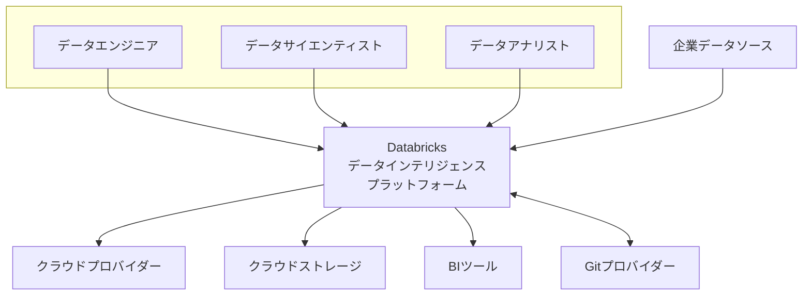
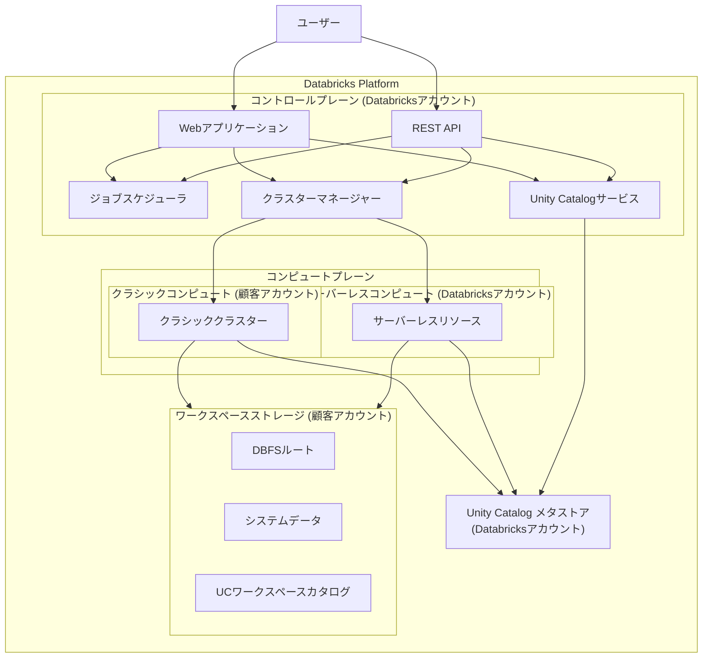
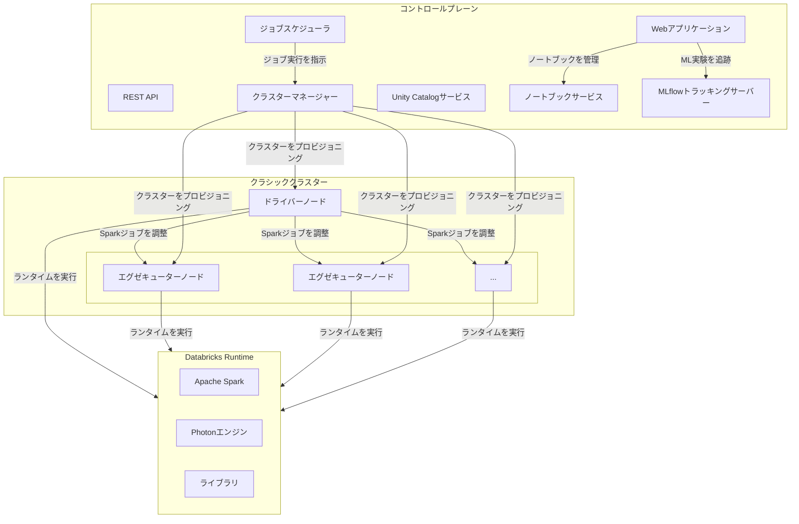
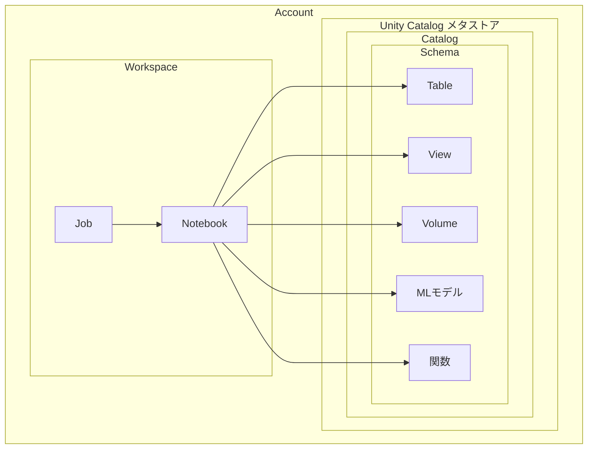
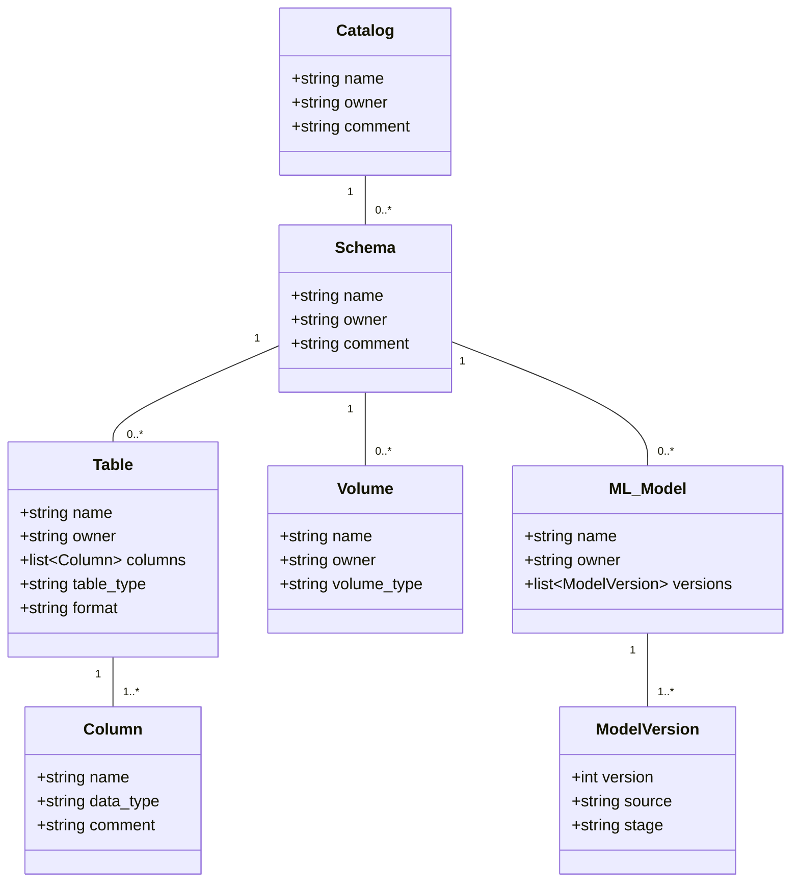

## 概要

Databricksは、データとAIのための統合されたオープンプラットフォームです。この「データインテリジェンスプラットフォーム」は、データの蓄積から活用まで、ライフサイクル全体を単一の環境で提供します。

中核には「レイクハウス」アーキテクチャが存在します。レイクハウスは、データレイクの柔軟性・コスト効率・スケーラビリティと、データウェアハウスのデータ管理機能・ACIDトランザクションの信頼性を両立する設計思想です。

### オープンソース基盤

Databricksは、以下のオープンソースプロジェクトから生まれました。

  * Apache Spark
  * Delta Lake
  * MLflow

このオープンな基盤により、企業は特定ベンダーへのロックインを回避できます。構造化データから非構造化データまで、あらゆる種類のデータを一元的に管理・活用できます。

### 協調的な環境

本プラットフォームは、多様な専門家が円滑に業務を進めるための協調的な環境を提供します。

  * データエンジニア
  * データサイエンティスト
  * データアナリスト
  * 機械学習エンジニア

ETL処理、データウェアハウジング、BI、データサイエンス、機械学習モデルの開発・運用といった、データに関わるあらゆるワークロードを単一プラットフォーム上で完結させます。近年では生成AI機能を深く統合し、自然言語によるコード生成やデータ検索などを支援することで、データ活用のハードルを下げ、組織全体の生産性を向上させます。

## 特徴

Databricksは、現代のデータとAIのワークロード要求に応える、際立った特徴を備えています。

  * **統合分析プラットフォーム** データライフサイクルの全段階を単一プラットフォームでサポートします。これにより、異なる役割のチームが、サイロ化したツール間を移動することなく、一貫したデータソース上で協調作業を行えます。この統合環境は、開発プロセスの効率化と、組織全体のデータ一貫性維持に貢献します。
  * **オープンなレイクハウスアーキテクチャ** 中核のレイクハウスアーキテクチャは、データレイクとデータウェアハウスの利点を融合します。基盤技術のDelta Lakeは、安価なオブジェクトストレージ上に構築され、データウェアハウス級の信頼性を提供します。データはオープンフォーマットで保存されるため、ベンダーロックインを回避し、他ツールとの連携も容易です。
  * **高性能な分散処理** DatabricksはApache Sparkの開発チームによって創設され、その性能を最大限に引き出すよう最適化されています。独自の実行エンジン「Photon」は、SQLとDataFrame APIのワークロードを高速化し、従来のSparkと比較して優れた価格性能を実現します。これにより、ペタバイト級のデータに対しても高速な処理や分析が可能です。
  * **統合されたデータガバナンス** Unity Catalogは、プラットフォーム上の全データ・AI資産に対する統一ガバナンスソリューションです。`catalog.schema.table`という3層の名前空間を使い、SQLのGRANT/REVOKE文法で、資産へのアクセス制御を一元管理できます。また、データリネージ機能や監査ログ機能も提供し、企業のコンプライアンス要件を満たします。
  * **エンドツーエンドの機械学習** 機械学習のライフサイクル全体を一元管理する包括的な機能を提供します。MLflowは実験追跡、モデルのパッケージング、バージョン管理、本番環境へのデプロイをサポートします。特徴量ストアはチーム間での特徴量の共有と再利用を促進し、モデル開発を効率化します。AutoML機能により、専門家でなくても高精度なモデルを容易に構築できます。
  * **生成AIと自然言語活用** プラットフォーム全体に生成AI機能が統合されています。Databricks Assistantは、自然言語との対話を通じてコード生成、修正、デバッグ、データ検索、可視化を支援し、開発者の生産性を向上させます。また、企業独自のデータで基盤モデル（LLM）をカスタマイズし、特定の業務に特化したAIアプリケーションを構築する環境も提供します。

## 構造

C4モデルを用いて、Databricksプラットフォームの構造を段階的に詳細化します。C4モデルは、システムを以下の4つのレベルで捉えます。

1.  システムコンテキスト（レベル1）
2.  コンテナ（レベル2）
3.  コンポーネント（レベル3）
4.  コード（レベル4）

ここでは、コンテキスト、コンテナ、コンポーネントの3レベルでDatabricksの構造を図解します。

### システムコンテキスト図

Databricksプラットフォームを単一のシステムとして捉え、利用者（アクター）と連携する外部システムとの関係性を示します。



| 要素名 | 説明 |
| :--- | :--- |
| データエンジニア | データパイプライン構築、ETL処理、データ品質管理の担当ユーザー |
| データサイエンティスト | 機械学習モデル構築、実験、データ探索、高度な分析の担当ユーザー |
| データアナリスト | SQLクエリ実行、データ可視化、ダッシュボード作成を通じたビジネスインサイト導出の担当ユーザー |
| Databricks データインテリジェンスプラットフォーム | データ、分析、AIのための統合プラットフォーム。本レポートの分析対象 |
| クラウドプロバイダー | Databricksが稼働する基盤のIaaSプロバイダー（AWS、Azure、GCPなど）。DatabricksはAPIを呼び出してコンピュートリソースを管理 |
| クラウドストレージ | データレイクハウスの主要データストアとして利用されるオブジェクトストレージ（Amazon S3、Azure Data Lake Storageなど） |
| 企業データソース | Databricksに取り込まれるデータの源泉となる外部システム（RDB、DWH、Kafkaなど） |
| BIツール | Databricks上のデータに接続し、高度な可視化やレポーティングを行う外部ツール（Power BI、Tableauなど） |
| Gitプロバイダー | ノートブックやソースコードのバージョン管理とCI/CD連携に利用されるバージョン管理システム（GitHub、GitLabなど） |

### コンテナ図

Databricksプラットフォームの内部を構成する主要なコンテナ（実行単位やデータストア）と、それらの関係性を示します。Databricksは、管理機能とデータ処理機能を明確に分離する設計が特徴です。

このコントロールプレーンとコンピュートプレーンの分離は戦略的な意味を持ちます。当初、顧客のクラウドアカウント内でコンピュートプレーンを実行する「クラシック」モデルを提供し、企業の厳しいセキュリティ要件に対応しました。これにより大企業の信頼を獲得しました。後に、このアーキテクチャを活用し、Databricks自身のアカウントでコンピュートリソースを管理する「サーバーレス」モデルを導入しました。これにより、根本的な再設計なしに、より手軽なマネージドサービスを提供し、多様な顧客ニーズに応える柔軟性を獲得しました。



| 要素名 | 説明 |
| :--- | :--- |
| コントロールプレーン | Databricksが管理するバックエンドサービスの集合体。Web UI、API、ジョブスケジューリング、クラスター管理などのコア機能を提供。ユーザーデータは保存されない |
| コンピュートプレーン | ユーザーのデータが実際に処理される場所。2つのモデルが存在する |
| クラシックコンピュート | 顧客自身のクラウドサブスクリプション内でプロビジョニングされる仮想マシン群。リソースが顧客ネットワーク内にあり、セキュリティと分離性が高いモデル |
| サーバーレスコンピュート | Databricksのアカウント内で管理されるコンピュートリソースを利用するモデル。インフラ管理が不要で、迅速な起動と弾力的なスケーリングが可能 |
| ワークスペースストレージ | 顧客自身のクラウドアカウント内に存在するオブジェクトストレージ。DBFSルート、システムデータ、Unity Catalogデータなどが格納される |
| Unity Catalog メタストア | データとAI資産のメタデータを一元管理するコンテナ。アカウント内の全ワークスペースから共有され、一貫したガバナンスを実現 |

### コンポーネント図

「コントロールプレーン」と「クラシックコンピュート」をさらに詳細化し、内部の主要コンポーネントとその役割を示します。



| 要素名 | 説明 |
| :--- | :--- |
| Webアプリケーション | ユーザーがブラウザでDatabricksを操作するGUI。例えば、ユーザーがWeb UIで新しいノートブックを作成してコードを記述する |
| REST API | プログラムからDatabricksリソースを操作するAPI群。例えば、TerraformスクリプトがAPIを呼び出して新しいクラスターを自動作成する |
| ジョブスケジューラ | ノートブックやJARファイルなどをスケジュール実行するコンポーネント。例えば、毎晩午前3時に実行される日次バッチETLジョブ |
| クラスターマネージャー | クラウドプロバイダーと連携し、コンピュートプレーンのクラスターを管理する。例えば、ユーザーがUIでクラスター作成をクリックすると、AWS EC2インスタンスを起動する |
| Unity Catalogサービス | Unity Catalogメタストアと通信し、データアクセス制御やリネージ追跡などのガバナンス機能を提供する。例えば、ユーザーのクエリ実行時に権限を検証する |
| ノートブックサービス | ノートブックのコンテンツ、バージョン履歴、コメントなどを保存・管理する。例えば、複数ユーザーが同じノートブックをリアルタイムで共同編集する |
| MLflowトラッキングサーバー | MLflowで記録された実験のパラメータ、メトリクスなどを一元管理するサーバー。例えば、モデルの実行結果が自動的に記録される |
| ドライバーノード | クラスター内でSparkアプリケーションの実行を調整する中心的なノード。ユーザーコードを受け取り、タスクを生成してエグゼキューターに分配する |
| エグゼキューターノード | ドライバーから割り当てられたタスクを実際に実行するワーカーノード。並列分散処理を担う |
| Databricks Runtime | Apache Spark、Photonエンジン、各種ライブラリをパッケージ化した実行環境。クラスター作成時にバージョンを選択する |

## データ

Databricksプラットフォーム内のデータ・AI資産は、Unity Catalogによって一元管理されます。このセクションでは、Unity Catalogのデータモデルを概念モデルと情報モデルの2レベルで図解します。

Unity Catalogの導入は、Databricksがエンタープライズグレードのデータプラットフォームへ進化する転換点でした。従来のデータレイクはガバナンスの欠如という課題を抱え、データウェアハウスは柔軟性に欠けていました。Unity Catalogは、`catalog.schema.table`という伝統的な3レベルの名前空間を提供し、この問題を解決します。これにより、アナリストは使い慣れた方法でデータを管理できます。さらに、ガバナンスをアカウントレベルで一元化することで、複数ワークスペースにまたがる一貫した権限ポリシーとデータリネージを適用でき、大規模組織の統制要件に応えます。

### 概念モデル

Unity Catalogが管理する主要エンティティ間の階層関係と利用関係を俯瞰的に示します。



| 要素名 | 説明 |
| :--- | :--- |
| Account | Databricksの最上位管理単位。複数のワークスペースやUnity Catalogメタストアを所有 |
| Workspace | ユーザーがノートブックやジョブなどの資産にアクセスする環境 |
| Unity Catalog メタストア | アカウント内の全データ資産のメタ情報を一元管理するトップレベルコンテナ |
| Catalog | データの分離とガバナンスの主要単位。組織の部門や開発環境に対応 |
| Schema | テーブル、ビューなどを論理的にグループ化する単位。データベースとも呼ばれる |
| Table | 構造化データを格納するオブジェクト。Delta Lakeフォーマットが標準 |
| View | 1つ以上のテーブルに対するクエリ結果で定義される読み取り専用の仮想テーブル |
| Volume | 任意の形式のファイルを格納・管理するオブジェクト。画像ファイルなどの管理に利用 |
| MLモデル | Unity Catalogに登録された機械学習モデル。バージョン管理やアクセス制御が可能 |
| 関数 | ユーザー定義関数（UDF）を登録し、SQLクエリから呼び出せるようにするオブジェクト |
| Notebook | ユーザーがコードを記述・実行するインタラクティブなドキュメント |
| Job | ノートブックなどを自動実行する仕組み。ETL処理などに利用 |

### 情報モデル

概念モデルの各エンティティが持つ主要な属性をクラス図形式で詳細に示します。



| 要素名 | 説明 |
| :--- | :--- |
| **Catalog** | |
| name | カタログの一意な名前 |
| owner | カタログを所有するプリンシパル（ユーザーまたはグループ） |
| comment | カタログに関する説明 |
| **Schema** | |
| name | スキーマの一意な名前（カタログ内で一意） |
| owner | スキーマを所有するプリンシパル |
| comment | スキーマに関する説明 |
| **Table** | |
| name | テーブルの一意な名前（スキーマ内で一意） |
| owner | テーブルを所有するプリンシパル |
| columns | テーブルを構成するカラムのリスト |
| table_type | テーブルの種類。「MANAGED」または「EXTERNAL」 |
| format | テーブルのストレージフォーマット。通常は「DELTA」 |
| **Column** | |
| name | カラムの名前 |
| data_type | カラムのデータ型（例: STRING, INT, TIMESTAMP） |
| comment | カラムに関する説明 |
| **Volume** | |
| name | ボリュームの一意な名前（スキーマ内で一意） |
| owner | ボリュームを所有するプリンシパル |
| volume_type | ボリュームの種類。「MANAGED」または「EXTERNAL」 |
| **ML_Model** | |
| name | モデルの一意な名前（スキーマ内で一意） |
| owner | モデルを所有するプリンシパル |
| versions | モデルのバージョン情報のリスト |
| **ModelVersion** | |
| version | モデルのバージョン番号 |
| source | モデルがトレーニングされたMLflow Runへのパス |
| stage | モデルのデプロイステージ（例: Staging, Production） |

## 構築方法

Databricks環境の構築とプロジェクト定義は、UI操作からInfrastructure as Code (IaC)による自動化まで、様々なレベルで行えます。ここでは、再現性と拡張性の高い構築方法を紹介します。

近年のDatabricksは、プロジェクト全体を宣言的に定義し、Git中心のワークフローで管理する方向へシフトしています。当初はUIやAPIが主流でしたが、TerraformやCLIによるインフラのコード化が進みました。しかし、プロジェクトを構成する各要素は異なるツールに散在しがちでした。この課題を解決するのがDatabricks Asset Bundles (DABs)です。DABsは、`databricks.yml`という単一ファイルにプロジェクト定義を集約し、ソースコードと共にGitでバージョン管理します。これにより、`git push`をトリガーにプロジェクト全体を一つの単位としてデプロイする、真のGitOpsワークフローが実現します。

### Terraformによる環境構築

Terraformを利用して、Databricksワークスペースと基盤となるクラウドインフラの構築をコード化・自動化できます。以下は、AWS上にDatabricksワークスペースをプロビジョニングするTerraform設定ファイルの例です。

  * **前提条件**
      * Terraform CLIのインストール
      * Databricksアカウント認証情報の設定
      * AWS認証情報の設定
  * **設定ファイル (main.tf)** このファイルは、DatabricksとAWSのプロバイダーを定義し、ワークスペースに必要なAWSリソースとDatabricksワークスペース自体を作成します。

<!-- end list -->

```terraform
# --- プロバイダー設定 ---
terraform {
  required_providers {
    databricks = {
      source = "databricks/databricks"
    }
    aws = {
      source  = "hashicorp/aws"
      version = "~> 5.0"
    }
  }
}

provider "aws" {
  region = "us-west-2"
}

provider "databricks" {
  alias = "mws"
  host  = "https://accounts.cloud.databricks.com"
  # 環境変数で認証情報を設定
}

# --- ネットワークリソース (VPC, Subnets) ---
resource "aws_vpc" "this" {
  cidr_block = "10.0.0.0/16"
  tags       = { Name = "databricks-vpc" }
}

resource "aws_subnet" "public" {
  vpc_id     = aws_vpc.this.id
  cidr_block = "10.0.1.0/24"
  tags       = { Name = "databricks-public-subnet" }
}

resource "aws_subnet" "private" {
  vpc_id     = aws_vpc.this.id
  cidr_block = "10.0.2.0/24"
  tags       = { Name = "databricks-private-subnet" }
}

# ... (Internet Gateway, NAT Gatewayなどの設定は省略) ...

# --- Databricksワークスペース用のIAMロール ---
data "databricks_aws_assume_role_policy" "this" {
  external_id = var.databricks_account_id
}

resource "aws_iam_role" "cross_account_role" {
  name               = "databricks-cross-account-role"
  assume_role_policy = data.databricks_aws_assume_role_policy.this.json
}

# ... (IAM Policy Attachmentなどの設定は省略) ...

# --- Databricksワークスペース用のS3バケット (ルートバケット) ---
resource "aws_s3_bucket" "root_bucket" {
  bucket = "databricks-root-bucket-${random_string.this.id}"
}

# --- Databricksリソースの登録 ---
resource "databricks_mws_networks" "this" {
  provider     = databricks.mws
  account_id   = var.databricks_account_id
  network_name = "databricks-network"
  vpc_id       = aws_vpc.this.id
  subnet_ids   = [aws_subnet.public.id, aws_subnet.private.id]
  # ... (Security Group IDsなどの設定は省略) ...
}

resource "databricks_mws_credentials" "this" {
  provider         = databricks.mws
  account_id       = var.databricks_account_id
  credentials_name = "databricks-credentials"
  role_arn         = aws_iam_role.cross_account_role.arn
}

resource "databricks_mws_storage_configurations" "this" {
  provider                   = databricks.mws
  account_id                 = var.databricks_account_id
  storage_configuration_name = "databricks-storage-config"
  bucket_name                = aws_s3_bucket.root_bucket.id
}

# --- Databricksワークスペースの作成 ---
resource "databricks_mws_workspaces" "this" {
  provider                 = databricks.mws
  account_id               = var.databricks_account_id
  workspace_name           = "my-terraform-workspace"
  deployment_name          = "my-tf-ws"
  aws_region               = "us-west-2"
  credentials_id           = databricks_mws_credentials.this.credentials_id
  storage_configuration_id = databricks_mws_storage_configurations.this.storage_configuration_id
  network_id               = databricks_mws_networks.this.network_id
}

```

  * **実行コマンド**
    1.  `terraform init`: プロバイダーを初期化します。
    2.  `terraform plan`: 実行計画を確認します。
    3.  `terraform apply`: リソースを作成します。

### Databricks CLIによる設定

Databricks CLIは、コマンドラインからワークスペースを操作するツールです。環境構築後の設定作業やCI/CDスクリプトでの利用に適しています。

  * **前提条件**
      * Databricks CLIのインストール
  * **認証設定** OAuthやパーソナルアクセストークンで認証を設定します。以下のコマンドはOAuth認証フローを開始します。
    ```bash
    databricks auth login --host https://<your-workspace-url>
    ```
  * **利用例**
      * ワークスペース内のファイルを一覧表示
        ```bash
        databricks workspace ls /Users/your.email@example.com
        ```
      * ローカルのノートブックをアップロード
        ```bash
        databricks workspace import ./my_notebook.py /Users/your.email@example.com/my_notebook
        ```
      * Unity Catalogで新しいスキーマを作成
        ```bash
        databricks schemas create --catalog main --name my_new_schema
        ```

### Databricks Asset Bundlesによるプロジェクトの定義

Databricks Asset Bundles (DABs) は、ノートブック、ジョブ、パイプラインといったリソースを設定ファイル(`databricks.yml`)で宣言的に定義し、一つのプロジェクトとしてパッケージ化する仕組みです。

  * **プロジェクトの初期化** テンプレートから新しいバンドルプロジェクトを作成します。

    ```bash
    # プロジェクト用のディレクトリを作成
    mkdir my_databricks_project && cd my_databricks_project

    # デフォルトのPythonテンプレートを使用してバンドルを初期化
    databricks bundle init
    ```

  * **設定ファイル (databricks.yml) の例** 生成されたファイルには、バンドルの基本情報、ターゲットワークスペース、バンドルに含まれるリソースが定義されます。

    ```yaml
    # databricks.yml
    bundle:
      name: my_databricks_project

    # ターゲットワークスペースの定義
    targets:
      # 'dev' という名前の開発用ターゲット
      dev:
        # デフォルトのターゲットとして設定
        default: true
        # ワークスペースのURLは .databrickscfg ファイルから取得
        workspace:
          host: https://<your-dev-workspace-url>

    # バンドルに含まれるリソースの定義
    resources:
      jobs:
        my_project_job:
          name: "My Project Job"
          tasks:
            - task_key: "main_task"
              # このジョブが実行するノートブック
              notebook_task:
                notebook_path: ../src/my_project/notebook.py
              # このタスクを実行するクラスター
              existing_cluster_id: "1234-567890-abcdefgh"
    ```

  * **デプロイコマンド** 設定ファイルに基づき、リソースをターゲットワークスペースにデプロイします。

    ```bash
    # 設定ファイルの構文を検証
    databricks bundle validate

    # 'dev' ターゲットにバンドルをデプロイ
    databricks bundle deploy -t dev
    ```

## 利用方法

データの取り込みからETL、機械学習、分析まで、代表的な利用シナリオをコード例と共に解説します。

### データ取り込み (Auto Loader)

Auto Loaderは、クラウドストレージに到着する新しいデータファイルを、増分的かつ効率的に処理する機能です。手動でのファイル管理を必要とせず、スケーラブルなストリーミング取り込みを実現します。特に、スキーマが変化する可能性があるデータソースに対し、スキーマの推論と進化機能でパイプラインの堅牢性を高めます。

  * **Pythonコード例** JSONファイルが配置されるディレクトリを監視し、新しいファイルを自動的に読み込んでDeltaテーブルに書き込むストリーミング処理を定義します。`cloudFiles.schemaLocation`オプションでスキーマ情報を永続化し、`mergeSchema`オプションでスキーマの自動更新を可能にします。

<!-- end list -->

```python
# Auto Loader を使用してストリーミングDataFrameを定義
df = (spark.readStream
  .format("cloudFiles")
  # 読み込むファイルのフォーマットを指定
  .option("cloudFiles.format", "json")
  # スキーマの推論と進化を管理するための場所を指定
  .option("cloudFiles.schemaLocation", "/path/to/schema_location")
  # データソースのパスを指定
  .load("/path/to/source_data/")
)

# ストリーミングDataFrameをDeltaテーブルに書き込む
(df.writeStream
  # ターゲットとなるDeltaテーブルのパスを指定
  .toTable("my_bronze_table")
  # ストリームの状態を管理するためのチェックポイントの場所を指定
  .option("checkpointLocation", "/path/to/checkpoint_location")
  # ソースデータのスキーマ変更をターゲットテーブルに反映させる
  .option("mergeSchema", "true")
  .start()
)
```

### ETLパイプライン開発 (Delta Live Tables)

Delta Live Tables (DLT) は、信頼性の高いETLパイプラインを宣言的に構築するフレームワークです。データ変換処理をSQLまたはPythonで定義するだけで、依存関係解決、インフラ管理、データ品質監視、エラーハンドリングなどを自動管理します。

  * **Pythonコード例** Bronze、Silver、Goldの3層からなるDLTパイプラインを定義します。`@dlt.table`デコレータでテーブルを宣言し、`@dlt.expect`でデータ品質ルールを定義します。ルール違反レコードは、設定に応じて記録、破棄、またはパイプラインの失敗を引き起こします。

<!-- end list -->

```python
import dlt
from pyspark.sql.functions import *

# --- Bronze Layer: 生データの取り込み ---
@dlt.table(
  name="raw_sales",
  comment="生の販売データをクラウドストレージから取り込む"
)
def ingest_raw_sales():
  return (
    spark.readStream.format("cloudFiles")
     .option("cloudFiles.format", "json")
     .load("/path/to/source_data/sales")
  )

# --- Silver Layer: データクレンジングと品質チェック ---
@dlt.table(
  name="cleaned_sales",
  comment="クレンジングされ、品質チェック済みの販売データ"
)
# データ品質ルールを定義
@dlt.expect_or_drop("valid_order_id", "order_id IS NOT NULL")
@dlt.expect("positive_amount", "amount > 0")
def clean_sales_data():
  return (
    dlt.read_stream("raw_sales")
     .withColumn("order_timestamp", to_timestamp("order_date"))
     .select("order_id", "customer_id", "product_id", "amount", "order_timestamp")
  )

# --- Gold Layer: ビジネス向け集計データ ---
@dlt.table(
  name="daily_sales_summary",
  comment="日次の製品別売上集計"
)
def aggregate_daily_sales():
  return (
    dlt.read("cleaned_sales")
     .groupBy(window("order_timestamp", "1 day"), "product_id")
     .agg(sum("amount").alias("total_daily_sales"))
  )
```

### 機械学習モデル開発 (MLflow)

MLflowは、機械学習のライフサイクル全体を管理するオープンソースプラットフォームで、Databricksに深く統合されています。実験の追跡、コードのパッケージ化、モデルの共有とデプロイを標準化し、再現性の高いワークフローを実現します。

  * **Pythonコード例** scikit-learnでモデルをトレーニングし、その過程をMLflowで追跡、最終的にモデルをModel Registryに登録するまでの一連の流れを示します。`mlflow.start_run()`ブロック内で実行されたコードのパラメータ、メトリクス、アーティファクトが自動記録されます。`registered_model_name`を指定することで、モデルがModel Registryに登録され、バージョン管理が可能になります。

<!-- end list -->

```python
import mlflow
import mlflow.sklearn
from sklearn.ensemble import RandomForestRegressor
from sklearn.model_selection import train_test_split
from sklearn.metrics import mean_squared_error
import pandas as pd

# データの準備 (例)
# X_train, X_test, y_train, y_test = ...

# MLflowの実験を設定
mlflow.set_experiment("/Users/your.email@example.com/MyFirstExperiment")

# MLflow Runを開始
with mlflow.start_run() as run:
  # 1. パラメータを記録
  n_estimators = 100
  max_depth = 5
  mlflow.log_param("n_estimators", n_estimators)
  mlflow.log_param("max_depth", max_depth)

  # 2. モデルをトレーニング
  rf = RandomForestRegressor(n_estimators=n_estimators, max_depth=max_depth)
  rf.fit(X_train, y_train)

  # 3. 予測と評価メトリクスの記録
  predictions = rf.predict(X_test)
  mse = mean_squared_error(y_test, predictions)
  mlflow.log_metric("mse", mse)

  # 4. モデルを記録し、Model Registryに登録
  mlflow.sklearn.log_model(
      sk_model=rf,
      artifact_path="random-forest-model",
      registered_model_name="my-rf-model" # この名前で登録
  )

  print(f"Run ID: {run.info.run_id}")
```

### データ分析と可視化 (Databricks SQL)

Databricks SQLは、SQLユーザー向けに最適化された環境です。高性能なSQLウェアハウス上で、使い慣れたSQLを用いてデータレイクハウス内のデータに直接クエリを実行し、インタラクティブなダッシュボードで可視化できます。

  * **利用手順**
    1.  **SQLウェアハウスの作成**: サイドバーの「SQL Warehouses」から、クエリ実行用のコンピュートリソースを作成します。
    2.  **SQLクエリの実行**: サイドバーの「SQL Editor」を開き、分析したいテーブルに対してSQLクエリを実行します。
        ```sql
        SELECT
          date(window.start) AS sales_date,
          product_id,
          total_daily_sales
        FROM main.gold_schema.daily_sales_summary
        WHERE date(window.start) >= '2023-01-01'
        ORDER BY sales_date, total_daily_sales DESC;
        ```
    3.  **ダッシュボードの作成**: サイドバーの「Dashboards」から新しいダッシュボードを作成します。
    4.  **可視化の追加**: 「Visualization」ウィジェットを追加し、データセットとして先ほどのクエリを選択します。チャートの種類や軸などを設定してグラフを作成します。
    5.  **フィルターの追加**: 「Filter」ウィジェットを追加し、`sales_date`や`product_id`などのフィールドに紐付けることで、インタラクティブなデータ絞り込みを可能にします。
    6.  **ダッシュボードの公開**: 作成したダッシュボードを「Publish」し、他のユーザーと共有します。

## 運用

本番環境で安定して運用するためには、アクセス制御、監視、CI/CDによるデプロイ自動化が不可欠です。

### アクセス制御とガバナンス (Unity Catalog)

Unity Catalogは、データとAI資産に対する一元的なアクセス制御を提供します。ベストプラクティスとして、個々のユーザーではなく、業務上の役割に基づいたグループに権限を付与することが推奨されます。これにより権限管理が簡素化されます。

  * **SQLによる権限管理の例** `data_analysts`グループを作成し、`main`カタログの使用権限と、`gold_schema`内の全テーブルに対する読み取り権限を付与します。

<!-- end list -->

```sql
-- 'data_analysts' グループを作成
CREATE GROUP IF NOT EXISTS data_analysts;

-- 'main' カタログの使用権限を付与
GRANT USE CATALOG ON CATALOG main TO data_analysts;

-- 'gold_schema' スキーマの使用権限を付与
GRANT USE SCHEMA ON SCHEMA main.gold_schema TO data_analysts;

-- 'gold_schema' 内の全テーブルに対するSELECT権限を付与
GRANT SELECT ON ALL TABLES IN SCHEMA main.gold_schema TO data_analysts;
```

### 監視と監査

プラットフォームの健全性とセキュリティを維持するため、パフォーマンス監視とアクティビティ監査が重要です。

  * **パフォーマンス監視 (Datadog連携)** Datadogなどのサードパーティ監視ツールとの連携をサポートしています。連携により、クラスターのインフラメトリクスやSparkジョブの実行状況などを統合的に監視し、パフォーマンスのボトルネックを特定できます。

      * **設定手順の概要**:
        1.  DatadogでDatabricksインテグレーションを有効化し、認証情報を設定します。
        2.  DatabricksクラスターにDatadogエージェントをインストールする初期化スクリプトを作成します。
        3.  作成したスクリプトを監視対象のクラスターに登録します。

  * **アクティビティ監査 (システムテーブル)** 誰が、いつ、どのリソースにアクセスしたかといった詳細な監査ログを自動的に記録します。これらのログは`system.access.audit`というシステムテーブルを通じてクエリでき、セキュリティ調査やコンプライアンスレポートに利用できます。

      * **監査ログクエリの例**:  
        過去24時間以内に失敗したログイン試行を監査ログから抽出します。

    <!-- end list -->

    ```sql
    SELECT
      event_time,
      user_identity.email AS user,
      request_params.path,
      source_ip_address
    FROM
      system.access.audit
    WHERE
      service_name = 'accounts' AND
      action_name = 'IpAccessDenied' AND
      event_time >= now() - INTERVAL '24' HOUR
    ORDER BY
      event_time DESC;
    ```

### CI/CDパイプライン (GitHub ActionsとAsset Bundles)

Databricks Asset Bundles (DABs) とGitHub Actionsを組み合わせることで、プロジェクトのテスト、デプロイ、実行を自動化するCI/CDパイプラインを構築できます。

  * **GitHub Actionsワークフローファイルの例 (.github/workflows/deploy.yml)** `main`ブランチへのプッシュをトリガーに、Asset Bundleの検証、デプロイ、ジョブ実行を行うワークフローを定義します。認証にはDatabricksのサービスプリンシパルを使用し、アクセストークンはGitHubの暗号化シークレットに保存します。

<!-- end list -->

```yaml
name: Databricks Bundle CI/CD

on:
  push:
    branches:
      - main

jobs:
  deploy:
    name: Validate and Deploy Bundle
    runs-on: ubuntu-latest
    environment: production

    steps:
      # 1. リポジトリのコードをチェックアウト
      - name: Checkout repository
        uses: actions/checkout@v4

      # 2. Databricks CLI をセットアップ
      - name: Setup Databricks CLI
        uses: databricks/setup-cli@main

      # 3. バンドルの設定ファイルを検証
      - name: Validate Bundle
        run: databricks bundle validate
        env:
          DATABRICKS_HOST: ${{ vars.DATABRICKS_HOST }}
          DATABRICKS_TOKEN: ${{ secrets.DATABRICKS_TOKEN }}

      # 4. 本番環境 (prod ターゲット) にバンドルをデプロイ
      - name: Deploy Bundle to Production
        run: databricks bundle deploy -t prod
        env:
          DATABRICKS_HOST: ${{ vars.DATABRICKS_HOST }}
          DATABRICKS_TOKEN: ${{ secrets.DATABRICKS_TOKEN }}

      # 5. デプロイしたジョブを実行
      - name: Run Job
        run: databricks bundle run my_project_job -t prod
        env:
          DATABRICKS_HOST: ${{ vars.DATABRICKS_HOST }}
          DATABRICKS_TOKEN: ${{ secrets.DATABRICKS_TOKEN }}
```

## まとめ

Databricksは単なるツール群ではなく、データとAIのライフサイクル全体を加速させるための統合環境です。オープンなレイクハウス思想を基盤に、Unity Catalogによる堅牢なガバナンスと、DABsによるモダンなCI/CDワークフローを組み合わせることで、スケーラブルで信頼性の高いデータ・AI基盤を構築できます。

この記事が、あなたのDatabricks習得への一助となれば幸いです。少しでも参考になった、あるいは改善点などがあれば、ぜひリアクションやコメント、SNSでのシェアをいただけると励みになります！

## 参考リンク

### 公式ドキュメント

**概要・アーキテクチャ**

  * `[EN]` [Databricks architecture overview | Databricks on AWS](https://docs.databricks.com/aws/en/getting-started/overview)
  * `[EN]` [Azure Databricks architecture overview | Microsoft Learn](https://learn.microsoft.com/en-us/azure/databricks/getting-started/overview)
  * `[EN]` [Databricks components | Databricks on AWS](https://docs.databricks.com/aws/en/getting-started/concepts)
  * `[JA]` [Databricks テーブルの概念 | Databricks on AWS](https://docs.databricks.com/aws/ja/tables/tables-concepts)
  * `[EN]` [Data modeling | Databricks on AWS](https://docs.databricks.com/aws/en/transform/data-modeling)

**構築・開発ツール (IaC & CLI)**

  * `[EN]` [Databricks Terraform provider | Databricks on AWS](https://docs.databricks.com/aws/en/dev-tools/terraform/)
  * `[EN]` [What is the Databricks CLI? | Microsoft Learn](https://learn.microsoft.com/en-us/azure/databricks/dev-tools/cli/)
  * `[EN]` [What are Databricks Asset Bundles? | Databricks on AWS](https://docs.databricks.com/aws/en/dev-tools/bundles/)
  * `[EN]` [Databricks Asset Bundles tutorials | Databricks on AWS](https://docs.databricks.com/aws/en/dev-tools/bundles/tutorials)

**主要機能・ユースケース**

  * `[EN]` [What is Auto Loader? | Databricks on AWS](https://docs.databricks.com/aws/en/ingestion/cloud-object-storage/auto-loader/)
  * `[EN]` [Track model development using MLflow - Azure Databricks | Microsoft Learn](https://learn.microsoft.com/en-us/azure/databricks/mlflow/tracking)
  * `[EN]` [Dashboards | Databricks on AWS](https://docs.databricks.com/aws/en/dashboards/)

**運用・ガバナンス**

  * `[EN]` [Unity Catalog best practices | Databricks on AWS](https://docs.databricks.com/aws/en/data-governance/unity-catalog/best-practices)
  * `[EN]` [Audit log reference | Databricks on AWS](https://docs.databricks.com/aws/en/admin/account-settings/audit-logs)
  * `[EN]` [GitHub Actions | Databricks on AWS](https://docs.databricks.com/aws/en/dev-tools/ci-cd/github)

**その他言語**

  * `[CN]` [什么是Azure Databricks？ | Microsoft Learn](https://learn.microsoft.com/zh-cn/azure/databricks/introduction/)
  * `[CN]` [Azure Databricks 文档| Microsoft Learn](https://learn.microsoft.com/zh-cn/azure/databricks/)

### GitHub

  * `[EN]` [ajaen4/terraform-databricks-aws](https://github.com/ajaen4/terraform-databricks-aws): AWS上にDatabricks環境を構築するためのTerraformサンプルコード。
  * `[EN]` [databricks/bundle-examples](https://github.com/databricks/bundle-examples): Databricks公式が提供するAsset Bundlesの様々な使用例。
  * `[EN]` [databricks/delta-live-tables-notebooks](https://github.com/databricks/delta-live-tables-notebooks): Delta Live Tablesの公式サンプルノートブック集。
  * `[EN]` [a0x8o/delta-live-tables-hands-on-workshop](https://github.com/a0x8o/delta-live-tables-hands-on-workshop): DLTのハンズオンワークショップ資料。

### 技術記事・ブログ

**概要・アーキテクチャ**

  * `[JA]` [Databricksとは何がすごい? 機能や特徴をわかりやすく解説 - Digital Intelligence チャンネル](https://www.cloud-for-all.com/blog/what-is-databrics-amazing)
  * `[JA]` [Databricksの特徴とアカウント開設の手順を整理した #AWS - Qiita](https://qiita.com/zumax/items/4fe990550bbdc28c1c4b)
  * `[EN]` [The C4 model for visualizing software architecture](https://c4model.com/): 本記事で採用したC4モデルの公式サイト。
  * `[EN]` [Databricks on AWS – An Architectural Perspective (part 1) - Bluetab](https://www.bluetab.net/en/databricks-on-aws-an-architectural-perspective-part-1/)

**CI/CD と Asset Bundles**

  * `[EN]` [Databricks Asset Bundles (DAB) with Github Actions | by The ML Engineering Guy - Medium](https://medium.com/mlops-io/databricks-asset-bundles-dab-with-github-actions-ed6586815705)
  * `[EN]` [CI/CD for Databricks: Advanced Asset Bundles and GitHub Actions - YouTube](https://www.youtube.com/watch?v=XumUXF1e6RI)

**Delta Live Tables (DLT)**

  * `[EN]` [Simplifying Change Data Capture with Databricks Delta Live Tables | The Databricks Blog](https://www.databricks.com/blog/2022/04/25/simplifying-change-data-capture-with-databricks-delta-live-tables.html)
  * `[EN]` [Delta Live Table 101—Streamline Your Data Pipeline (2025) - Chaos Genius](https://www.chaosgenius.io/blog/databricks-delta-live-table/)

**監視 (Monitoring)**

  * `[EN]` [Monitor Databricks with Datadog](https://www.datadoghq.com/blog/databricks-monitoring-datadog/)
  * `[EN]` [Databricks - Datadog Docs](https://docs.datadoghq.com/integrations/databricks/)
