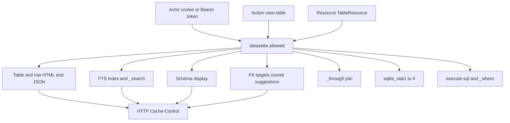

2026-09-10〜11、Datasette は 1.0 アルファ系列の **1.0a39** と安定系列の **0.65.4** を公開しました。公式発表はブログ [Datasette 1.0a39 and 0.65.4 security releases](https://datasette.io/blog/2026/september-security-releases/) です。対象は、公開インターネット上で認証プラグインを使い、同一インスタンス（特に同一 DB）に公開テーブルと非公開テーブルを混在させる構成です。本稿は公式 [changelog](https://docs.datasette.io/en/latest/_sources/changelog.rst.txt)、[GitHub release 1.0a39](https://github.com/simonw/datasette/releases/tag/1.0a39) と [0.65.4](https://github.com/simonw/datasette/releases/tag/0.65.4)、[認証](https://docs.datasette.io/en/latest/authentication.html)・[FTS](https://docs.datasette.io/en/latest/full_text_search.html)・[キャッシュ](https://docs.datasette.io/en/latest/performance.html) のドキュメント、1.0a39 時点の実装コメントに基づきます。

読者が得るものは、テーブル本体だけでなく FTS 索引・外部キー関連・スキーマ表示・統計テーブル・HTTP キャッシュへ同じ `view-table` を載せる修正の形、安定系列の公開ノートとの差、混在公開で突き合わせる取得経路、自前アプリへ写すときの検収条件です。

*この記事の全体像。以下、順に解説します。*

## Datasetteとは

Datasette は SQLite データベースを Web と JSON API で公開する OSS ツールです。テーブルページの HTML と JSON だけでなく、全文検索、外部キーの件数、スキーマ表示、内部統計テーブル、任意 SQL 実行といった別エンドポイントからも、同じテーブルの情報が取れます。

2026-09-10 の changelog に 1.0a39 が載り、2026-09-11T00:06:55Z に GitHub が 0.65.4 を published しています。きっかけは外部の AI 支援報告（Sevban Dönmez）です。Simon Willison と Alex Garcia が Claude Fable 5.1、GPT-5.6 Sol、GPT-6 Astra で類似を探し、人間側は issue ごとに「再現テスト担当」と「修正実装担当」を入れ替えました。Datasette Cloud には先行適用済みです。一部の自動テストは、アップグレード猶予のため公開リポジトリに出していません。

認可の単位は actor × action × resource です。照合は `datasette.allowed` です。解決順は resource、parent、global です。同一レベルでは deny が先です。どのルールにも当たらなければ deny です。テーブル名とビュー名は、SQLite の ASCII 大文字小文字非区別で照合します。

テーブルページ以外にも、同じ resource の情報が出ます。

派生テーブルの `view-table` は、自分のルールに加えて直近のソースも見ます。

| 派生 | 追加で必要なソース |
|---|---|
| FTS / RTree シャドウ | 対応する仮想テーブル |
| external-content FTS | content テーブル |
| fts5vocab / fts4aux | 対応する FTS テーブル |
| ソース自身が派生 | 常に deny |

`sqlite_stat1`〜`sqlite_stat4` はプラグイン `datasette.default_permissions.sqlite_statistics` が `view-table` を deny します。root にも効きます。`execute-sql` と SQLite 内部の統計利用は変えていません。

FTS では、`?_fts_table=` が設定または自動検出と完全一致するときだけ通ります。検索には FTS テーブル自身と対象テーブル双方の `view-table` が要ります。

非公開・個人化の動的応答は `Cache-Control: private, no-store` です。匿名の動的応答は `Vary: Cookie, Authorization` です。`default_cache_ttl` の既定は 5 秒です。個人化応答の `private, no-store` は TTL と `?_ttl=` より優先し、キャッシュヘッダを切っていても優先します。

1.0a39 の `datasette/app.py` では、応答開始時に次を見ます。static かつ HTTP 200/304 は除外します。

- `request.actor` がある
- Cookie または Authorization リクエストヘッダがある
- 応答が Set-Cookie を付ける

いずれかなら既存 Cache-Control を捨てて `private, no-store` にします。同じ wrapper は個人化応答にも `Vary: Cookie, Authorization` を足します。changelog と settings.rst は匿名側の Vary を強調します。コメントは、公開リソースでも actor ナビや private ラベルが混ざるため、描画後に決めると書いています。

## 注意点

リリースノートは「**Some of** the security fixes include」です。公開箇条は網羅リストではありません。公式ブログは 0.65.x へ「**selected** fixes」を backport したと書きます。安定系列を 1.0a39 と同一集合と読んでよい、とは書いていません。

1.0a39 / 0.65.4 向けの新規 CVE と GitHub Security Advisory は、2026-09-14 時点で確認できません。

テーブルの `allow` は任意 SQL を止めません。これは今回以前から公式 Warning です。

キャッシュ修正はアプリが付ける応答ヘッダです。CDN が `Cache-Control` / `Vary` を無視すれば、共有キャッシュ汚染は残ります。

一部回帰テストは非公開です。第三者は「閉じ切った」を同じテストで再証明できません。

リポジトリ stars は約 11.5k（2026-09-14、`gh repo view` 整数 11460）です。整数の断定はしません。

先行の別件を混同しないでください。

| 識別子 | 対象 | パッチ |
|---|---|---|
| GHSA-w3hf-fcg5-p4cc | テーブルフィルタの identifier SQLi。同一 DB の制限テーブルを `execute-sql` deny でも読めた | 1.0a38 / 0.65.3（2026-08-06） |
| CVE-2025-64481 / GHSA-w832-gg5g-x44m | オープリダイレクト `//example.com/` | 1.0a21 / 0.65.2 |
| GHSA-7ch3-7pp7-7cpq / CVE-2023-40570 | API explorer が非公開の DB/テーブル名を漏洩 | 1.0a4（affected 1.0a0〜1.0a3） |

facets / CSV / `datasette inspect` の権限修正は 1.0a39 箇条にありません。プラグイン（例: 歴史的な datasette-graphql のスキーマ名漏洩 GHSA-74hv-qjjq-h7g5、2020-11-21）は、今回の公開監査範囲に含まれたと書いていません。AI 監査は公式自身が first time、private repo、テスト一部非公開です。他組織がそのまま「信頼できる体制」とコピーできる公開プレイブックではありません。1.0a39 後に core の facets/CSV で private **内容**が読める公開 PoC は、探した範囲ではありません。

## 1.0a39が直したテーブル以外の経路

出典は changelog RST `1.0a39 (2026-09-10)` と GitHub release `1.0a39` です。

| 経路 | 修正の内容 |
|---|---|
| テーブル/ビュー名 | SQLite の case-insensitive 名で権限を照合 |
| FTS 索引テーブル | 元コンテンツテーブルの閲覧権限を確認 |
| sqlite_stat1〜4 | デフォルト deny（上記プラグイン） |
| スキーマ表示 | `view-table` に従う |
| `?_through=` | 中間テーブルの `view-table` |
| FK | ターゲット/サジェスト API、incoming 関係とその件数が `view-table` |
| 行 URL | PK 解決の前に権限チェック（不可視 PK の存在漏洩を避ける） |
| create-table API | 権限チェックを強化 |
| write SQL の CREATE VIEW | 参照テーブルに `view-table` |
| 非信頼スキーマの列名 | SQL identifier と HTML の escape |
| URL 列 | 検証済み HTTP/HTTPS のみリンク |
| 動的応答 | 個人化なら `private, no-store`。匿名は Vary Cookie と Authorization |
| Actor cookie | `expire_after` を尊重 |
| Restricted actor | API トークン作成不可 |
| stored-query フォーム | frame 禁止（clickjacking） |
| シークレット redaction | キー名を大文字小文字非区別 |
| SQLite 拡張 | `--load-extension` 後に `enable_load_extension(False)` |

公開 Web で public+private を混在させる Datasette は、テーブル HTML だけでなく FTS・関連・スキーマ・件数・キャッシュまで同じ `view-table`（および cache ヘッダ）を通す必要があります。1.0a39 はその方向の修正束です。公式は「全経路を閉じた」とは書いていません。

## 安定系列0.65.4の公開ノートとの差

0.65.4 が明示する security 箇条は次です（`gh release view 0.65.4`）。

- テーブル/ビュー名の case-insensitive 照合
- `?_through=` の中間テーブル権限
- 非信頼スキーマの PK 列 identifier escape（row lookup / pagination）
- FTS **検出**を parameterized SQL にし、テーブル名のワイルドカードをリテラル扱い
- `Cache-Control: private, no-store` と匿名の Vary
- `--load-extension` 後の拡張ロード無効化

1.0a39 にあって 0.65.4 ノートに無い代表（非網羅）は、FTS **元テーブル**権限、sqlite_stat deny、スキーマ表示、FK API/件数、行 PK 前チェック、create-table API、CREATE VIEW の view-table、一般列の SQL identifier escape と HTML escape、URL 列検証、cookie 期限、restricted actor のトークン禁止、clickjacking、secret redaction です。

0.65.4 ノートの identifier escape は PK 列（row lookup / pagination）に限定して書かれています。1.0a39 は一般列の SQL escape と HTML escape を別箇条で書きます。

0.65.4 独自の列挙は「FTS 検出 SQL のパラメータ化」です。これは閲覧時の content テーブル権限とは別修正です。

ノート未記載の silent backport は、公開一次では確認していません。安定系列の 0.65.4 は、1.0a39 の一部とキャッシュ修正を含む selected backport です。0.65.4 を「1.0a39 と同等」と扱わないでください。

## 混在公開で見る取得経路

混在公開のインスタンスでは、次を同じアクターで突き合わせます。期待は「本文が 403 なら、派生も 403 または空で、件数・名前・キャッシュも同じ条件」です。

| # | 経路 | 確認の例 |
|---|---|---|
| 1 | テーブル HTML/JSON | `/db/secret` と `/db/secret.json` |
| 2 | 行 URL | 存在する PK と存在しない PK。404 と 403 の差で存在が割れていないか |
| 3 | スキーマ | `/db/secret/-/schema` 相当、テーブルページの CREATE TABLE 表示 |
| 4 | FTS テーブル直叩き | `/db/secret_fts`。content が secret なら deny |
| 5 | `_search` | 公開テーブルから private 由来トークンがヒットしないか。`?_fts_table=` のすり替え |
| 6 | FK | incoming 関係、件数、サジェスト API が private を列挙しないか |
| 7 | `_through=` | 中間テーブルが private なとき |
| 8 | sqlite_stat | `sqlite_stat1` 等の閲覧 |
| 9 | 大文字小文字 | `Secret` / `secret` / `SECRET` が同一テーブルとして deny/allow されるか |
| 10 | 任意 SQL と `_where=` | `execute-sql` を落としたあともフィルタだけで読めないか（1.0a38 以降の前提確認） |
| 11 | キャッシュ | 認証済み応答が共有キャッシュに乗らないか。`Cache-Control` と `Vary`。CDN の上書き設定 |
| 12 | トークン | restricted actor が `/-/create-token` できないか。期限切れ cookie |

安定系列だけを使う場合は、上表のうち 0.65.4 ノートに無い項目（FTS 元テーブル、schema、FK 件数、stat、行 PK 前チェック）を特に実測します。ノートに無いなら「直っている」と仮定しません。

未解決のまま残る問いは次です。公開 Web の混在デプロイを止める理由にはなりません。アップグレード後に上表を実測する理由になります。

- 0.65.4 のコードが、ノート未記載の 1.0a39 項目を silent backport しているか（公開ノートとブログの selected という表現は否定方向）
- withheld テストがカバーする未公開経路の範囲
- facets / CSV / inspect / プラグイン検索の残差
- CDN と `cache_headers=False` と hashed-urls プラグインの組み合わせ
- 1.0a39 バンドルに後から CVE/GHSA が付くか（2026-09-14 時点では無い）

## AI支援監査を制度として見るときの芯

公式が公開した工程は次です。

1. 外部の AI 支援報告を受ける
2. 複数 frontier モデルで類似を探す
3. 人間 2 人がテスト作成と修正実装を分ける
4. 一部テストを公開しない
5. Cloud に先行適用し、alpha と stable を同日出す

意思決定に使える核は「エージェントが欠陥・パッチ・クローズ証明を同一コンテキストで独占しない」ことです。再現テストを別人が書く、という分離は、エージェントが両方得意になったあとの検証権限の設計です。

一般化して「AI 監査を入れれば十分」とは一次ソースは言っていません。first time、private 作業、テスト非公開、第三者監査ではない、という限定が同時に付きます。

## 系列ごとのアップグレード判断

公開インターネットで認証付き Datasette を動かしているなら、系列に合わせて **1.0a39 または 0.65.4 以上**へ上げます。

同一 DB に公開と非公開を混在させるなら、テーブル `allow` だけでなく **`execute-sql` / `allow_sql` / `default_allow_sql` を落とします**。これは 1.0a38 時点の公式助言でもあります。

安定系列だけを使うなら、0.65.4 を「1.0a39 と同等」と扱いません。FTS 元テーブル・schema・FK・stat・行存在漏洩を実測します。

共有キャッシュ（Cloudflare / Fastly / Varnish）を前段に置くなら、認証応答をキャッシュしない設定をアプリヘッダと独立に確認します。

自前アプリで同じ設計をするなら、認可対象を「レコード本体」に限らず、検索索引・関連・件数・スキーマ・キャッシュキーまで列挙します。再現テストと修正実装を別コンテキストにします。

逆転条件は、インスタンスが完全公開で認証も private テーブルも無い、またはネットワーク内のみで共有キャッシュが無いことです。その場合でも identifier escape と拡張ロード無効化は上げてよいです。

## まとめ

Datasette 1.0a39 は、公開と非公開を同一インスタンスに混在させる構成で、テーブル HTML だけでなく FTS・関連・スキーマ・件数・キャッシュへ同じ `view-table` と cache ヘッダを通す修正束です。安定系列の 0.65.4 は selected backport であり、公開ノート上は 1.0a39 と同一集合ではありません。

上げる判断の芯は 3 点です。系列に合わせて 1.0a39 または 0.65.4 以上へ上げる。混在公開なら `execute-sql` を落とす。安定系列だけならノート未記載の経路を実測し、共有キャッシュはアプリヘッダと独立に切る。AI 監査のコピー対象は「テストと修正を同一コンテキストで独占しない」分離であり、ツール導入そのものではありません。

この記事が少しでも参考になった、あるいは改善点などがあれば、ぜひリアクションやコメント、SNSでのシェアをいただけると励みになります！

## 参考リンク

1. Datasette Blog, “Datasette 1.0a39 and 0.65.4 security releases”, 2026-09-11. https://datasette.io/blog/2026/september-security-releases/
2. Changelog RST, 1.0a39 (2026-09-10). https://docs.datasette.io/en/latest/_sources/changelog.rst.txt
3. GitHub release 1.0a39. https://github.com/simonw/datasette/releases/tag/1.0a39
4. GitHub release 0.65.4. https://github.com/simonw/datasette/releases/tag/0.65.4
5. Authentication and permissions. https://docs.datasette.io/en/latest/authentication.html
6. Full-text search. https://docs.datasette.io/en/latest/full_text_search.html
7. Performance and caching. https://docs.datasette.io/en/latest/performance.html
8. settings.rst (`default_cache_ttl`), tag 1.0a39. https://raw.githubusercontent.com/simonw/datasette/1.0a39/docs/settings.rst
9. `datasette/app.py` Cache-Control wrapper, tag 1.0a39. https://raw.githubusercontent.com/simonw/datasette/1.0a39/datasette/app.py
10. GHSA-w3hf-fcg5-p4cc (1.0a38 / 0.65.3). https://github.com/simonw/datasette/security/advisories/GHSA-w3hf-fcg5-p4cc
11. NVD CVE-2025-64481. https://nvd.nist.gov/vuln/detail/CVE-2025-64481
12. simonw/datasette#2874 (closed). https://github.com/simonw/datasette/issues/2874
13. Simon Willison, link post 2026-09-11. https://simonwillison.net/2026/Sep/11/datasette-security/
