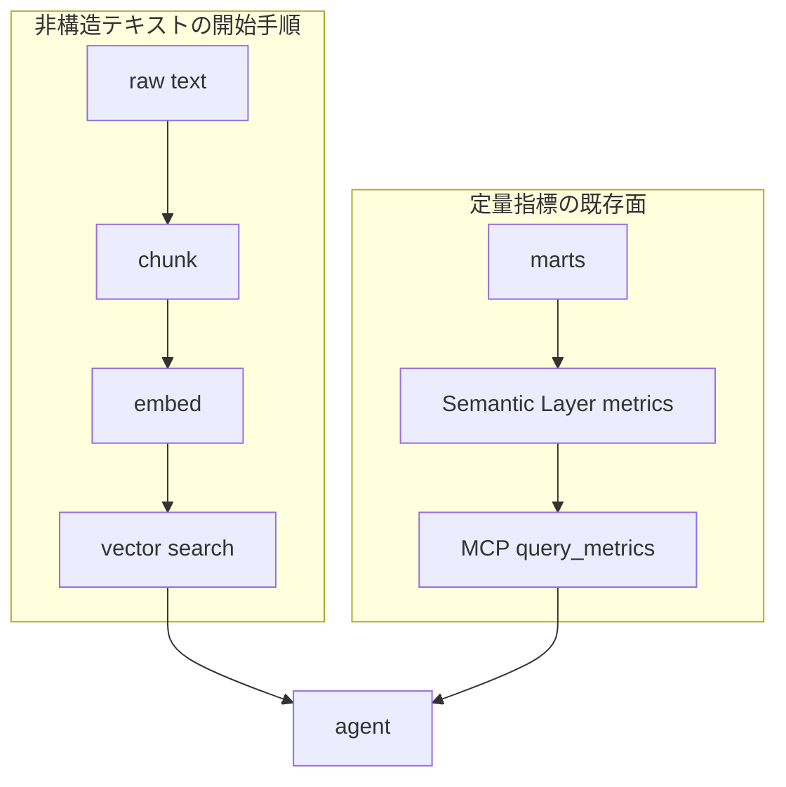

2026-09-24、dbt Labs の Britton Stamper が [Context engineering is already possible in your warehouse](https://www.getdbt.com/blog/context-engineering-in-your-warehouse) を公開しました。分析チームがダッシュボード向けにデータをモデル化してきた、という切り出しです。記事は、エージェント向けの context engineering を semantic search から始める、と説明しています。実装の置き場は別のベクトルデータベースではなく、Snowflake、Databricks、BigQuery が SQL 関数として持つ埋め込みと検索です。

同日前後に公開されたパッケージ [`dbt-labs/dbt-context-engineering`](https://github.com/dbt-labs/dbt-context-engineering/tree/0.1.2) 0.1.2 が、その開始手順を chunk、embed、vector search の dbt モデルとして配っています。想定読者は、既存の dbt プロジェクトを持つ分析エンジニアです。

この記事では、開始手順の中身、記事とパッケージの対応、定量指標を渡す既存の面との並びを整理します。数値と到達範囲は、dbt Labs と Fivetran の公開資料に書かれた自己申告です。

*この記事の全体像。以下、順に解説します。*

## dbtのcontext engineeringとは

開始手順の実体は、倉庫ネイティブの意味検索です。パッケージ 0.1.2 の README は、最初の設計パターンを Chunk、embed、search と書いています。classify は精度を上げる追加であり、開始の前提には入っていません。

出荷物は、通常の dbt モデル、マクロ、seed、テストです。Hub の要求バージョンは `>=1.11.0, <3.0.0` です。対応エンジンは Snowflake Cortex、Databricks、BigQuery です。

埋め込みは派生資産として扱います。`content_hash` と `version_guard` で、本文が変わった行だけ、またはモデルが変わったコーパス全体を再埋め込みします。`ai_functions_enabled` の既定は `false` です。明示するまで、課金される AI 呼び出しはコンパイルエラーになります。

検索の既定は、埋め込み列に対する brute-force のコサイン類似度です。`top_k` の既定は 10 です。出典列と `filter` を渡せます。`grounded` テストは、根拠引用が元テキストの部分文字列でなければ失敗します。

記事が full pattern と呼ぶ列の終端には、semantic layer による注釈と、AI ツールへの接続があります。接続先として Claude、ChatGPT、Fivetran Context Layer を名指ししています。2026-09-24 の記事本文には、dbt MCP の設定手順はありません。パッケージの検索マクロは、その注釈段を呼びません。

定量指標をエージェントに渡す面は、別に存在します。dbt MCP の Semantic Layer ツールは `list_metrics` と `query_metrics` を含みます。self-hosted では `DISABLE_SEMANTIC_LAYER` の既定が `false`、`DISABLE_SQL` の既定が `true` です。

記事の「始め方」が挙げる語彙は、chunking、embedding、vectors、classification の 4 つです。DAG の新しい層の見出しは「chunk, classify, embed」です。その後の列は source、staging、marts、chunk、classify、embed、agent です。

記事とパッケージ 0.1.2 が置いている流れは、次の二本です。上が非構造テキストの開始手順、下が既存の指標面です。

## 注意点

公開資料の数値と到達宣言は、dbt Labs と Fivetran の自己申告です。独立した再現ログは、公開された付録としては見当たりません。

| 主張 | どこに書いてあるか | どこまで信じてよいか |
| --- | --- | --- |
| 体積 20 倍以上。60 分の通話を 10,000 トークン超から数百へ。同じトランスクリプトは 74 倍少なく、99% 安い | [Model for the token, not the table](https://www.getdbt.com/blog/model-for-the-token-not-the-table)（2026-08-17、同一著者） | 同じ記事の中で倍率の定義が揃いません。注釈のアンカーは raw 8,314 トークンと brief 112 トークンで、比は約 74 倍です。本文の「10,000 が通常 500 から 1,000」は 10 倍から 20 倍です。表の 1 ターン合計は 0.375 ドルから 0.090 ドルで、残量は約 24% です。99% 安いはこの表と一致しません |
| 60 分の Gong を数万トークンから数百へ、体積 20 倍 | 2026-09-24 の記事が上の投稿を要約した文 | 2026-08-17 の「10,000 トークン超」を tens of thousands と言い換えています。74 倍と 99% はこの文にありません |
| 類似度 0.754 の断片が 1 位になり、分類フィルタ後に上位が入れ替わる | パッケージ README 0.1.2 が `jaffle-logistics` のデモ表を再掲 | デモコーパス上の自己計測です。埋め込みモデル名とコーパスのハッシュは、その表だけでは付いていません |
| Semantic Layer の精度 98.2%（claude-sonnet-4-6）と 100.0%（gpt-5.3-codex） | [Semantic Layer vs. Text-to-SQL: 2026 Benchmark Update](https://docs.getdbt.com/blog/semantic-layer-vs-text-to-sql-2026)（2026-04-07） | この二つは、モデルを 3 つ足して 11 問すべてに答えられるようにしたあとの表です。追加前の全 11 問では、Semantic Layer は両モデルとも 72.7% です。ホップ内（Too Many Hops = False）は両モデル 100.0%、ホップ外は 0.0% です。TL;DR の「覆う質問では 100% に近づく」は、98.2% のセルの条件文ではありません |
| ベクトルデータベースもグラフデータベースも別製品も要らない | 2026-09-24 の記事 | brute-force の開始手順には当たります。規模用の `create_vector_index` は `dbt run-operation` 専用で、Snowflake Cortex Search、BigQuery vector index、Databricks Vector Search という別課金のオブジェクトを作ります。0.1.2 の `vector_search` はその索引をクエリしません |
| Fivetran Context Layer は limited public preview | 2026-09-24 の記事 | 2026-09-16 の [Summit 記事の表](https://www.getdbt.com/blog/dbt-summit-2026-product-announcements) は Private Beta です。段階名が一次資料のあいだで揃っていません |
| パッケージは信頼できる context を規模で動かせる | README の成熟度表 | Validated はサンプルデータ上の実行と、決定的処理の duckdb テストです。本番規模と、エンジンの利用量表とのコスト照合は未了、と README が書いています。SLA はありません |

手順の粒度も、記事とパッケージでずれます。記事の見出しは chunk、classify、embed を一列に置きます。パッケージは Chunk、embed、search を開始パターンとし、classify を unlock と呼んでいます。開発者ブログ [dbt_context_engineering](https://docs.getdbt.com/blog/dbt-context-engineering)（Stephen Thibeault、2026-09-16）の 5 分手順は、パッケージ 0.1.0 を足し、最初のコード例を `chunk()` にしています。Hub の latest は 0.1.2 です。タグ 0.1.2 の `dbt_project.yml` の `version` キーは `'0.1.0'` のままです。

`bq_connection` も記述が割れています。タグ 0.1.2 の `dbt_project.yml` コメントは BigQuery で required と書き、README は optional と書きます。マクロが実行時にどちらを強制するかは、ここからは断定できません。

公開時点の規模感は次のとおりです。2026-09-25 の `gh repo view` では、`dbt-labs/dbt-context-engineering` は archived ではなく、star は約 20、default branch の最新コミットは 2026-09-12 でした。`dbt-labs/dbt-mcp` は star 約 610、`pushedAt` は 2026-09-24 でした。star は時点の概数です。

[`dbt-labs/dbt-mcp` #670](https://github.com/dbt-labs/dbt-mcp/issues/670) は、2026-09-25 時点で open です。タイトルは、Semantic Layer ツールと `execute_sql` が、dbt platform の Snowflake クレデンシャル期限切れで分かりにくいエラーになる、という内容です。Issue 本文の診断は、確定した仕様として扱いません。

次の項目は、参照した公開ページの範囲では値が確定しません。

- Semantic Layer の GraphQL と JDBC の専用レート、および数値のエラーコード表は、[API rate limits](https://docs.getdbt.com/docs/dbt-apis/rate-limits) の一覧にはありませんでした。
- dbt platform の数値アップタイム SLA は、開発者ドキュメントの検索では Semantic Layer 向けの契約値を確認できませんでした。
- トークン削減の 20 倍、74 倍、99% を、同じ母数で再現する付録は、2026-08-17 の記事本文にはありませんでした。

## 開始手順が指標定義を入力にしない理由

2026-09-24 の開始手順は、既存の MetricFlow 定義を入力にしません。semantic layer という語は、記事の終端近くの 1 段落に出ます。引用すると、"Once that context is modeled and annotated with a semantic layer" です。その直後の full pattern が、annotate を一段にしています。記事は MetricFlow という語を使いません。MetricFlow の metric YAML、`dbt sl`、セマンティックモデルの手順は、記事本文にありません。

パッケージ側も同じです。2026-09-25 の GitHub code search では、`dbt-labs/dbt-context-engineering` の `semantic_model`、`metricflow`、`"semantic layer"` は 0 件でした。`dbt-labs/jaffle-logistics` の `semantic_model` と `metrics:` も 0 件でした。`semantic` のヒットは、semantic search の説明です。

再利用している実装は、倉庫の SQL 関数、dbt の増分モデル、テスト、リネージです。指標定義のグラフは、この開始手順の入力ではありません。既存セマンティックレイヤを開始手順が再利用する範囲は、名前の再使用にとどまります。

full pattern から semantic layer を飾りと読む必要はありません。記事は注釈の一段として書いています。残る中核は、実装の開始が MetricFlow を呼ばない、ということです。

指標の単一ソースも、モデルされた範囲に限られます。2026-04-07 のベンチマークは、追加モデル前の全 11 問で Semantic Layer が両モデルとも 72.7%、ホップ外が 0.0%、ホップ内が 100.0% だと書いています。98.2% と 100.0% は、モデルを 3 つ足したあとの表です。覆っていない質問は、誤った数値ではなくエラーになる、とも書いています。

## アクセスと鮮度の置き場

エージェントごとの参照権限は、metric YAML の項目としては出荷されていません。2026-09-25 に参照した [metric properties](https://docs.getdbt.com/reference/metric-properties) の公式表では、`config` がサポートするのは `meta`、`group`、`tags`、`enabled` です。semantic model の config として公式が書いているのは `meta`、`group`、`enabled` です。`group` は owner と、DAG 内の `access: private` による `ref` 制限です。エージェント識別子ごとの行権限ではありません。

権限が実際に掛かる場所は、次の層です。

| 層 | 何を切るか | 一次資料 |
| --- | --- | --- |
| パッケージ | 切らない。`vector_search` の `filter` は呼び出し側の SQL 述語。`ai_functions_enabled` は課金される AI 呼び出しの開閉 | README 0.1.2 |
| Semantic Layer の倉庫クレデンシャル | 発行する SQL の物理アクセス。読み取り最小権限を推奨。設定したクレデンシャルに紐づく物理ポリシーは尊重される、と FAQ が書く | [SL FAQ](https://docs.getdbt.com/docs/use-dbt-semantic-layer/sl-faqs)、[setup](https://docs.getdbt.com/docs/use-dbt-semantic-layer/setup-sl) |
| トークンとクレデンシャルの対応 | Starter はプロジェクトあたりクレデンシャル 1 つに複数トークン。複数クレデンシャルは Enterprise と Enterprise+。PAT は個人の development credential でクエリする | 同上 |
| Remote MCP の OAuth スコープ | 利用者の既存権限へのフィルタ。新規権限は付与しない。`projects:query` は Semantic Layer の metric クエリ。`catalog:read` はメタデータ。`projects:develop` は CLI によるモデル更新。`jobs:run` はジョブの閲覧、編集、再実行。同意画面で個別に外し、全プロジェクトか選択プロジェクトかを選べる | [OAuth](https://docs.getdbt.com/docs/platform/manage-access/connect-apps-oauth) |
| Self-hosted MCP のツールセット | SQL ツールは既定で無効（`DISABLE_SQL=true`）。Semantic Layer、Discovery、Admin API、dbt CLI は既定で有効。CLI には倉庫へ SQL を実行する `show` と、モデルを実体化する `run` がある | [環境変数](https://docs.getdbt.com/docs/dbt-ai/mcp-environment-variables)、[ツール一覧](https://docs.getdbt.com/docs/dbt-ai/mcp-available-tools) |
| Remote MCP の SQL | OAuth 接続では、MCP URL とサインインだけで `execute_sql` を使える、とセットアップページが書く。トークン認証では `execute_sql` は PAT 必須で、service token では動かない。development environment ID と user ID が要る | [setup remote MCP](https://docs.getdbt.com/docs/dbt-ai/setup-remote-mcp) |

鮮度も、semantic model のフィールドではありません。モデルの `freshness`（`warn_after`、`error_after`、Enterprise の `build_after`）は model config です。最新 spec では `semantic_model` がその model の YAML に入るので、同じファイルの隣のキーとして `config.freshness` と `config.grants` を併記できます。所属は model config のままです。パッケージ 0.1.2 の code search では `freshness` が 0 件でした。埋め込みの鮮度相当は `content_hash` と `version_guard` です。classify にはそのキャッシュが無く、再ビルドで同じテキストが別ラベルに落ちうる、と README が書いています。

キャッシュを有効にすると、公式は別の制限を書きます。キャッシュされたデータは元モデルとは別に置かれ、キャッシュから引く場合、クエリ時にそのテーブルへ security context を適用しません。将来、クレデンシャルを clone して最小権限を付ける計画だと続けています。キャッシュは Enterprise と Enterprise+ のオプトインです。設定した Semantic Layer クレデンシャルが、すべての取得で行アクセスを強制する、とは読めません。

レートの一次値は次のとおりです。Remote MCP は IP あたり 5,000 requests/min です。Administrative API はアカウントあたり 5,000 requests/min です。Discovery API は 500 requests/min です。Admin と Discovery が上限を超えると、HTTP 429 のあと 5 分のクールダウンがあります。Remote MCP の 429 節は、待って間隔を延ばす、とだけ書きます。`list_metrics` が返す CSV の既定上限は 16,000 文字です。メトリクス数が 10 以下のとき、同じ応答に dimension 名と entity 名をインラインします。超えるとメトリクス名だけを返し、`get_dimensions` と `get_entities` を別に呼びます。`text_to_sql` だけが dbt Copilot の action 枠を消費します。他の MCP ツールは消費しません。chunk、embed、classify の推論費を Queried Metrics や Copilot actions として dbt が請求する、という記述は、参照した範囲にはありませんでした。パッケージはそれをウェアハウスの AI 関数の課金として扱います。

## 二つの境界を分けて渡す

対話の記憶グラフと、エージェントが検索してよい指標定義は、2026-09-24 の記事の中では同じ契約に畳まれていません。エージェントに渡す「答えてよい事実」は、少なくとも次の二つです。dbt は 2026-09 の開始手順で、そのうち抜粋検索だけを倉庫のモデルにしました。指標定義の境界は、以前からある Semantic Layer と MCP の `query_metrics` に残っています。

| 境界 | 中身 | エージェントが読む面 | 鮮度の置き場 | 権限の置き場 |
| --- | --- | --- | --- | --- |
| 答えてよい指標 | MetricFlow の metric、dimension、entity | MCP の `query_metrics` ほか Semantic Layer ツール。self-hosted では既定で有効 | model config の `freshness`。Discovery の `get_all_sources` と `get_model_health` が source freshness を返す | 倉庫クレデンシャル、トークン対応、OAuth の `projects:query`。metric のフィールドではない |
| 検索してよい抜粋 | chunk テキスト、埋め込み、任意の分類ラベル、引用 URL | パッケージの `vector_search`。配信は利用者が別に結ぶ。パッケージ自身は配信しない | `content_hash` と `version_guard`。classify には同等のキャッシュが無い | 呼び出し側の `filter` と、倉庫上の表権限。エージェント識別子の項目は無い |

`execute_sql` と self-hosted の `show` は、どちらの契約の外にも出ます。remote の OAuth では、同意したスコープが `projects:query` だけとは限りません。セットアップページは、MCP URL とサインインだけで `execute_sql` を使える、と書いています。境界を指標契約に残すには、SQL ツールセットを外し、`projects:develop` と `jobs:run` を同意から外します。self-hosted では `DISABLE_SQL` の既定を維持し、CLI を渡す範囲を別に決めます。

対話記憶向けの分析グラフは、この二境界のどちらにも入りません。記憶グラフは会話の状態を持ちます。抜粋検索は、引用できるチャンクのコーパスです。指標契約は、集計の定義です。三つを一つの semantic model に畳む手順は、2026-09-24 の記事にもパッケージ 0.1.2 にもありません。

## 渡す前に確認する三点

直近の確認は、次の三つで足ります。

1. エージェントに渡す MCP で、`execute_sql` と CLI と `jobs:run` が有効かを見ます。有効なら、指標契約の外を読めます。
2. 非構造の検索を足すなら、パッケージの chunk、embed、`vector_search` を、既存の metric YAML とは別モデルとして置きます。classify は、デモが示す精度の穴を見てから足します。類似度 0.754 の断片が 1 位になり、分類フィルタ後に上位が入れ替わる例は、デモコーパス上の自己計測です。
3. トークン削減倍率は、2026-08-17 の表の定義が揃ってから引用します。揃うまでは、自己申告で、同じ記事内の比が一致しない、と書きます。

## まとめ

2026-09-24 の context engineering は、倉庫内の chunk、embed、vector search から始まります。パッケージ 0.1.2 はその開始手順を dbt モデルとして配り、エージェント、MCP、配信層としては出荷しません。指標定義は、Semantic Layer と `query_metrics` の側に残ります。

鮮度と参照権限は、その指標契約のフィールドとして既に入っている、とは書けません。最新 spec では、同じ model YAML に model config として隣り合わせられます。アクセスをエージェントごとに切る実装点は、同意スコープ、MCP のツールセット、倉庫クレデンシャルの三つです。

この記事が少しでも参考になった、あるいは改善点などがあれば、ぜひリアクションやコメント、SNSでのシェアをいただけると励みになります！

## 参考リンク

- Britton Stamper, "Context engineering is already possible in your warehouse. Here's how to get started.", dbt Labs, 2026-09-24. https://www.getdbt.com/blog/context-engineering-in-your-warehouse
- Britton Stamper, "Model for the token, not the table", dbt Labs, 2026-08-17. https://www.getdbt.com/blog/model-for-the-token-not-the-table
- Britton Stamper, "From analytics engineer to context engineer", dbt Labs, 2026-08-06. https://www.getdbt.com/blog/from-analytics-engineer-to-context-engineer
- Stephen Thibeault, "dbt_context_engineering", dbt Developer Blog, 2026-09-16. https://docs.getdbt.com/blog/dbt-context-engineering
- dbt Labs, "dbt_context_engineering", tag 0.1.2（`dbt_project.yml` の version キーは 0.1.0）. https://github.com/dbt-labs/dbt-context-engineering/tree/0.1.2
- dbt Developer Hub, "dbt Model Context Protocol server". https://docs.getdbt.com/docs/dbt-ai/about-mcp
- dbt Developer Hub, "Available tools". https://docs.getdbt.com/docs/dbt-ai/mcp-available-tools
- dbt Developer Hub, "MCP environment variables reference". https://docs.getdbt.com/docs/dbt-ai/mcp-environment-variables
- dbt Developer Hub, "Set up remote MCP". https://docs.getdbt.com/docs/dbt-ai/setup-remote-mcp
- dbt Developer Hub, "API rate limits". https://docs.getdbt.com/docs/dbt-apis/rate-limits
- dbt Developer Hub, "Connect apps with OAuth". https://docs.getdbt.com/docs/platform/manage-access/connect-apps-oauth
- dbt Developer Hub, "dbt Semantic Layer FAQs". https://docs.getdbt.com/docs/use-dbt-semantic-layer/sl-faqs
- dbt Developer Hub, "Set up the dbt Semantic Layer". https://docs.getdbt.com/docs/use-dbt-semantic-layer/setup-sl
- dbt Developer Hub, "Metric properties". https://docs.getdbt.com/reference/metric-properties
- Jason Ganz, Benoit Perigaud, "Semantic Layer vs. Text-to-SQL: 2026 Benchmark Update", dbt Developer Blog, 2026-04-07. https://docs.getdbt.com/blog/semantic-layer-vs-text-to-sql-2026
- dbt Labs, "Everything we announced at dbt Summit and why it matters", 2026-09-16. https://www.getdbt.com/blog/dbt-summit-2026-product-announcements
- `dbt-labs/dbt-mcp` #670. https://github.com/dbt-labs/dbt-mcp/issues/670
