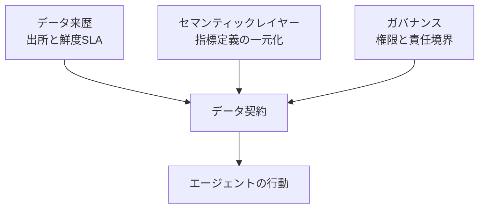

エージェントAIの導入が止まるとき、原因はたいてい「モデルの精度が足りない」ではありません。dbt Labs は、エージェント案件の失敗要因をデータ品質とガバナンスの側に置いて整理しています。

この記事では、その整理を土台に次の 3 点をまとめます。

- エージェントがダッシュボードと決定的に違う点はどこか
- 失敗を分解すると、どの種類のリスクに落ちるのか
- 本番運用に持ち込む前に、データ基盤側で何を決めておくべきか

対象読者は、社内でエージェント導入の可否や進め方を判断する立場の方です。特定製品の操作手順ではなく、**判断に必要な構造**を扱います。

*この記事の全体像。以下、順に解説します。*

## エージェントがダッシュボードと決定的に違う点

BI ダッシュボードとエージェントは、どちらも同じデータウェアハウスを読みます。それでも運用上のリスクの性質はまったく違います。

| | ダッシュボード | エージェント |
|---|---|---|
| 出力 | 人が読む数値・図 | システムへの操作・外部への回答 |
| 誤りの経路 | 人が見て気づける | そのまま実行される |
| 誤りの伝播 | 判断の遅れ | データ変更・顧客への約束 |

ダッシュボードの数値がおかしければ、見た人が「これは変だ」と止められます。人間の目が最後のフィルタとして機能します。

エージェントは、その最後のフィルタを外した状態でデータを消費します。**データが行動に直結する**ため、鮮度の遅れ・指標定義のずれ・来歴の不明さが、そのまま操作ミスや誤った顧客対応として外に出ます。

dbt Labs はこの具体例として、Replit の環境で本番データベースが削除された事案と、Air Canada のチャットボットが不正確な案内を行った事案を挙げています。前者は「エージェントに与えた権限の範囲」の問題、後者は「エージェントが参照した内容の正しさ」の問題です。どちらもモデルの推論品質というより、**行動可能な範囲と参照するデータの統治**の問題として読めます。

同じデータを読んでも、エージェント側には人の判断を挟むノードがありません。ここが設計上の分岐点です。

## 失敗を 3 種類のリスクに分解する

dbt Labs は、エージェントAIに起因するリスクを 3 つに分類しています。原因の所在が違うため、対策の置き場所も変わります。

| リスク | 内容 | 主な対策の置き場所 |
|---|---|---|
| 運用上の正確性リスク | 古い・欠落した・誤解釈されたデータに基づいて行動する | データ基盤（鮮度 SLA・指標定義） |
| コントロールプレーンのリスク | 過大な権限付与、弱い監査性、貧弱なセキュリティ境界 | 権限設計・監査ログ |
| 人間とシステムのリスク | 人がエージェントを過信し、レビューが形骸化する | 運用プロセス・レビュー設計 |

この分解が実務で効くのは、**失敗の再発防止策を配置する場所を間違えなくなる**からです。

たとえば「エージェントが誤った売上数値を顧客へ提示した」という事象は、プロンプトの書き方の問題として扱われがちです。しかし分解すると、多くの場合は指標定義が部署ごとに割れていた（運用上の正確性リスク）か、そもそも顧客へ直接出す権限を与えていた（コントロールプレーンのリスク）に落ちます。プロンプトを直しても、次に別の指標で同じことが起きます。

3 つのうち、モデル側の工夫で減らせるのは限られた部分です。残りはデータ基盤と権限設計の仕事になります。

## エージェントに向く仕事・向かない仕事

導入判断の前に、対象業務がエージェントに向くかを見極めます。dbt Labs が挙げる、向くユースケースの特徴は次のとおりです。

- 大量で反復可能なタスクである
- 成功基準が明確である
- 人によるレビューのコストが低い
- 行動が**可逆**である
- **権威あるデータ（authoritative data）**が利用可能である

逆に、不可逆な行動を伴うタスクや、責任の所在が曖昧なタスクには向きません。

実務で使うなら、次のように質問の形にしておくと判断が速くなります。

| 観点 | 確認する問い |
|---|---|
| 反復性 | 同じ手順が月に何十回も走るか |
| 成功基準 | 「正しくできた」を誰でも同じ判定にできるか |
| レビュー可能性 | 出力の正しさを短時間で確認できるか |
| 可逆性 | 間違えたとき、取り消せるか |
| データの権威性 | 参照先が「正」だと組織として合意されているか |

最後の「権威性」が、他の 4 つと比べて見落とされやすい観点です。**同じ指標が部署ごとに違う値を持っている状態では、エージェントは何を正としても間違える**ことになります。この状態を放置したまま自律実行に進むと、失敗の原因がモデル側にあるように見えてしまい、切り分けが長引きます。

## 行動を統治する 3 本柱

では、エージェントに渡すコンテキストを何で制御するのか。dbt Labs は、データ契約の構成要素として次の 3 本柱を挙げています。

### データ来歴（Lineage）

データの出所と信頼性を、鮮度 SLA を含めてエージェントに明示します。目的は、**エージェントが前提としている「現実のバージョン」を担保する**ことです。

エージェントは、参照したテーブルが 3 日前の断面かどうかを自力で知りません。来歴と鮮度が示されていなければ、古い在庫数を根拠に発注を実行するといった失敗が、エラーを出さずに成立します。

### セマンティックレイヤー（Semantic layers）

データがどのビジネス概念に対応するかを、人間とエージェントの間で共通・一貫させます。指標定義の一元化がここに入ります。

「解約率」「アクティブユーザー」といった語が、レポートごとに異なる定義で運用されている組織は珍しくありません。人間同士なら会話で補正できますが、エージェントは補正せずに実行します。**意味の一致は、エージェント導入の前提条件**として扱う必要があります。

### ガバナンス（Governance）

エージェントがアクセス・決定・変更できる範囲、つまり更新権限を厳密に制御します。あわせて、障害時の責任境界も定めます。

ここでの要点は、権限を「与えるか与えないか」の二値で考えないことです。読み取りだけ、下書きまで、限定された範囲の書き込みまで、と**段階を刻める形で設計**しておくと、次節の進め方がそのまま使えます。

## 導入の進め方 — 権限を 3 段階で広げる

dbt Labs が推奨する運用方針は、次の 3 点に整理できます。

### 1. 権限と行動の段階的拡大

いきなり自律実行に進まず、3 段階で広げます。

| 段階 | エージェントの役割 | 人の関与 |
|---|---|---|
| 読み取り専用 | 情報検索・要約 | 出力を人が使う |
| ドラフト作成 | 変更案・回答案の作成 | 人のレビューを前提とする |
| 境界付き書き込み | 限定された範囲でのみ行動 | 事後の監査 |

不可逆な行動や、安全性が問われる行動は自律実行から除外します。

この段階分けは、単なる慎重さの表明ではありません。**各段階で観測できる失敗の種類が違う**点に価値があります。読み取り専用の段階で指標定義のずれが表面化すれば、書き込み権限を渡す前にセマンティックレイヤー側を直せます。

### 2. データ契約の明文化

エージェントが参照・操作するデータについて、次の項目をデータ基盤層でコード化し、インフラとして強制します。

- 更新権限
- 鮮度 SLA
- 指標定義
- 障害発生時の責任者

**ドキュメントではなくコードとして持つ**点が要点です。運用ルールを文書に書くだけでは、エージェントはそれを読みません。読み取り経路そのものを制約する形にしないと、契約は守られません。

### 3. コンテキストの集権化と相互運用

チームごとにサイロ化されたデータをそれぞれ AI に読み込ませるのではなく、一元化されたデータ基盤を通して共有のビジネスロジックとガバナンスを効かせます。

サイロのまま各チームがエージェントを立てると、指標定義の不一致がエージェントの数だけ増えます。統制のコストは、後から効かせるほど高くつきます。

## 残る論点

この整理は方向性としては明快ですが、実装に落とすと未解決の部分が残ります。

| 論点 | 内容 |
|---|---|
| レイテンシ | 既存のデータウェアハウスとセマンティックレイヤーを連携させたとき、エージェントがリアルタイムに行動判断するための応答時間をどう満たすか |
| リアルタイム検知 | 幻覚による誤った書き込みなどの誤操作を、ガバナンスレイヤーでどう検知しブロックするか |

どちらも「事前に契約を決めておく」だけでは閉じない問題です。前者はアーキテクチャの選択、後者は実行時の監視の設計に踏み込む必要があります。導入計画を立てる際は、この 2 点を検証項目として明示的に残しておくことをおすすめします。

## まとめ

- エージェントはダッシュボードと違い、人の目を挟まずにデータを行動へ変換する。データの誤りがそのまま外部への操作になる
- 失敗は「運用上の正確性」「コントロールプレーン」「人間とシステム」の 3 リスクに分解できる。分解すると対策の置き場所を間違えにくくなる
- 向くユースケースの条件は、反復性・明確な成功基準・低コストなレビュー・可逆性・権威あるデータの 5 つ
- 統治の 3 本柱は、データ来歴・セマンティックレイヤー・ガバナンス。これらをデータ契約としてコード化する
- 進め方は、読み取り専用 → ドラフト作成 → 境界付き書き込みの段階的拡大
- レイテンシ要件と誤操作のリアルタイム検知は、現時点で残る検証項目

エージェント導入の可否を検討する段階なら、モデル選定より先に「自社の指標定義は一元化されているか」「鮮度 SLA を言えるか」を確認するほうが、投資対効果が高いはずです。

この記事が少しでも参考になった、あるいは改善点などがあれば、ぜひリアクションやコメント、SNSでのシェアをいただけると励みになります！

## 参考リンク

- dbt Labs (2026-08-14). *Why agentics projects fail and how to fix them*. https://www.getdbt.com/blog/why-agentics-projects-fail-and-how-to-fix-them
