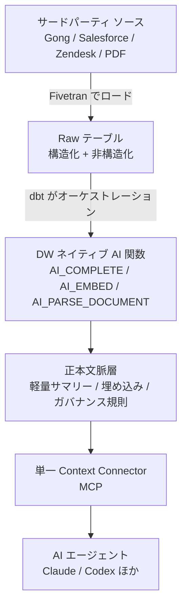

AIエージェントを社内データにつなぐとき、多くの現場はサードパーティのMCPサーバーへ直結します。Gong、Salesforce、Zendesk。ツールごとにMCPを立て、エージェントが必要になるたび生データを取りに行く。素直な設計です。

この素直な設計が、規模を持った瞬間にコストで壊れます。

dbt Labsの [From analytics engineer to context engineer](https://www.getdbt.com/blog/from-analytics-engineer-to-context-engineer)（Britton Stamper、2026-08-06）は、その破綻を回避する構造として「データウェアハウス内で文脈を作り置きする」設計を提示しています。同社のGong統合パイロットでは、トークン消費を約98%削減したと報告されています。

この記事では、その主張の技術構造と、導入前に検討すべきトレードオフを整理します。読み終えると、次の判断ができる状態になります。

- 自社のエージェント連携を直結MCPのままにするか、文脈層を挟むか
- 文脈層を作るとして、何を圧縮し、何を生データのまま残すか
- 文脈モデルの所有者を誰に置くか

*この記事の全体像。以下、順に解説します。*

## なぜ直結MCPはコストで壊れるのか

問題は「同じ重い読み込みを、エージェントが呼ぶたびに繰り返す」点にあります。

dbt Labsの記事によれば、60分の商談録音1件をエージェントが解析するのに最大50,000トークン、約$0.25を消費します。1件なら誤差です。しかし全社でエージェントが自律稼働すると、同じ通話が営業マネージャーの分析、カスタマーサクセスの解約リスク判定、プロダクトチームの要望抽出と、目的違いで何度も読み直されます。

さらにトークン費用だけでなく、プロバイダー側のAPI呼び出し上限も圧迫します。コストとレート制限、両方が同時に効いてきます。

dbt Labsが置いた原則は明快です。

> **重いLLMの読み込み処理はDW内のバッチで1回だけ行い、モデル化された文脈をすべてのエージェントで共有する（Read Once, Serve Every Agent）**

「エージェントごとに読む」から「1回読んで全員に配る」への転換です。これはデータエンジニアリングが以前から解いてきた問題の再演でもあります。BIの世界で、各ダッシュボードがrawテーブルを個別に集計する構成をやめ、共通のマートを置いたのと同じ発想です。

## Analytics EngineeringとContext Engineeringの違い

dbt Labsはこの新しい役割を Context Engineering と呼び、従来の Analytics Engineering と対比しています。

| 評価軸 | Analytics Engineering | Context Engineering |
|---|---|---|
| 主な消費者 | ダッシュボードを見る人間のアナリスト | 組織内で自律稼働するAIエージェント |
| 主対象データ | 定量データ（構造化テーブル・KPI） | 定量 + 定性データ（通話テキスト・メール・PDF・Jira） |
| 主目的 | 過去に何が起きたかを指標で理解する | エージェントが正しく理解し信頼できる行動を取る |
| モデリング手法 | SQL集計・Join・次元モデリング | 圧縮・文脈付与・定義記述・ガバナンス |

重要なのは、**これが置き換えではなく拡張である**点です。ダッシュボード向けのモデリングが不要になるわけではありません。同じdbtプロジェクトの中に、消費者がエージェントであるモデル群が増えるという話です。

対象データの広がりも見逃せません。従来のAnalytics Engineeringは売上やARRといった構造化された数値が中心でした。Context Engineeringでは、通話トランスクリプト、メール文面、PDF、Jiraチケット、サポートログといった非構造化・定性データがモデリング対象に入ります。

## 既存のデータスタックは壊さない

この転換で現代的データスタック（Modern Data Stack）を解体する必要はない、というのがdbt Labsの主張です。役割の割り当てが変わるだけです。

各レイヤーの責務は次のとおりです。

- **データ移動**: Fivetran等で非構造化ファイルとサードパーティデータをDWへ集約
- **変換・AIオーケストレーション**: dbtがDWネイティブのAI関数を実行・管理（例: Snowflake Cortexの `AI_COMPLETE`、`AI_EMBED`、`AI_PARSE_DOCUMENT`）
- **文脈のサーブ**: ツールごとのMCPではなく、単一のContext Connectorを経由してエージェントへ配る

ポイントはAI推論の実行場所です。エージェントのランタイムではなく、dbtが管理するバッチの中でLLMを呼びます。結果として、推論はスケジュールされ、バージョン管理され、lineageに載ります。「いつ・どのプロンプトで生成されたサマリーか」が追跡可能になるということです。

なお、dbt LabsとFivetranは[合併を完了](https://www.getdbt.com/blog/fivetran-dbt-labs-complete-merger-to-create-the-data-infrastructure-for-trusted-ai-agents)しています。この構成図がベンダーのポジショントークを含むことは、読む側として織り込んでおくべきです。とはいえ「重い処理を1回に寄せる」という原則自体は、使うツールに依存しません。

## 文脈モデルの4原則

dbt Labsは、定性データをエージェントが解釈できる文脈に変換するプロセスを4つに整理しています。

### 1. 圧縮（Compress）

長いトランスクリプトや文書からノイズを削ぎ落とし、推論に必要なシグナルだけを残します。目標は「意味を保つ最小の文脈層」です。dbt Labsのパイロットでは60分通話が数万トークンから数百トークンへ、データ量で約20分の1になりました。

ここで問われるのは「何を捨てるか」の設計判断です。要約軸を決めることは、エージェントに見せない情報を決めることと同義です。

### 2. 文脈付与（Enrich）

通話サマリー単体では、エージェントは判断できません。Salesforceの商談フェーズ、解約リスクフラグ、過去の取引履歴といった構造化データをモデル上でJoinし、業務的な位置づけを与えます。

これは従来のAnalytics Engineeringが最も得意としてきた領域です。既存スキルがそのまま効きます。

### 3. 記述（Describe）

そのデータが何を意味し、どういう条件で使えるのかをメタデータとして明記します。業務用語の定義、更新ルール、データの鮮度。人間なら暗黙に補える前提を、エージェント向けには明示する必要があります。

### 4. ガバナンス（Govern）

どのエージェントがどの機密レベルの文脈を参照してよいかを一元管理します。MCPをツールごとに分散させると、このポリシーも分散します。単一のContext Connectorに寄せる動機の半分は、コストではなくガバナンスです。

## 導入前に検討すべき4つのトレードオフ

この設計は万能ではありません。dbt Labsの記事は利点を中心に語りますが、実務では次の4点を先に評価する価値があります。

### 情報損失

20分の1に圧縮するということは、要約軸から漏れた情報が消えるということです。特異な顧客発言、微細な感情の変化、想定外の要望。要約設計時点で予期しなかった問いには、文脈層は答えられません。

現実的な対策は二段構えです。文脈層を第一参照先としつつ、エージェントが不確実性を検知したらraw データや二次検索へドリルダウンできる経路を残します。「文脈層で全部賄う」と決め打つと、後から効いてきます。

### 同期ラグ

Fivetranの同期頻度とdbtのインクリメンタル実行間隔ぶんだけ、文脈は古くなります。数分前に終わった商談や、進行中の障害チャットに即応する用途では、直結MCPのほうが素直です。

つまり、この設計はリアルタイム性が要らない用途に効きます。用途の切り分けが前提です。

### 前払いの推論コスト

コスト構造が「使った分だけ払う」から「使わなくても払う」へ変わります。バッチでLLM推論を回す以上、そのデータが一度も参照されなくてもCortexクレジットは消費されます。

参照頻度が低いデータ群では、事前バッチのほうが総額で上回る可能性があります。98%削減という数字は、**同じデータが繰り返し読まれる前提**で成立します。自社のアクセスパターンを確認してから判断してください。

### ハルシネーションの正本化

これが最も厄介です。dbtパイプライン内のLLMが誤ったサマリーを生成すると、それがDW上の正本テーブルとして保存され、以後すべてのエージェントに誤情報が伝播します。オンデマンド生成なら1回きりの誤りが、作り置きでは永続化します。

対策としては、サマリーへの信頼度スコア付与、人間による抜き取り監査、プロンプトのバージョン管理が挙げられます。ただしこれらは運用コストであり、98%削減の裏側で発生する負債として計上しておくべきです。

## 誰が文脈を所有するのか

技術構成よりも組織側の論点のほうが、実は決着が難しい部分です。

dbt Labsの主張は、データチームの役割が「ダッシュボードの構築者」から「エージェント用文脈モデルのプロダクトマネージャー兼エンジニア」へシフトする、というものです。業務用語集、同義語、指標定義、lineage、アクセス範囲を一元管理する役割です。

ここで注意したいのは、議論の焦点をRAGの検索精度チューニング（ベクトル検索のk数調整など）に置かないことです。精度の問題に見えて、実際には「その業務文脈を誰が定義し、誰が更新責任を負うか」が決まっていないだけ、というケースがあります。

もう1つが**利用ログからの改善ループ**です。エージェントの質問ログ、応答失敗ログ、ハルシネーションを起こしたケース。これらを新しい入力データとして扱い、dbtモデルの記述やプロンプト定義を継続的に修正します。文脈層は一度作って終わりではなく、BIダッシュボードと同じく運用対象になります。

## 明日から取れるアクション

段階的に試すなら、この順序が現実的です。

1. **高コストな定性データソースを1つ特定する**  
   エージェント利用が多く、プロバイダーMCP経由でトークン消費が肥大化しているソース（商談録音、サポートチケット等）を選びます。全社展開の前に1ソースで検証します。
2. **DWネイティブAI関数を小さく試す**  
   Snowflake CortexやDatabricks AI Functionsを、dbtのインクリメンタルモデルに組み込みます。まず1モデル、1プロンプトから始めます。
3. **文脈の窓口を単一化する**  
   ツールごとのMCPサーバーを全社展開する前に、DW内のモデル済み文脈を参照する単一のContext Connectorを立てます。増える前に止めるほうが安くつきます。
4. **承認者と品質ゲートを決める**  
   エージェントが参照するモデルの承認者と、利用ログからのフィードバック手続きを標準ワークフローに組み込みます。ハルシネーション正本化への唯一の防波堤です。

## まとめ

- 直結MCPは「同じ重い読み込みをエージェントが呼ぶたび繰り返す」ため、規模を持つとコストとレート制限で壊れる
- dbt Labsの提案は、DW内のdbtバッチでLLM推論を1回だけ実行し、文脈層を全エージェントで共有する構成（Read Once, Serve Every Agent）
- 同社のGongパイロットでは、トークン消費が約98%削減、データ量で約20分の1に圧縮された
- 文脈モデルの設計は、圧縮・文脈付与・記述・ガバナンスの4プロセスで構成される
- ただし情報損失、同期ラグ、前払い推論コスト、ハルシネーションの正本化という4つのトレードオフがある
- 98%という数字は「同じデータが繰り返し読まれる」前提で成立するため、自社のアクセスパターンを先に確認する
- 技術構成以上に、文脈モデルの所有者と更新責任を誰に置くかが実装の成否を分ける

ダッシュボードのためのデータモデリングは、消費者が人間だから成立していました。消費者がエージェントに変わるなら、モデルの形も変わります。既存のdbtプロジェクトに「エージェント向けのマート」を1つ足すところから始められる話でもあります。

この記事が少しでも参考になった、あるいは改善点などがあれば、ぜひリアクションやコメント、SNSでのシェアをいただけると励みになります！

## 参考リンク

- [From analytics engineer to context engineer | dbt Labs Blog](https://www.getdbt.com/blog/from-analytics-engineer-to-context-engineer) — Britton Stamper、2026-08-06。本記事の一次ソース
- [Fivetran and dbt Labs Complete Merger to Create the Data Infrastructure for Trusted AI Agents | dbt Labs Blog](https://www.getdbt.com/blog/fivetran-dbt-labs-complete-merger-to-create-the-data-infrastructure-for-trusted-ai-agents) — 構成図の背景にある両社の合併
- [Bring Structured Context to Conversational Analytics with dbt | dbt Labs Blog](https://www.getdbt.com/blog/bring-structured-context-to-conversational-analytics-with-dbt) — 構造化された文脈をdbtで扱う技術解説
