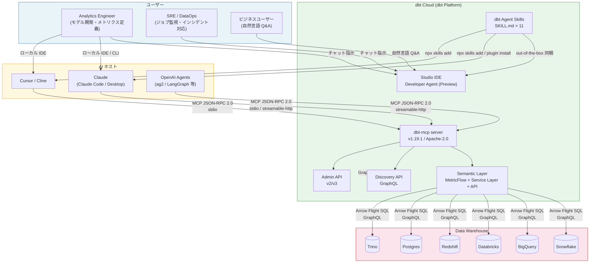
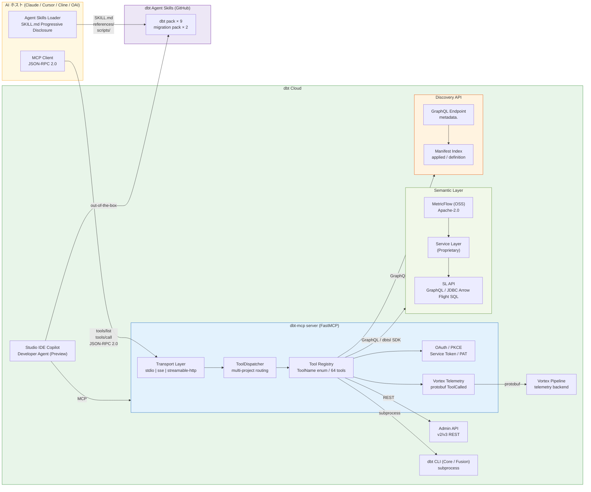
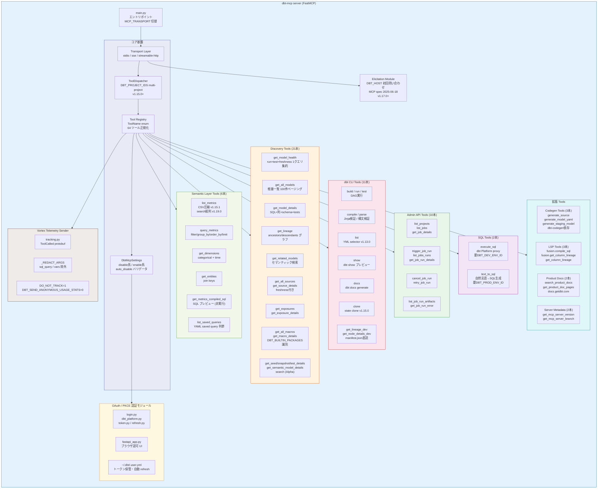
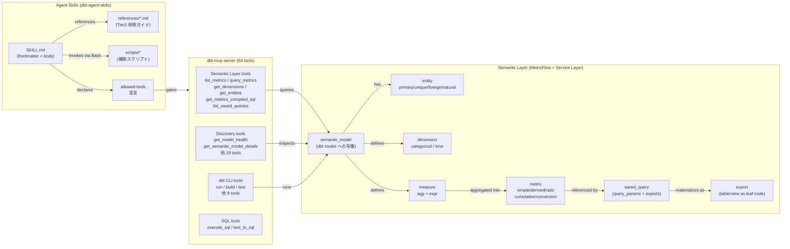
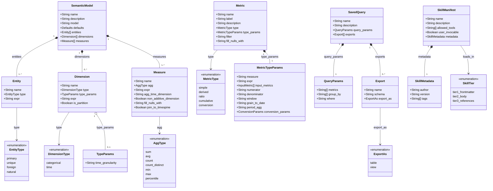

> 検証日: 2026-05-20
> 対象: dbt-mcp v1.19.1 / dbt Agent Skills (2026-02-05 公開) / dbt Semantic Layer (2023 GA)
> 対象読者: データエンジニア / AI エージェント実装者 / LLMOps 担当

# dbt 3 層スタック (Semantic Layer × MCP × Agent Skills) 構造とデータ調査

## ■ 概要

### 3 層スタックの意義

dbt Labs は 2023〜2026 年にかけて、AI エージェントにデータベース業務文脈を渡す層を 3 段構えで整備しました。

| 層 | コンポーネント | リリース | ステータス |
|---|---|---|---|
| Layer 1 | **Semantic Layer** (MetricFlow ベース) | 2023-10 GA (Coalesce 2023 発表、二次情報)、2024-03 から 2 層キャッシュ追加 | GA (dbt Cloud Starter $100/seat〜) |
| Layer 2 | **dbt-mcp server** | 2025-04-21 OSS 化、最新 v1.19.1 = 2026-05-14、★564 | GA (Apache-2.0、PyPI 配布) |
| Layer 3 | **dbt Agent Skills** | 2026-02-05 公開 (Anthropic Agent Skills 標準 2025-10-16 制定後) | GA on GitHub (Apache-2.0)、dbt Cloud Developer Agent は Preview |

3 層は互いを置き換えない補完関係にあります。

- Semantic Layer が **「何を聞けるか」** を定義します (メトリクス・ディメンション・エンティティの YAML 契約)
- dbt-mcp が **「どう呼ぶか」** の経路を提供します (JSON-RPC 2.0、64 ツール)
- Agent Skills が **「いつ・どう使うか」** の手順をエージェントに教えます (SKILL.md プロシージャ)

### なぜ「契約化された業務文脈」が必要か — LLM 直接 SQL の限界

LLM に生テーブルを見せて SQL を書かせる (NL2SQL) アプローチには構造的な問題があります。

1. **定義の揺れ**: 「先月の売上」が税抜・税込・返品控除後のどれかはテーブル定義からは読み取れません。部門ごとに違う SQL が書かれ、数字が一致しません。
2. **JOIN の誤り**: スタースキーマの結合順序や grain をモデルが誤り、二重カウントが発生します。
3. **権限の過剰付与**: LLM にウェアハウスを直接触らせると DDL 権限まで渡しがちになります。
4. **再現性の欠如**: LLM が毎回異なる SQL を生成するため、BI ツールと数値が合いません。

dbt Semantic Layer は MetricFlow を通じてこれらを解決します。エージェントは `metric_time` + `entity__dimension` の記法でメトリクス名とディメンションを指定するだけでよく、JOIN・タイムウィンドウ・粒度計算は MetricFlow が決定論的に生成する SQL で処理されます。dbt 自身が "higher baseline of accuracy than LLM generated SQL queries" と公言しています。

### 一文サマリ

**dbt の Semantic Layer × MCP × Agent Skills は、AI エージェントが「人間レビュー済みのメトリクス定義」を MCP 経由で問い合わせ、Agent Skills の手順書に従って正確・再現可能なデータ回答を生成するための、契約化された業務文脈供給スタックです。**

---

## ■ 特徴

1. **Anthropic Agent Skills オープン標準に完全準拠**
   Anthropic が 2025-10-16 に発表し、2025-12-18 にオープン標準化した Agent Skills 仕様を、dbt Labs は独自フォーマットを作らずそのまま採用しました。30+ エージェント (Claude Code / OpenAI Codex / Cursor / Factory / Kilo Code 等) で同一 skill 資産が動きます。SKILL.md の必須フィールドは `name` と `description` のみです。

2. **dbt-mcp の 64 ツール体系**
   `ToolName` enum で正規化された 64 ツールを 7 toolset に分割しています。Semantic Layer 6 本 (`list_metrics` / `query_metrics` / `get_dimensions` / `get_entities` / `get_metrics_compiled_sql` / `list_saved_queries`)、Discovery 21 本、dbt CLI 11 本、Admin API 10 本、SQL 2 本、Codegen 3 本、LSP/Docs/Metadata 7 本です。ツール数過多によるモデル精度低下を防ぐため `DISABLE_TOOLS` / `DBT_MCP_ENABLE_TOOLS` で細粒度に有効化できます。

3. **Semantic Layer は dbt Cloud 限定、MetricFlow のみ OSS**
   コンポーネントは 4 層構成 (MetricFlow / dbt Semantic Interfaces / Service Layer / Semantic Layer APIs) です。MetricFlow と dbt Semantic Interfaces は Apache-2.0 で OSS ですが、エージェントや BI ツールから GraphQL / JDBC でクエリする Service Layer・API は **Proprietary かつ dbt Cloud 専用** (Starter $100/seat〜) です。Developer (Free) プランでは Semantic Layer を利用できません。

4. **対応ウェアハウスは 6 つに限定**
   Snowflake / BigQuery / Databricks / Redshift / Postgres / Trino の 6 プラットフォームのみです。Microsoft Fabric / Synapse / DuckDB は "not available at this time" と公式が明記しています。Exports は Trino を除く 5 プラットフォームが対象です。

5. **ADE-bench スコア: 56% → 58.5%、特定タスクで 0% → 100%**
   dbt が Anthropic の ADE-bench で計測した結果、スキルなしで 56% だったスコアがスキルあり 58.5% に改善しました。注目点は「複数モデルを一発生成して 0% 成功だったタスク」がスキルの反復ループ指示により 100% 成功に変わったことです。一方 DRY 原則の強制が buggy column の流用を招くトレードオフも確認されています。

6. **認可モデル: コマンド単位の人手承認 + 最小権限サービストークン**
   dbt Cloud Developer Agent では、`dbt compile` / `dbt build` 等の実行ごとに "Yes, run once" / "Yes, allow for session" / "No" の三択承認が求められます (デフォルト: Ask for approval モード)。Semantic Layer 向けサービストークンは "Semantic Layer Only" + "Metadata Only" の 2 権限のみを付与し、DDL を持たせない設計が推奨されます。

7. **観測性: Vortex Telemetry + Studio IDE Commands タブ**
   dbt-mcp は `ToolCalled` protobuf を Vortex テレメトリに送信し、ツール名・引数 (sql_query / vars は redact)・開始/終了タイムスタンプを記録します。`DO_NOT_TRACK=1` でオプトアウト可能です。dbt Cloud Developer Agent の Studio IDE では "Run by Copilot" アイコンと tooltip で人手実行と区別でき、chat 履歴は 90 日保持されます (single-tenant deployment では未対応)。

8. **LLM トークン削減に向けた継続最適化**
   v1.14.0: メトリクス数 ≤10 のとき `list_metrics` 1 回でディメンション・エンティティを同梱し round trip を 3 → 1 に削減。v1.15.1: JSON → CSV フォーマット変換で 67% 圧縮、agent cost 33% 削減。v1.17.0: MCP elicitation で `DBT_HOST` を初回起動時にユーザへ問い合わせ、`.env` ファイルなしでの対話起動を実現しました。

9. **既知ギャップ: 大規模メトリクスとコンパイル遅延**
   80 メトリクスの saved query で SQL コンパイル 4〜5 分、極端な例では 72 分という事例が報告されています。derived / ratio / cumulative / cross-grain メトリクスは YAML で書ききれないケースがあり、公式が "The problem" と呼ぶ pre-compute 回避策 (dbt model 側で事前集計) が必要になることがあります。MCP の tool-level RBAC は 2026-05 時点で仕様レベルで未確立です。

10. **MCP のセキュリティリスク: CVE-2025-6514 と tool poisoning**
    CVE-2025-6514 は 437,000+ 環境に影響した MCP プロトコルレベルの脆弱性です。Simon Willison は MCP の "lethal trifecta" (prompt injection + tool poisoning + 構造的に securely-by-default でない設計) を批判しています。dbt-mcp は前段プロキシや Vortex telemetry 監査による補完が推奨されますが、tool-level RBAC は仕様策定待ちの状態です。

11. **競合の MCP 対応状況**
    Headless Semantic Layer カテゴリでは Cube (2025-07-29)・Looker (2025-08-09)・GoodData (2026-01-21 GA) が MCP サーバを提供済みです。Warehouse-Native カテゴリでは Snowflake Cortex MCP (2025-11-25 rev)・Databricks Genie MCP (2025 beta) が RBAC の自然 passthrough を利点に展開しており、dbt Semantic Layer が Cloud 課金要件と tool-level RBAC の未整備を抱える中で選択肢の比較軸になっています。

12. **Fivetran 買収 (2025-10-13) 後の Cloud lock-in 加速懸念**
    Fivetran による dbt Labs 買収後、dbt Core の EOL シナリオと Cloud 統合加速が HN / Medium で論じられています (二次情報)。公式 EOL 声明は 2026-05 時点で未発表です。採用判断には 2026〜2027 の Fivetran 統合 roadmap を再評価する窓口を持つことが推奨されます。

---

## ■ 構造

### ● システムコンテキスト図



#### アクター

| アクター | 種別 | 主な関心事 |
|---|---|---|
| Analytics Engineer | 内部ユーザー | dbt モデル構築・メトリクス定義・テスト作成 |
| SRE / DataOps | 内部ユーザー | ジョブ失敗診断・freshness 監視・インシデント対応 |
| ビジネスユーザー | 内部ユーザー | 自然言語でのデータ Q&A (NL→Metric クエリ) |

#### 外部システム

| 外部システム | 役割 | 通信プロトコル |
|---|---|---|
| Claude (Code / Desktop) | MCP ホスト / Agent Skills クライアント | MCP JSON-RPC 2.0 over stdio |
| Cursor / Cline | MCP ホスト | MCP JSON-RPC 2.0 over stdio |
| OpenAI Agents / LangGraph 等 | MCP ホスト (Claude 非依存) | MCP JSON-RPC 2.0 over streamable-http |
| Snowflake | Data Warehouse | Arrow Flight SQL / JDBC |
| BigQuery | Data Warehouse | Arrow Flight SQL |
| Databricks | Data Warehouse | Arrow Flight SQL |
| Redshift / Postgres / Trino | Data Warehouse | JDBC / 各ドライバ |

---

### ● コンテナ図



#### コンテナ責務テーブル

| コンテナ | 責務 | 技術スタック | 通信プロトコル |
|---|---|---|---|
| **MetricFlow + Service Layer** | YAML 定義からメトリクス SQL をコンパイル・実行。2 層キャッシュ。MetricFlow は OSS (Apache-2.0)、Service Layer / Gateway は Proprietary | Python (MetricFlow)、dbt Cloud proprietary | 内部 gRPC / Arrow Flight SQL |
| **Semantic Layer API** | AI ホストおよび BI ツールへのメトリクス公開。GraphQL リージョン別エンドポイントと JDBC (Arrow Flight SQL) の 2 経路を提供 | GraphQL (Strawberry)、Apache Arrow Flight SQL | GraphQL over HTTPS / Arrow Flight SQL over JDBC |
| **dbt-mcp server** | 64 ツールを MCP プロトコルで公開。FastMCP フレームワーク上に ToolDispatcher・認証・テレメトリを実装。stdio / sse / streamable-http の 3 トランスポート対応 | Python 3.x、FastMCP、uv、protobuf | MCP JSON-RPC 2.0 (stdio デフォルト、streamable-http リモート) |
| **Discovery API** | dbt プロジェクトのメタデータ (モデル / ソース / リネージ / ヘルス) を GraphQL で提供。`applied` (本番 manifest) / `definition` の 2 状態を管理 | GraphQL、PostgreSQL (manifest index) | GraphQL over HTTPS |
| **dbt CLI (Core / Fusion)** | dbt run / build / test / compile / show / clone 等のローカル実行。Fusion は `dbt lsp` で LSP 連携 | Python (dbt-core)、Rust (Fusion エンジン) | subprocess stdin/stdout |
| **Studio IDE Copilot (Developer Agent)** | dbt Cloud Studio IDE 上の AI アシスタント。dbt Agent Skills を out-of-the-box で同梱。Commands タブで "Run by Copilot" ログ記録。90 日チャット保持 | dbt Cloud 独自 UI、LLM backend | HTTPS / WebSocket |
| **Vortex Telemetry** | dbt-mcp の ToolCalled イベントを収集。sql_query / vars は redact。DO_NOT_TRACK=1 でオプトアウト | protobuf、dbt Labs 内部 Vortex pipeline | protobuf over HTTPS |

---

### ● コンポーネント図



#### コンポーネント責務テーブル

| コンポーネント | ツール数 | 責務 | バージョン履歴 |
|---|---|---|---|
| **ToolDispatcher** | — | `DBT_PROJECT_IDS` によるマルチプロジェクトルーティング。各ツール呼び出しに `project_id` パラメータを追加 | v1.15.0 で導入、v1.17.0 で Admin API もマルチプロジェクト対応 |
| **Semantic Layer Tools** | 6 | MetricFlow 定義に従いメトリクスを列挙・クエリ・SQL 確認。LLM トークン削減のため CSV 化・フル設定同梱閾値・search 配列化を順次実施 | v1.14.0 (round trip 3→1)、v1.15.1 (JSON→CSV 67%削減)、v1.19.0 (search 配列対応) |
| **Discovery Tools** | 21 | Discovery API (GraphQL) 経由でモデル・ソース・リネージ・マクロ・エクスポージャの全メタデータを提供。`get_model_health` は run+test+freshness を 1 クエリに集約 | v1.16.0 (`get_job_run_error` 改善)、v1.13.0 (list ツール YML selector 追加) |
| **dbt CLI Tools** | 11 | ローカル dbt バイナリを subprocess で呼び出し。build/run/test/compile/show/clone/list 等。成功時 stderr ノイズを除去 | v1.13.0 (list 追加)、v1.15.0 (clone 追加)、v1.19.0 (stderr ノイズ修正) |
| **Admin API Tools** | 10 | dbt Platform Administrative API v2/v3 でジョブ起動・取得・停止・再試行。エージェントの「ジョブ失敗診断→再実行」フローを単独で完結 | v1.16.0 (get_job_run_error NotFoundError 対応)、v1.17.0 (マルチプロジェクト対応) |
| **SQL Tools** | 2 | dbt Platform proxy 経由で SQL 実行 (`execute_sql`) と自然言語→SQL 生成 (`text_to_sql`)。既定 disabled | v1.x 初期から存在。streamable-http を内部利用 |
| **Codegen Tools** | 3 | dbt-codegen パッケージ経由で source YAML / モデル YAML / staging SQL を自動生成。既定 disabled | v1.x 初期から存在 |
| **LSP Tools** | 3 | dbt-lsp / Fusion `dbt lsp` 経由で SQL コンパイルと列レベルリネージを提供 | v1.16.0 で Fusion 優先フォールバック順を確立 |
| **Product Docs Tools** | 2 | docs.getdbt.com 検索・取得。v1.13.0 でページ上限 10→5 に削減し IDE 凍結対策 | v1.13.0 |
| **Server Metadata Tools** | 2 | MCP サーバ自身のバージョン・ブランチ情報を返す。既定 disabled | — |
| **OAuth / PKCE 認証モジュール** | — | ブラウザベース PKCE 認可フロー。`~/.dbt/.user.yml` にトークンを保管し自動 refresh。Service Token / PAT との併用可 | v1.13.0 (OAuth project search 追加)、v1.15.0 (マルチプロジェクト移行バグ修正)、v1.18.0 (SSL エラー時 multi-cell ヒント) |
| **Elicitation Module** | — | MCP spec 2025-06-18 の elicitation プリミティブを使い、DBT_HOST 未設定時に初回 Platform ツール呼び出しでユーザへ問い合わせる | v1.17.0 で導入 |
| **Vortex Telemetry Sender** | — | ToolCalled protobuf を dbt Labs Vortex パイプラインへ送信。sql_query / vars は redact。DO_NOT_TRACK=1 でオプトアウト可 | v1.14.0 (account ID 追加)、v1.17.0 (user ID 追加) |

---

## ■ データ

### ● 概念モデル

下図は dbt 3 層スタック (Semantic Layer / MCP / Agent Skills) を構成するエンティティと、その関係を示します。
左から右へ「エージェントが何をどう呼ぶか」の流れに沿って読むと理解しやすいです。



#### エンティティの責務テーブル

| エンティティ | 所在レイヤ | 主な責務 |
|---|---|---|
| `SKILL.md` | Agent Skills | エージェントへの手順・ベストプラクティスを Tier1/2/3 で段階提供 |
| `references/*.md` | Agent Skills | Tier3 参照ガイド。SKILL.md 本文から遅延ロードされる詳細手順 |
| `scripts/*` | Agent Skills | SKILL.md の指示でエージェントが Bash 経由で実行する補助スクリプト |
| `allowed-tools` 宣言 | Agent Skills | スキル実行中に許可するツールのホワイトリスト |
| MCP tool (64 本) | dbt-mcp | JSON-RPC 2.0 経由でエージェントホストへツール能力を露出する |
| `semantic_model` | Semantic Layer | dbt model への写像。entity/dimension/measure を束ねるルートノード |
| `entity` | Semantic Layer | 結合キー。4 種 (primary/unique/foreign/natural) |
| `dimension` | Semantic Layer | メトリクスのスライス軸。categorical または time |
| `measure` | Semantic Layer | 集計の基本単位。agg + expr で定義 |
| `metric` | Semantic Layer | ビジネス指標の契約。5 種 (simple/derived/ratio/cumulative/conversion) |
| `saved_query` | Semantic Layer | 再利用可能なクエリパラメータのセット |
| `export` | Semantic Layer | saved_query をテーブル/ビューとして DWH に書き出す leaf node |

---

### ● 情報モデル

下図は各エンティティの詳細属性を UML class diagram で示します。
可視性記号: `+` = public、`-` = private、`#` = protected。



#### 各クラスの主要属性とその意味

| クラス | 属性 | 型 | 意味 |
|---|---|---|---|
| `SemanticModel` | `name` | String | semantic_model の識別子。MetricFlow が join 解決に使います |
| `SemanticModel` | `model` | String | `ref('dbt_model_name')` 形式で対応 dbt model を指定します |
| `SemanticModel` | `defaults.agg_time_dimension` | String | metric_time などデフォルト時間次元 |
| `Entity` | `type` | EntityType | primary/unique/foreign/natural の 4 種で join 意味論を決めます |
| `Entity` | `expr` | String | 実カラム名と異なる場合の SQL 式またはカラム名 |
| `Dimension` | `type` | DimensionType | categorical = グルーピング軸、time = 時系列軸 |
| `Dimension` | `type_params.time_granularity` | String | day/week/month/quarter/year 等の最小粒度 |
| `Measure` | `agg` | AggType | sum/avg/count/count_distinct/min/max/percentile |
| `Measure` | `agg_time_dimension` | String | 集計に使う時間次元。`metric_time` が予約語 |
| `Measure` | `non_additive_dimension` | Boolean | 残高系など単純加算してはいけない次元を示します |
| `Measure` | `join_to_timespine` | Boolean | タイムスパインに join して null 日付を補完します |
| `Metric` | `type` | MetricType | simple/derived/ratio/cumulative/conversion の 5 種 |
| `Metric` | `filter` | String | Jinja DSL (`{{ Dimension('entity__dim') }}`) でフィルタ条件 |
| `Metric` | `fill_nulls_with` | String | null を埋める値 (0 など) |
| `MetricTypeParams` | `measure` | String | simple metric が参照する measure 名 |
| `MetricTypeParams` | `expr` | String | derived metric の計算式 (例: `revenue - cost`) |
| `MetricTypeParams` | `numerator` / `denominator` | String | ratio metric の分子・分母メトリクス名 |
| `MetricTypeParams` | `window` | String | cumulative/conversion の集計ウィンドウ (例: `7 days`) |
| `MetricTypeParams` | `grain_to_date` | String | cumulative の month-to-date 等の粒度 |
| `SavedQuery` | `query_params.metrics` | String[] | 問い合わせるメトリクス名のリスト |
| `SavedQuery` | `query_params.where` | String | Jinja DSL フィルタ |
| `Export` | `export_as` | ExportAs | table または view で DWH に書き出します |
| `SkillManifest` | `name` | String | skill ID。ディレクトリ名と一致させる規約 |
| `SkillManifest` | `description` | String | Tier1 で system prompt に常駐。`Use when ...` 形式が慣例 |
| `SkillManifest` | `allowed_tools` | String[] | skill 実行中に許可するツールのホワイトリスト |
| `SkillManifest` | `user_invocable` | Boolean | false = エージェント自動 discovery のみ、true = ユーザが直接呼び出し可 |

---

#### YAML 例

以下に `semantic_model` 1 個、`metric` 3 型 (simple / derived / ratio)、`SKILL.md` frontmatter の実例をまとめます。

```yaml
# ── semantic_model (orders テーブルを写像) ──────────────────────────
semantic_models:
  - name: orders
    description: >
      注文トランザクション 1 行 1 注文。revenue / gross_profit の集計基盤。
    model: ref('fct_orders')
    defaults:
      agg_time_dimension: order_date

    entities:
      - name: order           # primary entity: 1 注文 = 1 行
        type: primary
        expr: order_id
      - name: customer        # foreign entity: 顧客への結合キー
        type: foreign
        expr: customer_id
      - name: product         # foreign entity: 商品への結合キー
        type: foreign
        expr: product_id

    dimensions:
      - name: order_date      # time dimension: デフォルト集計軸
        type: time
        type_params:
          time_granularity: day
      - name: order_status    # categorical dimension: フィルタ用
        type: categorical
      - name: is_new_customer # categorical dimension: boolean フラグ
        type: categorical
        expr: CASE WHEN order_rank = 1 THEN TRUE ELSE FALSE END

    measures:
      - name: revenue                 # 売上金額
        agg: sum
        expr: order_total_amount
        agg_time_dimension: order_date
      - name: order_cost              # 原価
        agg: sum
        expr: order_cost_amount
        agg_time_dimension: order_date
      - name: order_count             # 注文件数
        agg: count_distinct
        expr: order_id
        agg_time_dimension: order_date

# ── metrics: simple ─────────────────────────────────────────────────
metrics:
  - name: revenue
    label: 売上金額
    description: 全注文の合計売上金額
    type: simple
    type_params:
      measure: revenue
    fill_nulls_with: 0

# ── metrics: derived (gross_profit = revenue - cost) ─────────────────
  - name: gross_profit
    label: 粗利
    description: 売上から原価を引いた粗利
    type: derived
    type_params:
      expr: "{{ metric('revenue') }} - {{ metric('order_cost') }}"
      input_metrics:
        - name: revenue
        - name: order_cost

# ── metrics: ratio (gross_margin = gross_profit / revenue) ───────────
  - name: gross_margin
    label: 粗利率
    description: 粗利を売上で割った比率
    type: ratio
    type_params:
      numerator: gross_profit
      denominator: revenue
    filter: "{{ Dimension('order__order_status') }} != 'cancelled'"

# ── saved_query + export ─────────────────────────────────────────────
saved_queries:
  - name: monthly_revenue_by_status
    description: ステータス別月次売上サマリ (BI / エージェント向けキャッシュ)
    query_params:
      metrics:
        - revenue
        - gross_profit
        - gross_margin
      group_by:
        - "Dimension('metric_time').grain('month')"
        - "Dimension('order__order_status')"
      where: "{{ Dimension('metric_time').grain('month') }} >= '2024-01-01'"
    exports:
      - name: monthly_revenue_by_status_tbl
        schema: analytics_exports
        export_as: table
```

```yaml
# ── metrics: cumulative (rolling 7-day revenue) ──────────────────────
  - name: revenue_7d_cumulative
    label: 直近 7 日間売上 (累積)
    description: 7 日間のローリングウィンドウで累積した売上
    type: cumulative
    type_params:
      measure: revenue
      window: 7 days       # 省略すると全期間累積
    fill_nulls_with: 0

# ── metrics: conversion (signup → first_order within 30 days) ────────
  - name: signup_to_first_order_rate
    label: 新規登録→初回注文転換率 (30 日)
    description: 新規登録から 30 日以内に初回注文した割合
    type: conversion
    type_params:
      entity: customer
      calculation: conversion_rate
      base_metric: new_signups      # base イベント (別 semantic_model で定義)
      conversion_metric: revenue    # conversion イベント
      window: 30 days
```

#### クエリ API 対応表

Semantic Layer を問い合わせる 3 つの API の主要パラメータと特徴を整理します。

| 観点 | GraphQL API | JDBC (Arrow Flight SQL) | Python SDK |
|---|---|---|---|
| プロトコル | HTTP + GraphQL mutation/query | Arrow Flight SQL (port 443) | Python `dbt-sl-sdk` |
| クエリ開始 | `createQuery` mutation → `queryId` をポーリング | `semantic_layer.query(...)` SQL 呼び出し | SDK メソッド呼び出し |
| 結果形式 | Arrow (デフォルト) / `jsonResult` (PandasJsonOrient) | DataFrame 互換 Arrow | pandas DataFrame |
| ページング | `pageNum` で増分取得 (デフォルト 1024 行/page) | `limit` パラメータ | SDK 依存 |
| SQL 取得 | `query.sql` フィールド | `compile=True` パラメータ | SDK 依存 |
| 認証 | `Authorization: Bearer <token>` ヘッダ | `token=` URL パラメータ | SDK config |
| 向き不向き | BI ツール統合・エージェント (MCP 経由) | SQL ツール・JDBC 接続ツール | Python ワークフロー |
| saved_query | `createQuery(savedQuery: "name")` | `compile=True` + `saved_query=` | SDK 依存 |
| where DSL | Jinja `{{ Dimension('e__d') }}` を `sql:` キーで渡す | 同 DSL を文字列リストで渡す | 同 DSL |

```yaml
# ── SKILL.md frontmatter (building-dbt-semantic-layer) ───────────────
---
name: building-dbt-semantic-layer
description: >
  MetricFlow を使って semantic_model / entity / dimension / measure / metric を定義し、
  dbt Cloud で Semantic Layer を構成する。
  Use when: ユーザが「メトリクスを定義したい」「semantic model を作りたい」
  「saved_query を追加したい」と依頼したとき。
allowed-tools: "Bash(dbt *), Bash(jq *), Read, Write, Edit, Glob, Grep"
user-invocable: true
metadata:
  author: dbt-labs
  version: "1.0"
  tags:
    - semantic-layer
    - metricflow
    - metrics
---
# 本文 (Tier2) — 以下から Markdown で手順・ガイドラインを記述
## When to Use This Skill
...
## Core Guidelines
...
## References
- references/semantic-model-guide.md
- references/metric-types.md
```

---

#### MCP Semantic Layer ツールセット詳細

dbt-mcp が露出する Semantic Layer カテゴリ 6 ツールの入出力を整理します。

| ツール名 | 主な入力パラメータ | 返す情報 | 典型的な呼び出しタイミング |
|---|---|---|---|
| `list_metrics` | (なし) | メトリクス名・ラベル・型の一覧。≤10 件なら dimension/entity も inline | エージェントが「どんな指標があるか」を把握する最初のステップ |
| `get_dimensions` | `metrics: [name]` | 指定メトリクスで使える dimension 名・型 | 「どの軸で集計できるか」を確認するステップ |
| `get_entities` | `metrics: [name]` | 指定メトリクスで使える entity 名・型 | フィルタ DSL で `Entity('...')` を書く前の確認 |
| `query_metrics` | `metrics`, `group_by`, `where`, `limit`, `order_by` | クエリ結果 (CSV 形式、v1.15.1 以降 67% 圧縮) | 実際のメトリクス値を取得するメインツール |
| `get_metrics_compiled_sql` | `metrics`, `group_by`, `where` | 実行前の MetricFlow コンパイル済み SQL | 監査ログ生成・デバッグ・SQL 確認 |
| `list_saved_queries` | (なし) | 定義済み saved_query の名前と説明一覧 | 定型クエリが存在するかを確認するステップ |

#### Dimension フィルタ DSL 早見表

`where` 句で使う Jinja DSL の形式を記号別にまとめます。

| DSL 形式 | 意味 | 使用例 |
|---|---|---|
| `{{ Dimension('entity__dim') }}` | entity 経由の categorical dimension 参照 | `{{ Dimension('order__order_status') }} = 'completed'` |
| `{{ TimeDimension('dim', 'grain') }}` | time dimension を粒度指定で参照 | `{{ TimeDimension('metric_time', 'month') }} >= '2024-01-01'` |
| `{{ Entity('entity_name') }}` | entity のキー値でフィルタ | `{{ Entity('order') }} IN (101, 202)` |
| `{{ Metric('metric_name', group_by=[...]) }}` | 別メトリクスを filter 条件に使う | `{{ Metric('revenue', group_by=['customer']) }} > 0` |

`__`（double underscore）は「entity → dimension」の修飾子であり、`user__country` は `user` エンティティを経由して `country` ディメンションを参照することを意味します。エージェントプロンプトでこの記法を知らないと誤った filter 式を生成する最大のリスクになります。

---

## ■ 構築方法

### ● 前提条件

3 層スタック全体を動かすために必要な前提を整理します。

- **dbt Cloud 課金プラン**: Starter ($100/seat/月) 以上。Free/Developer ティアには Semantic Layer API が含まれません。Exports と細粒度 RBAC には Enterprise 以上が必要です。
- **対応 warehouse**: Snowflake / BigQuery / Databricks / Redshift / Postgres / Trino の 6 つ。Microsoft Fabric / Synapse / DuckDB は 2026-05 時点で未対応。Exports (saved query のテーブル書き出し) は Trino を除く 5 つが対象です。
- **dbt Core 1.6 以上**: MetricFlow が dbt 本体に統合されているバージョン。`dbt sl` サブコマンドと `semantic_model` / `metric` YAML キーが使えることを確認してください。Exports 機能を使う場合は 1.7 以上が必要です。
- **Python 3.9 以上 + uv**: dbt-mcp server のインストールに使います。`pip` でも動きますが、公式 manifest が `uv` を宣言しているためこのガイドでも `uv` を基準とします。
- **MCP 対応クライアント**: Claude Desktop / Cursor / Cline / Claude Code / OpenAI Agents SDK など。このガイドでは Claude Desktop と Claude Code を例示します。

---

### ● Step 1: dbt プロジェクトに Semantic Layer を追加

#### semantic_model の最小 YAML 例

`orders` テーブルに対する semantic_model を定義します。ファイルは `models/marts/orders.yml` など既存の YAML に追記するか、`models/semantic/` 以下に独立ファイルとして置きます。

```yaml
# models/marts/orders.yml

semantic_models:
  - name: orders
    description: "受注トランザクション。1行=1注文"
    model: ref('fct_orders')          # dbt モデルへの参照

    entities:
      - name: order_id
        type: primary                 # 全行一意・非 null
        expr: order_id
      - name: customer_id
        type: foreign                 # 顧客への外部キー
        expr: customer_id

    dimensions:
      - name: order_date
        type: time
        type_params:
          time_granularity: day
      - name: customer_tier
        type: categorical
        expr: customer_tier
      - name: status
        type: categorical
        expr: status

    measures:
      - name: revenue
        agg: sum
        expr: net_revenue
        description: "税抜売上"
      - name: order_count
        agg: count_distinct
        expr: order_id
```

`dbt parse` で semantic_model を構文検証します。

```bash
dbt parse
# ERROR が出なければ MetricFlow が YAML を読み込めています
```

#### metric 5 型の YAML 例

同じ YAML ファイルに `metrics:` セクションを追加します。5 型すべての記法を示します。

```yaml
metrics:
  # ■ simple: 単一 measure をそのまま集計
  - name: revenue
    type: simple
    label: "月次売上 (税抜)"
    type_params:
      measure: revenue
    filter: |
      {{ Dimension('orders__status') }} != 'cancelled'

  # ■ derived: 複数 metric の四則演算
  - name: average_order_value
    type: derived
    label: "平均注文金額"
    type_params:
      expr: revenue / order_count
      metrics:
        - name: revenue
        - name: order_count

  # ■ ratio: 分子/分母を別 metric で指定
  - name: cancellation_rate
    type: ratio
    label: "キャンセル率"
    type_params:
      numerator:
        name: cancelled_orders
      denominator:
        name: order_count

  # ■ cumulative: 累積集計 (rolling / grain_to_date)
  - name: cumulative_revenue
    type: cumulative
    label: "累積売上"
    type_params:
      measure: revenue
      # window を省略すると全期間累積
      # window: 30 days  → 直近 30 日ローリング
      grain_to_date: month          # 月初からの累積

  # ■ conversion: base イベント → conversion イベントの追跡
  - name: checkout_conversion
    type: conversion
    label: "カート→購入コンバージョン率"
    type_params:
      base_measure:
        name: cart_adds             # 別 semantic_model の measure
      conversion_measure:
        name: order_count
      entity: customer_id
      window: 7 days                # 7日以内に購入なら conversion
      calculation: conversion_rate
```

#### metric_time 予約語の使い方

`metric_time` は MetricFlow が内部的に使う **予約済み時間ディメンション**で、エージェントが「月別」「週別」といった時間粒度を指定するときに必ず使います。

```yaml
# group_by の書き方 (GraphQL 例)
groupBy: [{name: "metric_time", grain: MONTH}]

# JDBC の書き方
group_by=[Dimension('metric_time').grain('month')]
```

`metric_time` を time dimension として持つ semantic_model は `agg_time_dimension` を `metric_time` に向けるか、time dimension の `type: time` を宣言するだけで構いません。エージェントプロンプトには「時間軸は必ず `metric_time` で指定する」と明記しておくと hallucination が減ります。

#### dbt parse で検証

```bash
# プロジェクトルートで実行
dbt parse

# Semantic Layer 専用の検証 (MetricFlow CLI)
dbt sl validate

# ローカルでメトリクス一覧を確認
dbt sl list metrics

# ローカルでクエリをテスト (dbt Cloud 不要、ローカル warehouse に直接)
dbt sl query \
  --metrics revenue \
  --group-by metric_time__month \
  --start-time 2026-01-01 \
  --end-time 2026-03-31
```

---

### ● Step 2: dbt Cloud で Semantic Layer を有効化

#### 接続情報の取得

dbt Cloud の UI から以下を取得します。

| 項目 | 場所 | 例 |
|---|---|---|
| `DBT_HOST` | Account Settings → Account Info → Access URL | `abc123.us1.dbt.com` |
| `DBT_CLOUD_ACCOUNT_ID` | URL の数値 (`/accounts/<ID>/`) | `12345` |
| `DBT_PROD_ENV_ID` | Deploy → Environments → 対象環境のURL | `67890` |

#### Service Token の発行

**"Semantic Layer Only" + "Metadata Only"** の 2 権限を付与したサービストークンを発行します。BI ツール・MCP からのアクセスはこのトークンで行い、DDL 権限を含む PAT や Admin Token とは分離します。

```
Account Settings → API Tokens → Service Tokens → New Token
  Name: dbt-mcp-sl-readonly
  Permissions:
    ✓ Semantic Layer Only
    ✓ Metadata Only
  (Admin API ツールも使う場合は Job Admin を追加)
```

発行されたトークンを環境変数またはシークレットマネージャに保管します。

```bash
export DBT_HOST="abc123.us1.dbt.com"
export DBT_TOKEN="dbt_sl_xxxxxxxxxxxxxxxxxxxxxxxx"
export DBT_PROD_ENV_ID="67890"
```

#### 環境の有効化確認

Semantic Layer は **最低 1 回 dbt job が成功している** deployment 環境にバインドされます。

```
dbt Cloud → Deploy → Environments → <環境名>
  → Semantic Layer タブ → "Enabled" になっていることを確認
```

---

### ● Step 3: dbt-mcp server をインストール

#### インストール

```bash
# uv (推奨。公式 manifest が uv を指定)
uv tool install dbt-mcp

# pip
pip install dbt-mcp

# pipx
pipx install dbt-mcp

# 動作確認
uvx dbt-mcp --version
# dbt-mcp v1.19.1
```

#### 環境変数一覧

`.env` ファイルに書いておくと `--env-file` で読み込めます。

```bash
# .env (dbt Platform 接続 — 必須)
DBT_HOST=abc123.us1.dbt.com          # cloud.getdbt.com でも可
DBT_TOKEN=dbt_sl_xxxxxxxxxxxxxxxxxxxx
DBT_PROD_ENV_ID=67890

# .env (dbt CLI — ローカル実行時)
DBT_PROJECT_DIR=/path/to/dbt_project
DBT_PATH=dbt                          # dbt 実行ファイルのパス (PATH解決可)
DBT_PROFILES_DIR=~/.dbt
DBT_CLI_TIMEOUT=120                   # 秒。大きいジョブは延ばす

# .env (マルチプロジェクト — DBT_PROD_ENV_ID と排他)
# DBT_PROJECT_IDS=11111,22222,33333

# .env (execute_sql を使う場合のみ)
DBT_DEV_ENV_ID=11111
DBT_USER_ID=9999
DBT_ACCOUNT_ID=12345                  # Admin API も使う場合

# .env (ツールセット制御)
DISABLE_SQL=false                     # SQL toolset は既定 OFF なので明示的に有効化
DISABLE_DBT_CODEGEN=true              # Codegen は不要なら無効化
DISABLE_ADMIN_API=true                # 読み取り専用運用の場合

# .env (Semantic Layer チューニング)
DBT_MCP_SL_METRICS_RELATED_MAX=10    # メトリクス <= 10 で dim/entity を同梱
DBT_MCP_SL_MAX_RESPONSE_CHARS=16000  # list_metrics の最大文字数

# .env (ロギング)
DBT_MCP_LOG_LEVEL=INFO
DBT_MCP_SERVER_FILE_LOGGING=true     # ファイルにログを残す場合

# .env (テレメトリ)
DO_NOT_TRACK=1                        # 匿名統計をオプトアウトする場合
```

#### Local (stdio) vs Remote (streamable-http) の選択

| 用途 | トランスポート | コマンド |
|---|---|---|
| Claude Desktop / Cursor / Cline / Claude Code | `stdio` (既定) | `uvx dbt-mcp` |
| dbt Platform ホスト型 MCP (SaaS) | `streamable-http` | dbt Cloud 側で設定 |
| ローカルデバッグ (HTTP で curl 確認) | `streamable-http` | `MCP_TRANSPORT=streamable-http uvx dbt-mcp` |

#### Claude Desktop での接続設定

`~/Library/Application Support/Claude/claude_desktop_config.json` を編集します。

```json
{
  "mcpServers": {
    "dbt": {
      "command": "uvx",
      "args": [
        "dbt-mcp",
        "--env-file",
        "/Users/you/.dbt/dbt-mcp.env"
      ]
    }
  }
}
```

#### Cursor での接続設定

`~/.cursor/mcp.json` または `.cursor/mcp.json` (ワークスペース単位) を編集します。

```json
{
  "mcpServers": {
    "dbt": {
      "command": "uvx",
      "args": ["dbt-mcp"],
      "env": {
        "DBT_HOST": "abc123.us1.dbt.com",
        "DBT_TOKEN": "${env:DBT_TOKEN}",
        "DBT_PROD_ENV_ID": "67890"
      }
    }
  }
}
```

#### Cline (VS Code 拡張) での接続設定

`cline_mcp_settings.json` を編集します。

```json
{
  "mcpServers": {
    "dbt": {
      "command": "uv",
      "args": [
        "--directory", "/path/to/dbt-mcp",
        "run", "dbt-mcp",
        "--env-file", "/path/to/dbt-mcp/.env"
      ],
      "disabled": false
    }
  }
}
```

#### OpenAI Agents SDK での接続

`examples/openai_agent/` のパターンを基にした最小実装です。

```python
import asyncio
from openai import AsyncOpenAI
from mcp import ClientSession, StdioServerParameters
from mcp.client.stdio import stdio_client

server_params = StdioServerParameters(
    command="uvx",
    args=["dbt-mcp"],
    env={
        "DBT_HOST": "abc123.us1.dbt.com",
        "DBT_TOKEN": "dbt_sl_xxxx",
        "DBT_PROD_ENV_ID": "67890",
    },
)

async def main():
    async with stdio_client(server_params) as (read, write):
        async with ClientSession(read, write) as session:
            await session.initialize()
            tools = await session.list_tools()
            print([t.name for t in tools.tools])
            # ['list_metrics', 'query_metrics', 'get_dimensions', ...]

asyncio.run(main())
```

---

### ● Step 4: Agent Skills を導入

#### dbt-labs/dbt-agent-skills を clone

```bash
# Claude Code の場合: marketplace plugin として追加 (推奨)
# Claude Code REPL 内で実行
/plugin marketplace add dbt-labs/dbt-agent-skills
/plugin install dbt@dbt-agent-marketplace

# その他 30+ エージェント (Cursor / Codex / Copilot / Factory / Kilo Code)
npx skills add dbt-labs/dbt-agent-skills --global

# 手動インストール (任意エージェント)
git clone https://github.com/dbt-labs/dbt-agent-skills.git \
  ~/.claude/skills/dbt-agent-skills
```

インストール後は **新セッションを開始**してください。mid-session での追加は反映されません。

#### 同梱 11 skills の概要

リポジトリは `skills/dbt/skills/` (常用 9 本) と `skills/dbt-migration/skills/` (移行用 2 本) に分かれます。

**dbt パック (常用 9 本)**

| skill 名 | 用途 | user-invocable |
|---|---|---|
| `using-dbt-for-analytics-engineering` | モデル構築・修正・`dbt show` 検証の中核 skill | false (自動 discovery) |
| `adding-dbt-unit-test` | dbt unit test の作成 | false |
| `building-dbt-semantic-layer` | semantic_model / metric / dimension の定義 | false |
| `answering-natural-language-questions-with-dbt` | Semantic Layer への自然言語クエリ | false |
| `working-with-dbt-mesh` | contracts / cross-project ref / ガバナンス | false |
| `troubleshooting-dbt-job-errors` | job 失敗の診断 | false |
| `configuring-dbt-mcp-server` | dbt-mcp server のセットアップ | true |
| `fetching-dbt-docs` | docs.getdbt.com の取得 | false |
| `running-dbt-commands` | dbt CLI の適切なフラグ・パラメータ指定 | false |

**dbt-migration パック (移行用 2 本)**

| skill 名 | 用途 |
|---|---|
| `migrating-dbt-core-to-fusion` | dbt Core → Fusion engine 移行 |
| `migrating-dbt-project-across-platforms` | data platform 間移行 |

#### configuring-dbt-mcp-server skill で MCP 設定を自動化

この skill は `user-invocable: true` なので Claude Code から直接呼び出せます。

```
# Claude Code で実行
/configuring-dbt-mcp-server

# → skill が以下を自動で行います:
#   1. DBT_HOST / DBT_TOKEN / DBT_PROD_ENV_ID の入力を促す
#   2. claude_desktop_config.json / mcp.json への記述を生成して書き込む
#   3. uvx dbt-mcp で起動確認
#   4. list_metrics を呼んでメトリクス一覧が返ることを確認
```

#### dbt Cloud Developer Agent (Preview) は別ルート

dbt Cloud の Studio IDE から使う **Developer Agent** は skills を **out-of-the-box** で同梱しており、上記の手動インストールは不要です。ただし 2026-05 時点で Preview 段階であり、single-tenant deployment では chat 履歴非対応、plan mode 未対応などの制約があります。

```
dbt Cloud → Studio IDE → AI アシスタントアイコン
  → Developer Agent が自動で dbt-agent-skills を読み込んで起動
```

---

## ■ 利用方法

### ● ケース1: メトリクスを聞く (Semantic Layer 経由)

#### ユーザー発話例 (Claude Desktop)

```
先月の revenue を customer_tier 別に教えて
```

#### 内部動作フロー

エージェントは以下の順序でツールを呼びます。`answering-natural-language-questions-with-dbt` skill がこの手順をガイドします。

```
1. list_metrics
   → revenue メトリクスが存在することを確認

2. get_dimensions (metrics=["revenue"])
   → customer_tier が categorical dimension として返ることを確認
   → metric_time が time dimension として返ることを確認

3. query_metrics
   → metrics=["revenue"]
      group_by=["customer_tier", "metric_time__month"]
      where="metric_time__month = '2026-04'"
```

メトリクス数が 10 以下の場合、v1.14.0 以降では `list_metrics` 1 回で dimensions / entities も同梱されるため round trip が 3 → 1 に削減されます。

#### query_metrics 呼び出し詳細

```python
# dbt-mcp tools/call 相当 (Python クライアント例)
result = await session.call_tool(
    name="query_metrics",
    arguments={
        "metrics": ["revenue"],
        "group_by": [
            "customer_tier",
            "metric_time__month"
        ],
        "where": "{{ Dimension('orders__customer_tier') }} IS NOT NULL",
        "order_by": ["-metric_time__month"],   # 降順
        "limit": 100,
    }
)
```

#### 対応する GraphQL クエリ (Semantic Layer API 直接呼び出し)

内部的には dbt-mcp が以下の GraphQL を Semantic Layer に発行します。

```graphql
mutation CreateQuery {
  createQuery(
    environmentId: 67890
    metrics: [{name: "revenue"}]
    groupBy: [
      {name: "customer_tier"}
      {name: "metric_time", grain: MONTH}
    ]
    where: [
      {sql: "{{ Dimension('orders__customer_tier') }} IS NOT NULL"},
      {sql: "{{ Dimension('metric_time').grain('month') }} = '2026-04-01'"}
    ]
    orderBy: [{metric: {name: "metric_time"}, descending: true}]
  ) {
    queryId
  }
}
```

```graphql
query PollResult {
  query(environmentId: 67890, queryId: "QueryID_abcdef123456") {
    status
    sql
    error
    totalPages
    jsonResult
  }
}
```

#### 戻り値 (CSV 形式、v1.15.1 以降)

v1.15.1 から `query_metrics` の結果は JSON→CSV に変換されて返ります。エージェントのトークン消費が約 67% 削減されます。

```
customer_tier,metric_time__month,revenue
enterprise,2026-04-01,12345678.00
mid_market,2026-04-01,4567890.00
smb,2026-04-01,1234567.00
```

エージェントはこの CSV をそのまま読んで回答を生成します。

---

### ● ケース2: モデルの健全性を聞く (Discovery API 経由)

#### ユーザー発話例

```
customers モデルの過去 24h の run 状況は?
```

#### 内部動作フロー

`troubleshooting-dbt-job-errors` skill が関連する場合もありますが、基本は `get_model_health` 1 ツールで完結します。

```python
result = await session.call_tool(
    name="get_model_health",
    arguments={
        "model_name": "customers",
        "environment_id": 67890,
    }
)
```

#### get_model_health が返す情報

run / test / freshness を 1 GraphQL で集約して返します。主要フィールドは以下の通りです。

```json
{
  "model": "customers",
  "last_run": {
    "status": "success",
    "generated_at": "2026-05-20T06:30:00Z",
    "execution_time_seconds": 42.3
  },
  "tests": [
    {"name": "not_null_customers_customer_id", "status": "pass"},
    {"name": "unique_customers_customer_id",    "status": "pass"}
  ],
  "ancestors": [
    {
      "name": "stg_customers",
      "type": "model",
      "freshness_status": "pass",
      "max_loaded_at": "2026-05-20T05:45:00Z"
    },
    {
      "name": "raw_customers",
      "type": "source",
      "freshness_status": "warn",
      "max_loaded_at": "2026-05-20T04:00:00Z"
    }
  ]
}
```

エージェントはこの情報から「customers モデルは 6:30 に成功実行、テスト全通過。ただし上流の raw_customers source が 2 時間超更新なし (warn)」と回答できます。

---

### ● ケース3: 修正タスクを依頼 (Agent Skills + CLI tools)

#### ユーザー発話例

```
customers モデルの unit test を追加して
```

#### 内部動作フロー

`adding-dbt-unit-test` skill が自動 discovery されます。skill の `allowed-tools` は `Bash(dbt *), Read, Write, Edit, Glob, Grep` を宣言しており、ファイル操作と dbt CLI の両方が使えます。

```
[skill: adding-dbt-unit-test がロードされる]

Step 1: Read (models/marts/customers.yml) → 既存テスト定義を把握
Step 2: Glob (models/marts/fct_customers.sql) → モデルの SQL ロジックを読む
Step 3: Write (models/tests/unit/test_customers.yml) → unit test YAML を生成
Step 4: Bash (dbt parse) → 構文確認
Step 5: Bash (dbt test --select customers --store-failures) → テスト実行
Step 6: Bash (dbt show --select customers --limit 5) → 結果プレビュー
```

生成される unit test YAML の例です。

```yaml
unit_tests:
  - name: test_customers_tier_assignment
    description: "customer_tier が revenue 帯に従って正しく付与される"
    model: customers
    given:
      - input: ref('stg_orders')
        rows:
          - {customer_id: 1, net_revenue: 150000}
          - {customer_id: 2, net_revenue: 40000}
          - {customer_id: 3, net_revenue: 8000}
    expect:
      rows:
        - {customer_id: 1, customer_tier: 'enterprise'}
        - {customer_id: 2, customer_tier: 'mid_market'}
        - {customer_id: 3, customer_tier: 'smb'}
```

#### 承認プロンプトのフロー

`dbt test` など副作用を伴うコマンドを実行する際、エージェントは承認を求めます。

```
エージェント: 以下のコマンドを実行します:
  dbt test --select customers --store-failures

> Yes, run once           → 今回だけ許可
> Yes, allow dbt test for session → セッション中は以降も許可
> No                      → 拒否、代替案を検討
```

dbt Cloud Developer Agent では Studio IDE の Commands タブに **"Run by Copilot"** アイコンが付き、エージェントが実行したコマンドと人手実行が区別して記録されます。タイムアウトは 5 分で自動停止です。

---

### ● multi-project の使い分け

大規模組織では複数の dbt Cloud プロジェクト (例: `sales_analytics`, `finance_analytics`, `marketing_analytics`) が並立します。

#### DBT_PROJECT_IDS の設定

```bash
# .env
DBT_PROJECT_IDS=11111,22222,33333
# DBT_PROD_ENV_ID と排他。両方設定するとエラーになります。
```

v1.15.0 で実装された **ToolDispatcher** が各ツール呼び出しに `project_id` パラメータを自動付与し、適切なプロジェクトにルーティングします。

#### 全プロジェクト共通 vs project-specific

```
Discovery API (get_model_health, get_lineage, etc.)
  → 全プロジェクトで利用可能
  → DBT_PROJECT_IDS 設定時は各 tool call に project_id を明示

dbt CLI (run / build / test / compile)
  → ローカル実行のため project-specific
  → DBT_PROJECT_DIR でプロジェクトを切り替え

Semantic Layer (query_metrics, list_metrics)
  → 全プロジェクトで利用可能
  → プロジェクトごとにメトリクス名前空間が分離
```

マルチプロジェクト環境でのツール呼び出し例です。

```python
# sales_analytics プロジェクトのモデル健全性を確認
result = await session.call_tool(
    name="get_model_health",
    arguments={
        "model_name": "fct_orders",
        "project_id": 11111,
    }
)

# finance_analytics プロジェクトのメトリクスを列挙
result = await session.call_tool(
    name="list_metrics",
    arguments={
        "project_id": 22222,
    }
)
```

Discovery は全プロジェクト横断のメタデータ検索に使い、CLI ツールは `DBT_PROJECT_DIR` で切り替えた特定プロジェクトに対してのみ発火させる、という運用が推奨パターンです。

---

## ■ 運用

### ● 認可・権限の運用

#### service token のスコープ分離

dbt Cloud のサービストークンには機能単位でスコープを分離する Permission Set が用意されています。ツールセット別の最小権限は以下の通りです。

| ツールセット | 最小 Permission Set |
|---|---|
| Discovery (get_model_health / get_lineage 等) | `Metadata Only` |
| Semantic Layer (list_metrics / query_metrics 等) | `Semantic Layer Only` |
| Admin API (trigger_job_run / cancel_job_run 等) | `Job Admin` |
| SQL proxy (execute_sql / text_to_sql) | `Developer` 相当 (DBT_DEV_ENV_ID + DBT_USER_ID 必須) |

**誤解**: 「Service Token を 1 本にまとめれば設定が楽になる」
**反証 (C10)**: MCP 仕様レベルで tool-level RBAC が未確立です。単一の広スコープ token があると、エージェントが想定外のツールを呼び出した際に歯止めがなくなります。
**推奨**: ツールセットごとにトークンを分割し、エージェントが必要とする最小スコープのみを env ファイルに設定してください。読み取り専用エージェント (`list_metrics` / `get_model_health` のみ使う) には `Metadata Only` + `Semantic Layer Only` の 2 本構成で充分です。

OAuth (PKCE フロー) はデスクトップ・IDE 用途で Service Token を不要にしますが、production agent での長時間実行には Service Token の方が refresh 挙動が安定しています。セキュリティ重視であれば OAuth を優先し、CI/CD パイプラインには Service Token を使う運用が現実的です。

#### コマンド承認フロー (Yes once / Yes for session / No) の運用ポリシー設計

dbt Agent Skills はコマンド実行ごとに人手承認を要求するモードを持っています。承認フローの設定は 2 モードです。

- **Ask for approval** (既定): 各コマンド実行前にユーザへ確認を求めます。`dbt run` / `dbt build` 等の副作用を伴う CLI ツールに必須です。
- **Edit files automatically**: 承認不要でファイルを編集します。読み取り専用スキル (analytics_engineering / semantic_layer の query 系) で限定的に許可します。

承認応答の 3 択です。

| 応答 | 意味 | 推奨用途 |
|---|---|---|
| Yes once | 今回の呼び出しのみ承認 | 本番環境の破壊的操作 |
| Yes for session | セッション中は再確認なし | ローカル開発での繰り返しビルド |
| No | キャンセル | 想定外のコマンドをブロック |

**運用ポリシーの設計指針**:
- Semantic Layer 参照系 (`list_metrics` / `query_metrics` / `get_dimensions`) → `read_only_hint=True` のツールは MCP クライアント側で承認ダイアログを省略できます。`Edit files automatically` モードで十分です。
- dbt CLI 実行系 (`build` / `run` / `test`) → 必ず `Ask for approval` にしてください。本番 `DBT_PROD_ENV_ID` に向いている場合は `Yes for session` も避けます。
- Admin API (`trigger_job_run` / `cancel_job_run`) → `Yes once` を徹底してください。キャンセル操作の誤爆は直接的な業務影響を生みます。

#### multi-tenant 環境の制約

dbt Agent Skills の観測性 (chat 履歴、"Run by Copilot" アイコン) は現時点で **シングルテナント非対応**です。chat 履歴は 90 日保持されますが、マルチテナント分離によるセッション隔離はありません。エンタープライズの規制要件 (HIPAA / GDPR 等) がある場合は dbt Cloud の契約条件を事前確認してください。

---

### ● 観測性

#### Vortex Telemetry の protobuf ToolCalled イベント

`src/dbt_mcp/tracking/tracking.py` が Vortex に送信する `ToolCalled` protobuf イベントの計測項目です。

| フィールド | 内容 | 備考 |
|---|---|---|
| ツール名 | `ToolName` enum 値 | 全ツール共通 |
| 引数 (一部) | 入力パラメータ | `sql_query` / `vars` は **redact** |
| 開始/終了タイムスタンプ | ツール実行時刻 | 遅延分析に使えます |
| エラーメッセージ | 失敗時のみ | デバッグ用 |
| `dbt_cloud_account_identifier` | アカウント識別子 | v1.14.0 で追加 |
| `dbt_cloud_user_id` | ユーザ識別子 | v1.17.0 で追加 |
| `session UUID` | セッション単位の一意 ID | — |
| `dbt-mcp version` | — | — |
| `disabled toolsets` | 有効/無効 toolset 一覧 | — |

#### `sql_query` / `vars` の redact ルール

`_REDACT_ARGS = frozenset({"sql_query", "vars"})` が実装に含まれており、SQL クエリ本文と `--vars` の中身は Vortex には送信されません。業務上の機密クエリが外部に流出するリスクは低いですが、redact されるのはこの 2 フィールドのみである点に注意が必要です。メトリクス名 / ディメンション名 / フィルタ条件はイベントに含まれる可能性があります。

#### `DO_NOT_TRACK=1` でオプトアウト

```bash
export DO_NOT_TRACK=1
# または
export DBT_SEND_ANONYMOUS_USAGE_STATS=0
```

`dbt_project.yml` の `flags.send_anonymous_usage_stats: false` も尊重されます。セキュリティポリシーでテレメトリを禁止する環境では環境変数またはプロジェクトフラグで明示的にオフにしてください。

#### Studio IDE Commands タブで "Run by Copilot" 識別

dbt Cloud Studio の IDE Commands タブには「Run by Copilot」アイコンでエージェント起動の操作を人手起動と区別できます。これが現時点での最も確実なエージェント操作の監査証跡です。ローカルファイルロギングは `DBT_MCP_SERVER_FILE_LOGGING=true` で有効化できます。

#### chat 履歴 90 日保持

Agent Skills の chat 履歴は 90 日間保持されます。コンプライアンス目的で 90 日超のアーカイブが必要な場合は、dbt Cloud Studio の UI 外での別途エクスポート手段を検討する必要があります (2026-05 時点で公式 API は未確認)。

---

### ● コスト管理

#### Starter $100/seat の見積もり (consumption pricing 併用で年額 225% 増の事例)

**誤解**: 「Starter プランで始めれば低コストで利用できる」
**反証 (C3)**: Team プランは $50/seat → $100/seat に値上げ済みです。さらに consumption-based pricing (successful model build 課金) が併用されると年額が 100〜700% 増となるケースがあります。実例として 8 seats の Team 環境で年額 $9.6K → 約 $31K (225% 増) が報告されています。
**推奨**:

1. 見積もりは seat 単価だけでなく、月間モデルビルド数 × consumption 単価を合算してください。
2. エージェントが `dbt build` を頻繁に呼び出す設計では consumption が急増します。`DISABLE_DBT_CLI=true` で CLI ツールを無効化し、参照系のみに絞るシナリオを先行評価してください。
3. dbt Copilot による `trigger_job_run` の frequency を Vortex Telemetry (または Studio の Commands タブ) でモニタリングしてください。

#### v1.15.1 の JSON→CSV 圧縮で agent cost 33% 削減

`list_metrics` の応答フォーマットが v1.15.1 で JSON から CSV に変更され、約 67% の容量削減が実現しました。これにより LLM に渡すトークン量が減り、agent の推論コストが約 33% 削減されると dbt Labs が CHANGELOG で報告しています。v1.15.1 以前を使っている場合はアップグレードするだけでコスト改善が得られます。

加えて `DBT_MCP_SL_MAX_RESPONSE_CHARS` (既定 16,000) を超えた場合は `description` / `metadata` フィールドが自動的に除去され、`# Note:` 行が付与されます。大規模プロジェクトでは上限を小さめに設定することでトークンコストをさらに抑えられます。

#### pre-compute モデル化で metric 数を絞る

**誤解**: 「メトリクスを全て MetricFlow で定義すれば一元管理できる」
**反証 (C6)**: ratio / cumulative / cross-grain メトリクスは YAML で表現できない限界が公式に認められており、"The problem" と呼ばれる pre-compute 回避策が必要です。さらに **反証 (C5)**: 80 metric の saved query では SQL コンパイルが 4〜5 分、最悪 72 分かかる事例があります。
**推奨**: Semantic Layer で管理するメトリクスは `simple` / `derived` を中心に絞り込み、コンパイル時間を秒単位に保ってください。ratio / cumulative / cross-grain は dbt model 側で pre-compute してから `simple metric` としてラップする設計に倒します。

---

### ● バージョニング

#### dbt-mcp の v1.14/15/17/19 進化

| バージョン | 主な変更 | 運用への影響 |
|---|---|---|
| v1.14.0 | `list_metrics` でメトリクス ≤10 時に dim/entity 同梱、round trip 3→1 | 小規模環境では tool 呼び出し回数が激減します |
| v1.15.0 | multi-project ToolDispatcher (`DBT_PROJECT_IDS`)、`dbt clone` 追加 | マルチプロジェクト移行時に設定変更が必要です |
| v1.15.1 | `list_metrics` JSON→CSV 化 (67% 圧縮)、agent cost 33% 削減 | 既存 parser が CSV を想定していない場合は注意してください |
| v1.17.0 | MCP elicitation で `DBT_HOST` を初回問い合わせ、Admin API 多プロジェクト対応 | 環境変数未設定でも立ち上がるようになりました。CI では明示的に設定してください |
| v1.19.0 | `list_metrics` の `search` が文字列リスト対応、CLI ツールの stderr ノイズ抑制 | エージェントの false-negative 再試行が減少します |
| v1.19.1 | 最新 GA リリース (2026-05-14) | — |

バージョンアップは PyPI から `uvx dbt-mcp` で取得するだけです (uv run 構成の場合は `pyproject.toml` の pin を更新)。CHANGELOG を常に確認してから本番反映してください。

#### Fusion v2.0 移行の破壊的変更 + autofix CLI

**反証 (C11)**: Fusion v2.0 は Rust 書き換えであり、YAML 検証が厳格化されています。「全 deprecation warning を解消しないと Fusion には上げられない」という制約があり、Semantic Layer YAML も影響を受けます。

移行手順は以下の通りです。
1. `dbt-autofix` CLI で deprecation warning を機械的に解消します。
2. `dbt parse` でローカル検証します。
3. Fusion 環境で `dbt compile` を実行し saved query のコンパイル時間を計測します。
4. 80 metric を超えるプロジェクトは saved query を分割した上で Fusion に上げます。

---

## ■ ベストプラクティス

### ● BP1: メトリクス設計を pre-compute 寄せにする (反証 C6 への対応)

**誤解**: 「MetricFlow の YAML で全てのビジネスロジックを表現できる」
**反証**: dbt 公式ドキュメント自身が "The problem" として、ratio / cumulative / cross-grain に対して「pre-compute in dbt SQL」を推奨しています。rolling window や複雑な join も YAML では書ききれず、Medium 記事でも「awkward inside YAML」と指摘されています。

**推奨設計**:

```
dbt Model Layer (pre-compute)
  ↓ SQL で計算済みの MRR, churn rate, CAC を mart テーブルに格納
Semantic Layer (simple metric でラップ)
  ↓ list_metrics / query_metrics 経由でエージェントに公開
```

具体的には `derived metric` / `ratio metric` を直接 YAML に書かず、dbt SQL model 側で `revenue - churn` 等を計算したカラムを用意し、そのカラムを `type: simple` の measure として semantic_model に登録します。これにより:

- MetricFlow のコンパイル時間が短縮されます (複雑な join tree を MetricFlow が組む必要がなくなります)。
- エージェントが `query_metrics` を呼び出した際の SQL がシンプルになり、タイムアウトリスクが下がります。
- dbt model 側でテストを書けるため、metric の信頼性を担保しやすくなります。

---

### ● BP2: tool-level RBAC は前段プロキシで補う (反証 C10 への対応)

**誤解**: 「Service Token のスコープさえ分ければ tool-level の制御は不要」
**反証 (C10)**: MCP 仕様レベルで tool-level RBAC が確立されていません。DCR (Dynamic Client Registration) をサポートする authorization server は 27/660 (4%) に過ぎず、トークンが広いスコープを持つことが常態化しています。「この user はこのメトリクスしか触れない」をトークン側で表現する標準がありません。

**推奨構成**:

```
AI ホスト (Claude / Cursor)
  ↓ MCP JSON-RPC
前段プロキシ (自社実装)
  ├─ tool allowlist フィルタ (per user / per role)
  ├─ MCP JSON-RPC をミラーリングして社内 SIEM に転送
  └─ rate limiting (query_metrics の過剰呼び出し対策)
  ↓ 通過したリクエストのみ転送
dbt-mcp server (localhost / Cloud)
```

Vortex Telemetry は `DO_NOT_TRACK=1` でオフにしたうえで、前段プロキシで独自に protobuf `ToolCalled` 相当のイベントをキャプチャし、社内 SIEM に流します。これにより公式テレメトリに依存せず、組織固有の監査要件を満たせます。

---

### ● BP3: SL カバー外質問への text-to-SQL fallback (反証 C8 への対応)

**誤解**: 「Semantic Layer を使えばエージェントはあらゆる質問に答えられる」
**反証 (C8)**: MetricFlow は entity hop が深い質問 (3 テーブル以上またぐ join) では答えられません。「SL が答えられる質問の白名簿」に過ぎず、範囲外質問は rejection で返すしかありません。dbt 自身の 2026 ベンチマークでも「ad hoc / 小データなら text-to-SQL を推奨」と認めています。

**推奨ルーティング**:

```
ユーザー質問
  ↓
エージェント判断
  ├─ Semantic Layer でカバーされる (list_metrics で確認可能な metric がある)
  │    → query_metrics 経由 (決定論的・ガバナンス保証)
  └─ SL 範囲外 (entity hop が深い / メトリクス未定義)
       → SQL tools (execute_sql / text_to_sql) で fallback
           ※ fallback であることをユーザーに明示する
```

dbt-mcp の SQL toolset (`execute_sql` / `text_to_sql`) は既定で `disable_sql=True` になっています。fallback 用途で有効化する場合は `DBT_DEV_ENV_ID` と `DBT_USER_ID` の設定が必要です。SL 経由をデフォルトとし、SQL fallback は明示的なフォールバックとして位置づけることで、「契約化された業務文脈」の一貫性を保ちます。

---

### ● BP4: 80 metric saved query のコンパイル時間問題 (反証 C5 への対応)

**誤解**: 「saved query を 1 本にまとめれば管理が楽になる」
**反証 (C5)**: dbt-labs/metricflow#1557 で 80 metric の saved query が SQL コンパイルだけで 4〜5 分かかる問題が報告されており、metricflow#1591 では 72 分の事例も存在します。

**推奨**:

1. saved query は機能ドメイン別に分割し、1 本あたりのメトリクス数を 10〜20 件以内に抑えます。
2. v1.14.0 の `DBT_MCP_SL_FULL_CONFIG_THRESHOLD` (既定 10) を活用します。メトリクス数が閾値以下のとき `list_metrics` 1 回で dimension / entity が同梱されるため、エージェントの round trip が 3→1 に削減されます。
3. 新しいメトリクスを追加するたびに `dbt parse` + `dbt compile --select saved_query:*` でコンパイル時間を計測し、劣化を早期検知します。
4. Fusion v2.0 環境では YAML 検証が厳格化されるため、saved query 分割後に Fusion でコンパイルが通ることを確認してから本番に反映します。

---

### ● BP5: dbt Cloud lock-in リスク管理 (反証 C2 / C4 への対応)

**誤解**: 「dbt Cloud に全ての semantic 定義を集約すれば長期的に安全」
**反証 (C2)**: Semantic Layer は dbt Cloud 必須です。OSS dbt Core のみでは触れません。
**反証 (C4)**: Fivetran による買収 (2025-10-13) で lock-in 加速懸念が HN / Medium で公然と議論されています。「18 ヶ月以内に dbt Core の更新が四半期ごとに減速し、dbt Cloud が独占機能を得る」というシナリオも二次情報として存在します。

**推奨**:

- MetricFlow の OSS 部分 (metricflow CLI + Apache-2.0) に依存する定義は維持可能ですが、Semantic Layer の Service Layer / Gateway / API は Proprietary なので、ここへの依存度を把握しておきます。
- **並走評価**: Cube OSS (Apache-2.0) または AtScale の SML (Apache-2.0) を候補として並走させ、脱出経路を確保します。`cube_dbt` で dbt model を Cube に取り込むパスは公式にサポートされており、移行コストは想定より低いです。
- **再評価窓口**: Fivetran との合併クロージング (2026 中後半見込み) 後 6 ヶ月を再評価タイミングとして roadmap に明示します。dbt Core EOL に関する公式声明が出た時点で並走評価を加速させる判断基準を事前に決めておきます。

---

### ● BP6: Agent Skills の発見性問題への対処

**誤解**: 「SKILL.md を `~/.claude/skills/` に配置すれば Claude が自動的に使ってくれる」
**現実**: Agent Skills のロードは「hit-or-miss」であり、`SKILL.md` の `description` フィールドが曖昧だとスキルが選ばれません。特に dbt 関連スキルが 11 本存在するため、どのスキルをいつ使うかをエージェントが誤選択するリスクがあります。

**推奨**:

1. `description` フィールドを具体的にします。「dbt に関する質問」ではなく「dbt Semantic Layer でメトリクスを自然言語で問い合わせる」のように、ユースケースを明示します。

   ```yaml
   ---
   name: nl-query-dbt-metrics
   description: >
     dbt Semantic Layer のメトリクスを自然言語で問い合わせ、query_metrics ツールで数値を返す。
     「今月の売上は?」「地域別の MRR を見たい」といった分析質問に使う。
   ---
   ```

2. dbt Agent Skills の 11 本は機能グループを意識して配置します。analytics_engineering / semantic_layer / nl_qa を分けて description を書きます。
3. cross-skill 参照は Anthropic Agent Skills 仕様では弱いです。`references/` ディレクトリに他スキルへの明示リンク (ファイルパス参照) を書いておくと、エージェントが関連スキルを発見しやすくなります。
4. `user-invocable: true` に設定したスキルはユーザが `/skill-name` で明示的に呼び出せます。非対話型の自動化スキルは `user-invocable: false` にして誤呼び出しを防ぎます。

---

### ● BP7: MCP セキュリティ運用 (反証 C9 への対応)

**誤解**: 「MCP はオープン標準だからセキュリティは担保されている」
**反証 (C9)**: CVE-2025-6514 (`mcp-remote` の OS command injection) は 437,000+ 開発環境に影響しました。tool poisoning (悪意ある MCP server が正規ツールの description に悪意ある指示を埋め込む)、prompt injection、confused deputy 問題は 2026-05 時点で構造的に未解決です。Simon Willison が「lethal trifecta」と呼ぶ「private data + untrusted instructions + exfiltration vector」の組み合わせが dbt-mcp の使用環境で容易に成立します。

**推奨**:

1. **dbt-mcp server は信頼境界の内側で動作させます**: ローカル `stdio` を基本とし、インターネット公開エンドポイントには使いません。リモート MCP が必要な場合は dbt Platform のホスト型 MCP を利用し、自社でリモートエンドポイントを立てません。

2. **OAuth (PKCE) を Service Token より優先します**: 個人 token の広スコープ問題を避けるため、OAuth フローで identity を絞り込みます。ただし uvx 実行時の macOS ブラウザ OAuth ループ問題 (dbt-mcp#747) は 2026-05 時点で open issue のため、CI/CD では Service Token を使います (BP2 の前段プロキシと組み合わせます)。

3. **tool poisoning 対策**: 接続する MCP server は信頼できるソース (dbt-labs 公式リポジトリ) のみに限定し、サードパーティ MCP server を混在させません。`DISABLE_TOOLS=<csv>` で不要なツールを無効化し、エージェントに見えるツールを最小化します。

4. **mcp-remote は使いません**: CVE-2025-6514 の影響元です。dbt Cloud の managed MCP (streamable-http) か、ローカル stdio を使います。mcp-remote を経由する構成は依存を削除します。

5. **Vortex Telemetry の代替監査**: BP2 の前段プロキシで MCP JSON-RPC をミラーリングし、`private data + untrusted prompt + exfiltration vector` の三点が同時に露出しているセッションをアラートします。

---

## ■ トラブルシューティング

### ● Q1: list_metrics が空を返す

**症状**: `list_metrics` を呼び出しても空配列または 0 件が返る。

**チェックリスト**:

```bash
# 1. Semantic Layer ツールセットが有効か確認
#    (DISABLE_SEMANTIC_LAYER が設定されていないか)
printenv DISABLE_SEMANTIC_LAYER  # 未設定 or false であること

# 2. 環境変数が正しく設定されているか
printenv DBT_HOST          # 例: cloud.getdbt.com
printenv DBT_TOKEN         # Service Token が設定されているか
printenv DBT_PROD_ENV_ID   # 本番環境 ID が設定されているか

# 3. ローカル検証 (dbt CLI が使える場合)
dbt parse                  # semantic_model / metric YAML の構文チェック

# 4. Service Token に Semantic Layer Only スコープがあるか
#    → dbt Cloud の Account Settings → API Tokens で確認

# 5. DBT_HOST の形式確認
#    正: cloud.getdbt.com / ab123.us1.dbt.com
#    誤: metadata.cloud.getdbt.com (metadata* で始まるとエラー)
#    誤: semantic-layer.cloud.getdbt.com
```

**原因と対処**:

| 原因 | 対処 |
|---|---|
| `DBT_PROD_ENV_ID` 未設定 | 本番環境 ID を設定する (`DBT_PROJECT_IDS` と同時設定不可) |
| Service Token スコープ不足 | `Semantic Layer Only` Permission Set を追加 |
| `DISABLE_SEMANTIC_LAYER=true` が設定されている | 環境変数を削除する |
| semantic_model が YAML に未定義 | `models/` 配下に `semantic_model:` ブロックを追加し `dbt parse` で確認 |
| multicell アカウントのホスト形式違い | `DBT_HOST_PREFIX` を明示する (v1.18.0 以降はエラーメッセージにヒントが表示される) |

---

### ● Q2: query_metrics でタイムアウト

**症状**: `query_metrics` が応答なしで終了するか、数分後にタイムアウトエラーを返す。

**原因と対処**:

```
原因A: 80 metric saved query によるコンパイル時間過大 (C5)
  → saved query を 10〜20 metric 単位に分割する (BP4 参照)

原因B: v1.14.0 以前のバージョン (round trip 3 回)
  → v1.14.0 以降にアップグレードする
     v1.14.0+ は list_metrics 1 回で dim/entity が同梱され round trip が 3→1 に削減

原因C: derived/ratio メトリクスの複雑な join tree
  → MetricFlow が大量の CTE を生成してコンパイル・実行が遅い
     pre-compute モデルに切り替える (BP1 参照)

原因D: dbt-mcp#412 (tool が無応答のまま無限実行)
  → Open issue (2026-05 時点)
     DBT_CLI_TIMEOUT 環境変数を明示的に設定し (既定 60s)、タイムアウトを強制する
     dbt-mcp のバージョンアップで改善される可能性がある

原因E: warehouse 側のパフォーマンス問題
  → get_metrics_compiled_sql で SQL を取得し、warehouse で直接実行して実行時間を計測する
```

---

### ● Q3: Agent Skills が Claude にロードされない

**症状**: `/nl-query-dbt-metrics` を呼び出しても「スキルが見つかりません」と返るか、無関係なスキルが選ばれる。

**チェックリスト**:

```bash
# 1. スキルファイルの配置確認
ls ~/.claude/skills/          # dbt-labs/ ディレクトリが存在するか
ls ~/.claude/skills/dbt-labs/ # SKILL.md が各スキルフォルダに存在するか

# 2. パーミッション確認
ls -la ~/.claude/skills/dbt-labs/semantic_layer/SKILL.md
# → 644 (rw-r--r--) であること。実行権限は不要

# 3. SKILL.md の name フィールドを確認
head -5 ~/.claude/skills/dbt-labs/semantic_layer/SKILL.md
# → name: dbt-labs/semantic_layer のような namespace 付きが推奨
```

**原因と対処**:

| 原因 | 対処 |
|---|---|
| `name` フィールドの namespace 衝突 | dbt-labs の 11 スキルで重複がないか確認。`name: dbt-labs/<skill>` の形式で namespace を付与する |
| `description` が抽象的すぎる | 具体的なユースケース文を書く (BP6 参照) |
| ファイルパーミッションが不正 | `chmod 644 SKILL.md` で修正 |
| Claude Code の設定ファイルに skills パスが含まれていない | `~/.claude/settings.json` の `skillsDirectory` を確認する |

---

### ● Q4: dbt-mcp で DBT_HOST 設定が見つからない

**症状**: dbt-mcp を起動した際、最初の tool 呼び出しでユーザーに `DBT_HOST` の入力を求められる。または CI 環境で設定を求めるプロンプトが表示されてハングする。

**原因と対処**:

v1.17.0 から MCP elicitation 仕様を採用し、環境変数が未設定の場合は最初の Platform tool 呼び出し時にユーザーへ問い合わせる動作になりました。

- **インタラクティブ環境 (Claude Desktop / IDE)**: 意図的な設計です。問い合わせに応答すれば動作します。
- **CI/CD / 自動化環境**: 環境変数を明示的に設定してプロンプトを回避します。

```bash
# .env ファイルに明示設定 (v1.17.0 以前も以降も共通の解決策)
DBT_HOST=cloud.getdbt.com
DBT_TOKEN=<service_token>
DBT_PROD_ENV_ID=<env_id>
```

```json
// claude_desktop_config.json (起動時に env を渡す)
{
  "mcpServers": {
    "dbt": {
      "command": "uv",
      "args": ["run", "dbt-mcp", "--env-file", "/path/to/.env"]
    }
  }
}
```

---

### ● Q5: multi-project で tool 名が衝突する

**症状**: `list_metrics` や `get_model_health` を呼び出しても、どのプロジェクトに対して実行されるか不明瞭で結果が混在する。

**原因**: v1.15.0 以前は single-project 構成を前提としており、`DBT_PROD_ENV_ID` に 1 環境しか指定できませんでした。複数プロジェクトを扱う場合に tool 呼び出しの向き先が曖昧になります。

**対処** (v1.15.0+):

```bash
# 複数プロジェクトの場合は DBT_PROJECT_IDS を使う (DBT_PROD_ENV_ID と同時設定不可)
export DBT_PROJECT_IDS=123,456,789
```

v1.15.0 で実装された ToolDispatcher が multi-project MCP server にルーティングし、各ツール呼び出しに `project_id` パラメータが追加で要求されます。

```python
# エージェントが呼び出す際の例
await session.call_tool(
    name="list_metrics",
    arguments={"project_id": 123}   # project_id を明示する
)
```

v1.17.0 以降は Admin API も多プロジェクトに対応しています。OAuth 使用時は single-project → multi-project への遷移時に mixed-state バグがあったが (v1.15.0 で修正済み)、設定変更後は OAuth token を再取得することを推奨します。

---

### ● Q6: Vortex Telemetry を社内 SIEM に流したい

**症状**: Vortex の送信先 (dbt Labs 外) に変更したい。または Vortex をオフにしたうえで独自の監査ログを収集したい。

**手順**:

```bash
# Step 1: 公式テレメトリを無効化
export DO_NOT_TRACK=1
# または
export DBT_SEND_ANONYMOUS_USAGE_STATS=0
```

```python
# Step 2: 前段プロキシで MCP JSON-RPC をキャプチャ
# tools/call リクエストを intercept して独自ログに記録する
import json

async def intercept_tool_call(request: dict) -> dict:
    # ToolCalled 相当のイベントを構築
    event = {
        "tool_name": request["params"]["name"],
        "arguments": redact_sensitive(request["params"]["arguments"]),
        "timestamp": datetime.utcnow().isoformat(),
        "session_id": session_uuid,
    }
    await siem_client.send(event)  # 社内 SIEM へ送信
    return await forward_to_dbt_mcp(request)

def redact_sensitive(args: dict) -> dict:
    # sql_query / vars を redact (公式と同様)
    REDACT_KEYS = {"sql_query", "vars"}
    return {k: "***redacted***" if k in REDACT_KEYS else v
            for k, v in args.items()}
```

```bash
# Step 3: ファイルロギングを有効化して補完
export DBT_MCP_SERVER_FILE_LOGGING=true
export DBT_MCP_LOG_LEVEL=INFO
```

これにより、公式 Vortex には送らず、組織固有のフォーマットで `ToolCalled` 相当のイベントを社内 SIEM に集約できます。

---

### ● Q7: OAuth ブラウザ認証ループが止まらない (macOS)

**症状**: `uvx dbt-mcp` を起動すると macOS でブラウザの OAuth 認証ダイアログが繰り返し表示され、認証が完了しない。

**原因**: dbt-mcp#747 (open, 2026-05 時点) として報告されている既知バグです。`externalbrowser` 経由の OAuth が uvx 実行時に token 保存に失敗し、リフレッシュを繰り返します。

**回避策**:

```bash
# 回避策 1: Service Token を使い OAuth を回避する
export DBT_TOKEN=<service_token>

# 回避策 2: リポジトリを clone してから uv run で起動する (uvx ではなく)
git clone https://github.com/dbt-labs/dbt-mcp
cd dbt-mcp
uv run dbt-mcp --env-file .env

# 回避策 3: pat (Personal Access Token) を DBT_TOKEN に設定する
#   注意: PAT は個人権限をそのまま継承するため scope が広い。
#   前段プロキシ (BP2) で tool allowlist を設ける前提で使うこと
```

Issue #747 が解決するまでは本番環境では Service Token + 前段プロキシの構成を推奨します。

---

### ● Q8: `adbc-driver-flightsql` インストールエラーで dbt-mcp が起動しない

**症状**: `pip install dbt-mcp` または `uv run dbt-mcp` の実行時に `adbc-driver-flightsql` のビルドエラーまたは `ADBC_FLIGHTSQL_LIBRARY` 要求エラーが発生する。

**原因**: dbt-mcp#627 (open) で報告されているソースインストール時の問題です。Arrow Flight SQL ドライバが `libflightsql` の共有ライブラリを要求しますが、パスが通っていません。

**対処**:

```bash
# 対処 1: PyPI の wheel (バイナリ) を使う (ソースビルドを避ける)
pip install --only-binary :all: dbt-mcp

# 対処 2: uvx で直接起動する (wheel が優先される)
uvx dbt-mcp

# 対処 3: Semantic Layer が不要なら DISABLE_SEMANTIC_LAYER=true で起動
#   adbc-driver-flightsql は Arrow Flight SQL (Semantic Layer) のみで使われる
export DISABLE_SEMANTIC_LAYER=true
uvx dbt-mcp

# 対処 4: macOS の場合、brew で libflightsql をインストールする
brew install apache-arrow
```

---

## ■ 反証エビデンス統合サマリ

各反証 (C1〜C11) が「誤解 → 反証 → 推奨」の構造でどのベストプラクティス・トラブルシューティング項目に対応するかを整理します。

| 反証 ID | 誤解 (よくある思い込み) | 反証エビデンス | 推奨 (本ドキュメント内の対処) |
|---|---|---|---|
| C1 | MetricFlow ベース SL は安定した設計 | dbt 自身が 2023/12 に旧 Metrics Layer を deprecate。「契約化の 1 回目失敗」 | BP5 (lock-in 管理)、並走評価で代替経路を確保 |
| C2 | OSS 環境でも SL を使える | MetricFlow Service Layer は dbt Cloud 必須。dbt Core OSS のみでは触れない | BP5 (Cube OSS / AtScale SML を脱出経路として維持) |
| C3 | Starter $100/seat で始めれば低コスト | consumption pricing 併用で 225% 増の実例。8 seats で $9.6K→$31K | コスト管理セクション (seat + consumption の合算見積もり) |
| C4 | Fivetran 買収後も dbt Core が維持される | HN で「Core EOL シナリオ」「lock-in 加速」が公然と議論 | BP5 (2026 中後半クロージング後 6 ヶ月を再評価タイミングに設定) |
| C5 | saved query を 1 本にまとめれば管理が楽 | metricflow#1557: 80 metric でコンパイル 4〜5 分、metricflow#1591: 72 分事例 | BP4 (10〜20 metric 単位に分割)、Q2 (タイムアウト対処) |
| C6 | 全メトリクスを MetricFlow YAML で表現できる | ratio / cumulative / cross-grain は公式が "The problem" と呼ぶ pre-compute が必要 | BP1 (pre-compute 寄せ設計)、コスト管理 (metric 数を絞る) |
| C7 | SL は高並行でもスケールする | built-in cache なし、全クエリが API → warehouse に直行。Cube 比で bottleneck | BP3 (fallback routing)、Cube ハイブリッドの検討 |
| C8 | SL があればエージェントは全質問に答えられる | entity hop が深い質問は SL で答えられない。dbt 自身が ad hoc には text-to-SQL を推奨 | BP3 (SL 経由デフォルト + SQL tools fallback の明示的設計) |
| C9 | MCP はオープン標準なので安全 | CVE-2025-6514 で 437,000+ 環境影響。tool poisoning / lethal trifecta が構造的に未解決 | BP7 (trust boundary 内での運用、mcp-remote 不使用) |
| C10 | Service Token スコープさえ分ければ RBAC は十分 | DCR 対応 authorization server 4% (27/660)。tool-level RBAC が仕様レベルで不在 | BP2 (前段プロキシ + SIEM 連携)、Q6 (独自テレメトリ) |
| C11 | MetricFlow YAML は次バージョンでも動く | Fusion v2.0 で YAML 検証が厳格化。autofix CLI が必要な量の破壊的変更 | バージョニングセクション (autofix → parse → compile の移行手順) |

---

## まとめ

dbt の Semantic Layer × MCP × Agent Skills は、AI エージェントに「人間レビュー済みのメトリクス定義」を渡す 3 層の補完スタックです。NL2SQL の定義揺れ・JOIN 誤り・再現性欠如という構造的問題を、YAML 契約 (Semantic Layer) + MCP 経路 (dbt-mcp 64 ツール) + 手順書 (Agent Skills SKILL.md) の組み合わせで解決します。一方で dbt Cloud 必須コスト・Fivetran 買収後の lock-in 加速懸念・tool-level RBAC の仕様未確立・MCP セキュリティリスクという現実的な制約もあります。

採用判断の条件として以下を確認してください。

- **(a)** dbt Cloud Starter 以上のプランを契約できるか、consumption pricing を含めた年額試算が予算内に収まるか
- **(b)** 対応ウェアハウス (Snowflake / BigQuery / Databricks / Redshift / Postgres / Trino) の 6 つのいずれかを利用しているか
- **(c)** Semantic Layer でカバーできる質問範囲 (メトリクス定義済みの集計) と、text-to-SQL fallback が必要な質問範囲を事前に整理できているか
- **(d)** tool-level RBAC が仕様レベルで未確立である点を前段プロキシで補完する体制があるか
- **(e)** Fivetran 統合 roadmap を再評価する窓口 (2026 中後半クロージング後 6 ヶ月) を roadmap に明示できるか

この記事が少しでも参考になった、あるいは改善点などがあれば、ぜひリアクションやコメント、SNS でのシェアをいただけると励みになります！

---

## ■ 参考リンク

### 公式ドキュメント

- [dbt Semantic Layer 概要](https://docs.getdbt.com/docs/use-dbt-semantic-layer/dbt-sl)
- [Semantic Layer アーキテクチャ](https://docs.getdbt.com/docs/use-dbt-semantic-layer/sl-architecture)
- [Semantic Layer セットアップ](https://docs.getdbt.com/docs/use-dbt-semantic-layer/setup-sl)
- [Semantic Layer FAQ (対応 warehouse)](https://docs.getdbt.com/docs/use-dbt-semantic-layer/sl-faqs)
- [MetricFlow 概要](https://docs.getdbt.com/docs/build/about-metricflow)
- [semantic_model 定義](https://docs.getdbt.com/docs/build/semantic-models)
- [metric 型一覧](https://docs.getdbt.com/docs/build/metrics-overview)
- [saved_queries](https://docs.getdbt.com/docs/build/saved-queries)
- [exports](https://docs.getdbt.com/docs/use-dbt-semantic-layer/exports)
- [GraphQL API](https://docs.getdbt.com/docs/dbt-cloud-apis/sl-graphql)
- [JDBC API (Arrow Flight SQL)](https://docs.getdbt.com/docs/dbt-cloud-apis/sl-jdbc)
- [dbt-mcp 概要](https://docs.getdbt.com/docs/dbt-ai/about-mcp)
- [dbt-mcp 環境変数リファレンス](https://docs.getdbt.com/docs/dbt-ai/mcp-environment-variables)
- [dbt Agent Skills 発表ブログ (2026-02-05)](https://docs.getdbt.com/blog/dbt-agent-skills)
- [dbt Agents 製品ページ](https://docs.getdbt.com/docs/dbt-ai/dbt-agents)
- [Developer Agent ドキュメント](https://docs.getdbt.com/docs/dbt-ai/developer-agent)
- [dbt-mcp 紹介ブログ (2025-04-21)](https://docs.getdbt.com/blog/introducing-dbt-mcp-server)
- [Fusion v2.0 移行ガイド](https://docs.getdbt.com/docs/dbt-versions/core-upgrade/upgrading-to-fusion)

### GitHub リポジトリ

- [dbt-labs/dbt-mcp (Apache-2.0、v1.19.1、★564)](https://github.com/dbt-labs/dbt-mcp)
- [dbt-labs/dbt-agent-skills (Apache-2.0)](https://github.com/dbt-labs/dbt-agent-skills)

### MCP 仕様

- [Model Context Protocol 仕様](https://modelcontextprotocol.io)
- [Anthropic Agent Skills 発表 (2025-10-16)](https://www.anthropic.com/engineering/equipping-agents-for-the-real-world-with-agent-skills)
- [Vercel Labs skills (supported agents)](https://github.com/vercel-labs/skills)
- [MCPB バンドル仕様](https://github.com/modelcontextprotocol/mcpb)

### 反証ソース

- [CVE-2025-6514 (mcp-remote OS command injection)](https://www.cve.org/CVERecord?id=CVE-2025-6514)
- [Simon Willison: MCP lethal trifecta](https://simonwillison.net/2025/Apr/9/mcp-prompt-injection/)
- [MCP セキュリティ Top 25 (Adversa AI)](https://adversa.ai/mcp-security-top-25-mcp-vulnerabilities/)
- [MCP OAuth 認可の現状 (Practical DevSecOps)](https://www.practical-devsecops.com/mcp-oauth-2-1-implementation/)
- [dbt Metrics Layer 廃止の歴史 (Medium)](https://medium.com/@reliabledataengineering/the-dbt-metrics-layer-is-dead-heres-what-actually-replaced-it-1cfcba419cfb)
- [dbt Cloud 価格上昇の詳細 (paradime)](https://medium.com/paradime-labs/what-does-dbt-cloud-price-increase-mean-8a39c4b7103a)
- [Semantic Layer vs Text-to-SQL 2026 Benchmark (dbt 公式)](https://docs.getdbt.com/blog/semantic-layer-vs-text-to-sql-2026)
- [MetricFlow Issue #1557 (saved query コンパイル 4-5 分)](https://github.com/dbt-labs/metricflow/issues/1557)
- [dbt-mcp Issue #412 (tool 無応答)](https://github.com/dbt-labs/dbt-mcp/issues/412)
- [dbt-mcp Issue #747 (OAuth ループ)](https://github.com/dbt-labs/dbt-mcp/issues/747)
- [HN: Fivetran-dbt 買収スレッド](https://news.ycombinator.com/item?id=45568842)

### Fivetran 買収

- [Fivetran 公式プレスリリース (2025-10-13)](https://www.fivetran.com/blog/fivetran-dbt-labs)

### 競合製品 (脱出経路評価用)

- [Cube MCP Server docs](https://cube.dev/docs/product/apis-integrations/mcp-server)
- [Cube with dbt 統合](https://cube.dev/docs/product/data-modeling/recipes/dbt)
- [AtScale SML (OSS, Apache-2.0)](https://www.atscale.com/press/atscale-2025-semantic-layer-summit-innovations/)
- [Snowflake Cortex MCP](https://docs.snowflake.com/en/user-guide/snowflake-cortex/cortex-agents-mcp)
- [Databricks Genie MCP](https://docs.databricks.com/aws/en/generative-ai/mcp)
- [GoodData MCP Server GA](https://www.gooddata.com/blog/gooddata-mcp-server-ga/)
