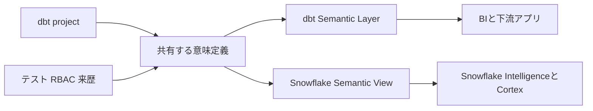
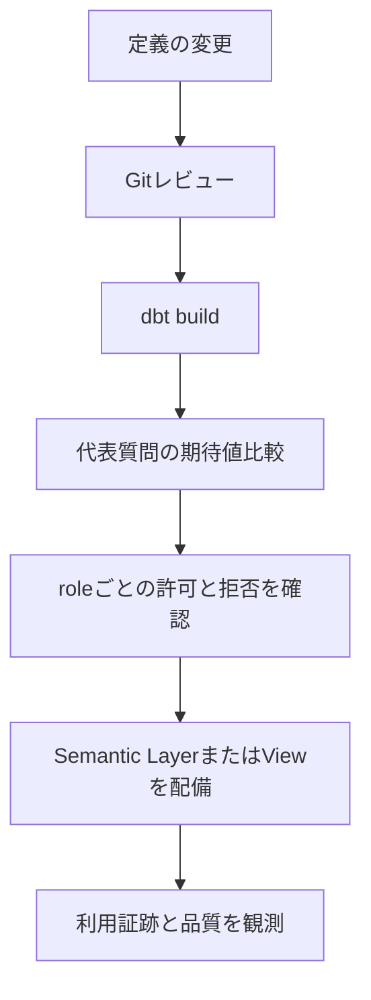

dbt Labs は Snowflake Marketplace の dbt Snowflake Native App を 2026 年 11 月に削除すると発表しました。7 月からは保守モードで、提供されるのは重大な不具合修正とセキュリティ修正に限られます。dbt platform、dbt Core、dbt Semantic Layer が廃止されるわけではありません。[公式発表](https://www.getdbt.com/blog/retiring-the-dbt-snowflake-native-app)が示す中心は、単一のアプリに AI 体験を閉じ込めるより、Semantic Layer を Snowflake の複数の AI・分析体験へ接続する方向です。

この変更を「チャット UI の移行」として扱うと失敗します。移すべき対象は UI ではなく、指標の定義、権限、来歴、検証、利用証跡です。本稿では、Native App 廃止を契機に意味定義を共有資産として移行する設計を整理します。

## 何が終わり、何が残るのか

まず対象を切り分けます。

| 対象 | 2026 年 11 月以降 | 移行での扱い |
|---|---|---|
| dbt Snowflake Native App | Marketplace から削除 | 利用者と機能を棚卸しする |
| dbt Core / dbt platform | 変更なし | モデルとテストの基盤として継続する |
| dbt Semantic Layer | 変更なし | 指標定義の再利用基盤として検証する |
| Snowflake Semantic Views | 継続 | Snowflake 内の論理モデルと RBAC を管理する |

公式発表によれば、Native App を使っていない大多数の dbt と Snowflake 利用者には影響がありません。使っている組織でも、停止日までの期間は「今の画面を延命する期間」ではなく、依存を分解し受入試験を通す期間です。

## UI ではなく意味を中心に置く

dbt Semantic Layer は、dbt モデル上で指標を定義し、結合を扱うことで、下流ツールやアプリへ一貫した指標を提供します。[dbt のドキュメント](https://docs.getdbt.com/docs/use-dbt-semantic-layer/dbt-sl)では、BI 層ではなくモデリング層へ定義を置くことで、どのツールでも同じ定義を使えると説明されています。

一方、Snowflake Semantic View は、論理テーブル、関係、facts、dimensions、metrics を Snowflake のスキーマオブジェクトとして表現します。Cortex Analyst や通常の SQL 問合せにも使え、RBAC、共有、カタログと一体で扱えます。[Snowflake の概要](https://docs.snowflake.com/en/user-guide/views-semantic/overview)を読むと、これは AI のためだけのメタデータではなく、BI と技術分析を含む共通の業務語彙です。

ここで注意したいのは、Semantic Layer と Semantic View を機械的に同一視しないことです。前者は dbt の指標定義と消費の仕組み、後者は Snowflake の論理オブジェクトです。両方を採用するなら、どちらが各指標の正本か、変換や同期を誰が所有するかを決めます。

## 移行の単位は「画面」ではなく「利用契約」

Native App の置換先を決める前に、次の 5 点を一組で台帳化します。

| 要素 | 例 | なぜ必要か |
|---|---|---|
| 定義 | `net_revenue:v7`、粒度、計算式 | 同じ語で違う数値を返さないため |
| 物理参照 | relation、column、join | SQL と来歴を再現するため |
| 権限 | role、row policy、masking | UI を替えて閲覧範囲を広げないため |
| 検証 | dbt test、代表質問、期待値 | AI の流暢さで正しさを判定しないため |
| 利用証跡 | consumer、質問、失敗理由 | どこから移すべきか判断するため |

この台帳があれば、AI チャット、BI、API のどれを選んでも、消費者は「定義をどう見せるか」の違いになります。台帳がなければ、新しい UI へ旧 UI の曖昧さを複製するだけです。

## 受入試験は数値だけでは足りない

Semantic View は、metrics、dimensions、facts の役割を明示します。Snowflake では Semantic View を `SELECT` の `FROM` 句から問合せる形式も一般提供されています。だからこそ移行テストは、単にクエリが成功するかで終えず、集約と権限を含めます。

最低限、次を固定します。

1. 重要指標ごとに、期待結果が分かる代表質問または SQL を置く。
2. 指標の粒度と非加法性をテストする。たとえば日次残高を月合計していないかを確認する。
3. 許可される role だけが閲覧でき、許可されない role は確実に失敗することを確認する。
4. 旧 Native App と移行先の結果差は、許容・修正・廃止のいずれかに分類して残す。

## 11 月から逆算する移行計画

| 時期 | 判断 | 完了条件 |
|---|---|---|
| 今 | 依存の棚卸し | 利用者、質問、指標、権限を把握する |
| 保守期間 | 定義の固定と検証 | Git、dbt test、代表質問の回帰テストを通す |
| 切替前 | 消費者の移行 | role 別の受入試験と障害導線を確認する |
| 削除後 | 旧依存の除去 | Marketplace のアプリへ戻らない状態にする |

Snowflake は Semantic View の YAML や DDL を Git で管理し、テスト後に CI/CD でデプロイする運用を推奨しています。[ベストプラクティス](https://docs.snowflake.com/en/user-guide/views-semantic/best-practices-dev)には dbt project と結び付けて materialize する例もあります。これは UI の設定を人手で再現するより、変更の再現性とロールバックを高めます。

## 実装上の判断基準

dbt の Semantic Layer、Snowflake Semantic View、または両方を選ぶ判断は、製品名ではなく次の問いで行います。

- 指標定義の正本はどこにあるか。
- Snowflake 内の RBAC と共有をどこまで意味定義に近づけるか。
- 下流の BI、AI、API が同じ定義を消費できるか。
- 指標変更を、Git のレビューと期待値テストで止められるか。
- 消費者ごとの質問・失敗・利用量を観測できるか。

Semantic View の定義は metadata ですが、AI の精度を支える実行上の契約でもあります。Snowflake のドキュメントが説明するように、論理テーブル、関係、指標、ディメンションを明示すると、LLM が物理スキーマを推測する範囲を狭められます。ただし、定義があるだけで AI の正確性は保証されません。代表質問の受入試験と、権限を含む運用監視が必要です。

## まとめ

dbt Snowflake Native App の廃止で捨てるべきものは、単一アプリへの依存です。残すべきものは、組織が合意した指標の意味と、それを安全に変更・利用・監査する契約です。

移行の成否は、新しい AI 画面が旧画面に似ているかでは測れません。複数の消費者が同じ定義を使い、定義変更がテストされ、権限と利用証跡が追える状態を作れたかで測るべきです。11 月は停止日ですが、設計の完了日はもっと早く置く必要があります。

## 参考リンク

- [dbt Labs: Retiring the dbt Snowflake Native App](https://www.getdbt.com/blog/retiring-the-dbt-snowflake-native-app)
- [dbt Docs: dbt Semantic Layer](https://docs.getdbt.com/docs/use-dbt-semantic-layer/dbt-sl)
- [Snowflake: Overview of semantic views](https://docs.snowflake.com/en/user-guide/views-semantic/overview)
- [Snowflake: Best practices for semantic views](https://docs.snowflake.com/en/user-guide/views-semantic/best-practices-dev)
- [Snowflake: semantic views in standard SQL](https://docs.snowflake.com/en/release-notes/2026/other/2026-03-02-semantic-views-standard-sql)
