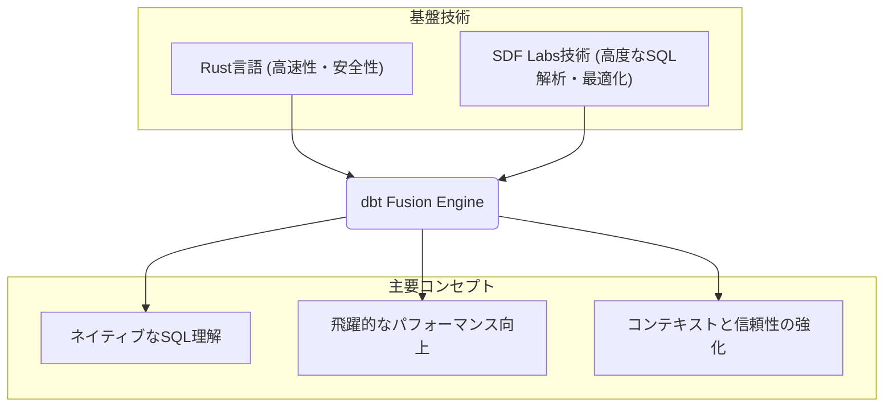
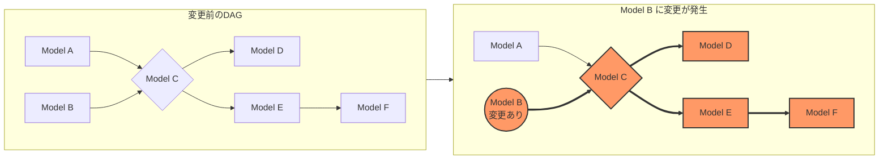
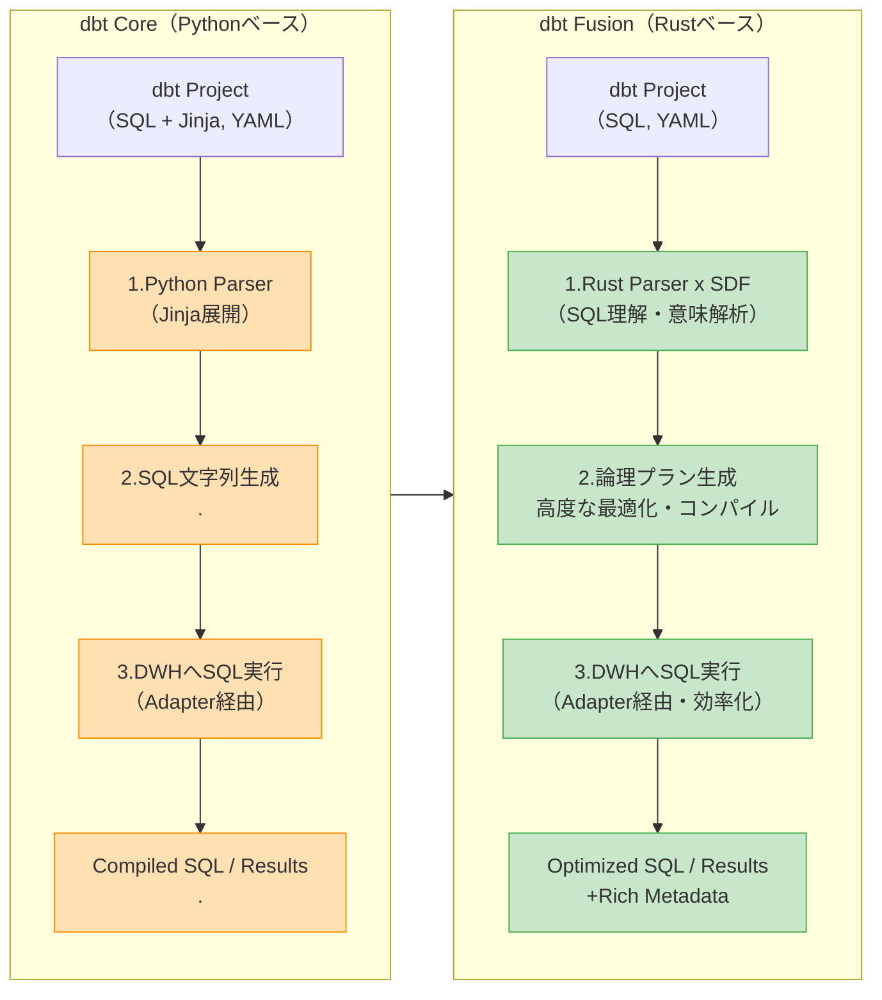
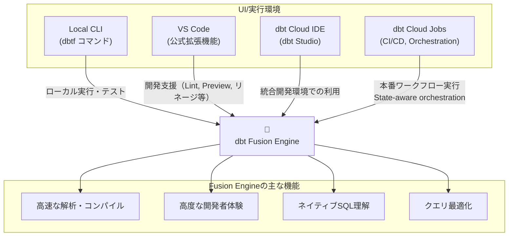

## はじめに

データ変換ツールdbt (data build tool) は、アナリティクスエンジニアリング分野で広く採用され、データパイプラインの構築と管理に革命をもたらしました。そして2025年5月28日、開発元であるdbt Labsは、dbtの性能と開発者体験を飛躍的に向上させる新しい実行エンジン「**dbt Fusion Engine**」のパブリックベータ版を発表しました。AI活用が加速し、構造化データの重要性が増す現代において、この発表はdbtが次世代の標準となるための大きな一歩として、大きな注目を集めています。

dbt Fusionは、単なる高速化に留まらず、データ開発のあり方を変革する可能性を秘めています。本記事では、このdbt Fusion Engineについて、その定義から主要機能、技術的特徴、dbt Coreとの違い、導入方法、そして将来の展望に至るまで、網羅的に解説します。本稿が、dbt Fusionのもたらす価値と影響を深く理解するための一助となれば幸いです。

:::message
本記事で紹介するdbt Fusion Engineは、2025年5月29日時点で**パブリックベータ版**です。機能やサポート状況は今後変更される可能性があるため、最新の情報は必ずdbt Labsの公式ドキュメント等でご確認ください。
:::

## dbt Fusion Engineとは？

### dbt Fusion Engineの定義と中核コンセプト

dbt Fusion Engineは、dbt Labsが開発した、データ変換ワークフローのための**全く新しい実行エンジン**です。従来のdbt Coreが主にPythonで構築されていたのに対し、dbt Fusionはプログラミング言語**Rust**を基盤とし、2025年1月にdbt Labsが買収したSDF (Semantic Data Fabric) Labsの技術を活用してゼロから再構築されました。



dbt Fusionの中核となるコンセプトは以下の3点です。

1.  **ネイティブなSQL理解能力**: 複数のデータベース方言（例: Snowflake, BigQuery）のSQLを、単なる文字列としてではなく、その意味構造を深く理解します。これにより、高度な分析、最適化、検証が可能になります。
2.  **パフォーマンスの飛躍的向上**: Rustによる実装と効率的なアーキテクチャにより、dbt Coreと比較して大幅な速度向上を実現します。特に大規模で複雑なdbtプロジェクトにおいて、開発サイクルと実行時間の大幅な短縮が期待できます。
3.  **コンテキストと信頼性の強化**: SQLの深い理解と状態認識（ステートアウェアネス）を通じて、データの系統（リネージ）や依存関係を正確に追跡します。これにより、変更箇所のみを効率的に処理するオーケストレーション（処理の調整・実行）などが可能になり、データ変換プロセスの信頼性と透明性を高めます。

これらのコンセプトは、dbt Fusionが単なる高速化ツールに留まらず、データ開発のあり方そのものを変革する可能性を示唆しています。SDFの技術基盤は、元々Meta社（旧Facebook）の複雑なデータエコシステムでPII（個人識別情報）追跡といった高度な要求に応えるために開発されたものであり、その堅牢性とスケーラビリティはFusionにも引き継がれています。この技術的背景は、Fusionがエンタープライズレベルの要求にも応えるポテンシャルを持つことを裏付けています。

### 開発の背景と目的

dbt Fusion Engineの開発は、現代のデータ環境における以下の重要なトレンドと課題に対応することを目的としています。

  * **AI時代における開発者体験の変革**:
      * AIの導入が進むにつれ、高品質で信頼性の高い構造化データへの要求はますます高まっています。dbt Labsは、dbtを「AI対応の構造化データの標準」と位置づけています。
      * Fusionは、開発者がより迅速かつ効率的に、AIモデルが必要とする質の高いデータセットを構築できる環境を提供することを目指しています。高速なフィードバックループやインテリジェントなコード補完は、AIを活用した開発ワークフローの生産性を大幅に向上させることが期待されます。
  * **dbt Coreのパフォーマンス課題の克服**:
      * Pythonで構築されているdbt Coreは、プロジェクトの規模が大きくなるにつれて、解析（パース）やコンパイルに時間がかかり、開発効率のボトルネックとなるケースがありました。
      * FusionはRustベースで再設計することで、これらのパフォーマンス課題を根本的に解決し、大規模で複雑なデータパイプラインのスムーズな運用を目指します。
  * **より大規模で複雑なデータパイプラインへの対応**:
      * データ量の増大とデータソースの多様化に伴い、データパイプラインはますます複雑化しています。
      * Fusionの高度なSQL理解能力やリネージ追跡機能は、このような複雑な環境でデータ変換の正確性、保守性、信頼性を維持するために不可欠です。

## dbt Fusion Engineの主要機能と特徴

dbt Fusionは、パフォーマンス、開発者体験、コスト効率の面で大きな進化を遂げています。

### 1\. パフォーマンスの劇的な向上：解析時間は最大30倍高速に

dbt Fusionの最も注目すべき点は、その**圧倒的な処理速度**です。Rust言語による実装とSDFの効率的な技術により、特に**解析時間はdbt Coreの約30倍高速**になったと報告されています。大規模プロジェクトでも処理がミリ秒単位で完了するケースもあり、これは開発者の生産性を劇的に向上させ、AIエージェントによるコード生成やリアルタイム再コンパイルといった新しいユースケースの実現可能性を広げます。

### 2\. 開発者体験 (DX) の革新：リアルタイムフィードバックと高度な支援機能

dbt Fusionは、開発者の生産性と満足度を高めるための多彩な機能を提供します。これらは主に新しいdbt Language ServerとVS Code拡張機能を通じて提供され、開発者の作業を効率化し、より快適な開発体験を実現します。

  * **リアルタイムのエラー検出とフィードバック**: コーディング中に問題を早期に発見し、迅速に修正できます。
  * **インラインCTEプレビュー**: SQL内の共通テーブル式（CTE）の結果を個別にプレビューでき、デバッグやロジック検証を効率化します。
  * **高度なコードナビゲーション**: 自動リファクタリング（例：モデル名変更時の参照自動更新）や「定義へジャンプ」機能により、コードの保守性を向上させます。
  * **カラムレベルのリネージ表示**: データがどのように変換されてきたかをカラム単位で追跡でき、データガバナンスや影響分析に貢献します。

### 3\. スマートな実行モデルとクエリ最適化

dbt Fusionは、**AOT (Ahead-of-time) コンパイルをデフォルト**としつつ、必要に応じてJIT (Just-in-time) コンパイルに切り替えることで、パフォーマンスと柔軟性の両立を図ります。また、**SQLの静的解析と論理プラン**の生成により、早期のエラー検出と正確なデータフローの把握を可能にします。`static_analysis` 設定により、モデルごとの静的解析の有効・無効を切り替えられるため、UDF（ユーザー定義関数）などを含む特殊なケースにも対応可能です。

### 4\. コスト削減への貢献：State-aware orchestration

dbt Fusionは、**State-aware orchestration機能**（dbt Enterpriseプラン以上で提供予定）により、変更が必要なモデルのみをインテリジェントに識別しビルドします。これにより、コンピューティングリソースの利用を効率化し、データウェアハウスのコスト削減に貢献します。dbt Labsによると、初期段階で平均10%のコスト削減が見込まれており、将来的には「無料よりも安い」状態の実現を目指すとしています。



### 5\. 将来提供予定の期待機能

dbt Labsは、Fusionのさらなる進化に向けて、以下のような魅力的な機能を計画しています。

  * **開発環境向けのローカル実行**: データプラットフォームに接続せずに、ローカル環境でdbtコードを実行・テスト可能に。
  * **PII (個人識別情報) の自動分類**: データパイプライン全体でPIIを自動検知・追跡し、ガバナンスを強化。
  * **クロスプラットフォームのワークロード実行**: 異なるデータプラットフォーム間でdbtパイプラインを容易に移行可能に。

## dbt Coreからなにが変わるのか？

dbt Fusion Engineの登場は、既存のdbt Coreユーザーにとって多くの疑問点を生むかもしれません。ここでは両者の違いと関係性を整理します。

### アーキテクチャと実装言語の違い



| 特徴               | dbt Core                                   | dbt Fusion Engine                                                                |
| :----------------- | :----------------------------------------- | :------------------------------------------------------------------------------- |
| **実装言語**       | 主に**Python**                             | **Rust言語**でゼロから再構築                                                     |
| **SQL生成**        | Jinjaテンプレートエンジンで動的にSQLを生成 | SDF (Semantic Data Fabric) の技術を基盤とし、SQLをネイティブに理解・生成・最適化 |
| **開発背景**       | コミュニティと共に長年開発・改善           | dbt Coreとは独立したエンジンとして設計（一部マクロ等を除くコード共有は限定的）   |
| **パフォーマンス** | 大規模プロジェクトでPythonの実行速度が課題 | Rustによりメモリ安全性と高パフォーマンスを両立、大幅な高速化を実現               |

### FusionはCoreのスーパーセットへ

dbt Fusionは、長期的にはdbt Coreの全ての機能を包含し、さらにそれを超える機能セット（スーパーセット）を提供することを目指しています。**現時点（パブリックベータ版）では、dbt Core v1.9の多くの機能をサポートしますが、一部未実装の機能や制限事項も存在します。**

既存のdbtプロジェクトの大部分はFusionで動作するように設計されていますが、以下の点は特に注意が必要です。

  * **Pythonモデルの非サポート**: 現状、FusionはSQLモデルのみをサポートします。
  * **特定のデータウェアハウスへの初期サポート集中**: 初期はSnowflakeに注力し、順次他のアダプター（BigQuery, Redshiftなど）に対応予定です。
  * **一部の高度なdbt Core機能の未サポートまたは制限**: 詳細は後述の「サポート機能マトリックス」をご確認ください。

### Apache 2.0からELv2へ

ライセンスモデルは重要な変更点です。

  * **dbt Core**: 引き続き**Apache 2.0ライセンス**（寛容なオープンソースライセンス）の下で提供されます。
  * **dbt Fusion**: ソースアベイラブルなコンポーネントは**ELv2 (Elastic License v2)** ライセンスの下で提供されます。
      * ELv2は、ソースコードの閲覧や変更、ローカルでの利用は可能ですが、主に以下の制約があります。
        1.  Fusionをマネージドサービスとして他者に提供することの禁止。
        2.  ライセンスキーによって保護されている機能の回避または隠蔽の禁止。
        3.  ライセンスや著作権に関する表示の削除または隠蔽の禁止。

dbt Fusionのソースコードの大部分は[GitHubのdbt-labs/dbt-fusionリポジトリ](https://github.com/dbt-labs/dbt-fusion)で公開され、コミュニティによる閲覧や議論が可能です。しかし、dbt Cloud連携機能など一部の高度な機能はプロプライエタリなコードを含み、有料プランの顧客向けとなる場合があります。このライセンス変更は、dbt Labsが開発投資に見合う知的財産を保護しつつ、コミュニティへの透明性とアクセシビリティのバランスを取った結果と言えます。**通常の内部利用においては、ELv2ライセンスが大きな障害になることは少ないと考えられます。**

### Fusionが未来のdbtを牽引

dbt Labsは、今後**dbt Fusionに開発リソースを集中させる**方針を明確にしています。これはFusionが将来のdbtの技術基盤となり、イノベーションの中心となることを示しています。dbt Coreも引き続きサポートされ、バグ修正やセキュリティパッチは提供されますが、新機能開発の主軸はFusionに移ります。このリソースシフトは、長期的にはdbtエコシステム全体に恩恵をもたらすと考えられ、dbt Coreユーザーは将来的なFusionへの移行を視野に入れることが推奨されます。

## エコシステムとの連携

dbt Fusionは、既存のdbtエコシステムとシームレスに連携し、その能力を最大限に発揮できるよう設計されています。



### dbt Cloudとの統合強化

  * **dbt Studioでの自動利用**: dbt CloudのIDEであるdbt Studioを利用している場合、環境をアップグレードするだけでFusionの機能が自動的に利用可能になります（追加インストール不要）。
  * **有料顧客向け高度機能**: State-aware orchestrationのような一部の高度なFusion機能は、dbt Cloudの有料プラン（Enterpriseプランなど）の顧客向けに提供され、クラウド環境での運用効率とコスト削減効果を最大化します。
  * **AI活用とアナリスト向け新機能**: dbt Labsは、AIシステムとdbt内の構造化データを接続する**dbt MCP (Model Context Protocol) サーバー**を発表しました。Fusionはこの基盤技術と連携し、AI活用の可能性を拡大します。また、アナリスト向けの新しいビジュアル編集ツール「dbt Canvas」、自然言語クエリ「dbt Insights」、データ探索ツール「dbt Catalog」の機能拡張などもリリースされ、これらはFusionエンジンを基盤としています。

### VS Code拡張機能によるローカル開発の進化

dbt Labsは、dbt Fusionの能力を最大限に引き出すための**公式VS Code拡張機能**（パブリックベータ）をリリースしました。広く利用されているVS Code上で、Fusionの高速処理とSQL理解能力を活かした高度な開発支援機能が提供され、多くの開発者の生産性を向上させます。

  * **主な開発支援機能**:
      * **IntelliSense**: モデル名、カラム名、マクロ等の自動補完。
      * **ホバーインサイト/プレビュー**: コードから離れずにテーブルやカラム情報を表示。
      * **自動リファクタリング**: モデル名変更時の参照自動更新。
      * **定義へのジャンプ**: モデルやマクロの定義箇所へ即座に移動。
      * **インラインCTEプレビュー**: 特定のCTEの結果のみをプレビュー。
      * **リアルタイムエラー検出**: コーディング中のエラーを即時表示。
      * **リッチなリネージ表示**: カラムレベルまたはテーブルレベルのリネージを開発中に確認。
      * **コンパイル済みコード表示**: dbtコードと生成されたSQLを並べて確認。

### ローカル環境での利用 (CLI)

ローカルCLIでの利用もサポートされており、CI/CDパイプラインへの組み込みや特定の自動化スクリプトでの利用など、柔軟な活用が可能です。

  * **インストールと実行**: macOS, Linux, Windowsに対応したインストールスクリプトが提供され、ローカルマシンに容易にFusionを導入できます。インストール後は、従来の`dbt`コマンド、またはFusion専用のエイリアス`dbtf`コマンドでプロジェクトを実行できます。
  * **dbt Coreユーザーも無償利用可能**: dbt Coreユーザーは、ローカル環境でdbt Fusionエンジンを無償で利用できます。これにより、dbt Cloudの顧客でなくても、Fusionのパフォーマンス向上や一部の開発者支援機能の恩恵を受けることが可能です。

## dbt Fusion Engineの導入と利用

### インストールとセットアップ

各OS向けのインストール方法は以下の通りです。（2025年5月29日時点）

  * **macOS & Linux (bash / zsh)**:

    ```bash
    curl -fsSL https://public.cdn.getdbt.com/fs/install/install.sh | sh -s -- --update
    ```

  * **Windows (PowerShell)**:

    ```powershell
    irm https://public.cdn.getdbt.com/fs/install/install.ps1 | iex
    ```

    インストール後、シェルをリロードするか新しいターミナルウィンドウを開くと、`dbt`または`dbtf`コマンドが利用可能になります。

  * **インストールの検証**: ターミナルで`dbtf --version`を実行し、バージョン情報が表示されれば成功です。

  * **VS Code拡張機能**: Visual Studio CodeまたはCursor IDEのMarketplaceから、発行元が「dbt Labs Inc.」の「dbt」拡張機能をインストールします。この拡張機能はFusionエンジンを内部的に利用します。

### クイックスタートガイド (Jaffle Shopプロジェクト例)

dbt Fusionの機能を最も手軽に体験するには、サンプルプロジェクト「Jaffle Shop」を利用するのがおすすめです。

1.  **プロジェクト初期化**:
    ```bash
    dbtf init jaffle_shop_fusion # プロジェクト名を指定
    ```
    （接続プロファイルの設定は指示に従ってください。既存のプロファイルを使用する場合は`--skip-profile-setup`を追加し、`dbt_project.yml`を適宜修正します。）
2.  **プロジェクトディレクトリへ移動**:
    ```bash
    cd jaffle_shop_fusion
    ```
3.  **プロジェクトビルド**: サンプルデータのロード、モデルのビルド、テストを実行します。
    ```bash
    dbtf build
    ```
4.  **VS Codeで探索**: Jaffle ShopプロジェクトをVS Codeで開き、`models/marts/orders.sql`などのファイルを開いて、データプレビュー、コンパイル済みコード表示、リネージ確認、SQLオートコンプリートといったFusionの機能を試してみましょう。

### 現在の開発状況と今後のロードマップ

dbt Fusion Engineは、2025年5月29日時点で**パブリックベータ版**として提供されています。

  * **初期サポート**: データウェアハウスとして**Snowflakeのみをサポート**しています。BigQueryやRedshiftなど他の主要アダプターも順次対応予定です。
  * **GA (一般提供開始) 目標**: dbt Coreとの機能パリティ（同等性）を目指し、**2025年後半のGAを目標**としています。ただし、多くの場合、既存のdbtユーザーはGAを待たずに早期にFusionの利用を開始できるとされています。
  * **継続的な改善**: ベータ期間中も、機能追加、バグ修正、パフォーマンス改善が継続的に行われます。

ロードマップの詳細は、dbt Labsの公式ブログやドキュメントで随時更新されるため、最新情報を確認することを強く推奨します。

## サポート機能マトリックス (2025年5月28日時点の主な注意点)

dbt Fusion Engine (ベータ版) を導入検討する上で、現時点でのdbt Coreとの機能差を把握しておくことは非常に重要です。以下に主な点を抜粋します。詳細な最新情報は必ず[公式ドキュメント](https://docs.getdbt.com/docs/fusion/supported-features)でご確認ください。

| 機能カテゴリ                   | サポート状況                                                                                 | 備考・注意点                                                                                                                                       |
| :----------------------------- | :---------------------------------------------------------------------------------------------------------------------- | :------------------------------------------------------------------------------------------------------------------------------------------------- |
| **データウェアハウスサポート** | **Snowflakeのみ初期サポート**                                                                                           | BigQuery, Redshiftなど他のアダプターは順次対応予定。**現時点ではSnowflake環境以外での利用はできません。**                                          |
| **モデルタイプ**               | **SQLモデルのみサポート**                                                                                               | **Pythonモデルは対象外です。** Pythonモデルに依存するプロジェクトはFusionへ完全移行できません。                                                    |
| **Exposures**                  | 一部機能に影響あり。`docs generate`を伴うジョブでのメタデータ生成とカタログlineage表示は継続。                          | exposure選択メソッド、ダウンストリームexposures更新トリガーへの影響。                                                                              |
| **`persist_docs`**             | **対象外**                                                                                                              | dbt YAMLファイルの記述をDWHのオブジェクト/カラムコメントとして永続化する機能。                                                                     |
| **`clone` コマンド**           | **対象外**                                                                                                              | 代替として`deferral`サポートがあります。CIジョブではdbt Coreで継続実行するか、`run-operation` や手動でのスキーマクローンを検討する必要があります。 |
| **マテリアライゼーション**     | `view`, `table`, `incremental` (標準戦略) のみサポート                                                                  | `microbatch incremental strategy`, `materialized views`, `dynamic tables`, `custom materializations`は**対象外**です。                             |
| **モデルガバナンス機能**       | `contracts/constraints`, `access` ref制限 (group内private, package内protected), `deprecation_date` 警告などは**対象外** |                                                                                                                                                    |
| **`grants`**                   | **対象外**                                                                                                              | モデル実行時に指定された権限を保証する機能。                                                                                                       |
| **dbt-docs ローカルサイト**    | **対象外** (`docs generate/serve`コマンドによるローカルでのドキュメント生成・表示。GAまでにサポート予定)                |                                                                                                                                                    |
| **セマンティックレイヤー**     | 開発 (`semantic_models`, `metrics`, `saved_queries` の新規作成・変更) および `saved_query` のエクスポートは**対象外**   | Fusionはまだ `semantic_manifest.json` を生成しないため、これらの操作はdbt Coreで実行する必要があります。                                           |

:::message
ベータ版であるため、サポート状況は今後急速に変化します。**特に、Pythonモデルの非サポートや、Snowflake以外のデータウェアハウスへの対応が初期段階である点は、多くのユーザーにとって重要な判断材料となります。** ご自身のプロジェクトへの適用可否は、必ず最新の公式情報に基づいて慎重にご判断ください。
:::

## dbt Fusion Engineのライセンスと影響

dbt Fusion Engineの導入を検討する上で、そのライセンス体系である**ELv2 (Elastic License v2)** の理解は不可欠です。これは、従来のdbt CoreのApache 2.0ライセンスとは異なるアプローチを取ります。

### ELv2 (Elastic License v2) の概要と主な制約

ELv2は、ソースコードの透明性を保ちつつ、開発元であるdbt Labsの商業的利益を保護することを目的としたライセンスです。主な制約は以下の通りです。

1.  **マネージドサービスとしての再販禁止**: dbt Fusionを主要な機能として他者にマネージドサービスとして提供することはできません。
2.  **ライセンスキー保護機能の回避・隠蔽の禁止**: ライセンスキーによって保護されている機能の無効化や隠蔽はできません。
3.  **ライセンス、著作権表示の削除・隠蔽の禁止**: ソースコードやバイナリに含まれるライセンス情報や著作権表示を削除・隠蔽することはできません。

これらの制約は、主にdbt Labs以外の企業がFusionのコードを利用してdbt Labsと直接競合するようなサービスを提供することを防ぐためのものです。

### Apache 2.0との比較

dbt Coreは、引き続きApache 2.0ライセンスの下で提供され、サポートも継続されます。Apache 2.0は非常に寛容なオープンソースライセンスであり、商用利用、改変、再配布に関する制約がELv2よりも緩やかです。Fusionとdbt Coreはライセンス体系が明確に区別されるため、ユーザーは自身のニーズやユースケースに応じて選択を検討する必要があります。

### 個人開発者と企業ユーザーへの影響

**ELv2ライセンスは、個人開発者や企業がdbt Fusionを内部的に利用する上で、大きな制約とはなりにくいと考えられます。**

  * **ローカルでの利用や内部利用**: 自身のデータワークフローのため、または企業内でのデータパイプライン構築・運用にFusionを利用することは、ELv2の範囲内で可能です。
  * **dbt Labs提供のバイナリ利用推奨**: dbt Labsは、Fusionの利用にあたり、自身でのソースコードからのコンパイルよりも、dbt Labsが提供するコンパイル済みバイナリの利用を推奨しています。
  * **ソースコードの閲覧・変更**: ELv2の規定を遵守する限りにおいて、公開されているFusionのソースコードを閲覧したり、変更したりすることは可能です。

重要なのは、Fusionを「サービスとして他者に提供する」場合にELv2の制約が顕著になるという点です。通常のデータ分析チームやデータエンジニアリングチームが自社の分析基盤として利用する場合には、ライセンスが大きな障壁となることは少ないでしょう。

## dbt Fusion Engineの将来性と展望

dbt Fusion Engineは、単なるdbtのアップデートではなく、dbtの将来を担う新しい技術基盤です。dbt Labsは、Fusionを通じて以下のような方向性を示しており、データ業界全体からの期待が高まっています。

  * **パフォーマンスの飽くなき追求**: 解析・コンパイル時間のさらなる短縮。
  * **次世代の開発者体験**: より高度で直感的な開発支援機能の拡充。
  * **柔軟な開発環境**: ローカル環境での完全な実行・テスト機能の実現。
  * **コスト効率の最大化**: State-aware orchestrationの進化による運用コスト削減の深化。
  * **エンタープライズ対応強化**: PII（個人識別情報）自動検出、高度なガバナンス機能、詳細なリネージ機能の強化。
  * **プラットフォーム非依存性の向上**: クロスプラットフォームでのワークロードポータビリティの実現。

これらの進化は、dbtが単なるSQL変換ツールから、データ処理と管理のためのより広範なプラットフォームへと発展していくことを示唆しており、特にエンタープライズ規模での採用を加速させる要因になりそうです。

## まとめ

dbt Fusion Engineは、Rustベースへの刷新とSDF技術の統合により、従来のdbt Coreが抱えていたパフォーマンスの限界を打ち破り、大規模で複雑なデータパイプラインの処理能力を飛躍的に向上させる可能性を秘めています。解析速度の最大30倍高速化、リアルタイムエラー検出、インテリジェントなコード補完、高度なリネージ機能などは、開発者の生産性を大幅に高め、より迅速な価値提供を実現できそうです。しかし、**現時点（2025年5月）ではパブリックベータ版であり、以下の点に十分注意が必要です。**

  * **Snowflake以外のデータウェアハウスへの対応が限定的**であること。
  * Pythonモデルがサポートされないなど、一部のdbt Core機能に**未サポートまたは制限がある**点。
  * ライセンスモデルがdbt CoreのApache 2.0から**ELv2へと変更された**点。（通常の社内利用では大きな影響は少ない見込み）

dbt Coreからの移行を検討する際には、まずご自身のプロジェクトで使用している機能がFusionでサポートされているかを慎重に確認し、パフォーマンス要件、開発チームのスキルセット、そして将来的な拡張計画などを総合的に評価することが不可欠です。

dbt Fusion Engineのコンセプトは、データ変換の世界における大きな進歩です。パフォーマンスの劇的な向上、開発者体験の革新、そして将来的なコスト削減の可能性は、多くの組織にとって魅力的な価値提案です。

総じて、dbt Fusion Engineは、**データ変換の未来を塗り替えるポテンシャルを秘めたエキサイティングな技術**です。その動向を注視し、自社の状況に合わせて適切なタイミングでの導入を検討することは、データ活用を推進するすべての組織にとって価値を生みそうです。

## 参考リンク

  * docs.getdbt.com
      * [About the dbt Fusion engine | dbt Developer Hub - dbt Docs - dbt Labs](https://docs.getdbt.com/docs/fusion/about-fusion)
      * [dbt Docs - dbt Labs](https://docs.getdbt.com/)
      * [Install Fusion | dbt Developer Hub - dbt Docs](https://docs.getdbt.com/docs/fusion/install-fusion)
      * [Meet the dbt Fusion Engine: the new Rust-based, industrial-grade engine for dbt - dbt Docs](https://docs.getdbt.com/blog/dbt-fusion-engine)
      * [New concepts in the dbt Fusion engine | dbt Developer Hub - dbt Docs](https://docs.getdbt.com/docs/fusion/new-concepts)
      * [Path to GA: How the dbt Fusion engine rolls out from beta to production | dbt Developer Blog](https://docs.getdbt.com/blog/dbt-fusion-engine-path-to-ga)
      * [Quickstart for the dbt Fusion engine | dbt Developer Hub - dbt Docs](https://docs.getdbt.com/guides/fusion)
      * [Supported features | dbt Developer Hub - dbt Docs - dbt Labs](https://docs.getdbt.com/docs/fusion/supported-features)
      * [The Components of the dbt Fusion engine and how they fit together | dbt Developer Blog](https://docs.getdbt.com/blog/dbt-fusion-engine-components)
  * www.getdbt.com
      * [About the dbt Community](https://www.getdbt.com/community)
      * [Building the next-gen dbt engine: How SDF levels up data tooling | dbt Labs](https://www.getdbt.com/blog/building-the-next-gen-dbt-engine)
      * [dbt Fusion engine](https://www.getdbt.com/product/fusion)
      * [dbt Labs Redefines dbt with New Fusion Engine, Built to ...](https://www.getdbt.com/blog/dbt-labs-redefines-dbt-with-new-fusion-engine)
      * [dbt Licensing - Public FAQs | dbt Labs](https://www.getdbt.com/licenses-faq)
      * [New code, new license: Understanding the new license for the dbt Fusion Engine | dbt Labs](https://www.getdbt.com/blog/new-code-new-license-understanding-the-new-license-for-the-dbt-fusion-engine)
      * [Where we're headed with the dbt fusion engine](https://www.getdbt.com/blog/where-we-re-headed-with-the-dbt-fusion-engine)
  * 記事
      * [2025 dbt Launch Showcaseでの発表内容まとめ | DevelopersIO](https://dev.classmethod.jp/articles/2025-dbt-launch-showcase-summary/)
      * [dbt Fusion engineのcolumn lineage機能を試してみた - Zenn](https://zenn.dev/myshmeh/articles/87fa16c15a4367)
      * [データ品質を支えるdbt test \~Ubieの事例を添えて\~ - Zenn](https://zenn.dev/okiyuki/articles/2aff40319c19a0)

この記事が少しでも参考になった、あるいは改善点などがあれば、ぜひリアクションやコメント、SNSでのシェアをいただけると励みになります！
