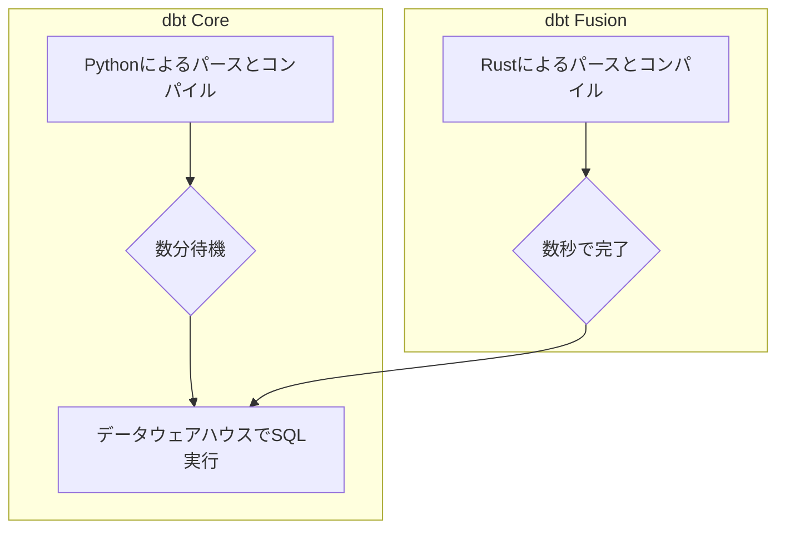

dbt (data build tool) は、データ変換ワークフローにソフトウェアエンジニアリングのベストプラクティスを導入し、「アナリティクスエンジニア」という役割を確立しました。

dbtのエコシステムは、主に以下の3つの要素で構成されます。

  - **dbt Core**: オープンソースで提供されるコマンドラインインターフェース（CLI）ツールです。
  - **dbt Cloud**: dbt Coreを基盤とした、エンタープライズ向けのフルマネージドSaaSプラットフォームです。
  - **dbt Fusion**: パフォーマンスと開発者体験を向上させるために開発された、次世代の実行エンジンです。

この記事では、これら3つの要素を比較分析し、組織のニーズに最適なツールを選択するための指針を考えます。

### 1. アーキテクチャと基本思想

各製品のアーキテクチャと設計思想の違いを解説します。

#### 1.1. アーキテクチャ：PythonからRustへの移行

dbtの進化における最も重要な技術的変更は、実行エンジンのプログラミング言語がPythonからRustへ移行したことです。

  - **dbt Core**: Pythonで構築されており、柔軟性が高い反面、大規模プロジェクトでは解析（パース）やコンパイルの処理時間が開発サイクルの遅延を招く課題がありました。
  - **dbt Fusion**: パフォーマンスとメモリ安全性に優れるRust言語で、エンジンをゼロから再構築しました。

この刷新により、特に大規模プロジェクトにおいて、パース処理が最大で約30倍高速化されます。

この高速化は、データウェアハウスでのSQL実行時間ではなく、その前段階である開発者のローカル環境での作業（Jinjaレンダリング、依存関係グラフ構築など）に適用されます。これにより、開発者のイテレーションサイクルが短縮されます。

Rustへの移行は、AI支援によるコーディングなど、将来の高度な開発体験を実現するための戦略的な判断です。

dbt Fusionの詳細はこちらの記事で整理しました
https://zenn.dev/suwash/articles/dbt_fusion_engine_20250530

#### 1.2. 基本思想：自己管理の柔軟性とマネージドサービスの迅速性

dbtは、組織の運用能力やニーズに応じて選択できる、2つの異なるデプロイモデルを提供します。

| 項目 | dbt Core | dbt Cloud |
| :--- | :--- | :--- |
| **概要** | オープンソースのCLIツール | フルマネージドのSaaSプラットフォーム |
| **利点** | ・完全な柔軟性とコントロール ・無償 | ・インフラ管理の複雑さを解消 ・迅速な開発開始と高い生産性 |
| **考慮点** | ・運用（スケジューリング、監視など）の自己構築が必要 ・高い技術的専門知識 | ・サブスクリプション料金 ・柔軟性の低下 |
| **適した組織** | 既存の技術スタックとの深い統合を求める組織 | データモデリングに集中し、迅速な価値創出を目指す組織 |

#### 1.3. 機能概要比較

dbt Core、dbt Cloud（Coreエンジン）、dbt Cloud（Fusionエンジン）の主な違いを以下に示します。

| 項目 | dbt Core | dbt Cloud (Core Engine) | dbt Cloud (Fusion Engine) |
| :--- | :--- | :--- | :--- |
| **コア技術** | Python | Python | Rust |
| **主要インターフェース** | コマンドライン (CLI) | WebベースIDE & CLI | WebベースIDE & CLI (VS Code拡張機能) |
| **デプロイモデル** | 自己管理 (セルフホスト) | フルマネージドSaaS | フルマネージドSaaS |
| **コストモデル** | 無料 (オープンソース) | サブスクリプション (シート/使用量ベース) | サブスクリプション (シート/使用量ベース) |
| **ターゲットユーザー** | 高い技術力を持つ個人/チーム | 個人から大企業までのデータチーム | 次世代の生産性を求めるすべてのデータチーム |
| **主な利点** | 完全な柔軟性、無償 | 運用負荷の軽減、迅速な立ち上げ | 圧倒的なパフォーマンス、優れた開発者体験 |
| **主な制約** | 高い運用オーバーヘッド | 柔軟性の低下、有償 | 一部機能は有償、エコシステムは発展途上 |

### 2. ワークフローにおける機能比較

アナリティクスエンジニアリングの主要なワークフローにおける各製品の機能と影響を比較します。

#### 2.1. 開発環境

  - **dbt Core**: 開発者は、好みのIDEやターミナルを使い、ローカル開発環境を自身で構築します。コードの変更に対するフィードバックは、`dbt run`などのコマンドを都度実行して得ます。
  - **dbt Cloud**: ブラウザベースのIDEを提供し、環境構築の手間なく迅速に開発を開始できます。オートコンプリートやDAGの視覚化など、開発を支援する機能が組み込まれています。
  - **dbt Fusion**: 強力なVS Code拡張機能を通じて、開発体験を刷新します。
      - **ライブエラー検出**: コマンド実行前に、入力中のコードのエラーをリアルタイムで検出
      - **深いSQL理解**: データ型、カラム名、関数シグネチャをネイティブに理解
      - **高度なツール群**: CTEのプレビューや定義元ジャンプ機能により、デバッグサイクルを短縮

Fusionは、バグを開発ライフサイクルの早期に発見する「シフトレフト」を実現します。これにより、データウェアハウスのコストを削減し、開発者の生産性を大幅に向上させます。

#### 2.2. オーケストレーションとデプロイ

  - **dbt Core**: オーケストレーション機能を持たないため、AirflowやGitHub Actionsなどの外部ツールと連携させてジョブ実行を管理する必要があります。
  - **dbt Cloud**: ネイティブなジョブスケジューラと統合されたCI/CD機能を提供します。UIを通じてジョブのスケジュールや依存関係を簡単に設定できます。
  - **dbt Fusion**: 実行エンジンとして、既存のオーケストレーションシステム全体の効率を向上させます。パースとコンパイルの高速化により、CIパイプラインの実行時間が数分から数秒単位に短縮されます。

#### 2.3. ガバナンス、セキュリティ、オブザーバビリティ

  - **dbt Core**: 静的なドキュメンテーションサイトを生成する基本的なガバナンス機能を提供します。アクセス制御やリアルタイム監視などの高度な機能は、外部ツールとの連携が必要です。
  - **dbt Cloud**: 特にEnterpriseプランにおいて、エンタープライズグレードの包括的な機能を提供します。
      - **セキュリティ**: ロールベースアクセス制御 (RBAC)、シングルサインオン (SSO)、監査ログ
      - **ドキュメンテーションとリネージ**: 自動更新されるドキュメントと、インタラクティブなデータリネージの可視化
      - **モニタリングとアラート**: ジョブの実行履歴ダッシュボードと、Slackやメールへの通知機能
  - **dbt Fusion**: **カラムレベルリネージ**を実現し、ガバナンス能力を向上させます。SQLを直接解析することで、どのカラムがどの変換を経て最終的にどのカラムになったのかを正確に追跡できます。これは、データ変更の影響範囲特定や機密データ管理において非常に有効です。

#### 2.4. 詳細機能比較

| カテゴリ | 機能 | dbt Core | dbt Cloud | dbt Fusion (dbt Cloudで有効化) |
| :--- | :--- | :--- | :--- | :--- |
| **開発** | IDEタイプ | 外部IDE (VS Codeなど) | ブラウザベースIDE & 外部IDE | VS Code拡張機能による強化 |
| | CLIアクセス | ◎ (必須) | ◎ | ◎ |
| | ライブエラー検出 | ✕ | ✕ | ◎ (入力中にエラーを検出) |
| | CTEプレビュー | ✕ | ✕ | ◎ (個別のCTE出力をプレビュー) |
| | SQLの深い理解 | ✕ | ✕ | ◎ (データ型とカラムをネイティブに理解) |
| **オーケストレーション** | ネイティブスケジューラ | ✕ (外部ツール必須) | ◎ | 実行を高速化し、コストを削減 |
| | 統合CI/CD | ✕ (手動設定) | ◎ | CIの実行時間を劇的に短縮 |
| **ガバナンス** | RBAC | ✕ | ◎ (Enterprise) | N/A |
| | SSO | ✕ | ◎ (Enterprise) | N/A |
| | 監査ログ | ✕ | ◎ (Enterprise) | N/A |
| | リネージ粒度 | モデルレベル | モデルレベル | ◎ (カラムレベルリネージを実現) |
| **オブザーバビリティ** | ネイティブアラート | ✕ | ◎ (ジョブステータス/鮮度) | N/A |
| | 実行履歴UI | ✕ | ◎ | N/A |
| **その他** | APIアクセス | ✕ | ◎ (Team/Enterprise) | N/A |
| | セマンティックレイヤー | ✕ | ◎ (Team/Enterprise) | N/A (将来的にサポート予定) |

### 3. 高度な機能と戦略

dbt Cloudが提供する、プラットフォームとしての価値を高める独自機能を紹介します。

#### 3.1. dbt Semantic Layer

dbt Semantic Layerは、dbt CloudのStarterおよびEnterpriseプランで提供される戦略的な機能です。「売上」や「解約率」といった重要なビジネス指標を、dbtプロジェクト内で一元的に定義し、コードとして管理します。

従来、指標の定義は各BIツールや担当者ごとに散在し、「部署によって数値が違う」という問題の原因となっていました。

dbt Semantic Layerは、YAMLファイルで定義した指標をAPI経由で提供します。これにより、どのツールからでも一貫した定義の数値を参照でき、組織全体で「真実の単一ソース (Single Source of Truth)」を確立します。

#### 3.2. dbt APIエコシステム

dbt Cloudは、TeamおよびEnterpriseプラン向けに、dbtの運用やメタデータ活用を自動化・高度化するためのAPI群を提供します。

  - **Administrative API**: 外部ツールからdbt Cloudのジョブをトリガーしたり、実行ステータスを監視したりできます。
  - **Discovery (Metadata) API**: モデル、カラム、リネージなどのメタデータにプログラムでアクセスし、独自のデータカタログやガバナンスツールを構築できます。
  - **Semantic Layer API**: Semantic Layerで定義したメトリクスを、あらゆるダウンストリームアプリケーションからクエリできます。

これらのAPIは、dbt Cloudを単なるツールから、データエコシステムの中心となるプラットフォームへと進化させるための重要な要素です。

### 4. 商用モデルと選択フレームワーク

ライセンス、コスト、そして組織の状況に基づいた実践的な選択ガイドを提示します。

#### 4.1. ライセンスと価格

  - **dbt Core**: Apache 2.0ライセンスの下、無償で利用できます。
  - **dbt Fusion**: ハイブリッドなライセンスモデルを採用します。
      - **エンジン**: Elastic License v2 (ELv2) で提供。組織内での利用は無償ですが、競合するマネージドサービスとしての提供は禁止されます。
      - **VS Code拡張機能の一部**: プロプライエタリな商用機能として提供されます。
  - **dbt Cloud**: サブスクリプションベースのSaaS製品です。料金は開発者シート数と使用量（ビルドされたモデル数など）に基づきます。

| 項目 | Developer | Starter | Enterprise | Enterprise+ |
| :--- | :--- | :--- | :--- | :--- |
| **料金** | 無料 | $100/シート/月 + 超過分 | カスタム価格 | カスタム価格 |
| **開発者シート数** | 1 | 5 | カスタム | カスタム |
| **成功モデル数/月** | 3,000 | 15,000 | 100,000 | 100,000 |
| **クエリメトリクス数/月** | N/A | 5,000 | 20,000 | 20,000 |
| **プロジェクト数** | 1 | 1 | 30 | 無制限 |
| **APIアクセス** | ✕ | ◎ | ◎ | ◎ |
| **Semantic Layer** | ✕ | ◎ | ◎ | ◎ |
| **SSO/高度なセキュリティ** | ✕ | ✕ | ◎ | ◎ |
| **サポートSLA** | なし | なし | 強化SLA | 強化SLA |

*注: 上記は執筆時点での情報です。最新情報は公式の価格ページを参照してください。*

#### 4.2. 戦略的推奨事項

組織の規模や成熟度に応じた推奨構成は以下の通りです。

1.  **個人開発者 / 小規模スタートアップ**

      - **推奨**: dbt Core + dbt Fusionエンジン
      - **理由**: 最高のローカル開発体験を無償で利用できます。シンプルなcronジョブやGitHub Actionsでオーケストレーションを管理し、コストをかけずにdbtの能力を最大限に活用できます。

2.  **成長中のデータチーム (5〜15名)**

      - **推奨**: dbt Cloud Starterプラン
      - **理由**: 自己管理の運用オーバーヘッドが課題になる規模です。統合されたスケジューリングやCI/CD機能により、チームはインフラ管理から解放され、データモデリングに集中できます。

3.  **大企業**

      - **推奨**: dbt Cloud Enterpriseプラン
      - **理由**: セキュリティ (SSO, RBAC)、ガバナンス (監査ログ, カラムレベルリネージ)、スケーラビリティ、そしてSemantic LayerやAPIといった高度な機能が必須要件となります。これらをすべて満たす唯一の選択肢です。

### まとめ

dbt Fusionの登場により、dbtエコシステムは大きな変革期を迎えています。

  - **dbt Core**は、最大限の柔軟性を求めるユーザー向けの強力なオープンソース基盤であり続けます。
  - **dbt Cloud**は、生産性を加速させる包括的なプラットフォームとして、ガバナンスや自動化などエンタープライズグレードの機能を提供します。
  - **dbt Fusion**は、Coreユーザーには圧倒的なローカル開発体験を、Cloudユーザーには高速なパイプラインと高度なガバナンス機能をもたらす次世代エンジンです。

最適な選択は、組織の規模、技術的成熟度、戦略的目標に依存します。小規模チームがCoreとFusionで始め、成長と共にCloudへ移行し、大企業がCloud Enterpriseでデータプラットフォームを拡張していく、という明確な進化の道筋がdbtエコシステムの最大の強みです。

この記事が少しでも参考になった、あるいは改善点などがあれば、ぜひリアクションやコメント、SNSでのシェアをいただけると励みになります！

-----

### 参考リンク

  - **公式ドキュメント**
      - [What is dbt? | dbt Developer Hub - dbt Docs](https://docs.getdbt.com/docs/introduction)
      - [What is dbt? | dbt Labs](https://www.getdbt.com/product/what-is-dbt)
      - [About the dbt Fusion engine | dbt Developer Hub - dbt Docs - dbt Labs](https://docs.getdbt.com/docs/fusion/about-fusion)
      - [Where we're headed with the dbt fusion engine | dbt Labs](https://www.getdbt.com/blog/where-we-re-headed-with-the-dbt-fusion-engine)
      - [Meet the dbt Fusion Engine: the new Rust-based, industrial-grade engine for dbt - dbt Docs](https://docs.getdbt.com/blog/dbt-fusion-engine)
      - [Build trusted, scalable data pipelines with dbt - dbt Labs](https://www.getdbt.com/product/dbt)
      - [Monitor jobs and alerts | dbt Developer Hub - dbt Docs](https://docs.getdbt.com/docs/deploy/monitor-jobs)
      - [dbt Semantic Layer | dbt Developer Hub - dbt Docs](https://docs.getdbt.com/docs/use-dbt-semantic-layer/dbt-sl)
      - [Semantic models | dbt Developer Hub - dbt Docs - dbt Labs](https://docs.getdbt.com/docs/build/semantic-models)
      - [Semantic Layer: What it is and when to adopt it | dbt Labs](https://www.getdbt.com/blog/semantic-layer-introduction)
      - [New code, new license: Understanding the new license for the dbt Fusion Engine | dbt Labs](https://www.getdbt.com/blog/new-code-new-license-understanding-the-new-license-for-the-dbt-fusion-engine)
      - [Billing | dbt Developer Hub - dbt Docs](https://docs.getdbt.com/docs/cloud/billing)
      - [dbt Pricing Plans — flexible options for every team | dbt Labs](https://www.getdbt.com/pricing)
  - **GitHub**
      - [dbt-labs/dbt-fusion: The next-generation engine for dbt - GitHub](https://github.com/dbt-labs/dbt-fusion)
  - **記事**
      - [dbt (Data Build Tool) Overview: What is dbt and What Can It Do for My Data Pipeline?](https://www.analytics8.com/blog/dbt-overview-what-is-dbt-and-what-can-it-do-for-my-data-pipeline/)
      - [Why Switch to dbt Fusion? Key Benefits for Modern Teams](https://data-sleek.com/blog/why-switch-to-dbt-fusion/)
      - [dbt Fusion Explained: The Next Step in dbt's Evolution - Scalefree](https://www.scalefree.com/knowledge/webinars/expert-sessions/dbt-talk/dbt-fusion-explained-the-next-step-in-dbts-evolution/)
      - [Meet the dbt Fusion Engine: A Game-Changer in Data Transformation | Infinite Lambda](https://infinitelambda.com/dbt-fusion-engine/)
      - [dbt Fusion: A First Look and Hands-On Review - Hiflylabs](https://hiflylabs.com/blog/2025/6/27/dbt-fusion-first-look)
      - [dbt Fusion engine - YouTube](https://www.youtube.com/watch?v=NiNkdThkKAI)
      - [dbt Core vs dbt Cloud: Key Differences and Use Cases - Foundational](https://www.foundational.io/blog/dbt-core-vs-dbt-cloud)
      - [dbt Core vs dbt Cloud – Key Differences as of 2025 - Datacoves](https://datacoves.com/post/dbt-core-key-differences)
      - [dbt Cloud vs dbt Core: Major Differences - Estuary](https://estuary.dev/blog/dbt-cloud-vs-core/)
      - [Evaluating dbt Cloud features vs dbt Core - Datafold](https://www.datafold.com/blog/dbt-cloud)
      - [What are key features in dbt Cloud? - Secoda](https://www.secoda.co/learn/what-are-key-features-in-dbt-cloud)
      - [What Is DBT Cloud? Capabilities & Use Cases - Seemore Data](https://seemoredata.io/glossary/dbt-cloud/)
      - [Data Observability in dbt: Ensuring Data Integrity and Quality | Orchestra](https://www.getorchestra.io/guides/data-observability-in-dbt-ensuring-data-integrity-and-quality)
      - [Monitor dbt Cloud with Datadog](https://www.datadoghq.com/blog/monitor-dbt-cloud-with-datadog/)
      - [Implementing a Semantic Layer with dbt: A Hands-On Guide | DataCamp](https://www.datacamp.com/tutorial/semantic-layer-with-dbt)
      - [dbt Product Spotlight: dbt Semantic Layer - YouTube](https://www.youtube.com/watch?v=DS7Ub_CmBR0)
      - [Meet the dbt Fusion Engine: the new Rust-based, industrial-grade engine for dbt - Reddit](https://www.reddit.com/r/dataengineering/comments/1kxlqfl/meet_the_dbt_fusion_engine_the_new_rustbased/)
      - [DBT Fusion Licensing Explained - YouTube](https://www.youtube.com/shorts/HgNydHwwPw0)
      - [dbt Cloud Pricing 2025: What You'll Actually Pay - B EYE](https://b-eye.com/blog/dbt-cloud-pricing/)
      - [dbt Fusion FAQ: All You Need to Know About the New dbt Engine - Infinite Lambda](https://infinitelambda.com/dbt-fusion-faq/)
