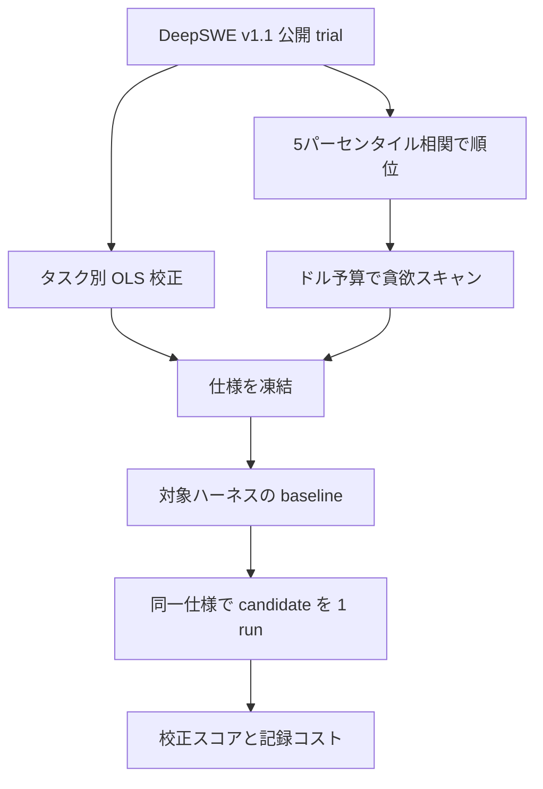

コーディングエージェントのスキルや指示を変えたとき、全ベンチを毎回回すとドルが先に尽きます。
手元の少数タスクだけでは、全ベンチの動きを追えているかも分かりません。

DeltaSelect は、既存ベンチの反復 trial から、1 回の実行でも全ベンチ得点の変動を追うタスクを選び、ドル予算内の固定集合で baseline と candidate を比較する手法です。
本稿は、その選定と校正の手続、対象ハーネスでの実測、採用判定の置き方を整理します。

対象読者は、同じコーディングエージェントのスキル・指示・ワークフローを短い周期で比較したい開発者と、その計測設計を決める発注側です。

:::message alert
本記事は 2026-09-17 投稿の arXiv preprint（[arXiv:2609.19607v1](https://arxiv.org/abs/2609.19607)、ピンは v1）を解説したものです。会議採録の一次証拠は確認していません。
:::

## DeltaSelectとは

**DeltaSelect** は、公開ベンチの反復 trial を入力に、ドル予算内の固定タスク集合で同一システムの変更を比較する計測器です。
著者は Nicholas J. Conn（Conn Castle Studios）です。
実装は [Agent Layer](https://github.com/conn-castle/agent-layer) に含まれ、製品ページは [agent-layer.dev/deltaselect](https://agent-layer.dev/deltaselect) です。

入力は DeepSWE v1.1 の公開 trial です。
113 タスク、セルあたり 4 trial です。
出力は凍結したタスク集合、校正係数、重み、価格仮定、スナップショット checksum、乱数シードです。

操作は 4 つに分かれます。

- 信頼度順位
- fail-to-pass（F2P）の校正
- ドル予算スキャン
- 対象ハーネスでの baseline

順位統計は、10,000 回 resample した 1-run Pearson 相関の 5 パーセンタイルです。
スコアはタスクごとの OLS で、F2P を公開全ベンチ尺度へ写します。
重みは残差分散の逆数です。
価格は順位を並べ替えません。
入らない高順位を飛ばし、安い下位を拾います。
生の F2P / pass-to-pass（P2P） / binary / ビルド失敗は、集約スコアの横に残します。

公開スナップショットで順位と校正を作り、実行前に仕様を凍結します。
比較は、対象ハーネスの baseline の後にだけ行います。

入力セルは 4 本の F2P を持ちます。
不完全セルは補完せず除外します。
スナップショットは 22,586 source trials、うち 22,417 usable、169 除外、18 モデル、50 構成、113 タスクです。

ケーススタディは gpt-5.6-luna low × Codex × 凍結 8 タスクで、スキル束を 13 回評価します。

## 注意点

本論文は総合ランキング用の全件ベンチを置き換えません。
同一システムの開発中 A/B 用の計測器です。

投稿は 2026-09-17 の arXiv v1 です。
査読済み会議の一次証拠はありません。

1-run で全ベンチを追えるタスクは少ないです。
5 パーセンタイル r ≥ 0.50 は 22/113（19.5%）です。
中央タスクは 0.321 です。
0.70 超は 2 タスクです。

公開 mini-swe-agent のスコアと価格は、Codex にそのまま使えません。
同一 8 タスク・同一モデルで、low は -0.54% 対 20.43%（+21.0 pp）、medium は 19.38% 対 45.50%（+26.1 pp）です。
コストは 1.5 から 3.5 倍です。

ケーススタディ 13 回の合計は $27.86 です。
採用版は初期より 58.1% 安いです（$1.75 対 $4.18、sign-flip p=0.008）。
校正スコアは 42.36% 対 36.46% ですが、転用分散の p=0.326 です。
品質向上の母集団主張にはなりません。

公開 9 タスク $113.08 で p<0.05 という数字は、全ベンチで既に 20.3 pp 差があるペアの投影です。
小さな指示変更の検出力ではありません。

セレクタは random / cheapest-first / median-correlation と未比較です。
順位・校正・公開例は同一スナップショット上の in-sample です。

校正スコアは公式 DeepSWE 得点でも要求完了率でもありません。
0-100% にクリップせず、公開 Luna low 推定は -0.54% になり得ます。

同じ 8 タスクを回し続けると、その repo / verifier に特化し得ます。
論文 §6.1 が警告しています。

Agent Layer は 2026-09-19 時点で約 10 stars です。
独立再現は、投稿 2 日後の時点では公開されていません。

自社 skill 変更ログに対する 5th-percentile 相関は未測定です。
同一ドルの random 8 タスクが、このコスト差を拾えるかも論文未実施です。
Codex 内の繰り返し分散は 1 run/task のため未推定です。
再実行差 5.59 pp は、スコア差 5.90 pp と同規模です。

OpenAI 公式（2026-07-08）は SWE-Bench Pro の約 30% を broken と見積もり、推奨を撤回しています。
論文も「少数集合は悪いタスクを増幅する」と書いています。
DeepSWE にも未解決 verifier Issue があります（[datacurve-ai/deep-swe#13](https://github.com/datacurve-ai/deep-swe/issues/13) OPEN: browser timeout。[#75](https://github.com/datacurve-ai/deep-swe/issues/75) OPEN、著者 Conn: 未指定 display name 依存の採点）。
選定 8 件への混入は未確認です。

数値は v1 HTML 本文から直接読みます。

## 1回実行で全ベンチを追えるタスクはどれか

DeepSWE はタスクを 4 回実行し、公開スコアは pass/fail に落とします。
verifier 記録には F2P と P2P が残ります。
同じ 10,000 resample では、5 パーセンタイル r ≥ 0.50 のタスク数は F2P 22、全テスト 15、binary 11、P2P 0 です。
0.50 は記述用カットであり、選択規則ではありません。
選択は全順位を予算で切ります。

Luna low 公開予算 $0.65 のスキャン例では rank 1 から 7 が入ります。
残り $0.056 では rank 8 から 24 が入らず、rank 25 `bandit-interprocedural-taint-checks` が次に入ります。
8 タスクは順位順に次です。

1. koota-composite-trait-aspects
2. wasmi-trap-coredumps
3. koota-pair-relation-tracking
4. go-git-worktree-merge-conflicts
5. testem-bail-on-test-failure
6. scriggo-method-declarations
7. expr-try-catch-errors
8. bandit-interprocedural-taint-checks

8 件中 2 件（rank 1 と rank 3）が同一 koota リポジトリ由来です。
校正は関連タスクの依存を消しません。

公開データでの検出力投影（Claude Opus 5 medium 対 Gemini 3.6 Flash high）は次です。

| 設計 | コスト | 備考 |
|---|---|---|
| 898 scored trials（4-run 相当） | $3,063.63 | 全ベンチ差 20.3 pp |
| 9 タスク prefix、1-run 投影 | $113.08 | projected p=0.0473、27.1 倍安い |
| 109 完全セル、1-run | $740.58 | projected p=0.00378 |

節約は「少数タスク + F2P + 1 run」の同時変更です。
成分分解はありません。

## 公開スコアは対象ハーネスへ転用できるか

ケーススタディは Agent Layer の Codex ハーネスで、gpt-5.6-luna を low / medium / high で同じ 8 タスクに通します。
Codex は原則 1 run/task です。
high は checksum 管理前で記述のみです。

| 推論 | 公開校正 | Codex | 公開コスト | Codex コスト |
|---|---|---|---|---|
| low | -0.54% | 20.43% | $0.13 | $0.32 |
| medium | 19.38% | 45.50% | $0.38 | $1.34 |
| high | 53.34% | 56.33% | $2.04 | $3.00 |

Codex Luna low の無変更再実行は 20.43% から 14.84% へ動きます。
Luna high の 6-task パイロットは 6 件中 5 件が F2P 96.7-100%、1 件が 0% です。
改善余地が無いセルが混ざります。
ヘッドルームは校正スコアではなく raw F2P で読みます。

論文が引用する Terminal-Bench 2.1 では、モデルと reasoning を固定したハーネス変更が GPT-5.5 xhigh を 5.1 pp、Opus 4.7 max を 2.8 pp 動かします。
この数値は DeltaSelect が Terminal-Bench 2026b を引用したものです。
リーダーボード一次は本稿では再取得していません。

## スキル束の13回評価で何が観測されたか

固定条件は gpt-5.6-luna low、Codex、8 タスク、校正、重みです。
10 構成、13 完了評価です。
3 構成は 2 回です。
価格は 2026-08-16 の Luna レートに正規化しています（uncached input $0.20 / 1M、cached input $0.02、output $1.20。cache-write $0.25 は論文が OpenAI 2026a として引用。公式 2026-07-30 発表は input $0.20 / output $1.20 を確認）。
272,000 input 超は input 2x、output 1.5x です。

| 評価 | 校正スコア | 8 タスクコスト | raw F2P | モデル呼び出し |
|---|---|---|---|---|
| 裸 Codex Luna low | 20.43% | $0.32 | - | - |
| 初期スキル | 36.46% | $4.18 | 251/411 | 55 |
| 採用（評価 13） | 42.36% | $1.75 | 265/411 | 37 |
| 裸 Luna medium | 45.50% | $1.34 | - | - |

初期スキルは裸 low よりスコアが高いですが、コストは約 13 倍です。
採用対初期では、コスト -$2.43（-58.1%）、全 8 タスクで安いです。
p=0.0078125 を p=0.008 と報告しています。
スコアは +5.90 pp です。
SE 0.05902（= 5.90 pp）、df 29.23、p=0.326 です。
分散は公開 Luna medium（mini-swe-agent）からの転用です。

同一構成の再実行は 0.7 から 4.3 校正点動きます。
評価 2 は 43.72% で採用点より高いです。
評価 4 は 29.71% です。
単調改善ではありません。

評価 8 で Scriggo が 0 から 46/48 checks になりました。
集約は改善しません。
見えるテスト合格は verifier 合格と一致しません。

評価 13 は plan-review / code-review のスコープチェックを追加しています。
因果は 1 run では確立できません。
既知の範囲逸脱を直し、コスト回帰が無く、採用した、と論文は書いています。

## Agent Layerでの実行手順

Agent Layer v0.18.4 以降が、論文ツールの実行下限です。
CHANGELOG では schema v3 が 1 反復研究に `published_proxy` 分散を付けます。

運用フロー（`docs/BENCHMARK.md`）は次です。

1. DeltaSelect ツールから `selection.json` を export する
2. `al benchmark init selection.json --directory benchmark-study`
3. `al benchmark run ... --dry-run`（推論なし）
4. `al benchmark run ...`（不足セルだけ有料実行。完了セルは不変）

必要物は Git、Docker、`uvx`、プロバイダ CLI 認証です。
DeepSWE コンテナは linux/amd64 です。
プロバイダ cell は既定直列です。
公式 init の Agent Layer 実験は plan-reviewer / implementer / code-reviewer の dispatch 役割を必須にします。
単一エージェント実装は workflow-noncompliant です。

GitHub（2026-09-19）では MIT、非 archived、default `main` の最新 commit は 2026-09-18 です。
DeltaSelect 専用の公開 Issue は見つかりません。
verifier 復旧・認証・readiness の修正 PR はあります。

## 既存の部分集合評価との違い

| 手法 | 保つもの | DeltaSelect との差 |
|---|---|---|
| tinyBenchmarks（ICML 2024） | 全ベンチ得点の推定 | IRT。反復実行のドル予算と対象ハーネス baseline は無い |
| SubLIME（ACL 2025） | 多モデルの順位 | 1-20% 部分集合。同一システムの 1-run A/B ではない |
| BenTo（ICLR 2025） | 評価品質 | タスク冗長性を facility location で扱う。貪欲スキャンは冗長を許す |
| Yauney et al.（ICLR 2026、[arXiv:2510.08730v2](https://arxiv.org/abs/2510.08730)） | マイクロベンチの順位信頼性 | 10 例では MMLU-Pro の 3.5 pt、BBH の 4 pt を一貫して順位付けできない。近い性能ではしばしば 250 例。その規模では random が競争的。分類ベンチ |

Kapoor et al. 2025 はスコアとコストを同時に見る必要性を先に論じています。
DeltaSelect はその測定費用側を扱います。

## 輸入すべき手続と落ちる主張

輸入すべきなのは DeepSWE の 8 タスクそのものではありません。
凍結仕様、対象ハーネス baseline、スコアと記録コストの並記、1-run ノイズの明示、という手続です。

支持する一次は次です。

- 大多数のタスクは 1 run では全ベンチの弱い代理である（19.5% だけが保守統計で r≥0.50）
- F2P は binary より 1-run 信号を残す
- 同じ Codex 上で、スキル束のコストは 8/8 タスクで下がった
- 公式ページも「小集合は全ベンチと等価ではない」と書く
- 実装と CLI は論文と対応する（v0.18.4+、不変 cell、checksum）

落ちる広い主張は次です。

- 品質向上は p=0.326。裸 Luna medium の方が採用スキルより高スコア・低コスト
- 公開予算は対象ハーネスで使えない
- セレクタ ablation 無し。in-sample の大きな差の投影を、小さな指示変更に外挿できない
- 固定集合の反復は特化を招きうる。hold-out が無い
- 独立再現は投稿直後の時点では見つからない

狭い主張は残ります。
広い主張（少数タスクが能力証明になる、58.1% は品質改善、公開 8 タスクをコピーすれば自社ハーネスを管理できる）は落ちます。

これらは導入を止めません。
コピー導入と、スコア差を品質 KPI にすることを止めます。

## 実務で使うときの判断基準

手続を輸入し、公開 8 タスクは輸入しません。

比較の前に、使うハーネス・モデル・reasoning で baseline を 1 回取ります。
公開価格で予算を確定しません。

採用判定は次の組にします。

- 既知欠陥の修正
- 記録コスト
- raw F2P の大きな退行が無い

校正スコアの p<0.05 を毎回要求しません。
論文もそう書いています。

対照に「reasoning を 1 段上げる」を置きます。
このケースでは Luna medium がスキル最適化より Pareto 優位でした。

過学習回避の更新規則を先に決めます。
例は次です。

- N 回ごとに hold-out 1 タスクを入れ替える
- 同一 repo を 2 件以上固定しない
- verifier 変更で集合を再凍結する

集約スコアだけを残しません。
F2P / P2P / binary / 失敗理由 / トークン内訳を残します。

逆転条件は、対象ハーネスの 1-run 分散が介入効果より大きい、または hold-out で特化が観測されたときです。
そのときは集合を捨てて再凍結します。

## まとめ

DeltaSelect は、公開ベンチの 1-run 代理タスクをドル予算で切り、同一コーディングエージェントの変更を短い周期で比較する手続です。
輸入するのは凍結仕様と対象ハーネス baseline であり、公開 8 タスクそのものではありません。

1-run で全ベンチを追えるタスクは 113 件中の少数です。
公開スコアと価格は Codex へ転用できません。
ケーススタディのコスト低下は 8/8 タスクで観測されましたが、校正スコアの品質向上は p=0.326 です。
裸の reasoning 一段上げが Pareto 優位でした。

採用判定は既知欠陥の修正、記録コスト、raw F2P の退行監視の組に置き、スコア差を品質 KPI にしない方が安全です。

この記事が少しでも参考になった、あるいは改善点などがあれば、ぜひリアクションやコメント、SNSでのシェアをいただけると励みになります！

## 参考リンク

- Conn, N. J. (2026). DeltaSelect: Affordable A/B Testing for Coding Agents. arXiv:2609.19607v1. https://arxiv.org/abs/2609.19607
- Huang, W., Lee, C., Tng, L., & Ge, S. (2026). DeepSWE. arXiv:2607.07946. https://arxiv.org/abs/2607.07946
- Conn, N. J. (2026). Agent Layer. https://github.com/conn-castle/agent-layer
- DeltaSelect 製品ページ. https://agent-layer.dev/deltaselect
- OpenAI (2026-07-30). Advancing the price-performance frontier with GPT-5.6. https://openai.com/index/advancing-the-price-performance-frontier-with-gpt-5-6/
- OpenAI (2026-07-08). Separating signal from noise in coding evaluations. https://openai.com/index/separating-signal-from-noise-coding-evaluations/
- Saranathan et al. (2025). SubLIME. ACL 2025. https://aclanthology.org/2025.acl-long.1477/
- Maia Polo et al. (2024). tinyBenchmarks. arXiv:2402.14992. https://arxiv.org/abs/2402.14992
- Zhao et al. (2024). BenTo. arXiv:2410.13804. https://arxiv.org/abs/2410.13804
- Yauney, G., Warraich, S. S., & Swayamdipta, S. (2026). How Reliable is Language Model Micro-Benchmarking? arXiv:2510.08730v2. https://arxiv.org/abs/2510.08730
- datacurve-ai/deep-swe#13. https://github.com/datacurve-ai/deep-swe/issues/13
- datacurve-ai/deep-swe#75. https://github.com/datacurve-ai/deep-swe/issues/75
