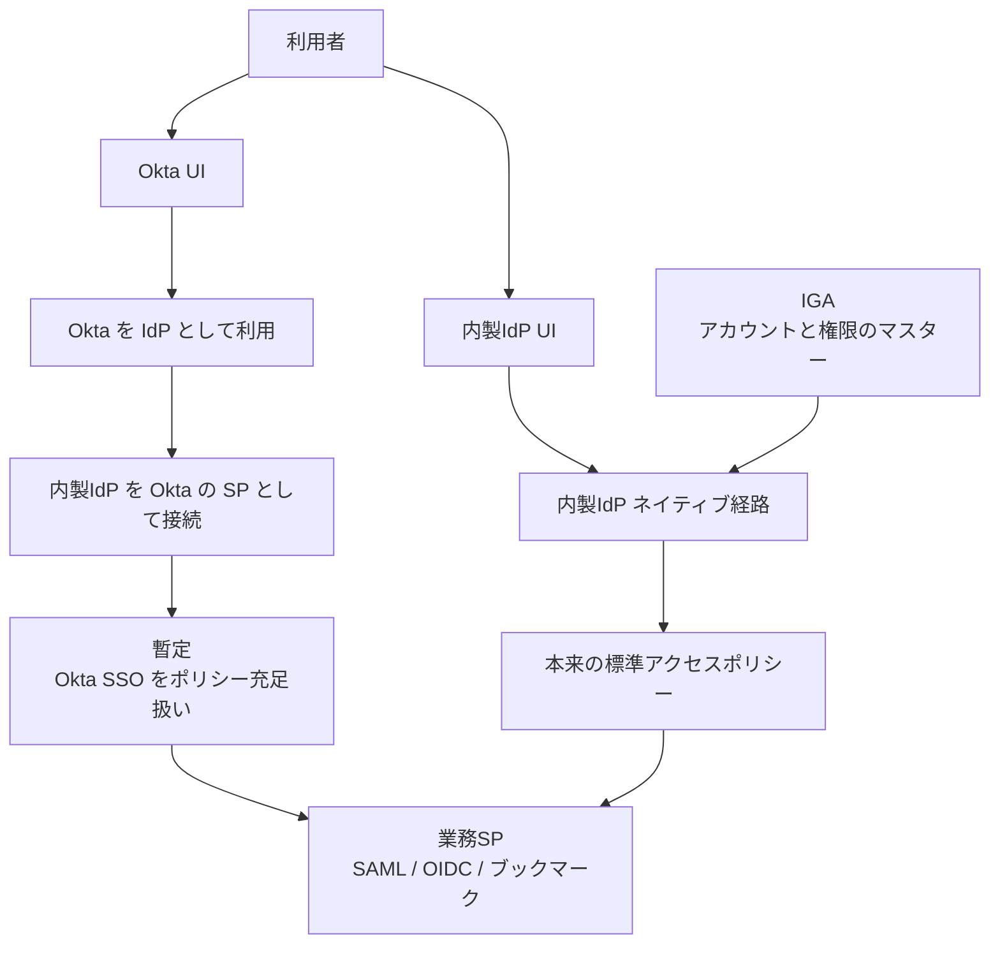

DeNA が 2012 年から使ってきた Okta を内製 IdP へ移した連載の第3回が公開されました。350 以上の SP(サービスプロバイダ)の接続切替そのものは、当事者の言葉で「大きな混乱なく完了」しています。それでも、ユーザー画面を内製 IdP に切り替えた直後に問い合わせが増えました。

この記事では、IdP 移行における「どこまでやったら移行完了と呼べるのか」を扱います。読み終えると、次の3つが持ち帰れます。

- 並行稼働(旧 IdP の画面を残したまま新 IdP へ繋ぎ替える形)が、何を隠すのか
- 画面公開の go/no-go に置くべきゲートと、置いてはいけないゲートの区別
- 公開前に実行する合成ログインテストの最小セット

対象読者は、SSO 基盤・IdP の移行を計画している情報システム部門や、認証基盤を運用しているエンジニアです。

*この記事の全体像。以下、順に解説します。*

## 並行稼働はどういう形だったのか

移行中の構成は、ユーザーが触る画面を Okta に固定したまま、内製 IdP を Okta に対する SP として繋ぐ、いわゆる IdP chaining です。SAML の RelayState で本来の SP 要求を保持し、認証後に元のアプリへ戻します。アプリごとの切替は「ほんの数分」を除いてダウンタイムなしで進み、SAML 約 300 / OIDC 約 30 / ブックマーク・SWA 約 30 の規模を、およそ9か月で接続し終えています。

ここに、移行を安全にするための暫定措置がひとつ入っていました。**Okta から内製 IdP へ SSO してきたという事実を、内製 IdP 側のアクセスポリシーの条件充足とみなす**というものです。内製 IdP の標準アクセスポリシーは、たとえば「社内ネットワークからなら追加認証なし、社外からなら MFA」という形で定義されていますが、Okta 経由で入ってくる限り、この評価は実質的にスキップされます。

つまり並行稼働の期間中、**認証の評価点は旧 IdP 側に残ったまま**でした。画面公開とは、この評価点を内製 IdP へ移す操作です。

公開前に切るスイッチは、独立した2つです。

| スイッチ | 並行稼働中 | 公開後 |
|---|---|---|
| ユーザーが使う画面 | Okta | 内製 IdP |
| ポリシーバイパス | Okta SSO を充足扱い | 内製ポリシーのみで評価 |

多くの移行計画は、1行目だけをカットオーバーの対象として扱います。しかし実際に利用者の体験を変えるのは2行目です。**「全 SP が新 IdP を指している」は、この2行目について何も保証しません。**

## 並行稼働が隠す4つの層

画面公開の前後で何が変わるのかを、層に分けて並べると差分が見えます。

| 層 | 並行稼働中に見えるもの | 画面公開後に見えるもの |
|---|---|---|
| UX / 認証器 | Okta のログイン画面と、Okta に登録済みの MFA | 内製 IdP のログインと OTP / Passkey。**Okta 登録済みは内製登録済みを意味しない** |
| ポリシー評価点 | Okta のポリシー + 「Okta SSO なら充足」 | 内製 IdP のネットワーク条件や個人情報取り扱い区分に基づく標準パターン |
| プロトコル | SP → 内製 → Okta → 内製 → SP(RelayState の連鎖) | SP → 内製 |
| 失敗モード | 利用者は Okta のエラーを見る。内製側の 5xx は運用通知に出る | 利用者が内製 IdP の MFA チャレンジと fail-closed を直接見る |

第3回で報告されている公開後の問い合わせは、主に上の2層です。ひとつは MFA 未登録(事前に周知していても発生する)、もうひとつは「安全だと思っていた経路からも MFA を求められた」という戸惑いです。接続層、すなわち SP との SAML/OIDC 接続の失敗としては書かれていません。**接続は完成していて、利用者状態と認可状態が未収束だった**という構図です。

同じ型の失敗は、端末側のレーンでも起きています。Jamf Connect を内製 IdP へ向けた既存 Mac 約 2,100 台の移行では、Mac のログイン自体は成功するのに、メニューバーの接続が ROPC の指定漏れで 403 になる事象があり、フラグ消失による Okta への切り戻しや、約 500 台の個別追い込みが発生しました。**表の経路が通ることは、裏の経路が完成していることを意味しません。**

## 完了条件をどう置き直すか

「移行完了」を判定するゲートの候補を並べ、公開前に置くべきものと、公開後の指標にすべきものを分けます。

| ゲート | 位置づけ | 理由 |
|---|---|---|
| 全 SP の接続完了 | **必要。ただし十分ではない** | 接続が終わっていても評価点は旧 IdP に残り得る |
| 暫定ポリシー(フェデレーション MFA 受理)の撤去 | **公開 go/no-go に含める** | これを切った状態が公開後の実体。切らずに検証しても差分は出ない |
| ポリシー対象者の内製 MFA 登録カバレッジ | **公開前ゲート。ただし対象クラス限定** | 社外・モバイル対象など、実際に MFA が発火するクラスだけを分母にする |
| 全社員の MFA 登録率 100% | **ゲートにしない** | 「社内は追加認証なし」設計と原理的に衝突する。社内利用者の登録は遅れて当然 |
| 問い合わせ量 | **公開後の SLO** | 公開しないと観測できない。公開前 go/no-go には使えない |
| 標準ポリシー別の影響範囲表 | 公開前に必須 | ただし表があるだけでは問い合わせは消えない |
| ネイティブ経路の合成ログイン | **公開前に実施する** | 公開後に初めて差分が出た事実そのものが根拠 |

同型の仕組みは他の製品にもあります。Microsoft Entra ID の domain federation 設定には `federatedIdpMfaBehavior` があり、既定は `acceptIfMfaDoneByFederatedIdp`、つまり「フェデレーション元の IdP が MFA を済ませていれば受理する」です。最終切替では `rejectMfaByFederatedIdp` などへ変更しますが、反映に最大 24 時間かかります。**暫定的な受理設定は、期限と所有者を付けないと常設化し、評価点が旧 IdP に残り続けます。**

また Microsoft は、MFA 登録データの同期グループと Staged Rollout のグループを分けて扱うことを求めています。NPS 拡張のように、未登録のまま経路だけ切り替えると MFA が失敗し得る構成もあります。移行では「経路の切替」と「利用者状態の移送」を別の作業として管理する、というのが共通する考え方です。

## 公開前に回す合成ログインテスト

検証の要点は、**バイパスを OFF にした状態で、内製 IdP のネイティブ画面から入る**ことです。バイパス ON のまま何度ログインしても、公開後に起きることは再現できません。

ポリシークラス、利用者の所在、内製 MFA の登録状態を掛け合わせ、最小の閉包を作ります。

| ID | 所在 | 適用ポリシー | 内製 MFA | 期待する結果 | 隠れていた差分 |
|---|---|---|---|---|---|
| T03 | 社内 | 社内のみ(追加認証なし) | 未登録 | そのまま SSO | 差分は小さい |
| T06 | 社外 | 社外あり(MFA) | 未登録 | 登録導線か拒否。アプリに到達しない | **問い合わせの本体** |
| T08 | 社外 | 社外あり | OTP 登録済み | MFA 後に SSO | Okta 登録済みを内製登録済みと誤認しない |
| T11 | モバイル | 社外あり | 未登録 | 登録または MFA | モバイル経路は名指しで課題に挙がっている |
| T12 | 社内 | 社外ありのアプリ | 未登録 | MFA または登録 | 「安全経路からも MFA」の正体 |
| T13 | 社外 | 社内限定 | 任意 | 拒否 | バイパス中はネットワーク制限が未評価になり得る |
| T14 | 任意 | 任意 | 秘密の質問のみ | 拒否。UI に出さない | 秘密の質問は廃止方針 |

このうち T06 / T08 / T12 は必須です。3つとも「Okta 側では通っていたのに内製側では止まる」ケースだからです。

さらに、単発のログインだけでなく、セッションをまたぐ動きも確認します。

1. **第一因子ログイン** — 内製画面から入り、Okta へ 302 リダイレクトしないこと
2. **MFA ギャップ** — 集団を A(内製未登録)、B(Okta のみ登録)、C(内製 OTP 登録済み)に分け、**B を「登録済み」に数えない**こと
3. **ネットワーク移動** — 社内で確立したセッションを社外へ持ち出し、ポリシーが再評価されること
4. **Step-up** — 低保証アプリのセッションから高保証アプリへ遷移したときに追加認証が入ること
5. **OIDC refresh** — 社内で取得した refresh token を社外で使ったときの扱い
6. **fail-closed** — 内製 IdP の 5xx、属性同期失敗、RelayState 改ざん時に、不完全な Assertion を SP へ返さないこと

### 秘密の質問を残さない

T14 は補足が必要です。秘密の質問(KBA)は、NIST SP 800-63B-4 で MFA の推奨から外れたことを理由に廃止されています。実際、800-63B-4 が許可するオーセンティケータの一覧に秘密の質問はありません。なお「パスワード選択時に KBA プロンプトを出してはならない(SHALL NOT)」という条項は §3.1.1.2 にある別の規定で、廃止の直接の根拠とは分けて理解しておくと混乱しません。

### RelayState を素直に使わない

IdP chaining は RelayState の連鎖で成り立つので、実装制約を押さえておく必要があります。OASIS SAML 2.0 Bindings では次のように定められています。

- 受信した RelayState を、**そのままの値で**応答へ返す(§3.1.1、MUST)
- HTTP Redirect / POST / Artifact のいずれのバインディングでも、値は **80 バイトを超えてはならない**(§3.4.3 / §3.5.3 / §3.6.3.1)

長い遷移先 URL をそのまま RelayState に積む実装は、この 80 バイト制約に触れます。**不透明なトークンだけを載せ、実体はサーバ側のストアに置く**のが安全です。

## 分母と分子を間違えない

MFA 登録カバレッジをゲートにするとき、いちばん壊れやすいのは母集団の定義です。

- **分母** — IGA(アカウントと権限のマスター)上で、「そのポリシークラスの対象アプリを権限として持つ利用者」
- **分子** — **内製 IdP に登録済みの認証器を持つ利用者**

旧 IdP のディレクトリ全体を分母にしたり、旧 IdP の MFA 登録済みフラグを分子に使ったりすると、数字は綺麗に見えて実態は追えません。実運用では、「旧 IdP で MFA 登録済み ∧ 内製 IdP で未登録」の差集合を毎日出すのが、いちばん直接的なバックフィル対象リストになります。

問い合わせ量については、公開前ではなく公開後の指標として設計します。公開週をハイパーケア期間として切り出し、問い合わせに事前定義のタグ(MFA 未登録 / 安全経路への MFA / 画面変更の戸惑い、など)を付けておくと、原因の切り分けが後から可能になります。年始や月曜朝といった季節要因は交絡として扱い、主因をポリシー差分だけに固定しないほうが安全です。

## この判断が効かない場合

ここまでのゲートは、条件によっては過剰です。次のいずれかに当てはまるなら、縮小して構いません。

- **認証器ストアとポリシー評価点が新旧で同一** — 単なるホスト名の切替に近く、利用者状態の移送が発生しない
- **全アプリが社内ネットワーク専用で MFA 要求がない** — 登録カバレッジのゲートは意味を持たない
- **公開対象が少人数のカナリアのみ** — カバレッジ 100% はカナリア集団に限定し、全社は波で上げる

逆に、注意しておきたい点もあります。並行稼働そのものは欠陥ではありません。Okta 自身も IdP の coexistence / chaining を可用性のオプションとして説明していますし、今回の並行も混乱回避が目的でした。**問題は並行の採用ではなく、並行を「検証完了」と読み替えることです。**

また、内製 IdP という選択肢自体の是非は、この完了条件の議論とは切り離すべきです。連載の第1回は、技術力と品質管理の前提があることを明示したうえで内製を選んでいます。その前提を満たさない組織へ、結論だけを転用することはできません。

なお、公開後の実測値である問い合わせ件数、MFA 未登録率、経路別の失敗率は公開されていません。数値が無いことは「ゲートを置くかどうか」の判断を止めませんが、**閾値を何パーセント・何件にするかは、自組織のサポート容量から決める**必要があります。

## 移行後に効いた運用の工夫

完了条件から少し離れますが、移行後の運用改善として次のような取り組みが報告されています。

- **SP 追加申請の窓口を Gemini の Gem 化** — 定型の申請対応を自動化する
- **CloudWatch Logs Insights のクエリ生成** — 3つの質問に答える形でクエリを組み立てる。AWS の Query Assist は plain English / natural language と説明されており、日本語を拒否するという規定は公式には見当たりませんが、実運用では英語指示が必要だったと報告されています
- **資産管理ステータスと連動したアカウント無効化**、私物 PC からのアクセス制限、OTP のセットアップキー提供

いずれも、認証基盤を内製したことで「自分たちの都合に合わせて運用を寄せられる」ようになった結果です。ただし移行の go/no-go には関与しないので、順序としては従に置くのが妥当です。

## まとめ

- 350 超の SP を9か月で接続し終えても、それは移行完了の**必要条件**にすぎない
- 並行稼働は、旧 IdP 側に**認証の評価点**を残す。画面公開はその評価点を移す操作であり、差分は公開するまで見えない
- 公開 go/no-go は3点で閉じる。全 SP の接続完了、**バイパス OFF × ネイティブ画面での合成ログイン**(T06 / T08 / T12 は必須)、**ポリシー対象者の内製 MFA 登録カバレッジ**
- 全社員の MFA 登録率 100% と、公開前の問い合わせ量はゲートにしない。前者は「社内は追加認証なし」設計と衝突し、後者は公開しないと観測できない
- 暫定的なフェデレーション MFA 受理には**期限と所有者**を付ける。常設にすると評価点が旧 IdP に残り続ける
- カバレッジの分母は IGA 上の対象クラス利用者、分子は内製 IdP の登録済み認証器。旧 IdP の登録状態を分子に流用しない

移行プロジェクトの完了定義を「接続の完了」から「利用者状態と認可状態の収束」へ広げること。これが、この事例から取り出せるいちばん再利用しやすい教訓です。

この記事が少しでも参考になった、あるいは改善点などがあれば、ぜひリアクションやコメント、SNSでのシェアをいただけると励みになります！

## 参考リンク

DeNA Engineering Blog:

- [Oktaから内製IdPへの認証基盤移行(第1回)](https://engineering.dena.com/blog/2025/09/idp-migration-part1/)
- [Oktaから内製IdPへの認証基盤移行(第2回)](https://engineering.dena.com/blog/2026/01/idp-migration-part2/)
- [Oktaから内製IdPへの認証基盤移行(第3回)](https://engineering.dena.com/blog/2026/08/idp-migration-part3/)
- [IGA プロダクト HERB の紹介](https://engineering.dena.com/blog/2025/09/its-dev-herb/)
- [Jamf Connect と内製 IdP の連携](https://engineering.dena.com/blog/2026/03/jamfconnect-migration-inhouse-idp/)

仕様・公式ドキュメント:

- [NIST SP 800-63B-4 Digital Identity Guidelines](https://pages.nist.gov/800-63-4/sp800-63b.html)
- [OASIS SAML 2.0 Bindings](http://docs.oasis-open.org/security/saml/v2.0/saml-bindings-2.0-os.pdf)
- [OASIS SAML 2.0 Technical Overview](https://docs.oasis-open.org/security/saml/Post2.0/sstc-saml-tech-overview-2.0.html)
- [Okta Developer: SAML](https://developer.okta.com/docs/concepts/saml/)
- [Okta: Plan your user migration to Okta](https://developer.okta.com/docs/guides/migrate-to-okta-plan/main/)
- [Microsoft Entra: MFA deployment](https://learn.microsoft.com/en-us/entra/identity/authentication/howto-mfa-getstarted)
- [Microsoft Entra: Staged Rollout](https://learn.microsoft.com/en-us/entra/identity/hybrid/connect/how-to-connect-staged-rollout)
- [Microsoft Graph: internalDomainFederation (federatedIdpMfaBehavior)](https://learn.microsoft.com/en-us/graph/api/resources/internaldomainfederation)
- [Amazon CloudWatch Logs Insights Query Assist](https://docs.aws.amazon.com/AmazonCloudWatch/latest/logs/CloudWatchLogs-Insights-Query-Assist.html)

関連する移行パターン:

- [Cisco Duo: backup / split IdP](https://duo.com/blog/idp-failover-backup)
