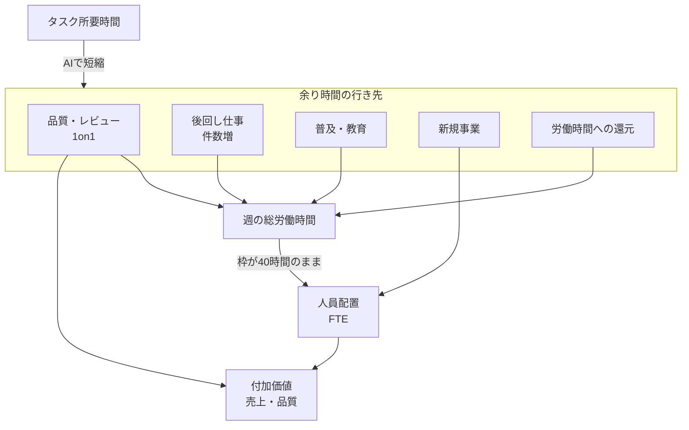

2025年2月、DeNA の南場智子会長は「AIオールイン」を宣言しました。
現業を「大体3000人」で回しているとし、半分の人員で現業を成長させ、残り半分を新規事業へ回す、と述べました。
2026年9月18日、ITmedia NEWS は、特定業務の工数削減と新規事業への人員移動が同時には進まない構造を報じました。
この記事では、南場・金子の公式談話、有価証券報告書の人員、パーソル総合研究所と PwC Japan の調査を、公開された一次の範囲で整理します。
読み終わると、タスク所要時間、総労働時間、人員配置、付加価値を混ぜずに測る判断ができます。

:::message
南場・金子の数値は講演・取材の自己申告です。パーソルと PwC は質問票調査です。はてな匿名ダイアリーは会社名のない逸話です。
:::

*この記事の全体像。以下、順に解説します。*

## AIオールイン後の人員再配分とは

人員再配分は、現業の運営人数を減らし、空いた枠を新規事業へ移す目標です。
対象は、現業と新規のあいだの配置です。

2026年3月6日の AI Day で南場は、特定業務の到達を次のように述べました。

- リーガルチェック 90%
- Pococha 配信審査 60%
- QA 工数半減
- 一部の開発プロジェクトでは人 5%・AI 95%（20倍）

同じ講演で南場は、空いた時間に社員が「やりたくてもできていなかったこと」を自ら詰め込み、新規事業への人材シフトは「思ったほどまだできていない」と認めました。
ITmedia NEWS は、この談話を、はてな匿名ダイアリーの「8時間で2件」体験と、パーソル総合研究所・PwC Japan の調査と並べました。
タスクが速くなっても、労働時間の短縮や配置転換に直結しない、という関係です。

観測できる対象は4層です。

1. タスク所要時間
2. 週の総労働時間
3. 人員配置（FTE）
4. 付加価値（売上・品質）

第1層が動いても、第2〜4層は自動では動きません。
余り時間の行き先として、南場は既存で後回しにしていた仕事を挙げます。
金子俊一（グループエグゼクティブ IT本部本部長）は、資料精度、コード量、レビュー、1on1 の頻度を挙げます。

経営側の処方は2つが併記されます。
南場は「バサッと先に動かす」と述べます。
金子は公募と1か月スポットによる「滑らかな異動」を述べます。

パーソルの調査では、生成AIを使ったタスクの所要時間が平均 16.7%（26.4分/週）減る一方、業務時間そのものが減った利用者は 25.4% です。
PwC 2026春では、活用中・推進中の日本回答者の 50% が還元先に「従業員の雇用時間への還元（成果ベースでの時短勤務奨励等）」を選びます（複数回答）。
有報上の連結従業員は、2025-03-31 の 2,572名から 2026-03-31 の 2,483名へ減っています。
新規事業・その他は 63名（臨時 28名）です。

4層と余り時間の行き先は、次の関係です。

実線の「タスク短縮 → 余り時間」は、講演と調査で確認できます。
余りが新規事業の FTE や所定時間の短縮になる経路は、経営が行き先を決めたときにだけ開きます。

## 注意点

次の言い換えは、一次の範囲と一致しません。

| 言い換え | 一次の範囲 |
|---|---|
| DeNA 全社の工数が最大 9割減った | 南場は「リーガルチェックでは90%効率改善」「特定の業務」と限定する。連結人員は約 3.5% 減（2,572→2,483） |
| 3000人の半分＝1500人が新規へ移る人員削減 | 「半分の人員で現業を**成長**させ」、残りは 10人1組の新規。レイオフ目標ではない。連結は約 2,500人で、3000 は「大体」 |
| パーソル 16.7% は週40時間の短縮 | 活用タスクの未利用時 157.8分/週 → 利用時 131.4分/週。報告書は週40時間換算で約 1.1% と対置する |
| 浮いた時間の 61.2% が全利用者で仕事に戻る | 母数は業務時間が減った人 n=381。日常業務 75.4% の母数は、そのうち仕事に回すと答えた n=342（複数回答） |
| PwC 50% は勤怠上の時短が実現した割合 | 活用中・推進中 n=814 の複数回答。「成果ベースでの時短勤務奨励等」を含む意図。ITmedia も実現値ではないと注記する |
| はてなの投稿者は DeNA 社員である | 匿名。会社名なし。ITmedia 自身「作り話ではないかという反発で反応は割れた」と書く |
| 教育負担は「ボランティア」と報告書が呼ぶ | ITmedia の田村氏発言。パーソル PDF 本文に語「ボランティア」は無い。報告書は正式業務・評価に位置付けられていない、と書く |
| 新規事業が人を動かさないと存在しない | 住吉政一郎インタビューでは開発中 10本・企画含め 20本、チーム 40〜50人（二次情報: Tech Team Journal 2025-12-10）。有報の新規区分売上は前年比 30.4% 減だが、モバオク売却を含む区分であり AI 新規単体の指標ではない |

「9割削減なのに人が浮かない」は、タスク層の最大値と人員層の未達を1つの見出しに束ねたレトリックです。
両方とも南場の口から出ていますが、分母が違います。

分母が講演に無いものもあります。

- 南場の 90% / 60% / 20倍の対象件数、前後期間、人件費換算の有無
- 「大体3000人」と連結 2,483＋臨時 481 の対応（推定にとどまる）
- スマートシティ組み替え後の、新規区分人員の前年比較可能な時系列（本記事が確認したのは第28期の期末スナップショット）
- 金子取材の日付。3月講演との時間差で施策が進んでいる可能性がある（BAKERU 設立 2026-08-17・発表 09-02、CSP 2026-09）
- パーソルの「週40時間換算 1.1%」は平均値の割り算であり、減った 25.4% の内部の短縮幅は表に無い
- PwC の時間還元は意図であり、勤怠短縮の実測ではない

配置転換の「未達」判断は南場談話で足ります。
未達の規模（何人足りないか）は一次が無く、1500人との差を数値で主張してはいけません。

## DeNAが公式に述べたこと

2025年2月、南場は現業「大体3000人」、半分で成長、半分で新規、10人1組、と述べました（ITmedia AI+ 講演全文、フルスイング書き起こし）。
2026年3月6日には、特定業務の 90% / 60% / QA半減 / 一部 20倍を挙げ、シフトは「思ったほどまだできていない」と述べました。
余りは自ら詰め込む、とも述べます。
人は「浮いてきました」と言わないので先に動かす、と処方します。
マネジャー評価に「人材の輩出」を入れる方向、とも述べます（フルスイング書き起こし）。

金子は ITmedia の取材で、余りは品質・量・レビュー・1on1 に流れた、と観察します。
「決して無駄ではない」と限定します。
解雇しなければ人件費は減らない、とも述べます。
公募とスポットで異動の摩擦を外す、が実務解です。
半分目標は「エイヤ」と呼びます。

有価証券報告書 第28期（2026-03-31）は次を書きます。

- 連結 2,483名〔臨時 481〕、単体 1,400名〔99〕
- 新規事業・その他 63名〔28〕。スマートシティはスポーツ区分へ組み替え済み
- 新規事業・その他の売上 2,493百万円（−30.4%）、セグメント損失 1,550百万円
- 当該区分に「AIに関する取り組み等」を含むと明記
- 2025-05 のモバオク全株譲渡後、同社は 2026年3月期第1四半期からセグメント別業績に含めない（Q3説明会）。売上減は AI 新規単体の成長指標ではない

南場自身が、特定業務の短縮とシフト未達を同じ講演で述べます。
金子が余り時間の品質吸収を観察し、人件費恒等式を述べます。
有報の連結人員は微減にとどまります。

## 調査が示すタスク短縮と総労働時間の差

パーソル総合研究所「生成AIとはたらき方に関する実態調査」（2026-02-03 公表。利用群 2025-10-24〜26、非利用群 2025-10-27〜28）は次です。

- SCR 就業者 n=19,855、本調査正規雇用 n=3,000（利用 1,500 / 非利用 1,500）
- 業務利用率 32.4%、ヘビー（週4日以上）11.7%（SCR）
- 活用タスク 16.7%（26.4分/週）短縮。n=1,500
- 業務時間減 25.4%（利用の正規雇用）
- 減った人の余り時間の 61.2% が仕事。仕事に回す人の 75.4% が日常業務を挙げる（複数回答）
- ヘビーは「教える頻度の増加」37.3%
- 「AI の教育サポートが正式な業務・評価に位置付けられていない」現状を報告書が書く

タスク短縮 16.7% と、週40時間換算の約 1.1% は、測る対象が違います。
前者は活用タスクの所要時間です。
後者は週の総労働時間への換算です。

PwC Japan「生成AIに関する実態調査2026 春」（日本調査 2026-02-12〜19、n=932。還元設問は活用中・推進中 n=814）は、還元先の意図を次のように並べます。

| 還元先 | 日本 | 米国 |
|---|---|---|
| 雇用時間への還元 | 50% | 65% |
| 利益還元 | 29% | 62% |
| 新規事業への登用等 | 44% | 62% |
| 特に検討していない | 14% | 1% |

財務的還元（利益または顧客価格）は、日本 40%、米国 75% です。
別指標です。
日本回答の最多は雇用時間への還元ですが、勤怠上の短縮が実現した割合ではありません。

はてな匿名ダイアリー（2026-08-03）は、「8時間で1件」が「8時間で2件」になると書きます。
共有した本人に説明・教育が集まり「迷惑なサンタクロース」になると書きます。
追記は、「『AIを使え』と言うのは無料ですが、褒賞制度や評価制度を作るのは面倒だからじゃないか」と書きます。
「会社に差し出していた好奇心を、自分の人生に戻す」とも書きます。
投稿者は匿名で、会社名はありません。

個人は「この仕事をなくす」を決められない、と田村氏が述べます（ITmedia。調査本体の設問ではない）。
教える負担がヘビーに集中し、正式業務・評価に乗っていない、とパーソルは書きます。

## 測るべき4指標

次の4つを混ぜない、が実務上の起点です。

| 指標 | 何を見るか | DeNA で一次にあるもの | 無いもの |
|---|---|---|---|
| タスク削減 | 特定ワークフローの所要時間 | 90% / 60% / 半減 / 20倍（自己申告） | 工数システムの監査値 |
| 品質・件数 | レビュー密度、1on1、バックログ消化 | 金子の観察（精度・量・レビュー・1on1）。QA は同一成果を半分工数（南場） | 全社の品質 KPI 時系列 |
| 労働時間 | 所定・残業・所定時間の短縮 | パーソル一般調査。DeNA 勤怠は非公開 | 有報に労働時間なし |
| 配置転換 | 現業 FTE → 新規 FTE | 南場「思ったほどできていない」。有報の新規 63名 | 1500人目標の進捗率 |

経営が期待したのは第4指標です。
現場が埋めたのは第2指標です。
第1指標だけを成果にすると、第4が動かない理由が見えません。

変換は「自動ではない」が「起きない」ではありません。
Klarna は人員圧縮と AI の FTE 相当を公表しました（二次情報: CNBC / Guardian）。
IBM は HR 定型を自動化し、総雇用は他職へ再投資したと CEO が述べます（二次情報: WSJ 経由）。
Shopify は増員前に AI 不能を示すゲートを置きました（二次情報: 2025-04 CEO メモ）。
パナソニック コネクトは、削減時間を総労働時間比 3.4% まで載せています（公式続報 2026-07-29）。

品質・件数への再投下は、Jevons 型の誘発需要として合理です。
金子も「決して無駄ではない」と限定します。
余り時間が品質・件数に流れ、それが単価または需要の増加として分子に載るなら、再配分せずとも付加価値は増えます。
そのときは第4指標未達を失敗と読みません。
有報の新規区分売上減はモバオク売却を含むため、この逆転条件の反証には使いません。

DeNA の AI 新規は、事業本部長インタビューでは 40〜50人で企画 20本規模が走っている、と述べます（二次情報: 2025-12）。
AI Link、Delight Ventures、BAKERU、新規インセンティブは、現業からの異動以外のレバーです。
南場の「乱暴なリーダーシップ」に対し、金子は現場解像度の低い「やめろ」指示を「筋が良くない」と否定します。
DeNA 内の実務解は公募とスポットです。
Klarna はコスト偏重の置換後に、品質を理由に人間対応を一部戻しました（二次情報: Bloomberg 2025-05）。
仕事を先にやめることが常に正しい、とは言えません。

弱めるべきは次の4点です。

1. 見出しの 9割を全社 FTE と読むこと
2. 品質再投下を失敗と決めつけること
3. 再配分以外の新規レバーを無視すること
4. 「まず仕事をやめろ」を唯一解にすること

芯は残ります。
AI が縮めるのはまずタスク時間です。
総労働時間、人員配置、付加価値は、やめ方、異動先、評価、時間枠を組織が決めない限り、自動では動きません。
測る対象を個人速度だけに置くと、「短縮したのに人が浮かない」を説明できません。

## 発注側が先に決める勘定科目

発注側・経営側が導入の前に合意する対象は、ツールではなく余り時間の勘定科目です。

1. **やめる仕事**をチーム単位で先に書く。個人に「なくせ」と委ねない（田村。金子も各論の「やめろ」は筋が悪いとする）
2. **移管先**を公募、スポット、別法人、出資のどれにするか決める。1500人一括異動だけが解ではない
3. **評価**に、教えることと人を出すことを乗せる。パーソルは教育が正式業務に無いことを問題にする。南場は「人材の輩出」をマネジャー評価へ入れる方向と述べる
4. **成果指標を4つに分ける**（タスク / 品質 / 時間 / 配置）。混ぜた瞬間に「9割なのに人が浮かない」見出しが再生産される
5. 労働時間や賃金への還元を選ぶなら、週の枠そのものを切る。UK の週4日勤務は AI 試験ではありませんが、枠を先に縮めた例です

自社で「AIで人が浮かない」を見るときは、第1指標の最大値と第4指標の未達を、同じ見出しに束ねない、が起点です。
分母を分けたうえで、余り時間の勘定科目を先に決める必要があります。

## まとめ

DeNA の南場会長は 2025年2月、現業の半分で成長し、残り半分を新規へ回す「AIオールイン」を宣言しました。
2026年3月の講演では、特定業務の 90% / 60% / QA半減 / 一部 20倍を自己申告し、同時に新規へのシフトは「思ったほどまだできていない」と認めました。
余り時間は、後回し仕事と品質・レビュー・1on1 に流れます。
パーソルは、活用タスク 16.7% 短縮と、週の総労働時間換算 約 1.1% の差を定量化します。
有報の連結人員は約 3.5% 減にとどまり、新規区分は 63名です。

タスク速度は組織能力の再配置ではありません。
品質への再投下を失敗と決めつけず、異動以外の新規レバーも無視せず、4指標を分けて測る必要があります。
発注側が先に決めるのは、余り時間の勘定科目です。

この記事が少しでも参考になった、あるいは改善点などがあれば、ぜひリアクションやコメント、SNSでのシェアをいただけると励みになります！

## 参考リンク

1. 斎藤健二, [経営「AIでラクして早く帰って」→社員「帰らない」 工数最大9割減のDeNAも悩むAI効率化の壁](https://www.itmedia.co.jp/news/article/2609/18/2000001484/), ITmedia NEWS, 2026-09-18.
2. 南場智子, [「先に動かし、事業を広げる」スピーチ全文](https://fullswing.dena.com/archives/100189/), フルスイング by DeNA, 2026-03-19（講演 2026-03-06）.
3. 吉川大貴, [「AIにオールイン」決めたDeNA南場会長 注目の経営判断、背景は【講演全文】](https://www.itmedia.co.jp/aiplus/articles/2502/13/news138.html), ITmedia AI+, 2025-02-13.
4. 株式会社ディー・エヌ・エー, [有価証券報告書 第28期（2025-04-01〜2026-03-31）](https://ssl4.eir-parts.net/doc/2432/yuho_pdf/S100YLDV/00.pdf), 2026-06-26提出.
5. パーソル総合研究所, [生成AIとはたらき方に関する実態調査](https://rc.persol-group.co.jp/thinktank/data/generative-ai/), 2026-02-03. [PDF](https://rc.persol-group.co.jp/wp-content/uploads/thinktank/data/generative-ai.pdf).
6. PwC Japanグループ, [生成AIに関する実態調査2026 春 6カ国比較](https://www.pwc.com/jp/ja/knowledge/thoughtleadership/generative-ai-survey2026.html), 2026-06-10.
7. はてな匿名ダイアリー, [AIで仕事を効率化したら、なぜか僕の仕事だけ増えた話](https://anond.hatelabo.jp/20260803162719), 2026-08-03.
8. ITmedia NEWS, [同記事 2ページ（金子取材）](https://www.itmedia.co.jp/news/article/2609/18/2000001484/2), 2026-09-18.
9. 南場智子, [AIオールイン宣言のスピーチ全文](https://fullswing.dena.com/archives/100153/), フルスイング by DeNA, 2025-02-14.
10. 金子俊一, [DeNAの「AIオールイン」](https://engineering.dena.com/blog/2025/08/ai_journey_1/), DeNA Engineering, 2025-08.
11. Tech Team Journal, [住吉政一郎インタビュー](https://ttj.paiza.jp/archives/2025/12/10/16827/), 2025-12-10.
12. CNBC, [Klarna CEO says AI helped company shrink workforce by 40 percent](https://www.cnbc.com/2025/05/14/klarna-ceo-says-ai-helped-company-shrink-workforce-by-40percent.html), 2025-05-14.
13. TechCrunch, [Shopify CEO tells teams to consider using AI before growing headcount](https://techcrunch.com/2025/04/07/shopify-ceo-tells-teams-to-consider-using-ai-before-growing-headcount/), 2025-04-07.
14. Panasonic Newsroom, [ConnectAI 2025年度の削減時間](https://news.panasonic.com/jp/press/jn260729-1), 2026-07-29.
15. ITmedia NEWS, [BAKERU設立](https://www.itmedia.co.jp/news/article/2609/02/2000001073/), 2026-09-02.
