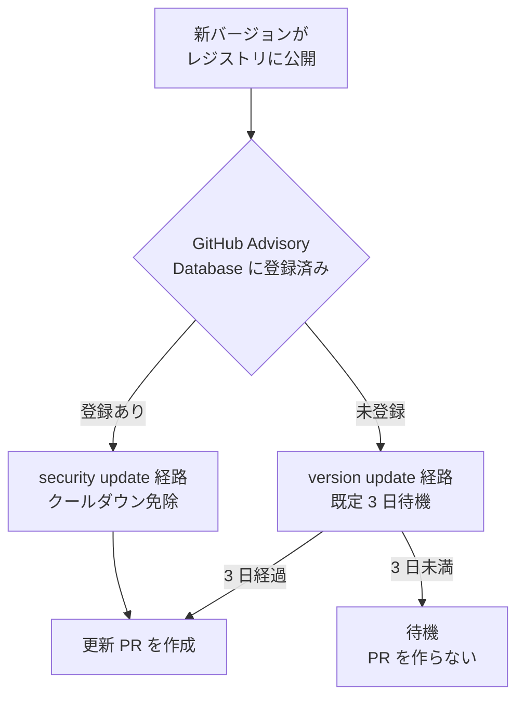
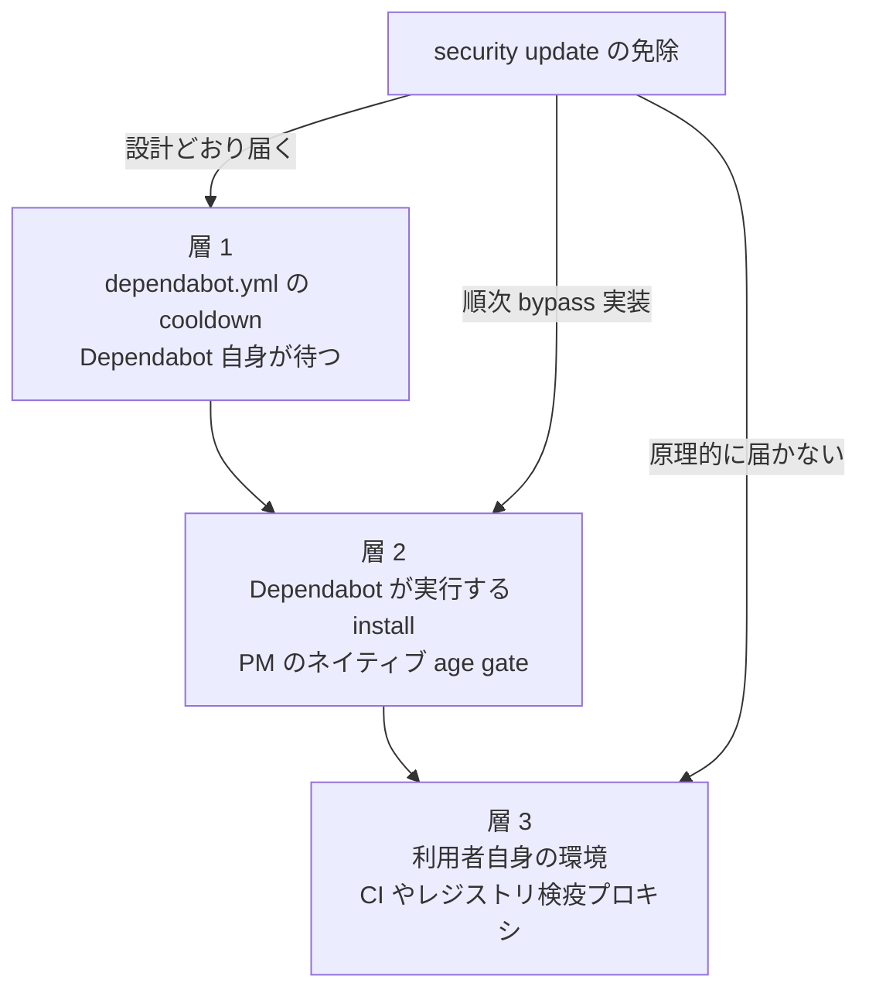

GitHub は 2026-07-14 から、Dependabot の version updates に既定 3 日のクールダウンを適用しました。新しいリリースが公開されてから 3 日間は、更新 PR が出ません。設定は不要で、全ユーザーに適用されます。

この変更で新しく増えた機能はありません。同じ機能は 2025-07-01 に "minimum package age" の名で GA しています。変わったのは、待つ状態と待たない状態のどちらを初期状態に置くかという一点です。

本記事では、この既定値の変更が何を保証して何を保証しないのかを、公式ドキュメントと dependabot-core の実装、および実インシデントのタイムラインから整理します。想定読者は、依存更新の自動化ポリシーを決める立場の方です。結論を先に 3 点挙げます。

1. 3 日は合理的な下限です。ただし上限でも万能でもありません
2. 「security updates は遅れない」は条件付きでしか成立しません
3. 待機は継承されるのに、免除は継承されません

## 変更の概要

### 仕様の骨格

| 項目 | 内容 |
|---|---|
| 既定値 | 3 日、設定不要 |
| 適用対象 | version updates のみ |
| security updates | 免除、ただし後述の前提あり |
| 開始 | github.com は 2026-07-14、GHES は 3.23 で反映予定 |
| 機能自体の GA | 2025-07-01、告知名は "minimum package age" |
| 対象エコシステム | サポートされる全エコシステム、`semver-*-days` のみ一部非対応 |

既定値の 3 日は、dependabot-core の `DEFAULT_COOLDOWN_DAYS = 3` と一致します。

### 設定キーは 6 つ

`dependabot.yml` の `cooldown` ブロックで指定できるキーは 6 つです。dependabot-core の `cooldown_definition.rb` のキー名と完全に一致します。

| キー | 意味 | 既定 |
|---|---|---|
| `default-days` | 全体の待機日数 | 3 |
| `semver-major-days` | major bump の待機日数 | `default-days` を継承 |
| `semver-minor-days` | minor bump の待機日数 | 同上 |
| `semver-patch-days` | patch bump の待機日数 | 同上 |
| `include` | 待機を適用するパッケージ、最大 150 件、`*` 可 | 全件 |
| `exclude` | 待機から外すパッケージ、最大 150 件、`include` より優先 | なし |

```yaml
version: 2
updates:
  - package-ecosystem: "npm"
    directory: "/"
    schedule:
      interval: "weekly"
    cooldown:
      default-days: 3
      semver-major-days: 7
      exclude:
        - "@my-org/*"
```

### 完全に無効化する指定は公式内で矛盾しています

無効化の指定値について、公式内で記述が割れています。

| ソース | 記述 |
|---|---|
| dependabot-core discussion #15368 | `0` でクールダウンを撤廃可能 |
| 公式ドキュメント | 日数レンジは 1〜90 |

dependabot-core の実装は 3 段階すべてで `0` を生存させ、`within_cooldown_period?` は `cooldown_days <= 0` で false を返します。つまり core は `0` を完全な opt-out として正しく処理します。ただし `dependabot.yml` の構文バリデーションは GitHub 側の非公開実装であり、`0` が受理されるかまでは確認できませんでした。

仕様上ぶれない代替は `exclude: ["*"]` です。`File.fnmatch?` による全一致で、`exclude` は常に `include` より優先されます。

### 「3 日の起点」も表現が揺れています

同じ機能の説明が、ソースによって次のように異なります。

| ソース | 起点の表現 |
|---|---|
| blog | リリースが publish された後 |
| changelog、discussion | レジストリで available になった後 |
| ドキュメント | its release の後 |

実装は公開時刻ベースですが、正式な定義は一次情報で確定できませんでした。通常は差が問題になりません。公開とレジストリ反映に時間差があるミラー構成では、意味が変わりえます。

### grouped updates はグループ全体を待ちません

公式ドキュメントに記述がないため、実装で確認しました。

クールダウンはグループ単位のゲートではなく、依存ごとの候補バージョン一覧に対するフィルタとして効きます。`GroupUpdateCreation#update_checker_for` はグループのメンバー 1 件ずつに update checker を生成し、`update_cooldown: job.security_updates_only? ? nil : job.cooldown` を渡すだけです。グループ経路と単体経路でこの行は完全に同一で、「グループだから待つ」という分岐はコード上に存在しません。

結果は 2 通りに分かれます。

- 新しいリリースが全部クールダウン中: 現行版のみが候補になり、そのパッケージはグループ PR から落ちる
- 中間リリースがクールダウンを抜けている: より小さい bump としてグループ PR に載る

「グループから除外される」は前者の結果論であり、仕様として保証されたものではありません。公式ドキュメントに記述がない点は未確定として扱ってください。

## 免除を決めるのは「修正かどうか」ではありません

### 分岐の構造



| 要素名 | 説明 |
|---|---|
| RELEASE | 新バージョンのレジストリ公開 |
| ADVISORY | GitHub Advisory Database への登録状態による分岐 |
| SEC | security update 経路、クールダウン免除 |
| VER | version update 経路、既定 3 日の待機対象 |
| PR | 更新 PR の作成 |
| WAIT | 待機中の状態、PR は未作成 |

免除の可否を決めるのは、そのリリースが修正かどうかではありません。advisory に登録済みかどうかです。脆弱性修正であっても、advisory 登録前は version update 経路を通り、既定 3 日の待機対象になります。

### 公式ドキュメントの記述で前提が閉じます

GitHub の changelog は "Security updates still open immediately, so critical fixes are never delayed" と書いています。Dependabot 自身の挙動としてはそのとおりです。この保証は、脆弱性が advisory として登録済みであることを前提にしています。

公式ドキュメントの記述を連鎖させると、前提が明示的に条件付きであるとわかります。

1. security update の引き金は alert です

> "If you enable Dependabot security updates, when a Dependabot alert is raised for a vulnerable dependency in the dependency graph of your repository, Dependabot automatically tries to fix it."

2. alert の引き金は advisory 登録です

> "A new vulnerability is added to the GitHub Advisory Database"

3. 登録されるのはレビュー済みのものだけです

> "Only advisories reviewed by GitHub trigger alerts."

4. 登録には時間がかかりえます

> "New vulnerabilities may take time to appear in the GitHub Advisory Database and trigger alerts."

メンテナが脆弱性を修正したリリースを出しても、advisory が登録されるまでの間、その修正版は Dependabot にとって通常の新しいバージョンです。version update 経路を通り、既定 3 日のクールダウンの対象になります。

この構造は実装の不具合ではなく、設計に内在します。正確な理解は「クールダウンは security fix を遅らせない」ではなく、「advisory として認識された security fix を遅らせない」です。

実務で効いてくるのは次の 2 ケースです。

- メンテナが CVE 化せず、通常リリースとして脆弱性を修正する慣行
- 公表から advisory 登録までにラグがある大規模インシデントの初動

advisory 登録ラグの定量データは、一次・二次とも見つかりませんでした。どれくらい遅れるかは本調査では答えられません。構造として存在することのみが確認できています。

## 待機を強制する 3 つの層

「security updates は免除」という記述がどこまで保証されるかは、待機がどの層で発生するかによって変わります。



| 要素名 | 説明 |
|---|---|
| 層 1 | `dependabot.yml` の `cooldown` による待機 |
| 層 2 | Dependabot が install 時に呼ぶパッケージマネージャのネイティブ age gate |
| 層 3 | 利用者が自分で置いた CI やレジストリ検疫プロキシの待機 |
| SEC | security update に対するクールダウン免除 |

| 層 | 待機を強制するもの | security updates の免除 |
|---|---|---|
| 層 1 | `dependabot.yml` の `cooldown` | 免除、設計どおり |
| 層 2 | Dependabot が install 時に呼ぶ PM のネイティブ gate | かつてブロック、2026-05-27〜07-17 に順次 bypass 実装 |
| 層 3 | 利用者の CI、レジストリ検疫プロキシ | 原理的に届かない |

### 層 2 の現状

dependabot-core の実装で確認した、2026-07-24 時点の状況です。

| エコシステム | ネイティブ設定 | install 時 bypass | ブロックしうるか |
|---|---|---|---|
| npm | `.npmrc` の `min-release-age` | 実装済み、PR #15139 / #15386 | しない |
| pnpm | `pnpm-workspace.yaml` の `minimumReleaseAge` | 実装済み、PR #15170 | しない |
| Yarn Berry | `.yarnrc.yml` の `npmMinimalAgeGate` | 実装済み、PR #15191 | しない |
| Bundler | Gemfile の `source ..., cooldown: N` | 実装済み、PR #15517、2026-07-17 merge | しない |
| uv | `pyproject.toml` の `[tool.uv] exclude-newer` | 未実装 | しうる |

uv は dependabot-core 全体を `exclude-newer` および `exclude_newer` で検索して 0 件でした。`Uv::FileUpdater::LockFileUpdater#run_update_command` が組む `uv lock` にも上書き分岐がありません。

ただし uv の `exclude-newer` は絶対日時カットオフであり、他の「N 日ローリング age gate」とは意味論が異なります。主用途は再現性ビルドです。この差は割り引いて読んでください。

層 2 の状況は週単位で変化します。Bundler の修正は本調査日の 7 日前です。恒久的な論点は層 2 ではなく、advisory 登録ラグと層 3 にあります。

### 層 3 には緊急バイパスが設計されていません

層 3 は利用者自身が置いた待機であり、Dependabot の免除は届きません。公式に実害が明記されているのは `npm audit fix` の経路です。

> npm keeps the package at its vulnerable version, warns that the fix was blocked, and exits with a non-zero code

`min-release-age` を長く設定していると、`npm audit fix` が脆弱版を維持したまま非ゼロ終了します。npm 側には `min-release-age-exclude` という公式の逃げ道がありますが、設定していなければ塞がったままです。

より厳しいのは、レジストリ前段の検疫プロキシです。日本語圏の実務記事には、Nexus の前段に自作プロキシを置き、公開後 14 日以内のパッケージを 403 で拒否する構成があります。この層は lockfile の pin も security 判定も無関係に拒否します。緊急時のバイパス手段を自分で設計していなければ、脆弱性修正の取り込み自体が止まります。自作である以上、バイパスも自作するしかありません。

なお `npm ci` が既存 pin の security fix を弾く経路は確認できませんでした。`min-release-age` は解決時フィルタであり、lockfile 使用時は manifest 解決自体が走らないためです。ただしこれを明記した公式文は見つかっていません。実装からの推論として扱ってください。

## 3 日という値は妥当か

公式は 3 日の定量的な根拠を示していません。実データで検証します。

### 母集団を分けないと必ず誤読します

クールダウンが効くのは、既に依存しているパッケージの悪意ある新バージョンだけです。この区別を落とすと、正反対の結論が出ます。

| 母集団 | 代表的なデータ | クールダウンの射程 |
|---|---|---|
| レジストリ全体の悪意あるパッケージ | Backstabber's Knife Collection、174 件、平均 209 日、中央値 67 日 | 射程外、typosquatting と新規マルウェアが支配的 |
| 既存依存の汚染された新バージョン | 本調査で構築、n=14 | 射程内 |

学術データセットはいずれも前者を測っています。Duan et al. の NDSS 2021 は 20% が 400 日超滞留、Guo et al. の ASE 2023 は潜伏 2 ヶ月超が 28% と報告しています。これらを根拠に「3 日では全く足りない」と結論するのは、母集団の取り違えです。逆に、後者だけを見て「クールダウンで大半を防げる」と一般化するのも誤りになります。

### 実インシデントの発覚時刻は二峰性を示します

npm registry API のミリ秒精度タイムスタンプと OSV / GHSA を突き合わせて構築したタイムライン、n=14 の結果です。

| 観測 | 内容 |
|---|---|
| 24 時間以内の発覚 | 14 件中 13 件 |
| 1〜7 日帯の事例 | ゼロ件 |
| 唯一の長期潜伏 | event-stream 3.3.6、78 日 15 時間 |

代表的な発覚までの時間は、debug 4.4.2 が 1 時間 14 分、rc が 54 分、Nx が 4 時間 12 分、axios 1.14.1 が 2 時間 54 分でした。

分布は数時間と数十日に割れており、その間が空いています。この形が意味するのは次の 2 点です。

1. 3 日は高速検知クラスタを捕捉するのに十分です
2. 3 日を 7 日に延ばしても、観測範囲での追加効果はほぼありません。1〜7 日帯に事例がないためです

### 「10 件中 8 件は 1 週間以内」の扱いに注意します

日本語圏で繰り返し引用される「悪意あるパッケージ 10 件中 8 件は 1 週間以内に検出・削除」という数値は、原典が William Woodruff のブログ記事、2025-11-21 です。

母集団は n = 10 で、著者が過去 18 ヶ月の著名事例を手で選んだ便宜標本です。原典には次の但し書きが実在します。

> "In the very small sample set above, 8/10 attacks had windows of opportunity of less than a week."

統計的推定ではなく事例集です。この数値を「一般に 8 割が 1 週間以内」と読むのは過大解釈になります。原典の表を 3 日で切り直すと、3 日未満 7 件、ちょうど 3 日 1 件、3 日超 2 件です。7 日との差は約 1 件にとどまります。

さらに、原典が 7 日推奨の根拠に挙げる事例のうち tj-actions はタグ改竄です。バージョン更新が発生しないため、クールダウンの保護はゼロです。NVD の CVE-2025-30066 には "modified by a threat actor to point at commit 0e58ed8" と一次記載があります。対策は SHA ピン留めであり、待機ではありません。

### 合理的な下限であり、上限ではありません

| 区分 | 対象 |
|---|---|
| 効く | 短命な汚染版、実インシデントの大半 |
| 効かない | 長期潜伏、event-stream 78 日 / xz 33 日 |
| 効かない | タグ改竄、dependency confusion |
| 効かない | semver で浮動する間接依存 |

直接依存にクールダウンをかけても、間接依存は当時の最新を引きます。

3 日を「安全になった」と読むのではなく、「自動取り込みから短命な汚染版を外す下限が既定になった」と読むのが正確です。

## 待機は継承されるのに、免除は継承されません

GitHub 公式 blog は次の調整を推奨しています。

> "If you'd like to customize your delay for highly trusted internal packages versus public registries, check out the documentation on configuring Dependabot."

内部パッケージと公開レジストリで待機を変えることは、GitHub 自身が想定するユースケースです。ところが実装には非対称性があります。

| `.npmrc` の設定 | Dependabot の扱い | 根拠 |
|---|---|---|
| `min-release-age`、待機を課す | 取り込む | PR #15132、2026-05-28 merge |
| `min-release-age-exclude`、待機から外す | 無視する | Issue #15348、2026-06-18 時点で open |

`.npmrc` に両方を書いても、制約だけが Dependabot に継承され、緩和は継承されません。Dependabot 側で除外するには `dependabot.yml` の `cooldown.exclude` を別途書く必要があり、同じ意図の除外を 2 箇所で二重管理することになります。

この要求は日英で独立に表面化しています。

| 主体 | 時期 | 内容 |
|---|---|---|
| ANDPAD、日本語圏 | 2026-02-12 | 社内ライブラリだけ即時にしたいが Dependabot では不可能、Renovate へ移行 |
| Issue #15348、英語圏 | 2026-06-18 | 信頼する自社パッケージをクールダウンから外せない |
| GitHub 公式 blog | 2026-07-23 | 内部と公開で待機を変えることを推奨と明記 |

公式が推奨するユースケースに、公式の実装が片方の経路で追いついていない状態です。

この非対称性は運用ルールにも波及します。既定化の翌日に公開された日本語記事は、`default-days: 0` や `semver-patch-days: 0` や `exclude` を「既定 3 日を壊す設定」として CI で検査するスクリプトを提案しています。しかし `cooldown.exclude` は、信頼する自社パッケージを外す唯一の手段でもあります。検査するなら「`exclude` の有無」ではなく、「除外対象が信頼境界の内側かどうか」を見るべきです。

## 他実装との比較

同じ「新しいリリースをすぐ採用しない」制御は、他のツールにも実装されています。既定で有効かどうかはツール間で割れています。

| ツール | 設定キー | 既定 | semver 別指定 | security 更新の扱い |
|---|---|---|---|---|
| Dependabot | `cooldown.default-days` | 3 日、2026-07-14 から | 可 | 免除、advisory 登録が前提 |
| Yarn Berry | `npmMinimalAgeGate` | 1 日、4.12 から | 不可 | 記述を確認できず |
| pnpm | `minimumReleaseAge` | 1440 分、v11.0.0 から | 不可 | 記述を確認できず |
| Renovate | `minimumReleaseAge` | null、推奨プリセットに npm 3 日 | 可 | バイパスして即 PR |
| npm CLI | `min-release-age` | null、11.10.0 で追加 | 不可 | `npm audit fix` をブロック |
| Bun | `install.minimumReleaseAge` | null | 不可 | 記述を確認できず |
| uv | `exclude-newer` | None、絶対日時 | 不可 | 記述を確認できず |

設計上の差で重要なのは次の 3 点です。

1. セキュリティ更新の扱いが正反対のものがあります。Renovate はクールダウンをバイパスして即 PR を出し、npm は逆に `npm audit fix` をブロックします。同じ待機でも、緊急経路の有無で安全性の意味が変わります
2. 全ツールが取得日時ではなく、レジストリ公開時刻を基準にします。したがって「いつ気づいたか」ではなく「いつ世に出たか」で待機が決まります
3. タイムスタンプが取れないときの挙動が割れます。fail closed は Renovate 42 以降と uv、fail open は pnpm と Bun です。後者は「待機しているつもりで待機していない」状態を作りえます

「npm 本体に相当機能はない」という説明は誤りです。npm CLI 11.10.0、2026-02-11 で追加済みです。

## 反証と、それでも残る強度

本記事の結論を否定する側のエビデンスを、専任で探索した結果です。

### 揺らいだ論点

| 論点 | 反証 | 強度 |
|---|---|---|
| security updates は免除だから安全性を損なわない | advisory 登録ラグ、公式ドキュメントの一次記述で連鎖が閉じる | 強い |
| 同上 | 層 3 に免除が届かない | 強い |
| 同上 | uv の native gate bypass が未実装 | 中 |
| 3 日という値 | 公式が定量的根拠を一切示していない | 中 |

### 反証が見つからなかった論点

- 「クールダウンは無意味」を支える定量的反証は皆無でした。批判的な論者も "it raises the bar" は認めています
- 既定化そのものへの反対は、GitHub の事前 Poll で「即時 PR を続けてほしい」が 0 票でした。ただし総投票数は 3 票にすぎず、選好の分布を語れる標本ではありません。「反対が観測されなかった」以上の主張はできません
- ロールアウト後 10 日の公開チャネルに、「遅くなって壊れた」という実害報告が見つかりませんでした。むしろ観測されたのは「maven で 11 時間後に PR が来た、つまりクールダウンが効いていない」という逆向きの苦情でした。GitHub と Hacker News の範囲での所見です
- 攻撃者の適応、つまり待機期間をやり過ごしてから発火する手口は理論的主張のみで、実例はゼロでした。ただし不在の証明ではありません

### 免除の方針自体は否定されていません

層 2 で見つかった穴はすべて実装漏れであり、方針の否定ではありません。PR #15485 は設計思想を明文化しています。

> "Security updates are never gated — they still pass the existing `=0` bypass (which intentionally overrides any native gate)."

問題は方針ではなく、その方針がどこまで届くかの境界にあります。

## 未解決の問い

| # | 問い | 現状 |
|---|---|---|
| U1 | `cooldown: 0` は受理されるか | ドキュメントの 1〜90 と discussion の `0` が矛盾、未確定。`exclude: ["*"]` が確実な代替 |
| U2 | 「3 日」の起点の正式定義 | 公開時刻とレジストリ利用可能時刻で表現が揺れる、実装は公開時刻ベース |
| U3 | `npm ci` に `min-release-age` は適用されるか | 実装からの推論、公式明記は未発見 |
| U4 | 既定 3 日はどこで注入されるか | OSS の core だけでは成立せず、GitHub バックエンド側の注入が必要、OSS では確認不能 |
| U5 | grouped updates とクールダウンの関係 | 実装からは確定、公式ドキュメントに記述なし、仕様保証ではない |
| U6 | advisory 登録までのラグの実測 | 一次・二次とも見つからず、構造の存在のみ確認 |
| U7 | uv の残存ギャップの実害 | bypass 未実装は確認、`exclude-newer` は意味論が異なるため影響範囲は未評価 |

## 実務への落とし込み

設定を見直す観点を 6 つ挙げます。

1. **既定 3 日をそのまま受け入れてよいか**
   短命な汚染版を外す下限としては妥当です。7 日に延ばしても、観測範囲での追加効果は薄いままです。延ばすなら「何を防ぎたいのか」を長期潜伏型と切り分けてから決めます
2. **内部パッケージを除外するなら `dependabot.yml` に書く**
   `.npmrc` の `min-release-age-exclude` は Dependabot に届きません。`cooldown.exclude` が必要で、二重管理になることを前提に運用します
3. **層 3 に緊急バイパスを設計しているか**
   検疫プロキシや CI の age gate には、Dependabot の免除が届きません。「脆弱性修正のときだけ待機を外す」経路を、待機を作ったのと同じ人が設計します
4. **`npm audit fix` が非ゼロ終了する構成になっていないか**
   `min-release-age` を長く設定している場合、`min-release-age-exclude` の設定を確認します
5. **CI 検査を入れるなら信頼境界で判定する**
   `exclude` の有無ではなく、除外対象が信頼境界の内側かどうかを見ます。`exclude` 自体は公式が推奨する調整手段でもあります
6. **uv を使っている場合は層 2 の残存ギャップを意識する**

公的機関のガイダンスとも整合します。内閣官房 国家サイバー統括室のガイドライン、令和 8 年 6 月 12 日一部改定は、「迅速な適用の要否を判断した上で」脆弱性対策計画を策定・実施することを求めています。一律即時でも一律待機でもなく、要否を判断するプロセスを運用設計に組み込む構造です。security と version で経路を分ける設計は、これと整合します。

依存更新を SHA pin や lockfile や vendoring を含む多層で固める全体構造は、[CI/CD依存をロックダウンする](https://zenn.dev/suwash/articles/cicd-dependency-lockdown_20260614) で扱っています。本記事はその再説をせず、待機時間が既定値になったこと自体の意味に絞りました。

## まとめ

Dependabot の既定クールダウンは、待つか待たないかの初期状態を反転させた変更であり、3 日は短命な汚染版を自動取り込みから外すための合理的な下限です。ただし免除の可否を決めるのは advisory への登録有無であり、待機は継承されるのに免除は継承されないという非対称性が残るため、緊急経路を自分で設計しているかどうかが実務上の分かれ目になります。

この記事が少しでも参考になった、あるいは改善点などがあれば、ぜひリアクションやコメント、SNSでのシェアをいただけると励みになります！

## 参考リンク

- GitHub 公式
  - [The case for a cooldown: why Dependabot now waits before issuing version updates](https://github.blog/security/supply-chain-security/the-case-for-a-cooldown-why-dependabot-now-waits-before-issuing-version-updates/)
  - [Dependabot options reference](https://docs.github.com/en/code-security/dependabot/working-with-dependabot/dependabot-options-reference)
  - [About Dependabot alerts](https://docs.github.com/en/code-security/dependabot/dependabot-alerts/about-dependabot-alerts)
  - [About Dependabot security updates](https://docs.github.com/en/code-security/dependabot/dependabot-security-updates/about-dependabot-security-updates)
  - [GitHub Changelog](https://github.blog/changelog/)
- GitHub
  - [dependabot-core Discussion #15368 - cooldown defaults](https://github.com/dependabot/dependabot-core/discussions/15368)
  - [dependabot-core Issue #15157 - Support age/cooldown controls](https://github.com/dependabot/dependabot-core/issues/15157)
  - [dependabot-core Issue #15348 - honour min-release-age-exclude](https://github.com/dependabot/dependabot-core/issues/15348)
  - [dependabot-core Issue #15407 - Bundler native cooldown blocks security updates](https://github.com/dependabot/dependabot-core/issues/15407)
  - [dependabot-core PR #15132](https://github.com/dependabot/dependabot-core/pull/15132)
  - [dependabot-core PR #15485](https://github.com/dependabot/dependabot-core/pull/15485)
  - [dependabot-core PR #15517](https://github.com/dependabot/dependabot-core/pull/15517)
- 他実装のドキュメント
  - [Renovate: minimumReleaseAge](https://docs.renovatebot.com/configuration-options/#minimumreleaseage)
  - [pnpm: settings](https://pnpm.io/settings)
  - [Yarn: npmMinimalAgeGate](https://yarnpkg.com/configuration/yarnrc)
  - [npm: min-release-age](https://docs.npmjs.com/cli/using-npm/config)
- 記事
  - [We should all be using dependency cooldowns](https://blog.yossarian.net/2025/11/21/We-should-all-be-using-dependency-cooldowns)
  - [CI/CD依存をロックダウンする](https://zenn.dev/suwash/articles/cicd-dependency-lockdown_20260614)
