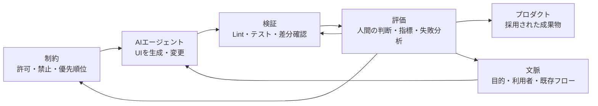

AIエージェントにUI実装を任せると、単一画面は速く作れても、画面数が増えるほど色・余白・コンポーネント選択・UXの意図がずれやすくなります。プロンプトを長くするだけでは、このずれを継続的に防げません。

Design Harness（デザインハーネス）は、AIの生成能力を人間の判断で制御しながらデザインプロセスを進めるための考え方です。公式サイトでは、デザインシステムを中核に、**制約・文脈・検証・評価**の4層で構成されるモデルとして説明されています。

本記事では、この4層をUI実装のワークフローへ落とし込む方法を整理します。なお、Design Harnessは特定製品のAPI仕様や標準化済みのデータ形式ではありません。後半のJSONやCI構成は、概念を実装するための一例です。

名前の近い[AI Harness Engineering](https://zenn.dev/suwa_sh/articles/ai-harness-engineering_20260515)は、コーディングエージェントを包む実行層を扱う研究です。本記事のDesign Harnessは、デザインシステムを中核に、UI/UXの判断と検証を運用へ組み込むための観点を扱います。


*この記事の全体像。以下、順に解説します。*

## デザインシステムだけでは足りない理由

従来のデザインシステムは、人間同士の共通言語として機能します。デザイントークン、コンポーネント、利用ガイドラインがあれば、デザイナーとエンジニアは同じ基準で判断できます。

しかし、AIエージェントを実装主体に加えると、次の仕組みも必要です。

- AIが毎回参照できる機械可読なルール
- 画面の目的や既存フローを伝える文脈
- 生成物がルールを満たすか確認する自動検証
- 失敗をルール改善へ戻すフィードバックループ

Design Harnessは、デザインシステムを置き換えるものではありません。デザインシステムをAIエージェントが利用できる形に接続し、生成から評価までを運用可能にする外側の仕組みです。

## 4層モデルの全体像

4層は独立したチェックリストではなく、生成と改善を循環させる構造です。

ただし、公式の4層は特定の実行順序を定める製品アーキテクチャではありません。以下は、4つの観点をUI実装パイプラインへ割り当てた本記事独自の構成例です。



| 層 | 役割 | 具体例 |
|---|---|---|
| 制約 | AIが選べる範囲を定義 | トークン利用、禁止色、既存コンポーネント優先 |
| 文脈 | 正解を選ぶための背景を提供 | 画面の目的、ユーザーフロー、アクセシビリティ要件 |
| 検証 | 生成物を決定的に検査 | 型検査、Lint、UIテスト、ビジュアルリグレッション |
| 評価 | 結果を採否と改善へつなぐ | 人間レビュー、失敗分類、ルール更新 |

### 1. 制約：自由度を意図的に狭める

制約は「AIに何を考えさせないか」を決めます。たとえば色や余白を自由生成させず、デザイントークンから選ばせます。新しいボタンを作る前に既存コンポーネントを検索させる、といった優先順位も制約です。

否定形を大量に並べるより、正しい選択肢を明示する方が運用しやすくなります。「任意の青を使わない」ではなく、「強調色は `color.action.primary` を使う」のように記述します。

### 2. 文脈：画面の目的を判断材料にする

同じ入力フォームでも、会員登録と決済では優先すべき体験が異なります。コンポーネント仕様だけでは、AIはその違いを判断できません。

文脈には、対象ユーザー、タスクの完了条件、前後の画面、エラー時の導線、避けたい挙動を含めます。スクリーンショットだけでなく、なぜその設計になっているかを短い文章で残すことが重要です。

### 3. 検証：主観と決定的チェックを分ける

検証では、機械的に判定できる項目を自動化します。TypeScriptの型検査、アクセシビリティ検査、Storybookのテスト、スクリーンショット差分などが候補です。

AIによるレビューも利用できますが、生成側とレビュー側を分けるだけで正しさが保証されるわけではありません。色の値、コンポーネントの利用可否、テスト結果など、決定的に判定できる条件を先に置きます。

### 4. 評価：失敗を次のルールへ戻す

評価は、検証結果と人間の判断を使って成果物の採否を決める層です。重要なのは、指摘をそのPull Requestだけで終わらせないことです。

同じ誤りが繰り返されるなら、個別のプロンプトではなく、制約・文脈・検証ルール・評価基準の不足として扱います。更新をコードと同じようにレビューし、変更履歴を残すことで、ハーネス自体を改善できます。

## 最小構成のデータモデル

最初から大きな管理システムを作る必要はありません。ルール、画面文脈、検証処理、評価方針をGitで管理するだけでも始められます。検証結果はリポジトリへ蓄積せず、CI artifactやPull Requestのチェック結果として保存する構成も選べます。

```text
design-harness/
├── rules/
│   ├── tokens.json
│   └── constraints.json
├── contexts/
│   └── password-reset.md
├── checks/
│   └── verify-ui.mjs
└── evaluations/
    └── README.md
```

制約ファイルは、自然言語だけでなく識別子と検証方法を持たせると追跡しやすくなります。

```json
{
  "version": 1,
  "constraints": [
    {
      "id": "color-primary-token",
      "description": "主要アクションには定義済みトークンを使う",
      "allowed": ["color.action.primary"],
      "severity": "error",
      "verification": {
        "type": "static-analysis",
        "tool": "eslint",
        "rule": "design/color-primary-token"
      }
    },
    {
      "id": "reuse-button-component",
      "description": "ボタンは既存のButtonコンポーネントを使う",
      "allowed": ["@/components/Button"],
      "severity": "error",
      "verification": {
        "type": "static-analysis",
        "tool": "eslint",
        "rule": "design/reuse-button-component"
      }
    }
  ]
}
```

これは公式スキーマではなく、プロジェクト固有の実装例です。実際には、既存のデザイントークン形式やLint基盤へ合わせます。ルールIDをLintエラーやレビューコメントに含めると、どの制約が頻繁に破られるかを集計できます。

## 導入手順

### Step 1：頻出する失敗を3つ選ぶ

まず、過去のAI生成UIで繰り返した失敗を洗い出します。ブランドカラーの直接指定、既存コンポーネントの再実装、エラー状態の欠落など、検出可能で影響の大きいものを3つに絞ります。

網羅的なルール集から始めると、更新されない文書になりがちです。実際の失敗に対応するルールから始めると、導入効果を確認しやすくなります。

### Step 2：制約と文脈をリポジトリへ置く

AIエージェントが毎回読める場所に、制約とタスク固有の文脈を置きます。文脈ファイルには最低限、目的、完了条件、対象外、参照すべき既存実装を記載します。

```markdown
# パスワード再設定画面

- 目的: 本人確認を保ちながら再設定を完了させる
- 完了条件: 成功画面を表示し、再ログインへの導線を示す
- 対象外: 新規登録フローの変更
- 既存実装: `src/features/auth/components/EmailField.tsx`
- 注意点: エラーを色だけで伝えない
```

### Step 3：同じ検証をローカルとCIで動かす

エージェントには、変更後に実行すべきコマンドを固定して渡します。CIでも同じコマンドを実行し、ローカルだけ成功する状態を避けます。

```yaml
name: Verify generated UI

on:
  pull_request:

jobs:
  verify-ui:
    runs-on: ubuntu-latest
    steps:
      - uses: actions/checkout@v4
      - uses: actions/setup-node@v4
        with:
          node-version: 22
          cache: npm
      - run: npm ci
      - run: npm run typecheck
      - run: npm run lint:design
      - run: npm run test:ui
```

ここでの `lint:design` と `test:ui` は、各プロジェクトで定義するnpm scriptです。Design Harnessがこの名前のCLIを提供しているわけではありません。

### Step 4：人間の判断を残す

自動検証を通過しても、ユーザーフローの妥当性やブランド表現まで自動的に保証されるわけではありません。リリース影響が大きい変更には、人間の承認を必須にします。

レビュー結果は「今回だけの修正」と「ハーネスへ戻す学び」に分けます。後者だけをルールや文脈へ反映すれば、過剰な制約の増加を抑えられます。

## 運用で見るべき指標

AIの出力品質を単一スコアで表すより、改善行動につながる事実を記録します。

- 制約ID別の違反件数
- UIテストとビジュアルリグレッションの失敗率
- 人間レビューで差し戻した理由
- AI生成からマージまでの所要時間
- 同じ不具合が再発した回数

件数の増加だけでAIの品質低下と断定してはいけません。生成タスク数や変更規模も併記し、ルール追加前後で再発率がどう変わったかを確認します。

## よくある失敗と対処

| 症状 | 起きやすい原因 | 対処 |
|---|---|---|
| ブランドカラーが守られない | トークン名と利用条件が曖昧 | 許可するトークンと検証ルールを対応付ける |
| 既存画面と構造が合わない | 画面単体の説明しかない | 前後のフローと参照実装を文脈へ追加する |
| ルールだけ増えて生成が遅い | 例外と優先順位が未整理 | 失敗頻度と影響でルールを棚卸しする |
| 自動テストは通るが体験が悪い | 検証可能な条件だけで評価 | 人間が判断する項目と承認者を明示する |
| 同じ指摘が繰り返される | 評価が個別レビューで終了 | 指摘を制約・文脈・検証ルール・評価基準の不足へ分類する |

## 注意点

Design Harnessを導入しても、ハルシネーションや意図しない解釈を完全には防げません。ルールを増やすほど安全になるとも限らず、矛盾した制約はエージェントの判断を不安定にします。

また、アクセシビリティやセキュリティのように、専門知識と利用状況の理解が必要な領域をAIレビューだけへ委ねるのは危険です。決定的な検証と専門家による判断を組み合わせ、AIに任せる範囲を明示します。

Design Harnessは完成品として導入するものではなく、失敗から更新する運用基盤です。ルールの所有者、更新手順、例外の扱いまで決めて初めて継続的に機能します。

## まとめ

Design Harnessは、AIエージェントによるUI生成を、単発のプロンプト作業から継続可能な開発プロセスへ変える考え方です。デザインシステムを中核に、制約で選択肢を絞り、文脈で判断材料を与え、検証で生成物を確認し、評価から制約・文脈・検証方法を改善します。

導入時は、頻出する3つの失敗から始めるのがおすすめです。ルールをGitで管理し、ローカルとCIで同じ検証を実行し、人間の判断を残すだけでも、最小のハーネスとして機能します。

この記事が少しでも参考になった、あるいは改善点などがあれば、ぜひリアクションやコメント、SNSでのシェアをいただけると励みになります！

## 参考リンク

- [デザインハーネス | Design Harness](https://design-harness.com/)
