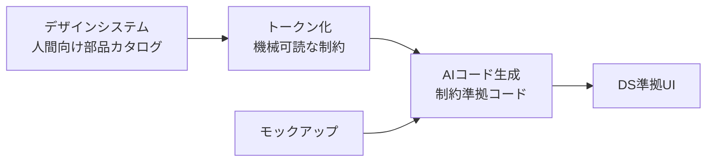
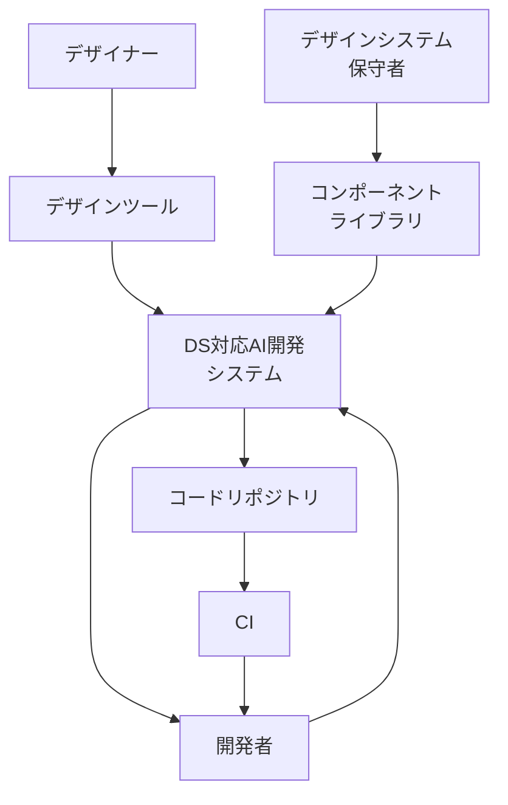
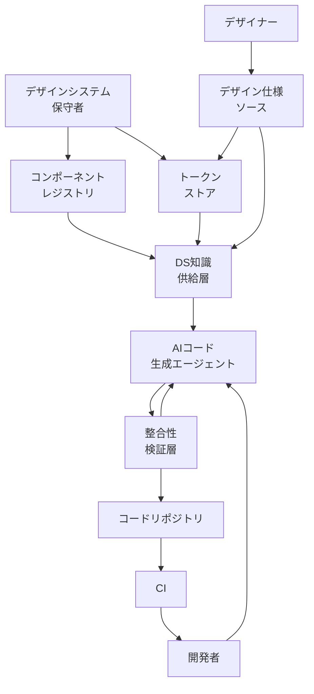
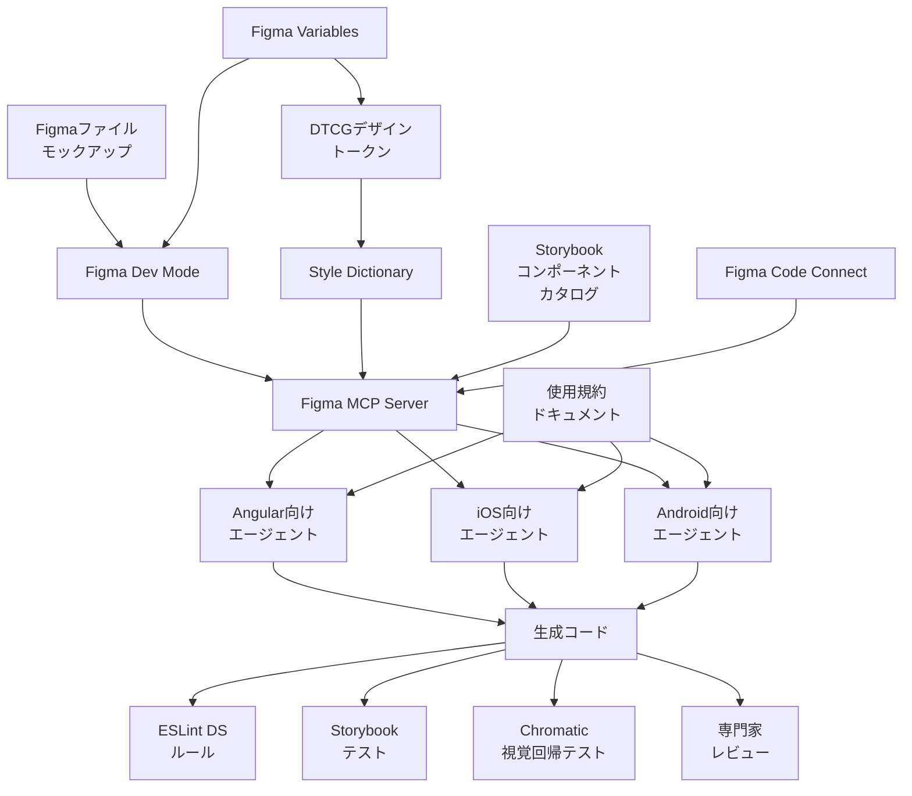
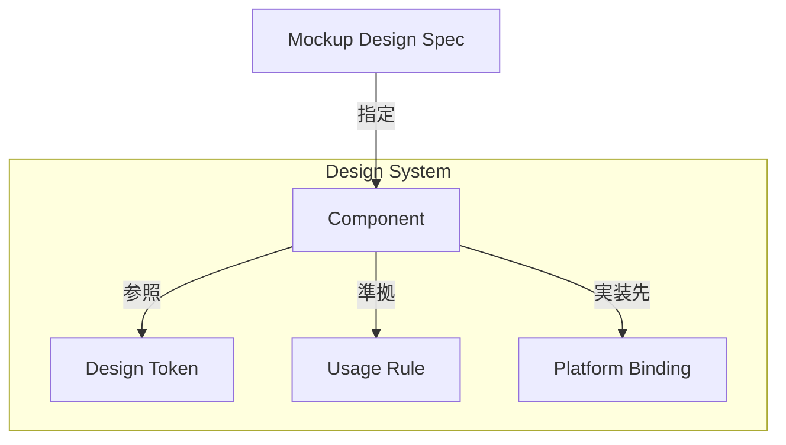
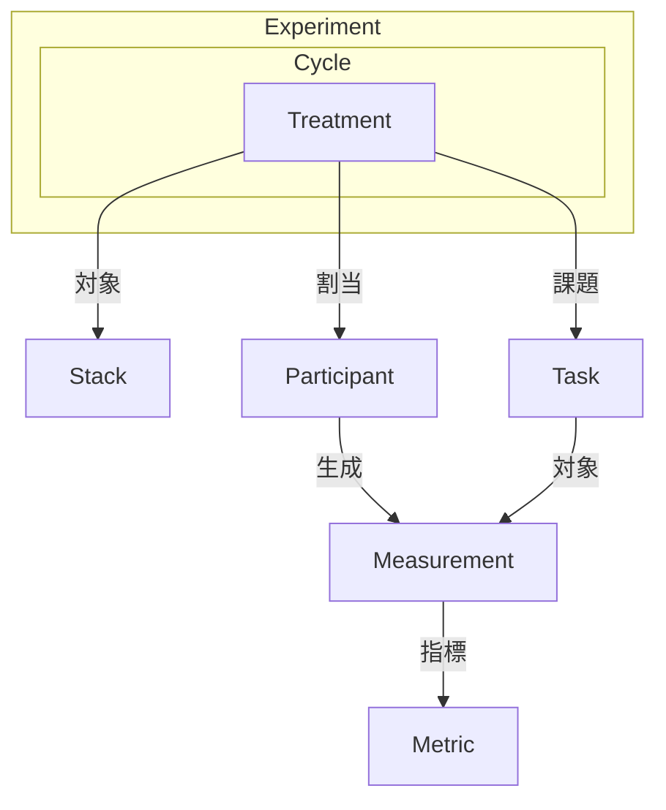
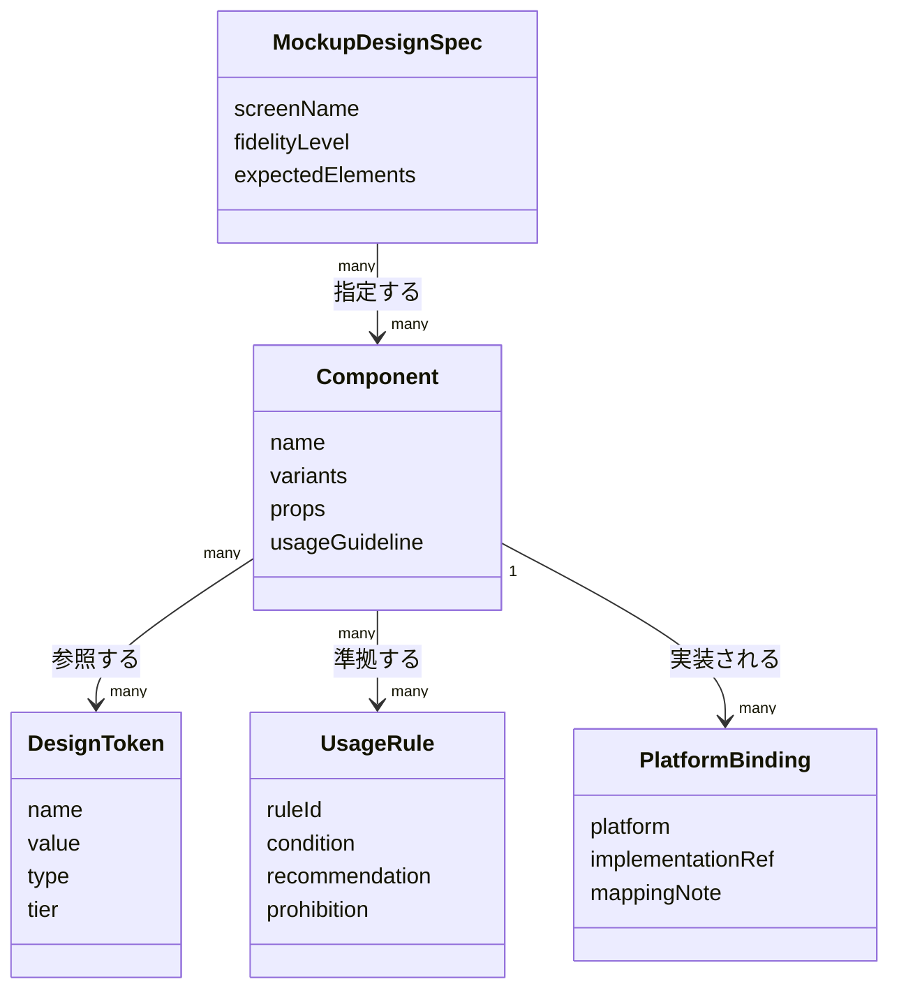
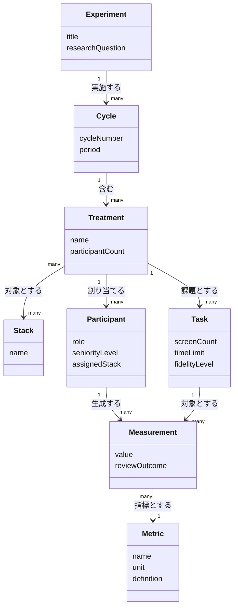
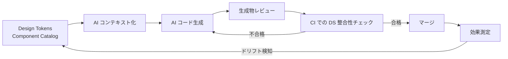

> 対象論文: Luciane Silva, Thayssa Rocha, Nicole Davila, Gustavo Pinto. "Design-System-Aware Development with AI: Evaluating Productivity and Design Consistency." SBES 2026 Industry Track.
> arXiv: <https://arxiv.org/abs/2607.13156>

:::message
本記事は、論文が確認した事実（企業DSでコンテキスト化した内製AIツール StackSpot AI と専門家レビューによる産業実験の結果）を起点に、「デザインシステムをAIが参照できる実行可能な制約として設計する」というアーキテクチャへ一般化してまとめたものです。DTCG・Figma MCP・Style Dictionary・CI lint 等の具体構成は論文が検証した介入ではなく、筆者による実装案です。「論文で確認された事実」と「実装案」は各節で区別して記載します。
:::

## 概要

デザインシステム対応AIコード生成（Design-System-Aware AI Codegen）は、AIコード生成にデザインシステム（DS）の制約を組み込む開発手法です。高忠実度モックアップを、企業固有のデザインシステムに準拠したUIコードへ変換する過程で、AIにDSを「参照可能な制約」として与えます。

対象論文の位置づけは次のとおりです。

| 項目 | 内容 |
|---|---|
| タイトル | Design-System-Aware Development with AI: Evaluating Productivity and Design Consistency |
| 著者 | Luciane Silva, Thayssa Rocha, Nicole Davila, Gustavo Pinto |
| 所属 | Zup Innovation ほか（ブラジル） |
| 会議 | SBES 2026 Industry Track（ブラジルソフトウェア工学シンポジウム） |
| 検証対象ツール | StackSpot AI（Zup Innovation の企業内コーディングエージェント） |
| 実験参加者 | Zup Innovation の開発者49名 |
| 実験対象スタック | Angular / iOS / Android |

### なぜモックアップからDS準拠UIへの変換が難しいのか

高忠実度モックアップをデザインシステム準拠のUIへ変換する作業には、3つの負荷が同時にかかります。

| 負荷 | 内容 |
|---|---|
| 視覚再現 | モックアップのレイアウト・色・余白を忠実に再現する |
| 部品選定 | 既存デザインシステムのコンポーネント・トークンから正しい部品を選ぶ |
| 規約遵守 | 命名規則・アクセシビリティ・プラットフォーム別ガイドライン（HIG / Material）に従う |

手作業では3つの負荷を開発者が同時に処理します。認知負荷が高く、所要時間もばらつきます。DSのみ（標準化コンポーネントを人手で組む）は部品選定の負荷を減らします。視覚再現と規約遵守の負荷は残ります。

### DS対応AIの位置づけ

DS対応AIは、デザインシステムを「人間向けの部品カタログ」から「AIが参照できる実行可能な制約」へ捉え直す発想です。



| 要素名 | 説明 |
|---|---|
| デザインシステム | 色・余白・部品・使用規約の集合。従来は人間が読んで学習する対象 |
| トークン化 | 色・余白・タイポグラフィを機械可読な値へ構造化する工程 |
| AIコード生成 | 制約を参照してモックアップを準拠コードへ変換する工程 |
| モックアップ | 高忠実度の画面デザイン。変換対象の入力 |
| DS準拠UI | デザインシステムに沿った実装成果物 |

デザインシステムを構成する3要素は、それぞれAIへの入力として機能します。

| DS構成要素 | 人間向けの役割 | AIへの入力としての役割 |
|---|---|---|
| design tokens | 色・余白・タイポグラフィの命名規則 | プロンプト/コンテキストに埋め込む機械可読な値 |
| component library | 開発者が探して手で組み込む部品集 | AIが選択・呼び出す候補群 |
| usage guideline | 開発者が読んで学習するドキュメント | AIの出力を制約するルール（禁止パターン・命名規約） |

### design-to-code / AIペアプログラミングとの関係

DS対応AIは、2系譜の交点に位置づけられます。

| 系譜 | 目的 | 代表例 |
|---|---|---|
| design-to-code | 画像/モックアップからコードを生成する | pix2code、v0.dev、Figma Dev Mode |
| AIペアプログラミング | 開発者の意図をコードへ変換する | GitHub Copilot、Cursor、StackSpot AI |
| DS対応AI codegen（交点） | モックアップからコードへの変換過程に企業固有のDS制約を強制する | 本論文の実験（StackSpot AI + 企業DS） |

一般的なdesign-to-codeツールは「見た目の再現」に最適化されがちです。企業固有のコンポーネント規約までは保証しません。DS対応AIは、生成過程にデザインシステムのコンテキストを与えます。視覚再現と規約遵守を同時に満たそうとするアプローチです。

## 特徴

DS対応AI開発の主要な特徴を整理します。

- モックアップの画像・仕様をAIへの入力とし、企業のデザインシステムをコンテキストとして併せて渡す
- 生成コードは既存コンポーネントライブラリの部品を参照し、独自CSS・独自コンポーネントの新規作成を避ける
- design tokens（色・spacing・typography）をAIが直接参照し、ハードコード値の混入を減らす
- プラットフォーム別ガイドライン（Angular Material の規約、Apple HIG、Material Design 3）をAIが踏まえて出力する
- 開発者の作業が「部品を探す」「規約を確認する」から「AI出力をレビューする」へシフトする
- 開発者ごとのDS習熟度による完成度・時間のばらつきが縮小する
- 作業の休止パターン（break pattern）が短く均質になったと観察され、ワークフローの摩擦（認知的中断）の低下が示唆される（論文では監督者が集めた定性的観察であり、正式な統計指標ではない）

### 3手法の比較（論文の実測値）

論文は「①手作業（Manual）」「②DSのみ（Design System）」「③DS対応AI（AI-Assisted）」の3手法を、Angular / iOS / Android の3スタックで比較しました。時間の単位は分（average completion time）です。

| 観点 | ① 手作業 | ② DSのみ | ③ DS対応AI |
|---|---|---|---|
| 参加者数 | 7名 | 21名 | 21名 |
| 開発時間 Angular | 536.15分 | 216.75分 | 164.00分（手作業比 **69.4%短縮**） |
| 開発時間 iOS | 593.00分 | 374.00分 | 316.00分（手作業比 **46.7%短縮**） |
| 開発時間 Android | 387.75分 | 213.25分 | 163.25分（手作業比 **57.9%短縮**） |
| タスク完成度（completeness） | 68% | 85% | 96% |
| 休止パターン（break pattern） | 最大195分 | 60〜110分 | 0〜90分 |
| ばらつき（標準偏差） | 最大 | 中間 | 最小（結果が均一・予測可能） |

- 時間短縮率46.7〜69.4%は「手作業 → DS対応AI」の比較値です。
- 「DSのみ → DS対応AI」の追加短縮は Angular 24.3% / iOS 15.5% / Android 23.4% です（実測値から算出）。手作業比の数字より控えめで、DS導入済みチームがAIで得る上乗せ分はこちらが目安です。
- iOSは参加者間のばらつきが最も大きく、短縮率も最小でした。Angularは手作業ベースラインが最も高く、絶対削減量が最大でした。
- 実験は2サイクル（2025年6月・2025年10月）、高忠実度モックアップから2画面を実装、1タスクの上限は8時間労働日という設定でした。
- 論文は有意差を `p<0.05` とだけ報告し、検定手法・スタック別人数・信頼区間・効果量・多重比較補正を示していません。Manual群は全体で7名です。数値は「単一企業の産業実験での報告値」として扱い、母集団への一般化は控えます。

### 関連ツール/アプローチとの関係

DS対応AI codegenの発想を支える周辺技術を整理します。

| ツール/アプローチ | 役割 | DS対応AIとの関係 |
|---|---|---|
| Figma Dev Mode / Dev Mode MCP server | Figmaの設計データ（階層・レイアウト・variables・component）をAIエージェントへ構造化提供 | モックアップ側の入力をAIが読める形に変換する。get_design_context / get_variable_defs がdesign tokens参照を実現 |
| v0（Vercel） | プレーンテキストからReact/Next.jsコンポーネントを生成 | 既存コンポーネントを土台に生成する点でDS対応AIと同系統 |
| design tokens（W3C DTCG） | 色・spacing・typographyの標準フォーマット | 機械可読化し、AIエージェントが直接参照できる橋渡しフォーマット |
| Storybook | コンポーネントライブラリのドキュメント化・プレビュー | AIが参照する部品カタログの一次情報源になる |
| Angular Material | Angular向けデザインシステム実装 | 論文実験のAngularスタックでAIが参照する部品ライブラリに相当 |
| Apple HIG + SwiftUI | iOS向けデザインガイドライン + 宣言的UI framework | 論文実験のiOSスタックでAIが遵守すべき規約群 |
| Material Design 3 + Jetpack Compose | Android向けデザインシステム + 宣言的UI framework | 論文実験のAndroidスタックでAIが遵守すべき規約群 |

design-to-codeの系譜としては、pix2code（画像からHTML/CSSを生成するニューラルネット）が初期の技術的土台です。その後Figma MCPやv0のような「ライブ設計データ + 既存コンポーネント参照」型へ発展しました。DS対応AI codegenは、この系譜の上に企業固有のデザインシステムを制約として組み込む点に特徴があります。

## 構造

一次論文は、社内AIツール（StackSpot AI）を企業デザインシステムにコンテキスト化してAngular / iOS / Androidの3スタックで実験した結果（時間46.7〜69.4%短縮）を報告します。ただし論文自体は「LLMのアーキテクチャ」「プロンプト設計」「検証パイプラインの実装」を開示していません。示されるのは次の事実のみです。

- 入力は高忠実度モックアップ
- 「企業固有のガイドラインをツールのコンテキストに直接統合することが必須」という言及
- 検証は「専門家がリアルタイムでレビューし、不整合があれば差し戻して計測タイマーは継続する」という漸進的提出プロトコル

この事実を基に、以下のC4図は論文が直接記述する実装ではなく、**DS対応AI開発ワークフローの論理構造**として一般化したものです。システムコンテキスト図・コンテナ図は役割名/カテゴリ名にとどめます。コンポーネント図のみ2026年時点で実在する具体ツール（Figma MCP server, DTCG, Style Dictionary, Storybook, ESLint, Chromatic 等）を例示します。

### システムコンテキスト図



| 要素名 | 説明 |
|---|---|
| デザイナー | モックアップ・デザイン変数などデザイン意図を作成するアクター |
| 開発者 | システムへ実装を要求し生成コードとCI結果を受け取るアクター |
| デザインシステム保守者 | コンポーネントライブラリと使用規約を維持するアクター |
| DS対応AI開発システム | デザイン仕様とDS制約を入力にコード生成と整合性検証を行う本体 |
| デザインツール | モックアップ・デザイントークンを作成する外部システム |
| コンポーネントライブラリ | 再利用可能コンポーネントと使用規約を保持する外部システム |
| CI | コミットを契機に自動検証を実行する外部システム |
| コードリポジトリ | 生成コードをバージョン管理する外部システム |

### コンテナ図



| 要素名 | 説明 |
|---|---|
| デザイン仕様ソース | モックアップ・デザイントークンなど正本のデザイン意図を保持するコンテナ |
| DS知識供給層 | コンポーネントカタログと使用規約をAIが参照可能な制約として整形し供給するコンテナ |
| AIコード生成エージェント | デザイン仕様とDS知識を入力にDS準拠コードを生成するコンテナ |
| 整合性検証層 | 生成コードをlint・視覚回帰・DSルールで検証し合否と差し戻しを返すコンテナ |
| トークンストア | デザイントークンの正本値を保持する補助コンテナ |
| コンポーネントレジストリ | 再利用可能コンポーネントと使用規約を保持する補助コンテナ |
| デザイナー | デザイン仕様ソースへ意図を入力するアクター |
| 開発者 | AIコード生成エージェントへ要求しCI結果を受け取るアクター |
| デザインシステム保守者 | コンポーネントレジストリとトークンストアを維持するアクター |
| コードリポジトリ | 検証済みコードを格納する外部システム |
| CI | リポジトリ変更を契機に追加検証を行う外部システム |

### コンポーネント図

各コンテナの内部構成を、2026年時点で実在するツール例で示します。実装依存が強いため、コンテナ図とは異なりここでは具体例を用います。



#### デザイン仕様ソース

| 要素名 | 説明 |
|---|---|
| Figmaファイル モックアップ | デザイナーが作成する高忠実度画面デザイン |
| Figma Variables | 色・間隔などデザイン変数を保持するFigma内部データ |
| Figma Dev Mode | 開発者/AIエージェント向けに仕様を読み取り可能にするFigmaモード |

#### トークンストア

| 要素名 | 説明 |
|---|---|
| DTCGデザイントークン | W3C Design Tokens Community Groupが定義するJSON形式のトークン正本 |
| Style Dictionary | トークンをプラットフォーム別コードに変換するビルドパイプライン |

#### コンポーネントレジストリ

| 要素名 | 説明 |
|---|---|
| Storybookコンポーネントカタログ | 実装済みコンポーネントとpropsをカタログ化した参照先 |
| Figma Code Connect | Figmaのコンポーネントとコードの対応関係を紐づける仕組み |

#### DS知識供給層

| 要素名 | 説明 |
|---|---|
| Figma MCP Server | デザインファイルの情報をAIエージェントへ供給するMCPサーバー |
| 使用規約ドキュメント | 企業固有のガイドラインをAIコンテキストへ直接統合したドキュメント |

#### AIコード生成エージェント

| 要素名 | 説明 |
|---|---|
| Angular向けエージェント | Angular Material等のコンポーネントを前提にDS準拠コードを生成 |
| iOS向けエージェント | SwiftUIとHuman Interface Guidelinesを前提にDS準拠コードを生成 |
| Android向けエージェント | Jetpack ComposeとMaterial 3を前提にDS準拠コードを生成 |

#### 整合性検証層

| 要素名 | 説明 |
|---|---|
| 生成コード | 各プラットフォーム向けエージェントが出力した実装 |
| ESLint DSルール | 静的解析でDS規約違反を検出するルールセット |
| Storybookテスト | コンポーネント単位の振る舞いを検証するテスト |
| Chromatic視覚回帰テスト | スナップショット比較でUIの見た目の一貫性を検証 |
| 専門家レビュー | 一次論文の実験プロトコルで実施された人手レビューと差し戻し |

## データ

論文には明示的なER図・データモデルの記載はありません。本文に登場する概念を抽出し、2つのモデル群としてモデル化します。

- A. デザインシステムを機械可読な制約として表すモデル
- B. 実験デザインと評価指標のモデル

論文本文に記載のない属性・関係は、W3C DTCG design tokens 仕様・Figma variables・既存デザインシステム実装（Angular Material / Apple HIG + SwiftUI / Material Design 3 + Jetpack Compose）から補完し、注記します。

### 概念モデル

#### A. デザインシステム制約モデル



| 要素名 | 説明 |
|---|---|
| Design System | 論文が言及する「組織のDS」。標準化コンポーネント・layout token・パターンの集合（論文記述） |
| Design Token | 色・spacing・typography等の最小単位の値（論文は layout tokens とのみ言及。global/alias/component の3層構造はデザインシステムで広く使われる運用上の階層設計であり、DTCG が規定する分類ではない） |
| Component | 再利用可能なUI部品。論文は reusable components / component hierarchies と言及 |
| Usage Rule | いつ使う/使わないかの制約。論文は非準拠コード提案の回避と効果のみ言及、ルールの構造自体は既存デザインシステム運用から補完 |
| Platform Binding | Angular / iOS / Android での実体マッピング。論文に具体的マッピングの記載なし。各プラットフォーム実装から補完 |
| Mockup Design Spec | 高忠実度モックアップ。論文は視覚要素・コンポーネント階層・間隔ルール・レスポンシブ性の忠実な再現が期待されると記述 |

#### B. 実験デザイン・評価指標モデル



| 要素名 | 説明 |
|---|---|
| Experiment | 本研究全体。AIとデザインシステムの併用がフロントエンド開発の所要時間と遂行特性へ与える影響を検証 |
| Cycle | 実験サイクル。2サイクル（2025年6月・2025年10月）。サイクル1は3処理条件すべて、サイクル2はDesign System / AI-Assistedの2条件のみ実施 |
| Treatment | 処理条件。Manual（7名、サイクル1のみ）/ Design System（21名）/ AI-Assisted（21名、StackSpot AI使用） |
| Stack | 対象技術スタック。Angular / iOS / Android |
| Task | 課題。高忠実度モックアップ2画面の実装、上限は8時間労働日 |
| Participant | 参加者。Zup Innovationのfrontend/mobile開発者、計49名。スタックとシニアレベルでバランスを取って割当 |
| Metric | 評価指標。time-to-delivery / completeness / variability（標準偏差）/ break pattern |
| Measurement | 個々の測定値。参加者×課題×処理条件の組み合わせで記録される実測データ |

### 情報モデル

#### A. デザインシステム制約モデル



| 要素名 | 属性 | 説明 |
|---|---|---|
| DesignToken | type | color / spacing / typography 等の種別（論文未記載、DTCG仕様 type から補完） |
| DesignToken | tier | global（primitive）/ alias（semantic）/ component の3層（論文未記載。デザインシステムで広く使われる運用上の階層設計であり、DTCG が規定する分類ではない） |
| Component | variants | 見た目・状態違いのバリエーション（論文未記載、一般的なコンポーネントライブラリ設計から補完） |
| Component | props | 外部から渡す設定値（論文未記載、一般的なコンポーネントAPI設計から補完） |
| UsageRule | condition / recommendation / prohibition | いつ使うか・推奨・禁止パターン（論文は効果のみ記述、ルール構造自体は補完） |
| PlatformBinding | implementationRef | Angular Material / SwiftUI / Jetpack Compose 等、対象プラットフォーム実装への参照（論文未記載、補完） |
| MockupDesignSpec | expectedElements | 視覚要素・コンポーネント階層・間隔ルール・レスポンシブ性（論文記述） |

#### B. 実験デザイン・評価指標モデル



| 要素名 | 属性 | 説明 |
|---|---|---|
| Cycle | period | 2025年6月（サイクル1）/ 2025年10月（サイクル2）（論文記述） |
| Treatment | participantCount | Manual=7 / Design System=21 / AI-Assisted=21（論文記述、合計49名） |
| Task | timeLimit | 上限8時間労働日（論文記述） |
| Task | fidelityLevel | 高忠実度モックアップ（論文記述） |
| Participant | assignedStack | Angular / iOS / Android のいずれか（論文記述） |
| Metric | definition | time-to-delivery=実装完了までの総時間（アクティブ開発+自然な休止を含む）/ completeness=視覚的忠実度と必須モックアップ要素の有無（専門家レビュー）/ variability=処理条件内の所要時間の標準偏差 / break pattern=休止時間の長さと分布（論文記述） |
| Measurement | reviewOutcome | 漸進的提出プロトコルにおける専門家レビュー結果（正確なら完了時刻記録、矛盾があれば差し戻しタイマー継続）（論文記述） |

## 構築方法

一次論文は評価方法論が中心で、実装の詳細を規定していません。本セクションは「DS対応AIコード生成」を実際に組むための手順を、実在ツールの公式手順から補完した**実装案**です。論文由来の数値・設定は含めず、実装部分はすべて補完であることを明示します。

### design tokens の定義

デザイントークンは W3C Design Tokens Community Group（DTCG）形式の JSON で一元管理し、Style Dictionary でプラットフォームごとのコードに変換します。

トークン定義（`tokens.json`、Style Dictionary が受け付ける `$value` / `$type` 表記）の実装例です。

```json
{
  "colors": {
    "$type": "color",
    "font": {
      "base": { "$value": "#111111" },
      "secondary": { "$value": "#333333" },
      "inverse": {
        "base": { "$value": "#ffffff" }
      }
    }
  }
}
```

上記は Style Dictionary が扱う hex 文字列の簡易表記です。DTCG フォーマット 2025.10 の厳密な color 型では、`$value` は `{"colorSpace": "srgb", "components": [...], "hex": "..."}` のようなオブジェクトを要求します。hex 文字列のまま運用する場合は「Style Dictionary 互換の簡易表記」と割り切り、厳密な DTCG 準拠が必要なら object 形式へ変換します。

Style Dictionary の設定ファイル（`config.json`）は、1つのトークン定義から Angular（SCSS）・iOS（Swift）・Android（XML/Compose）向けの成果物をそれぞれ生成します。実装案です。

```json
{
  "source": ["tokens/**/*.json"],
  "platforms": {
    "scss": {
      "transformGroup": "scss",
      "buildPath": "build/scss/",
      "files": [
        { "destination": "_variables.scss", "format": "scss/variables" }
      ]
    },
    "android": {
      "transformGroup": "android",
      "buildPath": "build/android/res/values/",
      "files": [
        { "destination": "colors.xml", "format": "android/colors" }
      ]
    },
    "compose": {
      "transformGroup": "compose",
      "buildPath": "build/compose/",
      "files": [
        {
          "destination": "StyleDictionaryColor.kt",
          "format": "compose/object",
          "options": { "className": "StyleDictionaryColor", "packageName": "com.example.tokens" },
          "filter": { "type": "color" }
        }
      ]
    },
    "ios-swift": {
      "transformGroup": "ios-swift",
      "buildPath": "build/ios-swift/",
      "files": [
        {
          "destination": "StyleDictionary+Struct.swift",
          "format": "ios-swift/any.swift",
          "options": {
            "className": "StyleDictionaryStruct",
            "import": ["UIKit", "SwiftUI"],
            "objectType": "struct"
          }
        }
      ]
    }
  }
}
```

`npx style-dictionary build` を実行すると、`build/scss/_variables.scss`・`build/android/colors.xml`・`build/compose/StyleDictionaryColor.kt`・`build/ios-swift/StyleDictionary+Struct.swift` が一括生成されます。

### デザインをAIに渡す経路

AI にデザインを渡す経路は2系統あります。

| 経路 | 内容 | 用途 |
|---|---|---|
| Figma Dev Mode MCP server | Figmaファイルの選択範囲から変数・レイアウト・コンポーネントマッピングを MCP 経由で AI に供給 | モックアップからコード生成の入力 |
| design tokens JSON + Storybook | Style Dictionary 生成物 + 既存コンポーネントカタログをコンテキストとして AI に読ませる | 既存 DS への準拠生成・レビュー |

Figma Dev Mode MCP server は Figma 公式が提供するリモート MCP サーバーです。Claude Code へは次のように追加します。

```bash
claude mcp add --transport http figma https://mcp.figma.com/mcp
```

追加後は `/mcp` コマンドで Figma を選択し、ブラウザ認証を完了します。主なツールは次のとおりです。

| ツール | 役割 |
|---|---|
| get_design_context | 選択レイヤーの構造化コンテキスト取得（既定は React + Tailwind 表現） |
| get_variable_defs | 選択範囲で使われている変数・スタイル（色/間隔/タイポグラフィ）をトークン名で取得 |
| get_code_connect_map | Figma ノードと実コードコンポーネントのマッピング取得 |
| get_screenshot | 選択範囲のスクリーンショット取得 |
| get_metadata | レイヤーID・タイプ・位置サイズの表現取得 |

get_variable_defs は Figma 側で定義済みの変数をハードコード値でなくトークン名で AI に渡せる点が、DS 準拠生成の要になります。

既存コンポーネントカタログを渡す経路としては、Storybook の `storybook-design-token` アドオンで生成したトークンドキュメントを AI のコンテキストに含める方法があります（実装案）。

```bash
npm install --save-dev storybook-design-token
```

```js
// .storybook/main.js
export default {
  addons: ["storybook-design-token"],
};
```

### プラットフォーム別 DS の前提

各プラットフォームで、AI がコードを生成する前提となる DS 基盤のセットアップ概略です。

**Angular Material（Web）**

```bash
ng add @angular/material
```

Material 3 のテーマは `mat.theme` mixin で SCSS 側に定義します。

```scss
// styles.scss
@use "@angular/material" as mat;

html {
  @include mat.theme((
    color: mat.$violet-palette,
    typography: Roboto,
    density: 0,
  ));
}
```

生成される CSS カスタムプロパティ（`--mat-sys-primary` など）が、Style Dictionary 出力の SCSS 変数と併用する DS の実体です。

**SwiftUI + Apple HIG（iOS）**

SwiftUI は標準コンポーネントを使うと HIG（Human Interface Guidelines）準拠の基盤を得やすく、既定の挙動がプラットフォーム慣習に沿いやすくなります（ナビゲーション・タップ領域・アクセシビリティまでは自動保証しません）。色はセマンティックカラー（`.primary` / `.secondary` など）を使い、ハードコードした RGB 値を避けます。

```swift
Text("Hello")
    .foregroundStyle(.primary)
    .font(.body) // Dynamic Type に自動追従
```

Style Dictionary の `ios-swift` フォーマットは既定で `UIColor` を生成します。SwiftUI の `.foregroundStyle` へ渡すときは `Color(uiColor: token)` でブリッジするか、SwiftUI `Color` を生成するカスタムフォーマットを用意します。

**Jetpack Compose + Material 3（Android）**

```kotlin
MaterialTheme(
    colorScheme = /* Style Dictionary 生成の StyleDictionaryColor から構築 */,
    typography = /* ... */,
    shapes = /* ... */
) {
    // アプリコンテンツ
}
```

M3 のカラースキームは複数のキーカラーからトーンパレットを生成し、`MaterialTheme.colorScheme` 経由で全コンポーネントに伝播します。

## 利用方法

### 必須パラメータ一覧

| 設定ファイル | 必須項目 | 備考 |
|---|---|---|
| Style Dictionary `config.json` | `source`, `platforms.*.transformGroup`（or `transforms`）, `platforms.*.files[].destination`, `platforms.*.files[].format` | プラットフォーム単位で files を複数指定可 |
| Figma MCP（`claude mcp add`） | `transport=http`, `url=https://mcp.figma.com/mcp` | 認証はブラウザ経由の OAuth |
| Stylelint | `plugins`, `rules."scale-unlimited/declaration-strict-value"` | プラグイン名と対象 CSS プロパティの配列 |
| ESLint（MetaMask design-tokens） | `plugins: ["@metamask/design-tokens"]`, `rules."@metamask/design-tokens/color-no-hex"` | ルールごとに warn / error を指定 |

### プロンプト設計例

AI エージェントにモックアップ実装を依頼するプロンプトの実装案です。design tokens JSON と component カタログを明示的に「制約」として渡し、逸脱を禁じる形で指示します。

```text
以下の制約に厳密に従って、添付のモックアップを実装してください。

1. 色・間隔・タイポグラフィは tokens/tokens.json (DTCG 形式) の値のみを使用する。
   16進数カラーコードやマジックナンバーの直書きを禁止する。
2. コンポーネントは storybook 上のカタログ (npm run storybook) に既存のものがあれば
   それを再利用し、新規実装しない。
3. Figma の get_variable_defs で取得した変数名をそのままトークン参照名として使う。
4. 生成後、npx stylelint "src/**/*.css" と npx eslint . を実行し、
   design-token 系ルールの violation が 0 件になるまで修正する。
```

Figma Dev Mode MCP server を使う場合は、次のように AI エージェントへ依頼します（実装案）。「選択中のレイヤーを読む」操作はデスクトップ MCP サーバー（`http://127.0.0.1:3845/mcp`）限定です。リモートサーバー（`https://mcp.figma.com/mcp`）では対象フレームの URL / node-id をプロンプトに渡します。

```text
get_design_context と get_variable_defs で対象フレーム（URL/node-id を指定）の構造とトークンを取得し、
Angular Material のコンポーネントで実装してください。
取得した変数名をハードコード値に置き換えないでください。
```

### 生成コードの DS 準拠を検証する lint

CSS 側は Stylelint の `stylelint-declaration-strict-value` で、指定プロパティの値が変数・関数・キーワードのいずれかであることを強制します。複数プロパティを指定するときは、プロパティ配列をもう一段ネストします。

```json
{
  "plugins": ["stylelint-declaration-strict-value"],
  "rules": {
    "scale-unlimited/declaration-strict-value": [["/color$/", "fill", "stroke"]]
  }
}
```

JS/JSX 側は MetaMask の `eslint-plugin-design-tokens`（`color-no-hex` ルール）のような、ハードコードされた16進数カラーの直書きを検出するプラグインを使います。

```json
{
  "plugins": ["@metamask/design-tokens"],
  "rules": {
    "@metamask/design-tokens/color-no-hex": "error"
  }
}
```

違反例と修正例です。

```jsx
// 違反: ハードコードされたカラー
<div style={{ color: "#E06470" }}>...</div>

// 修正: デザイントークン参照
<div style={{ color: "var(--color-error-default)" }}>...</div>
```

これらの lint を CI に組み込みます。AI が生成したコードをマージ前に自動検証し、対象プロパティのトークン直値ハードコードを機械的に検出できます。既定では `rgb()` などの関数は許容されるため、「トークン参照のみ」を強制するには第二オプション（`ignoreFunctions` / `ignoreVariables` / `ignoreValues`）を明示します。lint は DS 準拠全体でなく「指定プロパティの直値抑止」を担う点に注意します。

## 運用

DS 対応 AI コード生成を組織で回すには、4つの運用ループが必要です。



### 更新フロー: DS 変更を AI コンテキストへ反映する

DS の tokens やコンポーネント定義は更新され続けます。AI が古い定義を参照すると、非準拠コードを生成します。

- **単一の正本（source of truth）を機械可読形式で持ちます。** Figma Variables や DTCG 形式の JSON を正本にします。
- **Style Dictionary 等の変換パイプラインを CI に組み込みます。** トークン変更を検知し、CSS カスタムプロパティ・iOS/Android 向け定数を自動生成します。
- **AI が読む「一枚もの」の要約ファイルを用意します。** `AGENTS.md` やコンポーネントマニフェスト（名前・variant・token 紐付け・使用例）を、生成トークンとは別に維持します。生 JSON をそのまま渡すより、AI の生成品質が上がり消費トークンも減ります。
- **MCP 等でコンポーネントカタログを read-only リソースとして公開します。** AI が最新のコンポーネント一覧と token 紐付けを都度取得できます。
- **DS 更新時に AI コンテキストの再生成をリリースフローの必須ステップにします。** 更新を後回しにすると、AI が旧版のまま生成を続けます。

### 生成物のレビュー

- **完成度だけでなく DS 準拠を明示的なレビュー観点にします。** 論文では完成度をスペシャリストが目視評価しており、自動化されていません。同じ限界が自組織にもあることを前提にします。
- **AI 生成コードと人手コードを区別せず同一のレビュー基準を適用します。** 「AI が作ったから大丈夫」という先入観を避けます。
- **レビューは差分の途中でも区切って行います。** 論文の実験は「セクション単位で提出 → その場でレビュー → 不一致は差し戻し」という漸進的プロトコルを採用し、後工程での手戻りコストを抑えています。

### CI での DS 整合性チェック

視覚的な一致と、コードレベルのトークン一致の両方を CI でチェックします。

| チェック観点 | 手法 | 代表ツール |
|---|---|---|
| 見た目の意図しない変化 | Visual Regression Testing（VRT） | Chromatic（Storybook 起点）、Percy（CI 起点）、Playwright 標準比較 |
| トークン直値のハードコード | Lint ルールでの検出 | stylelint 相当のカスタムルール、hex 値検出 |
| 非推奨コンポーネントの参照 | 静的解析 / import 元チェック | ESLint no-restricted-imports 相当 |
| トークン定義自体のドリフト | 正本（Figma/JSON）と実装の差分検知 | 専用ドリフト検出ツール |

- **Chromatic は Storybook 起点のコンポーネント単位差分に向きます。** DS のコンポーネントカタログをそのまま Story にしている場合に相性が良いとされます。
- **Percy は CI 起点で広いフレームワークをカバーします。** ブラウザ・デバイスマトリクスをまとめて検証したい場合に向くとされます。
- **VRT は「デザイン更新として正しい変化」と「バグ」を区別する運用が必要です。** 差分が出るたびに人手承認が必要になり、承認疲れを招きやすい点に注意します。
- **トークンドリフトは自動パイプライン化率がまだ低い領域です。** 業界調査では自動トークンパイプラインを持つチームは一部にとどまるという報告があります。CI 整合性チェックは「多くの組織でまだ未整備」という前提で導入計画を立てます。

### 効果測定（time-to-delivery / consistency の継続計測）

論文は速度・完成度・ばらつきの3指標を測定しています。運用でもこの3点セットを継続計測します。

| 指標 | 論文での定義 | 運用での継続計測方法の例 |
|---|---|---|
| 速度（time-to-delivery） | タスク完了までの時間 | PR オープン〜マージまでのリードタイム |
| 完成度（completeness） | 要件充足度（スペシャリスト評価） | 受け入れ基準の充足率、手戻り回数 |
| ばらつき（dispersion） | 完了時間の標準偏差 | チーム内・個人間のリードタイム分散 |
| DS 整合性 | （論文では明示指標なし） | CI での DS 整合性チェック不合格率、token drift 検知件数 |

- **速度だけを KPI にしません。** 論文が示す価値は「速い」ことだけでなく「ばらつきが小さく完成度が高い」ことにあります。
- **四半期など定点で再測定します。** DS やモデルが変わると効果は変動するため、単発測定で終わらせません。

## ベストプラクティス

デザインシステムを「人向けの部品集」から「AI が参照できる実行可能な制約」へ転換するための実務指針です。

### DS を機械可読化する

- **トークンに意味的な名前を付けます。** `color/background/primary` のような意味ベースの命名にします。AI は hex 値の羅列だけでは「なぜこの値か」「いつ使うか」を判断できません。
- **DTCG 形式など標準化されたスキーマを使います。** 独自形式は変換コストと解釈揺れを生みます。
- **コンポーネントには variant・token 紐付け・使用例をセットで持たせます。** 名前と型だけでは AI が正しい variant を選べません。

### AI への制約供給は粒度を選ぶ

- **生 JSON でなく要約されたマニフェストを渡します。** 論文で言及される「企業デザインシステムでコンテキスト化された内製 AI ツール」のように、組織固有の DS 知識を AI に埋め込むこと自体が効果の鍵とされています。
- **汎用 AI ツールと DS 特化 AI ツールを区別して評価します。** 論文の効果は自社 DS にカスタマイズされたツールで得られたものであり、汎用ツールでは同じ効果が出るとは限りません（後述の限界を参照）。

### 生成 → 検証ループを設計する

- **生成物は必ず自動チェックを通してからレビューに回します。** 目視レビューだけに頼ると、非準拠コードが見た目上正しく見える場合に見逃されます。
- **漸進的提出（セクション単位の完了確認）を取り入れます。** 大きな単位での手戻りを避けるために有効とされます。

### 効果指標の設計は多面的にする

- **速度・完成度・ばらつきの3点で測ります。** 論文の主張の核心は「速度だけでなくばらつきの低下と完成度向上でも効果が測定できる」ことです。
- **休止パターン（break pattern）のような間接指標も参考にします。** 論文では休止の長さ・頻度を「ワークフロー摩擦」の代理指標として使い、長時間の中断を行き詰まりのシグナルとしています。

## トラブルシューティング

| 症状 | 原因 | 対処 |
|---|---|---|
| 生成コードで色・余白が直値（ハードコード）になる | AI が token の意味的な名前と用途を認識できていない。生トークン JSON をそのまま渡している | 意味ベースの token 命名 + 使用例付きマニフェストを AI コンテキストに追加する。CI に token 直値検出の lint を組み込む |
| 非推奨・レガシーなコンポーネントが使われる | コンポーネントカタログに deprecated 情報が含まれていない、または AI が古いカタログを参照している | カタログに deprecated フラグと代替コンポーネントを明記する。DS 更新時に AI コンテキストの再生成をリリース手順に含める |
| プラットフォーム間（Angular/iOS/Android）で実装が食い違う | 各プラットフォームの token 変換や component 定義が別々に管理され、正本が分岐している | Style Dictionary 等でプラットフォーム別出力を単一の正本トークンから自動生成する |
| AI コンテキストが肥大化し DS 規約が無視される | 生の JSON やソース全文をそのまま渡し、重要な制約が埋もれている | コンポーネントマニフェスト（要約形式）に絞る。MCP 等で必要な情報だけを都度取得する設計にする |
| VRT の差分が多すぎてレビューが形骸化する | 意図した DS 更新による差分と、意図しない逸脱の差分が同じ扱いになっている | Storybook 単位など粒度を細かくし、意図した更新は事前に承認フローを分ける |
| 完成度は高いが後で DS 逸脱が発覚する | 目視レビューのみで、コードレベルの静的チェックがない | 見た目のレビューとは別に、token/コンポーネント準拠の静的解析を CI 必須ゲートにする |
| AI ツール導入後も効果が実感と一致しない | 速度のみを計測し、ばらつき・完成度・実感とのギャップを測っていない | 速度・完成度・ばらつきの3指標を継続計測し、開発者の主観評価と実測値を突き合わせる |

## 反証・限界

### 外的妥当性の限界

論文の実験は次の条件下で行われています。適用範囲を広げる際は、この条件との差分を意識します。

| 実験条件 | 内容 | 一般化時の注意 |
|---|---|---|
| 企業数 | ブラジルの単一大企業（Zup Innovation） | 業界・組織文化・DS 成熟度が異なる組織にそのまま当てはまるとは限りません |
| 参加者数 | 49名（Manual 7 / Design System 21 / AI-Assisted 21） | サンプルが小規模で、選択バイアスの余地があります |
| サイクル数 | 2サイクル（2025年6月・10月） | 短期の2回測定であり、長期的な学習効果・慣れによる変化は未検証です |
| タスク | 事前定義された2画面の実装 | 要件の揺れ、API 連携、反復レビュー、長期保守を含む現実のタスクは対象外です |
| AI ツール | 自社 DS にカスタマイズ済みの内製 AI ツール（StackSpot AI） | 汎用 AI ツールでの再現性は論文内で保証されていません |
| 評価方法 | 完成度・見た目の一致をスペシャリストが目視評価 | 自動評価や複数評価者によるクロスチェックではありません |

論文自身が「結果は研究対象の文脈を超えて一般化しない可能性がある」旨の限界を明記します。今後の課題として「より多様なタスク」「より広い参加者層」「縦断的効果の検証」を挙げています。

なお、タスク上限は8時間（480分）とされる一方、iOS Manual の平均は593分など480分を超えるセルがあります。time-to-delivery は自然な休止を含む定義ですが、上限と平均値・休止時間・複数日計測・打ち切り処理の関係は論文で明示されていません。測定定義上の曖昧さとして留意します。

### 誤解 → 反証 → 推奨

**誤解 1: DS 対応 AI は常に速い。**

- 反証: 論文の効果は「自社 DS にカスタマイズされた AI ツール」で得られたものです。DS が未成熟、あるいはトークン・コンポーネント定義が機械可読でない組織では、AI が参照する制約情報が乏しく、同等の効果は期待できません。
- 反証（関連研究）: METR による経験豊富なオープンソース開発者を対象にしたランダム化比較試験では、実務者は AI 利用で完了時間が19%遅くなったにもかかわらず、事前に24%の短縮を予想し、事後にも20%の短縮を実感したと回答しています。高コンテキストな既存大規模リポジトリでは、AI 支援が正味のコストになり得ることが示されています。
- 推奨: 効果を語る前に、自社の DS がどの程度機械可読か（トークンの構造化度、コンポーネントカタログの整備度）を先に評価します。タスクの複雑度（定型 UI 実装か、要件が揺れる高コンテキストな改修か）で効果の出方が変わることを前提に、適用範囲を定型タスクから段階的に広げます。

**誤解 2: AI 生成コードは見た目が DS 準拠なら実態も準拠している。**

- 反証: AI は意味的な token 名を理解せず、見た目だけ似た hex 値をハードコードすることがあります。見た目のレビューだけでは、token 直値のハードコードや非推奨コンポーネントの使用を見逃します。ダークモード対応時やリブランド時に初めて逸脱が表面化するケースが指摘されています。
- 推奨: 見た目のレビューと、コードレベルの token/コンポーネント準拠チェックを両方 CI に組み込みます。視覚的一致（VRT）とソースコードの静的解析（token 直値検出、非推奨 import 検出）は別のチェックとして両立させます。

**誤解 3: 生産性・整合性の効果は AI ツール一般に当てはまる。**

- 反証: 論文の効果は、企業固有の DS にコンテキスト化された内製 AI ツール（StackSpot AI）によるものであり、汎用の AI コーディングアシスタントでの再現性は論文内で確認されていません。AI ペアプログラミングの生産性効果は文脈（タスクの定型度、開発者の経験、リポジトリの複雑さ）に強く依存するという知見もあります。
- 推奨: 「AI コード生成全般が有効」という一般化を避け、「DS を機械可読化した上で、定型的な UI 実装タスクに限って、コンテキスト化された AI ツールを使う」という条件付きの主張として扱います。

## まとめ

本記事は、デザインシステム対応AIコード生成の効果を検証した論文（SBES 2026 Industry Track）を、構造・データ・実装・運用の観点で技術調査としてまとめました。論文の核心は「デザインシステムを人向けの部品集から、AIが参照できる実行可能な制約へ捉え直すと、開発時間を最大69.4%短縮しつつ完成度とばらつきも改善できる」という点にあり、その効果は自社DSに機械可読化とコンテキスト供給を施した前提で成立します。

この記事が少しでも参考になった、あるいは改善点などがあれば、ぜひリアクションやコメント、SNSでのシェアをいただけると励みになります！

## 参考リンク

- 一次論文
  - [Design-System-Aware Development with AI（arXiv abs）](https://arxiv.org/abs/2607.13156)
  - [Design-System-Aware Development with AI（arXiv HTML full text）](https://arxiv.org/html/2607.13156)
- 学術系譜・関連研究
  - [Building an Internal Coding Agent at Zup: Lessons and Open Questions（arXiv）](https://arxiv.org/html/2604.09805)
  - [Gustavo Pinto - Publications](https://gustavopinto.org//publications/)
  - [METR: Measuring the Impact of Early-2025 AI on Experienced Open-Source Developer Productivity](https://metr.org/blog/2025-07-10-early-2025-ai-experienced-os-dev-study/)
  - [Measuring AI Productivity（arXiv 2507.09089）](https://arxiv.org/abs/2507.09089)
  - [InfoQ: AI Productivity](https://www.infoq.com/news/2025/07/ai-productivity/)
- デザイントークン（機械可読化）
  - [Design Tokens Community Group（designtokens.org）](https://www.designtokens.org/)
  - [Design Tokens Format Module 2025.10（designtokens.org）](https://www.designtokens.org/tr/2025.10/format/)
  - [Style Dictionary: config リファレンス](https://github.com/style-dictionary/style-dictionary/blob/main/docs/src/content/docs/reference/config.md)
  - [Style Dictionary: DTCG tokens format](https://github.com/style-dictionary/style-dictionary/blob/main/docs/src/content/docs/info/tokens.md)
  - [designtoken.md - Rich Design Tokens for Coding Agents](https://designtoken.md/)
  - [Develop an AI-readable Design System with MCP（dev.to）](https://dev.to/pierre_bre/develop-an-ai-readable-design-system-with-mcp-1oif)
  - [Machine-Readable Design Systems（Design Systems Collective）](https://www.designsystemscollective.com/machine-readable-design-systems-designing-for-ai-as-a-user-28077c9f2144)
- デザインをAIに渡す経路（Figma / Storybook）
  - [Introducing our Dev Mode MCP server（Figma Blog）](https://www.figma.com/blog/introducing-figma-mcp-server/)
  - [Figma MCP Server Introduction（developers.figma.com）](https://developers.figma.com/docs/figma-mcp-server/)
  - [Figma MCP Server: Tools and prompts](https://developers.figma.com/docs/figma-mcp-server/tools-and-prompts/)
  - [Design to Code with the Figma MCP Server（Builder.io）](https://www.builder.io/blog/figma-mcp-server)
  - [How to make AI agents follow your design system（Builder.io）](https://www.builder.io/blog/how-to-make-ai-agents-follow-your-design-system)
  - [Storybook Design Token addon](https://storybook.js.org/addons/storybook-design-token)
- プラットフォーム別デザインシステム
  - [Angular Material: Getting started](https://material.angular.dev/guide/getting-started)
  - [Angular Material: Theming](https://material.angular.dev/guide/theming)
  - [Android Developers: Material Design 3 in Compose](https://developer.android.com/develop/ui/compose/designsystems/material3)
  - [Apple Developer: Human Interface Guidelines](https://developer.apple.com/design/human-interface-guidelines/)
- 検証（lint / 視覚回帰）
  - [Stylelint: stylelint-declaration-strict-value（npm）](https://www.npmjs.com/package/stylelint-declaration-strict-value)
  - [MetaMask eslint-plugin-design-tokens: color-no-hex rule](https://github.com/MetaMask/eslint-plugin-design-tokens/blob/main/docs/rules/color-no-hex.md)
  - [Storybook: ESLint plugin](https://storybook.js.org/docs/configure/integration/eslint-plugin)
  - [Chromatic: Design systems](https://www.chromatic.com/solutions/design-systems)
- デザインシステム運用・ドリフト
  - [Design System Drift（OverlayQA）](https://overlayqa.com/blog/design-system-drift/)
  - [Design System Governance（UXPin）](https://www.uxpin.com/studio/blog/design-system-governance/)
  - [The Future of Enterprise Design Systems: 2026 Trends（Supernova）](https://www.supernova.io/blog/the-future-of-enterprise-design-systems-2026-trends-and-tools-for-success)
