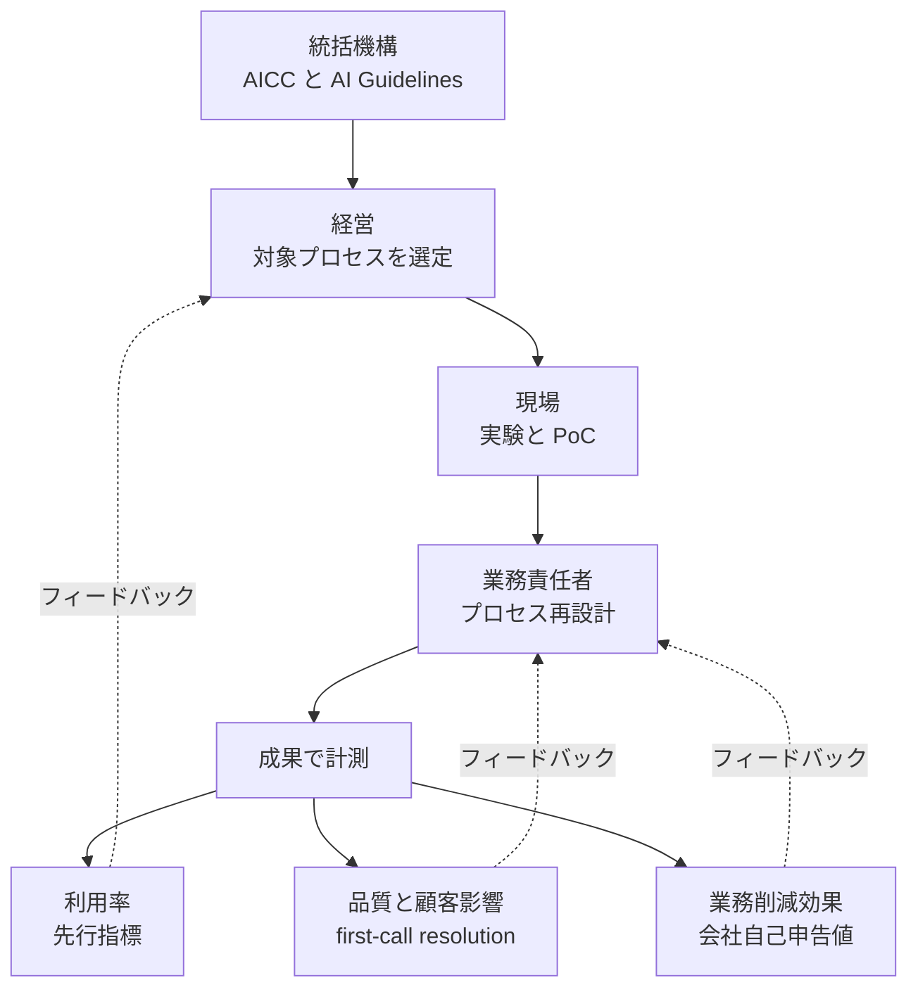

> 想定読者は、AI 導入の意思決定を担う発注側・経営層、および情シス・事業部リードです。実装エンジニア向けのハウツーではありません。
> この記事は Deutsche Telekom（以下 DT）を代表ケースとして、AI 導入を「ツール展開（利用率 KPI）」ではなく「業務プロセス単位の運営モデル再設計」として評価・設計・計測する方法を構造化します。
> 調査日は 2026-07-12 です。効果値は原則として一次ソースで裏取りし、裏が取れないものは `[二次情報]` `[未確認]` を明記します。

## この記事の要点

DT は「社内チャットを配った」段階に留まりません。社内生産性・顧客対応・ネットワーク運用・音声サービス・B2B の各業務レイヤに AI を段階的に組み込み、その全体を **AI Competence Center（AICC）** という機構で統括しています[一次]。

本記事は、この動きを「AI ツールを配ったか（利用率）」ではなく「どの業務プロセスを、誰の責任で、どの成果指標で作り替えたか（運営モデル再設計）」という軸で分解します。結論を先取りすると、DT は「経営によるプロセス選定 → 現場実験 → 業務責任者による再設計 → 成果計測」という**構造**を明確に実践しています。

ただし公表される効果値には注意が必要です。顧客対応の削減時間や自律解決率などの一部の成果は DT 自身の一次資料でも公表されていますが、それらは**会社自己申告値**です。独立検証された ROI（コスト削減額・NPS 向上幅など）はまだ乏しく、OpenAI 提携も 2026-07 時点で全社展開・ワークフロー再設計段階に入ったばかりです。

したがって DT は「鵜呑みにする模範解」ではなく「構造を分解して自社フレームに翻訳する素材」として使うのが妥当です。効果値は、一次で裏が取れるものと自己申告値とを区別して扱います。

## AI 導入を「運営モデル再設計」として見る理由

AI 導入案件の評価軸は、しばしば「どのツールを何%の従業員が使うか」という利用率に偏ります。しかし利用率は先行指標にすぎません。業務の成果（品質・顧客影響・工数削減）まで到達したかは、利用率だけでは分かりません。

そこで本記事は評価軸を次のように置き換えます。

- 従来軸: ツールの利用率（どのツールを何%が使うか）
- 提案軸: 業務プロセス単位の運営モデル再設計（どの業務プロセスを、誰の責任で、どの成果指標で作り替えたか）

DT はこの提案軸で分解すると、構造が明確に見える代表ケースです。

ここでの「運営モデル再設計」とは、AI を既存業務にただ載せるのではなく、対象プロセスの選定・人間と AI の役割分担・成果指標までを一体で組み替える取り組みを指します。

## DT の全体像: 業務レイヤ × 計測タイプ

DT の AI 導入を「業務レイヤ × 何を計測しているか」で並べると、以下のようになります。数値のソース種別を併記します。

- **統括機構**: 「several hundred AI systems」を **AICC** が統括。B2B は **T-Systems の AI Factory** が担当。単発ツール配布ではなく組織機構として運営[一次: telekom.com]
- **社内生産性**: 社内チャット **AskT**（2024 社内ローンチ → 2025 Q1 にギリシャ/ハンガリーへ国際展開、モデルは UnifyApps と OpenAI/GPT 4.0）[一次: Annual Report 2025]。**AI Engineer**（T-Systems、2023〜稼働）は 40 年前の FAME を Python へ変換し、ドキュメント/テストも自動生成[一次: telekom.com]
- **顧客対応**: **Frag Magenta（Ask Magenta）** は 380 種類超の相談項目に対応可能。**2022 年時点で「懸案の 3 分の 1 以上を即座に解決」**（残りは解決不可時・顧客希望時に人間へ移管）[一次、2022 データ]。**DT 発表では 2025 年に約 700 万対話・56% を自律解決**[一次: DT 2025 年度スピーチ]。郵送処理 AI **Sherloq** は年間約 100 万通を処理し、**全顧客要望の 80% を認識して適切な処理先へ転送**[一次]
- **ネットワーク運用**: **2024 年 8 月以降、LLM で一部のトラブルチケットを生成**[一次: Annual Report 2025]。**RAN Guardian Agent**（Google Gemini 2.5 + CloudRun/BigQuery/Firestore、マルチエージェント 3 ステップ）が公開イベント検出 → アンテナ容量評価 → リソース再配分を自律実行し、**「従来約 1 時間かかった処理を数分で」**[一次: DT media]。**2026 年 2 月の後続一次発表では、初月に 100 件超の remediation actions を自律 trigger**[一次: DT/Google MINDR リリース]
- **音声サービス**: **Magenta AI Call Assistant**（ElevenLabs と共同、MWC 2026 で発表）。アプリ不要・端末非依存でネットワークに組込み、「Hey Magenta」で起動しライブ翻訳・通話サマリ・文脈支援を提供。**2026 年中のドイツ提供開始と、発表から 12 か月以内に最大 50 言語対応を計画**[一次: DT media]
- **B2B**: T-Systems **AI Foundation Services**、Business GPT、**Industrial AI Cloud**（Nvidia 他と 2026 年 2 月稼働）[一次: Annual Report 2025]
- **全社提携（発展中）**: **2025 年 12 月に OpenAI と複数年戦略提携**、ChatGPT Enterprise を全社展開。**2026 年 7 月の OpenAI ケースでは月間アクティブ利用 50,000 人超・2026 年初から利用量 +546%** と報告[当事者一次・非独立: telekom.com/openai.com]。**ただしこれはベンダー顧客事例の自己申告で、削減額・品質改善など独立検証済み outcome は未公表**
- **ガバナンス先行**: **2018 年に 9 つの self-binding AI Guidelines** を策定[一次]。EU AI Act 対応・Digital Ethics assessment を全 AI に義務付け[一次]

### 計測指標の実像: 利用率 vs 成果

| 指標タイプ | 具体値 | ソース種別 | 注記 |
|---|---|---|---|
| 利用率（先行指標） | 従業員 53% が業務で定常的に AI 利用（2025 年 11 月、5 月比 +9pt） | 一次（Annual Report、自己申告サーベイ） | 「定常」の定義・役職別分布は非公表 |
| 顧客対応の成果 | Frag Magenta 自律解決 56%（2025、約 700 万対話）／2022 は「3 分の 1 以上を即時解決」／Sherloq 80% 認識 | 一次（DT スピーチ／投資家資料・会社自己申告） | 時系列で上昇。定義（solved/deflected）差あり |
| 顧客対応の成果 | first-call resolution 76.0%（2025）vs 74.1%（2024） | 一次（Annual Report Efficiencies） | AI 単独への帰属は分離されていない |
| 顧客対応の成果 | 約 1.6M 件の顧客リクエスト解決／約 133,000 call center hours 相当 | 一次（DT CEO Q2 2025 スピーチ・投資家資料、会社自己申告） | 資料により「solved requests」「deflected calls」と表現差 |
| ネットワーク運用の成果 | 「約 1 時間 → 数分」／初月 100 件超の自律 remediation | 一次（DT media） | 75%/25% 自律・人間関与比は二次（Omdia） |
| （参考）通話時間短縮 | 平均 -35% | `[二次情報: Stanford GSB ケース]` | DT 一次資料に不在、母集団・算出法不明 |
| （参考）CSAT 向上 | +25% | `[未確認]` | DT 一次で確認できず、本記事は効果値として採用せず |

## 運営モデルのループ構造

DT の運営モデルは「経営がプロセスを選び、現場が実験し、業務責任者が再設計し、成果で計測する」ループとして表せます。

### 図の各要素

| 要素名 | 説明 |
|---|---|
| 統括機構 | AICC（経営ボード傘下）と 2018 年策定の AI Guidelines・EU AI Act 対応を含むガバナンス層 |
| 経営 | 対象プロセス（顧客対応・NW 運用・音声・社内・B2B）を選定する主体 |
| 現場 | Frag Magenta・RAN Guardian・AskT などで実験と PoC を実施する層 |
| 業務責任者 | 人間と AI の役割分担・移管ルールを設計してプロセスを再設計する主体 |
| 成果で計測 | 再設計後の業務を成果指標で計測する工程 |
| 利用率 | 従業員 53% 定常利用などの先行指標 |
| 品質と顧客影響 | first-call resolution 76.0% などの品質指標 |
| 業務削減効果 | 約 1.6M 件・約 13.3 万時間相当の会社自己申告値 |

利用率（先行指標）は DT が明確に公表しています。一方、業務削減効果は DT 一次資料に数値があるものの**会社自己申告**であり、独立検証された ROI や AI 帰属の分離は薄い層です。この「利用率は堂々公表・成果値は自己申告」という性質が、本記事の核心的な注意点です。

## 業務レイヤ別の要点

### 顧客対応レイヤ（Frag Magenta / Sherloq）

確立している事実は次のとおりです。380 種類の相談項目への対応可能・2022 年に「3 分の 1 以上を即時解決」・年 400 万対話（2022）・Sherloq 80% 認識は、いずれも一次ソースです。DT スピーチによれば自律解決率は 2025 年に 56% まで上昇しました。役割分担（AI が定型、人間が複雑）を「移管がシームレス」と設計している点が運営モデル的です[一次]。

不確実性と反証もあります。即時解決率の補数を「すべて人間対応」とは断定できません（非即時の自動解決・離脱等の内訳は非公表）。第三者レビューサイトの企業総合評価は低いものの、AI 対応や特定ケースへの因果帰属はできません（取得日・母集団不明）`[二次情報]`。「CSAT +25%」は `[未確認]` です。自律解決率だけを成果と見なすと、非定型ケースの体験を見落とします。

### ネットワーク運用レイヤ（LLM ticket / RAN Guardian）

確立している事実は次のとおりです。LLM ticket（2024/08〜）、RAN Guardian が「1 時間 → 数分」・初月 100 件超の自律 remediation を一次で主張しています。3 ステップはエージェント間の機能分解です[一次]。

不確実性と反証もあります。スコープは **RAN 限定**で、汎用の自律ネットワークではありません。「75% 自律・25% 人間関与」は `[二次情報: Omdia、DT 推計・母数期間非公表]` です。「自律化」を過大評価しないよう注意します。

### 音声・消費者レイヤ（Magenta AI Call Assistant / T Phone）

確立している事実は次のとおりです。ネットワーク組込・アプリ不要・opt-in・最大 50 言語（発表から 12 か月計画）は一次です。プライバシー設計を運営モデルに組み込んでいます[一次]。

不確実性と反証もあります。発表段階（MWC 2026、2026 年中にドイツ開始予定）であり、実測 CX データはありません。T Phone（Perplexity ベース）には「マーケティング先行」との批判があります[二次: heise/ZDF]。

### 社内生産性・全社提携レイヤ（AskT / OpenAI 提携）

確立している事実は次のとおりです。AskT の国際展開、AI Engineer の実務投入は一次です。OpenAI 提携で ChatGPT Enterprise を全社展開し、2026-07 時点で月間アクティブ 50,000 人超・利用量 +546% です[当事者一次・非独立]。

不確実性と反証もあります。従業員 53% 利用・利用量 +546% は**利用率（採用指標）**であり、outcome 指標ではありません。年次報告書は定性記述が中心で、AI 帰属 ROI（削減額/NPS）を分離公表していません。まさに本記事が警告する「利用率で止まる」リスクを、DT 自身も内包しています。

## 支持エビデンス vs 反証

### 現在の主要な結論

AI 導入は「ツール展開（利用率 KPI）」ではなく「業務プロセス単位の運営モデル変更」として設計・計測すべきです。DT はその**構造**（経営のプロセス選定＋現場実験＋業務責任者の再設計＋成果計測）を実践する代表ケースです。

### 支持エビデンス

- 統括機構 AICC＋2018 年 AI Guidelines＋EU AI Act 対応という「機構・ガバナンス先行」[一次]
- 業務レイヤごとの「AI と人間の役割分担・移管ルール」設計（Frag Magenta の human handoff 設計、RAN Guardian のエージェント間機能分解）[一次]
- 成果指標の一部公表: first-call resolution 76.0%（2025）、Frag Magenta 自律解決 56%（2025）、約 1.6M 件解決／約 13.3 万時間相当、RAN「1 時間 → 数分」[一次・会社自己申告]
- 規範面での Gartner/McKinsey の三層 KPI（usage → process → outcome）との整合

### 反証

- **効果値が会社自己申告に偏る**: 「1.6M 件/約 13.3 万時間」は DT 一次だが自己申告で独立検証なし。「35% 通話短縮」は Stanford GSB ケース（二次）、「CSAT +25%」は未確認。DT 年次報告書は AI 帰属 ROI を分離公表せず
- **利用率依存**: 最も明確に公表される数字が「従業員 53% 利用」「利用量 +546%」という採用指標そのもの
- **経営の主眼はコスト/人員削減**: Capital Markets Day 2024 で CFO Illek「人員は継続的に削減」、CEO Höttges「chatbot で 25-30% の効率化を想定」（将来予測、実測ではない）[準一次: Light Reading]。「品質・顧客影響で計測」という評価軸と温度差
- **段階性**: OpenAI 提携は 2025/12 開始で、2026-07 に全社展開・ワークフロー再設計段階だが、独立検証済み outcome は未公表。RAN Guardian は RAN 限定
- **CX の負の側面**: 第三者レビューサイトの企業総合評価は低い[二次、因果帰属不可]

### 総合評価

規範的主張（「運営モデル変更として設計・計測せよ」）は堅牢です。DT を「構造の good example」とするのは妥当です。ただし「品質・顧客影響・業務削減効果を独立検証可能に計測している完成事例」と断じるのは、現時点では過大です（公表される効果値は会社自己申告）。**構造は模倣価値があり、効果値は一次・自己申告である旨を明記して扱う**、が安全な読み方です。

## 効果値の扱い方: 一次/二次/未確認の区別

意思決定の根拠として効果値を扱うとき、ソース強度を必ず区別します。

| 区分 | 具体例 | 意思決定での扱い |
|---|---|---|
| 一次（会社自己申告） | 約 1.6M 件解決・約 13.3 万時間相当、first-call resolution 76.0%、自律解決 56% | 数値として引用可能。ただし「独立検証済み ROI」ではなく「会社自己申告」と明記 |
| 二次 | 「35% 通話短縮」（Stanford GSB） | 先行指標にとどめ、意思決定の主根拠にしない |
| 未確認 | 「CSAT +25%」 | 効果値として採用しない |

この区別を崩すと、ベンダーやエージェンシーのケーススタディ数値を独立検証済み ROI と誤認します。

## 自社に一般化する評価フレーム

### 意思決定の必須項目

AI 導入案件を承認・評価する際、「どのツールを何%が使うか」ではなく「**どの業務プロセスを、誰の責任で、どの成果指標で作り替えるか**」を必須項目にします。DT の構造を自社版に翻訳します。

### DT から抽出できる再現可能な原則

1. **経営が対象プロセスを選ぶ**（利用率を目的化しない）。DT は顧客対応・NW 運用・音声など「効果が測れる業務」を選定
2. **統括機構を置く**（DT の AICC）。ガバナンス（AI ガイドライン/規制対応）を導入前に用意
3. **現場実験と業務責任者の再設計を並行**（AI と人間の役割分担・移管ルールを業務責任者が設計）
4. **計測は三層で**: 利用率（先行指標）→ 品質・顧客影響（first-call resolution 等）→ 業務削減効果（工数・コスト）。利用率で止めない
5. **効果値は一次で裏取り**。ベンダー/エージェンシーのケーススタディ数値は先行指標にとどめ、意思決定の根拠にしない

### 汎化しにくい点（逆転条件）

- T-Labs / AICC / 主権データセンター / Global Telco AI Alliance など、DT の規模・資本・データ資産に依存する実装手段は中小には非再現
- ドイツ固有の労働制約: 2026 年 5 月 28 日の ver.di 協約で、対象となる協約適用従業員（約 6 万人）について 2028 年 12 月 31 日まで経営上の理由による雇用終了解雇を除外[一次]、Betriebsrat の共同決定権、EU AI Act（透明性義務の一部は 2026/08/02〜、高リスク規則は AI Omnibus により延期）。「業務削減効果」を成果指標に掲げる際は労働・規制コストを織り込む必要

### 直近の次のアクション

1. 自社の AI 案件を「業務レイヤ × 計測タイプ」表に落とし、利用率しか測っていない案件を洗い出す
2. 各案件に「品質・顧客影響」の outcome 指標を 1 つ以上必須化（DT の first-call resolution が参考）
3. ベンダー提示の効果値は一次ソースを要求し、無ければ先行指標扱いに格下げ

## まとめ

DT の全社 AI 導入は、「経営のプロセス選定 → 現場実験 → 業務責任者の再設計 → 成果計測」という運営モデルの**構造**として見ると、自社に翻訳できる再現可能な原則が抽出できます。ただし公表される効果値は会社自己申告が中心のため、構造は模倣し、効果値は一次/二次/未確認を区別して扱うのが安全です。

この記事が少しでも参考になった、あるいは改善点などがあれば、ぜひリアクションやコメント、SNS でのシェアをいただけると励みになります！

## 参考リンク

- 公式ドキュメント（一次）
  - [Artificial intelligence at Deutsche Telekom](https://www.telekom.com/en/company/digital-responsibility/details/artificial-intelligence-at-deutsche-telekom-1055154)
  - [DT Annual Report 2025 - Data & AI](https://report.telekom.com/annual-report-2025/management-report/group-strategy/data-ai.html)
  - [DT Annual Report 2025 - Efficiencies](https://report.telekom.com/annual-report-2025/management-report/group-strategy/efficiencies.html)
  - [DT CEO Q2 2025 スピーチ（約1.6M 件解決・約133,000 call center hours）](https://www.telekom.com/resource/blob/1094896/3f6e1ab099857aadd666f344cbda4e6d/dl-dtag-q2-speech-hoettges-data.pdf)
  - [DT Q2 2025 投資家資料（1.6mn calls deflected）](https://www.telekom.com/resource/blob/1094644/e532ac3f070e9e627e136d6220fdf3ff/dt-25q2-presentation-data.pdf)
  - [DT 2025年度スピーチ（Frag Magenta 約700万対話・56% 自律解決）](https://www.telekom.com/resource/blob/1102188/067b31b699ccbbd48d29997a8877c3f4/dl-speech-hoettges-ar-2025-data.pdf)
  - [AI agents for mobile network / RAN Guardian Agent now live](https://www.telekom.com/en/media/media-information/archive/ai-agents-for-mobile-network-1099054)
  - [MINDR – AI agents in the network（初月100件超の自律 remediation）](https://www.telekom.com/en/media/media-information/archive/mindr-ai-agents-in-the-network-1102724)
  - [Deutsche Telekom reimagines phone calls with AI embedded in the network](https://www.telekom.com/en/media/media-information/archive/deutsche-telekom-reimagines-phone-calls-with-ai-embedded-in-the-network-1102890)
  - [OpenAI and Telekom collaborate](https://www.telekom.com/en/media/media-information/archive/openai-and-telekom-collaborate-1100164)
  - [Deutsche Telekom und ver.di erzielen Tarifeinigung（2028末まで解雇除外）](https://www.telekom.com/de/medien/medieninformationen/detail/deutsche-telekom-und-ver-di-erzielen-tarifeinigung-1105358)
  - [EU 理事会 AI Act タイムライン](https://www.consilium.europa.eu/en/policies/artificial-intelligence-act/timeline-artificial-intelligence/)
- 当事者一次・非独立（提携当事者の発表）
  - [Bringing powerful AI to millions across Europe with Deutsche Telekom](https://openai.com/index/deutsche-telekom-collaboration/)
  - [OpenAI 顧客ケース Deutsche Telekom（月間アクティブ 50,000 人超・利用量 +546%）](https://openai.com/index/deutsche-telekom/)
  - [ElevenLabs blog - Deutsche Telekom AI Call Assistant](https://elevenlabs.io/blog/deutsche-telekom-ai-call-assistant)
- 二次
  - [Omdia - RAN Guardian Agent proves agentic AI is not just hype（75%/25% は DT 推計）](https://omdia.tech.informa.com/om138387/deutsche-telekoms-ran-guardian-agent-proves-agentic-ai-is-not-just-hype)
  - [Stanford GSB case - Deutsche Telekom in 2025: The Dancing Elephant in the Age of AI（35% 通話短縮）](https://www.gsb.stanford.edu/faculty-research/case-studies/deutsche-telekom-2025-dancing-elephant-age-ai)
  - [Light Reading - Artificial intelligence to eat jobs at Deutsche Telekom](https://www.lightreading.com/ai-machine-learning/artificial-intelligence-to-eat-jobs-at-deutsche-telekom)
- 未確認（本文で効果値として不採用）
  - [The future of customer service: how AI redefined customer experience at Telekom（CSAT +25%、DT 一次で未確認）](https://hellodigital.com/article/the-future-of-customer-service-how-ai-redefined-customer-experience-at-telekom)
