PR のテストを「通るか」ではなく「意図した差分だけが存在するか」で見る手法を整理します。DiffTestGen は GitHub の PR を入力に、変更前後のコードの振る舞い差を露出させるテストを LLM で生成します。変更差分を起点にテストを誘導し、private 関数への到達経路を LLM へ明示的に渡す点が特徴です。この記事では、その概要と特徴から、構造・データモデル・構築方法・利用方法、そして運用と限界までを扱います。

> 検証時点: 2026-07-21

## この記事の前提

| 項目 | 値 |
|---|---|
| 調査対象 | DiffTestGen: Change-Directed LLM-Based Testing for Exposing Behavioral Differences |
| arXiv ID | [2607.16024v1](https://arxiv.org/abs/2607.16024) (cs.SE) |
| 投稿日 | 2026-07-17 |
| 著者 | Huimin Hu (CISPA Helmholtz Center for Information Security) / Cristian Cadar (Imperial College London) / Michael Pradel (CISPA Helmholtz Center for Information Security) |
| 公開実装 | [sola-st/DiffTestGen](https://github.com/sola-st/DiffTestGen) (MIT License, Python) |
| 論文ライセンス | arXiv nonexclusive-distrib/1.0 |
| 対象言語 | Python |

## 先に押さえる 3 点

1. **DiffTestGen が検出するのは「振る舞い差」であり「回帰バグ」ではありません。**
   論文の funnel は 70 PR → LLM 分類器で 7 PR → 手動精査で実回帰 5 件 / false positive 2 件です。
   最終オラクル (意図どおりの変更か回帰か) は手法の外側に必要です。
2. **数値は per-dataset で読みます。** abstract の「463 PR で 78.2%」は集計値です。
   内訳は Testora data 350/439 (79.7%)、ChaCo data 21/34 (61.8%, gpt-4o-mini) で、
   2 データセットは 10 PR 重複します。論文は 78.2% の内訳計算を明示していません。
3. **公開実装は「研究再現ハーネス」です。** MIT ライセンスの実装が公開されていますが、
   pandas / scipy / keras / marshmallow の 4 プロジェクトに固定されており、汎用 CLI ではありません。
   自分のプロジェクトへ持ち込む部分は本文で「実装案」と明示しています。

> **図版について**: 本論文のライセンスは `nonexclusive-distrib/1.0` であり CC-BY ではないため、
> 論文図版は転載せず、本文からリンクで参照します。図解はすべて本調査で作成した mermaid 図です。
> 論文図の対応は Figure 1 (motivating example) / Figure 2 (全体概要) / Figure 3 (access information の例) /
> Figure 5 (手法比較) / Figure 6 (DiffTestGen だけが検出した例) です。

## 概要

DiffTestGen は、GitHub の PR (プルリクエスト) を入力に、変更前後のコードの**振る舞い差 (behavioral difference)** を露出させるテストを LLM で自動生成する手法です。論文タイトルは「Change-Directed LLM-Based Testing for Exposing Behavioral Differences」で、2026-07-17 に arXiv (2607.16024v1, cs.SE) へ投稿されました。著者は Huimin Hu, Cristian Cadar, Michael Pradel の 3 名です。対象言語は Python に限定されます。実装は MIT ライセンスで [sola-st/DiffTestGen](https://github.com/sola-st/DiffTestGen) に公開されています。

### 何のために生まれたか

論文は、既存のテスト生成手法に共通する 2 つの限界を指摘します。

| 限界 | 内容 |
|---|---|
| 限界 1 | 多くのテスト生成手法はコード変更に誘導されていません。変更箇所を実行しないテストを生成しがちです |
| 限界 2 | 変更箇所が到達困難です。private 関数など、public な入口から直接呼べない関数への到達経路が不明なことが多いです |

既存の回帰テスト手法 (Testora など) は、変更箇所を実行する既存テストが存在することに依存します。しかし実際には、そのような既存テストが無いことが多いです。DiffTestGen は、この 2 つの限界に対して、変更差分 (diff) を起点にテストを生成する仕組みと、変更関数への到達経路を LLM に明示的に教える仕組みで応えます。

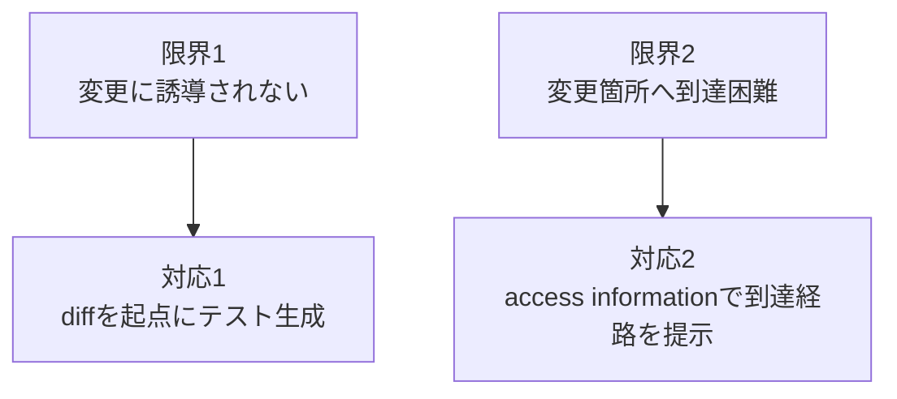

| 要素名 | 説明 |
|---|---|
| 限界1 変更に誘導されない | 既存の多くのテスト生成手法は変更コードを狙って実行しません |
| 限界2 変更箇所へ到達困難 | private 関数などは public な入口から直接呼べません |
| 対応1 diffを起点にテスト生成 | PR の diff を解析し、変更関数を狙ってテストを生成します |
| 対応2 access informationで到達経路を提示 | 変更関数の呼び出し経路情報を LLM に与えます |

### 関連手法との比較

DiffTestGen は Testora の実装を土台に構築されています。論文本文には「We implement DiffTestGen on top of Testora, adding around 2,800 lines of code in its core components.」と明記されています。比較対象には、直接のベースラインである Testora / Testora++ / ChaCo に加え、一般的な自動テスト生成 (EvoSuite 系) と一般的な回帰テストも含めます。

| 手法 | 生成の誘導目標 | 変更箇所への到達手段 | オラクル | カバレッジ指標 | 対象言語 |
|---|---|---|---|---|---|
| DiffTestGen | PR の diff。変更関数の振る舞い差の露出 | access information (public/private/special の 3 分類) + 静的コールグラフの top-k 最短パス | 新旧版の出力・ランタイムエラー型の不一致 (flaky は再実行で除去) | union coverage (新旧両版の変更行カバレッジを合成した新規指標) | Python |
| Testora | PR のタイトル・説明などの自然言語意図 | 明示的な到達経路情報は持たない | 新旧版の出力比較 + LLM による意図判定 (intended/regression) | 専用のカバレッジ指標は定義していない | Python |
| Testora++ | Testora と同じ (初回生成テスト数のみ 20 → 100 に増量した対照条件) | Testora と同じ | Testora と同じ | Testora と同じ | Python |
| ChaCo | PR の未カバー行 (patch coverage) を埋めること | 既存テストの文脈 (テスト関数・fixture・データ生成器) を再利用するが、変更関数への到達経路情報は持たない | 生成テストがランタイムエラー・失敗無く既存スイートへ統合できること (振る舞い差の検出目的ではない) | patch coverage (変更行カバレッジ) | Python |
| 一般的な自動テスト生成 (EvoSuite 系) | コードベース全体のカバレッジ最大化 (変更非依存) | なし。public な入口からの到達を前提にするが、変更箇所への到達は保証されません | 例外・クラッシュ検出が中心。新旧比較のオラクルは持ちません | 行・分岐カバレッジ (変更非依存) | プロジェクト全体 (Java 向けの EvoSuite が代表例) |
| 一般的な回帰テスト | 既存テストスイートの再実行 (新規生成なし) | 既存テストに依存。変更箇所を通らないテストがあれば検出できません | 既存テストの assert | 既存テストのカバレッジ (変更箇所を覆う保証なし) | テストフレームワーク依存 |

Testora と ChaCo は、それぞれ別の一次研究として公開されています。

- Testora: 「Testora: Using Natural Language Intent to Detect Behavioral Regressions」(arXiv 2503.18597)。PR の自然言語情報を使って意図した変更か回帰かを分類します
- ChaCo: 「Change And Cover: Last-Mile, Pull Request-Based Regression Test Augmentation」(arXiv 2601.10942, ICSE 2026)。PR の未カバー行を埋めるテスト増強を目的とし、既存テストスイートへ統合できる品質のテストを生成します

### ユースケース別の推奨

| 状況 | DiffTestGen の有効性 | 理由 |
|---|---|---|
| private 関数を変更した PR で、到達経路が不明 | 有効性が期待できます | access information が到達経路を LLM に提示します |
| 変更箇所を実行する既存テストが無い | 有効性が期待できます | diff 起点でテストを新規生成するため、既存テストの有無に依存しません |
| Python かつ構造・ドキュメントが整ったプロジェクト | 有効性が期待できます | access information の抽出が静的コールグラフとドキュメントに依存します |
| 変更が typing 改善・リファクタ・互換性調整・dtype 安定化など非機能的なもの | 期待しにくいです | 論文の 69 PR (3 手法すべて失敗) はこの種の変更が中心でした |
| Python 以外の言語のプロジェクト | 対象外です | 論文の評価は Python の 4 プロジェクトに限定されています |
| 設定ファイルのみの変更、コメント・ドキュメントのみの変更 | 対象外です | 論文の対象スコープから明示的に除外されています |
| 変更する非テストソースファイルが 4 つ以上の大規模 PR | スコープ外です | 論文はスケーラビリティ対策として最大 3 ファイルまでを対象にしています |
| 最小コストで素早くスクリーニングしたいだけの場合 | 素の Testora の方が向きます | 論文の RQ3 では、Testora が最も低コスト ($0.018/PR, 8.92 分) でした |

論文が示したのはデータセット全体での平均的な改善です。個別 PR での検出を保証するものではありません。

## 特徴

- **union coverage という新規メトリクスで効果を測る**: 旧版と新版の両方における変更コードのカバレッジを合成した指標です。外側ループはこの union coverage を反復的に改善する目的で回ります。Testora data (439 PR) での実測は DiffTestGen **92.7%** に対し、Testora 77.1% / Testora++ 80.7% で、新規指標を定義しただけでなく実際に優位を示しています (論文 RQ1)
- **access information を 3 分類で切り替える**: 変更関数を public / private / special method に分類し、分類ごとに異なる到達経路情報を LLM へ渡します。private 関数でも、テストは public API 経由でのみ実行させる設計です。private 関数を直接叩くテストを書かせるのではなく、到達経路そのものを教える点が特徴です
- **静的コールグラフから到達経路を導出する**: ノードを関数、エッジを呼び出し関係とする有向グラフを構築します。private 関数については、公開された entry 関数までの top-k 最短コールパスを BFS 的に探索します
- **三重ループ構造で反復的にテストを改善する**: 内側 2 ループ (生成テストの静的妥当性エラー解消、実行時に判明したランタイムエラーへの対応) と、外側 1 ループ (カバレッジ確認) で構成されます。停止条件は、カバレッジが 100% に到達した場合、または前ラウンドから変化が無い場合です
  > **注意**: 内側ループの修正試行上限 (5 回) と、論文 Table IV が報告する外側ループのラウンド (R0〜R4) は、
  > どちらも「5」に見えますが**独立した別のカウンタ**です。混同しないでください。
  > なお R4 は**実験で観測された最大ラウンドであり、実装上の固定上限ではありません**。
  > 公開実装 (`RegressionFinder.py`) に `round <= 4` の上限は無く、カバレッジが伸び続ける限り次ラウンドへ進みます
- **flaky なテストを除去してから振る舞い差を報告する**: タイムスタンプなどの付随情報を正規化したうえで、各生成テストを新旧両版で再実行します。初回と結果が異なるテストは flaky として破棄します
- **回帰バグ検出の一段手前を担う**: DiffTestGen が検出するのは「振る舞い差」であり、「回帰バグ」そのものではありません。論文では、DiffTestGen だけが差を検出した 70 PR を対象に別の LLM 分類器で意図判定した結果、7 PR が回帰と分類され、手動精査の結果 5 件が実際の回帰バグでした。振る舞い差の検出割合と実回帰の件数は、異なるレイヤーの数字として扱う必要があります
- **効かないケースがある**: 論文の評価では、Testora / Testora++ / DiffTestGen の 3 手法すべてが振る舞い差を検出できなかった PR が 69 件ありました。内容は typing 改善・リファクタ・互換性調整・dtype 安定化など、非機能的で振る舞いへの影響が小さい変更が中心でした

  > **69 と 70 を混同しないでください。** 本記事には隣接した 2 つの数字が出てきます。
  > **70 PR** は「DiffTestGen **だけ**が振る舞い差を検出した」PR 数 (上乗せ効果の分子)。
  > **69 PR** は「3 手法**すべて**が検出できなかった」PR 数 (手法共通の限界)。
  > 指す対象が逆向きです。

## 構造

DiffTestGen は単体の製品ではなく、論文が提案するフレームワークです。本セクションでは、その論理構造を C4 model の 3 段階 (システムコンテキスト図 / コンテナ図 / コンポーネント図) と、処理の流れを表す制御フロー図で示します。

### システムコンテキスト図

DiffTestGen を取り巻くアクターと外部システムの関係を示します。

```mermaid
graph TB
    Developer["開発者"]
    Reviewer["レビュアー"]
    CI["CI"]
    System["DiffTestGen"]
    GitHub["GitHub"]
    LLMProvider["LLMプロバイダ"]
    ExecEnv["テスト実行環境"]
    TargetProject["対象Pythonプロジェクト"]

    Developer -->|"PRを作成する"| GitHub
    CI -->|"DiffTestGenを<br/>起動する"| System
    System -->|"PRとdiffを<br/>取得する"| GitHub
    System -->|"テスト生成を<br/>依頼する"| LLMProvider
    LLMProvider -->|"生成テストを<br/>返す"| System
    System -->|"生成テストを<br/>実行させる"| ExecEnv
    ExecEnv -->|"新旧版の<br/>コードを実行する"| TargetProject
    System -->|"振る舞い差<br/>レポートを提示する"| Reviewer
```

| 要素名 | 説明 |
|---|---|
| 開発者 | PRを作成し変更を提案する人です |
| レビュアー | 生成テストと振る舞い差レポートを確認する人です |
| CI | DiffTestGenの実行をパイプラインから起動する仕組みです |
| DiffTestGen | 変更誘導型の差分テスト生成フレームワーク本体です |
| GitHub | PRとコード差分を提供するホスティングサービスです |
| LLMプロバイダ | テストコードを生成する大規模言語モデルの提供元です |
| テスト実行環境 | 生成テストを新旧版で分離して実行する環境です |
| 対象Pythonプロジェクト | テスト対象となるOSS Pythonプロジェクトのコードベースです |

### コンテナ図

DiffTestGen 内部の主要構成要素を示します。各要素は論文 II-C〜II-F の節に対応します。

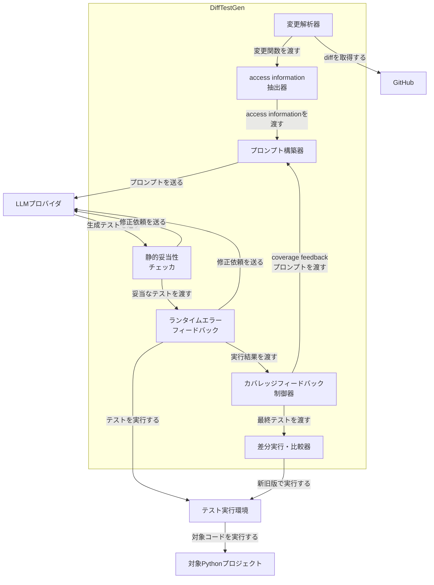

| 要素名 | 説明 |
|---|---|
| 変更解析器 | PRのdiffを取得し、変更関数の抽出とaccessibility分類を行います |
| access information抽出器 | 変更関数ごとに到達方法の情報を抽出します |
| プロンプト構築器 | 初期プロンプトとcoverage feedbackプロンプトを構築します |
| 静的妥当性チェッカ | 生成テストがASTとして解析できるか、private関数を呼んでいないかを検証します |
| ランタイムエラーフィードバック | 生成テストを実行しランタイムエラーをLLMへ返します |
| カバレッジフィードバック制御器 | union coverageを算出し、次ラウンドを起動するか停止するかを判定します |
| 差分実行・比較器 | 新旧版でテストを実行し、出力とエラー型の違いから振る舞い差を判定します |
| GitHub | PRとコード差分を提供するホスティングサービスです |
| LLMプロバイダ | テストコードの生成と修正を行う大規模言語モデルの提供元です |
| テスト実行環境 | 新旧版のコミットをそれぞれ分離して実行する環境です |
| 対象Pythonプロジェクト | テスト対象となるOSS Pythonプロジェクトのコードベースです |

### コンポーネント図

各コンテナをさらに分解します。実装 (sola-st/DiffTestGen、Testora上に構築) のモジュール構成で対応が確認できたものは、説明に補記します。

#### 変更解析器

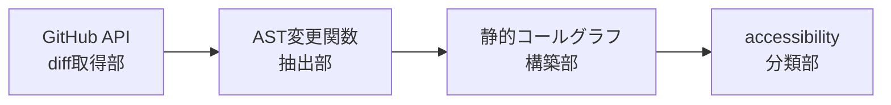

| 要素名 | 説明 |
|---|---|
| GitHub API diff取得部 | GitHub APIでPRのdiffを取得します |
| AST変更関数抽出部 | diffをASTベースで解析し、変更関数の名前と本体を抽出します |
| 静的コールグラフ構築部 | 関数をノード、呼び出し関係をエッジとする有向グラフを構築します。実装ではlibcstとmultilspy(言語サーバー)を使うモジュール(ExtractCallerCallee)が対応します |
| accessibility分類部 | 変更関数をpublic、private、special methodの3種に分類します。実装ではis_public判定を行うモジュール(PrivateIdentification)が対応します |

#### access information 抽出器

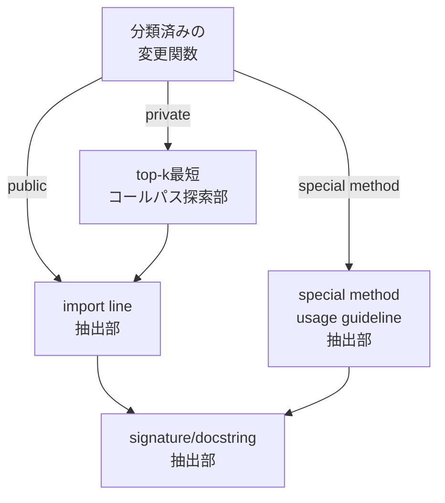

| 要素名 | 説明 |
|---|---|
| 分類済みの変更関数 | 変更解析器から渡されるpublic、private、special methodいずれかに分類済みの関数です |
| top-k最短コールパス探索部 | private関数からpublicなentry関数へのコールパスをキューで辿るBFS的な探索を行い、再帰を含むパスを除外して上位k件を記録します |
| import line抽出部 | 対象関数または対象クラスのimport文を抽出します |
| signature/docstring抽出部 | 対象関数またはクラスのシグネチャとdocstringを抽出します |
| special method usage guideline抽出部 | special methodの一般的な使用方法のヒントを抽出します |

#### プロンプト構築器

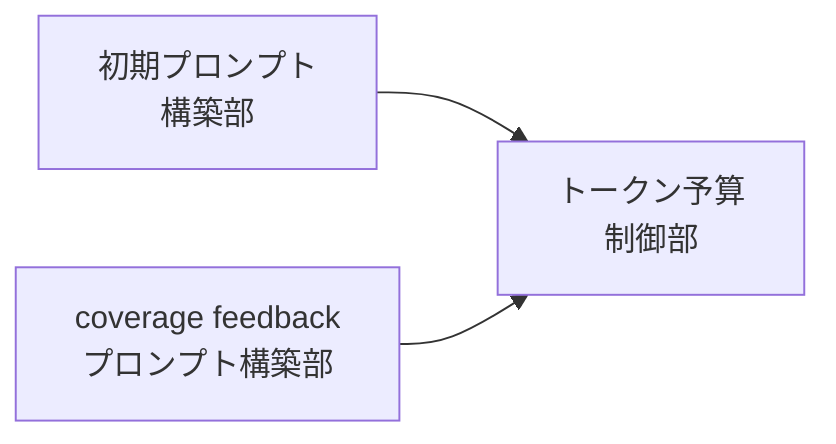

| 要素名 | 説明 |
|---|---|
| 初期プロンプト構築部 | プロジェクト名、diff、変更関数の完全修飾名、関数本体、access informationから初回プロンプトを構築します |
| coverage feedbackプロンプト構築部 | 未カバーの変更関数に絞ったaccess informationと関数本体、reference testからラウンド用プロンプトを構築します |
| トークン予算制御部 | トークン長制約の範囲でオプション要素(関数本体、access information、テスト本体)を取捨選択します |

#### 静的妥当性チェッカ

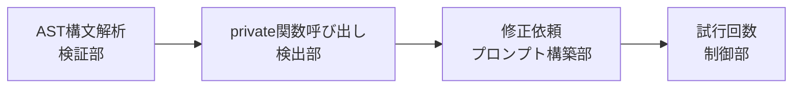

| 要素名 | 説明 |
|---|---|
| AST構文解析検証部 | 生成テストがPythonのastモジュールでパース可能か検証します |
| private関数呼び出し検出部 | 生成テストがprivate関数を直接呼び出していないかを検出します |
| 修正依頼プロンプト構築部 | エラーのあるテストコードとエラーメッセージをLLMへ返します。実装ではParseErrorPrivateCallFixingPromptというモジュールが対応します |
| 試行回数制御部 | 修正試行を最大5回まで許可し、それでも解決しないテストは破棄します |

#### ランタイムエラーフィードバック

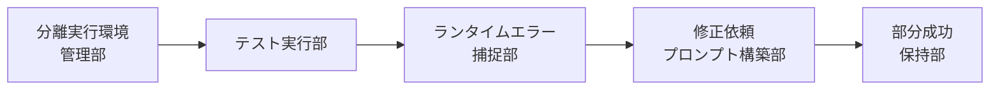

| 要素名 | 説明 |
|---|---|
| 分離実行環境管理部 | 変更前コミットと変更後コミットそれぞれに独立した実行環境を用意します。実装ではDockerコンテナ単位で環境を分離するモジュール(DockerExecutor)が対応します |
| テスト実行部 | 生成テストを両方の実行環境で実行します |
| ランタイムエラー捕捉部 | 実行時に発生したエラー(コンソールのトレースバック、print出力中の例外の両方)を記録します |
| 修正依頼プロンプト構築部 | 失敗したテストコードとエラーメッセージをLLMへ返し、最大5回まで修正させます |
| 部分成功保持部 | 少なくとも一方の環境で成功したテストを保持し、5回失敗が残るテストも情報として保持します |

#### カバレッジフィードバック制御器

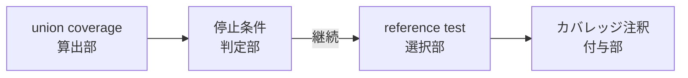

| 要素名 | 説明 |
|---|---|
| union coverage算出部 | 新旧両版における変更コードのカバレッジを合成して算出します。実装では実行可能な変更行数と被覆行数からカバレッジ率を計算するモジュール(CoverageAnalyzer)が対応します |
| reference test選択部 | 未カバー行との行距離が最も近いテストを選びます。実装では行距離を計算するモジュール(ReferenceTestsFilter)が対応します |
| カバレッジ注釈付与部 | 対象関数のコードにカバー済みと未カバーを示す注釈コメントを付与します |
| 停止条件判定部 | カバレッジが100%に到達したか、前ラウンドから変化がなければ停止し、それ以外は次ラウンドへ進めます |

#### 差分実行・比較器

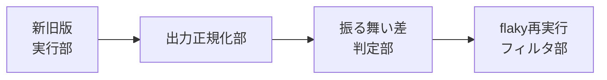

| 要素名 | 説明 |
|---|---|
| 新旧版実行部 | 生成テストを旧版・新版のコードでそれぞれ実行します。実装では出力を分離するモジュール(ProgramMerger)が対応します |
| 出力正規化部 | タイムスタンプなど付随情報を除去して出力を正規化します |
| 振る舞い差判定部 | 両方がランタイムエラーだがエラー型が異なる、片方だけがエラーになる、どちらもエラーなしだが出力が異なる、のいずれかで振る舞い差ありと判定します |
| flaky再実行フィルタ部 | 各テストを新旧両版で再実行し、初回と結果が異なれば破棄し、安定した差だけを振る舞い差として報告します |

### 制御フロー図

内側2ループ(静的妥当性チェック、ランタイムエラーチェック)と外側1ループ(カバレッジフィードバック)からなる三重ループ構造と、停止条件を示します。

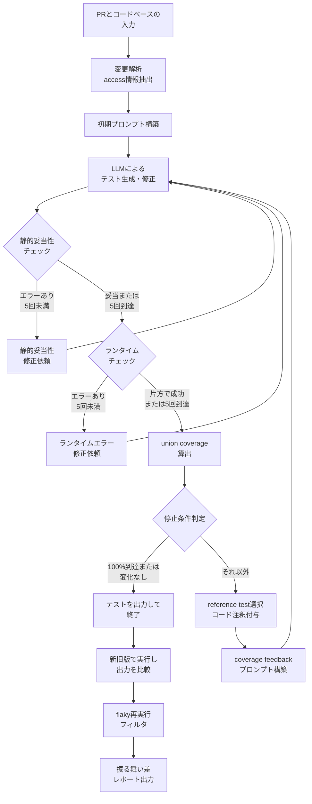

| 要素名 | 説明 |
|---|---|
| PRとコードベースの入力 | 分析対象のGitHub PRとそのコードベースを受け取ります |
| 変更解析 access情報抽出 | 変更関数を抽出し、accessibility分類とaccess informationの抽出を行います |
| 初期プロンプト構築 | R0プロンプトを構築します |
| LLMによるテスト生成・修正 | LLMがテストを生成、または修正依頼を受けて再生成します |
| 静的妥当性チェック | 生成テストがASTとして解析できるか、private関数を呼んでいないかを判定します |
| 静的妥当性修正依頼 | 静的妥当性エラーのあるテストコードとエラーメッセージをLLMへ返します |
| ランタイムチェック | 生成テストを新旧両版の実行環境で実行し、成否を判定します |
| ランタイムエラー修正依頼 | 実行時エラーのあるテストコードとエラーメッセージをLLMへ返します |
| union coverage算出 | 新旧両版における変更コードのカバレッジを合成して算出します |
| 停止条件判定 | カバレッジが100%に到達したか、前ラウンドから変化がないかを判定します |
| テストを出力して終了 | その時点までに得られたテスト集合を最終出力として確定します |
| reference test選択 コード注釈付与 | 未カバー行に近いテストを選び、対象関数にカバー状況の注釈を付与します |
| coverage feedbackプロンプト構築 | 未カバー関数に絞った次ラウンド用プロンプトを構築します |
| 新旧版で実行し出力を比較 | 最終テスト集合を新旧両版で実行し、出力とエラー型を比較します |
| flaky再実行フィルタ | 各テストを再実行し、結果が不安定なものを破棄します |
| 振る舞い差レポート出力 | 安定して観測された振る舞い差を最終結果として出力します |

## データ

DiffTestGen の論文には明示的な ER 図がありません。

このセクションは、論文本文 (II-A, II-C, II-D, II-F) に登場する概念からモデルを起こしたものです。

一部の属性は、論文記述からの推測、または公開実装 (GitHub: `sola-st/DiffTestGen`) の dataclass 定義からの補完です。

該当箇所には注記します。

### 概念モデル

DiffTestGen は、PullRequest から ChangedFunction を抽出し、Round ごとに Prompt から GeneratedTest を生成し、実行結果を比較する構造を持ちます。

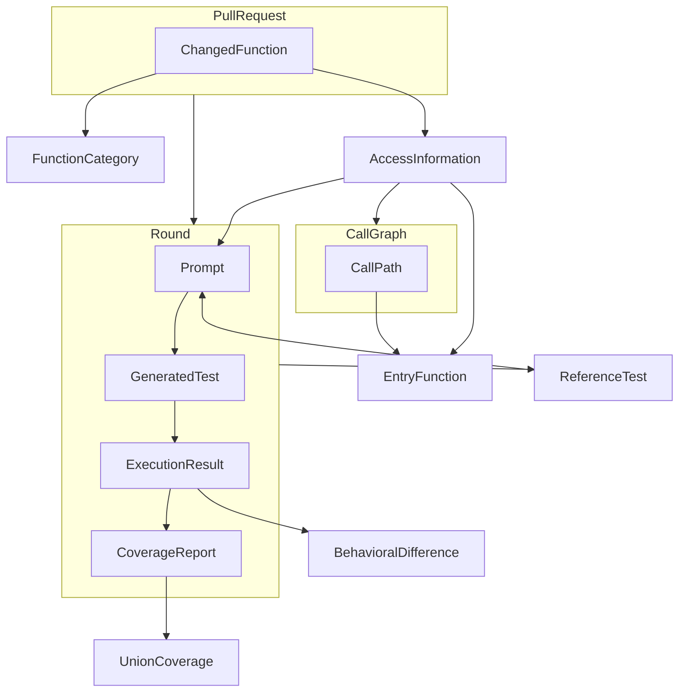

| 要素名 | 説明 |
|---|---|
| PullRequest | 入力となる GitHub PR。ChangedFunction を 1 つ以上所有します |
| ChangedFunction | PR の diff から抽出された変更関数です。論文の CodeChange に相当します |
| FunctionCategory | ChangedFunction の分類です。public / private / special method の 3 値です |
| AccessInformation | ChangedFunction ごとに構成される到達情報です。分類によって内容が変わります |
| EntryFunction | private 関数へ到達できる公開関数です。AccessInformation が private 分類のとき参照します |
| CallGraph | ノードを関数、エッジを呼び出し関係とする有向グラフです |
| CallPath | CallGraph 上の呼び出し経路です。private 関数から EntryFunction への到達経路を表します |
| Round | 反復の 1 単位です。R0 から R4 まで存在します |
| Prompt | LLM へ送る指示文です。AccessInformation を組み込みます |
| GeneratedTest | Prompt から LLM が生成したテストコードです |
| ExecutionResult | GeneratedTest を旧版・新版で実行した結果です |
| BehavioralDifference | ExecutionResult の旧版・新版を比較して得られる振る舞い差です |
| CoverageReport | ExecutionResult から得られる変更行のカバレッジです |
| UnionCoverage | CoverageReport を PR 単位・データセット単位で合成した指標です |
| ReferenceTest | Round の終わりに次ラウンドの参照として選ばれる GeneratedTest です |

**読み方の注記**

- CallGraph は独立した永続オブジェクトとして実装されていません。公開実装は LSP (Language Server Protocol) の `references` / `definition` クエリで呼び出し関係をオンデマンドに解決します (`src/testora/util/ExtractCallerCallee.py`)。図の CallGraph / CallPath は論文の概念表現であり、実装補完の注記です。
- ReferenceTest の選定は、Round が持つ GeneratedTest 群から 1 件を選ぶ処理です。図では Round → ReferenceTest の矢印で表しています。

### 情報モデル

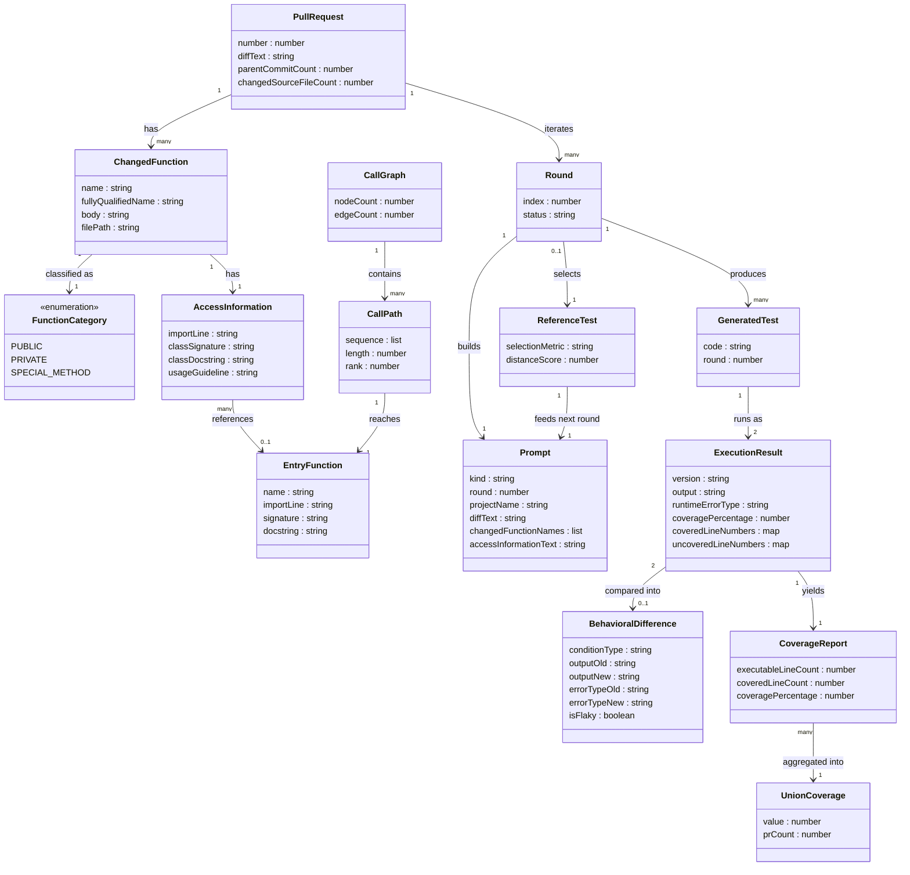

| 要素名 | 説明 |
|---|---|
| PullRequest | `number`, `parentCommitCount`, `changedSourceFileCount` は対象スコープの判定条件です。親コミット数は 1、変更ソースファイル数は最大 3 です (論文 II-A) |
| ChangedFunction | `name` と `body` は diff から AST ベース解析で抽出します (論文 II-C3)。`filePath` は推測による補完です |
| FunctionCategory | 3 値の列挙型です。公開 API リストに載っていれば public、載っていなければ命名規約で判定します。`_` 1 個始まりは private、`__` 始まりは special method です (論文 II-C1) |
| AccessInformation | 分類ごとに構成要素が変わります。詳細は次項の表を参照してください |
| EntryFunction | private 関数に到達できる公開関数です。`importLine`・`signature`・`docstring` を持ちます (論文 Table I) |
| CallGraph | ノードが関数、エッジが呼び出し関係の有向グラフです。属性は概念上のものであり、公開実装では永続化されていません (実装補完の注記) |
| CallPath | private 関数から EntryFunction への呼び出し経路です。`rank` は top-k 最短経路の順位です。**k = 5** は論文 II-C3 Algorithm 1 に明記されています ("selects the top-k shortest remaining paths ... with k = 5") |
| Round | 反復の 1 単位です。論文の実験では R0 (初回生成) から R4 まで観測されました。実装上の固定上限ではありません。カバレッジが 100% に到達、または前ラウンドから変化がなければ終了します (論文 II-B) |
| Prompt | `kind` は `initial` (R0) または `coverageFeedback` (R1 以降) です。coverageFeedback は未カバー行に関連する ChangedFunction と AccessInformation のみに絞り込みます (論文 Table II) |
| GeneratedTest | Prompt から LLM が生成したテストコードです。公開実装の `TestExecution.code` フィールドに相当します (`src/testora/execution/TestExecution.py` で確認済み) |
| ExecutionResult | 旧版・新版それぞれの実行結果です。属性名は概念上の呼称で、公開実装の `TestExecution` dataclass (`code`, `output`, `coverage_report`, `coverage_percentage`, `all_covered_exec_modified_stms_num`, `all_uncovered_exec_modified_stmts_num`) に対応します (確認済み) |
| BehavioralDifference | Definition 2 の 3 条件のいずれかで成立します。詳細は次項の表を参照してください |
| CoverageReport | 公開実装の `DiffCoverage` dataclass (`percentage_covered`, `total_exec_modified_stmts`, `total_covered_exec_modified_stmts`) に対応します (`src/testora/execution/CoverageAnalyzer.py` で確認済み) |
| UnionCoverage | 旧版と新版のカバレッジを合成した指標です。定義式は本項下部を参照してください |
| ReferenceTest | 未カバー行に最も近い GeneratedTest を選びます。公開実装は未カバー行ごとに最寄り被覆行との絶対距離を求め、距離リストの比較とテスト数・ランダム選択で候補を絞る**最寄り行距離ベースのヒューリスティック**です。ソースコメントは Mean Absolute Distance と記していますが、実装は平均を計算していません (`src/testora/util/ReferenceTestsFilter.py` で確認済み) |

### AccessInformation の分類別構成 (論文 Table I 準拠)

| カテゴリ | 構成要素 |
|---|---|
| public 関数 | 当該関数の import line、所属クラスの signature と docstring |
| private 関数 | EntryFunction、EntryFunction の import line、EntryFunction の signature と docstring、EntryFunction の所属クラスの signature と docstring |
| special method | 所属クラスの import line、所属クラスの signature と docstring、当該 special method の usage guideline |

private 関数の AccessInformation は EntryFunction 経由の到達情報だけを持ちます。

テストは公開 API 経由でのみ実行され、private 関数を直接呼び出すことはありません (論文 II-C1)。

### BehavioralDifference の 3 条件 (論文 Definition 2)

| 条件 | 内容 |
|---|---|
| 条件 1 | 旧版・新版がともにランタイムエラーを出すが、エラー型が異なる (`e_old ≠ e_new`) |
| 条件 2 | 旧版・新版のどちらか片方だけがランタイムエラーを出す |
| 条件 3 | 旧版・新版のどちらもエラーを出さないが、出力が異なる (`o_old ≠ o_new`) |

いずれか 1 つを満たすとき、振る舞い差が成立します。

各 GeneratedTest は旧版・新版で再実行し、初回と結果が異なれば flaky として破棄します。

flaky でないものだけを BehavioralDifference として報告します (`isFlaky` 属性)。

### UnionCoverage の定義式 (論文 II-F Definition 3)

テスト 1 件あたりの union coverage は次の式で定義されます。

`Cov_union^test = (Num_covered_old + Num_covered_new) / (Num_changed_old + Num_changed_new)`

- `Num_covered_old` / `Num_covered_new` は、そのテストが旧版・新版でカバーした変更行数です
- `Num_changed_old` / `Num_changed_new` は、旧版・新版それぞれの変更行の総数です
- カバレッジ対象は「実行可能な変更 Python 行」に限定されます (論文 IV Threats to Validity)

データセット全体での集計は、PR ごとの union coverage を平均した値です。

`Cov_union = (1/N) * Σ Cov_union^(test_i)`

- N はデータセットの PR 総数です
- 外側ループ (Round) はこの union coverage を反復的に改善します

## 構築方法

DiffTestGen は MIT ライセンスの公開実装です。リポジトリは https://github.com/sola-st/DiffTestGen にあります。

以下は `gh api repos/sola-st/DiffTestGen/git/trees/main?recursive=1` と各ファイルの実体取得で確認した内容です。推測は含みません。

### 前提条件

| 項目 | 要件 | 根拠 |
|---|---|---|
| 開発環境 | VS Code + "Dev Containers" 拡張 | README.md の Set up 手順が唯一の公式手順 |
| コンテナ基盤 | Docker (Docker-in-Docker) | `.devcontainer/devcontainer.json` の `docker-in-docker` feature |
| OpenAI API キー | リポジトリ直下に `.openai_token` ファイルを作成し記載 | README.md |
| GitHub API キー | リポジトリ直下に `.github_token` ファイルを作成し記載 | README.md (PR 情報取得に GitHub API を使うため) |
| Python パッケージ管理 | `pyproject.toml` (パッケージ名 `Testora`, hatchling ビルド) + `requirements.txt` | 実体確認済み |
| 対象プロジェクト | pandas / scipy / keras / marshmallow のいずれか (本番サポート)。scikit-learn / numpy / transformers / pytorch_geometric / scapy は "Experimental and not really supported" | `.devcontainer/postCreateCommands.sh` のコメント |

`requirements.txt` の主要依存は次のとおりです。

| パッケージ | 役割 |
|---|---|
| `openai==1.55.3` | LLM 呼び出し |
| `PyGithub==2.3.0` | GitHub API 経由の PR 取得 |
| `PyCG==0.0.8` | 依存には残りますが、現行の呼び出し関係抽出コードからは利用を確認できません。実際の抽出は vendored `multilspy` + `libcst` の `ExtractCallerCallee.py` が担います |
| `jedi-language-server==0.41.4` | LSP ベースの public / private 判定 |
| `libcst==1.2.0` | Python AST/CST 解析 (差分から変更関数を抽出) |
| `coverage==7.11.0` | union coverage の計測 |
| `unidiff==0.7.5` | diff パース |
| `docker==7.0.0` | 対象プロジェクトを動かす Docker コンテナ制御 |
| `Flask==3.0.3` | 結果閲覧用 Web UI |

### リポジトリの取得と Dev Container ビルド

```bash
git clone https://github.com/sola-st/DiffTestGen.git
cd DiffTestGen
```

VS Code で開いたあと、コマンドパレットから次を実行します。

```
Dev Containers: Rebuild and Reopen in Container
```

ビルド完了後、`postCreateCommands.sh` が自動実行されます。中身は次のとおりです。

```bash
#!/bin/bash

pip install --user -r requirements.txt
pip install -e .

echo "Setting up project-under-analysis"
# Select which project to analyze:
.devcontainer/setup_scipy.sh
# .devcontainer/setup_pandas.sh
# .devcontainer/setup_keras.sh
# .devcontainer/setup_marshmallow.sh
```

対象プロジェクトの既定値は scipy です。pandas 等に切り替えたい場合は、このファイルのコメントアウトを書き換えてから Dev Container を再ビルドします。

API キーは、コンテナ起動前後どちらでもリポジトリ直下に作成できます。

```bash
echo "sk-..." > .openai_token
echo "ghp_..." > .github_token
```

### 対象プロジェクトのセットアップ (論文の実験を再現する場合)

`setup_<project>.sh` は、対象プロジェクトを **3 つの Docker コンテナに editable install** します。この 3 本は「旧版用・新版用・予備」のように役割が固定されているわけではありません。`src/testora/util/ClonedRepoManager.py` の `nb_clones = 3` が示すとおり、**任意のコミットへチェックアウトして使い回すクローンのプール**であり、`_get_least_recently_used_clone_id()` による LRU (least-recently-used) で割り当てられます。同じコミットを再度使うときにチェックアウトし直す手間を省くための仕組みです。`setup_pandas.sh` の実体は次のとおりです (要点を抜粋)。

```bash
# COMMIT_DATE を起点に最新コミットをチェックアウトする (既定 2025-08-01)
COMMIT_DATE="${1:-2025-08-01}"

git clone https://github.com/pandas-dev/pandas.git
cd pandas
COMMIT_HASH=$(git log --all --until="$COMMIT_DATE" -1 --format=%H)
git checkout "$COMMIT_HASH"

docker build -t pandas-dev .
docker run -t -d --name pandas-dev1 -v ${PWD}:/home/pandas pandas-dev
docker exec pandas-dev1 python -m pip install -ve . --no-build-isolation --config-settings editable-verbose=true
docker exec pandas-dev1 python -m pip install sphinx-version-warning coverage==7.11.0

# clone2, clone3 も同様に複製してそれぞれコンテナ化
```

論文の実験をそのまま再現する場合は、以下も必要です。

| 種類 | 場所 | 内容 |
|---|---|---|
| 対象 PR 番号リスト | `data/meta/pr_nums_checks/<project>_PRs_subset<N>.txt` | Testora data 由来の PR 番号 (keras 133 / marshmallow 53 / pandas 127 / scipy 126、primary_brief 記載の合計 439 と一致) |
| ChaCo 由来 PR リスト | `data/meta/chaco_prs/` | pandas 16 件・scipy 18 件 (ChaCo data) |
| Ground truth | `data/ground_truth/<project>/<PR番号>.json` | 各 PR の期待結果 |
| 変更行メタデータ | `data/meta/diff_loc/<project>_loc_in_diff_meta.txt` | union coverage 計算の元情報 |

### 実装の位置づけ (正直な評価)

README.md はセットアップ手順そのものは明記していますが、対象は **pandas / scipy / keras / marshmallow の 4 プロジェクトに固定** されています。任意の Python プロジェクトの任意 PR をワンコマンドで解析する汎用 CLI ではありません。

新しいプロジェクトに適用するには、次を自作する必要があります。

- `setup_<project>.sh` (対象プロジェクトの Docker コンテナ構築)
- `data/meta/pr_nums_checks/` 相当の対象 PR リスト
- `.target_project` ファイル (プロジェクト名を書いたテキストファイル。`EntryLocal.py` が読み込む)

自分の CI にこの手法を組み込みたい場合、選択肢は 2 つです。

| 選択肢 | 内容 |
|---|---|
| A. 公開実装をそのまま使う | 対象が pandas / scipy / keras / marshmallow のいずれかであれば、Dev Container + `setup_<project>.sh` で再現できる |
| B. 手法を自前で再実装する | 対応プロジェクト外の場合、Definition 2 (振る舞い差) と union coverage の計算ロジックだけを自分の CI 用に再実装する。■利用方法で実装案を示す |

## 利用方法

### 起動パラメータ一覧 (必須 / 任意)

DiffTestGen 本体 (`testora.RegressionFinder`) を直接起動する場合のパラメータです。`src/testora/RegressionFinder.py` の `argparse` 定義から実体確認しました。

| パラメータ | 型 | 必須 | 内容 |
|---|---|---|---|
| `--project` | str | ローカルモード時に必須 | 対象プロジェクト名 (`pandas` / `scipy` / `keras` / `marshmallow`) |
| `--pr` | int | ローカルモード時に必須 | 解析対象の PR 番号 |
| `--paras` | Python リテラル (10 要素の list) | 任意 | 手法の挙動を切り替える設定配列。詳細は次項。**省略時は `src/testora/Config.py` のモジュールレベル既定値が使われ、それが DiffTestGen の既定設定そのものです** (実装は `if args.paras:` の条件分岐でのみ上書きします) |
| `--db` | flag | データベースモード時に指定 | PR をデータベースから取得して実行する |
| `--prs` | Python リテラル (int リスト) | データベースモード時に指定 | 複数 PR をまとめて指定する |

### 対象 PR の指定方法

論文のスコープ条件 (II-A) は次の 4 つです。DiffTestGen 自体はこれをデータセット構築時のフィルタとして `src/testora/preprocessing/FilterPRs.py` 等で適用し、結果を `data/meta/pr_nums_checks/` 配下の PR 番号リストに落とし込んでいます。

| 条件 | 内容 |
|---|---|
| 1 | 非テストの Python ソースファイルを 1 つ以上変更している |
| 2 | コメント・ドキュメントのみの変更は除外する |
| 3 | 変更する非テストソースファイルは最大 3 つまで |
| 4 | 親コミットが 1 つだけ (merge commit を除外) |

個別 PR を 1 件だけ解析したい場合、ローカルモードで次のように起動します。

```bash
# .target_project にプロジェクト名を1行だけ書いておく
echo "pandas" > .target_project

python -m testora.RegressionFinder \
  --project pandas \
  --pr 59810 \
  --paras="[5, 8, 8, True, 'pr-modified', True, True, True, 0, 'gpt-5-mini-2025-08-07']"
```

### `--paras` の要素詳細

`--paras` は 10 要素の Python リテラルです。要素の意味は `src/testora/Entry.py` のコメントと `src/testora/Config.py` の対応する変数名から確認しました。

| 位置 | 変数名 | DiffTestGen 既定値 | Testora (baseline) 既定値 | 意味 |
|---|---|---|---|---|
| 0 | `initial_test_generation_prompt_version` | `5` | `1` | 初回ラウンドのテスト生成プロンプト版 |
| 1 | `feedback_test_generation_prompt_version` | `8` | `0` | フィードバックラウンドのプロンプト版 (`0` はフィードバックループ無し = 元祖 Testora) |
| 2 | `context_version` | `8` | `1` | access information (Table I) の版 |
| 3 | `changed_function_body` | `True` | `False` | 変更関数の本体をプロンプトに含めるか |
| 4 | `use_existing_tests` | `"pr-modified"` | `None` | 既存テストの扱い |
| 5 | `call_graph` | `True` | `False` | 静的コールグラフによる access information 抽出を使うか |
| 6 | `fix_static_error` | `True` | `False` | 生成テストの静的妥当性エラー修正ループ (Figure 2 の 3A) |
| 7 | `use_error_feedback` | `True` | `False` | ランタイムエラーフィードバックループ (Figure 2 の 3B) |
| 8 | `iteration` | 実行回数に応じて指定 | 同左 | 再現性検証用の試行番号 |
| 9 | `model_version` | `"gpt-5-mini-2025-08-07"` | 同左 (比較条件を揃えるため) [^model] | 使用 LLM |

[^model]: 元の Testora 論文自体の既定モデルは **gpt-4o-mini** です。本論文は「Testora は DiffTestGen と直接比較可能なので、公正な比較のため gpt-5-mini で再実行した」と述べています (III-B5)。一方 ChaCo は再実行できなかったため、DiffTestGen 側を gpt-4o-mini でも評価して比較の整合を取っています。後述の「LLM の選択」節に出てくる gpt-4o-mini の数値は、この ChaCo 比較用の条件を指します。

アブレーション実験を再現する場合は、要素を 1 つずつ切り替えるのではなく、`src/testora/Entry.py` が持つ
名前付き設定をそのまま使います。実装で確認できる定義は次のとおりです (先頭 8 要素。残り 2 要素は
`iteration` と `model_version`)。なお `Entry.py` にある `max_iteration` は外側 for ループの上限であり、
`--paras` 配列の要素ではありません。

| 名前付き設定 | 配列 | 対応する論文の条件 |
|---|---|---|
| `testora` | `[1, 0, 1, False, None, False, False, False]` | ベースライン (機能をすべて無効) |
| `only_coverage_feedback` | `[5, 8, 8, False, None, False, False, False]` | Testora + カバレッジフィードバックのみ |
| `only_cg` | `[5, 0, 8, False, None, True, False, False]` | Testora + コールグラフ (access information) のみ |
| `difftestgen` | `[5, 8, 8, True, "pr-modified", True, True, True]` | 全機能を有効にした本手法 |

各バリアントはプロンプト版 (要素 0〜2) と `use_call_graph` (要素 5) を**まとめて**切り替えており、
単一要素のスイープにはなっていません。

> アブレーションの**結果**は論文 Figure 5 と III-D (RQ2: Component Contributions) に記載されています。
> 論文 Table II は各ラウンドのプロンプトに何を含めるかを示す別の表です。

### 実行方法まとめ

| モード | 起動コマンド | 用途 |
|---|---|---|
| データベースモード | `python -m testora.Entry` | データベースから PR を取得して一括実行。結果はデータベースへ記録 |
| ローカルモード (Testora data) | `python -m testora.EntryLocal` | ローカル実行。結果はリポジトリ直下にログファイルとして出力 |
| ローカルモード (ChaCo data) | `python -m testora.EntryLocalChaCo` | ChaCo データセット (pandas/scipy 34 PR) 向け。下記の既知の注意点あり |
| 分類のみ再実行 | `python -m testora.EntryLocalClassification` | 既存ログファイルに対して回帰分類だけを再実行 |

> **`EntryLocalChaCo` の既知の注意点** (2026-07-21 時点の main で確認):
> モデルループ内で同じ `config` リストへ 2 要素を繰り返し追加するため、2 モデル目では 12 要素になり
> 10 変数へのアンパックに失敗します。また `dataset = "unique",` は末尾カンマにより文字列ではなくタプルです。
> 公開実装側の不具合なので、複数モデルで回す場合は手元で修正してから実行します。

データベースモードのステータス確認とダウンロードは次のコマンドです。

```bash
# 進捗確認
python -m testora.evaluation.EvalTaskManager --status

# 結果ダウンロード
python -m testora.evaluation.EvalTaskManager --fetch
```

### 結果の閲覧 (Web UI)

生成テスト・実行ログ・検出した振る舞い差は、付属の Flask 製 Web UI で確認できます。

```bash
python -m testora.webui.WebUI --files logs_*.json
```

起動後、ブラウザで http://localhost:4000/ を開き、PR をクリックすると詳細ログが確認できます。

### access information をプロンプトに埋め込む形 (公開実装の実体)

手法の核心は「変更関数への到達経路を、どういう文字列で LLM に渡すか」です。
公開実装の [`GetAccessInfoString.py`](https://github.com/sola-st/DiffTestGen/blob/main/src/testora/util/GetAccessInfoString.py) が
この組み立てを担っており、実際に使われている定型文は次の構造です。

#### 全体の前置き

```text
For each affected public function, the following lists the available ways to access it.
Refer to the class information below and the given changed function body above to check
how to initialize the relevant classes and to check how to access the function, if any.
```

末尾にはクラス情報の前置きが続きます。

```text
The following shows the signatures and docstrings of the relevant classes,
which can be used as a reference when initializing them.
Long docstrings are truncated, with an ellipsis (...) indicating omitted content.
```

#### 関数ごとのブロック

```text
To access the changed function {fully_qualified_name}:

Method #0: by calling function '{entry_function}'
{import_line}
{signature_and_docstring}

Method #1: by triggering special method '{special_method}' of the following imported class
Hints: {special_method_explanation}.
{import_line}
{signature_and_docstring}
```

到達経路が複数ある場合、`Method #0`, `Method #1`, … と**番号付きで列挙**されます。
special method のときだけ `Hints:` 行が入り、その method の呼び出し方 (例: `__call__` は
インスタンスを関数のように呼べる) を自然言語で補足します。

#### バージョン条件付きの入れ子 (論文本文では強調されない実装上の要点)

各ブロックは、その情報が**どちらのバージョンで有効か**で 3 通りに振り分けられます。

```text
The following information is available for both the old and the new versions of code:
The following information is available only for the old code version:
The following information is available only for the new code version:
```

| 区分 | 意味 |
|---|---|
| both | 新旧どちらの版でも同じ経路で到達できます |
| only for the old | 変更で削除・改名された経路です。旧版のテストにのみ使えます |
| only for the new | 変更で追加された経路です。新版のテストにのみ使えます |

差分テストは**同一のテストを新旧 2 版で実行する**ため、API 表面そのものが変わった場合に
「どちらの版で有効な到達経路か」を LLM が区別できないと、片方の版でしか動かないテストが生成されます。
この 3 分岐は、その取り違えを防ぐための仕組みです。自前で実装する場合も、
到達経路を新旧で共通・旧のみ・新のみに分けて渡す設計を踏襲する価値があります。

#### 初回ラウンドとフィードバックラウンドの違い

| 関数 | 用途 | 対象 |
|---|---|---|
| `prepare_call_info(pr)` | 初回プロンプト | 変更された public 関数**すべて** |
| `prepare_selected_call_info(pr, uncovered_old, uncovered_new)` | カバレッジフィードバックラウンド | **まだカバーされていない**変更関数だけ |

フィードバックラウンドでは前置きも `For each uncovered affected public function, ...` に変わります。
外側ループは、未到達の関数だけに access information を絞り込んで再生成を促す設計です。

> 🛠 **ここから先は自前実装案です。**
> 以降のコードは、DiffTestGen の対応外プロジェクトで同じ考え方 (union coverage / Definition 2 の振る舞い差判定) を自分の CI に組み込むための実装案です。
> **DiffTestGen リポジトリのコードそのものではありません。** coverage.py と pytest の公式 API を根拠に構成しています。
> ここより前の節 (構築方法・起動パラメータ・access information の文字列) は、すべて公開実装の実体確認に基づく内容です。

### 実装案: 自分のプロジェクトで union coverage を測る

DiffTestGen 本体の `src/testora/execution/CoverageAnalyzer.py` は `coverage.Coverage.analysis2()` (coverage.py の公式 API) を使って、変更行のうち実行可能な行とカバーされた行を集計しています。同じ考え方を、対象プロジェクト非依存のスクリプトとして書き直した実装案です。

coverage.py 公式ドキュメント: https://coverage.readthedocs.io/

```python
"""union_coverage.py
旧版 / 新版それぞれで生成テストを実行し、変更行カバレッジを合成する実装案。
coverage.py の Coverage.analysis2() を利用する。
"""
import subprocess
from pathlib import Path
from coverage import Coverage

def measure_changed_line_coverage(
    worktree: Path,
    changed_file: str,
    changed_lines: set[int],
    test_files: list[str],
) -> tuple[set[int], set[int]]:
    """指定ワークツリーでテストを実行する。

    戻り値は 実行可能な変更行 と そのうちカバーされた行 の 2 集合です。
    分母を「実行可能な変更行」に限定するため executable_stmts と交差させます。
    """
    data_file = worktree / ".coverage.diff"
    subprocess.run(
        ["coverage", "run", f"--data-file={data_file}", "-m", "pytest", *test_files],
        cwd=worktree,
        check=False,
    )
    cov = Coverage(data_file=str(data_file))
    cov.load()
    _, executable_stmts, _, uncovered_stmts, _ = cov.analysis2(
        str(worktree / changed_file)
    )
    executable_changed = set(executable_stmts) & changed_lines
    covered = executable_changed - set(uncovered_stmts)
    return executable_changed, covered


def union_coverage_ratio(
    old_executable: set[int],
    old_covered: set[int],
    new_executable: set[int],
    new_covered: set[int],
) -> float:
    """論文 Definition 3 をそのまま実装する。

    Cov_union = Num_covered_old + Num_covered_new
                / Num_changed_old + Num_changed_new

    集合和ではなく、旧版・新版を別々に数えた加重比です。
    旧版だけが行 L をカバーした場合、集合和なら 100% ですが本式では 50% です。
    削除行は旧版のみ、追加行は新版のみに存在するため変更行集合も版ごとに分けます。
    実行可能な変更行が両版とも無い場合は 1.0 つまり 100% 扱いとします。
    """
    denominator = len(old_executable) + len(new_executable)
    if denominator == 0:
        return 1.0
    return (len(old_covered) + len(new_covered)) / denominator


if __name__ == "__main__":
    old_changed = {120, 121, 122}
    new_changed = {120, 121, 122, 130}
    old_exec, old_cov = measure_changed_line_coverage(
        Path("worktree_old"), "src/mylib/core.py", old_changed, ["tests/generated/"]
    )
    new_exec, new_cov = measure_changed_line_coverage(
        Path("worktree_new"), "src/mylib/core.py", new_changed, ["tests/generated/"]
    )
    ratio = union_coverage_ratio(old_exec, old_cov, new_exec, new_cov)
    print(f"union coverage: {ratio:.1%}")
```

複数 PR で集計する場合は、論文の定義どおり PR ごとの union coverage を単純平均します。

```python
def aggregate_union_coverage(per_pr_ratios: list[float]) -> float:
    """Cov_union = (1/N) * sum(Cov_union^(test_i))"""
    return sum(per_pr_ratios) / len(per_pr_ratios)
```

### 実装案: 差分実行ハーネス (Definition 2 の実装)

Definition 2 (behavioral difference) の 3 条件と、flaky 除去のための再実行を実装した例です。DiffTestGen 本体は既定では生成コードを 1 件ずつ実行します (`Config.py` の `use_program_merger = False`)。テスト統合実行 (`ProgramMerger`) は設定を有効にしたときだけ使う任意の経路です。ここでは自分のプロジェクトに組み込みやすい pytest サブプロセス実行の形にしています。

```python
"""diff_harness.py
Definition 2 (behavioral difference) を実装する差分実行ハーネスの実装案。
同一の生成テストを旧版 / 新版 2 つのワークツリーで実行し、出力とエラー型を比較する。
"""
import re
import subprocess
from dataclasses import dataclass

# pytest 自身が出す進捗行・サマリ行。SUT の出力と混ざるため除去する。
_PYTEST_NOISE = re.compile(
    r"^(=+.*=+|-+.*-+|[.FEsxX]+\s*\[\s*\d+%\]|\d+ (passed|failed|error).*)$"
)


@dataclass
class RunResult:
    output: str | None
    error_type: str | None  # None ならエラー無し


def run_test(worktree: str, test_path: str, python_bin: str = "python") -> RunResult:
    """テストを実行し、SUT の標準出力とランタイムエラー型を取り出す。

    `-s` で pytest の出力キャプチャを無効にする点が重要です。
    既定の pytest は成功したテストの標準出力を表示しません。
    そのままでは Definition 2 の条件 3 つまり出力差を検出できません。
    `python_bin` には旧版用・新版用に分離した venv の python を渡します。
    """
    proc = subprocess.run(
        [python_bin, "-m", "pytest", test_path,
         "-s", "-q", "--tb=short", "-p", "no:cacheprovider"],
        cwd=worktree,
        capture_output=True,
        text=True,
    )
    sut_output = "\n".join(
        line for line in proc.stdout.splitlines()
        if line.strip() and not _PYTEST_NOISE.match(line.strip())
    )
    if proc.returncode == 0:
        return RunResult(output=sut_output, error_type=None)
    return RunResult(output=sut_output, error_type=_extract_error_type(proc.stdout))


def _extract_error_type(text: str) -> str:
    """short traceback 末尾の `E   SomeError: ...` から例外型名を取り出す。

    assertion failure は AssertionError として現れます。
    収集エラーなど pytest 自身の失敗も混ざります。
    本番運用では pytest の JSON レポートプラグインを使う方が安定します。
    """
    for line in reversed(text.splitlines()):
        m = re.match(r"E\s+([A-Za-z_][\w.]*(?:Error|Exception))\b", line.strip())
        if m:
            return m.group(1)
    return "UnknownError"


def has_behavioral_difference(old: RunResult, new: RunResult) -> bool:
    """Definition 2 の3条件をそのまま実装する。

    1. 両方エラーだが型が違う
    2. 片方だけエラー
    3. どちらもエラー無しだが出力が違う
    """
    if old.error_type and new.error_type:
        return old.error_type != new.error_type
    if bool(old.error_type) != bool(new.error_type):
        return True
    return old.output != new.output


def is_flaky(
    worktree: str, test_path: str, first: RunResult,
    python_bin: str = "python", reruns: int = 2,
) -> bool:
    """同一版で再実行し、結果が変われば flaky とみなして破棄する。"""
    for _ in range(reruns):
        rerun = run_test(worktree, test_path, python_bin)
        if rerun.output != first.output or rerun.error_type != first.error_type:
            return True
    return False


def check_test(
    old_worktree: str, new_worktree: str, test_path: str,
    old_python: str = "python", new_python: str = "python",
) -> dict:
    old_result = run_test(old_worktree, test_path, old_python)
    new_result = run_test(new_worktree, test_path, new_python)

    if is_flaky(old_worktree, test_path, old_result, old_python) or is_flaky(
        new_worktree, test_path, new_result, new_python
    ):
        return {"test": test_path, "status": "flaky_discarded"}

    diff = has_behavioral_difference(old_result, new_result)
    return {
        "test": test_path,
        "status": "behavioral_difference" if diff else "no_difference",
        "old_error_type": old_result.error_type,
        "new_error_type": new_result.error_type,
    }
```

### 実装案: GitHub Actions で PR 差分テストを回す

PR の base / head 両方をチェックアウトし、差分実行ハーネスを回す例です。テスト生成 (LLM 呼び出し) は別スクリプト呼び出しとして切り出しています。

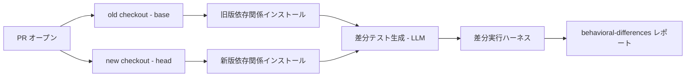

```yaml
name: diff-test-gen

on:
  pull_request:
    paths:
      - "**.py"

jobs:
  diff-test:
    runs-on: ubuntu-latest
    steps:
      - name: Checkout PR head (new version)
        uses: actions/checkout@v4
        with:
          # pull_request の既定 ref は merge commit なので head を明示する
          ref: ${{ github.event.pull_request.head.sha }}
          path: new

      - name: Checkout PR base (old version)
        uses: actions/checkout@v4
        with:
          ref: ${{ github.event.pull_request.base.sha }}
          path: old

      - uses: actions/setup-python@v5
        with:
          python-version: "3.11"

      # 旧版と新版を同じ環境へ入れると後勝ちになる。venv で分離する
      - name: Install dependencies (isolated per version)
        run: |
          python -m venv .venv-old
          ./.venv-old/bin/pip install -e ./old -r old/requirements.txt coverage pytest
          python -m venv .venv-new
          ./.venv-new/bin/pip install -e ./new -r new/requirements.txt coverage pytest

      - name: Generate change-directed tests
        run: python new/scripts/generate_diff_tests.py --base old --head new --out generated_tests/
        env:
          OPENAI_API_KEY: ${{ secrets.OPENAI_API_KEY }}

      - name: Run differential harness
        run: |
          python new/scripts/diff_harness_runner.py \
            --old old --old-python ./.venv-old/bin/python \
            --new new --new-python ./.venv-new/bin/python \
            --tests generated_tests/

      - name: Upload behavioral-difference report
        uses: actions/upload-artifact@v4
        with:
          name: behavioral-differences
          path: diff_report.json
```

`generate_diff_tests.py` と `diff_harness_runner.py` は、それぞれ「access information を組み込んだプロンプトで LLM にテストを生成させるスクリプト」「上記 `diff_harness.py` を対象テスト全件に対して回して JSON レポートを書き出すスクリプト」を指します。両方とも自作が必要です。

> ⚠️ **fork からの PR では動きません。** GitHub は fork 由来の `pull_request` イベントに `GITHUB_TOKEN` 以外の secret を渡しません。`OPENAI_API_KEY` が空になるため、fork PR を対象にするなら `pull_request_target` と明示的な安全対策、または内部 PR 限定の運用に切り替えます。

## 運用

### コスト管理

DiffTestGen の 1 PR あたりの実測コストは、論文 III-E (RQ3, Table VI) で次のとおり報告されています。

| 指標 | Testora | Testora++ | DiffTestGen |
|---|---|---|---|
| 入力トークン | 1,565 | 1,575 | 12,584 |
| 出力トークン | 9,052 | 22,540 | 18,677 |
| 合計トークン | 10,617 | 24,115 | 31,260 |
| 金額 | $0.018 | $0.045 | $0.041 |
| 所要時間 | 8.92 分 | 25.36 分 | 15.86 分 |

> **注記**: DiffTestGen 行は 12,584 + 18,677 = 31,261 ですが、論文 Table VI の合計欄は 31,260 です。
> 論文掲載値に 1 トークンの算術差があります。本記事の月間試算は論文掲載値 31,260 を基準にしています。

DiffTestGen は Testora++ より合計トークン数が多いにもかかわらず、金額は安く済みます。理由は出力トークンの差です。Testora++ は初回生成テスト数を 20 → 100 に増やした対照条件なので、高価な出力トークンを大量に消費します。DiffTestGen は複数ラウンドに分けて必要な分だけ追加生成するため、出力トークンを抑えられます。所要時間も DiffTestGen が Testora++ の約 6 割で済みます。

一方、素の Testora が最もコストと時間を抑えられる手法である点も事実として押さえておきます。「とにかく安く回したいだけの一次スクリーニング」には Testora が向きます。DiffTestGen は、Testora / Testora++ のどちらも検出できない振る舞い差を追加で 70 PR 分検出できる、という上乗せ効果とのトレードオフです。

**月間 PR 数からの試算表**

上記の PR あたり実測値をそのまま月間 PR 数に掛け合わせた試算です。所要時間は LLM 呼び出しと反復実行を含むパイプラインの wall-clock 時間であり、人によるレビュー・トリアージの工数は含みません。

| 月間 PR 数 | 合計トークン | 金額 | 所要時間 (時間換算) |
|---|---|---|---|
| 10 | 312,600 | $0.41 | 2.64 時間 |
| 30 | 937,800 | $1.23 | 7.93 時間 |
| 100 | 3,126,000 | $4.10 | 26.43 時間 |
| 300 | 9,378,000 | $12.30 | 79.30 時間 |
| 500 | 15,630,000 | $20.50 | 132.17 時間 |

月間 100 PR を基準に 3 手法を比較すると、次のとおりです。

| 手法 | 月間金額 (100 PR) | 月間所要時間 (100 PR) |
|---|---|---|
| Testora | $1.80 | 14.87 時間 |
| Testora++ | $4.50 | 42.27 時間 |
| DiffTestGen | $4.10 | 26.43 時間 |

金額は Testora++ とほぼ同水準ですが、時間は Testora++ の約 6 割です。並列実行できる CI 環境であれば wall-clock 時間はボトルネックになりにくいですが、直列実行や API レート制限がある環境では時間差が効いてきます。

### どの PR に適用するか (選別運用)

DiffTestGen を全 PR に回すと、コストと時間は PR 数に比例して線形に増えます。論文が定義する対象スコープ (II-A、4 条件) を、そのまま適用ゲートとして運用に転用できます。

| # | ゲート条件 | 判定方法 | 満たさない場合 |
|---|---|---|---|
| 1 | 非テストの Python ソースファイルを 1 つ以上変更している | diff のファイル一覧を確認 | 適用対象外 (テストのみの変更) |
| 2 | コメント/ドキュメントのみの変更でない | diff の実行可能行の増減を確認 | 適用対象外 |
| 3 | 変更する非テストソースファイルが最大 3 つまで | diff のファイル数をカウント | 適用対象外。スケーラビリティの脅威 (IV 章) に該当するため分割を検討 |
| 4 | 親コミットが 1 つだけ (merge commit でない) | PR のコミットグラフを確認 | 適用対象外 |

4 条件すべてを満たす PR だけに絞ることで、コストを線形に抑えつつ、DiffTestGen が最も効果を発揮する対象に集中できます。逆に言えば、4 ファイル以上にまたがる大規模変更や merge commit は、論文の評価対象そのものにも含まれていません。適用しても精度の裏付けがない領域です。

### ラウンド数の運用

DiffTestGen は外側ループでカバレッジ確認 → 追加ラウンドの起動を繰り返します。論文 Table IV の生成テスト数は、ラウンドを追うごとに急減します。

| ラウンド | 生成テスト数 | 単ラウンドの構成比 | 累積構成比 |
|---|---|---|---|
| R0 | 14,154 | 94.02% | 94.02% |
| R1 | 766 | 5.09% | 99.10% |
| R2 | 101 | 0.67% | 99.77% |
| R3 | 25 | 0.17% | 99.94% |
| R4 | 9 | 0.06% | 100.00% |
| 合計 | 15,055 | 100% | – |

R0 (初回生成) だけで全体の 94% を占め、R2 終了時点で累積 99.77% に達します。R3・R4 は合計しても全体の 0.23% です。**この数字はあくまで「生成テスト数」の分布です。** 検出できる振る舞い差の件数や、そこから見つかる回帰の価値が、同じ比率で減るとは限りません。コスト超過を避けるためにラウンド数の上限を運用で設けたい場合、R2 〜 R3 で打ち切っても**追加生成されるテスト数**の取りこぼしは僅少である、という目安としてのみ使えます。

停止条件そのもの (union coverage 100% 到達、または前ラウンドから変化なし) を無効化してまで固定ラウンド数で打ち切る運用は推奨しません。停止条件は、その PR にとって「もう改善の余地がない」ことを示すシグナルであり、固定回数の打ち切りより精度が高いためです。コスト上限を設ける場合は、停止条件を優先しつつ、フェイルセーフとして「R3 到達で強制終了」のような上限を併用する運用が安全です。

### 停止条件の運用上の意味

| 停止条件 | 意味 | 運用上の解釈 |
|---|---|---|
| union coverage が 100% に到達 | 変更コードの実行可能行をすべてカバーできた | 「これ以上ラウンドを重ねても新規発見は期待しにくい」という完了シグナル |
| 前ラウンドから変化なし | 追加ラウンドでカバレッジが伸びなかった | 到達できない行が残っている可能性が高い (private 到達経路の限界、循環参照の除外など)。ここで打ち切っても union coverage 100% には届かない |

「変化なし」で止まったケースは、100% 未到達のまま終了している点に注意します。カバレッジレポートで union coverage の最終値を必ず確認し、100% 未達のまま終了した PR は「到達できなかった行がある」ことを前提にトリアージすることをおすすめします。

### 結果のトリアージ運用

DiffTestGen が検出する「振る舞い差」は、そのままでは「回帰バグ」ではありません。論文 III-F (RQ4, Table VII) の funnel を、そのまま運用のトリアージ導線として使えます。

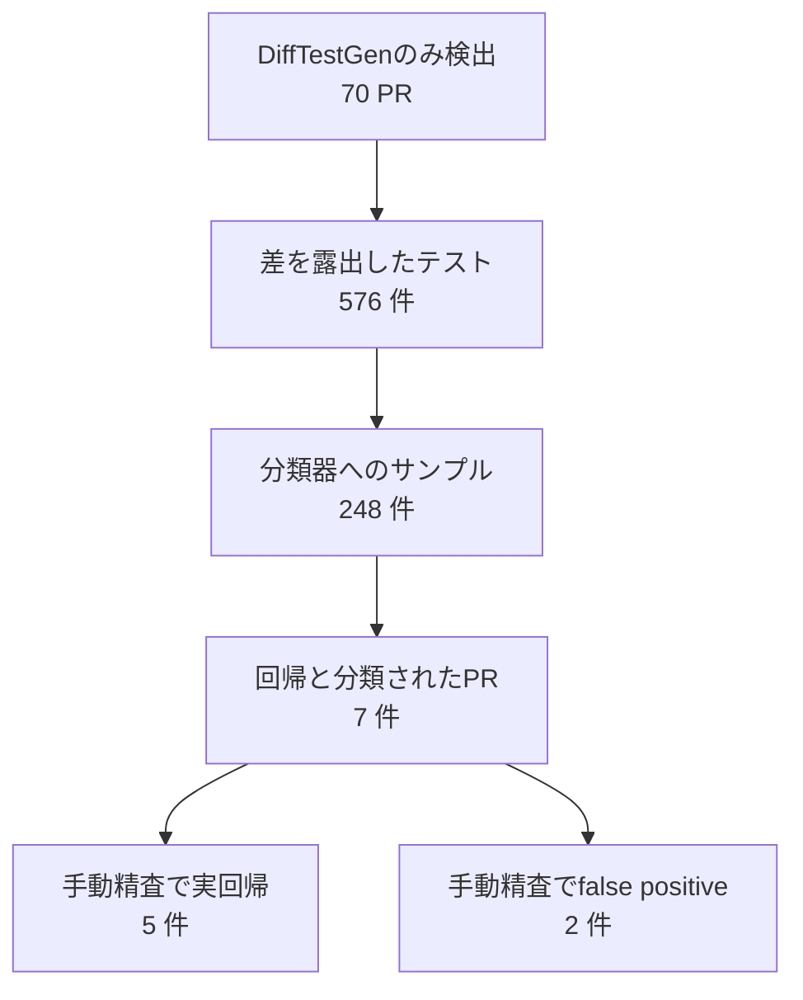

| 段階 | 処理 | 運用上のアクション |
|---|---|---|
| 振る舞い差の検出 | 新旧版で出力・ランタイムエラーが異なるテストを収集 | 自動化してよい (LLM 分類器不要) |
| サンプリング | 各 PR から最大 5 テストをランダム抽出 | 同一差異の重複検出を間引くため、自動化してよい |
| LLM 分類器による意図判定 | PR 説明と照らして「意図した変更」か「回帰疑い」かを判定 | 一次フィルタとして使う。判定結果を鵜呑みにしない |
| 人手による最終判定 | 回帰疑いと分類された PR だけを人が精査する | 必須の工程として残す。7 件中 2 件は false positive だった |

70 件全部を人手で精査するのではなく、分類器で 7 件まで絞り込んでから人が見る、という 2 段構えが運用上のコストを抑える鍵です。ただし分類器の判定を最終結果として採用しない運用にします (詳細は後述のベストプラクティスを参照)。

## ベストプラクティス

### 「振る舞い差 ≠ 回帰」を運用に落とす

本論文の最も重要な実務的含意は、振る舞い差の検出割合をそのまま「回帰検出率」として扱ってはいけない、という点です。

数字のレイヤーが 2 つあることだけ押さえます (funnel の詳細は前掲の「結果のトリアージ運用」を参照)。

| レイヤー | 数値 |
|---|---|
| 振る舞い差を検出した PR の割合 | Testora data 79.7% (350/439)、ChaCo data 61.8% (21/34, gpt-4o-mini) |
| そこから確定した実際の回帰バグ | 5 件 (DiffTestGen のみが検出した 70 PR のうち、分類器が回帰と判定した 7 PR を手動精査した結果。残り 2 件は false positive) |

論文自身も「差の大半は意図した変更であるのは当然」と述べています。開発者は普通、意図どおりに変更を入れるからです。運用でこの事実を踏まえるなら、次の 2 点を守ります。

- 振る舞い差の検出を「アラート」として扱い、「バグの確定」として扱いません
- 最終オラクル (意図どおりの変更か、回帰か) の判定は、DiffTestGen の外側に必ず用意します。LLM 分類器はその一次フィルタにすぎません

### 公開 API 経由でテストするという設計思想の一般化

DiffTestGen は、private 関数を直接叩くテストを生成させません。代わりに、その private 関数へ到達できる public な entry 関数の情報 (import line・signature・docstring・所属クラス情報) を LLM に与え、public API 経由でしか実行しないテストを生成させます。

| 変更関数の分類 | 与える情報 | 生成されるテストの実行経路 |
|---|---|---|
| public 関数 | import line、所属クラスの signature と docstring | 対象関数を直接呼び出す |
| private 関数 | entry 関数の import line・signature・docstring・所属クラス情報 | entry 関数 (public) 経由で対象関数へ到達する |
| special method | 所属クラスの import line・signature・docstring・usage guideline | 所属クラス経由で special method を間接的に呼び出す |

この設計思想は DiffTestGen 固有の実装に限らず、一般的なテスト生成・テスト自動化に転用できます。実装詳細 (private 関数) に直接結合したテストは、リファクタリングのたびに壊れやすく、メンテナンスコストが高くなります。到達経路さえ与えれば、テストは公開 API に結合したまま安定します。手動でテストを書く場合も、この原則 (private を直接叩かず、到達経路を経由する) を踏襲する価値があります。

### ドキュメントがテスト生成の入力になるという含意

Access information の抽出は、public API リストと docstring に依存します (論文 II-C1)。ドキュメントが整っていないプロジェクトでは、public/private の判定精度や、生成されるテストの質が下がります。

この事実は、ドキュメント整備の ROI を変えます。従来「docstring は人間の理解のため」という位置づけでしたが、DiffTestGen のような変更誘導型テスト生成を導入すると、docstring と public API リストの整備が、そのままテスト生成の精度向上に直結します。運用上は次を推奨します。

- public API として扱うモジュール・関数のリストを明示的に管理する (論文は「public API リストに載っているか」を第一の判定基準にしています)
- 命名規約 (`_` 始まりは private、`__` 始まりは special method) を一貫させる。規約が崩れていると access information の分類が誤ります
- entry 関数となりうる public 関数の docstring を優先的に整備する。private 関数への到達経路情報の質に直結します

### 非決定性への対処

論文は Threats to Validity (IV 章、内的妥当性) で、LLM ベーステスト生成の非決定性を明示しています。生成されるテストや検出される振る舞い差は、実行のたびにわずかに変動します (marshmallow での観測に言及)。論文は数百 PR での評価により、個々の変動を平均化して緩和しています。

運用では次の対処を推奨します。

- 単発実行の結果を確定値として扱わない。特に「差が検出されなかった」という結果は、非決定性による見落としの可能性を残します
- 重要な PR (リリース直前など) では複数回実行し、検出結果の再現性を確認します
- flaky 除去の仕組み (各生成テストを新旧両版で再実行し、初回と結果が異なれば破棄) はパイプラインに組み込まれています。この仕組みを無効化しない運用にします

### LLM の選択

論文は既定モデルを gpt-5-mini としていますが、比較のため gpt-4o-mini でも評価しています。同じ ChaCo data (34 PR) での結果です。

| モデル | 検出 PR 数 | union coverage |
|---|---|---|
| gpt-4o-mini | 21 / 34 (61.8%) | 64.5% |
| gpt-5-mini | 28 / 34 (82.4%) | 76.8% |

モデルを gpt-4o-mini から gpt-5-mini に切り替えるだけで、検出 PR 数が 21 → 28、union coverage が 64.5% → 76.8% に改善しています。この差は、モデル更新が結果に大きく影響することを示します。運用上は次を推奨します。

- 使用する LLM のモデル名とバージョンを、実行ログ・レポートに必ず記録します
- LLM を更新した際は、過去の検出率・カバレッジの基準値をそのまま比較対象にしません。基準値を取り直してから比較します
- コスト試算 (前掲の月間試算表) も、使用モデルの pricing が変われば再計算が必要です

### 適用が向かない変更

論文の評価では、Testora / Testora++ / DiffTestGen の 3 手法すべてが振る舞い差を検出できなかった PR が 69 件ありました。内容は次のような、非機能的で振る舞いへの影響が小さい変更が中心です。

| 変更の種類 | 振る舞い差が出にくい理由 |
|---|---|
| typing 改善 | 型ヒントの追加・修正は実行時の出力を変えません |
| リファクタリング | 内部構造の変更で、公開インターフェースの出力は変わりません |
| 互換性調整 | 既存の振る舞いを維持したまま実装だけを変える変更です |
| dtype 安定化 | 数値型の内部表現を安定させる変更で、出力値自体は変わらないことが多いです |

このような変更が中心の PR に DiffTestGen を適用しても、検出できる可能性は低いことを見込んでおきます。適用前のスクリーニングとして、PR のタイトル・説明にこれらのキーワードが含まれる場合は、優先度を下げる運用が現実的です。

### AI 生成パッチのレビューへの応用

DiffTestGen の設計思想は、AI (LLM) がコードを生成する時代のパッチレビューにも応用できます。従来の「テストが通るか」という基準では、AI が生成した意図しない副作用のあるコードも通過してしまいます。DiffTestGen が示すのは、「意図した差分だけが存在するか」を確認する視点です。

- 変更前後で振る舞いが変わった箇所を機械的に洗い出す (union coverage を伴う変更誘導型テスト生成)
- 洗い出した差分を PR の説明 (意図) と突き合わせ、意図どおりかを判定する
- 意図しない差分が見つかった場合のみ、人がレビューする

この流れは、AI が生成した PR の量が増えるほど、レビュー工数を線形に増やさないための仕組みとして有効です。ただし、最終判定 (意図どおりか回帰か) を機械だけに委ねない、という原則はここでも変わりません。

## トラブルシューティング

| 症状 | 原因 | 対処 | 論文の根拠 |
|---|---|---|---|
| 生成テストが変更コードに到達できず `ModuleNotFoundError` になる | 変更関数を呼び出す経路の情報 (access information) が欠落・誤抽出している | entry 関数の抽出結果を確認する。private 関数の場合は top-k 最短コールパスが正しく求まっているか確認する | III-F: Figure 6 は「Testora / Testora++ が access information を欠くため、生成テスト全てが ModuleNotFoundError で失敗した」事例。DiffTestGen で同様の失敗が出た場合は access information 抽出のバグを疑う |
| union coverage が伸びない | 変更コードへの到達経路が複雑、または循環参照 (recursion) を含むパスが除外されている | PR の対象範囲を縮小する。呼び出しグラフを手動確認し、entry 関数の候補が正しいか確認する | II-C3: top-k 最短コールパス探索は recursion を含むパスを破棄する仕様 |
| 停止条件が「前ラウンドから変化なし」で、union coverage が 100% 未満のまま終了する | 到達できない変更行が残っている | 未到達行を特定し、access information (public API リストの整備、entry 関数の候補追加) を見直す | II-B: 停止条件は 100% 到達 または 前ラウンドから変化なしの 2 種類。後者は未達のまま終了しうる |
| 差が全く検出されない | 変更が非機能的 (typing 改善・リファクタ・互換性調整・dtype 安定化など) の可能性がある | PR の内容を確認する。振る舞いに影響しない変更であれば、検出されないこと自体が正常な結果 | III: 3 手法すべてが失敗した 69 PR は非機能的変更が中心という分析 |
| 同じ PR でも実行のたびに検出結果が変わる (flaky) | LLM ベーステスト生成の非決定性 | 複数回実行して再現性を確認する。flaky 除去 (新旧両版での再実行と結果比較) が有効に機能しているか確認する | IV Threats to Validity (内的妥当性): 非決定性への言及、marshmallow での観測 |
| コストが想定を超える | 大規模 PR、または対象範囲外の PR (4 条件ゲート未適用) に回している | 適用前の 4 条件ゲートを徹底する。ラウンド数の上限を設ける (前掲「ラウンド数の運用」参照) | III-B: 対象スコープ 4 条件。III-E: PR あたり平均コスト $0.041 |
| private 関数を直接叩くテストが生成される | access information の分類 (public/private/special) が誤っている、または命名規約が崩れている | `_` 始まり (`__` 除く) は private、`__` 始まりは special method、という命名規約がプロジェクト全体で一貫しているか確認する | II-C1: public/private/special の判定基準。private でも public API 経由で実行させる設計思想 |
| 大きな PR でプロンプト長が破綻する、または文脈抽出が不十分になる | スケーラビリティの限界。変更が大規模・複雑になるほど有用な文脈抽出・access path 探索・プロンプト長制御が難しくなる | 4 条件ゲート (非テストソースファイル最大 3 つ) を厳格に適用する。超える場合は PR 分割を促す | IV Threats to Validity (外的妥当性): スケーラビリティの限界への明記 |
| Python 以外の変更が PR に含まれる | 論文の評価は Python プロジェクトに限定。対象外言語の変更は一般化の対象外 | 対象を Python の非テストソースファイルに絞る。Python 以外の変更が主体の PR には適用しない | IV Threats to Validity (外的妥当性): Python 限定、他言語への一般化不可の明記 |

## まとめ

DiffTestGen は、PR の diff を起点にテストを誘導し、private 関数への到達経路を access information として LLM に渡すことで、変更前後の振る舞い差を露出させる手法です。検出するのは振る舞い差であって回帰バグそのものではないため、意図どおりの変更か回帰かを判定する最終オラクルは、この手法の外側に必ず用意します。

この記事が少しでも参考になった、あるいは改善点などがあれば、ぜひリアクションやコメント、SNSでのシェアをいただけると励みになります！

## 参考リンク

### 一次論文 (本フレームワーク)

- [DiffTestGen: Change-Directed LLM-Based Testing for Exposing Behavioral Differences — arXiv abstract](https://arxiv.org/abs/2607.16024)
- [同 全文 (HTML)](https://arxiv.org/html/2607.16024v1)
- [同 PDF (著者所属は 1 ページ目に記載。HTML 版には含まれません)](https://arxiv.org/pdf/2607.16024)

### 公開実装 (sola-st/DiffTestGen, MIT License)

- [リポジトリトップ](https://github.com/sola-st/DiffTestGen)
- [README.md](https://github.com/sola-st/DiffTestGen/blob/main/README.md)
- [RegressionFinder.py — CLI 引数定義 (`--project` / `--pr` / `--paras` の必須判定)](https://github.com/sola-st/DiffTestGen/blob/main/src/testora/RegressionFinder.py)
- [Config.py — 設定パラメータの既定値](https://github.com/sola-st/DiffTestGen/blob/main/src/testora/Config.py)
- [Entry.py](https://github.com/sola-st/DiffTestGen/blob/main/src/testora/Entry.py) / [EntryLocal.py](https://github.com/sola-st/DiffTestGen/blob/main/src/testora/EntryLocal.py) — `--paras` 配列の各要素の意味
- [CoverageAnalyzer.py — union coverage 計算 (`DiffCoverage`) の実装](https://github.com/sola-st/DiffTestGen/blob/main/src/testora/execution/CoverageAnalyzer.py)
- [TestExecution.py — テスト実行結果の保持構造](https://github.com/sola-st/DiffTestGen/blob/main/src/testora/execution/TestExecution.py)
- [PrivateIdentification.py — public / private / special method の判定](https://github.com/sola-st/DiffTestGen/blob/main/src/testora/util/PrivateIdentification.py)
- [ExtractCallerCallee.py — コールグラフ解決 (LSP の references / definition を利用)](https://github.com/sola-st/DiffTestGen/blob/main/src/testora/util/ExtractCallerCallee.py)
- [GetAccessInfoString.py — access information の文字列化](https://github.com/sola-st/DiffTestGen/blob/main/src/testora/util/GetAccessInfoString.py)
- [ReferenceTestsFilter.py — reference test の選定 (最寄り行距離ベースのヒューリスティック)](https://github.com/sola-st/DiffTestGen/blob/main/src/testora/util/ReferenceTestsFilter.py)
- [.devcontainer — Dev Container によるセットアップ定義](https://github.com/sola-st/DiffTestGen/tree/main/.devcontainer)

### 関連学術論文 (系譜)

いずれも Michael Pradel のグループが関与しており、Testora → ChaCo → DiffTestGen は同一系譜の積み上げです。

- [Testora: Using Natural Language Intent to Detect Behavioral Regressions (arXiv 2503.18597)](https://arxiv.org/abs/2503.18597) — 本手法の直接のベースライン。DiffTestGen はこの実装の上に約 2,800 行を追加して構築されています
- [Change And Cover: Last-Mile, Pull Request-Based Regression Test Augmentation (arXiv 2601.10942)](https://arxiv.org/abs/2601.10942) — ChaCo。PR ベースのテスト増強。比較対象データセットの出所
- [CoverUp: Effective High Coverage Test Generation for Python (Proc. ACM Softw. Eng. 2, FSE 2025)](https://arxiv.org/abs/2403.16218) — 変更に誘導されない一般的な Python テスト生成の代表例
- [ChatUniTest: A Framework for LLM-Based Test Generation (FSE 2024 Companion)](https://arxiv.org/abs/2305.04764) — LLM ベーステスト生成の代表例

### 関連ツール公式

- [coverage.py 公式ドキュメント](https://coverage.readthedocs.io/) — union coverage を自前実装する際の基盤 (`Coverage.analysis2()` は DiffTestGen の `CoverageAnalyzer.py` でも使用)
- [pytest 公式ドキュメント](https://docs.pytest.org/) — 生成テストの実行基盤
- [GitHub Actions 公式ドキュメント](https://docs.github.com/en/actions) — CI への組み込み
- [GitHub REST API — Pull Requests](https://docs.github.com/en/rest/pulls/pulls) — PR の diff 取得
