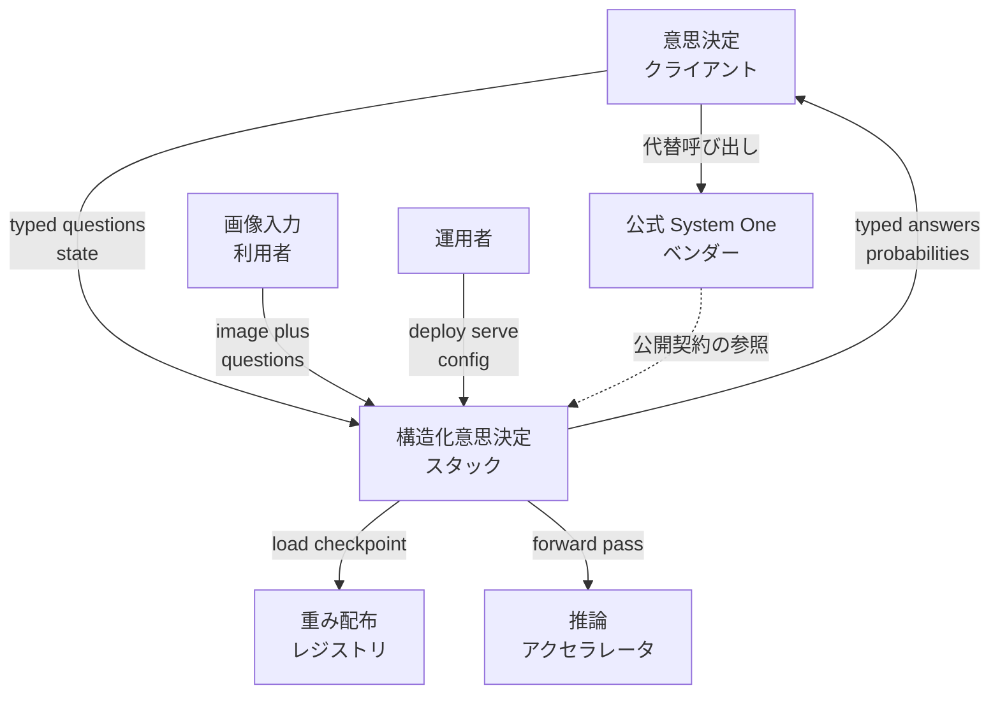
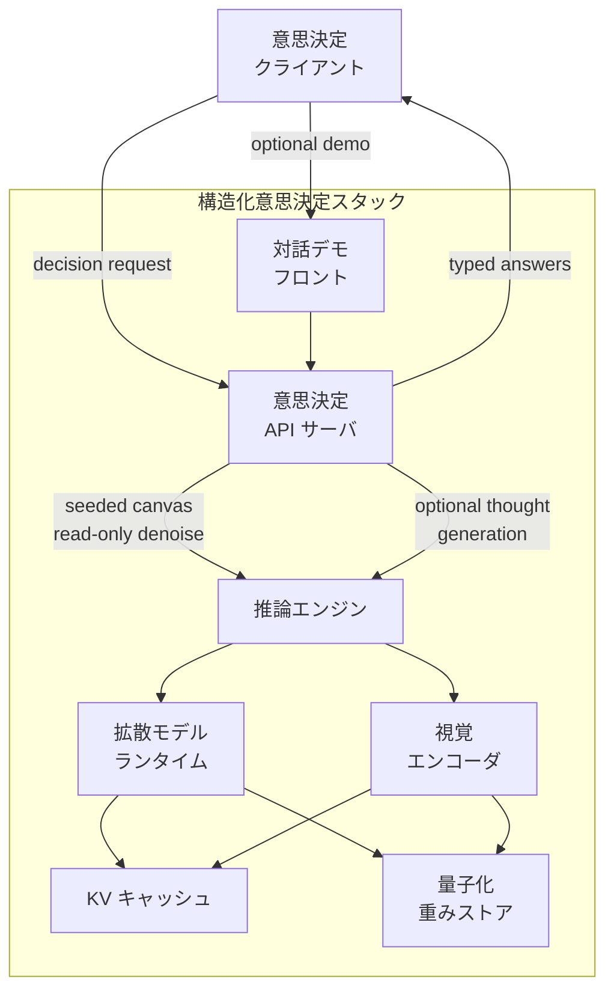
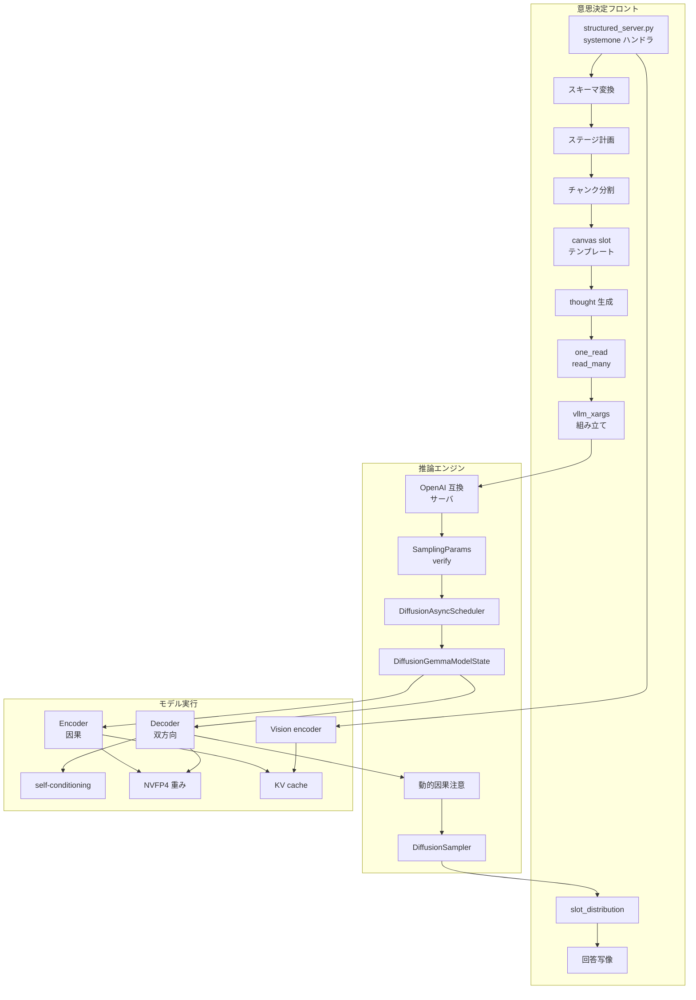
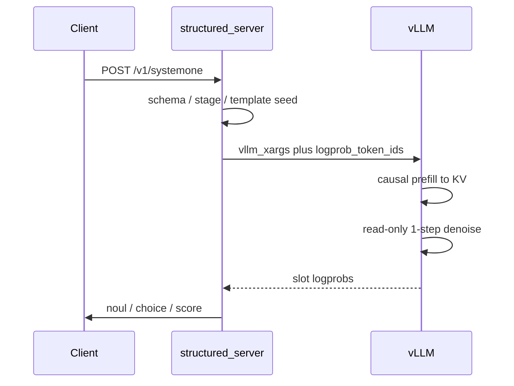
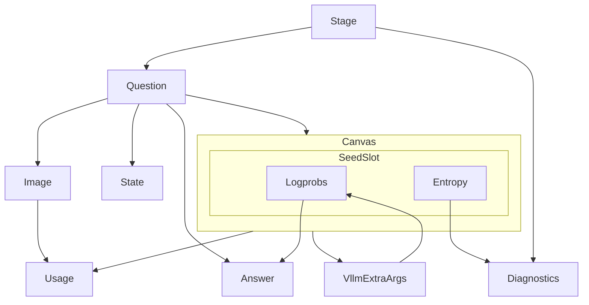
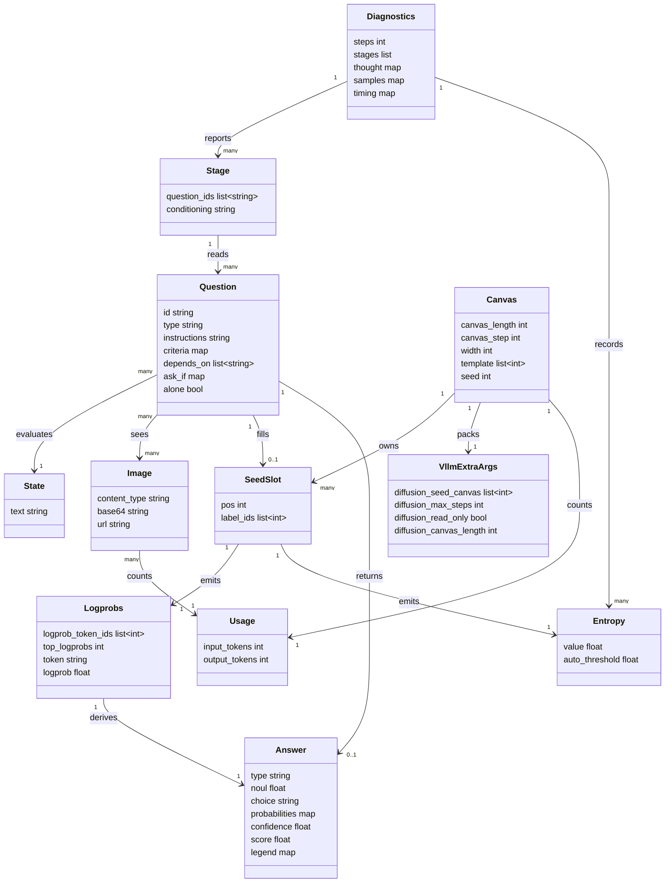

DiffusionGemma-as-Jev（以下 djev）は、Google DeepMind の拡散 LLM「DiffusionGemma」を、TypeSafe AI の決定モデル Jev と同じ HTTP 契約で動かすオープンソースのスタックです。
この記事では、djev の仕組み・データ形・構築手順・運用値を、実装者が手元で再現できる粒度で整理します。
数値と仕様は 2026-09-19 時点の公開資料に基づきます。


*この記事の全体像。以下、順に解説します。*

## DiffusionGemma-as-Jev とは

djev は、DiffusionGemma（26B A4B の離散拡散 LLM）を、Jev と同じ `POST /v1/systemone` 契約で動かす実装です。
ソフトウェアが分岐に使える型付き決定（`noul` / `choice` / `score`）を、オープン重みの 1-step canvas 読み取りで返します。

主要な公開物は次の 3 つです。

- エンジン変更: Matt Mastracci による vLLM PR [#57250](https://github.com/vllm-project/vllm/pull/57250)（2026-09-19 時点で Open）
- DGX Spark / GB10 向けの容器化レシピ: [djev-spark](https://github.com/mmastrac/djev-spark)
- コミュニティによる別実装: [OpenJev](https://github.com/razorback16/openjev)

全体は 4 つの層で構成されます。

| 層 | 役割 | 正本 |
|---|---|---|
| 契約 | `POST /v1/systemone`。`state` と型付き `questions` を受け、`answers` を返す | [TypeSafe docs](https://docs.typesafe.ai/) / [発表ブログ 2026-09-15](https://typesafe.ai/blog/introducing-system-one-models-and-jev) |
| 生成モデル | 総パラメータ 25.2B。活性パラメータは model card で 3.8B、論文 Table で 3.85B。256 トークンの canvas を並列 denoise する | [DiffusionGemma model card](https://ai.google.dev/gemma/docs/diffusiongemma/model_card) / [arXiv:2608.00146](https://arxiv.org/abs/2608.00146) |
| エンジン | seeded canvas、read-only 1-step、step 上限、`logprob_token_ids` | vLLM PR #57250 |
| サーバー | テンプレートで固定したスロットの分布を Jev の形へ写す | djev-spark `structured_server.py` / OpenJev |

TypeSafe Jev は、RLCD（Reinforcement Learning for Calibrated Decisions）で訓練された商用の System One モデルです。
djev は同じ HTTP 形を、既存の DiffusionGemma 重みの canvas 読み取りで実装します。
実行時に TypeSafe の API は呼びません。

vLLM の native dLLM serving（[2026-06-10 ブログ](https://vllm-project.github.io/2026/06/10/diffusion-gemma.html)）は、DiffusionGemma を通常のテキスト生成としてバッチ実行する経路です。
djev はその上に、canvas をテンプレートで固定して 1 回だけ読む経路を足します。


*自己回帰 LLM と拡散 LLM の生成単位の違い（出典: [Diffusion in Text Generation Explained](https://ai.google.dev/gemma/docs/diffusiongemma/explained)）*

### 公式の生成ループと djev が使う部分

DiffusionGemma の本来の用途は文章生成です。
[explained](https://ai.google.dev/gemma/docs/diffusiongemma/explained) と [model card](https://ai.google.dev/gemma/docs/diffusiongemma/model_card) の用語で、生成ループは次の 3 点から成ります。

1. **Uniform State Diffusion**
   明示的な `[MASK]` ではなく、語彙からのランダムトークンで canvas を初期化します。確信度が落ちた位置は再ノイズします。吸収型の MASK 拡散とはここが違います。
2. **canvas 256**
   双方向デコーダが 256 トークンを並列に denoise します。生成時の上限は 48 step、典型は 12〜16 step です。temperature 0.8→0.4、entropy bound 0.1、adaptive stop 0.005 はこの生成サンプラーの設定です。
3. **block-autoregressive（multi-canvas sampling）**
   完成した 256 トークンを因果エンコーダが KV に commit し、次の空 canvas を開きます。長文は拡散とブロック単位の自己回帰の組み合わせで作ります。

djev はこのループを回しません。
テンプレートで固定した **seed canvas** を **read-only 1-step** で読み、commit も KV 位置の前進もしません。
`steps > 1` にすると canvas がテンプレートから drift します。

返せる型は Jev と同じ 3 種類です。

| 型 | 質問 | 回答 |
|---|---|---|
| `noul` | はい / いいえ | `noul`: yes の確率 0〜1 |
| `choice` | 定義済み選択肢から 1 つ | `choice`、`probabilities`、`confidence` |
| `score` | 順序付き水準 | `score`（期待値。最低水準が 0）、`legend`、`probabilities`、`confidence` |

- 同一リクエストの複数質問は、同じ `state` に対して 1 つの canvas で読めます。
- 同一 canvas に並べたスロットは互いに影響します。独立させたい質問には `alone` を付けます。
- ラベルは単一トークンに置く前提です。複数トークンの選択肢は、呼び出し側が 1 トークンの記号へ写像します。

公開されている決定速度の実測値は次のとおりです（ハードウェアが違うため参考値です）。

| 実装 | ハードウェア | 1 クライアント | 高並列 |
|---|---|---|---|
| djev-spark 128k プロファイル（2026-09-18、`MAX_MODEL_LEN=131072`） | GX10 / GB10 | 8.54 req/s、p50 0.12 s | 32 クライアント 49.47 req/s、148.4 decisions/s |
| djev-spark 4k 既定（同日、`MAX_MODEL_LEN=4096`） | GX10 / GB10 | 8.29 req/s、p50 0.12 s | 32 クライアント 53.37 req/s、160.1 decisions/s |
| PR #57250 Test Result | DGX Spark | 8.7 req/s、0.12 s | 32 並列 54.0 req/s、約 162 decisions/s |
| OpenJev | RTX PRO 6000（GPU 使用率 38%） | 10.7 req/s、p50 94 ms | 64 クライアント 57.4 req/s、p50 760 ms |

TypeSafe の公表値は、E2E 70〜500 ms、入力 $0.042 / MTok、出力無料です。
資料ごとの定義差は「注意点」にまとめます。

## 特徴

- TypeSafe Jev と同じ `POST /v1/systemone` 形で、オープン重みの DiffusionGemma を決定器にします。
- 出力は型付き値です。呼び出し側がパースするのは JSON の `answers` です。
- 1 回の read-only denoise で、固定スロットのラベル分布を温度 1 の logprobs として読みます。
- 複数の質問を 1 つの canvas に並べ、同じ prompt / KV で同時に答えます。
- 不確かさの信号はスロットの entropy です。`samples=auto` は初回の分布が荒いときだけ再読みします。
- DiffusionGemma の vision encoder（約 550M）を使い、画像についての質問ができます。Jev 本体の入力はテキストだけです。
- NVFP4 量子化版（`nvidia/diffusiongemma-26B-A4B-it-NVFP4`）で DGX Spark やハイエンド GPU に載ります。checkpoint は約 18 GB、起動時の重みは約 19 GB です。
- モデルのライセンスは Apache 2.0 です。NVIDIA の NVFP4 配布は、Gemma Terms of Use / Prohibited Use Policy も Governing Terms に含めます。
- OpenJev は TypeSafe SDK の `TYPESAFE_BASE_URL` を差し替えるだけで呼べます。
- エンジンの初期化は djev-spark イメージで 88〜93 秒です（FlashInfer カーネルキャッシュ付き nightly、GX10、2026-09-18）。
- djev-spark は `depends_on` / `ask_if` / `alone` で質問間の段階を組めます。
- 同一プロセスで OpenAI 形の生成も提供します（djev の `/v1/raw/chat/completions`、OpenJev の `/v1/chat/completions`）。

### 類似ツールとの比較

数値は各公式資料・README の値です。ハードウェアが違うため、req/s は参考値として読んでください。

| 項目 | djev（PR #57250 + djev-spark） | TypeSafe Jev | DiffusionGemma 通常生成 | vLLM `structured_outputs` | OpenJev | Inception Mercury |
|---|---|---|---|---|---|---|
| 実行方式 | ローカル vLLM。seeded canvas の 1-step read。前面に Jev 形 HTTP | ホスト API `api.typesafe.ai`。RLCD の System One | vLLM / HF の block diffusion 生成 | 自己回帰モデルの制約デコード | ローカル Docker、または Codiv のホスト | ホスト API。dLLM チャット |
| リソース | NVFP4 重み 19 GB。Spark GB10。canvas 既定 128 | GPU 不要。入力はテキストのみ。コンテキスト 64k / request、state と最長質問で 32k（[Models](https://docs.typesafe.ai/models)） | 同じ 26B A4B。canvas 256。denoise 上限 48 | 対象 AR モデルの VRAM | NVFP4。README は GPU 24 GB 以上。canvas 既定 64 | クラウド |
| 対応機能 | 3 型、画像、think / samples / 依存質問、同じ箱で raw 生成 | 3 型。choice 最大 255。score 2〜10 水準 | 文章生成、thinking、画像・動画、function calling | JSON / choice / regex / grammar の文字列 | Jev ワイヤ互換。choice 最大 128。約 12 問ずつ chunk | チャット、tool calling、JSON schema |
| 速度 | エンジン起動 88〜93 s。決定 p50 約 0.12 s | ホスト済み。E2E 70〜500 ms | H100 FP8 で 1000+ tok/s（blog）。model card は 1100+ | `vllm serve` に依存 | 初回 18 GB を取得。決定 p50 94 ms（1 並列） | ホスト済み |
| 学習 / 校正 | 既存重みの読み取り。entropy で再読み | RLCD。confidence は分布から算出 | SFT + RL + sampler distillation | 制約デコード | 既存重みの読み取り | 商用 dLLM |
| 料金（公表） | 自己ホスト。GPU 時間 | 入力 $0.042 / MTok。出力無料 | 自己ホスト、または Vertex | 自己ホスト | Codiv 無料枠 100M 入力トークン | Mercury 2.5 キャンペーン入力 $0.04 / MTok |

### ユースケース別の選び方

| ユースケース | 推奨 | 理由 |
|---|---|---|
| チケット分類・ルーティングを校正済み確率で本番自動化する | TypeSafe Jev | RLCD、70〜500 ms、choice 255、ホスト SLA |
| Jev SDK のまま、手元の GPU や画像付きで同じワイヤを使う | djev-spark（Spark / GB10）または OpenJev（24 GB 級 GPU / Codiv） | 同じ `POST /v1/systemone`。画像は djev 側の拡張 |
| 返品写真やフレーム単位のハザード判定 | djev-spark / OpenJev | Jev 本体はテキストのみ。DiffusionGemma の vision encoder を読み取りに使う |
| インライン編集や、256 トークン単位の低遅延な文章生成 | DiffusionGemma 通常生成 | 本来の block diffusion。H100 で 1000+ tok/s |
| 任意の JSON スキーマや SQL grammar を AR モデルで強制する | vLLM `structured_outputs` | seeded canvas とは別の機能 |
| 選択肢が 100 を超える | TypeSafe Jev（上限 255）。128 以下なら OpenJev | OpenJev README が 128 を明示。djev の内部ラベルは 26 |
| オンプレミスで決定器を自己ホストする | djev-spark / OpenJev | Apache 2.0 の重み。ただし PR は Open |

## 構造

djev は公式の System One ベンダーではなく、その契約を **seeded canvas + read-only 1-step** で再現する OSS スタックです。
C4 モデルの粒度で、外側から順に分解します。

### システムコンテキスト図

アクター、djev、外部システムの関係です。ノードは役割名で書きます。



| 要素名 | 説明 |
|---|---|
| 意思決定クライアント | 状態と型付き質問を送り、確率付きの typed answers を受け取るアプリ / SDK。公式ベンダーと djev を URL で切り替える |
| 運用者 | コンテナ起動、canvas 幅、同時実行数、メモリ上限、認証を設定する人 |
| 画像入力利用者 | 公式契約に無い画像を multipart または data URL で添えて質問する人 |
| 構造化意思決定スタック | djev 本体。意思決定 API → 推論エンジン → 拡散モデル → 量子化重み |
| 公式 System One ベンダー | 契約の正本。RLCD で訓練した typed モデルをホストする。djev の実行時依存ではない |
| 重み配布レジストリ | 命令調整済み拡散モデルと NVFP4 チェックポイントの配布元 |
| 推論アクセラレータ | 単一ボックス上の GPU。重み・KV・canvas を載せる |

### コンテナ図

djev をプロセス境界で分解します。



| 要素名 | 説明 |
|---|---|
| 意思決定 API サーバ | Jev 形のリクエストを検証し、回答テンプレートを canvas へ焼き、推論エンジンへ read-only 要求を出す。返ったスロット分布を noul / choice / score に写す |
| 対話デモ フロント | 任意。テキスト・画像・カメラフレームを API サーバへ送るページ。TLS が無いとブラウザはカメラを開かない |
| 推論エンジン | chat / completions を公開するサービング基盤。プレフィックスキャッシュ、非同期スケジュール、拡散用のリクエスト状態を持つ |
| 拡散モデル ランタイム | 同じ重みを因果エンコーダと双方向デコーダの 2 モードで回す |
| 視覚エンコーダ | 画像をトークン化して KV に載せる。プロンプトでは画像が state テキストより前に来る |
| KV キャッシュ | エンコーダが書いた文脈。read-only ではデノイズ中に位置を進めない |
| 量子化重みストア | ディスク上のチェックポイント。起動時にアクセラレータへ載る |

データ経路は常に **クライアント → API サーバ → 推論エンジン → ランタイム / 視覚エンコーダ → 重みと KV** です。

### コンポーネント図

API サーバ、推論エンジン、モデル実行をドリルダウンします。ここでは具体的なファイル名・クラス名を使います。



意思決定フロントの要素です。

| 要素名 | 説明 |
|---|---|
| structured_server.py systemone ハンドラ | `POST /v1/systemone` を受ける。djev-spark では `:8011`。OpenJev は FastAPI の `openjev/api.py` が同じ契約を実装する |
| スキーマ変換 | `state` と `questions` を内部スキーマへ変換する。noul は yes/no、choice は単一トークンラベル、score は順序レベル |
| ステージ計画 | `depends_on` / `ask_if` / `alone` で質問を段階分けする。循環は 422。OpenJev はこのキーを持たない |
| チャンク分割 | 回答テンプレートが canvas に収まらないときに分割する。djev は `chunk_rows`、OpenJev は約 12 問単位 |
| canvas slot テンプレート | 固定文言を canvas に置き、ラベル位置だけをノイズにする。全ラベルが同じ位置の 1 トークンでなければ拒否する |
| thought 生成 | 任意。先に thought チャネルを生成し、後続の read をそれに条件付ける |
| one_read / read_many | 上流へ 1 回または複数回の read-only デノイズを投げる。`samples=auto` は entropy 超過時だけ追加する |
| vllm_xargs 組み立て | `diffusion_seed_canvas` / `diffusion_max_steps` / `diffusion_read_only` / `diffusion_canvas_length` を載せる。`logprob_token_ids` は xargs 外のリクエストフィールド |
| slot_distribution | 各スロットの temperature 1 の logprobs から、ラベル分布と entropy を作る |
| 回答写像 | 分布を noul / choice / score の Jev 形へ変換する |

推論エンジンの要素です。

| 要素名 | 説明 |
|---|---|
| OpenAI 互換サーバ | vLLM の chat / completions。djev-spark では `:8010`。structured-reads パッチを含む |
| SamplingParams verify | extra_args をリクエスト作成時に検証する。語彙外の seed は 400 |
| DiffusionAsyncScheduler | PR #57250 が追加したサブクラス。read-only の余分な先読みデノイズを止める |
| DiffusionGemmaModelState | canvas、位相、self-conditioning をリクエスト単位で持つ |
| DiffusionSampler | Prefill で seed canvas を載せ、Denoise で位置を進めない。read-only なら commit フォワードを省略し、収束ステップの logprobs を返す |
| 動的因果注意 | 同一バッチで因果 prefill と双方向 denoise を混在させる。既定バックエンドは TRITON_ATTN |

モデル実行の要素です。

| 要素名 | 説明 |
|---|---|
| Encoder（因果） | プロンプトの prefill と、通常生成時の canvas commit。KV へ書く |
| Decoder（双方向） | canvas 全体を一度にデノイズする。read-only 1-step ではここが本体 |
| self-conditioning | 前ステップの分布を埋め込みに戻す。1-step タイルでは PR が matmul を省略する |
| Vision encoder | 約 550M。画像トークンを KV へ載せる。audio は非対応 |
| NVFP4 重み | 量子化チェックポイント |
| KV cache | エンコーダ出力と commit 済みブロック。プレフィックスキャッシュが共有の先頭を再利用する |

read-only 経路では、Sampler が KV 位置を止め、canvas 幅分のプレースホルダだけをスケジュールします。
ラベルは生成された文ではなく、指定位置の分布として読みます。

1 リクエストの流れは次のとおりです。



vLLM の公式ブログ（2026-06-10）の時点では、拡散は投機的デコードの経路に載せ、スケジューラは無改変でした。
PR #57250 は `DiffusionAsyncScheduler` サブクラスを追加します。
非同期スケジュールは 1 ステップ先読みします。denoise はトークンを返さないため、既存の `max_tokens` ガードが発火せず、read-only が余分な forward を 1 回捨てていました。サブクラスはこの無駄を止めます。

## データ

### 概念モデル

入力（State / Image / Question / Stage）から canvas を組み、スロットの分布を Answer に写すまでの関係です。



| 区分 | 要素名 | 説明 |
|---|---|---|
| 入力 | State | 質問の対象コンテンツ。string、object、array |
| 入力 | Image | State の前に置く画像。Jev 契約の外 |
| 入力 | Question | 型付きの判断。`noul` / `choice` / `score` |
| 入力 | Stage | `depends_on` / `ask_if` から組む読み取り段階。Jev 契約の外 |
| Canvas | Canvas | 1 回の read-only denoise が埋めるトークン列 |
| Canvas | SeedSlot | 質問 1 件分のラベル位置。テンプレートは固定、スロットだけがノイズ |
| Canvas | Logprobs | スロット位置のトークン対数確率。temperature 1 |
| Canvas | Entropy | 返却された top 集合上の entropy。再読みの判定に使う |
| エンジンと応答 | VllmExtraArgs | vLLM の `vllm_xargs` / `SamplingParams.extra_args` |
| エンジンと応答 | Answer | Question と同じ id の型付き値。`ask_if` が不成立なら null |
| エンジンと応答 | Usage | 入出力トークン数 |
| エンジンと応答 | Diagnostics | サーバ固有の実行痕跡。Jev 契約の外 |

### 情報モデル



主要な属性の実装差は次のとおりです。

| エンティティ | 属性の内容 | 出典 |
|---|---|---|
| Question | `id` はマップのキー。TypeSafe はモデルへ送らない。djev はテンプレートに実 id を書く。OpenJev は `q1` 形式へ写像する | TypeSafe API、djev `jev_schema`、OpenJev README |
| Question.criteria | noul は任意の `{true,false}`。choice は必須の map。score は必須の順序 list | TypeSafe API / djev README |
| Canvas.canvas_length | サーバ既定。djev 128、OpenJev 64、公式生成 256 | `.env.example`、OpenJev README、model card |
| Canvas.canvas_step | djev の既定は 16。リクエストの幅はこの倍数 | `structured_server.py` |
| SeedSlot | 全ラベルが同じ 1 トークン位置。語彙サイズ 262144。TURN_CLOSE は 106、PAD は 0 | model card、`structured_server.py` |
| VllmExtraArgs | 4 キー。`logprob_token_ids` は xargs 外で最大 128 | PR #57250 |
| Answer.confidence | 実装ごとに定義が違う。noul には無い | TypeSafe `/confidence`、djev README、OpenJev README |
| Answer.score | レベル番号の確率加重平均。0 始まり | TypeSafe API、djev `jev_answer` |
| Usage.output_tokens | TypeSafe は常に返す。djev は canvas 行 + thought。OpenJev は think 未設定なら 0 | 各 README / API |
| Diagnostics | 図の属性に加え、`skipped`、`chunks`、`sequential`、`engine` も持つ。djev 固有 | djev README |

`structured_server.py` の内部スキーマは、choice を A〜Z の単一トークンラベルに載せます。そのため上限は 26 です。
公開ワイヤ上の選択肢名は、このラベルへ写像されます。

## 構築方法

構築経路は 3 つです。

- DGX Spark / GB10: djev-spark
- x86 の NVIDIA GPU: OpenJev
- パッチ未取り込みの素の vLLM: PR #57250 の Test Plan

### 前提（djev-spark）

- DGX Spark または他の GB10 箱（aarch64、unified memory、CUDA 13 ドライバ）
- NVIDIA runtime と BuildKit を有効にした Docker
- ディスク: イメージ 25 GB、checkpoint 18 GB
- メモリ: 重み 19 GB、KV プール `KV_CACHE_GB`、起動時の一時領域は `MAX_SEQS x CANVAS` に比例
- ベースイメージ: `vllm/vllm-openai:nightly-dee37d89115db4c94a820a79a78a7828e141c910`（vLLM 0.29.1rc1.dev347、flashinfer 0.6.18.post1）
- overlay: `mmastrac/vllm` のブランチ `structured-reads-spark`
- `compose.yaml`: `network_mode: host`、`runtime: nvidia`、`ipc: host`、`container_name: dgemma`

unified memory では、CUDA のメモリ超過がリクエスト失敗ではなくホストのハングになります。
他の大きなプロセスと同居させないでください。

### clone と環境変数

```bash
git clone https://github.com/mmastrac/djev-spark
cd djev-spark
cp .env.example .env
```

既定値（`.env.example` と `compose.yaml` で同一）は次のとおりです。

| 変数 | 既定値 | 意味 |
|---|---|---|
| `MODELS_DIR`, `MODEL_NAME` | `./models`, `dgemma` | checkpoint のパス |
| `CANVAS` | 128 | サーバが持つ canvas 幅。各 read は自分の幅だけコストを払う |
| `MAX_SEQS` | 32 | 同時リクエスト数 |
| `MAX_MODEL_LEN` | 4096 | prompt と canvas の合計長 |
| `GPU_UTIL` | 0.40 | vLLM が使う計画上のメモリ割合 |
| `KV_CACHE_GB` | 2 | KV プール |
| `ATTN` | `TRITON_ATTN` | attention backend |
| `EXTRA_ARGS` | `--async-scheduling` | `vllm serve` への追加引数 |
| `HEADROOM_GB` | 12 | 重み・KV・一時領域に加えて必要な空き |
| `PORT`, `STRUCTURED_PORT` | 8010, 8011 | host network のポート |
| `API_KEY` | 空 | 設定時だけ Bearer 認証を要求する |

### チェックポイントの取得

HF の repo ID は `nvidia/diffusiongemma-26B-A4B-it-NVFP4`（`it` は小文字）です。

```bash
scripts/download-model.sh
```

- スクリプトはホストの `hf`、無ければイメージ内の `hf` で、checkpoint を `$MODELS_DIR/$MODEL_NAME` に置きます。
- entrypoint は `$MODEL/config.json` が無いと `no model at $MODEL; run scripts/download-model.sh` を出して exit 2 します。

### compose で起動する

```bash
docker compose up -d --build
docker compose logs -f dgemma
scripts/smoke.sh
```

entrypoint が起動する `vllm serve` は、変数展開後の既定で次のとおりです。

```bash
vllm serve /models/dgemma --served-model-name dgemma --trust-remote-code \
  --max-num-seqs 32 --max-model-len 4096 \
  --attention-backend TRITON_ATTN --gpu-memory-utilization 0.40 \
  --kv-cache-memory 2147483648 \
  --max-logprobs 32 --enable-prefix-caching \
  --diffusion-config '{"canvas_length": 128}' \
  --override-generation-config '{"max_new_tokens": null}' \
  --port 8010 --async-scheduling
```

続けて structured server を起動します。

```bash
python3 /opt/dgemma/structured_server.py --upstream "http://127.0.0.1:8010" --model dgemma \
  --tokenizer /models/dgemma --canvas 128 --port 8011 --tls-port 0 --cert-dir /root/.cache/djev
```

`scripts/smoke.sh` は `:8010` に生成を 1 本、`:8011` に決定を 1 本送ります。
両方が応答するまで起動完了とみなしません。

### OpenJev で構築する

x86 の NVIDIA GPU 向けです。README の要件は NVFP4 用に 24 GB 以上で、検証環境は RTX PRO 6000 Blackwell（sm_120）です。
この記事の OpenJev の記述は、main ブランチのコミット `91d5005`（2026-09-18）時点の実装に基づきます。拡張フィールド（`images` / `samples` / `think` / `sequential`）と `/v1/chat/completions` は、これより前の版には無い場合があります。

```bash
git clone https://github.com/razorback16/openjev && cd openjev
docker compose up -d
curl localhost:8080/v1/models
```

- ビルド済みイメージは `razorback16/openjev:0.2.0` です。
- 約 18 GB の重みは初回起動時に `~/.cache/huggingface` へダウンロードされます。
- ホスト版は `https://api.codiv.ai/v1/systemone` で、README によるとカード登録なしで 100M 入力トークンまで使えます。

Docker を使わない場合は、PR 未マージのため fork を pin します（OpenJev README の手順）。

```bash
git clone https://github.com/razorback16/vllm -b structured-reads-54309 && cd vllm
VLLM_USE_PRECOMPILED=1 \
  VLLM_PRECOMPILED_WHEEL_COMMIT=2c88fb131c7ae0be01907cd8c276911db5e7aad4 pip install -e .
vllm serve nvidia/diffusiongemma-26B-A4B-it-NVFP4 --served-model-name dgemma \
  --diffusion-config '{"canvas_length": 64}' --max-logprobs 32 --enable-prefix-caching \
  --async-scheduling --attention-backend TRITON_ATTN \
  --limit-mm-per-prompt '{"image": 8, "video": 0}' \
  --enable-auto-tool-choice --tool-call-parser gemma4 --reasoning-parser gemma4 \
  --override-generation-config '{"max_new_tokens": null}'
pip install -e path/to/openjev && python -m openjev
```

### PR #57250 のブランチで素の vllm serve を使う

PR の Test Plan の手順です（upstream は `:8000`）。

```bash
vllm serve nvidia/diffusiongemma-26B-A4B-it-NVFP4 --diffusion-config '{"canvas_length": 32}' \
  --max-logprobs 32 --enable-prefix-caching --async-scheduling --attention-backend TRITON_ATTN --max-num-seqs 32
python examples/features/diffusion_reads/structured_server.py --upstream http://127.0.0.1:8000 \
  --tokenizer nvidia/diffusiongemma-26B-A4B-it-NVFP4 --canvas 32
```

NVIDIA の HF カードにある `vllm serve` 例は生成用です。
`--diffusion-config` と `--max-logprobs` が無いため、この例だけでは `POST /v1/systemone` は動きません。

## 利用方法

### POST /v1/systemone のパラメータ

| フィールド | 必須 | TypeSafe | djev-spark | OpenJev |
|---|---|---|---|---|
| `state` | 必須 | string / object / array | 同左 | 同左 |
| `questions` | 必須 | id → question | 同左。id の順序を保持 | 同左 |
| `model` | TypeSafe では必須 | `"jev-latest"`（現行のエイリアス先は `jev-1.13.0`） | 受け取るが無視 | `openjev-latest` など。`jev-latest` も受理 |
| question の `type` | 必須 | `noul` / `choice` / `score` | 同左 | 同左 |
| question の `instructions` | TypeSafe では必須 | string / object / array | string 以外は JSON 文字列化 | 省略可 |
| `choice.criteria` | choice で必須 | map（name → 説明 または `null`） | 必須。内部ラベルは最大 26 | 必須。最大 128（Jev は 255） |
| `score.criteria` | score で必須 | 順序付き array、2〜10 水準 | 必須。下限 2、実装上限 26 | 必須。2〜10 |
| `noul.criteria` | 任意 | `{true, false}` | 任意 | 任意 |
| `Authorization` | TypeSafe では必須 | Bearer | `API_KEY` が空なら不要 | 未設定なら不要。Codiv では必須 |
| トップレベル `instructions` | 無し | 質問ごとの `instructions` のみ | djev の拡張。質問群の前に置く共有文脈で、KV プレフィックスを再利用する | 拡張表にこのキーは無い |
| `think` | 無し | 無し | 既定 0。画像時は canvas 幅が上限 | 0〜4096。テキスト専用で、画像と併用すると 422 |
| `sequential` | 無し | 無し | chunk を順に prefill する。画像との組み合わせは「注意点」を参照 | 画像と併用すると 422 |
| `samples` | 無し | 無し | 既定 `"auto"`。entropy 0.1 超で再読み | 1〜32 の整数。未指定時はサーバ側の auto |

エンドポイントは次のとおりです。

| 実装 | URL |
|---|---|
| TypeSafe | `POST https://api.typesafe.ai/v1/systemone` |
| djev-spark | `POST http://localhost:8011/v1/systemone` |
| OpenJev ローカル | `POST http://127.0.0.1:8080/v1/systemone` |
| OpenJev Codiv | `POST https://api.codiv.ai/v1/systemone` |

### noul / choice / score をまとめて聞く

djev README の例です。API キーは不要で、`model` は無視されます。

```bash
curl -s localhost:8011/v1/systemone -H 'content-type: application/json' -d '{
  "model": "jev-latest",
  "state": {"ticket": "Everything is down and we have a demo at noon."},
  "questions": {
    "urgent": {"type": "noul", "instructions": "Does the customer need a reply within the hour?"},
    "team": {"type": "choice", "instructions": "Which team owns this?",
             "criteria": {"billing": null, "outage": "service down", "feature": null}},
    "tone": {"type": "score", "instructions": "How angry is the customer?",
             "criteria": ["calm", "annoyed", "furious"]}
  }}'
```

同じ形で TypeSafe 本体を呼ぶ場合は、Bearer を付けます。

```bash
curl -X POST https://api.typesafe.ai/v1/systemone \
  -H "Authorization: Bearer $TYPESAFE_API_KEY" \
  -H "Content-Type: application/json" \
  -d '{"state":"Hi, I have been trying to connect Stripe for 3 days.","model":"jev-latest","questions":{"urgency":{"type":"noul","instructions":"Does this message express urgency?"}}}'
```

TypeSafe Quick start に載っている応答形は次のとおりです。

```json
{
  "model": "jev-latest",
  "answers": {
    "department": {
      "type": "choice",
      "choice": "billing",
      "probabilities": {"billing": 0.84, "technical": 0.159, "sales": 0.001},
      "confidence": 0.596
    },
    "frustration": {
      "type": "score",
      "score": 1.035,
      "legend": {"0": "Calm, just stating facts", "1": "Frustrated but civil", "2": "Very angry, strong language"},
      "confidence": 0.842
    },
    "is_urgent": {"type": "noul", "noul": 0.999}
  },
  "usage": {"input_tokens": 312, "output_tokens": 48}
}
```

Quick start のこの例では、score 回答の `probabilities` が省略されています。
[API reference](https://docs.typesafe.ai/api) では、score 回答にも各水準の確率を並べた `probabilities` が必須です。

djev の 3 型の応答は、公開契約の形に `diagnostics` が加わります。
djev の choice の `confidence` は、選ばれたラベルの確率です。
次の例は説明用に `diagnostics` を一部のキーだけに省略し、確率も丸めています。実サーバーは `stages`、`chunks`、`samples`、`timing.total_ms` なども返します。

```json
{
  "model": "dgemma",
  "answers": {
    "urgent": {"type": "noul", "noul": 0.88},
    "team": {
      "type": "choice",
      "choice": "outage",
      "probabilities": {"billing": 0.0, "outage": 1.0, "feature": 0.0},
      "confidence": 1.0
    },
    "tone": {
      "type": "score",
      "score": 2.0,
      "legend": {"0": "calm", "1": "annoyed", "2": "furious"},
      "probabilities": {"0": 0.0, "1": 0.0, "2": 1.0},
      "confidence": 1.0
    }
  },
  "usage": {"input_tokens": 240, "output_tokens": 33},
  "diagnostics": {"steps": 1, "engine": "vllm", "timing": {"reads": 1}}
}
```

- TypeSafe の応答のルートは `{model, answers, usage}` だけです。OpenJev README の応答形にも `diagnostics` はありません。
- djev の検証失敗は 422 `{"error":{"message":...}}`、上流の失敗は 502 です。
- 空の `questions` は `questions: needs a non-empty map of id -> question` になります。

### seed と samples

djev の拡張です。TypeSafe の API にはありません。

- `seed` の既定は 42 です。同じリクエストと同じ seed なら同じ answer になります。
- `samples` の既定は `"auto"` です。初回の entropy が `auto_threshold`（0.1）を超えると再読みし、上限は `auto_max`（4）です。
- 回数を固定するときは整数を渡します。djev の上限は 32、OpenJev は 1〜32 です。

```bash
curl -s localhost:8011/v1/systemone -H 'content-type: application/json' -d '{
  "model": "jev-latest",
  "seed": 42,
  "samples": 1,
  "state": {"ticket": "Everything is down and we have a demo at noon. Fix it now."},
  "questions": {
    "urgent": {"type": "noul", "instructions": "Does the customer need a reply within the hour?"}
  }
}'
```

リクエスト側の既定値（応答ではありません）は次のとおりです。

```json
{
  "model": "jev-latest",
  "samples": "auto",
  "auto_max": 4,
  "auto_threshold": 0.1,
  "steps": 1
}
```

OpenJev の `samples` は 1〜32 の整数だけを受け付けます。`"auto"` という文字列は 422 です。
省略時はサーバ側で自動再読み（entropy > 0.1、最大 4 回）になります。

### 画像について質問する（djev の拡張）

Jev 本体に画像入力はありません。djev ではプロンプト上で画像が state より前に置かれます。

```bash
curl -s localhost:8011/v1/systemone \
  -F 'request={"model": "jev-latest", "state": {"note": "the photo is from the returns desk"},
               "questions": {"damaged": {"type": "noul", "instructions": "Is the item damaged?"}}}' \
  -F 'photo=@returns/1234.jpg'
```

- JSON で送る場合は `images` 配列（data URL または `{content_type, base64}`）を使います。
- OpenJev は最大 8 枚、1 枚 5 MB まで、1 枚あたり約 280 入力トークンです。
- OpenJev は `sequential` / `think` と画像の組み合わせを 422 にします。


*djev-spark の playground。webcam のフレームに対して noul と choice を 1 read で返している（出典: [djev-spark](https://github.com/mmastrac/djev-spark)）*

### 依存質問を組む（djev-spark）

| キー | 動き |
|---|---|
| `depends_on` | 列挙した id より後の段で読む。それらの answers を prompt に入れる |
| `ask_if` | 指定 id の答えがリスト内のときだけ聞く。外れたら `null`。`depends_on` を含意する |
| `alone` | `true` なら同じ段でも専用の canvas で読む |

```json
{
  "questions": {
    "ahead": {
      "type": "choice",
      "instructions": "Judge only a 30 degree window at the center.",
      "criteria": {"all clear ahead": null, "danger: wall ahead": null}
    },
    "side": {
      "type": "choice",
      "instructions": "Which half of the frame is the obstacle in?",
      "criteria": {"left half": null, "right half": null},
      "ask_if": {"ahead": ["danger: wall ahead"]}
    }
  }
}
```

TypeSafe は、同一リクエスト内の質問を独立・並列に評価します。合成は呼び出し側のコードで行います。
後続の質問が先行の答えを必要とする場合、TypeSafe の推奨は「同じ呼び出しに投機的な質問も並べ、コードで分岐する」です。複数リクエストに分けるのはツリー走査などに限られます。

### typesafe-sdk から呼ぶ

```bash
pip install typesafe-sdk
export TYPESAFE_BASE_URL=http://127.0.0.1:8080
export TYPESAFE_API_KEY=sk-local
```

```python
from typesafe_sdk import Choice, Noul, Score, TypeSafeClient

client = TypeSafeClient()
response = client.system_one(
    state="Everything is down and we have a demo with our biggest client at noon.",
    questions={
        "urgent": Noul(instructions="Does the customer need a reply within the hour?"),
        "team": Choice(
            instructions="Which team should handle it?",
            criteria={"outage": "service down", "billing": "charges, refunds", "feature": "requests, how-to"},
        ),
        "tone": Score(
            instructions="How upset is the customer?",
            criteria=["calm", "annoyed", "furious"],
        ),
    },
)
print(response.answers["urgent"].noul)
print(response.answers["team"].choice)
print(response.answers["tone"].score)
```

上の `TYPESAFE_BASE_URL` は OpenJev ローカル（`:8080`）向けです。
djev-spark に向けるときは structured ポート（`:8011`）を指定します。既定では `API_KEY` は空です。

### vllm_xargs を直接送る

Jev の JSON を介さず、vLLM の chat completions へ直接送る形です。PR #57250 の Example request に基づきます。

```json
{
  "model": "dgemma",
  "messages": [
    {"role": "system", "content": "Answer a fixed set of questions... Reply with one line per question, formatted as \"id: label\"."},
    {"role": "user", "content": "{\"ticket\": \"Since this morning the dashboard shows a blank page after login...\"}"}
  ],
  "chat_template_kwargs": {"enable_thinking": false},
  "max_tokens": 17,
  "logprobs": true,
  "top_logprobs": 20,
  "logprob_token_ids": [58369, 13112, 144194],
  "return_tokens_as_token_ids": true,
  "vllm_xargs": {
    "diffusion_seed_canvas": [100, 45518, 107],
    "diffusion_max_steps": 1,
    "diffusion_read_only": true,
    "diffusion_canvas_length": 32
  }
}
```

上の `diffusion_seed_canvas` は形を示すための省略例です。
実際には canvas 幅ちょうどの長さの ID 列を渡します。PR 本文の例では seed を「64 ids total」と書いています。

## 運用

決定経路の SLO は req/s と p50 で設計します。
H100 の 1008 tok/s は通常生成の値なので、決定経路の指標には使いません。

| 指標 | 1 並列の目安 | 使わない値 |
|---|---|---|
| 決定レイテンシ | p50 約 0.12 s（canvas 32、samples=1、GX10） | H100 1008 tok/s |
| スループット | 128k: 8.54 req/s（1 並列）〜 49.47 req/s（32 並列）。4k 既定: 8.29 / 53.37 req/s | 生成の tokens/s |
| 起動 | 88〜93 s | — |
| 128k の cold / warm | 110,707 tokens で 104.94 s / 0.44 s | — |

### 起動確認

- `scripts/smoke.sh` は、`:8010` に `max_tokens: 32` の chat を 1 本、`:8011` に `samples: 1` の 3 問の決定を 1 本送ります。
- エンジンの初期化は GX10 上で 88〜93 s です（djev-spark README Benchmarks、2026-09-18）。

```bash
scripts/smoke.sh
```

### ヘルスチェック

- `GET /health` は structured ポートで常に開いています。`API_KEY` を設定してもトークンは不要です。
- entrypoint は vLLM の `/health` を 5 秒間隔で最大 `WAIT_SECS`（既定 1800 s）待ち、通ってから structured server を起動します。

```bash
curl -sf localhost:8010/health
curl -sf localhost:8011/health
curl -sf localhost:8080/v1/models
```

最後の行は OpenJev 向けです。

### ログとリロード

- サービス名は `dgemma` です。compose は `restart: unless-stopped`、host network です。
- structured server が落ちると `structured server exited; restarting` が出て、entrypoint が再起動します。
- vLLM が落ちるとコンテナ全体が止まります。

```bash
docker compose logs -f dgemma
docker cp server/. dgemma:/opt/dgemma/ && docker exec dgemma pkill -f structured_server.py
```

2 行目は structured server だけを差し替えて再起動する手順です。
エンジンの overlay、sampler のパッチ、`CANVAS` を変えるときはイメージを再ビルドします。

### KV プロファイル 4k と 128k

- 128k プロファイルは `.env.example` でコメントアウトされています。3 変数を同時に有効にします。
- 128k リクエスト 1 本の KV は約 1.7 GiB です。
- djev-spark README は、hybrid allocator の観察として「30 層のうち 25 層が sliding-window 1024」と書いています。Google の model card に載っているのは Layers 30 と Sliding Window 1024 だけです。
- `MAX_MODEL_LEN=131072 KV_CACHE_GB=24` のとき、KV プールは 1,808,085 tokens（128k の 13.79 本分）です。

| 項目 | 4k 既定 | 128k プロファイル |
|---|---|---|
| `MAX_MODEL_LEN` | 4096 | 131072 |
| `KV_CACHE_GB` | 2 | 24 |
| `GPU_UTIL` | 0.40 | 0.45 |
| 32 クライアント実測 | 53.37 req/s、160.1 decisions/s、p50 0.58 s | 49.47 req/s、148.4 decisions/s、p50 0.60 s |

長い state の cold / warm は次のとおりです（`scripts/long-context-probe.py`、128k プロファイル）。

| state tokens | cold s | warm s |
|---|---|---|
| 8,678 | 5.42 | 0.14 |
| 35,133 | 13.37 | 0.21 |
| 110,707 | 104.94 | 0.44 |

```bash
scripts/long-context-probe.py 8678 35133 110707
```

### 同時実行数 MAX_SEQS

128k プロファイル、canvas 32、read-only、state は毎回別、各レベル 15 秒の計測です（`vllm-patch/curve.py`、GX10、2026-09-18）。

| clients | req/s | decisions/s | p50 s | p95 s |
|---|---|---|---|---|
| 1 | 8.54 | 25.6 | 0.12 | 0.12 |
| 8 | 27.87 | 83.6 | 0.28 | 0.30 |
| 16 | 41.41 | 124.2 | 0.38 | 0.42 |
| 32 | 49.47 | 148.4 | 0.60 | 0.81 |

同じ条件で `MAX_SEQS=16` にすると、32 クライアントで 42.89 req/s、p50 0.74 s です。

### GPU_UTIL とメモリ上限

- Spark の既定 `GPU_UTIL=0.40` は、sampler の一時領域を残すための値です。
- entrypoint は `重み 19 GB + KV + 一時領域 + HEADROOM_GB(12)` を `MemAvailable` と比べ、不足なら起動を拒否します。
- `TORCH_MEM_FRACTION` は空なら無制限です。`0.85` を入れるとワーカーごとの上限になり、超過はホストのハングではなくリクエストの失敗になります。このパッチは `patches/worker_memory_cap.py` で、upstream には未取り込みです。

```bash
GPU_UTIL=0.40
HEADROOM_GB=12
TORCH_MEM_FRACTION=0.85
```

### 単発読み取りのレイテンシ

canvas 幅 32、逐次実行、15 回の中央値です（djev-spark README の計測ハーネス `vllm-patch/bench_read.py`、GX10、2026-09-18）。

| ケース | 中央値 ms |
|---|---|
| read、logprobs なし | 98.4 |
| read、top5 logprobs | 101.7 |
| read、2 steps | 225.1 |
| read、3 steps | 282.0 |
| commit 経路 | 203.0 |
| structured server、samples=1 | 104.3 |

- 新しい tile 幅または batch size の最初のバッチは、1 回コンパイルが走ります。8 並列の cold は 7.7 s です。
- walking demo では、障害物の無いフレームの判定が Spark 上で約 320 ms + アップロード時間です。障害物がある場合は 2 回の決定になります。

### デモページと TLS

- `TEST_PAGE=1` で playground が `:8011/` に出ます。`/walk` と `/cube` も同じフラグで有効になります。
- ブラウザの webcam は secure origin でしか使えません。別端末からは `TLS_PORT=8443` を設定し、`https://<box-ip>:8443/` を開きます。証明書は自己署名です。

```bash
TEST_PAGE=1
TLS_PORT=8443
```

### 認証

djev の `API_KEY` は、structured ポートへの POST に Bearer を要求します。`GET /health` と playground の HTML は認証なしで開いたままです。

```bash
API_KEY=replace-me
curl -s localhost:8011/v1/systemone \
  -H "Authorization: Bearer $API_KEY" \
  -H 'content-type: application/json' \
  -d '{"model":"jev-latest","state":"ping","questions":{"ok":{"type":"noul","instructions":"Is this a ping?"}}}'
```

OpenJev は `OPENJEV_API_KEY` と、プロキシ向けの `OPENJEV_ORIGIN_SECRET`（`X-Origin-Secret` ヘッダ）を持ちます。キューが溢れると 529 を返します。

## ベストプラクティス

### 1-step read を既定にする

- structured read の既定は `steps: 1`、`diffusion_read_only: true`、`diffusion_max_steps: 1` です。
- 1 回の forward で、ラベル位置の温度 1 の logprobs を読みます。commit の forward は走りません。
- `steps > 1` にすると canvas がテンプレートから drift します（djev-spark README Extensions）。
- 単発の中央値は、1 step が 98.4 ms、2 steps が 225.1 ms、3 steps が 282.0 ms です。

### 通常生成の設定を決定経路に持ち込まない

- Google model card の Maximum Denoising Steps = 48、Temperature 0.8 → 0.4、entropy bound = 0.1、adaptive stop 0.005 は、通常のテキスト生成サンプラーの設定です。
- vLLM blog の H100 **1,008** tok/s、H200 **1,288** tok/s は、batch size 1 の FP8 **生成** スループットです。structured read の req/s ではありません。

### entropy 0.1 で自動再読みする

PR #57250 の Test Result にある `samples=auto` の例です。
質問ごとの entropy（top-20 logprobs 上）が 0.1 を超えると reads=4 になります。

| ケース | 時間 | reads | 結果 |
|---|---|---|---|
| outage | 527 ms | 4 | urgent=0.88±0.04、bucket=outage(1.00)、tone=furious |
| billing | 301 ms | 4 | urgent=0.00、bucket=billing(1.00)、tone=calm |
| feature | 117 ms | 1 | urgent=0.00、bucket=feature(1.00)、tone=calm |
| mixed | 296 ms | 4 | urgent=0.00、bucket=billing(1.00)、tone=annoyed |

### choice のラベルを単一トークンにする

- PR #57250 は「canvas 自体がずれないよう、選択肢は単一トークンでなければならない」としています。
- 複数トークンの選択肢は、クライアント側で単一トークンへ写します（例: `moderation_spam` → `A`）。
- top-k だけに頼ると、26 選択肢でも top-k に乗るのは 1〜8 個です。`logprob_token_ids` にラベルのトークン ID を渡します。

### depends_on / ask_if / alone を使い分ける

walking demo の実測が根拠です。障害物の位置が分かっているフレームで、次の結果が出ています。

- 「どちらが空いているか（turn left / turn right）」は右に偏り、p(turn left) は 0.03〜0.25 でした。
- 「障害物はフレームのどちら半分か」は 0.95〜1.00 で当たりました。
- 方向と hazard を同じ read に置くと、障害物の無いフレームの all clear が 0.8 から 0.04 へ落ちました。

互いに引っ張り合う組だけを `alone` / `ask_if` にします。
独立に分解できる判断は、同じリクエストに並べてコード側で合成します。

### 画像は state より前に置く

- Google model card の「Modality order」では、マルチモーダル入力で画像を text より前に置きます。
- 画像トークン予算は 70 / 140 / 280 / 560 / 1120 です。分類は低い予算、OCR は高い予算が向きます。

### think は canvas 幅で頭打ちになる

- 画像付きの djev-spark では thought を canvas にシードするため、canvas 幅が上限になります。
- CANVAS=128 でそれ以上を要求するとクリップされ、`diagnostics.thought.budget` に実際の予算が出ます。
- OpenJev の `think` はテキスト専用で、画像との組み合わせは 422 です。複数ステップの問題には 512 以上を推奨しています。

### prefix cache を使う

- エンコーダの因果注意と commit した KV は AR モデルと同じ書き方なので、vLLM の automatic prefix caching がそのまま効きます。
- 複数の質問で同じ前文を使い回すときは、トップレベルの `instructions` に共通文脈を置きます。
- 128k の warm は 8,678 tokens で 0.14 s、110,707 tokens で 0.44 s です。cold は 5.42 s / 104.94 s です。

### 質問を原子的にしてコードで合成する

- TypeSafe 公式は「できるだけ明示的・狭い・具体的・原子的な質問をする」ことを推奨しています。
- 「このスタートアップのピッチを評価して」は、市場規模・技術的実現性・差別化に分解し、重みはコードで持ちます。
- `confidence` の定義は実装ごとに違います。TypeSafe は分布の尖り、djev の choice は選ばれたラベルの確率、OpenJev は `1 − H(p)/ln K` です。しきい値は実装ごとに校正します。

```python
# TypeSafe How-to-build の分解例。係数は公式の 3 質問に対応する。
questions = {
    "requests_credentials": {"type": "noul",
        "instructions": "Does the body ask for a password or login credential?"},
    "sender_identity_mismatch": {"type": "noul",
        "instructions": "Does the sender identity fail to match the claimed organization?"},
    "unexpected_reward": {"type": "noul",
        "instructions": "Does the body claim an unexpected prize or payment?"},
}
# spam_risk = 0.45*n1 + 0.30*n2 + 0.25*n3  は呼び出し側で計算する
```

### 契約は「スキーマ外のトークンを出さない」と捉える

- TypeSafe Jev は RLCD で訓練した typed values を返します。ベンダーは type error が数学的に 0% だと説明しています。
- djev / OpenJev は DiffusionGemma の 1-step 読み取りです。保証できるのは「スキーマ外のトークンを出さない」ことで、誤分類は起こります。
- PR の Additional Results: プログラミング言語 10/10、自然言語 9/10（want=portuguese、got=french、p(want)=0.47±0.11）、単位比較 10/12。
- OpenJev の Caveats も「回答品質は、このモードで使う DiffusionGemma 26B-A4B の品質そのもの」と明記しています。

### コンパイルキャッシュを永続化し、公開面を絞る

- `CACHE_DIR=./cache` に FlashInfer の autotune と torch compile の結果を置きます。
- djev-spark は sampler で dynamo の recompile limit を 64 に上げています。canvas 幅ごとに 1 つの specialization が要り、既定の 8 では足りないためです。
- djev-spark の既定は API キーなし・`0.0.0.0` 待ち受けです。LAN に公開するときは `API_KEY` を付けます。
- PR #57250 のレビューでは、example server の `auto_max` に上限が無いこと、`ThreadPoolExecutor(max_workers=len(groups))` が質問数に比例して無制限に増えることが指摘されています。公開面では `auto_max` を 4〜32 に固定し、質問数にも上限を設けます。OpenJev は並列数の上限と 529 を実装済みです。

## 注意点

### ドキュメントと実装の乖離

| 対象 | 資料の記載 | 実態 | 読者への影響 |
|---|---|---|---|
| 「幻覚しない」 | OpenJev README: cannot be hallucinated off-schema。TypeSafe: can't hallucinate、type error 0% は数学的保証 | djev はラベル分布の読み取り。PR の Additional Results は portuguese→french などの誤分類を記録 | 正確には「スキーマ外のトークンを出さない」。誤分類は運用でしきい値処理する |
| 48 step / entropy bound 0.1 | model card Best Practices: 最大 denoise 48、entropy bound 0.1 | structured read の既定は 1 step。自動再読みの 0.1 はスロット entropy のしきい値 | 生成サンプラーの設定を決定経路にコピーしない |
| H100 1008 / H200 1288 tok/s | vLLM blog Results | batch size 1、FP8 の生成 tokens/s。Spark の決定は 8.54 req/s 帯 | SLO に tok/s を使わない。req/s と p50 を使う |
| NVIDIA カード Usage の model id | `nvidia/diffusiongemma-26B-A4B-IT-NVFP4` | HF API / ダウンロードスクリプトは `...-it-NVFP4`。どちらも同じ repo に解決される | スクリプトは小文字の `it` を使う |
| NVIDIA カードの `vllm serve` | 生成用のフラグ。thinking on、`--max-num-seqs 4` | structured read には `--diffusion-config`、`--max-logprobs`、overlay が要る | カードの例だけでは `/v1/systemone` は動かない |
| vLLM ブログの「スケジューラ無改変」 | 2026-06-10: ModelState と Sampler だけが差分 | PR #57250 は `DiffusionAsyncScheduler` を追加 | 現行の djev イメージにはサブクラスが入っている |

### 資料間の食い違い

| 対象 | 資料の記載 | 実態 | 読者への影響 |
|---|---|---|---|
| canvas の既定幅 | model card 256。djev `CANVAS=128`。OpenJev 64。PR の例 32/64 | リクエストの幅は `diffusion_canvas_length`。サーバはバッファとして広い canvas を持つ | 短いスキーマなら 16 の倍数の幅で足りる |
| ポート | PR の例 `:8000` + `:8011`。djev `:8010` + `:8011`。OpenJev はホスト `:8080`、内部 vLLM `:8000` | 同じコンテナ構成でも bind が違う | smoke と SDK の URL を実装ごとに合わせる |
| choice の上限 | TypeSafe 255。OpenJev 128。djev `parse_schema` 26 | 26 は A〜Z の単一トークンスロットによる実装制約。`logprob_token_ids` の上限は 128 | 大きな choice はチャンクするか、OpenJev / Jev ホストへ振り分ける |
| confidence | TypeSafe: 分布の形から 0〜1。式は非公開。noul には無い | djev: 選ばれたラベルの確率。OpenJev: `1 − H(p)/ln K` | しきい値を実装間で共有しない |
| output_tokens | TypeSafe の例は 48 など正の値 | OpenJev は think オフで 0。djev は canvas 行 + thought | 料金換算や SLO に流用しない |
| 重みサイズ | OpenJev: GPU 24 GB、重み約 18 GB。djev: checkpoint 18 GB、重み 19 GB。Google blog: 量子化時 18 GB VRAM | 資料間で 18 / 19 / 24 GB が揺れる | Spark では entrypoint の 19 + KV + 一時領域 + 12 を基準にする |
| 質問 id | TypeSafe: モデルへ送らない | djev: テンプレートに実 id を書く。OpenJev: `q1` 形式へ写像 | プロンプトへの id 露出や衝突の扱いが違う |
| 4k の同時実行 | PR Test Result: 8.7 / 54.0 req/s | README の現行イメージ 4k: 8.29 / 53.37 req/s（2026-09-18） | 日付と `MAX_MODEL_LEN` を添えて引用する |

### 2026-09-19 時点の未確認事項

| 対象 | 資料の記載 | 実態 | 読者への影響 |
|---|---|---|---|
| PR #57250 | 2026-09-16 投稿、2026-09-19 時点で Open。`vllm_xargs` は暫定 | mainline の vLLM は 4 フィールドを無視する。djev は overlay、OpenJev は `structured-reads-54309` を pin | 上流マージ後に API 面が変わる可能性がある |
| djev の sequential + 画像 | README は 422 | 現行の `structured_server.py` に明示的な拒否分岐は無く、画像時は restated 段として処理される | README どおりに 422 を期待すると外れる。OpenJev は 422 |
| TypeSafe の 70〜500 ms / $0.042 per MTok | ベンダーの自己申告。docs は「ほとんどのクエリは約 100 ms で完了」 | 独立した第三者の再現結果は公開されていない。djev の 98.4〜104.3 ms の中央値は別環境の計測 | 料金は Jev ホストの話。セルフホストの GPU 時間とは別勘定 |
| 活性パラメータ | model card 3.8B。arXiv Table 3.85B | 0.05B の差。総数 25.2B は一致 | 丸めた値どうしの比較に使わない |
| NVFP4 のライセンス | Google model card は Apache 2.0 | NVIDIA カードは Apache 2.0 に加えて Gemma Terms / Prohibited Use Policy | 重みの配布元ごとに Governing Terms を読む |
| JoshuaSP/open-jev の 337 問 88.4% | 2026-09-16、H100 BF16、1-step と保存済み Jev 回答（90.8%）の比較 | Jev 互換 HTTP サーバーとは別系統の replay 実験 | 公開 eval の一致率であり、本番の SLA ではない |
| TypeSafe confidence の式 | docs は「便利な指標」とだけ説明。cookbook は未リンク | 公開された計算式は無い | djev / OpenJev の数値と比較しない |

## トラブルシューティング

症状は次の 4 系統で切り分けます。

- HTTP ステータス（422 / 502 / 500 / 529 / 401）で切り分ける
- canvas のずれとラベル欠落は、`steps` と `logprob_token_ids` を見る
- 並列時の 500 と `vllm_xargs` の無視は、overlay の欠落を疑う
- webcam とメモリの問題は、TLS と `HEADROOM_GB` を見る

### HTTP と契約のエラー

| 症状 | 原因 | 対処 |
|---|---|---|
| 422 `{"error":{"message":...}}` | スキーマ検証の失敗。循環、未知の id、`ask_if` の値が答えの集合外、choice が 26 超（djev）、canvas にテンプレートが収まらない | message を読む。依存グラフを直し、ラベル数と canvas 幅を合わせる |
| 422（画像 + `sequential`、OpenJev） | OpenJev ではテキスト専用 | `sequential` を外す |
| 422（画像 + `think`、OpenJev） | OpenJev の `think` もテキスト専用 | `think` を 0 にする |
| 502 `upstream <code>:` | structured server から vLLM への呼び出しが失敗 | `:8010/health` と `docker compose logs` を見る。overlay の欠落を疑う |
| 529（OpenJev） | `OPENJEV_MAX_QUEUE`（既定 512）または生成キュー 32 を超過 | クライアント側で待つ。生成リクエストを間引く |
| 401 / 403 | Bearer または `X-Origin-Secret` の欠落 | キーを付ける |

空の `questions` で 422 の形を確認できます。

```bash
curl -s localhost:8011/v1/systemone -H 'content-type: application/json' \
  -d '{"model":"jev-latest","state":"x","questions":{}}'
```

### エンジンと並列

| 症状 | 原因 | 対処 |
|---|---|---|
| 並列かつ logprobs ありで HTTP 500 `list index out of range` | 2 本のリクエストが同じステップで、一方は converge（stash 書き込み）、もう一方は commit（stash pop）する | structured-reads のフォークを使う。mainline では再現する |
| `vllm_xargs` を付けても canvas がランダムのまま | PR #57250 が未マージで、mainline は 4 フィールドを無視する | overlay 付きのイメージを使う |
| 読み取りが 1 本あたり約 1/3 遅い | async scheduling が read-only の上限を超えて余分な denoise を予約し、出力を捨てている | `DiffusionAsyncScheduler` 入りのパッチ済みイメージを使う |
| 最初のリクエストが 7.7 s かかる | 新しい tile 幅 / batch size の torch compile | `CACHE_DIR` を永続化する。デプロイ直後に smoke を 1 本流す |
| multi-step や生成が dtype mismatch で落ちる | dynamo の recompile limit（既定 8）に達して eager にフォールバックした | djev の `raise_recompile_limit.py`（64）または OpenJev の pin ブランチを使う |
| 画像リクエストでエンジンがクラッシュする | 画像経路の既知のバグ（vLLM #56712）。OpenJev は修正 #54309 を pin に含む | 画像を使うなら pin 済みのフォークを使う |

### canvas とラベル

| 症状 | 原因 | 対処 |
|---|---|---|
| 答えの行がずれる | `steps > 1` による drift。または `max_tokens < canvas` で出力が切れる | `steps: 1` にする。read-only では `max_tokens` を canvas 幅以上にする |
| choice の確率が欠ける、存在しないラベルが勝つ | top-k にラベルが乗らない。確率質量が選択肢名の綴りの側に乗る | `logprob_token_ids` を使えるパッチ済みエンジンと、単一トークンのラベルを使う |
| 障害物の無い画像なのに hazard 側へ寄る | 方向の質問と hazard を同じ canvas で読んでいる（all clear が 0.8 → 0.04） | 方向の質問は `ask_if` + `alone` にする |
| portuguese を french と返す | DiffusionGemma の誤分類。スキーマ外ではない | entropy と再読みで保留し、自分のタスクで評価する |
| thought が短い、`diagnostics.thought.budget` が下がる | 画像付きの think は canvas 幅でクリップされる | `think` を canvas 幅以下にする |

### 画像・webcam・メモリ

| 症状 | 原因 | 対処 |
|---|---|---|
| 別端末の playground で webcam が開かない | ブラウザは secure origin でしか webcam を許可しない | `TLS_PORT=8443` を設定し `https://<box-ip>:8443/` を開く |
| 起動時に `refusing to start: not enough memory` | `MemAvailable` が 19 GB + KV + 一時領域 + HEADROOM 12 GB を下回る | 他のモデルを止める。`MAX_SEQS` / `CANVAS` / `KV_CACHE_GB` を下げる |
| ホストがハングする（unified memory） | CUDA のメモリ超過がホストの OOM になる | `GPU_UTIL=0.40` を維持する。`TORCH_MEM_FRACTION=0.85` を設定する |
| 長い state の 1 本目が 100 s を超える | 110,707 tokens の cold は 104.94 s | 同じ prefix で warm（0.44 s）にしてから流量を流す |

ヘルスチェック、smoke、8 並列の読み取りを順に流すと、どの層で止まっているかを切り分けられます。

```bash
curl -sf localhost:8010/health && curl -sf localhost:8011/health
scripts/smoke.sh
for i in 1 2 3 4 5 6 7 8; do
  curl -s localhost:8011/v1/systemone -H 'content-type: application/json' \
    -d '{"model":"jev-latest","state":{"n":'"$i"'},"questions":{"ok":{"type":"noul","instructions":"Is n even?"}},"samples":1}' &
done
wait
```

## まとめ

- djev は、オープン重みの拡散 LLM DiffusionGemma を、Jev と同じ `POST /v1/systemone` 契約の型付き決定器として動かすスタックです。
- 仕組みの核は、テンプレートで固定した seed canvas を read-only 1-step で読み、スロットのラベル分布を noul / choice / score に写すことです。
- DGX Spark では djev-spark、x86 GPU では OpenJev で構築でき、決定の p50 は約 0.1 秒、32 並列で約 50 req/s です。
- 運用では、生成用の設定値（48 step、tok/s）を決定経路に持ち込まず、単一トークンのラベル・`logprob_token_ids`・entropy による再読みを使います。
- エンジン変更の PR は 2026-09-19 時点で未マージです。`confidence` の定義や choice の上限も実装ごとに違うため、採用時は実装を固定して自分のタスクで評価してください。

この記事が少しでも参考になった、あるいは改善点などがあれば、ぜひリアクションやコメント、SNSでのシェアをいただけると励みになります！

## 参考リンク

### 概要 / モデル

- [DiffusionGemma model overview](https://ai.google.dev/gemma/docs/diffusiongemma)
- [Diffusion in Text Generation Explained](https://ai.google.dev/gemma/docs/diffusiongemma/explained)
- [DiffusionGemma model card](https://ai.google.dev/gemma/docs/diffusiongemma/model_card)
- [Introducing DiffusionGemma](https://blog.google/innovation-and-ai/technology/developers-tools/diffusion-gemma-faster-text-generation/)
- [arXiv:2608.00146 DiffusionGemma Technical Report](https://arxiv.org/abs/2608.00146)
- [Hugging Face google/diffusiongemma-26B-A4B-it](https://huggingface.co/google/diffusiongemma-26B-A4B-it)
- [Hugging Face nvidia/diffusiongemma-26B-A4B-it-NVFP4](https://huggingface.co/nvidia/diffusiongemma-26B-A4B-it-NVFP4)

### 構造 / エンジン

- [vLLM blog: DiffusionGemma natively supported](https://vllm-project.github.io/2026/06/10/diffusion-gemma.html)
- [vLLM PR #57250 structured generation mode for DiffusionGemma](https://github.com/vllm-project/vllm/pull/57250)
- [vLLM structured outputs](https://docs.vllm.ai/en/latest/features/structured_outputs.html)

### 構築 / 利用 / 運用

- [djev-spark](https://github.com/mmastrac/djev-spark)
- [djev-spark .env.example](https://raw.githubusercontent.com/mmastrac/djev-spark/main/.env.example)
- [djev-spark structured_server.py](https://raw.githubusercontent.com/mmastrac/djev-spark/main/server/structured_server.py)
- [OpenJev](https://github.com/razorback16/openjev)

### 契約（TypeSafe Jev）

- [Introducing System One Models & Jev](https://typesafe.ai/blog/introducing-system-one-models-and-jev)
- [TypeSafe docs](https://docs.typesafe.ai/)
- [TypeSafe Quick start](https://docs.typesafe.ai/introduction/quickstart)
- [TypeSafe API reference](https://docs.typesafe.ai/api)
- [TypeSafe Noul](https://docs.typesafe.ai/primitives/noul)
- [TypeSafe Confidence](https://docs.typesafe.ai/confidence)
- [TypeSafe Models](https://docs.typesafe.ai/models)

### 関連実験

- [JoshuaSP/open-jev](https://github.com/JoshuaSP/open-jev)
