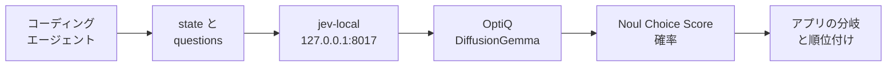
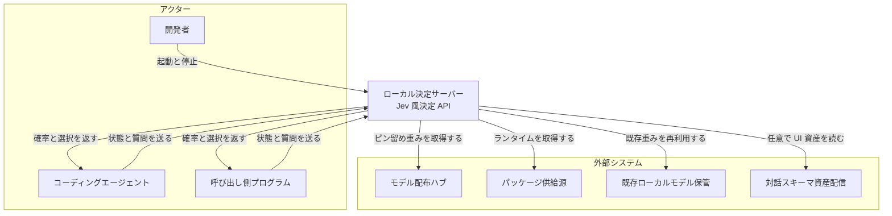
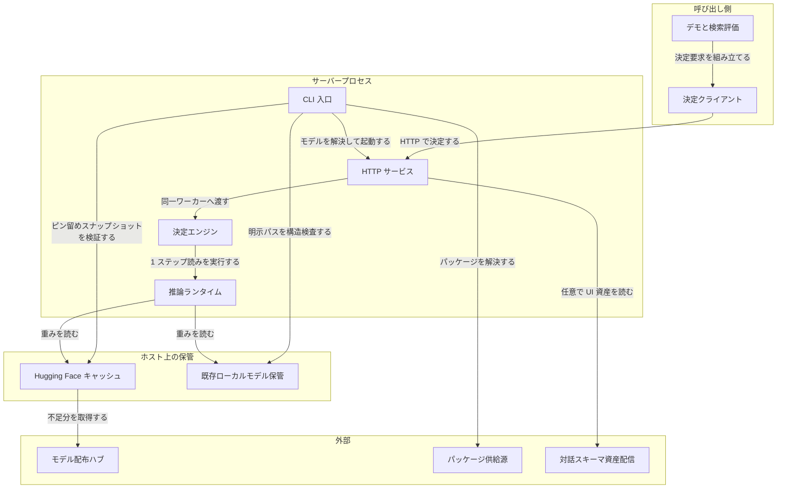
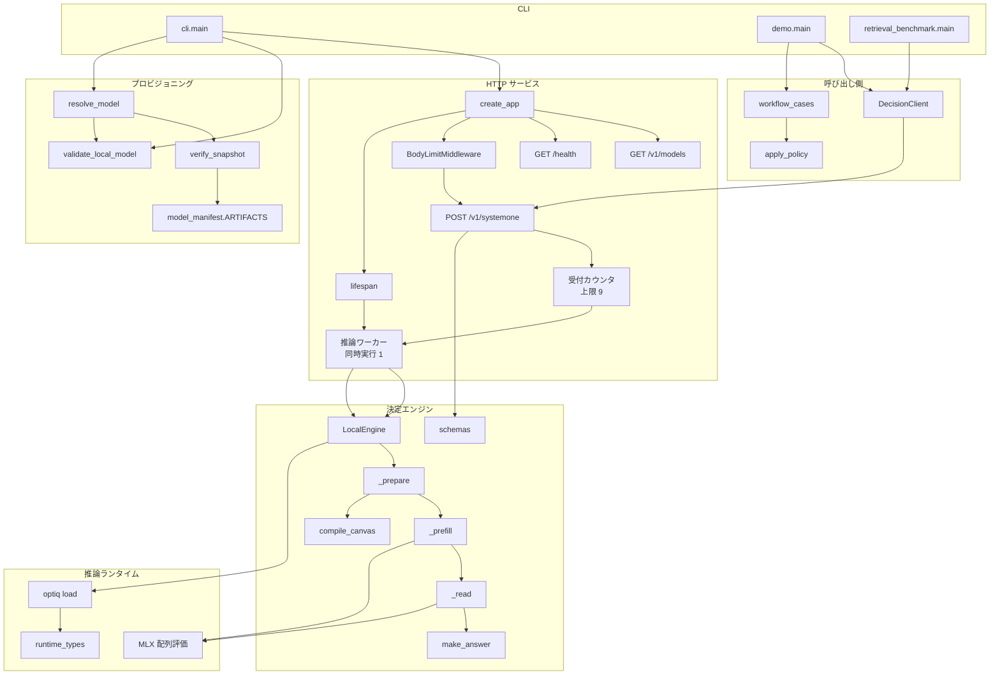
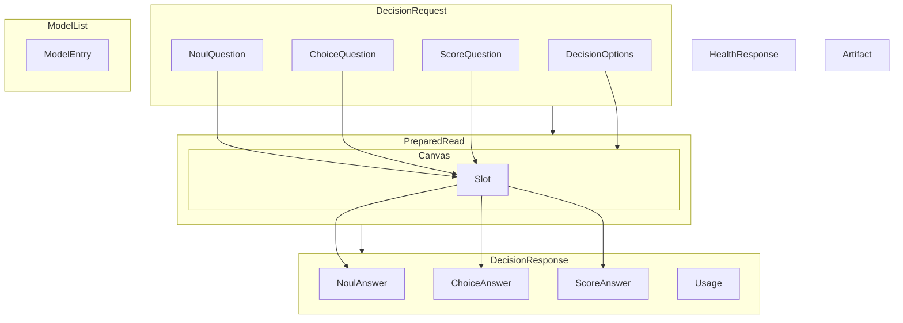
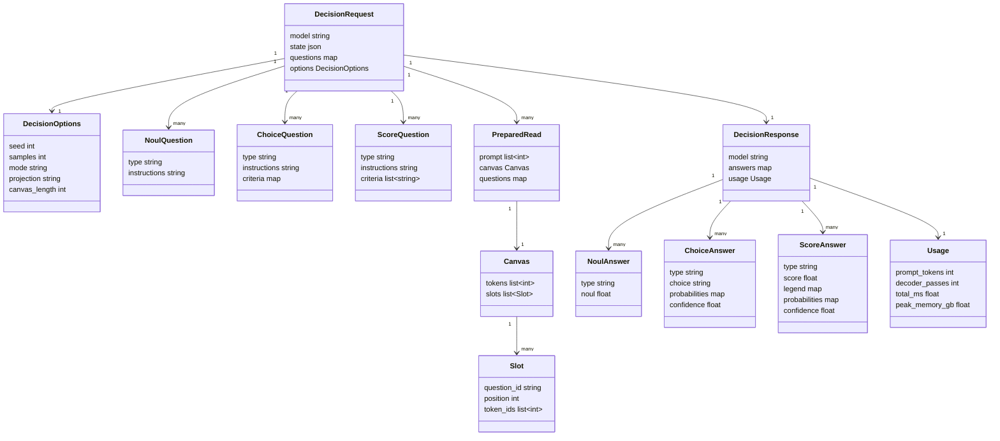
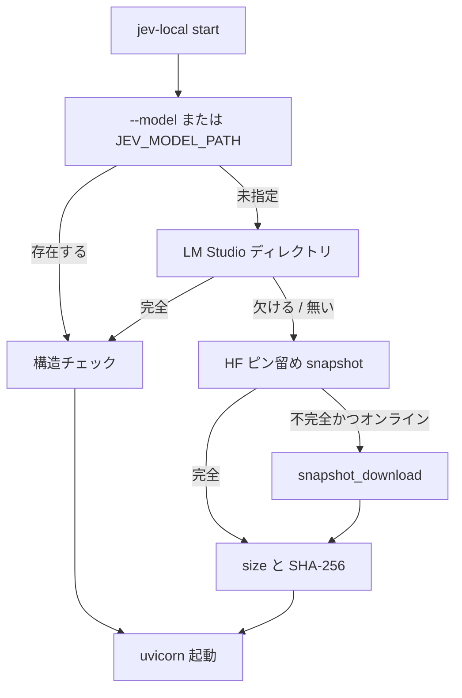

diffusiongemma-jev-macos は、Apple Silicon の Mac 上で、コーディングエージェント向けの小さな判断を数値で返すローカル決定サーバーです。
この記事では、仕組み・データ形・構築手順・運用の目安を、手元で再現できる粒度で整理します。
数値と仕様は 2026-09-19 時点の `main`（コミット `5d89d73`）と公開ドキュメントに基づきます。


*この記事の全体像。以下、順に解説します。*

## diffusiongemma-jev-macos とは

[Saik0s/diffusiongemma-jev-macos](https://github.com/Saik0s/diffusiongemma-jev-macos) は、パッケージ名 `diffusion-jev` 0.1.0、CLI 名 `jev-local` の MIT ライセンスの OSS です。

- 呼び出し側は、証拠（`state`）と、許容する答え付きの質問（`questions`）を送ります。
- サーバーは Noul / Choice / Score という型付きの確率を返します。
- 応答の組み立てと次のアクションは、アプリケーションのコードが担当します。

着想元は TypeSafe の決定モデル **Jev** です。
実行モデルは Google の **DiffusionGemma 26B-A4B-it** です。
これを mlx-community の OptiQ 4-bit チェックポイントとして読み込みます。
読み出し方は vLLM の structured-read 提案（[PR #57250](https://github.com/vllm-project/vllm/pull/57250)）と同じ「短い canvas 上の許可ラベルを読む」方式です。

| 項目 | 値 |
|---|---|
| ランタイム | MLX 0.32.2、mlx-optiq 0.5.12（ピン留め） |
| モデル revision | `30f3c7c7746bf41cfd1a290155cc3b777ab588b9` |
| 検証機 | Apple M2 Ultra / 統一メモリ 64 GiB |
| MLX の実測メモリ割当 | 18〜19 GB |
| 初回ダウンロード | 約 17.85 GB（16.6 GiB） |
| 既定の待受 | `http://127.0.0.1:8017` |
| API キー | 不要。推論はマシン内で完結 |

Jev との互換は API の基本形に合わせたサブセットです。
学習と校正は共有しません。

| 互換する契約 | 再現しないもの |
|---|---|
| `POST /v1/systemone`、`state` と型付き質問、Noul / Choice / Score の戻り形 | TypeSafe の RLCD 訓練、校正、品質 |
| 質問 ID が `answers` のキーに戻る | Choice 255 件、Noul の `criteria.true` / `criteria.false`、同一リクエスト内の問の独立並列 |
| | `instructions` / `criteria` のオブジェクト・配列による構造化記述、Choice の説明値 `null`（本実装は非空文字列のみ） |
| | confidence の公式定義（本実装は `1 - H(p)/ln(N)`） |
| | Usage の `input_tokens` / `output_tokens` |



| 要素名 | 説明 |
|---|---|
| コーディングエージェント | 読む対象・調査対象・完了判定など、狭い判断を依頼する呼び出し側 |
| state と questions | 1 リクエストに載せる証拠と、許容答付きの型付き質問 |
| jev-local | FastAPI 製のローカル決定サーバー。CLI 名 |
| OptiQ DiffusionGemma | Apple Silicon 向け 4-bit チェックポイント。1-step で許可ラベルを読む |
| Noul Choice Score 確率 | プログラムが分岐と順位付けに使う数値 |
| アプリの分岐と順位付け | 閾値・フォールバック・次アクションは呼び出し側のコードが持つ |

質問型は 3 つです。

| 型 | 問いの形 | コードが受け取る値 | 本実装の上限 |
|---|---|---|---|
| Noul | はい / いいえ | `noul`（0〜1、yes の確率） | 命題は `instructions` に書く |
| Choice | 提示した候補のどれか | 当選キー、各候補の確率、`confidence` | 2〜26 候補 |
| Score | 順序付き尺度上の位置 | 加重平均スコア、凡例、各段の確率、`confidence` | 2〜10 段 |

1 リクエストの上限は、質問 32 問、プロンプト 8,192 トークン（既定）、本文 1 MiB です。
既定モード `packed` は複数の質問を同じ入力にまとめて読みます。
`independent` は質問ごとに別々に評価します。

公開パイロット（CodeSearchNet Python、50 クエリ）の結果は次のとおりです。

| 指標 | ローカル（本実装） | BM25 | アーカイブ版 Jev |
|---|---|---|---|
| 正解が 1 位（全 50 件） | 31/50（62%） | 24/50（48%） | 42/50（84%） |
| 正解が 1 位（候補に正解がいた 44 件） | 31/44（70.5%） | 24/44（54.5%） | 42/44（95.5%） |
| nDCG@10（候補に正解がいた 44 件） | 0.853 | 0.744 | 0.983 |
| nDCG@10（全 50 件、候補外の 6 件を含む） | 0.750 | 0.655 | 0.865 |

30 関数の再ランクは中央値 19.1 秒です。
M2 Ultra の小さな合成スイートでは、既定設定の中央値が 291 ms、256 トークン canvas の full 投影が 472 ms です。

## 特徴

- TypeSafe Jev の System One 契約（`state` と型付き質問 → 型付き確率）の基本形を、Apple Silicon の単一プロセスで提供します。
- 学習はしません。既存の DiffusionGemma チェックポイントをそのまま使います。
- Google の DiffusionGemma 本体は、256 トークン canvas でテキストを生成するモデルです。本実装はそのチェックポイントを、許可ラベルの 1-step 読み出しに使います。
- `start` はピン留めしたチェックポイントを取得または再利用して起動します。`serve` は既存ディレクトリだけを使います。
- Python からは `DecisionClient` で同じ契約を呼べます。
- CodeSearchNet Python の公開再ランクを `benchmark-search` で再現できます。
- 依存とモデルが揃えば `--offline` で起動できます。
- LM Studio の同名 OptiQ ディレクトリがあれば、それを先に使います。
- `GET /health` と `GET /v1/models` を返します。
- コミュニティ事例（Every、Jev Logs、Foreman、ProgressGate、fast-jev-compaction）の設計を、中身を確認できる教材デモにしています。
- Choice / Score の `confidence` は分布の集中度（エントロピー正規化）です。Noul は `noul` だけを返します。
- `options.samples` は 1〜8 回の独立ノイズ読み出しの平均です。各回は 1-step です。
- 役割分担は明確です。終了コードなどの確定事実は通常のコード、パッチ生成はコーディングモデル、可否の確定はテストとレビューが担います。本サーバーは「どこに手間を割くか」の数値を返します。


*Jev は RLCD（校正された決定のための強化学習）で訓練されたモデルです。本実装はこの訓練を再現しません。*

### 関連スタックとの比較

NVIDIA GPU 側には同系統の実装として [mmastrac/djev-spark](https://github.com/mmastrac/djev-spark) と [razorback16/openjev](https://github.com/razorback16/openjev) があります。

| 項目 | TypeSafe Jev | diffusion-jev（本実装） | djev-spark | openjev |
|---|---|---|---|---|
| 実行方式 | ホスト API。RLCD 訓練の決定モデル | 単一プロセス。MLX OptiQ の 1-step structured read | Docker。vLLM structured-reads と前面サーバー | Docker / ホスト。vLLM structured-reads と前面サーバー |
| ハード | TypeSafe クラウド | macOS Apple Silicon。検証機は M2 Ultra 64 GiB | DGX Spark などの GB10。CUDA 13 | NVIDIA GPU 24 GB 以上 |
| モデル | `jev-latest` など | `mlx-community/diffusiongemma-26B-A4B-it-OptiQ-4bit` | `nvidia/diffusiongemma-26B-A4B-it-NVFP4` | 同じ NVFP4。別名 `openjev-latest` |
| API | `POST https://api.typesafe.ai/v1/systemone`。Bearer 必須 | `POST /v1/systemone`。Python の `DecisionClient` | `POST /v1/systemone` | `POST /v1/systemone`。`/v1/chat/completions` も提供 |
| canvas | クライアント契約の外 | 既定は足場が収まる 16 の倍数。明示は 16〜256 | 既定 128。環境変数 `CANVAS` | 既定 64。`OPENJEV_CANVAS` |
| ポート | クラウド | 既定 8017 | vLLM 8010、決定サーバー 8011 | 既定 8080 |
| Choice 上限 | 255 | 2〜26 | README は型の形のみ | 128 |
| Noul の yes/no 説明 | 任意の `criteria.true` / `criteria.false` | `instructions` のみ | 任意の true/false をプロンプトへ描画 | 任意の `criteria: {true, false}` |
| 複数問の既定 | 問は独立並列 | `packed`（同一 canvas）。`independent` も選択可 | 同一 canvas。`alone` / `depends_on` あり | 約 12 問ずつチャンク |
| 画像 | テキストのみ | テキストの `state` のみ | multipart または `images` | 最大 8 枚 |
| 同時実行 | ホスト側でスケール | 推論ワーカー 1、待ち 8 | `MAX_SEQS` 既定 32 | `OPENJEV_MAX_INFLIGHT` 既定 64 |
| confidence | 分布の尖り。式は非公開 | `1 - H(p)/ln(N)` | 当選候補（または最頻レベル）の確率 | `1 − H(p)/ln K` |
| samples | ホスト契約 | 1〜8 回の独立 1-step。既定 1 | 既定 `"auto"`。エントロピー 0.1 超で再読、最大 4 | エントロピー 0.1 超で再読、最大 4。拡張 `samples` は 1〜32 |
| 生成経路 | なし | なし | 自由生成は vLLM 8010 か 8011 の `/v1/raw/chat/completions` | 8080 の `/v1/chat/completions` |

公式 DiffusionGemma の `generate()` は、256 トークン canvas を反復的に un-mask して文章を生成します。
vLLM PR #57250 は、CUDA 上で seeded canvas と read-only step を使います。
本実装は同じ読み出し形を MLX と OptiQ で実装し直したものです。


*NVIDIA 側の同系統実装 djev-spark のプレイグラウンド UI です。本実装は画像入力と UI を持ちません。*

### ユースケース別の選び方

| 場面 | 向くスタック | 理由 |
|---|---|---|
| Mac 上でエージェントの局所判断を完結させたい | **diffusion-jev** | Apple Silicon と MLX。待受 8017 のローカル HTTP |
| 校正済みの確率と TypeSafe SDK を本番で使う | **TypeSafe Jev** | RLCD のホストモデル。Choice 255、Noul の true/false 基準 |
| DGX Spark で DiffusionGemma の structured read を動かす | **djev-spark** | vLLM と NVFP4。8010 / 8011 |
| NVIDIA GPU で SDK 互換とチャット生成を同居させる | **openjev** | 8080。`/v1/chat/completions` と画像。Choice 128 |
| 関数の再ランクやログ選別の教材を手元で動かす | **diffusion-jev の demo** | `search` / `logs` / `completion` / `progress` と compaction の例 |

## 構造

C4 モデルの 3 段階（システムコンテキスト、コンテナ、コンポーネント）で整理します。

### システムコンテキスト図



| 区分 | 要素名 | 説明 |
|---|---|---|
| アクター | 開発者 | サーバーを起動し、デモや検索評価を走らせ、停止する |
| アクター | コーディングエージェント | 証拠と許容答を送り、返った数値で次の読み取り・調査・完了判断を分岐する |
| アクター | 呼び出し側プログラム | HTTP で決定要求を送り、型付きの答えを自前の方針に渡す |
| 対象 | ローカル決定サーバー | 単一プロセスの Jev 風決定 API。会話は保持しない |
| 外部 | モデル配布ハブ | ピン留め revision の重みを供給する（Hugging Face） |
| 外部 | パッケージ供給源 | CLI と推論ランタイムの Python 配布元 |
| 外部 | 既存ローカルモデル保管 | 別クライアント（LM Studio など）が置いた同系統チェックポイント。構造を検査して再利用する |
| 外部 | 対話スキーマ資産配信 | ブラウザ向け `/docs` の UI 資産を配る CDN。推論本体とは独立 |

### コンテナ図



| 区分 | 要素名 | 説明 |
|---|---|---|
| 呼び出し側 | 決定クライアント | 同期 HTTP クライアント。応答形を検証して型付きの答えを返す |
| 呼び出し側 | デモと検索評価 | 教材ケースと検索パイロット。稼働中の HTTP サービスへ決定を依頼する |
| プロセス | CLI 入口 | プラットフォームと待受を確認し、モデルを解決し、HTTP サービスを起動する |
| プロセス | HTTP サービス | 本文サイズ制限、受付上限、推論ワーカーへの委譲を担う |
| プロセス | 決定エンジン | プロンプト化、canvas 組み立て、プリフィル、1 ステップ読み、答えの正規化を担う |
| プロセス | 推論ランタイム | 量子化拡散モデルの実行系。ロードとデコーダ呼び出しを同じスレッドで行う |
| 保管 | Hugging Face キャッシュ | ピン留め revision の管理スナップショット。サイズとチェックサムを検証してからロードする |
| 保管 | 既存ローカルモデル保管 | 明示パスまたは LM Studio の配置。必須ファイルの構造検査だけを行う |

### コンポーネント図



図の矢印の意味は、下の表の各要素の説明にまとめています。

| 区分 | 要素名 | 説明 |
|---|---|---|
| CLI | cli.main | `jev-local` の入口。Apple Silicon と待受を確認し、`start` / `serve` で起動する。`demo` と `benchmark-search` は子入口へ渡す |
| CLI | demo.main | 教材ワークフローを実行する。サーバーは起動せず、稼働中の決定入口へ依頼する |
| CLI | retrieval_benchmark.main | 検索パイロットを実行する。決定入口へ Noul を送り、順位指標を集計する |
| プロビジョニング | resolve_model | 明示パス → LM Studio → Hugging Face キャッシュ → ダウンロードの順で重みを選ぶ |
| プロビジョニング | validate_local_model | 必須ファイル、`diffusion_gemma` 型、重みシャード、OptiQ サイドカーの存在を確認する |
| プロビジョニング | verify_snapshot | 管理スナップショットの各ファイルのサイズと SHA-256 を照合する |
| プロビジョニング | model_manifest.ARTIFACTS | ピン留め revision のファイル名・サイズ・ハッシュの一覧 |
| HTTP | create_app | FastAPI アプリを組み立て、ライフサイクル・本文制限・例外要約・決定入口を配線する |
| HTTP | BodyLimitMiddleware | 要求本文を 1 MiB で打ち切る。超過は 413 |
| HTTP | 受付カウンタ | 投入中の上限は 9（実行 1 + 待ち 8）。満杯は 503 |
| HTTP | lifespan | 推論ワーカーを 1 本作り、そのスレッド上でエンジンを生成する |
| HTTP | 推論ワーカー | `ThreadPoolExecutor` の同時実行 1。ロードと推論を同じスレッドに固定する |
| HTTP | GET /health | 常に `{"status":"ok","model":"diffusiongemma-local"}` を返す。エンジンのロード状態は見ない |
| HTTP | GET /v1/models | 設定済みモデル 1 件を返す |
| HTTP | POST /v1/systemone | 決定要求の入口。クライアント切断後も `asyncio.shield` で GPU 作業を続ける |
| エンジン | LocalEngine | 決定の本体。内部ロックで直列化し、プリフィルと読み出しを計測して Usage を付ける |
| エンジン | _prepare | state を JSON 化し、質問を packed / independent に分け、トークン化して canvas を組む |
| エンジン | _prefill | エンコーダを 512 トークンずつ進め、KV キャッシュを残す |
| エンジン | _read | 答えスロットだけを種付けし、デコーダを 1 回通し、許可ラベルの分布を平均する |
| エンジン | compile_canvas | 許容答が 1 トークン位置で区別できるかを検証し、16 の倍数幅の canvas を作る |
| エンジン | make_answer | 許可ラベル上の分布から Noul / Choice / Score を組み立てる |
| エンジン | schemas | 要求と応答の公開契約 |
| 呼び出し側 | DecisionClient | 同期 HTTP 呼び出し。失敗時は入力と生応答を出さず `DecisionClientError` にまとめる |
| 呼び出し側 | workflow_cases | 検索・ログ・完了・進捗の教材ケース |
| 呼び出し側 | apply_policy | 応答形を検証し、コード側の閾値で次アクションを提案する |
| ランタイム | optiq load | ピン留め OptiQ ローダ。チェックポイントをモデルとトークナイザとして開く |
| ランタイム | MLX 配列評価 | プリフィルとデコーダ出力を評価し、ピーク割当を測る |
| ランタイム | runtime_types | エンジンが使うデコーダのインタフェース |

## データ

公開契約と、推論時の作業データを整理します。
属性と制限は `schemas.py`、`canvas.py`、`engine.py`、`api.py`、`model_manifest.py` に合わせています。

### 概念モデル



| 要素名 | 説明 |
|---|---|
| DecisionRequest | `POST /v1/systemone` の入力。`state`、1〜32 問、DecisionOptions を持つ |
| DecisionOptions | 読み出し条件。seed / samples / mode / projection / canvas_length |
| NoulQuestion | yes/no の命題。内部ラベルは yes と no |
| ChoiceQuestion | 競合する選択肢。criteria は 2〜26 件の map |
| ScoreQuestion | 順序付きの段階。criteria は 2〜10 件の list |
| PreparedRead | 1 回の encoder-decoder 読み出しの単位。packed では 1 件、independent では質問ごとに 1 件 |
| Canvas | 答えスロットを埋め込んだ固定長トークン列。幅は 16〜256 の 16 の倍数 |
| Slot | 1 問ぶんの答えの位置。question_id、position、許可ラベルの token_ids を持つ |
| DecisionResponse | 決定 API の出力。質問 ID をキーとする Answer と Usage を持つ |
| NoulAnswer / ChoiceAnswer / ScoreAnswer | 型ごとの答え |
| Usage | そのリクエストのトークン数、デコーダ回数、経過時間、ピークメモリ |
| ModelList / ModelEntry | `GET /v1/models` の出力。`id` は `diffusiongemma-local` |
| HealthResponse | `GET /health` の出力 |
| Artifact | ピン留めチェックポイントの 1 ファイル。name / size / sha256 |

### 情報モデル



図には決定 API の背骨だけを載せています。
Usage の全フィールドは後の表に、HealthResponse・ModelList・Artifact は概念モデルの表に記載しています。

値の型と制約は次のとおりです。

| 要素名 | 説明 |
|---|---|
| Identifier | 長さ 1〜128 の文字列。`model`、質問 ID、Choice の criteria キーに使う |
| Description | 長さ 1〜4096 の前後空白除去済み文字列。`instructions` と criteria の値に使う |
| Probability | 0 以上 1 以下の有限 float |
| Confidence | Choice と Score の分布集中度。`1 - H(p) / ln(N)`。H はシャノンエントロピー。0〜1 にクリップ |
| DecisionRequest | strict かつ未知フィールド禁止。本文上限 1 MiB。プロンプト上限は既定 8192 トークン |
| model | 既定 `diffusiongemma-local`。不一致は 400 |
| state | 任意の JSON。`sort_keys=True`、NaN 禁止で直列化する |
| questions | 質問 ID → Question の map。1〜32 件 |
| seed | 0〜4294967295。既定 0 |
| samples | 1〜8。既定 1 |
| mode | `packed` または `independent`。既定 `packed` |
| projection | `labels` または `full`。既定 `labels` |
| canvas_length | 16〜256 の 16 の倍数、または null。null は足場が収まる最小幅 |

答えと Usage の意味です。

| 要素名 | 説明 |
|---|---|
| NoulAnswer | `noul` は yes 側の確率。confidence フィールドは無い |
| ChoiceAnswer | `choice` は最大確率のキー。同点は挿入順。`probabilities` の合計は 1 |
| ScoreAnswer | `score` は `sum(index * p)`。`legend` と `probabilities` のキーは段の番号の文字列 |
| prompt_tokens | 評価したプロンプトトークンの合計。independent では質問ごとに加算 |
| decoder_passes | PreparedRead 件数 × samples |
| canvas_tokens | canvas 幅の合計 × samples。出力トークン数ではない |
| peak_memory_gb | リクエスト中の MLX ピーク割当。十進 GB |

canvas の足場は `canvas.py` で次のように定義されています。

```text
head = "<|channel>thought\n<channel|>"
rows = "q{i}: {label}"
close = "<turn|>"
```

許可ラベルは「1 トークン」「位置を共有」「ID 重複なし」を満たす必要があります。
違反すると 422 になります。

推論時の読み出し（`engine.py` の `_read`）は次の流れです。

```text
JSON state
→ tokenizer.apply_chat_template system_prompt + user
→ encode
→ compile_canvas
→ encoder 512 トークンずつ
→ canvas.seeded 答スロットのみ
→ decoder 1-step
→ projection:
    labels: hidden[:, positions] @ alias_embeddings.T
    full: embedding.as_linear(hidden) で語彙全体の logits
→ model._softcap
→ 許可ラベルを抽出して softmax
→ samples 平均
→ make_answer
```

内部ラベルは、Noul が `yes` / `no`、Choice と Score が `A` / `B` / `C` … です。
応答のキーと Choice の当選名は、`make_answer` が元の質問 ID と criteria キーへ戻します。

## 構築方法

### 前提条件

| 項目 | 条件 |
|---|---|
| OS / CPU | macOS（Darwin）+ Apple Silicon（arm64）。それ以外は `start` / `serve` が終了コード 2 |
| Python | 3.12 以上。公式例と `.python-version` は 3.13 / 3.13.9 |
| ランタイム | `mlx-optiq==0.5.12`、`mlx==0.32.2`（Darwin arm64 のときだけ入る） |
| ツール | [uv](https://docs.astral.sh/uv/getting-started/installation/)。GitHub から入れるなら Git |
| メモリ | 検証機は統一メモリ 64 GiB。最小要件は公式に未確定 |
| ディスク | モデル用に約 20 GB の空き。ダウンローダは不足分 + 1 GiB の予備を要求 |
| チェックポイント | [mlx-community/diffusiongemma-26B-A4B-it-OptiQ-4bit](https://huggingface.co/mlx-community/diffusiongemma-26B-A4B-it-OptiQ-4bit) の revision `30f3c7c7…` |
| ローダ | OptiQ。標準の `mlx-lm` / `mlx-vlm` ではこのチェックポイントを読めない |

```sh
uname -s
uname -m
python3 --version
uv --version
git --version
```

```text
Darwin
arm64
Python 3.13.9
```

### CLI 入口とフラグ

CLI 名は `jev-local`、サブコマンドは `start` / `serve` / `demo` / `benchmark-search` です。
`demo` と `benchmark-search` は Darwin の検査より前に分岐し、起動済みサーバーへ HTTP で接続します。

| サブコマンド | フラグ | 既定 | 備考 |
|---|---|---|---|
| `start` / `serve` | `--model` | なし | 明示ディレクトリ。未指定時は `JEV_MODEL_PATH` |
| `start` / `serve` | `--host` | `127.0.0.1` | 待受アドレス |
| `start` / `serve` | `--port` | `8017` | 1〜65535 |
| `start` / `serve` | `--max-prompt-tokens` | `8192` | 1 以上 |
| `start` のみ | `--cache-dir` | Hugging Face 既定キャッシュ | ダウンロード先 |
| `start` のみ | `--offline` | off | モデルをダウンロードしない |
| `demo` | `name` | 必須 | `search` / `logs` / `completion` / `progress` / `all` |
| `demo` | `--url` | `http://127.0.0.1:8017` | サーバー URL |
| `benchmark-search` | `--limit` | `50` | 1〜300 |
| `benchmark-search` | `--batch-size` | `5` | 1〜30。別名 `--group-size` |
| `benchmark-search` | `--seed` | `0` | 0〜4294967295 |
| `benchmark-search` | `--base-url` | `http://127.0.0.1:8017` | サーバー URL |
| `benchmark-search` | `--cache` | `~/.cache/diffusion-jev/retrieval-v1` | 評価データのキャッシュ |
| `benchmark-search` | `--output` | `retrieval-results.local.json` | レポート出力 |

### 環境変数

| 変数 | 読む主体 | 役割 |
|---|---|---|
| `JEV_MODEL_PATH` | `cli.py` / `resolve_model` | `--model` 未指定時の明示パス |
| `HF_HOME` | Hugging Face Hub | キャッシュのルート |
| `HF_HUB_CACHE` | Hugging Face Hub | スナップショットのキャッシュ。通常は `~/.cache/huggingface/hub` |
| `HF_HUB_OFFLINE` | `resolve_model` | 真ならダウンロードしない |
| `HTTPS_PROXY` | Hugging Face ダウンローダ | プロキシ経由で取得する |

### インストール方法

いちばん手軽なのは `uvx` です。

```sh
uvx --python 3.13 --from git+https://github.com/Saik0s/diffusiongemma-jev-macos jev-local start
```

- パッケージを入れ、モデルを用意し、HTTP サーバーを起動します。
- ログに `Application startup complete` が出たら受付開始です。
- 停止は Ctrl-C です。

リポジトリを clone して動かす方法もあります。

```sh
git clone https://github.com/Saik0s/diffusiongemma-jev-macos.git
cd diffusiongemma-jev-macos
uv run jev-local start
```

検索評価とテストには extra `benchmark`（`pyarrow`）が必要です。

```sh
uv sync --frozen --extra benchmark
```

ツールとして常設するなら `uv tool install` を使います。

```sh
git clone https://github.com/Saik0s/diffusiongemma-jev-macos.git
cd diffusiongemma-jev-macos
uv tool install --python 3.13 .
jev-local start
```

モデルの二重ロードを避けるため、同時に動かすプロセスは 1 つにします。

上の手順は `main` の先頭を取得します。
この記事と同じ版（コミット `5d89d73`）で再現するときは、revision を固定します。

```sh
uvx --python 3.13 --from git+https://github.com/Saik0s/diffusiongemma-jev-macos@5d89d73fa1c6acad0e7e6b689a444a2740a71180 jev-local start
```

clone する場合は、`git checkout 5d89d73fa1c6acad0e7e6b689a444a2740a71180` を実行してから起動します。

### モデルの解決順

`start` は次の順でモデルのパスを決めます（`provisioning.resolve_model`）。



| 要素名 | 説明 |
|---|---|
| `--model` または `JEV_MODEL_PATH` | 明示ディレクトリ。無効でも別モデルへは黙って切り替えない |
| 構造チェック | 必須ファイルの存在と `model_type == diffusion_gemma`。チェックサムは見ない |
| LM Studio ディレクトリ | `~/.cache/lm-studio/models/mlx-community/diffusiongemma-26B-A4B-it-OptiQ-4bit` |
| HF ピン留め snapshot | 起動のたびにサイズと SHA-256 を検証する |

構造チェックで確認する必須ファイルです。

```text
config.json
tokenizer.json
tokenizer_config.json
model.safetensors.index.json
optiq_metadata.json
weight_map が指す *.safetensors
optiq/optiq_vision.safetensors または optiq_vision.safetensors
```

### 既存モデルの serve とオフライン起動

```sh
uv run jev-local serve --model /path/to/model
uv run --offline jev-local start --offline
uv run jev-local start --cache-dir /Volumes/Models/huggingface --port 8018
```

- `serve` は既存ディレクトリだけを読み、ダウンロードしません。`--cache-dir` と `--offline` はありません。
- 2 行目の先頭の `--offline` は uv のパッケージ取得を止めます。後ろの `--offline` はモデルのダウンロードを止めます。
- 起動前に `preflight_port` でポートを bind できるか確認します。確認はモデル取得より先です。

### 起動確認とアンインストール

```sh
curl -s http://127.0.0.1:8017/health
curl -s http://127.0.0.1:8017/v1/models
uv tool uninstall diffusion-jev
```

```json
{"status": "ok", "model": "diffusiongemma-local"}
```

アンインストールで指定するのはパッケージ名 `diffusion-jev` です。
モデルファイルは Python ツールとは別の場所に残ります。

## 利用方法

### リクエストのパラメータ

値は `schemas.py`、`api.py`、`client.py` に基づきます。

| パラメータ | 必須 | 既定 / 範囲 | 役割 |
|---|---|---|---|
| `model` | 任意 | `diffusiongemma-local`（それ以外は 400） | 受け付ける唯一の ID |
| `state` | 必須 | 任意の JSON（非有限数は不可） | 判断材料 |
| `questions` | 必須 | 1〜32 件。キーは 1〜128 文字 | 質問の map |
| `questions[].type` | 必須 | `noul` / `choice` / `score` | 質問型 |
| `questions[].instructions` | 必須 | 1〜4096 文字 | モデルへの指示 |
| `choice.criteria` | choice で必須 | 2〜26 件 | 候補 |
| `score.criteria` | score で必須 | 2〜10 件の説明リスト | 段は 0 始まり |
| `options.seed` | 任意 | `0`。0〜4294967295 | 入力ノイズの再現 |
| `options.samples` | 任意 | `1`。1〜8 | 独立 1-step 読み出しの平均回数 |
| `options.mode` | 任意 | `packed` / `independent` | まとめて読むか、質問ごとに読むか |
| `options.projection` | 任意 | `labels` / `full` | 許可ラベルだけに投影するか、語彙全体で計算するか |
| `options.canvas_length` | 任意 | `null` または 16〜256 の 16 の倍数 | 答え用 canvas の幅 |
| 本文サイズ | 上限 | 1 MiB | 超過は 413 |
| エンコード後のプロンプト | 上限 | 既定 8,192 トークン | 超過は 422。切り詰めない |
| `DecisionClient` タイムアウト | 固定 | 120 秒 | httpx |
| 推論枠 | 固定 | ワーカー 1 + 待ち 8 | 満杯は 503 |

### HTTP エンドポイント

| メソッド | パス | 成功時 |
|---|---|---|
| GET | `/health` | `{"status":"ok","model":"diffusiongemma-local"}` |
| GET | `/v1/models` | モデル ID を 1 件だけ列挙 |
| POST | `/v1/systemone` | `DecisionResponse`（`model` / `answers` / `usage`） |
| GET | `/docs` | FastAPI の Swagger UI |
| GET | `/openapi.json` | OpenAPI 文書 |

自然言語の文章は返しません。
会話の永続化、認証ヘッダ、chat-completions エンドポイントもありません。

### curl で POST /v1/systemone を呼ぶ

```sh
curl -s http://127.0.0.1:8017/v1/systemone \
  -H 'Content-Type: application/json' \
  -d '{
    "state": "pytest cannot collect tests: ModuleNotFoundError: No module named yaml",
    "questions": {
      "next_step": {
        "type": "choice",
        "instructions": "Which investigation best fits this failure?",
        "criteria": {
          "environment": "Inspect missing dependencies and the Python environment.",
          "assertion": "Inspect an assertion that compared the wrong values.",
          "network": "Inspect a remote request that timed out."
        }
      }
    }
  }'
```

- 選ばれたキーは `answers.next_step.choice` に入ります。
- 各候補の確率は `answers.next_step.probabilities` に入ります。
- この例で想定する答えは `environment` です。実際の数値はモデルが実行ごとに出します。
- サーバー自身はコマンド実行、ファイル編集、別エージェントの起動をしません。

### DecisionClient で呼ぶ

```python
from diffusion_jev.client import DecisionClient, DecisionClientError
from diffusion_jev.schemas import DecisionRequest, NoulAnswer, NoulQuestion

request = DecisionRequest(
    state={
        "function": "def parse_count(text):\n"
        "    try: return int(text)\n"
        "    except ValueError: return 0",
    },
    questions={
        "hides_error": NoulQuestion(
            type="noul",
            instructions="Does this function catch an exception without reporting it?",
        ),
    },
)

try:
    with DecisionClient() as client:
        answer = client.decide(request).answers.get("hides_error")
    if isinstance(answer, NoulAnswer):
        print(f"Probability of yes: {answer.noul:.3f}")
except DecisionClientError:
    print("The request failed. Keep the function available for manual review.")
```

別ポートのサーバーへ向けるときは `base_url` を渡します。

```python
from diffusion_jev.client import DecisionClient
from diffusion_jev.schemas import DecisionRequest, NoulQuestion

request = DecisionRequest(
    model="diffusiongemma-local",
    state="ok",
    questions={"q": NoulQuestion(type="noul", instructions="Is the service ready?")},
)
with DecisionClient(base_url="http://127.0.0.1:8018") as client:
    print(client.decide(request).model)
```

### 1 リクエストで 3 つの型を聞く

```json
{
  "model": "diffusiongemma-local",
  "state": {
    "test_result": "Login rejects every user with HTTP 500.",
    "workaround": "None known."
  },
  "questions": {
    "investigate": {
      "type": "noul",
      "instructions": "Does login fail for users?"
    },
    "next_file": {
      "type": "choice",
      "instructions": "Which supplied file should be inspected first?",
      "criteria": {
        "auth": "src/auth.py handles login requests.",
        "styles": "static/theme.css controls colors.",
        "other": "Neither file matches the problem."
      }
    },
    "severity": {
      "type": "score",
      "instructions": "How disruptive is the reported issue?",
      "criteria": [
        "Cosmetic issue; functionality works.",
        "A feature fails, with a working alternative.",
        "A feature is blocked without a known workaround."
      ]
    }
  }
}
```

| 応答フィールド | 内容 |
|---|---|
| `answers.investigate` | `type` と `noul`（yes の確率） |
| `answers.next_file` | `choice`（最大確率のキー）、`probabilities`、`confidence` |
| `answers.severity` | `score`（加重平均）、`probabilities`、`legend`、`confidence`。段は 0 始まり |
| `usage` | `prompt_tokens` / `questions` / `decoder_passes` / `canvas_tokens` / `prefill_ms` / `decode_ms` / `total_ms` / `peak_memory_gb` |

### オプションを指定する

```python
from diffusion_jev.schemas import DecisionOptions, DecisionRequest, NoulQuestion

request = DecisionRequest(
    model="diffusiongemma-local",
    state={"note": "tiny evidence"},
    questions={
        "ok": NoulQuestion(type="noul", instructions="Is the evidence sufficient to continue?"),
    },
    options=DecisionOptions(
        seed=0,
        samples=1,
        mode="packed",
        projection="labels",
        canvas_length=None,
    ),
)
```

### エラー応答

| HTTP | 条件 | `detail` |
|---|---|---|
| 400 | `model` が `diffusiongemma-local` 以外 | `Unknown model` |
| 413 | 本文が 1 MiB 超 | `Request too large` |
| 422 | スキーマ違反 | `Invalid request` |
| 422 | プロンプト過長、canvas 不足など | `Request cannot be processed` |
| 503 | エンジン未ロード | `Model is not ready` |
| 503 | 同時受付が 9 件 | `Inference queue is full` |
| 500 | 推論中の例外 | `Inference failed` |

```sh
curl -s -o /tmp/jev-400.txt -w "%{http_code}\n" \
  http://127.0.0.1:8017/v1/systemone \
  -H 'Content-Type: application/json' \
  -d '{"model":"other","state":null,"questions":{"q":{"type":"noul","instructions":"Check"}}}'
```

422 は入力を本文に含めません。
`{"secret":"PRIVATE"}` を送っても、応答は `{"detail":"Invalid request"}` です。

### demo と教材スクリプト

```sh
uv run jev-local demo search
uv run jev-local demo logs
uv run jev-local demo completion
uv run jev-local demo progress
uv run jev-local demo all --url http://127.0.0.1:8018
uv run python examples/context_compaction.py
uv run python examples/failure_triage.py
uv run python examples/file_selection.py
uv run python examples/patch_review.py
```

| 名前 | 質問の使い方 | デモの分岐（教材であり校正保証ではない） |
|---|---|---|
| `search` | 関数ごとに Noul「例外を黙って捨てるか」 | 0.65 以上で `inspect_first`、0.2 超 0.65 未満で `review_if_needed`、0.2 以下で `rank_lower` |
| `logs` | ログレコードごとに Noul / Choice / Score | P(actionable) ≤ 0.2 かつ P(routine) ≥ 0.8 かつ Score < 1.0 のときだけアーカイブ |
| `completion` | 要件・回帰・検証の 3 つの Noul | 3 つとも 0.8 以上で `ready_for_review` |
| `progress` | 同じ仮定の繰り返しと新しい証拠の Noul | P(repeated) ≥ 0.8 かつ P(new) ≤ 0.2 で再計画 |
| `context_compaction.py` | ツール呼び出しの対を残すかの判定 | 有用確率 0.5 以上で残す。失敗時は原文をすべて残す |

### benchmark-search とローカル検査

```sh
uv run --extra benchmark jev-local benchmark-search \
  --limit 50 \
  --batch-size 5 \
  --seed 0 \
  --base-url http://127.0.0.1:8017 \
  --output retrieval-results.local.json
```

```sh
uv sync --frozen --extra benchmark
uv run pytest -q
uv run ruff check src tests examples
uv run mypy
```

速度ベンチマークは、HTTP サーバーを止めてからエンジンを直接呼びます。

```sh
uv run python -m diffusion_jev.benchmark --repeats 3 --output benchmark-results.local.json
```

extra `benchmark` が無い状態で `benchmark-search` を実行すると、終了コード 1 で `Install the optional data reader with: uv sync --extra benchmark` が出ます。

## 運用

### 起動完了を判定する

- 受付開始の合図は uvicorn の `Application startup complete` です。
- その直前に `Model loaded in {秒}. Starting the local API.` が出ます。
- モデルのロードは起動処理（lifespan）の中で行われ、完了するまで通常は接続自体ができません。
- 503（`Model is not ready`）は、エンジン未設定のままリクエストが届いた場合の防御的な応答です。
- 検証機（M2 Ultra / 64 GiB / Python 3.13.9）でのロード時間は 12.68 秒です。

```text
Model loaded in 12.7s. Starting the local API.
INFO:     Application startup complete.
INFO:     Uvicorn running on http://127.0.0.1:8017
```

### ヘルスチェック

- `GET /health` は推論キューと独立して応答します。
- 32 問のリクエストを処理中でも応答時間は 2.03 ms でした。
- キューが満杯でも 200 を返します。

```sh
curl -s http://127.0.0.1:8017/health
```

### 停止と 1 プロセス制約

- 停止はフォアグラウンドでの Ctrl-C です。
- lifespan の終了処理で `ThreadPoolExecutor.shutdown(wait=True, cancel_futures=True)` が走ります。
- 2 つ目のプロセスを起動すると、重みがもう 1 セット載ります。

```sh
lsof -nP -iTCP:8017 -sTCP:LISTEN
```

### 受付キューとバックプレッシャー

- 定数は `MAX_ADMITTED_REQUESTS = 9`（実行中 1 + 待ち 8）です。
- ワーカーは `ThreadPoolExecutor(max_workers=1)` です。
- 10 件目は 503（`Inference queue is full`）です。
- クライアントが切断しても枠は減りません。GPU 作業が終わるまで保持します。
- `DecisionClient` のタイムアウトは 120 秒です。キュー待ち時間は `usage.total_ms` に含まれません。

```python
future = loop.run_in_executor(executor, engine.decide, request)
return await asyncio.shield(future)
```

### usage メトリクスの読み方

| フィールド | 意味 |
|---|---|
| `prompt_tokens` | 評価したエンコード済みプロンプト長。independent は質問ごとの合計 |
| `questions` | リクエストの質問数（1〜32） |
| `decoder_passes` | デコーダ呼び出し回数。PreparedRead 件数 × samples |
| `canvas_tokens` | canvas 幅の合計 × samples。出力トークン数ではない |
| `prefill_ms` | 入力の読み取り時間 |
| `decode_ms` | 1-step デコーダとラベルの softmax |
| `total_ms` | 準備と答えの組み立てを含む。キュー待ちと転送は含まない |
| `peak_memory_gb` | リクエスト中の MLX active ピーク。十進 GB。RSS ではない |

次の JSON は、公開ベンチマークの既定設定の中央値を 1 リクエストの形に並べた合成例です。
単一リクエストの生ログではありません。
`questions: 3` は形を示すための値です。

```json
{
  "usage": {
    "prompt_tokens": 193,
    "questions": 3,
    "decoder_passes": 1,
    "canvas_tokens": 32,
    "prefill_ms": 210.6,
    "decode_ms": 79.5,
    "total_ms": 291.0,
    "peak_memory_gb": 18.30
  }
}
```

`peak_memory_gb` は `mx.get_peak_memory() / 1e9` で計算します。
リクエストの先頭で `mx.reset_peak_memory()` を呼びます。

| 場面 | peak_memory_gb |
|---|---|
| 既定（最短 canvas + labels）の混合負荷 | 18.30 GB |
| 256 トークン canvas（full） | 18.65 GB |
| 32 問 | 18.68 GB |
| CodeSearchNet 検索パイロット | 18.91 GB |

### アクセスログとプロンプトの非保存

```python
uvicorn.run(create_app(load_engine), host=args.host, port=args.port, access_log=False)
```

- サーバーはプロンプトと答えを保存しません。
- 422 は入力をエコーしません。
- ダウンロード中は huggingface_hub / httpx / httpcore の通信ログを抑え、Xet を無効にします。

### レイテンシの目安（M2 Ultra）

数値は 1 台・1 回の計測です。
8,192 トークン上限付近や同時クライアント負荷は含みません。

| 場面 | 値 |
|---|---|
| コールド | ロード 12.68 s、最初の 256 トークン参照 4.55 s |
| ウォーム既定（packed / labels / 自動 canvas） | 291 / 359 ms（p50 / p95） |
| ウォーム既定の内訳 | prefill 約 211 ms、decode 約 79.5 ms |
| independent（同じスイート） | 659 / 729 ms |
| 検索（30 関数のクエリ） | 19.13 s（中央値）/ 40.96 s（p95）。6 回の HTTP を含む |

### オフライン推論とポート変更

```sh
uv run --offline jev-local start --offline
uv run jev-local start --port 8018
curl -s http://127.0.0.1:8018/health
uv run jev-local demo search --url http://127.0.0.1:8018
```

`/docs` の UI 資産は CDN から読み込みます。
オフラインでは `/openapi.json` を使います。

### HTTP エラーへの対応

| 状態 | detail | 次のアクション |
|---|---|---|
| 400 | Unknown model | `model` を `diffusiongemma-local` にする |
| 413 | Request too large | state を分割して 1 MiB 以下にする |
| 422 | Invalid request / Request cannot be processed | スキーマ、トークン長、canvas 幅を見直す |
| 503 | Model is not ready | ロード状態を確認し、`Application startup complete` 後に再試行する |
| 503 | Inference queue is full | 呼び出しを直列化するか、完了を待つ |
| 500 | Inference failed | 再現リクエストを小さくする |

### 更新とランタイムのピン留め

- 推論ランタイムは mlx-optiq 0.5.12、MLX 0.32.2、huggingface-hub 1.32.0 に固定されています。
- エンジンは内部のデコーダインタフェースを使います。ランタイムを更新したら実モデルで再計測します。

```sh
uv sync --frozen --extra benchmark
uv run pytest -q
```

## ベストプラクティス

### packed と independent を使い分ける

- 既定の `packed` は、複数の質問で同じプロンプトと canvas を共有します。
- packed はプリフィルを節約します。小スイートでは 659 ms → 291 ms でした。
- 質問の追加・削除・並べ替えで、他の質問の確率が変わることがあります。
- `independent` は質問ごとに入力を作り直します。Choice / Score の候補はどちらのモードでも同時に評価します。

```json
{"options": {"mode": "independent", "seed": 0, "samples": 1}}
```

### canvas 幅は自動のままにする

- `canvas_length: null` が既定です。足場が収まる最小の 16 の倍数を選びます。
- 明示する場合は 16〜256 の 16 の倍数です。足場より狭いと 422 です。
- 小スイートでの主な高速化は、256 → 最短 canvas への縮小です（472 ms → 295 ms）。labels 投影の上乗せは約 1.6% です。

```json
{"options": {"canvas_length": null, "projection": "labels"}}
```

### samples は安定性の観測に使う

- `samples` は 1〜8、既定 1 です。
- 各 sample は新しいシードのノイズで読み直します。段階的な denoising ではありません。
- 結果の一致は読み出しの安定性を示します。真偽の校正ではありません。
- `seed` は入力ノイズを再現します。ハードウェア間のビット一致は保証しません。

```json
{"options": {"seed": 0, "samples": 4}}
```

### 閾値は自分のデータで決める

- 例の 0.5 / 0.65 / 0.8 は教材の分岐です。信頼性の保証ではありません。
- セキュリティ境界、削除の保証、認可ルールには使いません。
- 本番の閾値は、自分のワークフローのラベル付き事例で決めます。

### 証拠は state にすべて入れる

- サーバーは、判断対象としてホスト上のファイルやリポジトリを自動では読みません。リクエストをまたぐ会話も持ちません。
- 判断に必要な要件・制約・直前の結果・テスト出力は、すべて `state` に入れます。
- 上限（1 MiB、既定 8,192 トークン）を超えると拒否します。切り詰めはしません。

```json
{
  "state": {
    "requirement": "Reject retry counts <= 0 with ValueError.",
    "patch": "if retries <= 0: raise ValueError('retries')",
    "tests": ["test_positive_count"],
    "test_run": "1 passed"
  }
}
```

### 確定事実はコードで、制御は呼び出し側で持つ

- 終了コード、HTTP 状態、ファイルの有無は通常のコードで確定します。
- パッチ生成と説明はコーディングモデルに任せます。
- 無効な応答、ID の欠落、リクエスト失敗のときは元の証拠を残し、自動で先へ進めません。

```python
from diffusion_jev.client import DecisionClient, DecisionClientError

try:
    with DecisionClient() as client:
        response = client.decide(request)
except DecisionClientError:
    keep_original_evidence()
```

### チェックサム検証の範囲を把握する

- Hugging Face のピン留め snapshot は、起動のたびにサイズと SHA-256 を検証します。
- ユーザー管理のディレクトリ（明示パス、LM Studio）は構造チェックだけです。
- 明示パスが不正ならエラーになります。別 revision へは切り替えません。

### 待受は 127.0.0.1 のままにする

- 既定ホストは `127.0.0.1`（ループバック限定）です。
- `--host 0.0.0.0` にすると、認証・TLS・API キーが無いまま、そのネットワークに公開されます。

```sh
uv run jev-local start --host 127.0.0.1 --port 8017
curl -s http://127.0.0.1:8017/openapi.json > /tmp/jev-openapi.json
```

### 比較実験では設定を固定する

- seed、samples、mode、projection、canvas、質問の順、候補の順を固定します。
- 検索の `--batch-size` を変えたら別の評価として扱います。
- 速度ベンチと検索ベンチを同時に走らせません。

## 注意点

### ドキュメントと実装の乖離

| 対象 | ドキュメント | 実装 | 読者への影響 |
|---|---|---|---|
| `GET /health` | サービスの可用性と説明 | エンジン状態を見ず常に `ok` | 起動完了は uvicorn ログと POST の成否で判定する |
| Darwin 制約 | サーバーは Apple Silicon macOS 専用 | 検査は `start` / `serve` だけ | クライアント（demo、benchmark-search）は他のホストからも呼べる |
| `serve` のパス | 例では常に `--model` を指定 | 省略時は `JEV_MODEL_PATH`、無ければ LM Studio パスを検査 | フラグ無しの `serve` は LM Studio 配置があるときだけ通る |
| FastAPI の既定ルート | `/docs` と `/openapi.json` を記載 | FastAPI 既定の `/redoc` もある | 使う経路は文書化された 5 本で足りる |
| 既存モデルの再利用 | LM Studio ディレクトリを再利用すると記載 | 構造検査のみ。チェックサム照合は管理キャッシュだけ | 明示パスや LM Studio 由来のファイル破損は、起動後まで見つからない |

### 資料間の食い違い

| 対象 | 資料の記載 | 実装・実態 | 読者への影響 |
|---|---|---|---|
| 再ランク top-1 の分母 | README は全 50 件で 62% / 48% / 84% | 検索ベンチ文書の主表は正解が候補内にあった 44 件で 70.5% / 54.5% / 95.5% | 分母を併記して読む |
| Choice 上限 | TypeSafe は 255 | 本実装は 2〜26。openjev は 128 | 27 件以上の Choice は 422 |
| Noul の true/false | TypeSafe は任意の `criteria.true` / `criteria.false` | `instructions` のみ。未知フィールド禁止のため `criteria` を付けると検証エラー | TypeSafe 向けの Noul をそのまま送れない場合がある |
| 構造化された説明 | TypeSafe の `instructions` と `criteria` は文字列・オブジェクト・配列を取れる。Choice の説明値は `null` も可 | 本実装は 1〜4096 文字の非空文字列のみ | オブジェクト・配列・`null` で書いた Jev リクエストは 422 になる |
| Score の条件づけ | TypeSafe は各段を独立に評価 | 本実装は段をまとめて評価 | 同じ `score` でもホスト Jev とは別の計算 |
| 複数問の独立性 | TypeSafe は「質問を足しても他の答えは変わらない」 | 既定の `packed` は同一 canvas で、並べ替えで他の答えが変わり得る | 移植時は `independent` か質問順の固定を検討する |
| confidence の式 | TypeSafe は式を公開していない | `1 - H(p)/ln(N)` | 実装ごとに定義が違う |
| Usage のキー | TypeSafe は `input_tokens` / `output_tokens` | `prompt_tokens` / `decoder_passes` / `canvas_tokens` ほか | トークン集計のキーが違う |
| 初回ダウンロード容量 | README は約 18 GB、setup は 17.85 GB / 16.6 GiB | マニフェストの合計は 17,852,051,888 バイト | 空き容量は setup の 20 GB 案内で見積もる |
| 待ち枠の数え方 | 「ワーカー 1、待ち 8」 | 受付上限 9 は実行中 1 を含む合計 | 10 件目が 503 |
| アンインストール名 | リポジトリ名は `diffusiongemma-jev-macos` | パッケージ名は `diffusion-jev` | リポジトリ名では削除できない |
| Python 版 | uvx 例は `--python 3.13` | `requires-python = ">=3.12"` | 3.12 でも入るが、計測値は 3.13.9 のもの |
| mlx-optiq の下限 | HF のモデルカードは 0.3.2 以上 | 本リポジトリは 0.5.12 に固定 | カードの下限だけでは再現できない |
| 256 トークン canvas | モデルカードの `generate()` は反復 un-mask | 本サーバーは 1-step 読み出し。既定は最短幅（多くは 16 か 32） | カードの tok/s を本 API のレイテンシとして読まない |
| chat-completions | openjev と djev-spark は生成経路を持つ | 本実装は決定 API のみ | 文章生成は契約の外 |
| 決定 API の品質 | タイトルは「Local JEV decisions」 | DiffusionGemma の 1 ステップ読み出し。Jev の学習・校正・品質は再現しない | ホスト Jev の数値を本サーバーの性能として読まない |

### 2026-09-19 時点の未確認事項

| 対象 | 状況 | 読者への影響 |
|---|---|---|
| 最小メモリ | 検証機は 64 GiB、モデル割当は 18〜19 GB。最小要件は公式に未確定 | 64 GiB 未満での動作は自分で確かめる |
| BRIGHT StackOverflow 評価 | 次の評価候補として挙がっているが未実施 | 検索品質を他のドメインへ一般化しない |

## トラブルシューティング

- 起動の失敗はモデル取得の前に止まります。先にポートとプラットフォームを確認します。
- リクエストの拒否は入力をエコーしません。ステータスコードと `detail` で切り分けます。
- `/health` が 200 でも推論は 1 ワーカーです。遅いときはキュー待ちと `usage.total_ms` を分けて見ます。

### 起動とロード

| 症状 | 原因 | 対処 |
|---|---|---|
| `Local inference requires macOS on Apple Silicon` で終了コード 2 | Darwin arm64 以外で起動した | Apple Silicon の macOS で起動する |
| `Cannot bind the requested host/port` | 既定の 8017 が使用中 | `--port 8018` にする。自分の前回プロセスなら Ctrl-C で止める |
| マシンが極端に遅い、またはロード失敗 | MLX 約 18〜19 GB + OS。二重起動で重みが 2 セット | 重いアプリを閉じる。待受が 1 プロセスか確認する |
| `mlx-lm` / `mlx-vlm` でチェックポイントを読めない | OptiQ 専用のチェックポイント | `jev-local start` 経由で mlx-optiq 0.5.12 を使う |
| 2 つ目の `jev-local start` でメモリが急増 | 各プロセスがモデルをロードする | 既存プロセスを止めてから起動する |
| `Checkpoint size mismatch` / `checksum mismatch` | 管理スナップショットがマニフェストと不一致 | オンラインで `start` を再実行する。直らなければ新しい `--cache-dir` を使う |
| `Model is incomplete: missing or empty ...` | ユーザー管理ディレクトリの必須ファイル欠け | 完全なチェックポイントを置く |
| `Insufficient disk space: need at least N GiB free` | 不足分 + 1 GiB の予備が無い | 表示された GiB を空ける。書き込める `--cache-dir` を指定する |
| `Checkpoint provisioning failed. Check the connection... HTTPS_PROXY` | Hugging Face からの取得に失敗 | `HTTPS_PROXY` を確認する。PyPI と GitHub への到達も必要 |
| 取得が途中で止まり、再実行が遅い | 中断中のファイルは先頭から取り直すことがある | 同じ `start` をオンラインで再実行する |

### リクエストの拒否

| 症状 | 原因 | 対処 |
|---|---|---|
| 422 `Request cannot be processed`（プロンプト過長） | 整形後のトークン数が `--max-prompt-tokens` を超えた | 入力を短くするか、リクエストを分ける |
| 検索で 30 候補を 1 リクエストに詰めると 422 | パイロット 50 件中 47 件が 8192 トークン超（最大 15,753） | `--batch-size 5` を使う（最大 3,434 トークン） |
| 413 `Request too large` | 本文が 1 MiB 超 | state を分割する |
| 422 `Invalid request` | スキーマ違反（質問 0 件、Choice 1 件、Score 11 段、空白の instructions など） | `/openapi.json` の範囲に合わせる |
| 422 `Request cannot be processed`（canvas / ラベル） | canvas に収まらない、非有限の数値、ラベルが 1 トークンでない | `canvas_length` を自動に戻す。候補名のトークン化を確認する |
| 400 `Unknown model` | `model` が `diffusiongemma-local` 以外 | ID を合わせる |
| 503 `Model is not ready` | エンジンが未設定の状態でリクエストが届いた | `Application startup complete` が出ているか確認する |
| 503 `Inference queue is full` | 受付が 9 件。切断済みの処理も枠を持つ | 直列化する。120 秒のタイムアウトと検索 19 秒級を見込む |
| ウォームは 300 ms 級なのに検索が 19 秒 | 小スイートは短い合成プロンプト。検索は 6 回の連続 HTTP | 同じワークロードで比較する |

### 切り分けコマンド

```sh
curl -s -o /dev/null -w '%{http_code} %{time_total}\n' http://127.0.0.1:8017/health
lsof -nP -iTCP:8017 -sTCP:LISTEN
curl -s http://127.0.0.1:8017/v1/models
```

## まとめ

- diffusiongemma-jev-macos は、Jev の `POST /v1/systemone` 契約の基本形を、Apple Silicon の Mac 上で DiffusionGemma を使って提供するローカル決定サーバーです。
- 1-step の structured read で、Noul / Choice / Score の確率を数百ミリ秒で返します。
- `uvx` 1 行で起動でき、モデルはピン留め revision をチェックサム付きで取得します。
- 推論ワーカーは 1 本で、受付上限は 9 件です。待受は既定でループバック限定です。
- API の基本形は Jev に合わせていますが、入力制約と Usage が異なるサブセット互換です。学習・校正・品質も再現しません。閾値は自分のデータで決めます。

この記事が少しでも参考になった、あるいは改善点などがあれば、ぜひリアクションやコメント、SNSでのシェアをいただけると励みになります！

## 参考リンク

### 公式リポジトリ

- [Saik0s/diffusiongemma-jev-macos](https://github.com/Saik0s/diffusiongemma-jev-macos)
- [README.md](https://github.com/Saik0s/diffusiongemma-jev-macos/blob/main/README.md)
- [LICENSE](https://github.com/Saik0s/diffusiongemma-jev-macos/blob/main/LICENSE)
- [main コミット 5d89d73](https://github.com/Saik0s/diffusiongemma-jev-macos/commit/5d89d73fa1c6acad0e7e6b689a444a2740a71180)

### 構造 / データ / 実装

- [docs/research.md](https://github.com/Saik0s/diffusiongemma-jev-macos/blob/main/docs/research.md)
- [docs/api.md](https://github.com/Saik0s/diffusiongemma-jev-macos/blob/main/docs/api.md)
- [docs/concepts.md](https://github.com/Saik0s/diffusiongemma-jev-macos/blob/main/docs/concepts.md)
- [src/diffusion_jev/schemas.py](https://github.com/Saik0s/diffusiongemma-jev-macos/blob/main/src/diffusion_jev/schemas.py)
- [src/diffusion_jev/api.py](https://github.com/Saik0s/diffusiongemma-jev-macos/blob/main/src/diffusion_jev/api.py)
- [src/diffusion_jev/engine.py](https://github.com/Saik0s/diffusiongemma-jev-macos/blob/main/src/diffusion_jev/engine.py)
- [src/diffusion_jev/canvas.py](https://github.com/Saik0s/diffusiongemma-jev-macos/blob/main/src/diffusion_jev/canvas.py)
- [src/diffusion_jev/cli.py](https://github.com/Saik0s/diffusiongemma-jev-macos/blob/main/src/diffusion_jev/cli.py)
- [src/diffusion_jev/provisioning.py](https://github.com/Saik0s/diffusiongemma-jev-macos/blob/main/src/diffusion_jev/provisioning.py)
- [src/diffusion_jev/model_manifest.py](https://github.com/Saik0s/diffusiongemma-jev-macos/blob/main/src/diffusion_jev/model_manifest.py)

### 構築 / 利用 / 運用

- [docs/setup.md](https://github.com/Saik0s/diffusiongemma-jev-macos/blob/main/docs/setup.md)
- [docs/examples.md](https://github.com/Saik0s/diffusiongemma-jev-macos/blob/main/docs/examples.md)
- [docs/community.md](https://github.com/Saik0s/diffusiongemma-jev-macos/blob/main/docs/community.md)
- [docs/benchmarks.md](https://github.com/Saik0s/diffusiongemma-jev-macos/blob/main/docs/benchmarks.md)
- [docs/retrieval-benchmark.md](https://github.com/Saik0s/diffusiongemma-jev-macos/blob/main/docs/retrieval-benchmark.md)
- [uv インストール](https://docs.astral.sh/uv/getting-started/installation/)
- [Hugging Face Hub download guide](https://huggingface.co/docs/huggingface_hub/guides/download)

### モデルと関連スタック

- [mlx-community/diffusiongemma-26B-A4B-it-OptiQ-4bit](https://huggingface.co/mlx-community/diffusiongemma-26B-A4B-it-OptiQ-4bit)
- [ピン留め revision のファイル一覧](https://huggingface.co/mlx-community/diffusiongemma-26B-A4B-it-OptiQ-4bit/tree/30f3c7c7746bf41cfd1a290155cc3b777ab588b9)
- [Google DiffusionGemma overview](https://ai.google.dev/gemma/docs/diffusiongemma)
- [TypeSafe Primitives](https://docs.typesafe.ai/primitives)
- [TypeSafe Noul](https://docs.typesafe.ai/primitives/noul)
- [TypeSafe Choice](https://docs.typesafe.ai/primitives/choice)
- [TypeSafe Score](https://docs.typesafe.ai/primitives/score)
- [TypeSafe Confidence](https://docs.typesafe.ai/confidence)
- [TypeSafe State](https://docs.typesafe.ai/concepts/state)
- [vLLM PR #57250](https://github.com/vllm-project/vllm/pull/57250)
- [mmastrac/djev-spark](https://github.com/mmastrac/djev-spark)
- [razorback16/openjev](https://github.com/razorback16/openjev)
- [anessbelbati/jev-rerank-bench](https://github.com/anessbelbati/jev-rerank-bench)
