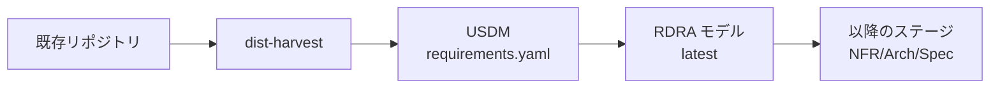
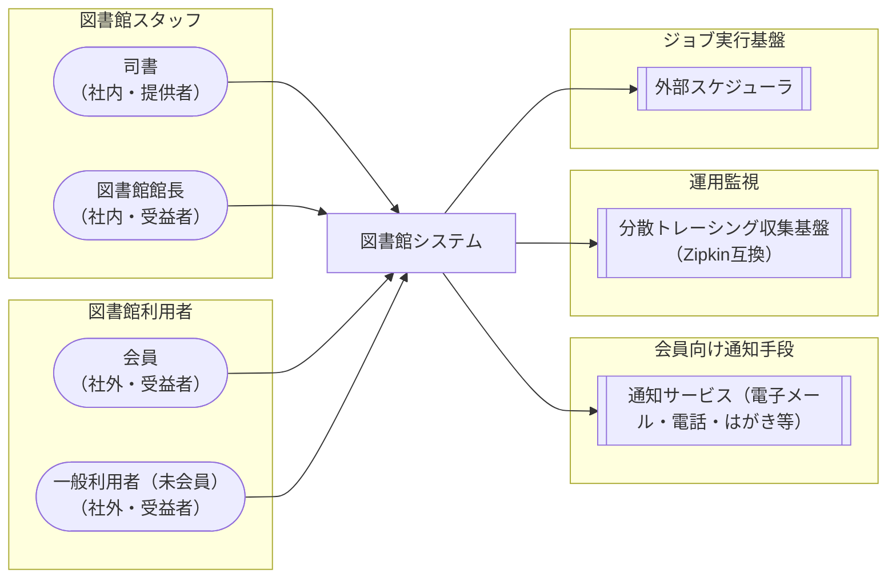
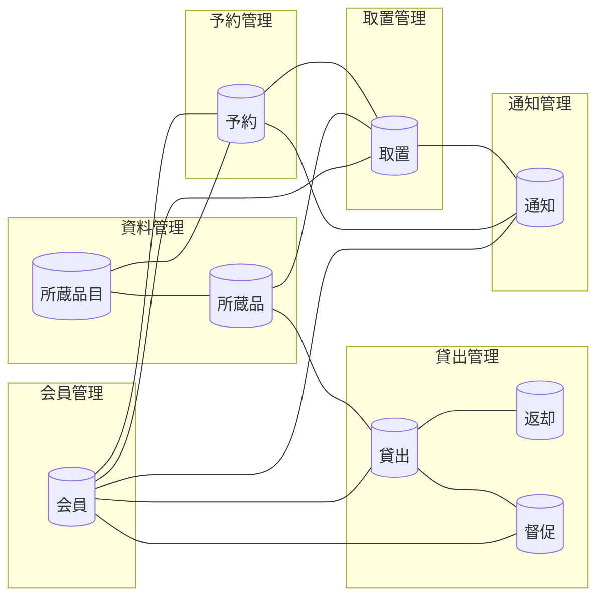

## ドキュメントが残っていないシステムをどう扱うか

長く動いているシステムほど、要件定義書は現実とずれていきます。改修のたびに仕様は更新され、ドキュメントは更新されず、やがて「コードだけが唯一の正」になります。リプレースを検討しようにも、まず「今このシステムが何をしているのか（as-is）」を人手で読み解くところから始めなければなりません。

この「コードから as-is 要件を復元する」工程を、Claude Code プラグイン [distillery](https://zenn.dev/suwash/articles/distillery_20260521) の先頭ステージ **`dist-harvest`** として実装しました。既存リポジトリを解析して要求・要件を吸い上げ、RDRA×USDM のパイプラインに合流させます。

本記事では、その設計判断を 3 つに絞って解説します。

1. **RDRA の TSV を直接生成せず、USDM を橋渡しにした**
2. **図解と整合性検証は LLM に書かせず、決定論的スクリプトに任せた**
3. **既存スキルの資産をクロス委譲で再利用した**

題材には、実際に `dist-harvest` で逆生成したサンプル（[RDRA 2.0 ハンドブックのサンプル「図書館システム」](https://github.com/suwa-sh/claude-code-rdra-rev)を解析した成果）を使います。数値・図はすべてこのサンプルの実体です。

:::message
distillery / RDRA / USDM の前提知識は既存記事に譲ります。RDRA は[要件モデルから見積もりを出す実践ガイド](https://zenn.dev/suwash/articles/rdra_20260414)、USDM は[RDRAAgent に USDM を適用する記事](https://zenn.dev/suwash/articles/rdraagent_20260326)、distillery 全体像は[技術調査 - distillery](https://zenn.dev/suwash/articles/distillery_20260521) を参照してください。
:::

## 全体像 - Harvest ステージの位置づけ

distillery は「漠然とした要望テキスト」を段階的に精製して設計成果物へ落とすパイプラインです。`dist-harvest` は、その入口に **既存プロジェクトを原料として差し込む** ためのステージ（Harvest = 原料の収穫）です。



内部フローは 4 フェーズです。

- **Phase1 リポジトリ解析**: コード・定義・履歴を RDRA 4 レイヤー（システム価値／外部環境／システム境界／システム内部）で as-is 分析する
- **Phase2 USDM 逆生成**: 解析結果から USDM の `requirements.yaml` を生成し、バリデータを通す
- **Phase3 ユーザー確認**: 推測で補完した項目（`confidence: low`）を対話で提示する
- **Phase4 RDRA フルビルド**: USDM を入力に RDRA モデル一式を構築する

`dist-harvest` は **初期構築専用**です。すでに `docs/rdra/latest/*.tsv` があるプロジェクトでは中断し、差分更新モード（`dist-requirements`）へ誘導します。「新規取り込みは harvest、以降の変更は差分モード」と役割を分けているため、一度取り込んだ後の変更要望は自然に差分の世界へ乗ります。

## 設計判断1 - コードから RDRA を直接作らず、USDM を挟む

素直に考えれば「コード → RDRA モデル（TSV）」を一足飛びに生成したくなります。しかし `dist-harvest` は、逆生成の成果物をあえて **USDM の `requirements.yaml` に留め**、RDRA モデルは既存の `dist-requirements` に構築させます。

理由は 3 つあります。

- **既存バリデータと整合する**: `requirements.yaml` は `dist-requirements` のバリデータ（`validateRequirements.js`）が検証できる正規入力です。逆生成物を独自形式にせず、正規入力の形で受け渡すことで、後段のすべてのスキルが無変更で動きます
- **イベントソーシングに乗る**: distillery は要件・設計の差分を不変イベントとして `docs/*/events/` に記録します。逆生成を「初期イベント」として同じ仕組みに載せることで、その後の変更が差分イベントとして積み上がります
- **「なぜ」を構造として持てる**: USDM は要求（requirement）・理由（reason）・仕様（specification）を階層で持ちます。コードから読めるのは「何をしているか」ですが、USDM の器に収めることで「なぜそうなっているか（reason）」を推測として明示的に記録できます

つまり USDM は、**逆生成という不確かな行為を、既存パイプラインの型に収めるためのアダプタ**として機能します。

## 設計判断2 - コードから「事実」を読み、「推測」と区別する

逆生成の品質は、どれだけ「コードから直接読めた事実」に立脚できているかで決まります。`dist-harvest` は解析対象を **確度の高い順に 9 種類** 定義し、上位ほど「実装された事実」、下位ほど「意図の手がかり」として扱います。

- データストア定義（マイグレーション・スキーマ・ORM エンティティ）→ 情報・状態・バリエーション・条件
- エンドポイント定義（OpenAPI・ルーティング）→ UC・画面・イベント
- ドメイン層コード（モデル・ステートマシン・バリデーション）→ UC・状態・条件
- UI 層コード（画面・フォーム）→ 画面・アクター
- 設定ファイル（環境変数・ロール定義）→ アクター・外部システム・非機能要求
- 外部連携定義（Webhook・キュー・スケジューラ）→ 外部システム・イベント・タイマー
- テストコード（シナリオ・fixture）→ UC・受け入れ基準・条件
- ドキュメント（README・仕様書）→ 要求・業務・システム概要
- コミット履歴（`git log`・PR）→ 要求・理由（なぜ）

### evidence と confidence

すべてのインベントリ項目に、根拠（`事実: path:line` または `推測: 手がかり`）と確度（`high` / `medium` / `low`）を必須で付けます。図書館システムの解析では、analysis ドキュメント全体で **事実マーカー 198 個・推測マーカー 63 個** が付与されました。大半がコードに裏づけられ、推測は推測とラベルされています。

USDM 側でも同様です。逆生成した **要求 5 件・仕様 17 件（合計 22 項目）** の確度内訳は、`high 17 / medium 4 / low 1` でした。

この「推測を推測と申告する」設計は、逆生成の弱点をそのまま強みに変えます。たとえばサンプルの `SPEC-005-01` は、貸出期限切れ確認 API を次のように記録しています。

> 期限判定ロジック（DueDate.status）が return null のスタブ、通知リポジトリの実装クラスが存在せず DI もされないため、実行時に NPE となる可能性が高い未完成実装である。呼び出し元（外部スケジューラ/手動）も不明

`confidence: low` が付いた項目は Phase3 でユーザー確認に上がります。**AI は「動いている風」に埋めるのではなく、未完成を未完成と申告する**わけです。

### 図解と検証は決定論的スクリプトに任せる

ここが 2 つ目の設計判断です。RDRA ビューの生成と整合性チェックは、**LLM に一切書かせず、決定論的スクリプト `generateRdraMd.js` に任せます**。LLM の役割は TSV（構造化データ）を作るところまでで、そこから先の「図解つき Markdown」は同一入力 → 同一出力で機械生成します。

生成されるビューはたとえばシステムコンテキスト図です。



情報モデルも同様に、コンテキストごとの情報と関連が図になります。



図解を LLM に描かせると、同じ TSV から毎回微妙に違う図が出て、レビューのたびに差分が揺れます。生成を決定論に寄せることで、**モデル（TSV）が変わったときだけ図が変わる**状態を担保できます。

## 整合性 lint - AI の逆生成に混入する「名前ゆれ」を機械的に捕まえる

決定論スクリプトのもう一つの仕事が、整合性チェック（lint）です。`generateRdraMd.js --lint` は、RDRA Sheet の「✖不整合」シート相当の **15 項目**を機械検証します。チェックは 2 段階です。

- **エラー**: 未定義参照（BUC が参照しているアクター・情報・条件などがシートに定義されていない）
- **警告**: 未接続（定義されているが BUC のどの行からも参照されていない）

このチェックは効きます。実際、サンプル自身の逆生成結果から不整合が検出されました。

| 重大度 | チェック | 対象 |
|---|---|---|
| エラー | 未定義「アクター」 | 一般利用者 |
| 警告 | 未接続「アクター」 | 一般利用者（未会員） |
| 警告 | 未接続「外部システム」 | 分散トレーシング収集基盤（Zipkin互換） |

注目すべきは、**エラーと 1 つ目の警告が同じ根本原因から生まれている**点です。アクター定義は「一般利用者（未会員）」なのに、BUC 側は「一般利用者」（接尾辞なし）を参照している。これは **AI の逆生成に混入した名前ゆれ**で、「未定義参照（エラー）」と「未接続（警告）」という 2 つの症状として現れます。1 原因 → 2 症状です。残る 1 件（Zipkin の未接続警告）だけが別要因で、デフォルト無効のトレーシング基盤が業務フローに現れないという妥当な指摘です。

LLM に「整合していますか？」と尋ねても、この種のゆれは見逃されがちです。**定義集合と参照集合を突き合わせる決定論チェックだからこそ、名前が 1 文字違うだけの不整合を機械的に捕まえられます**。

:::message
通常フローでは、この lint をステージング（`1_RDRA/`）に対して実行し、エラー 0 件になるまで TSV を修正してから `latest` を確定します。リポジトリのサンプルでは、検出結果を読者に見せる目的でエラーを意図的に未修正のまま残しています（本来の運用では確定前に修正します）。
:::


## 設計判断3 - 既存スキルの資産をクロス委譲で再利用する

`dist-harvest` は Phase4 の RDRA フルビルドを、ゼロから実装していません。同じプラグイン内の `dist-requirements` が持つ RDRA フルビルド資産（`references/rdra-phases/` のタスクプロンプト群と `scripts/` のスクリプト群）を、`${CLAUDE_PLUGIN_ROOT}` 経由で**そのまま再利用**します。

```
${CLAUDE_PLUGIN_ROOT}/skills/dist-requirements/references/rdra-phases/  # フルビルド手順
${CLAUDE_PLUGIN_ROOT}/skills/dist-requirements/scripts/generateRdraMd.js # ビュー生成・lint
```

ポイントは、**`dist-requirements` スキル自体は呼び出さない**ことです。スキルを丸ごと起動すると先頭で USDM 分解が二重に走ってしまうため、`dist-harvest` は「フルビルドのタスクプロンプトとスクリプトだけ」をピンポイントで借ります。

これは Claude Code プラグインならではの再利用パターンです。スキルを機能単位で呼び出す（＝重い）のではなく、**スキルが内包する references / scripts を共有アセットとして参照する**ことで、逆生成専用のスキルが要件定義スキルの成熟した資産に乗れます。

## 実測サマリ

図書館システム（Java 17 / Spring Boot 3.1.1 / MyBatis / H2・PostgreSQL、commit `f460a75`）を `dist-harvest` にかけた結果です。

- 要求 5 件 / 仕様 17 件 / 逆生成で新規追加したモデル要素 49 件
- 情報 9 個（会員・所蔵品目・所蔵品・貸出・返却・督促・予約・取置・通知）を 6 コンテキストに整理
- BUC 11 個（貸出・返却・予約・取置・督促・会員登録・蔵書登録の各フロー）
- evidence: 事実 198 / 推測 63、USDM confidence: high 17 / medium 4 / low 1
- 整合性 lint: エラー 1 / 警告 2 を検出

ここまでで as-is モデルが手に入ります。あとは `dist-quality-attributes` 以降のステージ（非機能要求 → アーキテクチャ → 仕様）を回せば、この as-is を起点にリプレースの再設計へ進めます。**「レガシーを読む」工程を AI と決定論スクリプトの分担で仕組み化した**のが `dist-harvest` の狙いです。

## まとめ

- 逆生成の成果物を **USDM に留め**、RDRA 構築は既存パイプラインに委ねることで、後段を無変更で動かす
- すべての項目に **evidence / confidence** を付け、事実と推測を区別する。推測は Phase3 の人手確認に上がる
- **図解と整合性検証は決定論スクリプト**に任せ、LLM の役割を TSV 生成までに限定する。名前ゆれのような不整合は 15 項目の lint が機械的に捕まえる
- `${CLAUDE_PLUGIN_ROOT}` による **クロススキル委譲**で、要件定義スキルの資産を再利用する

`dist-harvest` は distillery プラグインに同梱されています。RDRA ナレッジは [suwa-sh/RDRAAgent](https://github.com/suwa-sh/RDRAAgent)、逆生成の解析手法は [suwa-sh/claude-code-rdra-rev](https://github.com/suwa-sh/claude-code-rdra-rev) 由来です（RDRA 2.0: 神崎善司氏 / USDM: 清水吉男氏）。

https://github.com/suwa-sh/suwa-sh-claude-plugins

### 関連記事

- [技術調査 - distillery](https://zenn.dev/suwash/articles/distillery_20260521)
- [要件モデルから「実装可能な精度」で見積もりを出す - RDRA×SFP実践ガイド](https://zenn.dev/suwash/articles/rdra_20260414)
- [RDRAAgent Phase1にUSDMを適用して精度を上げる](https://zenn.dev/suwash/articles/rdraagent_20260326)
- [技術調査 - USDM × XDDP](https://zenn.dev/suwash/articles/usdm_xddp_20260325)
