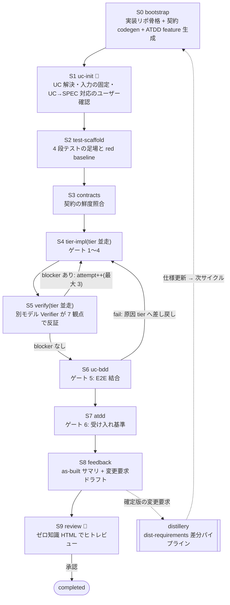

## 概要

AI エージェントに実装を任せると、3 つの問題に必ずぶつかります。①長時間の実装がセッション断で巻き戻る、②「テストは通るが仕様から逸脱した」コードを検出できない、③仕様策定で詰めた内容が実装で霧散する。

distillery-impl は、この 3 つに正面から答える Claude Code plugin です。仕様書(前工程の [distillery](https://github.com/suwa-sh/suwa-sh-claude-plugins/tree/main/plugins/distillery) が生成)を入力に、テストを 4 段先に作り、実装エージェント(Implementer)が書き、**別モデルの検証エージェント(Verifier)が反証し**、途中で切れても再開できる形で「動くコード」まで運びます。

https://github.com/suwa-sh/suwa-sh-claude-plugins

設計の骨格は、Cloudflare が公開した脆弱性探索ハーネス(VDH/VVS)の設計原則を「脆弱性探索」から「仕様駆動実装」へ転用したものです。

| VDH/VVS の原則 | distillery-impl での転用 |
|---|---|
| 二段独立検証(発見と検証を別エージェントに分離) | Implementer と別モデルの Verifier。自己採点を排除 |
| 状態の外部化と冪等再開 | ファイル駆動(events + latest + done)。セッション断から続行 |
| コンテキストを絞った stage 分割 | stage = fresh サブエージェント + 最小 read-set |
| PoC 必須(検証可能な証拠) | 6 段ゲート(format / lint / TDD / tier BDD / UC BDD / ATDD) |
| human-in-the-loop | UC→SPEC 対応の確定・最終承認はユーザー |

- 解説記事: [技術調査 - Cloudflare 脆弱性探索ハーネス (VDH/VVS)](https://suwa-sh.github.io/zenn-contents/articles/cloudflare-vulnerability-harness_20260619/)
- 一次情報: [Build your own vulnerability harness — Cloudflare Blog](https://blog.cloudflare.com/build-your-own-vulnerability-harness/)

## 特徴

### パイプライン: S0〜S9 の状態機械

オーケストレータ(dist-impl-run)は、重い実装・検証処理をすべて fresh サブエージェントに委譲します(軽量な S1 uc-init と S3 contracts、依存追加や format barrier、成果物の検収は自ら実行)。git commit はオーケストレータのみが行う単一コミッタ方式です。



### 4 段テスト先行

実装前にテストを 4 段生成し、**すべてが「未実装を理由に」fail する red baseline** を作ってから実装に入ります。fail の理由がパースエラーや設定ミスなら足場の不備として弾きます。

1. **ATDD**：USDM 要件の受け入れ基準(1 criterion = 1 Scenario、`@atdd_{SPEC-ID}-{連番}` タグの完全一致で選択実行)
2. **UC BDD**：仕様書の E2E 完了条件(全 tier 結合)
3. **tier BDD**：ティア完了条件(tier 単体)
4. **TDD**：単体テスト(テストメソッド名は「テスト対象_XXXの場合_YYYであること」+ AAA)

上 3 段は仕様書の gherkin を意訳せず転写します。「テストの意図」を実装エージェントが書き換えられない構造です。

### 二段独立検証: ゲートが通っても信用しない

S4 の Implementer がゲート 1〜4(format / lint / TDD / tier BDD)を通しても、S5 で**別モデルの Verifier** が成果物と仕様だけを突き合わせて反証します。Verifier には実装時の会話履歴を渡さず、実装コードの修正権限も与えません(①agent 定義による編集ツール禁止 ②プロンプトの write-set 制約 ③オーケストレータによる stage 完了時の逸脱検査、の 3 層防御)。

観点は 7 つ: 仕様整合 / 可読性・保守性 / セキュリティ / パフォーマンス / 運用性 / 耐障害性 / リファクタリング。blocker が出ると attempt++ で S4 に差し戻され、無傷の tier は carry-forward、**S4 を再実行したら全 tier を再検証**します(安全側)。

### ファイル駆動の冪等再開

状態はすべて実装リポの `docs/impl/` 配下のファイルです。

- `events/`：追記のみのイベントログ(stage_completed / attempt_opened / stage_carried_forward など)
- `latest/`：スナップショット(イベントから再構築可能)
- `stages/*.done.yaml`：完了判定の正。入力の sha256 を固定した manifest とセットで持ち、入力が変わると該当 stage 以降を自動 invalidate

セッションが切れても、次回起動時に done ファイルと manifest の照合を中心とした再開判定(lease 確認・入力ハッシュの現物再計算・attempt 世代の解決を含む)で「どの stage から再開するか」が決まります。多重起動は run-lease で拒否します。

### 仕様への還流: as-built 差分で変更要求を返す

実装中に見つかる仕様の穴(cross-UC 依存の未宣言、スキーマ矛盾、契約の生成不能な記述)は、実装側で握りつぶさず issues に記録し、**推奨分岐ではテストが通るところまで実装を進めます**(進行不能な blocker は blocked_on_spec として停止する分岐もあります)。その後 S8 が「実装が実際に満たす仕様」を as-built サマリとして整理し、**as-built との差分として変更要求**を出力します。変更要求はそのまま distillery の差分パイプライン(dist-requirements)に渡せる形式で、仕様更新 → 次サイクルへと一周が閉じます。

## 実測: 図書館システムの 1 UC を一気通貫

リポ同梱のサンプル(図書館蔵書管理システム、18 UC)から UC「書籍を貸出する」を選び、S0→S9 を実走させた結果が [samples/distillery-impl](https://github.com/suwa-sh/suwa-sh-claude-plugins/tree/main/samples/distillery-impl) にそのまま置いてあります。

結果の要点:

- 6 段ゲート全 pass(単体 47 / tier BDD 2+2 / UC BDD 4 / ATDD 2)
- **attempt-1 で Verifier(opus)が blocker を 2 件検出**。どちらも「ゲートは通るが仕様逸脱」の実例でした
  - frontend: tier BDD が計算値の比較で pass していたが、**画面の実描画が存在しない**(`.tsx` ゼロ、UI コンポーネント未使用)
  - backend: 予約チェックを**スキーマに存在しない自作フィールド**で代替(正本の reservations テーブルを無視)
- S6(E2E 結合)で仕様の穴 3 件が顕在化(未宣言の cross-UC API 依存・認証ヘッダ契約の不在・予約完了更新の記述不足)→ issues 記録つきで実装を進めて全シナリオ pass
- S8 が変更要求 11 件を出力 → 実際に distillery へ還流(うち 7 件が REQ-007〜012 として要件化。2 件は design 側、2 件は生成パイプライン自体への改善要望として仕分け)→ 仕様書の差分再生成まで一周完走
- 途中でセッションを打ち切って再開する検証も実施(lease による起動拒否 → done/manifest 照合 → 再開点 S4 を特定。この検証の実行ログは samples 外)

「ゲートが通っても信用しない」という設計は理屈の上の保険ではなく、初回実走からいきなり仕事をしました。

## 使い方

```bash
# marketplace 追加 + install
claude plugin marketplace add suwa-sh/suwa-sh-claude-plugins
claude plugin install distillery-impl@suwa-sh-claude-plugins
```

```text
# UC を指定して実装開始(初回は bootstrap から自動で走る)
/distillery-impl:dist-impl-run 貸出管理業務/貸出管理フロー/書籍を貸出する

# 中断からの再開(同じ指定でよい。完了済み stage は skip される)
/distillery-impl:dist-impl-run 書籍を貸出する
```

前提は distillery の出力(`docs/specs/latest/` ほか)と Node.js。openapi-generator 用の Java は無ければ縮退モードで動きます。進行中の対話(tier 構成の確認・UC→SPEC 対応の確定・最終承認)は、オーケストレータが必要な時だけ発話します。

## 制約と今後

- 認証・認可が仕様側に無い場合、今回のサンプルでは本番コードに手を入れず、統合テストのハーネス側に issue 参照コメント付きでヘッダを暫定注入して進めました。「実装が止まらないこと」を優先し、負債は必ず変更要求として可視化する設計です
- UC→SPEC の対応は機械可読マッピングが仕様側に無いため、初回はユーザー確認で確定します(マッピング出力の機械化は distillery への変更要求として起票済み)
- Verifier のモデルは実行時設定(impl-config)で指定します。Implementer と同一モデルの場合は停止して確認します

仕様の precision を上げる側(distillery)にも同じ反証レビューループを組み込んだので、「仕様 → 実装 → 変更要求 → 仕様」のループが両側から締まっていく構造になりました。実装を任せる相手が AI になっても、**信用の根拠を人格でなく検証の仕組みに置く**。このハーネスの一番の主張はそこにあります。
