> Distill raw requirements into production-ready design.

## ■概要

### distillery とは

distillery(ディスティルリー)は、漠然とした要望テキストを段階的に精製し、要件定義からインフラ設計・詳細仕様までを一気通貫で生成する Claude Code プラグインです。ひとつのコマンドで、テキストベースの初期要望を「実装可能な仕様書群」へと蒸留します。

プラグイン識別子は `distillery@suwa-sh-claude-plugins` で、`suwa-sh/suwa-sh-claude-plugins` リポジトリの `plugins/distillery` に収録されています。本記事は 2026-05 時点の main ブランチを基に整理しました。

### 生まれた背景

distillery の RDRA / USDM 系スキル群は、[suwa-sh/RDRAAgent](https://github.com/suwa-sh/RDRAAgent) の `usdm-rdra` 系スキル群を汎用プラグインとして再パッケージしたものです。RDRAAgent 自体は [kanzaki/RDRAAgent_v0.6](https://github.com/kanzaki/RDRAAgent_v0.6) の派生で、Claude Code のエージェントスキルとして組み直されています。distillery では RDRA モデル生成だけでなく、非機能要求 (NFR) ・アーキテクチャ・インフラ・デザインシステム・詳細仕様の生成まで責務を拡張しています。

### 蒸留メタファ

パイプラインの各ステージには、蒸留酒の製造工程に対応する名称が付けられています。

| ステージ名          | スキル                  | 主な出力先                                                 |
| ------------------- | ----------------------- | ---------------------------------------------------------- |
| Mash                | dist-requirements       | `docs/usdm/latest/`, `docs/rdra/latest/`                   |
| Ferment             | dist-quality-attributes | `docs/nfr/latest/`                                         |
| Distill             | dist-architecture       | `docs/arch/latest/`                                        |
| Mature              | dist-infrastructure     | `docs/infra/latest/`                                       |
| Blend               | dist-design-system      | `docs/design/latest/`, `docs/design/latest/storybook-app/` |
| Bottle              | dist-spec               | `docs/specs/latest/`                                       |
| Bottle (Story 補完) | dist-spec-stories       | `docs/design/latest/storybook-app/`                        |
| Master              | dist-pipeline           | 全スキルの順次実行                                         |

Bottle ステージは `dist-spec` (Step6) と `dist-spec-stories` (Step6a) の 2 スキルで構成されます。8 スキルが 7 ステージにマップされる構成です。

### パイプライン全体像

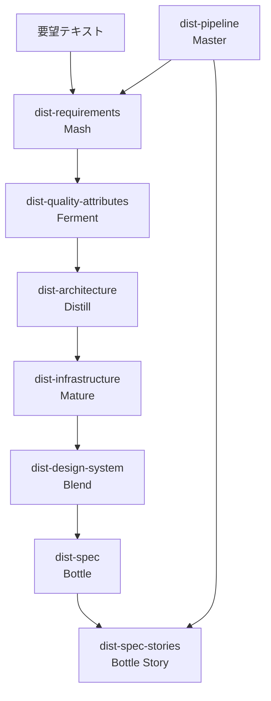

### 統合している方法論

distillery は以下の手法を単一パイプラインに統合しています。

| 方法論                      | 担当スキル                     | 役割                                                                                                                                        |
| --------------------------- | ------------------------------ | ------------------------------------------------------------------------------------------------------------------------------------------- |
| USDM                        | dist-requirements              | 要望テキストを「要求・理由・仕様」に分解し、後段への入力形式を統一する                                                                      |
| RDRA 2.0                    | dist-requirements              | ビジネスとシステムの関係をモデル化し、アクター・情報・BUC などを TSV で構造化する                                                           |
| IPA 非機能要求グレード 2018 | dist-quality-attributes        | 可用性・性能-拡張性・運用-保守性・移行性・セキュリティ・システム環境-エコロジーの 6 大項目で品質メトリクスにグレードを付与する              |
| MCL (Multi-Cloud Lifecycle) | dist-infrastructure            | [multi-cloud-lifecycle-skills](https://zenn.dev/suwash/articles/multi-cloud-lifecycle-skills_20260328) 経由でクラウドインフラ設計を生成する |
| Spec-Driven Development     | dist-spec                      | OpenAPI 3.1 / AsyncAPI 3.0 での契約駆動開発とスペック駆動開発で仕様を確定する                                                               |
| UI-UX Pro Max               | dist-design-system / dist-spec | UX 心理学・データ可視化・アクセシビリティ・デザイントークンを統合したガイドラインを適用する                                                 |
| Event Sourcing              | 全スキル                       | 設計変更を不変イベントとして `events/` に記録し、差分更新・ロールバック・監査を可能にする                                                   |

## ■特徴

### Event Sourcing による差分更新

全スキルは `docs/*/events/{event_id}/` への不変イベントと `docs/*/latest/` へのスナップショットという二層構造で動作します。これはイベントストア + スナップショット投影のパターンで、`latest/` を CQRS の Read Model として読むこともできます。変更要望を与えると、影響する RDRA モデルだけが差分更新され、その差分が後段のスキルへ伝播します。結果として、設計全体を毎回ゼロから再生成せずに、変更箇所のみを精度よく更新できます。

### USDM による曖昧要望の構造化

初期要望テキストは、まず USDM (Universal Specification Describing Manner) フォーマットに分解されます。「要求・理由・仕様・影響モデル」の四要素に構造化することで、後段の RDRA 差分生成・NFR 推論・アーキテクチャ推論が安定します。

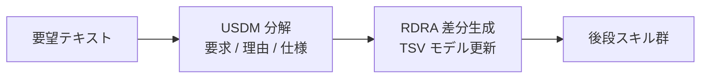

### UC 単位 OpenAPI / AsyncAPI

dist-spec は、UC (ユースケース) ごとに `_api-summary.yaml` を生成し、最終的に全 UC を統合した `_cross-cutting/api/openapi.yaml` と `asyncapi.yaml` を出力します。OpenAPI 3.1 と AsyncAPI 3.0 を中核とした Contract First 開発 (API コントラクトをコード実装より先に確定する) が可能になります。

### MCL 連携によるクラウド設計

dist-infrastructure は、ベンダーニュートラルなアーキテクチャ設計 (`arch-design.yaml`) を [multi-cloud-lifecycle-skills](https://github.com/suwa-sh/multi-cloud-lifecycle-skills) の `mcl-product-design` スキルへの入力に変換します。MCL が AWS / Azure / GCP 向けのワークロードモデル・ベンダーマッピング・IaC スケルトンを生成し、その結果からベンダーニュートラルな知見を抽出してアーキテクチャ設計にフィードバックします。

### ベンダーニュートラルなアーキテクチャ記述

dist-architecture が出力する `arch-design.yaml` のテクノロジー記述はすべてベンダーニュートラルです (FaaS / CaaS(k8s) / RDB など) 。クラウドベンダーへのマッピングは dist-infrastructure が担うため、アーキテクチャ層とインフラ層を独立して変更できます。

### RDRA 整合性ルール

dist-architecture / dist-infrastructure / dist-design-system / dist-spec の各スキルは、「RDRA モデルに存在しないアクター・情報・BUC・画面・エンティティを自動追加してはならない」という整合性ルールに従います。追加が必要と判断した場合は `docs/todo.md` に提案を記録し、ユーザーへの確認推奨項目として返却します。

### 対話型グレード推論

dist-quality-attributes は、スキル実行前に利用者数・ピークアクセス・運用時間帯・移行要否・データ量規模を対話でヒアリングし、IPA 非機能要求グレード 2018 の 6 大項目を自動推論します。推論できなかった項目は `confidence: low` としてマークし、パイプライン側がユーザーへの確認を促します。

### 疎結合なファイル I/O

各スキルは `docs/*/latest/` を介してファイルで連携します。スキル間に直接の API 依存がないため、途中ステージから再実行したり、特定のスキルだけを単独で使うことができます。

### Web ダッシュボードによる進捗可視化

dist-pipeline は実行中に進捗ダッシュボード (Node.js HTTP サーバー) をバックグラウンドで起動します。各ステージの状態 (pending / running / completed / error) とサブエージェントの現在タスクをリアルタイムで確認できます。

### 関連技術との比較

| ツール / アプローチ                             | カバー範囲                                     | distillery との主な違い                                                                |
| ----------------------------------------------- | ---------------------------------------------- | -------------------------------------------------------------------------------------- |
| 純粋な RDRA ツール (RDRAAgent 等)               | 要件定義のみ                                   | distillery はアーキテクチャ・インフラ・仕様生成まで一気通貫                            |
| GitHub Spec Kit                                 | Spec → Plan → Tasks → Implement のワークフロー | distillery は RDRA / USDM による構造化要件定義と NFR グレード推論を含む                |
| Pluralith                                       | Terraform 状態の可視化・ドキュメント化         | distillery はインフラ生成前の上流設計 (要件 - アーキテクチャ) をカバー                 |
| DevX 系プラグイン (例: mcl-product-design 単体) | クラウドインフラ設計                           | distillery は要件定義から上流設計を担い、mcl-product-design をオーケストレーションする |

## ■構造

### ●システムコンテキスト図

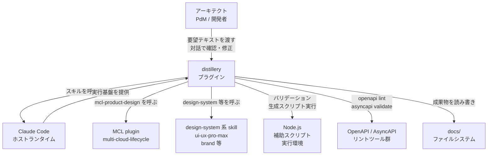

#### 要素説明

| 要素名                      | 説明                                                                   |
| --------------------------- | ---------------------------------------------------------------------- |
| アーキテクト / PdM / 開発者 | 要望テキストを起点にパイプラインを起動し、対話で設計を確定するユーザー |
| Claude Code                 | distillery の実行基盤となるホストランタイム                            |
| distillery プラグイン       | 要望からプロダクション仕様まで蒸留するパイプラインプラグイン           |
| MCL plugin                  | クラウドインフラ設計を担当する外部プラグイン群                         |
| design-system 系 skill      | デザイントークン・Storybook 生成に利用する外部スキル群                 |
| Node.js                     | YAML バリデーション・Markdown 生成などの補助スクリプト実行環境         |
| OpenAPI / AsyncAPI ツール群 | API 仕様のリント検証に使用する外部 CLI ツール                          |
| docs/ ファイルシステム      | 各スキルが読み書きするファイルベースの疎結合ストア                     |

### ●コンテナ図

スキルの書き込み先を実線、参照入力を点線で示します。

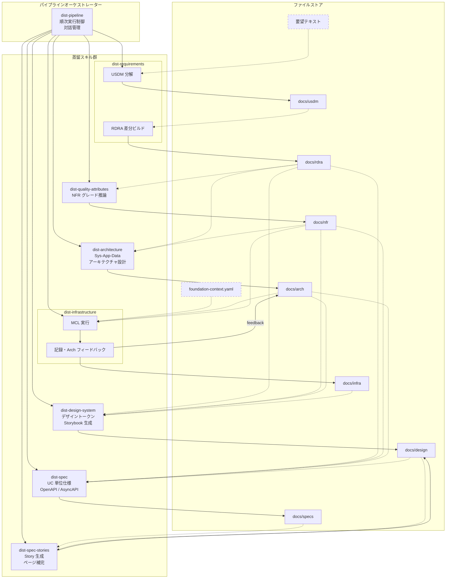

#### subgraph: パイプラインオーケストレーター

| 要素名        | 説明                                                                                                             |
| ------------- | ---------------------------------------------------------------------------------------------------------------- |
| dist-pipeline | 7 スキルを順次サブエージェントで実行し、対話・進捗ダッシュボード・エラーハンドリングを管理するオーケストレーター |

#### subgraph: 蒸留スキル群

| 要素名                  | 説明                                                                                                                                                             |
| ----------------------- | ---------------------------------------------------------------------------------------------------------------------------------------------------------------- |
| dist-requirements       | 変更要望テキストを USDM 分解し、RDRA モデルを初期構築または差分更新する                                                                                          |
| dist-quality-attributes | RDRA モデルから IPA 非機能要求グレード 6 大項目を推論・対話・出力する。内部は Step0 プリインタビュー → Step1 推論 → Step2 対話確認 → Step3 出力の 4 ステップ構成 |
| dist-architecture       | RDRA と NFR を入力としてベンダーニュートラルなシステム / アプリ / データアーキテクチャを設計する                                                                 |
| dist-infrastructure     | `arch-design.yaml` を MCL 入力に変換してクラウドインフラ設計を生成し、結果を arch にフィードバックする                                                           |
| dist-design-system      | RDRA / NFR / Arch / Infra モデルからデザイントークンを生成し Next.js + Storybook プロジェクトとして出力する                                                      |
| dist-spec               | RDRA / NFR / Arch / Design を入力に UC 単位仕様・OpenAPI / AsyncAPI・データストア設計を生成する                                                                  |
| dist-spec-stories       | 確定した UC Spec とデザインシステムから Storybook のページ Story を補完生成する                                                                                  |

#### subgraph: ファイルストア

破線枠の要素は distillery が書き出さない外部入力ファイルです。

| 要素名                  | 説明                                                                                |
| ----------------------- | ----------------------------------------------------------------------------------- |
| 要望テキスト            | 利用者が用意する変更要望テキスト。`dist-requirements` (USDM 分解) が読み込む        |
| docs/usdm               | USDM 要求 YAML のイベント履歴とスナップショット                                     |
| docs/rdra               | RDRA モデル TSV のイベント履歴とスナップショット                                    |
| docs/nfr                | NFR グレード YAML のイベント履歴とスナップショット                                  |
| docs/arch               | アーキテクチャ設計 YAML・Mermaid・決定記録のイベント履歴とスナップショット          |
| docs/infra              | MCL 成果物・infra-event YAML のイベント履歴とスナップショット                       |
| docs/design             | design-event YAML・Storybook プロジェクトのイベント履歴とスナップショット           |
| docs/specs              | UC / BUC 仕様・OpenAPI / AsyncAPI・データストア定義のイベント履歴とスナップショット |
| foundation-context.yaml | MCL foundation スキルの出力。`dist-infrastructure` (MCL 実行) が読み込む            |

#### 補助スクリプト (Node.js)

各スキルおよび `dist-pipeline` が内部で呼び出す Node.js スクリプトです。

| 要素名                                                      | 説明                                                                      |
| ----------------------------------------------------------- | ------------------------------------------------------------------------- |
| makeGraphData.js / makeZeroOneData.js                       | RDRA グラフデータと ZeroOne テキストを決定論的に生成するスクリプト        |
| validate*.js / generate*Md.js                               | 各スキルの YAML バリデーションと Markdown レポート生成スクリプト          |
| progress-update.js / progress-server.js / generateReadme.js | パイプライン進捗ダッシュボードの更新・配信・docs/README.md 生成スクリプト |

### ●コンポーネント図

dist-pipeline の制御フローを示します。スキル間のデータ連携 (どのスキルがどの `docs/*/latest` を読み書きするか) はコンテナ図を参照してください。

```mermaid
graph TD
    subgraph INIT_G["初期化"]
        INIT["入力確認<br/>ファイル存在検証"]
        DASH["進捗ダッシュボード起動<br/>progress-server.js"]
    end
    subgraph STEP1_G["Step1: dist-requirements"]
        STEP1["サブエージェント起動"]
        DIAL1["対話処理<br/>確認推奨項目を中継"]
        CHK1["完了チェック<br/>docs/rdra/latest/BUC.tsv"]
    end
    subgraph STEP2_G["Step2: dist-quality-attributes"]
        STEP2["サブエージェント起動"]
        DIAL2["対話処理<br/>NFR グレード確認"]
        CHK2["完了チェック<br/>nfr-grade.yaml"]
    end
    subgraph STEP3_G["Step3: dist-architecture"]
        STEP3["サブエージェント起動"]
        DIAL3["対話処理<br/>Arch 設計確認"]
        CHK3["完了チェック<br/>arch-design.yaml"]
    end
    subgraph STEP4_G["Step4: dist-infrastructure"]
        STEP4A["Step4a<br/>MCL 実行"]
        STEP4B["Step4b<br/>記録・FB"]
        DIAL4["対話処理<br/>ベンダー確認"]
        CHK4["完了チェック<br/>infra-event.yaml"]
    end
    subgraph STEP5_G["Step5: dist-design-system"]
        STEP5["サブエージェント起動"]
        DIAL5["対話処理<br/>ブランド確認"]
        CHK5["完了チェック<br/>design-event.yaml"]
    end
    subgraph STEP6_G["Step6: dist-spec"]
        STEP6["サブエージェント起動"]
        DIAL6["対話処理<br/>API / DB 方針"]
        CHK6["完了チェック<br/>spec-event.yaml"]
        STEP6A["Step6a<br/>dist-spec-stories<br/>Story 補完"]
        STEP6B["Step6b<br/>網羅率チェック<br/>RDRA フィードバック"]
    end
    subgraph DONE_G["完了処理"]
        DONE["完了報告<br/>generateReadme.js<br/>ダッシュボード停止"]
    end
    INIT --> DASH
    DASH --> STEP1
    STEP1 --> DIAL1
    DIAL1 --> CHK1
    CHK1 --> STEP2
    STEP2 --> DIAL2
    DIAL2 --> CHK2
    CHK2 --> STEP3
    STEP3 --> DIAL3
    DIAL3 --> CHK3
    CHK3 --> STEP4A
    STEP4A --> STEP4B
    STEP4B --> DIAL4
    DIAL4 --> CHK4
    CHK4 --> STEP5
    STEP5 --> DIAL5
    DIAL5 --> CHK5
    CHK5 --> STEP6
    STEP6 --> DIAL6
    DIAL6 --> CHK6
    CHK6 --> STEP6A
    STEP6A --> STEP6B
    STEP6B --> DONE
```

#### 要素説明

| 要素名                             | 説明                                                                         |
| ---------------------------------- | ---------------------------------------------------------------------------- |
| 入力確認                           | 要望テキストのパス確認・存在検証・実行範囲の確定                             |
| 進捗ダッシュボード起動             | `progress-server.js` を起動し、Web UI でリアルタイム進捗を可視化する         |
| Step1 - Step6 サブエージェント起動 | 各スキルをサブエージェントとして独立コンテキストで実行する                   |
| 対話処理                           | サブエージェントが返した確認推奨項目をユーザーに中継し回答を受け取る         |
| 完了チェック                       | 必須ファイルの存在を確認し、未達なら補完実行を指示する                       |
| Step6a                             | `dist-spec-stories` を起動して UC ページ Story の補完生成を実施する          |
| Step6b                             | `rdra-feedback.md` の有無を確認し、必要に応じて差分再実行ループを起動する    |
| 完了報告                           | `generateReadme.js` で `docs/README.md` を生成し、サマリをユーザーに提示する |

## ■データ

### ●概念モデル

distillery は全 7 ドメイン (`usdm`, `rdra`, `nfr`, `arch`, `infra`, `design`, `specs`) で同一の Event Sourcing パターンを共有します。`ChangeRequest` を入口に、各ドメインが `Event` を不変追記し `Snapshot` に投影します。スキル間のデータ流路はコンテナ図を、各エンティティの属性は次節の情報モデルを参照してください。

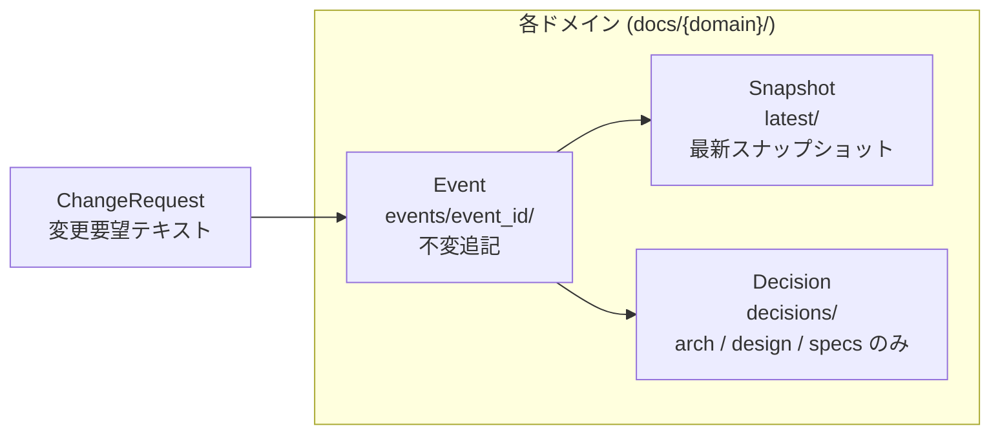

| 要素          | 説明                                                                                                           |
| ------------- | -------------------------------------------------------------------------------------------------------------- |
| ChangeRequest | 利用者が投入する要望テキスト。distillery の入口エンティティ                                                    |
| Event         | 不変追記される変更履歴。`event_id` ・ `timestamp` ・ `trigger_event` ・ `changes_summary` を共通属性として持つ |
| Snapshot      | `Event` の累積投影。各スキルが次段の入力として読む最新状態                                                     |
| Decision      | ADR 形式の決定記録。`arch` ・ `design` ・ `specs` の 3 ドメインに存在                                          |

`trigger_event` は `rdra:{event_id}` のようにドメイン間の因果関係を保持し、`infra` から `arch` への逆方向フィードバックもこのフィールドで追跡します。

### ●情報モデル

各ドメインの主要属性をクラス図で表します。属性のみ記載し、メソッドは省略します。

#### USDM ドメイン

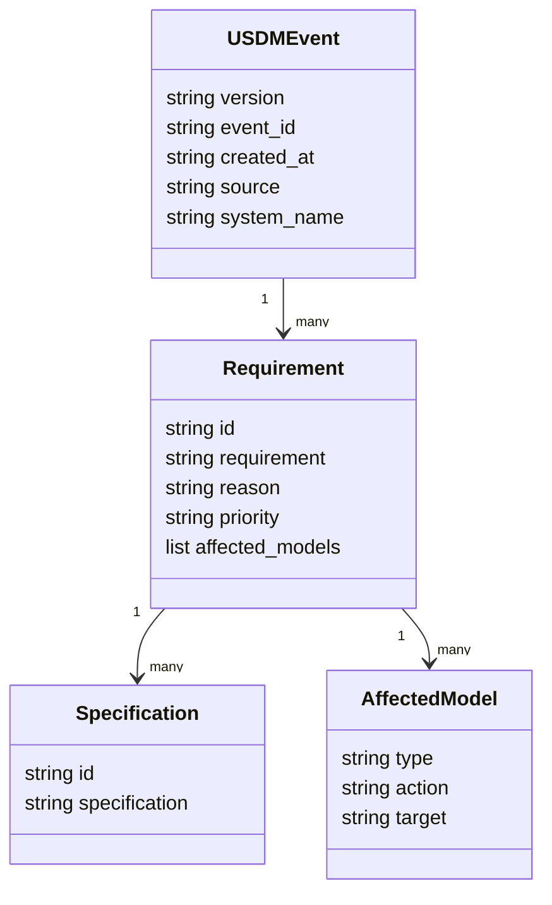

`priority` は `must` / `should` / `could` のいずれかです。`id` は `REQ-001` 形式、`Specification.id` は `SPEC-001-01` 形式で採番します。

#### RDRA ドメイン

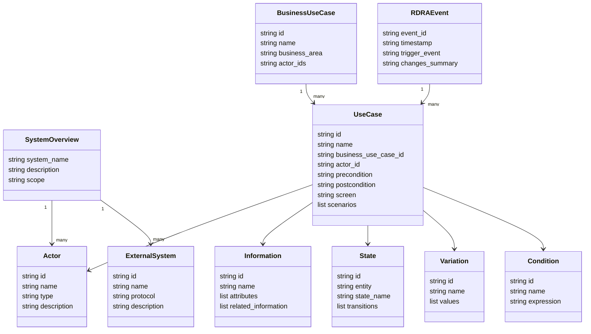

RDRA モデルは TSV 形式で保存します。ファイル名は日本語 (`アクター.tsv`, `BUC.tsv`, `情報.tsv`, `状態.tsv`, `条件.tsv`, `バリエーション.tsv`, `外部システム.tsv`) を使用します。イベントは `_changes.md` に追加 / 変更 / 削除を記録し、スナップショットを `latest/` にマージします。

RDRA 2.0 の論理モデルと distillery のファイル群の対応は以下のとおりです。

| RDRA 2.0 モデル              | distillery のファイル                                   |
| ---------------------------- | ------------------------------------------------------- |
| システムコンテキスト図       | `システム概要.json`, `アクター.tsv`, `外部システム.tsv` |
| ビジネスユースケース図 (BUC) | `BUC.tsv`                                               |
| ユースケース関連図 (UC)      | `BUC.tsv` 内に UC 行として併載                          |
| 情報モデル                   | `情報.tsv`                                              |
| 状態モデル                   | `状態.tsv`                                              |
| バリエーション               | `バリエーション.tsv`                                    |
| 条件                         | `条件.tsv`                                              |

#### NFR ドメイン

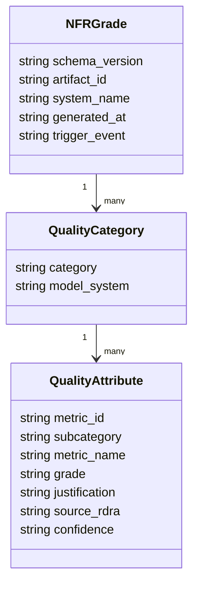

`category` は IPA 非機能要求グレード 2018 の 6 大項目 (`可用性`, `性能・拡張性`, `運用・保守性`, `移行性`, `セキュリティ`, `システム環境・エコロジー`) のいずれかです。`confidence` は `high` / `medium` / `low` / `user` のいずれかです。プリインタビューで未回答のメトリクスには推奨値を仮置きして `medium` を付与し、根拠が薄い項目に `low` を付与します。差分更新時は `nfr-grade-diff.yaml` に変更メトリクスのみを記録します。

#### Architecture ドメイン

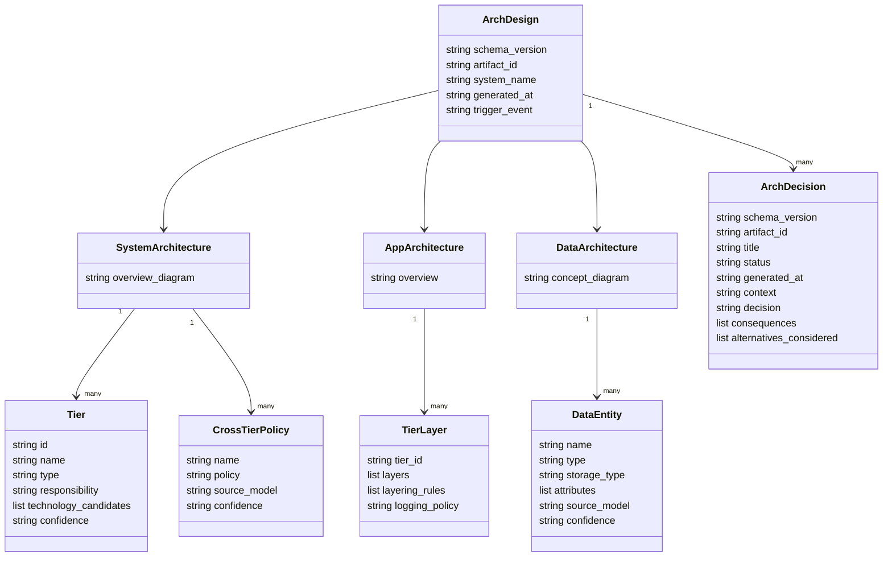

アーキテクチャ記述はベンダーニュートラル (FaaS / CaaS / RDB 等の抽象表現) を使用します。Mermaid graph 形式の図は `overview_diagram` および `concept_diagram` フィールドに文字列として格納します。

#### Infrastructure ドメイン

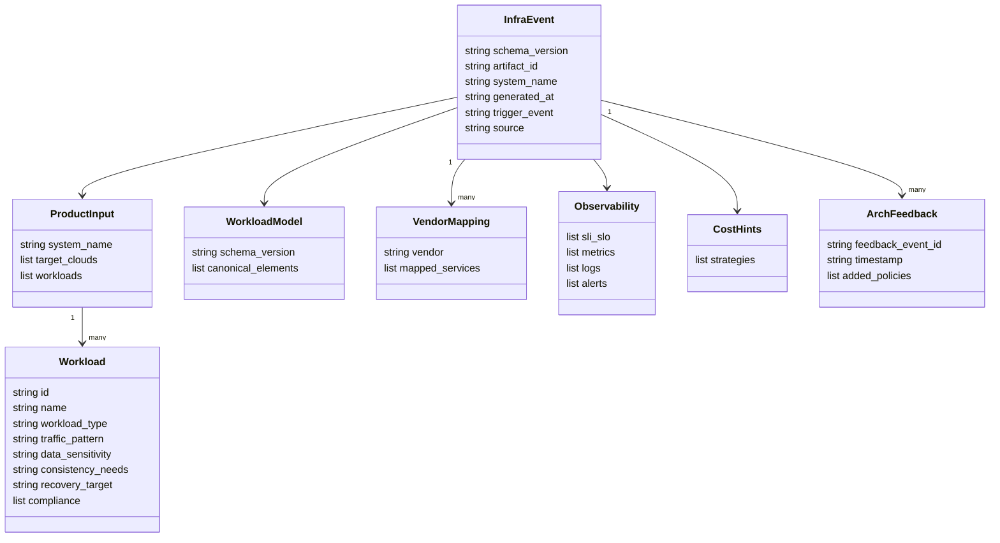

MCL の出力 (`product-workload-model.yaml`, `product-mapping-{vendor}.yaml`, `product-impl-{vendor}.yaml`, `product-observability.yaml`, `product-cost-hints.yaml`) は `events/{event_id}/specs/product/output/` 配下に全量生成されます。`latest/` は MCL 出力を全量上書きでコピーするハイブリッド方式です。

#### Design System ドメイン

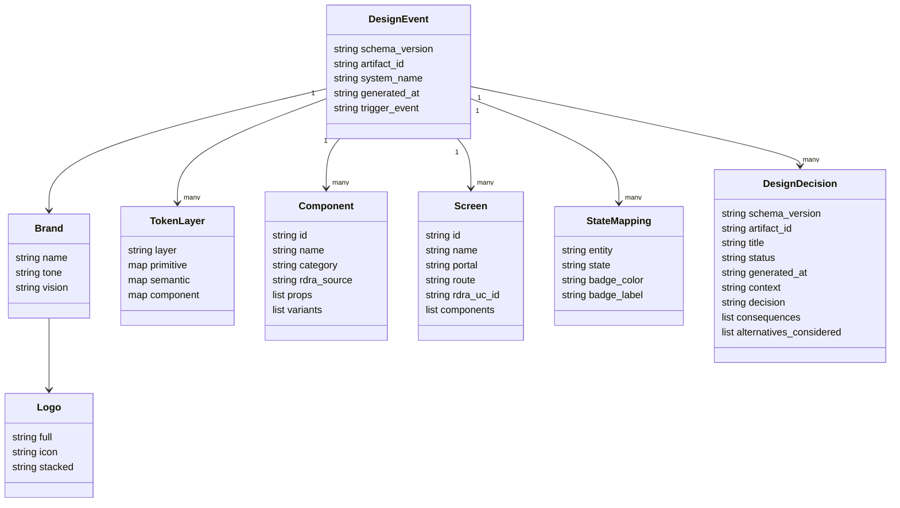

`storybook-app/` は `events/` には含めず `latest/` でのみ管理します (全量再ビルド対象) 。差分更新時は `design-event-diff.yaml` に変更要素のみを記録します。

#### Specification ドメイン

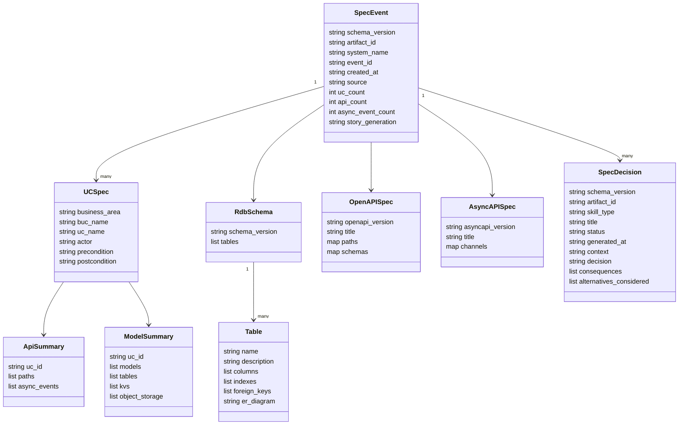

#### ドメイン横断 Event エンティティ

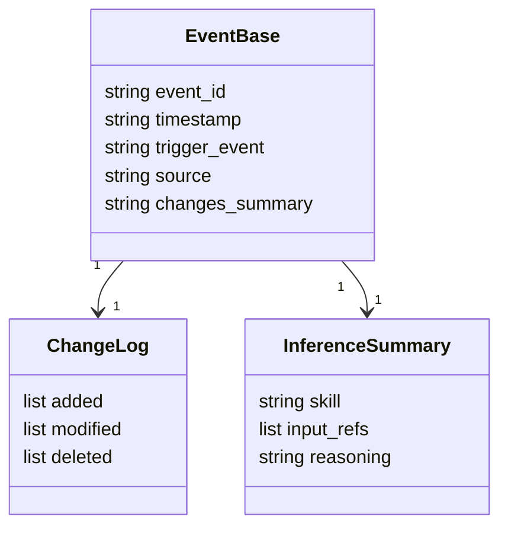

`trigger_event` は `rdra:{event_id}` / `nfr:{event_id}` / `arch:{event_id}` / `infra:{event_id}` 形式でスキル間の依存関係を追跡可能にします。`event_id` のフォーマットは `{YYYYMMDD_HHMMSS}_{変更名}` です。`変更名` には処理内容を表す任意文字列が入り、`spec_generation` / `spec_stories` のようにスキル固有の意味のある名前が使われます。

## ■構築方法

### 前提条件

| 項目                            | 必須 / 任意 | 内容                                                                                                                 |
| ------------------------------- | :---------: | -------------------------------------------------------------------------------------------------------------------- |
| Claude Code                     |    必須     | 最新安定版                                                                                                           |
| Node.js                         |    必須     | `dist-requirements` 等のスクリプト実行に必要                                                                         |
| mcl-common / mcl-product-design |    必須     | `dist-infrastructure` でクラウドインフラ自動設計を行う場合に必要。未インストール時は手動インフラ設計へフォールバック |
| design-system                   |    任意     | `dist-design-system` でデザイントークン生成品質を高める場合に必要                                                    |
| ui-ux-pro-max                   |    任意     | `dist-design-system` で UI / UX デザインインテリジェンスを追加する場合に必要                                         |
| brand                           |    任意     | `dist-design-system` でブランドガイドライン統合を行う場合に必要                                                      |
| storybook-config                |    任意     | `dist-design-system` で Storybook 設定を自動化する場合に必要                                                         |

### インストール手順

プラグインマーケットプレイスにリポジトリを追加したうえで、distillery をインストールします。

```bash
/plugin marketplace add suwa-sh/suwa-sh-claude-plugins
/plugin install distillery@suwa-sh-claude-plugins
```

任意の MCL スキルが必要な場合は、続けてインストールします。

```bash
/plugin install suwa-sh/multi-cloud-lifecycle-skills
```

MCL を手動インストールする場合は、各スキルを `~/.claude/skills/` にコピーしたうえで Claude Code を再起動します。

- `mcl-common/`
- `mcl-product-design/`
- `mcl-foundation-design/` (foundation 実行時に必要)
- `mcl-shared-platform-design/` (shared-platform 実行時に必要)

### バージョン確認方法

インストール済みプラグイン・スキルの一覧は以下のコマンドで確認します。

```bash
/plugin list
```

## ■利用方法

### パラメータ一覧

| スキル              | パラメータ                 | 必須 / 任意 | 説明                                     |
| ------------------- | -------------------------- | :---------: | ---------------------------------------- |
| `dist-pipeline`     | 要望テキストのファイルパス |    任意     | 未指定の場合は対話で確認される           |
| `dist-pipeline`     | 開始 Step                  |    任意     | 途中再開時に指定する開始 Step 番号       |
| `dist-requirements` | 変更要望テキストのパス     |    任意     | 未指定の場合は対話で確認される           |
| `dist-requirements` | `--no-confirm` フラグ      |    任意     | USDM 確認ダイアログをスキップする        |
| その他スキル        | なし                       |      —      | 入力は `docs/*/latest/` から自動読み込み |

### 初回ビルド (新規プロジェクト)

全 7 スキルを順次実行してパイプラインをフル実行します。

```
/distillery:dist-pipeline
```

実行開始後、ユーザーに要望テキストのファイルパスが確認されます。パスを指定するとパイプラインが自動的に開始します。

パイプライン進行中は Web ダッシュボードが起動し、リアルタイムで進捗を確認できます。ダッシュボードの URL は `node <skill-path>/scripts/progress-update.js url` コマンドで取得します。

### 個別実行

各スキルは独立して実行できます。既存の `docs/*/latest/` を読み込み、差分更新モードで動作します。

```
/distillery:dist-requirements 変更要望.md
/distillery:dist-quality-attributes
/distillery:dist-architecture
/distillery:dist-infrastructure
/distillery:dist-design-system
/distillery:dist-spec
/distillery:dist-spec-stories
```

各スキルの入出力は以下のとおりです。

- `dist-requirements` — 初回は USDM 分解 → RDRA フルビルド、2 回目以降は RDRA 差分生成
- `dist-quality-attributes` — `docs/rdra/latest/*.tsv` と `システム概要.json` を入力に NFR グレードを推論。実行前にユーザー数・ピーク同時アクセス・運用時間帯のプリインタビューが発生
- `dist-architecture` — `docs/rdra/latest/*.tsv` と `nfr-grade.yaml` を入力にシステム / アプリ / データアーキテクチャを推論。テクノロジー記述はすべてベンダーニュートラル
- `dist-infrastructure` — `arch-design.yaml` を MCL product-design に渡し、クラウドインフラ設計を生成。MCL 未インストール時は実行前に確認ダイアログを表示
- `dist-design-system` — RDRA / NFR / Arch / Infra モデルから 3 層トークン構造と Next.js + Storybook プロジェクトを生成
- `dist-spec` — RDRA / NFR / Arch / Design モデルから UC 単位仕様・OpenAPI / AsyncAPI・RDB / KVS スキーマ・トレーサビリティマトリクスを生成
- `dist-spec-stories` — `docs/specs/latest/` と `docs/design/latest/storybook-app/` を入力に UC ページ Story と共通コンポーネント Story を生成

### 差分更新モード

各スキルはパイプライン開始時に `docs/*/latest/` の状態を確認し、実行モードを自動判定します。

| 条件                                  | 動作モード                    |
| ------------------------------------- | ----------------------------- |
| `docs/*/latest/` が存在しないか空     | 初期構築モード (フルビルド)   |
| `docs/*/latest/` にファイルが存在する | 差分更新モード (差分のみ更新) |

差分更新モードでは、変更部分のみ `events/` に記録し、`latest/` にマージします。イベント履歴は `docs/*/events/` に不変ログとして蓄積されます。

途中のステージから再開する場合は、dist-pipeline 起動時のダイアログで「途中から再開」を選択し、開始 Step 番号 (1〜6) を入力します。Step6a (`dist-spec-stories`) と Step6b (網羅率チェック) は Step6 完了後に自動連結されます。

```
/distillery:dist-pipeline
# 「途中から再開」 → 開始 Step (例: 3) を入力
```

### 入力テキストの推奨フォーマット

要望テキストは以下の情報を含む形式を推奨します。スキルは短い要望テキストでも自動的に USDM 分解しますが、内容が豊富なほど推論精度が上がります。

```
# システム概要
(システムの目的・対象ユーザー・解決したい課題を記述)

# 主な要求
(箇条書きで要求を列挙)

# 変更・追加の背景
(なぜこの変更が必要か)

# 制約・前提条件
(技術的制約・ビジネス制約があれば記述)
```

初回実行後は USDM 分解結果 (業務一覧・UC 候補・主要情報・主要アクター) がユーザーに提示され、解釈ズレがないか確認できます。

### 出力物の確認方法

各スキルの成果物はすべて `docs/` 以下の `latest/` に保存されます。内容は `docs/README.md` で確認できます。デザインは `storybook` で確認できます。

```bash
open docs/README.md
cd docs/design/latest/storybook-app && npm run storybook
```

## ■運用

### パイプライン再実行

変更要望テキストを用意し、個別スキルまたは `dist-pipeline` を差分更新モードで呼び出します。

```bash
/distillery:dist-pipeline 変更要望テキストのパス
```

各スキルは `docs/{domain}/latest/` の存在を確認してモードを自動判定し、差分更新モードでは変更箇所のみを再推論して `events/{event_id}/` にイベントを追記します。

### イベント履歴の確認

各ドメインの `events/` ディレクトリに、実行のたびにタイムスタンプ付きイベントが蓄積されます。

```bash
ls -t docs/rdra/events/
ls -t docs/arch/events/ | head -1
cat docs/arch/events/{event_id}/_changes.md
cat docs/arch/events/{event_id}/_inference.md
```

`_changes.md` には追加・変更・削除のサマリが、`_inference.md` には推論根拠が記録されます。

### 部分実行

個別スキルを直接呼び出します。前段スキルの `latest/` が揃っていれば、任意のステージから単独実行できます。

```bash
/distillery:dist-requirements 変更要望テキストのパス
/distillery:dist-architecture
/distillery:dist-design-system
```

### Git 統合

`docs/` 配下を Git で管理することで、イベント差分とスナップショットの両方をトレースできます。`events/` は追記のみの不変ルールにより `git blame` でいつの判断かを追跡できます。

```bash
git add docs/
git commit -m "feat: 変更要望の概要 - distillery run {event_id}"
git diff docs/arch/events/
git diff docs/arch/latest/
```

### ロールバック

生成結果がねらいと異なる場合は、実行後に対話で修正することができます。大きくねらいと異なる結果になった場合は、該当コミットを revert して再実行します。`events/` と `latest/` の両方が一度に巻き戻り、再実行で新しいイベントが積まれるため、Git の歴史が設計判断の歴史と一致します。

```bash
git revert {rollback_target_commit}
/distillery:dist-pipeline 変更要望テキストのパス
```

### 成果物のレビューフロー

パイプライン完了後、`docs/README.md` が自動生成されます。以下の順でレビューします。

1. `docs/README.md` — C4 図解・サマリテーブル・UC 一覧・ADRs・イベント履歴のナビゲーション
2. `docs/todo.md` — 後続スキルから RDRA / NFR への追加提案 (open 件数を確認)
3. `docs/arch/latest/coverage-report.md` — RDRA / NFR 網羅率 (100% が目標)
4. `docs/specs/latest/_cross-cutting/traceability-matrix.md` — 要件トレーサビリティマトリクス

`docs/todo.md` に open 件数が残っている場合は、`dist-requirements` を再実行して RDRA を更新します。

### スキル毎のログ確認

各スキルの実行ログは `_inference.md` / `_changes.md` / `source.txt` に記録されます。

```bash
cat docs/usdm/events/{event_id}/_inference.md
cat docs/infra/events/{event_id}/_inference.md
cat docs/arch/events/{event_id}/_changes.md

node ${CLAUDE_PLUGIN_ROOT}/skills/dist-infrastructure/scripts/validateInfraEvent.js \
  docs/infra/events/{event_id}/infra-event.yaml
```

## ■ベストプラクティス

### 要望テキスト分割の粒度

- 初回: プロジェクト全体の初期要望を 1 ファイルにまとめて投入します。USDM が全体を構造化し、RDRA フルビルドを行います
- 2 回目以降: 変更要望ごとに 1 ファイルを作成します。UC 単位の粒度が推奨で、複数 UC にまたがる横断変更も 1 ファイルにまとめて差分を一括投入できます
- 要望テキストには変更内容・理由・検討済みの仕様を記述すると USDM 推論精度が向上します

### MCL プラグインとの組み合わせ

`dist-infrastructure` は `mcl-common` / `mcl-product-design` に依存します。

```bash
/plugin install suwa-sh/multi-cloud-lifecycle-skills
```

MCL は `specs/foundation/output/foundation-context.yaml` を必須とします。Distillery パイプライン開始前に MCL の foundation スキルを実行しておくことを推奨します。`shared-platform-context.yaml` が存在しない場合は Step1 サブステップで最小構成が自動生成されます。

### デザイン系プラグインとの併用

`dist-design-system` は以下のスキルがあれば自動的に利用します。

| スキル                  | 用途                                       | 推奨度                     |
| ----------------------- | ------------------------------------------ | -------------------------- |
| `design-system`         | トークンアーキテクチャ・コンポーネント仕様 | 必須                       |
| `ui-ux-pro-max`         | UI / UX デザインインテリジェンス           | 必須                       |
| `brand`                 | ブランドガイドライン・カラーパレット       | 推奨 (brand / design 統合) |
| `design`                | ロゴ / アイコン生成                        | 推奨 (brand / design 統合) |
| `storybook-config`      | Storybook 設定知識                         | 推奨 (Storybook 生成)      |
| `component-scaffold`    | コンポーネント雛形生成                     | 推奨 (Storybook 生成)      |
| `story-generation`      | Story 自動生成パターン                     | 推奨 (Storybook 生成)      |
| `design-system-starter` | デザインシステム雛形                       | 推奨 (Storybook 生成)      |

推奨スキルが不足している場合、`dist-design-system` はユーザーに一覧を提示してインストール・続行・中断の 3 択を確認します。

### CI / CD への組み込み

`dist-spec` が生成する `docs/specs/latest/_cross-cutting/api/openapi.yaml` と `asyncapi.yaml` をコントラクトテストの入力として使用します。

```yaml
- name: Contract test
  run: |
    npx @stoplight/spectral-cli lint docs/specs/latest/_cross-cutting/api/openapi.yaml
```

パイプライン再実行のたびに `latest/` が更新されるため、CI でリポジトリ最新の `latest/` を参照することで常に最新仕様に追従できます。

### 多人数チームでの利用

`events/` ディレクトリは不変 (追記のみ) のため、Git のマージ競合が発生しにくい設計です。

### ベンダー選定のタイミング

`dist-architecture` は全テクノロジー記述をベンダーニュートラル (FaaS / CaaS(k8s) / RDB 等) に保ちます。クラウドベンダー固有サービス名が含まれている場合はバリデーションスクリプトが警告を出します。

```
ベンダー選定のタイミング:
  dist-architecture  → ベンダーニュートラル設計 (ここで選定しない)
  dist-infrastructure → MCL product-design でベンダー選定 (AWS / Azure / GCP のどれか)
  dist-infrastructure Step4 → arch へのフィードバックは再びニュートラル化
```

## ■トラブルシューティング

| 症状                                                                                     | 原因                                                                              | 対処                                                                                                                                                 |
| ---------------------------------------------------------------------------------------- | --------------------------------------------------------------------------------- | ---------------------------------------------------------------------------------------------------------------------------------------------------- |
| `dist-infrastructure` 実行時に「MCL スキルがインストールされていません」と表示される     | `mcl-common` / `mcl-product-design` プラグインが未インストール                    | `/plugin install suwa-sh/multi-cloud-lifecycle-skills` でインストールする。手動の場合は `~/.claude/skills/` に配置して Claude Code を再起動          |
| `dist-infrastructure` が MCL なしで手動設計モードに切り替わる                            | 旧バージョンの SKILL.md 参照、またはスキルパス解決失敗                            | `for skill in mcl-common mcl-product-design; do ls ~/.claude/skills/$skill/SKILL.md; done` でパス確認。MISSING の場合は再インストール                |
| `node scripts/makeGraphData.js` が `command not found` で失敗する                        | Node.js が PATH に存在しない                                                      | `which node` で確認。nodebrew 環境では `npm` と `node` のバージョン不一致に注意し、`which -a node` で複数パスを確認して PATH を修正                  |
| `validate*.js` が終了コード 1 を返す                                                     | 生成 YAML にスキーマ違反 (必須フィールド欠落、ID 形式不正等)                      | エラー出力に表示された項目を修正。`version` / `event_id` / `created_at` の必須フィールドや、`REQ-001` 形式の ID を確認                               |
| `dist-design-system` で品質が低い、または Storybook が空になる                           | `design-system` / `ui-ux-pro-max` スキルが不足                                    | SKILL.md 内のスキル存在チェックスクリプトを実行して MISSING のスキルを特定し、インストール                                                           |
| `dist-spec` 実行後に `docs/design/latest/design-event.yaml` 不在エラー                   | `dist-design-system` が未実行または失敗                                           | `dist-design-system` を先に完了させてから `dist-spec` を実行。パイプライン経由の場合は Step5 完了を確認                                              |
| `docs/*/latest/` の内容と `events/` 最新イベントが乖離                                   | パイプラインが途中で中断し、スナップショット更新が未完了                          | 未完了の Phase を特定し、`dist-pipeline` の「途中から再開」オプションで中断した Step を再実行                                                        |
| `docs/infra/latest/` に古い MCL 出力が残る                                               | 差分更新時に MCL 出力の全量上書きが失敗                                           | `docs/infra/latest/specs/` を削除してから `dist-infrastructure` を再実行。`events/` は変更しない                                                     |
| 大規模要望でパイプラインが途中停止する                                                   | コンテキスト超過でサブエージェントが中断                                          | `dist-pipeline` の「途中から再開」オプションで `resume` を指定。または要望テキストを分割して複数回投入 (差分更新モードは累積適用)                    |
| `docs/specs/latest/_cross-cutting/rdra-feedback.md` が生成されて網羅率が 100% にならない | spec 生成時に RDRA モデルとの不整合を検出                                         | ファイル内容をユーザーが確認・承認すると Step6b が差分再実行 (最大 2 回) を行う。承認しない場合はフィードバックを却下してそのまま完了                |
| `dist-infrastructure` Step4 で「Infra 書き戻しチェック → 要再実行」と表示される          | Arch フィードバックにより `product-input.yaml` 入力フィールドに影響する変更が発生 | 表示された影響テーブルを確認し、「1. 再実行」または「2. 次回スキップ」を選択。再実行時は新規 event_id (`_r{N}` サフィックス) で Step1 から自動再実行 |
| 進捗ダッシュボードが表示されない / ポート競合                                            | `progress-server.js` の起動失敗またはポート競合                                   | `node <skill-path>/scripts/progress-update.js url` で実際のポートを確認。残存プロセスは `kill $(lsof -t -i :<port>)` で停止して再実行                |

## ■まとめ

distillery は、漠然とした要望テキストを USDM、RDRA 2.0、IPA 非機能要求グレード、アーキテクチャ、インフラ設計、API仕様、ドメインモデル、UI/UXデザイン まで一気通貫で蒸留する Claude Code プラグインです。`docs/*/latest` と `docs/*/events` の二層ファイル I/O でスキル間を疎結合に保ち、差分更新・ロールバック・チーム運用まで成立させる構造を備えています。

まずは[出力サンプル](https://github.com/suwa-sh/suwa-sh-claude-plugins/tree/main/samples/distillery)を確認してみて下さい。

導入やカスタマイズに関してご不明な点があれば、[X](https://x.com/suwa_sh)や[問い合わせフォーム](https://suwa-sh.github.io/profile/#Contact)からお気軽にご相談ください。

## ■参考リンク

- distillery 本体・派生元
  - [distillery プラグインリポジトリ](https://github.com/suwa-sh/suwa-sh-claude-plugins/tree/main/plugins/distillery)
  - [suwa-sh/RDRAAgent (distillery の派生元)](https://github.com/suwa-sh/RDRAAgent)
  - [kanzaki/RDRAAgent_v0.6 (RDRAAgent の派生元)](https://github.com/kanzaki/RDRAAgent_v0.6)
- 関連プラグイン
  - [multi-cloud-lifecycle-skills (MCL plugin)](https://github.com/suwa-sh/multi-cloud-lifecycle-skills)
- 採用方法論
  - [RDRA 2.0 公式サイト](https://vsa.co.jp/rdra/)
  - [RDRAGraph ツール](https://vsa.co.jp/rdratool/graph/v0.94/)
  - [IPA 非機能要求グレード 2018](https://www.ipa.go.jp/archive/digital/iot-en-ci/jyouryuu/hikinou/index.html)
  - [USDM (Universal Specification Describing Manner) Wikipedia](https://ja.wikipedia.org/wiki/Universal_Specification_Describing_Manner)
  - [OpenAPI 3.1 仕様](https://spec.openapis.org/oas/v3.1.0)
  - [AsyncAPI 3.0 仕様](https://www.asyncapi.com/docs/reference/specification/v3.0.0)
- 関連ツール
  - [Spectral (OpenAPI / AsyncAPI lint)](https://github.com/stoplightio/spectral)
  - [AsyncAPI parser-js](https://github.com/asyncapi/parser-js)
- 比較対象
  - [GitHub Spec Kit](https://github.com/github/spec-kit)
  - [Pluralith](https://www.pluralith.com/)
