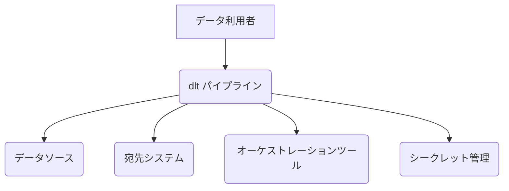
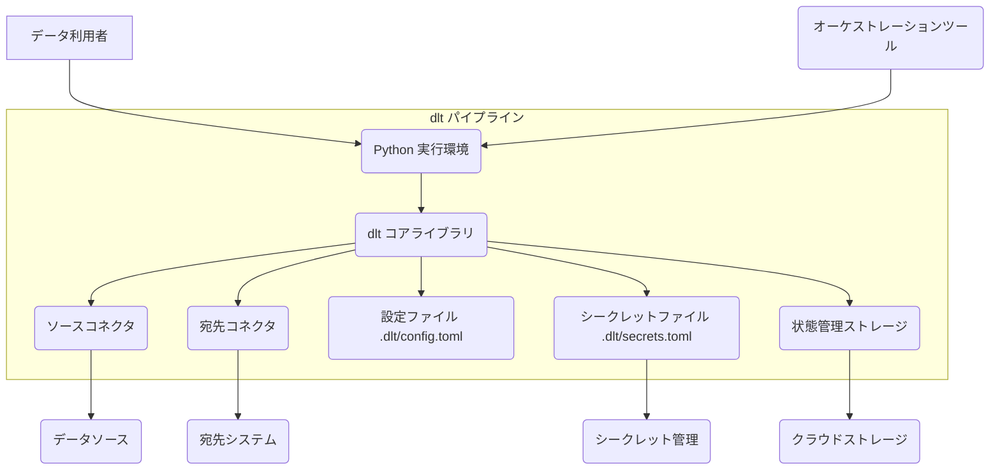
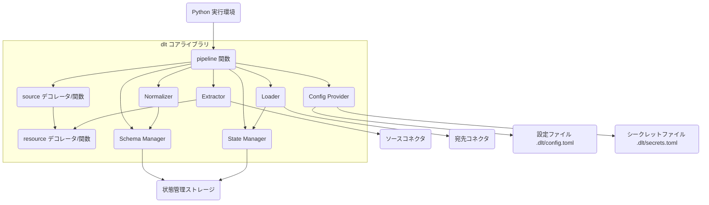
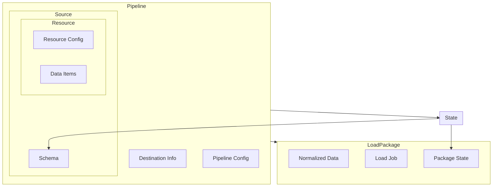
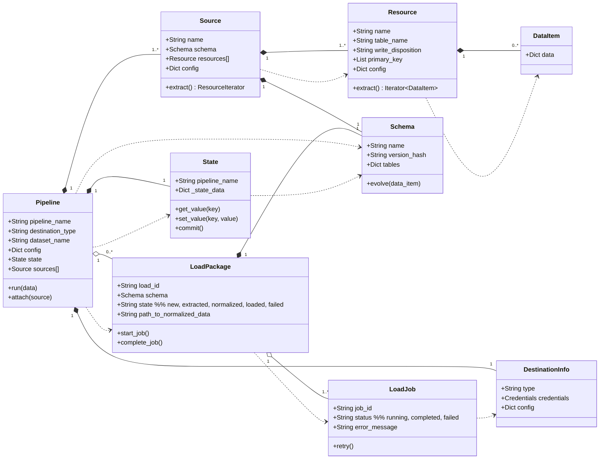

## ■概要

dlt (data load tool) は、Pythonでデータパイプラインを簡単に構築、実行、保守するためのオープンソースライブラリです。
構造化、非構造化データを問わず、様々なソースからデータを抽出し、スキーマの推論や進化を自動で行いながら、データウェアハウスやレイクなどの宛先にロードすることを主な目的としています。
開発者の生産性を高め、複雑なETL/ELT処理の実装を簡略化することに重点を置いています。

## ■構造

C4 modelを用いてdltの構造を図解します。

### ●システムコンテキスト図



| 要素名                 | 説明                                                                 |
| :--------------------- | :------------------------------------------------------------------- |
| データ利用者           | データパイプラインを定義、実行、監視するユーザー（開発者、アナリストなど） |
| dlt パイプライン       | dltライブラリを使用して構築・実行されるデータ処理システム              |
| データソース           | データの抽出元となるシステム（API, データベース, ファイルなど）          |
| 宛先システム           | 処理されたデータの格納先（データウェアハウス, データレイクなど）           |
| オーケストレーションツール | パイプラインのスケジュール実行や依存関係を管理する外部ツール (任意)    |
| シークレット管理       | APIキーやデータベース認証情報などを安全に管理する外部システム (任意)   |

### ●コンテナ図



| 要素名                 | 説明                                                                                              |
| :--------------------- | :------------------------------------------------------------------------------------------------ |
| データ利用者           | Pythonスクリプトを通じて`dlt パイプライン`を操作するユーザー                                          |
| Python 実行環境      | dltパイプラインのPythonコードが実行される環境                                                       |
| dlt コアライブラリ     | データ抽出、正規化、ロード、スキーマ管理、状態管理など、dltの主要機能を提供するライブラリ             |
| ソースコネクタ         | 特定のデータソースからデータを抽出するためのコンポーネント群                                          |
| 宛先コネクタ           | 特定の宛先システムへデータをロードするためのコンポーネント群                                          |
| 設定ファイル           | パイプラインの挙動、宛先情報などを定義するTOMLファイル                                              |
| シークレットファイル   | APIキーやパスワードなどの機密情報を格納するTOMLファイル                                             |
| 状態管理ストレージ     | パイプラインの実行状態（最後に処理したデータなど）を永続化する場所（ローカルファイルまたはクラウドストレージ） |
| データソース           | データの供給元                                                                                    |
| 宛先システム           | データの格納先                                                                                    |
| クラウドストレージ     | 状態管理ストレージの保存先として利用される外部ストレージ (任意、S3, GCS, Azure Blob Storageなど)   |
| シークレット管理       | シークレットファイルの代わりに機密情報を管理する外部システム (任意)                                 |
| オーケストレーションツール | Python実行環境をトリガーしてパイプラインを実行する外部ツール (任意)                               |

### ●コンポーネント図

ここでは `dlt コアライブラリ` の内部コンポーネントをドリルダウンします。



| 要素名                   | 説明                                                                                                |
| :----------------------- | :-------------------------------------------------------------------------------------------------- |
| pipeline 関数            | データパイプライン全体を定義・設定し、実行フローを管理するエントリーポイント (`dlt.pipeline(...)`)         |
| source デコレータ/関数   | データソース全体を定義し、複数のリソースをグループ化する (`@dlt.source`, `dlt.source(...)`)             |
| resource デコレータ/関数 | 個別のデータ抽出ロジック（APIエンドポイント、DBクエリなど）を定義する (`@dlt.resource`, `dlt.resource(...)`) |
| Extractor                | `source`と`resource`からデータを抽出し、イテレータとして`Normalizer`に渡すコンポーネント                  |
| Normalizer               | 抽出されたデータを正規化し、ロードに適した形式（JSONLファイルなど）に変換し、スキーマを推論・進化させる |
| Loader                   | 正規化されたデータを宛先システムにロードするコンポーネント                                                |
| Schema Manager           | データスキーマの定義、推論、進化、永続化を管理する                                                  |
| State Manager            | パイプラインの実行状態（差分ロードのための情報など）を管理・永続化する                                |
| Config Provider          | 設定ファイルや環境変数、シークレットファイルから設定値や機密情報を読み込む                            |
| ソースコネクタ           | `Extractor`が利用する、特定のデータソースAPIやプロトコルと通信するモジュール                          |
| 宛先コネクタ             | `Loader`が利用する、特定の宛先システムへデータを書き込むモジュール                                    |
| 状態管理ストレージ       | `Schema Manager`と`State Manager`がスキーマ情報や状態を保存する場所                                   |
| 設定ファイル             | `Config Provider`が読み込む設定情報                                                               |
| シークレットファイル     | `Config Provider`が読み込む機密情報                                                               |
| Python 実行環境        | これらのコンポーネントを含むPythonコードを実行する環境                                                |

## ■情報

dltが内部で扱う主要なデータ（情報）とその関係性をモデル化します。

### ●概念モデル



### ●情報モデル



| クラス名         | 説明                                                                                                                               |
| :--------------- | :--------------------------------------------------------------------------------------------------------------------------------- |
| Pipeline         | パイプライン定義。名前、宛先情報、データセット名、設定、状態、関連ソースを持つ。`run`メソッドで実行。                                         |
| Source           | データソース定義。名前、スキーマ、リソースリスト、設定を持つ。リソースからデータを抽出するイテレータを返す。                                   |
| Resource         | データリソース定義。名前、ターゲットテーブル名、書き込みモード、主キー、設定を持つ。個々のデータ項目を抽出するイテレータを返す。                   |
| DataItem         | 抽出された単一のデータレコード。通常は辞書型。                                                                                       |
| Schema           | データ構造定義。名前、バージョンハッシュ、テーブル定義（カラム、型など）を持つ。データに基づいて進化(`evolve`)できる。                             |
| State            | パイプラインの実行状態。キーバリュー形式で状態を保持し、永続化(`commit`)する。差分ロードなどに利用。                                     |
| DestinationInfo  | 宛先システムのタイプ、認証情報、設定を保持する。                                                                                   |
| LoadPackage      | ロード単位となるデータのパッケージ。ロードID、使用スキーマ、状態（新規、抽出済、正規化済、ロード済、失敗）、正規化データパスを持つ。               |
| LoadJob          | 宛先システムへの具体的なロード処理。ジョブID、ステータス、エラーメッセージを持つ。リトライ機能を持つ場合がある。                               |

## ■構築方法

### ●インストール

* pipを使用してdltライブラリをインストールします。
    ```bash
    pip install dlt
    ```
* 特定の宛先やユーティリティを使用する場合は、追加の依存関係とともにインストールします。
    ```bash
    # 例: DuckDBとPandasを使用する場合
    pip install dlt[duckdb, pandas]
    ```

### ●初期化

* プロジェクトディレクトリで`dlt init`コマンドを実行し、パイプラインのテンプレートと設定ファイルの雛形を生成します。
    ```bash
    dlt init <source_name> <destination_name>
    ```
    * `<source_name>`: データソースに応じたテンプレート名 (例: `github`, `chess`)
    * `<destination_name>`: データロード先の名前 (例: `duckdb`, `bigquery`, `postgres`)
* これにより、Pythonスクリプト (`<source_name>_pipeline.py`) と設定ディレクトリ (`.dlt`) が作成されます。

### ●設定

* `.dlt/config.toml`ファイルに必要な設定（パイプライン名、データセット名など）を記述します。
* APIキーやデータベースパスワードなどの機密情報は`.dlt/secrets.toml`ファイルに記述します。このファイルはバージョン管理システム (Gitなど) に含めないように注意が必要です。
* 環境変数や、サポートされている場合は外部のシークレットマネージャーを利用して設定することも可能です。

## ■利用方法

### ●パイプラインの定義

* `dlt init`で生成された、または新規に作成したPythonスクリプト内でパイプラインを定義します。
* `dlt.pipeline()`関数を使用してパイプラインオブジェクトを作成し、宛先、データセット名などを指定します。

```python
import dlt

pipeline = dlt.pipeline(
    pipeline_name='my_api_data',
    destination='duckdb', # 例: DuckDBを宛先にする
    dataset_name='api_raw_data'
)
```

### ●データソースとリソースの定義

* `@dlt.source`デコレータまたは`dlt.source()`関数でデータソースを定義します。ソース関数は通常、1つ以上のリソース関数をyieldします。
* `@dlt.resource`デコレータまたは`dlt.resource()`関数で個別のデータリソース（APIエンドポイント、DBクエリ結果など）を定義します。リソース関数はデータ項目をyieldするジェネレータとして実装します。
* リソースにはテーブル名や書き込み方法 (`write_disposition`) などを指定できます。dltがスキーマを自動で推論します。

```python
import dlt
import requests # requestsライブラリのインポートを追加

@dlt.resource(table_name='users', write_disposition='replace')
def get_users():
    # APIエンドポイントの例（実際のエンドポイントに置き換えてください）
    url = '[https://jsonplaceholder.typicode.com/users](https://jsonplaceholder.typicode.com/users)'
    try:
        response = requests.get(url)
        # ステータスコードが200番台でない場合に例外を発生させる
        response.raise_for_status()
        # JSONデータをyieldする
        yield response.json()
    except requests.exceptions.RequestException as e:
        # エラーハンドリング（例: ログ出力）
        print(f"API request failed: {e}")
        # 必要に応じて空のリストをyieldするか、例外を再送出する
        # yield []
        # raise

@dlt.source
def api_source():
    # get_usersリソースを返す
    return get_users()

# --- パイプラインの実行部分 ---
if __name__ == "__main__":
    # パイプラインを定義
    pipeline = dlt.pipeline(
        pipeline_name='example_api_pipeline',
        destination='duckdb', # 宛先を指定 (例: duckdb)
        dataset_name='api_data' # データセット名を指定
    )

    # ソースからデータを抽出し、パイプラインを実行
    print("Running pipeline...")
    load_info = pipeline.run(api_source())

    # ロード結果の情報を表示
    print(load_info)
    print("Pipeline finished.")

```

### ●パイプラインの実行

* 定義したソース関数（またはソースオブジェクト）をパイプラインオブジェクトの`run`メソッドに渡して実行します。

```python
if __name__ == "__main__":
    # (pipelineとapi_sourceの定義は上記参照)

    # ソースからデータを抽出し、パイプラインを実行
    load_info = pipeline.run(api_source())
    # ロード結果を表示
    print(load_info)
```

* Pythonスクリプトを実行すると、データソースからデータが抽出され、正規化、ロードが自動的に行われます。

### ●スキーマの管理

* dltは初回実行時にデータからスキーマを推論し、`.dlt/schemas`ディレクトリに保存します。
* データ構造に変更があった場合、dltは自動的にスキーマを進化させ、宛先テーブル構造を更新しようと試みます（宛先が対応している場合）。
* スキーマを手動で編集・調整することも可能です。

### ●差分ロード

* `dlt.resource`で`primary_key`を指定したり、状態管理を利用することで、差分ロード（増分ロード）を簡単に実装できます。dltはパイプラインの状態を記録し、前回の実行以降に追加・変更されたデータのみを処理します。

## ■運用

### ●デプロイメント

* 作成したdltパイプラインのPythonスクリプトは、様々な方法でデプロイ・実行できます。
    * **手動実行:** ローカルマシンやサーバー上で直接Pythonスクリプトを実行します。
    * **Docker:** パイプラインをDockerコンテナ化して、移植性と再現性を高めます。
    * **サーバーレス関数:** AWS Lambda, Google Cloud Functions, Azure Functionsなどのサーバーレス環境で実行します。
    * **オーケストレーションツール:** Airflow, Dagster, Prefect, Mageなどのワークフローオーケストレータに組み込み、スケジュール実行や依存関係管理を行います。dltはこれらのツールとの連携を容易にする機能を提供しています。

### ●モニタリング

* **ログ:** dltは実行中に詳細なログを出力します。ログレベルを設定し、ファイルや標準出力、監視システムに送信できます。
* **実行情報:** `pipeline.run()`メソッドは`LoadInfo`オブジェクトを返します。これには、ロードされたパッケージの情報、ジョブの状態、エラーメッセージなどが含まれており、実行結果の確認やアラートに利用できます。
* **トレースとメトリクス:** OpenTelemetryなどの標準的な監視ツールと連携し、パイプラインのパフォーマンスや状態に関するメトリクス、トレース情報を収集できます（設定が必要な場合があります）。
* **dlt Cloud:** (オプション) dltの提供するクラウドサービスを利用すると、パイプラインのデプロイ、監視、アラート設定、状態管理などをより簡単に行えます。

### ●状態管理

* パイプラインの実行状態（差分ロードのための情報など）はデフォルトでローカルの`.dlt/state`ディレクトリに保存されます。
* 本番環境や複数環境での実行には、状態を共有・永続化するためにクラウドストレージ（S3, GCS, Azure Blob Storageなど）を利用することが推奨されます。これは`dlt.pipeline()`の`pipeline_salt`や設定ファイルで構成します。

### ●エラーハンドリングと再試行

* dltはネットワークエラーなど、一時的な問題に対する再試行ロジックを内部に持っています。
* `LoadInfo`オブジェクトやログを通じてエラーの詳細を確認し、パイプラインコードや設定を修正します。
* オーケストレーションツールを利用している場合は、そのツールの再試行機能やエラー通知機能も活用できます。

## ■参考リンク

- ●概要
  - [What is dlt? | dlt Docs](https://dlthub.com/docs/intro)
- ●構造
  - [Running in production | dlt Docs](https://dlthub.com/docs/running-in-production/running) (オーケストレーションツール連携など)
  - [Credentials | dlt Docs](https://dlthub.com/docs/general-usage/credentials/configuration) (設定、シークレット)
- ●情報
  - [Resource | dlt Docs](https://dlthub.com/docs/general-usage/resource) (Resource, DataItem)
  - [Source | dlt Docs](https://dlthub.com/docs/general-usage/source) (Source)
  - [Pipeline | dlt Docs](https://dlthub.com/docs/general-usage/pipeline) (Pipeline)
  - [Schema | dlt Docs](https://dlthub.com/docs/general-usage/schema) (Schema)
  - [Destinations | dlt Docs](https://dlthub.com/docs/dlt-ecosystem/destinations/) (DestinationInfo)
- ●構築方法
  - [Getting started | dlt Docs](https://dlthub.com/docs/getting-started) (インストール、初期化)
  - [Credentials | dlt Docs](https://dlthub.com/docs/general-usage/credentials/configuration) (設定)
- ●利用方法
  - [Getting started | dlt Docs](https://dlthub.com/docs/getting-started) (パイプライン定義・実行の基本)
  - [Pipeline | dlt Docs](https://dlthub.com/docs/general-usage/pipeline) (パイプライン実行)
  - [Source | dlt Docs](https://dlthub.com/docs/general-usage/source) (ソース定義)
  - [Resource | dlt Docs](https://dlthub.com/docs/general-usage/resource) (リソース定義、差分ロード)
  - [Schema | dlt Docs](https://dlthub.com/docs/general-usage/schema) (スキーマ管理)
- ●運用
  - [Running in production | dlt Docs](https://dlthub.com/docs/running-in-production/running) (デプロイメント、オーケストレーション)


この記事でなにか得られることがあったら、SNSでシェアしていただけると励みになります。
