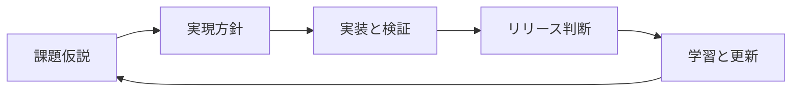

AI 駆動開発では、実装する速度だけを速くしても開発全体は速くなりません。

実装・調査・転記が短くなるほど、誰が何を決め、どの条件で利用者に出すのかという判断が、かえって目立つ制約になります。そこで必要になるのが、コードの設計だけでなく、開発プロセスそのものを事業の文脈から設計することです。

この記事では、これを「ドメイン駆動開発プロセス」と呼びます。目的は、AI に委ねる作業と、人間が引き受ける判断を切り分けることです。

## 実装の高速化で、ボトルネックは消えない

AI は実装の試作、既存コードの探索、テストの下書き、記録の整形を速くします。一方で、次の問いには自動的な正解がありません。

- この変更は、いま顧客へ出すべきか
- 失敗時の影響を受け入れられるか
- どの例外を誰が判断するか
- どの情報を残せば、次の担当者が再開できるか

これらは組織の責任分担と利用者への影響で決まります。AI が実装できることと、組織が採用すべきプロセスは別の問題です。

マナリンクの実践記事は、AI 時代の開発プロセスを「誰が、いつ、何を決め、何に責任を持ち、いつ本番リリースできるようになるか」と捉え直しています。ここで重要なのは、既存の会議をそのまま自動化することではありません。自社で暗黙に機能していた判断の流れを、先に言語化することです。

## タスクの列ではなく、状態遷移を設計する

チケットを `To Do`、`In Progress`、`Done` に並べるだけでは、判断がどこで必要なのか見えません。AI エージェントが並行して動くなら、なおさら現在地を機械的に復元できる状態が必要です。

まず、施策の流れを状態と遷移条件に分けます。

各状態に「責任者」「入力」「完了条件」「記録先」「差し戻し先」を置きます。例えば実装完了からリリース判断へ進む条件は、テストが通ることだけではありません。利用者への影響、監視の準備、ロールバック方法、承認者を確認して初めて遷移できます。

この形にすると、AI ができることは明確です。状態の間にある、情報収集、差分確認、テスト、記録更新、通知は自動化できます。一方で状態を進める判断は、責任を持つ人が行います。

## ドメインに合わせて判断点を置く

DDD の Bounded Context は、モデルを一貫して使える境界を明示する考え方です。開発プロセスにも、同じ発想が役立ちます。

どの変更を試験公開できるか、どこで二者承認が必要か、どの失敗を即時ロールバックするかは、技術スタックだけでは決まりません。顧客への影響、規制、回復可能性、組織の意思決定構造で変わります。

たとえば、可逆で観測しやすい画面改善なら、仮説から計測までを短くしてよいでしょう。反対に、利用者の学習や業務を途中で混乱させる機能なら、安易な比較実験より、事前の判断と復旧条件を厚くする方が合理的です。

AI が使えるから新しい手法を採用するのではなく、自社のドメインに合うから採用する。この順番を守ると、速度と統制を対立させずに済みます。

## 自動化の境界を決める四つの質問

ある遷移を自動化する前に、次の四つを確認します。

1. ここで新しい価値判断をしているか
2. 失敗した場合、誰が説明責任を負うか
3. 判断を再現するために何を記録するか
4. 答えが一意に定まるか

最初の三つに人の判断が残るなら、AI は意思決定者ではなく、判断材料と記録を整える実行者として配置します。四つ目が明確なら、Skill やワークフローにして自動化できます。

| 区間 | 人間が担うこと | AI が担うこと |
| --- | --- | --- |
| 課題仮説 | 優先度と非対象の決定 | 類似事例・既存仕様の収集 |
| 実現方針 | 制約と採否理由の決定 | 影響範囲の探索、案の比較 |
| 実装と検証 | 受入条件の解釈 | 実装、テスト、差分説明 |
| リリース判断 | リスク受容と責任 | 監視確認、通知、記録更新 |

## 最初は一施策だけを図にする

プロセスを全社で作り直す必要はありません。直近で終えた一施策について、実際に通った状態を時系列で書き出します。

途中で「この人に聞かないと進まなかった」場面は、重要な判断ノードです。その間にあった調査、転記、テスト、通知は自動化候補になります。この区別ができると、AI 導入で失われやすい責任の所在を残したまま、待ち時間を減らせます。

成果は、生成コード量で測らない方がよいでしょう。判断待ち時間、差し戻し回数、リリース後の修正頻度を追うと、プロセス設計が本当に効いているかを確認できます。

## まとめ

AI 駆動開発で再設計すべきなのは、実装手順だけではありません。事業ドメインに合わせて判断の状態遷移を定義し、その間を AI が安全に運べる形にすることが重要です。

まずは一施策の判断点を可視化し、人が決める場所と自動化できる場所を分けてみてください。そこから始めると、速度を上げながら責任の境界も明確にできます。

## 参考リンク

- [ドメイン駆動設計から、ドメイン駆動開発プロセスの時代へ](https://zenn.dev/manalink_dev/articles/domain-driven-development-process)
- [Bounded Context, Martin Fowler](https://martinfowler.com/bliki/BoundedContext.html)
- [Effective Aggregate Design, Vaughn Vernon](https://www.dddcommunity.org/library/vernon_2011/)
