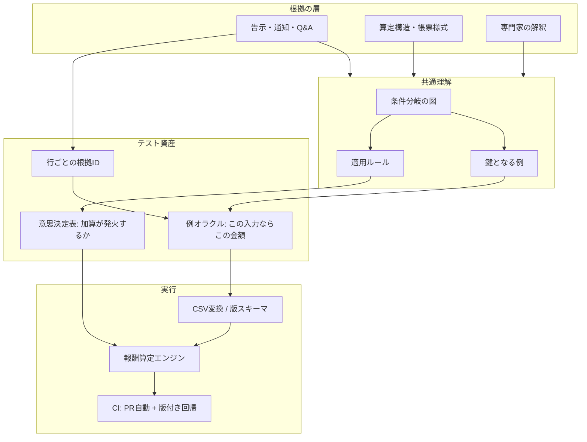

介護報酬や保険料のように、法令と例外が積み重なった金額計算をシステム化すると、「この出力が正しいかどうかをエンジニアだけでは判定できない」という壁に必ずぶつかります。仕様書の日本語をいくら読み込んでも、加算の排他や経過措置の交差までは追い切れないからです。

この記事では、こうした制度依存の暗黙知を **判定可能なテスト資産に変える設計** を扱います。読み終えると、次の3点を持ち帰れます。

- 専門家が書いた「入力→期待金額」の表が、どこまでを保証してどこからを保証しないのか
- それが **意思決定表とは別物** であること、両方を持つべき理由
- レガシー再実装で「誤った緑（間違った期待値のまま通るテスト）」を固定しないための分け方

対象読者は、規制・制度に依存する計算ロジックを再実装している開発者、およびその品質保証に関わるQA・PdMです。

*この記事の全体像。以下、順に解説します。*

## 何を資産化しようとしているのか

この領域の難しさは、テストの書き方ではなく **オラクル（期待値の出どころ）** にあります。

| 判断したいこと | 期待値を誰が出せるか |
|---|---|
| この入力なら 6,250 円になるか | 制度に詳しい専門家 |
| この加算は発火してよいか | 告示・通知・Q&Aの条文 |
| 移行後も現行と同じ挙動か | 現行システムの観測結果 |

3つは出どころが違うのに、実装上はすべて「テストが緑になる／ならない」に潰れます。ここを混ぜたまま資産化すると、**法令として誤っているのに現行と一致しているから緑**、という状態を新エンジンに焼き付けてしまいます。

エス・エム・エスのエンジニアブログ「[複雑なドメインの知識をテストケースとして資産化する](https://tech.bm-sms.co.jp/entry/2026/08/20/110000)」（2026-08-20）は、この課題に対する実践例として読めます。以降ではこの実践を出発点に、足りない層を補う設計を組み立てます。

## 起点となった実践の中身

公開されている情報から、実践の骨格は次のように整理できます。

| 項目 | 内容 | 読み取るときの注意 |
|---|---|---|
| 入口 | QAがGoogleスプレッドシートでケースを書く | エンジニアにコードで書かせないことが意図 |
| 列の手本 | サービス提供票別表、様式2 | 入力のわかりやすさ。条項へのトレースではない |
| テストの種類 | 入力から出力までの結合テスト（算定結果のテスト） | 単体テストは別途重要と明記されている |
| 実行経路 | シートをCSV化してGitへコミットし、GitHub Actionsで実行 | 公開されているトリガは `workflow_dispatch`（手動）。PR自動実行の有無は記載なし |
| 過去分 | 改定前ルールのケースを残す | 過去サービス分を旧ルールで計算する運用制約に対応 |
| 効果 | 小さな検知の積み重ね。「派手な障害を防いだエピソードはない」と著者自身が記述 | 件数・カバレッジなどの定量値は公開されていない |
| 既知の難所 | 旧形式ケースを吸収する変換分岐が煩雑になる | 資産量に比例して変換層が肥大する構造 |

前編にあたる「[リニューアルに向けた複雑な介護報酬算定の再実装](https://tech.bm-sms.co.jp/entry/2023/03/07/120000)」（2023-03-07）の時点で、専門家によるテストケース作成と実行自動化には触れられています。2026年の記事は、その入口をQAが扱える様式に寄せ、CIまでつないだ運用の話です。

重要なのは、**エンジニア・QA・POが制度を図に起こして共通理解をつくってから、実装とケース作成に分岐する** という順序です。これは実例マッピング（Example Mapping）や三アミーゴスと同じ形をしています。

## それは意思決定表ではない

この手法を「意思決定表（デシジョンテーブル）」と呼びたくなりますが、実体は違います。ISTQBのFoundation Level シラバス v4.0.1 §4.2.3 が定義する意思決定表と並べると、役割の差がはっきりします。

| | 意思決定表 | 例ベースの算定結果テスト |
|---|---|---|
| 1行が表すもの | 条件の組み合わせ → アクション | 1ケースの入力と期待出力 |
| 完全性 | 実行可能な組み合わせを系統的に列挙できる | 書いた行だけ |
| 典型的なセル | T/F と発火マーク | 単位数・円 |
| 欠落の見つけ方 | 空の規則・矛盾した規則として現れる | 人が思いつくかどうか |
| 近い系譜 | DMN、原因結果グラフ | Fitの表、Specification by Example の鍵例 |

意思決定表の強みは、条件が増えると規則数が指数的に増えることを逆手に取り、**列挙の穴と矛盾を機械的に可視化できる**点にあります。シラバスは完全表だけを本義とはせず、最小化表やリスクベースでの縮小も認めますが、縮小した分の欠落は別手段で補う前提です。

一方、例ベースの表は「この入力ならこの円」という具体ケースの集合です。Gojko Adzic は Specification by Example の10年振り返りで、**全組み合わせを例に書こうとすることを失敗モード**として挙げています。鍵例はコミュニケーションのための道具であり、網羅テストの代替ではありません。

紛らわしいのは、FitNesse に「Decision Table」という名前のテーブル形式がある点です。こちらは例の行を並べる仕組みで、ISTQBの言う完全表とは別物です。チーム内で用語を揃えるときは、この2つを必ず区別してください。

## 業務オラクルの型を分ける

期待値の出どころで整理すると、選べる型は5つあります。規制計算では「過去の振る舞い」と「法令」が衝突するため、どの型を使っているかのラベルが不可欠です。

| 型 | 期待値の出所 | 向く仕事 | 壊れる条件 |
|---|---|---|---|
| 例ベース I/O | 専門家が様式に書いた結果 | 再実装中の外側の足場、頻出パターン | 書いていない交差、誤った金額の固定 |
| 意思決定表 | 条件→アクションの仕様 | 加算の適用可否、排他、減算の発火 | 金額そのものは表現しにくい。列爆発 |
| Characterization / Golden Master | 現行エンジンの観測結果 | 仕様がないレガシーの「今と同じ」保証 | バグ互換を仕様に昇格させる |
| Approval / snapshot | 人間が承認した出力ファイル | 複雑な帳票ダンプ | 差分を読まずに再承認する |
| DMN / 規則エンジン | 実行可能な規則表 | 条項まで辿りたい金額計算 | 導入コスト。表が実質コード化する |

レガシー移行では、次の3つを別のスイートとして持つのが安全です。

1. **移行中の「今と同じ」** は Characterization として明示ラベルを付ける
2. **制度として正しい金額** は専門家の例 + 告示IDで担保し、現行一致と混同しない
3. **規則の穴** は意思決定表（または原因結果グラフ）で検出し、例シートで代用しない

## 例オラクルだけに寄せると何が起きるか

例ベースの表を主資産にしたときの劣化パターンは、いくつも先行事例があります。

- **改定時に落ちた理由が判別できない。** 行に法令根拠が無いと、「実装が壊れた」のか「制度が変わって期待値が古くなった」のかを行だけでは区別できません。様式に似せることは入力のわかりやすさであって、条文へのトレーサビリティではありません。
- **稀な交差が緑のまま残る。** 経過措置 × 公費 × 加算排他のような組み合わせは、誰も思いつかなければ1行も存在しません。NISTの相互作用テスト研究は、2-way の組み合わせでも取りこぼす高次の故障があることを示しています。
- **表そのものが誤る。** Raymond R. Panko の "What We Don't Know About Spreadsheet Errors Today"（[arXiv:1602.02601](https://arxiv.org/abs/1602.02601), EuSpRIG 2015）は、実験14件・967人でセル誤り率が平均3.9%、実地監査した85シートのうち94%に誤りがあったと整理しています。個々のセル誤りが稀でも、シートが大きくなれば最終値のどこかが誤る確率は上がり、しかも作成者はその正しさを過信します。Reinhart–Rogoff の Excel 範囲指定ミスは、表計算を正本にしたときのサイレントな欠損が公開の場に出た事例です。
- **CIが誤った期待値を再生産する。** Barr らのオラクル問題が指摘するとおり、現行一致をそのまま期待値にすると Characterization に劣化し、レガシーの解釈バグを新エンジンが固定します。
- **QA単独所有だと腐る。** キーパーソンが離れた瞬間に表が凍結する失敗は、受け入れテスト自動化の定番カタログにあります。
- **過去分の無制限保持が死重になる。** 変換分岐が永続し、失敗シグナルが希釈され、正当な改修まで阻害します。いつ捨てるか（sunset）を決めていないと、この重さは単調増加します。
- **実行が手動のままだと回帰にならない。** 公開されているトリガが `workflow_dispatch` である以上、それは「QAが新ケースを投入するゲート」であって、エンジン変更に対する連続回帰とは読み替えられません。

つまり、「例ベースのテストをやれ」は成立しますが、「それだけで制度知識の資産化が完了する」は成立しません。

## 設計として採用する組み合わせ

判定可能性を保ったまま資産化するなら、層を分けたうえで役割を固定します。次の図はこの記事が推奨する構成であり、特定企業の現状を描いたものではありません。

要点は3つです。帳票に寄せたシートは **例** を運ぶ。法令の欠落検出は **意思決定表と根拠ID** が担う。そして **変換層を正本にしない**。

具体的な採用ルールは次のとおりです。

1. **例オラクルは「外側の足場」に限定する。** 頻出する請求パターンと境界の鍵例だけを置き、全組み合わせを詰め込んだ巨大シートにしない。
2. **加算の発火は意思決定表（またはDMN）として別に持つ。** 金額は例、可否は規則、と持ち場を分ける。
3. **各例行に根拠を必須化する。** 告示・通知・Q&A・事務連絡のID、適用する制度年度、そして History（現行一致）か Statutes（法令計算）かのラベルを列にする。
4. **正本はGit上の版付き表にする。** スプレッドシートは編集UXとして使い、スキーマ自体をバージョン管理して変換分岐の無限増殖を止める。欠測列のデフォルトは業務ルールとしてテスト対象にする。
5. **エンジン変更の回帰はPRで自動実行する。** 手動トリガはQAが新ケースを投入するゲートとして残してよいが、それを回帰の本線にはしない。
6. **過去分は sunset 付きの版オラクルにする。** 請求可能な期間が終わった年度は別スイートへ隔離するか削除する。
7. **現行一致と法令一致を混ぜない。** 再実装の第一段階だけ Characterization を使い、残す行には「現行由来」と明記する。

### 制度年度を必ず持つ理由

例オラクルに年度を持たせない設計は、それだけで誤伝播の温床になります。訪問介護・身体介護の「20分以上30分未満」を例に取ると、2023年時点の解説では250単位として計算例が組まれています。

- 250単位 × 2人訪問（200/100）= 500単位
- 早朝加算（+25/100）= 625単位
- 地域単価10円 → 6,250円
- 1割負担なら保険給付 5,625円 / 利用者負担 625円

一方、厚生労働省の[介護報酬の算定構造](https://www.mhlw.go.jp/content/001675193.pdf)（令和8年6月改定箇所を示す資料）では、同じ区分が244単位です。**単位数は年度で変わります。** 年度ラベルのない行は、改定のたびに「壊れたのか、古いのか」が判別できなくなります。

改定のリズムも単純ではありません。介護保険の大きな見直しはおおむね3年周期ですが、[令和8年度介護報酬改定について](https://www.mhlw.go.jp/stf/seisakunitsuite/bunya/0000188411_00073.html)のように、本体の3年周期以外にも告示改正や様式の差し替えが挟まります。「3年に一度だけ対応すればよい」という前提でスキーマを組むと、その前提のほうが先に壊れます。

なお、令和3年改定では確定版の事務連絡が 2021-03-31 に出て、4月提供分の請求が翌月1〜10日である以上、計算機能は4月末までに仕上げる必要がありました。**改定内容の確定から本番投入までの窓は極端に短い**という前提も、テスト資産の設計に効いてきます。手で全ケースを再検証する余地は最初からありません。

## 導入の最初の4手

すでに暗黙知がドキュメントや個人の頭に散っている状態からなら、次の順で始められます。

1. **暗黙知メモを鍵例の行に落とす。** 1行 = 入力・期待値・根拠ID・制度年度。文章のまま保存しない。
2. **加算の適用可否だけを意思決定表1枚に切り出す。** ここには金額を書かない。
3. **CIを「PR自動の回帰」と「QA手動投入のゲート」に分ける。** 同じワークフローに混ぜない。
4. **変換層のデフォルト挙動を列挙してテスト対象にする。** 欠測列を何とみなすかは実装詳細ではなく業務ルールです。

## この設計を採らないほうがよい場合

逆転条件も明確です。

- **規則が少なく金額計算が自明** → 意思決定表だけで足り、例シートは過剰
- **仕様書が存在せず現行実装が事実上の契約** → Characterization を主にし、法令からの再計算は別プロジェクトに切る
- **監査が条項単位のトレースを要求する** → 例シートを主資産にしない。DMN / 規則エンジン側に寄せる

規制金額計算では、散在したスプレッドシートを監査不能と判断してDMNへ移した事例も報告されています（ベンダー記事による二次情報）。「例シートが常に最適」ではありません。

## 判断を弱める未確定事項

公開情報だけでは確認できず、確信度を下げる要素も明示しておきます。

- テスト行数、落ちた回数、回避できた本番障害の件数は公開されていません。効果サイズは不明です。
- シートの各行に告示・Q&AのIDが付いているかは確認できません。この記事では「無い」前提でギャップとして扱っています。
- 単体テストと算定結果テストの本数比、過去分を何年分保持するか（請求権の時効との対応）も記載がありません。

これらは上記の推奨をブロックするものではありませんが、「実績のある構成」ではなく「公開情報から組み立てた設計」として受け取ってください。

## まとめ

- 制度依存の金額計算では、テストの書き方より **オラクルの出どころ** の設計が効きます。
- 専門家が書く「入力→期待金額」の例は、再実装の **外側の足場** として有効ですが、意思決定表の代替にはなりません。書いた行しか守れないからです。
- 金額は例オラクル、加算の可否は意思決定表、法令根拠は行ごとの根拠ID、過去分は sunset 付きの版オラクル。この4層に分けると、誤った緑を固定せずに暗黙知を判定可能にできます。
- 例行には **制度年度と、History / Statutes のラベル** を必ず持たせます。単位数は年度で変わり、改定は3年周期だけではありません。
- 実行経路は「PR自動の回帰」と「手動投入のゲート」に分けます。手動トリガだけでは回帰になりません。

この記事が少しでも参考になった、あるいは改善点などがあれば、ぜひリアクションやコメント、SNSでのシェアをいただけると励みになります！

## 参考リンク

- 宮坂「[複雑なドメインの知識をテストケースとして資産化する](https://tech.bm-sms.co.jp/entry/2026/08/20/110000)」エス・エム・エス エンジニアテックブログ, 2026-08-20
- 宮坂「[リニューアルに向けた複雑な介護報酬算定の再実装](https://tech.bm-sms.co.jp/entry/2023/03/07/120000)」2023-03-07
- 菅井俊介「[BtoB SaaS における業務ルールの大規模な変更にビジネスサイドと共に立ち向かう](https://tech.bm-sms.co.jp/entry/2021/10/14/120000)」2021-10-14
- 宗「[報酬計算をモデリングして自然なコードに落とし込む](https://tech.bm-sms.co.jp/entry/2024/02/27/110000)」2024-02-27
- 北村「[カイポケリニューアルの品質保証の取り組みについて](https://tech.bm-sms.co.jp/entry/2024/08/20/110000)」2024-08-20
- 厚生労働省「[令和８年度介護報酬改定について](https://www.mhlw.go.jp/stf/seisakunitsuite/bunya/0000188411_00073.html)」
- 厚生労働省「[介護報酬の算定構造](https://www.mhlw.go.jp/content/001675193.pdf)」（令和８年６月改定箇所）
- Martin Fowler, "[Specification By Example](https://martinfowler.com/bliki/SpecificationByExample.html)", 2004-03-18
- Gojko Adzic, "[Specification by Example, 10 years later](https://gojko.net/2020/03/17/sbe-10-years.html)", 2020-03-17
- Matt Wynne, "[Introducing Example Mapping](https://cucumber.io/blog/bdd/example-mapping-introduction/)", 2015-12-08
- FitNesse, "[SLIM Decision Table](https://fitnesse.org/FitNesse/UserGuide/WritingAcceptanceTests/SliM/DecisionTable.html)"
- Michael Bolton, "[Testing Without a Map](https://www.developsense.com/articles/2005-01-TestingWithoutAMap.pdf)", Better Software, 2005-01
- "[Characterization test](https://en.wikipedia.org/wiki/Characterization_test)", Wikipedia
- Raymond R. Panko, "[What We Don't Know About Spreadsheet Errors Today](https://arxiv.org/abs/1602.02601)", arXiv:1602.02601, EuSpRIG 2015
- Earl T. Barr et al., "The Oracle Problem in Software Testing: A Survey", IEEE TSE 41(5), 2015
- ISTQB, Certified Tester Foundation Level Syllabus v4.0.1, 2024-09-15, §4.2.3 Decision Table Testing
- D. Richard Kuhn et al., NIST combinatorial / interaction testing papers
- GitHub Docs, "[Events that trigger workflows (`workflow_dispatch`)](https://docs.github.com/en/actions/using-workflows/events-that-trigger-workflows#workflow_dispatch)"
- Herndon, Ash, Pollin, "Does High Public Debt Consistently Stifle Economic Growth?", 2013
