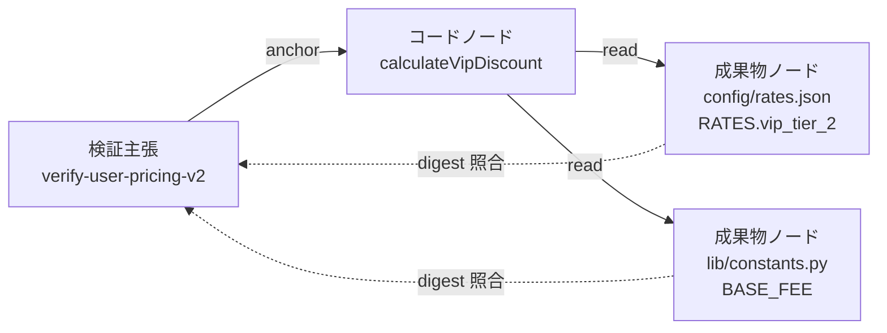
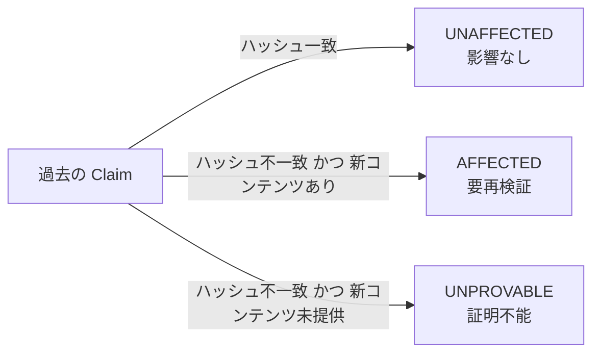

コーディングエージェントを複数セッションにまたがって使うと、こういう事故が起きます。

- 前のセッションで「この料金計算はテスト済み」と記録した
- 別のセッションで設定JSONの値だけが書き換わった
- ビルドもコンパイルも通る。型エラーも出ない
- しかし「テスト済み」という記録だけが、静かに嘘になっている

この記事では、arXiv preprint [arXiv:2608.04278](https://arxiv.org/abs/2608.04278) が提案する **EA-Graph（Artifact-Anchored Verification Memory）** を題材に、次の3点を整理します。

1. なぜ文章メモ形式のエージェント記憶では、この失効を検出できないのか
2. 検証記録を「成果物ノードへのハッシュ固着」として持つと何が変わるのか
3. 実験が示した効果と、同じくらい重要な「効かない範囲」

対象読者は、コーディングエージェントの長期記憶やセッション設計を自分で組んでいる方、あるいは「エージェントの検証結果をどこまで信用してよいか」を決める立場の方です。


*この記事の全体像。以下、順に解説します。*

## 何が壊れているのか：Upstream Drift

論文が扱う問題は **Upstream Drift（上流ドリフト）** と呼ばれます。エージェントがある挙動を検証した後、その挙動が依存する上流の成果物（参照ライブラリ、設定JSON、定数テーブル、DBの値など）がセッションの外で変更される状況です。

厄介なのは、この変更がコンパイルエラーを一切起こさない点です。`RATE_TABLE["vip"]` の値が `0.15` から `0.20` に変わっても、型は変わりません。ビルドは通ります。壊れるのは「その値を前提に検証済みと判断した結論」だけです。

### 文章メモが保持できないもの

セッション間の引き継ぎに使われる典型的な記憶は、次のような文章メモです。

```text
- calculateVipDiscount のテストを実施し、パスを確認した
- 料金計算まわりは検証済み
```

この形式は「何をチェックしたか」という結論を記録できます。しかし「どのコード・設定・テーブル値に対してチェックしたか」というプログラム状態を保持できません。結論だけが残り、その結論が立脚していた前提が失われています。

前提が記録されていない以上、上流が変わったかどうかを機械的に照合する手段がありません。次のセッションのエージェントは、この文章メモを額面どおり受け取って「検証済み」として先に進みます。

## EA-Graph のアプローチ：主張を成果物へ固着させる

EA-Graph の中心的な発想は、検証主張（Verification Claim）を文字列テキストではなく、**成果物ノードへコンテンツダイジェスト（ハッシュ）で直接アンカー（固着）する**ことです。

### 成果物ノードの粒度

成果物ノードは、正規化されたトリプルで識別されます。

| 要素 | 意味 | 例 |
|---|---|---|
| `store` | コンテナの種別 | Pythonモジュール属性、JSONドキュメント、DBテーブル |
| `path` | コンテナのファイルパス | `config/rates.json` |
| `subpath` | コンテナ内部の具体的キー | `RATES.vip_tier_2` |

重要なのは `subpath` です。ファイル単位ではなく、ファイル内部のキー単位でアンカーを打ちます。この粒度の差が、後述する過剰無効化の有無を決めます。

グラフ全体は、コードノード $V$、成果物ノード $A$、そして両者を結ぶ効果関係 $\mathrm{OPS}$ で構成されます。

$$\mathcal{M} = (G, C, \mathrm{ANCH}, \mathrm{META}, \mathrm{DISP}), \quad G = (V, A, \mathrm{OPS})$$

効果関係 $\mathrm{OPS}$ は $V \times A \times \{\text{read}, \text{write}, \text{kill}\}$ です。データフロー（Def-Useチェーン）ではなく、「どのコードがどのサブパスを読んだか・書いたか・破棄したか」というシステム状態へのアクセス効果を保持します。



主張はコードだけでなく、そのコードが読んだ成果物のサブパスにも紐づきます。照合はハッシュ比較なので、判定はLLMの推論ではなく決定的な処理になります。

### エイリアス解像

実際のコードベースでは、参照が直接的とは限りません。再エクスポート（`export ... as ...`）、レジストリパターン、依存注入（DI）といった間接参照が挟まります。

EA-Graph は正規化機能でこれらを透過的に追跡し、必ず末端の **葉定義（Leaf Definition）** にアンカーを打ちます。別名経由で参照していた値が変わったときの見落としを防ぐためです。

### Evidence と Freshness を分離する

各ファクトとアンカーには、独立した2軸のメタデータが付きます。

```text
【Evidence Lattice】確信度
   PROVEN  (決定論的抽出・テスト観察)
     ▲
   PARTIAL (LLM提案エッジ・広域選択)
     ▲
   UNKNOWN (境界越え未紐付け)

【Freshness Lattice】鮮度
   FRESH (ハッシュ一致)
     ▲
   STALE (上流コンテンツドリフト検出)
```

この2軸は直交する格子として保持されます。「抽出根拠がどれだけ強いか」と「その根拠が今も有効か」は別の話だ、という設計です。

そして、ある前提が STALE 化した場合、エージェントは推測で回答を継続しません。明確にクエリを拒否（Refusal）し、再検証義務を発生させます。

## 三値の回答モデル

上流更新後に過去の主張を評価すると、回答は3値のいずれかになります。



3つ目の `UNPROVABLE` が、この設計のいちばん意識的な部分です。上流が変わったが新しい内容が未提供（Withheld）である場合、推測（Guessing）を行わず専用の終端状態に遷移します。

さらに、主張のステータス（Claim Status）と成果物のコード処分方針（Artifact Disposition: `RETAIN` / `WITHDRAW`）を分離します。「検証できない」ことは「壊れている」ことではないので、検証不能を理由に動作中のコードを削除・破壊しないための分離です。

## 実験が示したこと

評価は、グランドトゥルースを完全にコントロールした7つの合成コードベース（各96挙動／12モジュール／576受入テストベクター）で、42セッションを実施したものです（2026-08-01実行）。

### 失効判定の分類性能

| モデル | メモリ条件 | メディアンF1 | 7世界での勝敗 | Wilcoxon検定 $p$ |
|---|---|---|---|---|
| Claude Haiku 4.5 | ANCHOR（EA-Graph） | 1.000 | 7勝0敗0分 | $p = 0.0156$ |
| Claude Haiku 4.5 | PROSE（文章メモ） | 0.300 | 0勝7敗（vs ANCHOR） | - |
| Claude Haiku 4.5 | NONE（記憶なし） | 0.300 | 0勝7敗（vs ANCHOR） | $p = 1.000$（PROSE vs NONE） |
| Claude Sonnet 5 | ANCHOR（EA-Graph） | 1.000 | 7世界すべて 1.000 | - |
| Claude Sonnet 5 | PROSE（文章メモ） | 1.000 | 4世界で 1.000 | $p = 0.125$（非有意） |
| Claude Sonnet 5 | NONE（記憶なし） | 1.000 | 4世界で 1.000 | $p = 0.250$（非有意） |

読み取れることは2つあります。

**軽量モデルでは差が決定的でした。** Haiku 4.5 は PROSE でも NONE でもメディアンF1が 0.300 に留まり、失効の8割以上を見落としました。ビルドが通ってしまう以上、文章メモは記憶なしと同じ結果しか出せません（PROSE vs NONE で $p = 1.000$）。ここに EA-Graph を与えると、7世界すべてで対照条件に勝ちました。

**上位モデルでは天井効果が出ました。** Sonnet 5 はコントロール群でもメディアンF1が 1.000 に達し、統計的有意差が検出されませんでした（$p = 0.125$ / $p = 0.250$）。論文はこれを、Sonnet 5 がセッション内でコードベース全体を静的解析・再比較して自力で失効を再導出している（In-session Re-derivation）ためだと説明しています。ただしこの再導出は、計算コストとトークンコストが高い方法です。

結果として、**EA-Graph を備えた Haiku 4.5 は、メモリを持たない Sonnet 5 と同等の失効分類性能（メディアンF1 1.000）**に到達しました。構造化された検証記憶が、モデルの能力ギャップを外部化処理で埋めうることを示しています。

### サブパス粒度が効いた場所

粒度の違いは、過剰無効化（False Alarm）の量にそのまま出ました。

| 評価粒度 | 疑わしいと判定された挙動数 | 真の失効挙動数 | False Alarm |
|---|---|---|---|
| ファイル粒度 | 81〜91 / 96 | 約17 / 96 | 約8割が誤警告 |
| サブパス粒度（EA-Graph） | 14〜18 / 96 | 約17 / 96 | ほぼ0% |

ファイル単位で無効化すると、96挙動のうち8割以上が「要再検証」になります。これは運用上、無効化していないのと変わりません。全部疑わしいという情報は行動を変えないからです。

サブパス粒度なら、真の影響対象である約17挙動だけを指せます。再検証コストが実際に払える量に収まるかどうかが、この差で決まります。

## 効かない範囲を先に把握する

論文自身が明示している限界が3つあります。導入判断ではこちらのほうが重要です。

### 1. 分類できることと直せることは別

EA-Graph は「どの検証が失効したか」の特定でF1 = 1.000 を達成しますが、**コードを正しい仕様へ書き換える能力（Repair Quality）を高めるわけではありません**。Haiku 4.5 + ANCHOR 条件でのコード修復完了率（Repair Rate）の中央値は **10.0%** に留まっています。

問題の所在を正確に指させることと、その問題を直せることは、別々の能力です。

### 2. 壊滅的破壊セッションは防げない

Haiku 4.5 の World 7 では、EA-Graph が失効した17挙動を完璧に特定（F1 = 1.000）したにもかかわらず、その後の修正フェーズでエージェントがデータファイル全体の処理順序を誤って書き換え、受入テストのスコアが **520点から0点へ全滅** しました。

検証記憶は「壊れている箇所」を教えることには成功しますが、エージェントによる二次被害（Collateral Damage）を防ぐコード編集の保護壁にはなりません。この層は別途必要です。

### 3. 二値評価のCIと構造的に衝突する

依存先データが未提供のときに `UNPROVABLE` と宣言してコードを据え置くのは、安全設計として正当な振る舞いです。しかし Pass/Fail の二値判定で動く自動CIやベンチマーク（Net Repair Score）では、この安全な拒否が「テスト未達成」「修正失敗」として減点されます。

現場に持ち込むなら、CI側を **Pass / Fail / Unprovable** の3状態に対応させる必要があります。ここを直さずに導入すると、正しく拒否したエージェントほど評価が下がる構造になります。

## 自分の環境へどう落とすか

論文の示唆を、手元のエージェント運用に翻訳すると2点です。

### 「テスト済み」記録を構造化データにする

日報メモやPR説明文に自然文で書いていた「〇〇のテストを通過」を、機械可読な構造化メタデータへ置き換えます。論文が挙げる5点セットは次の形です。

```yaml
claim_id: "verify-user-pricing-v2"
target_artifact: "(typescript, src/services/pricing.ts, calculateVipDiscount)"
anchored_dependencies:
  - "(json, config/rates.json, RATES.vip_tier_2)"
  - "(python_module, lib/constants.py, BASE_FEE)"
content_digests:
  "config/rates.json:RATES.vip_tier_2": "sha256:e3b0c44298fc1c149afbf4c8996fb92427ae41e4649b934ca495991b7852b855"
verification_command: "npm test -- --grep 'calculateVipDiscount'"
result_status: "PROVEN"
freshness: "FRESH"
```

このYAMLが持っている情報のうち、文章メモが持てないのは `anchored_dependencies` と `content_digests` です。この2つがあるだけで、次のセッション開始時に「ハッシュを取り直して比較する」という決定的な処理が可能になります。LLMに判断させる必要がありません。

いきなり全コードベースにグラフを構築しなくても、**壊れたときに痛い検証だけを対象に、依存サブパスとダイジェストを手で書く**ところから始められます。粒度をファイルではなくキーにする点だけは最初から守る価値があります。前掲のとおり、ファイル粒度では8割が誤警告になって運用が成立しないためです。

### 長期記憶を「検証契約」として再設計する

エージェントの長期記憶を「過去の会話サマリやナレッジの蓄積」と捉えている限り、記憶は増えるほど信頼度が下がります。古い前提と新しい前提が区別なく並ぶからです。

代わりに、**上流の変更によって動的に失効判定される検証契約（Verification Contract）** として設計します。セッション開始時のコンテキスト構築で、過去メモをそのままプロンプトへ流し込むのをやめ、次の順序にします。

1. アンカーのハッシュを照合する
2. FRESH な主張は「確定済みの前提」として短く渡す
3. STALE な主張だけを「要再検証タスク」として提示する
4. 新コンテンツ未提供のものは `UNPROVABLE` として、推測させずに人へ返す

この順序にすると、コンテキストへ載る量も減ります。全メモを流し込む代わりに、差分だけを渡すことになるためです。

なお、この記事の内容はarXiv preprint（査読前）の報告に基づきます。評価は7つの合成コードベースで行われたもので、実プロダクションのコードベースにそのまま外挿できるかは検証されていません。

## まとめ

- 上流ドリフトは、ビルドを一切壊さずに「検証済み」という記録だけを失効させる
- 文章メモは結論を保持できても、結論が立脚した前提（どの成果物のどのキーか）を保持できないため、失効を検出できない
- EA-Graph は検証主張を `(store, path, subpath)` の成果物ノードへハッシュで固着させ、照合を決定的な処理にする
- サブパス粒度が過剰無効化を回避する鍵で、ファイル粒度では96挙動中8割以上が誤警告になった
- 軽量モデル（Haiku 4.5）でメディアンF1が 0.300 から 1.000 へ改善し、メモリなしの Sonnet 5 と同等に到達した
- 一方で修復能力は上がらず（Repair Rate 中央値 10.0%）、二次被害も防げない。CI側の3状態対応も別途必要
- 手元では「壊れたときに痛い検証だけ、依存サブパスとダイジェストを構造化する」ところから始められる

この記事が少しでも参考になった、あるいは改善点などがあれば、ぜひリアクションやコメント、SNSでのシェアをいただけると励みになります！

## 参考リンク

- H. Hsu, C. Chi, H. Everett. *EA-Graph: Artifact-Anchored Verification Memory for Coding Agents under Upstream Drift*. arXiv preprint arXiv:2608.04278, 2026. [arXiv:2608.04278](https://arxiv.org/abs/2608.04278)
- H. Hsu, C. Chi, H. Everett. *EA-Graph Generated-Testbed Structure*. Zenodo Version 0.1.0, 2026. [DOI: 10.5281/zenodo.21797349](https://doi.org/10.5281/zenodo.21797349)
- R. Bairi et al. *CodePlan: repository-level coding using LLMs and planning*. Proceedings of the ACM on Software Engineering (FSE), 2024. [DOI: 10.1145/3643757](https://doi.org/10.1145/3643757)
- P. Du. *Memory for autonomous LLM agents: mechanisms, evaluation, and emerging frontiers*. arXiv preprint arXiv:2603.07670, 2026. [arXiv:2603.07670](https://arxiv.org/abs/2603.07670)
