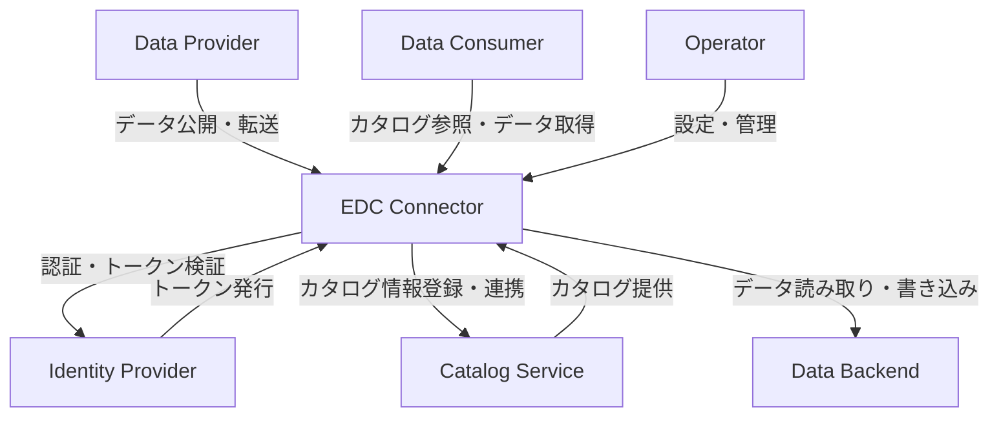
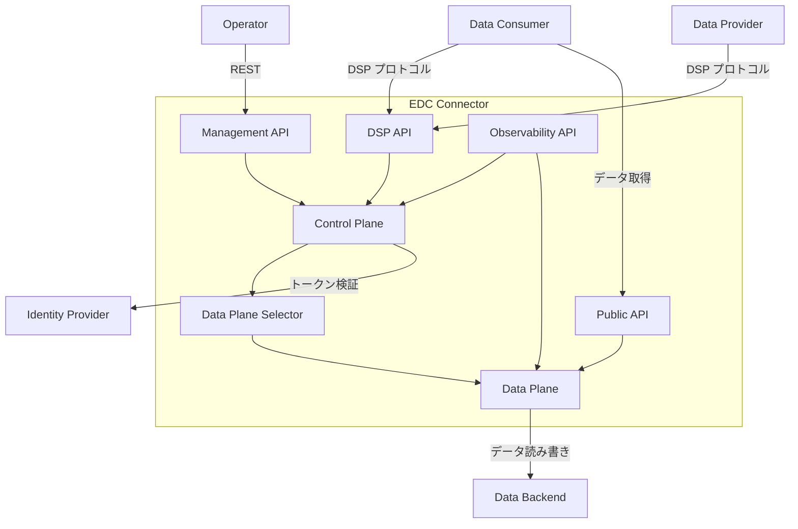
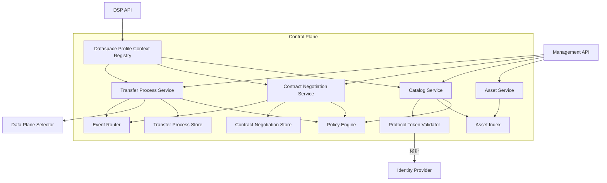
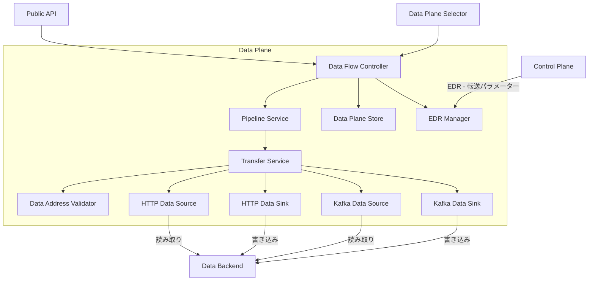
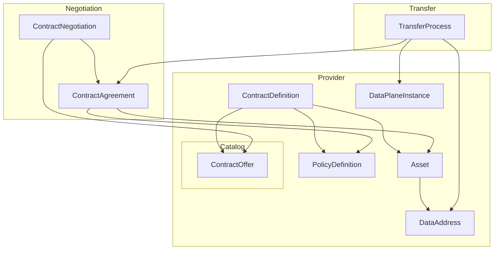
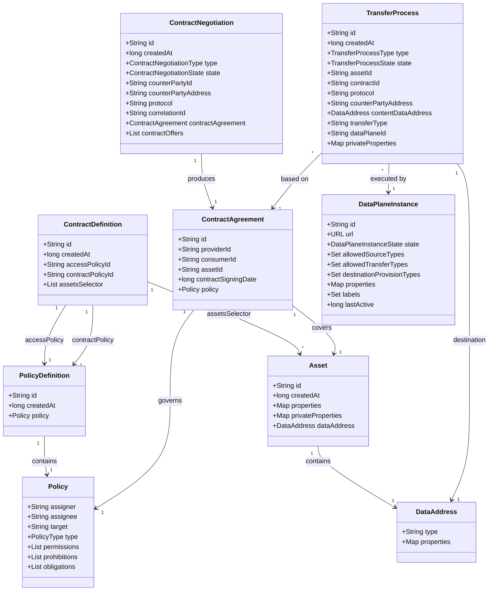

## 概要

「組織間でデータを安全に共有したいが、相手にデータの主権を渡したくない」。この課題に対して、欧州を中心にデータスペースという概念が広がっています。Eclipse EDC はその参照実装として注目されているフレームワークです。本記事では、Eclipse EDC のアーキテクチャからデータモデル、構築・運用方法まで包括的に調査した結果をまとめます。

### Eclipse EDC とは

Eclipse EDC（Eclipse Dataspace Components）は、組織間で主権的かつ安全にデータを共有するためのオープンソースフレームワークです。Apache 2.0 ライセンスで提供されており、商用利用を前提に設計されています。

Eclipse Foundation の技術プロジェクト（technology.edc）として管理されています。Eclipse Dataspace Working Group（EDWG）のガバナンス下で開発が進められています。

### データスペースとは

データスペースは、複数組織間の合意と技術インフラが一体となった仕組みです。信頼関係がない企業間でも、データ主権を保ちながらデータを交換できます。

```
データスペース = 多組織間合意 + 技術インフラ（フェデレーテッドネットワーク）
```

EDC はこのデータスペースを構築・運用するための参照実装です。

### IDSA・Gaia-X との関係

| 要素 | 説明 |
|------|------|
| IDSA | 主権的データ交換と DSP 標準を策定する国際データスペース協会 |
| DSP | IDSA が定義するデータスペース間通信プロトコル。ISO/IEC 標準化を申請中 |
| Gaia-X | 分散型デジタル信頼フレームワーク。EDC は Gaia-X トラストアンカーと統合 |
| Eclipse EDC | IDSA DSP を実装し、Gaia-X トラストフレームワークと互換性を持つ参照実装 |

### Eclipse Foundation における位置づけ

| 項目 | 内容 |
|------|------|
| プロジェクト ID | technology.edc |
| ガバナンス | Eclipse Dataspace Working Group - EDWG |
| EDWG 設立 | 2023年12月 |
| ライセンス | Apache 2.0 |

### 主要な支援企業・組織

| 組織 | 種別 | 関与 |
|------|------|------|
| Microsoft | 企業 - EDWG 創立メンバー | 開発・プロトコル策定 |
| Fraunhofer | 研究機関 - EDWG 創立メンバー | 開発・技術設計 - ISST |
| IDSA | 標準化団体 - EDWG 創立メンバー | プロトコル仕様 |
| T-Systems | 企業 - EDWG 創立メンバー | 実装・運用 |
| Amadeus | 企業 - EDWG 創立メンバー | 実装 |
| iSHARE Foundation | 非営利 - EDWG 創立メンバー | データ主権推進 |
| SAP | 企業 | EDC プロジェクト支援 |
| Catena-X / Cofinity-X | コンソーシアム | 自動車産業向け実装 |

## 特徴

| 特徴 | 内容 |
|------|------|
| データ主権の実現 | データ所有者がアクセス条件・利用目的・共有先を完全に制御 |
| 契約ベースの交換 | データ転送前に機械可読な契約合意が必須 |
| ポリシーエンジン | ODRL 標準に基づく宣言的ポリシーの自動執行 |
| デュアルプレーン構造 | 制御プレーンとデータプレーンの責務分離 |
| モジュラーアーキテクチャ | SPI・コア・拡張・データプロトコルの4層構成 |
| マルチクラウド対応 | HTTP、S3、Kafka など複数プロトコルとクラウドバックエンドに対応 |
| 標準プロトコル準拠 | DSP 0.8 / 2024/1 / 2025/1 の複数バージョンをサポート |
| 分散型 ID 管理 | OAuth2・分散型 ID・証明書による信頼検証 |
| オープンソース | Apache 2.0 ライセンスで商用利用可能 |

### データ主権の実現方法

| 要素 | 説明 |
|------|------|
| 制御プレーン | 契約交渉とポリシー執行を担当するオーケストレーション層 |
| データプレーン | 実際のデータ転送を実行する処理層 |
| 契約交渉 | データ転送前に両者が合意する機械可読な利用条件 |
| ポリシー執行 | ODRL ベースのルールの自動評価・適用 |

### モジュラーアーキテクチャ

| モジュール種別 | 役割 |
|----------------|------|
| SPI | サービスプロバイダーインターフェース。拡張ポイントの定義 |
| Core | フレームワークの基本実装 - TransferProcessManager 等 |
| Extension | 技術・クラウド固有の機能を追加するプラグイン |
| Data Protocols | DSP・HTTP 等の通信プロトコル実装 |

`@Extension` アノテーションと依存性注入（`@Provider` / `@Inject`）により、カスタム拡張を差し込めます。

### マルチクラウド対応

| 対応カテゴリ | 具体例 |
|-------------|--------|
| ストレージバックエンド | PostgreSQL、Azure CosmosDB、H2 |
| シークレット管理 | Azure Key Vault 等のクラウドプロバイダー対応 |
| データ転送プロトコル | HTTP/S、S3、Kafka |
| データプレーン選択 | DataPlaneSelector によるリモート・組み込み切り替え |

### 標準プロトコル準拠

| プロトコル | バージョン | 位置づけ |
|-----------|-----------|----------|
| DSP 0.8 | レガシー | 既存実装との後方互換 |
| DSP 2024/1 | 現安定版 | 本番環境推奨 |
| DSP 2025/1 | 次世代 | ISO/IEC 標準化申請中 |
| ODRL | - | ポリシー記述標準 |
| DCAT 3 | - | データカタログ記述標準 |

### オープンソースエコシステム

| プロジェクト | 分野 | 概要 |
|------------|------|------|
| Catena-X / Tractus-X | 自動車 | OEM・サプライヤー間データ共有 |
| EONA-X | モビリティ・観光 | 欧州交通データスペース |
| Cofinity-X | 自動車 | Catena-X 商用実装 |

## 構造

### システムコンテキスト図



| 要素名 | 説明 |
|---|---|
| Data Provider | データを提供する組織またはシステム。データ資産の公開と転送の許可 |
| Data Consumer | データを要求する組織またはシステム。カタログの参照と契約交渉を経たデータ取得 |
| Operator | コネクターの運用・管理担当者。Management API を通じた設定・監視 |
| EDC Connector | データスペースにおける安全なデータ交換を実現するコネクター。本調査対象 |
| Identity Provider | 参加者の認証・認可を担うシステム。DAPS または DID/DCP によるトークンの発行・検証 |
| Catalog Service | データ資産のカタログ情報を集約・提供するシステム。Federated Catalog として機能 |
| Data Backend | 実データを格納するストレージ。HTTP エンドポイント、Kafka トピック、クラウドストレージ等 |

### コンテナ図



| 要素名 | 説明 |
|---|---|
| Management API | Operator 向けの管理インターフェース。資産・ポリシー・契約・転送プロセスの CRUD 操作の提供 |
| DSP API | 他コネクターとの通信インターフェース。DSP v0.8 / v2024 / v2025 に対応し、カタログ・契約交渉・転送プロセスメッセージの処理 |
| Public API | Data Consumer がデータを直接取得するためのエンドポイント。Data Plane が提供 |
| Observability API | ヘルスチェック・死活監視用エンドポイント。readiness / liveness / startup プローブの提供 |
| Control Plane | 契約交渉・ポリシー執行・カタログ管理・転送調整を担うオーケストレーション層 |
| Data Plane | 実データの転送処理を担う層。パイプライン方式で HTTP / Kafka 等のバックエンドと接続 |
| Data Plane Selector | Control Plane からの転送要求を適切な Data Plane インスタンスにルーティング |

### コンポーネント図

#### Control Plane



| 要素名 | 説明 |
|---|---|
| Asset Service | データ資産のライフサイクル管理。資産の登録・更新・削除・検索 |
| Catalog Service | カタログの公開と参照の管理。DSP API 経由のカタログリクエストの処理 |
| Contract Negotiation Service | 契約交渉のライフサイクル管理。オファー・アグリーメントの状態遷移制御 |
| Transfer Process Service | データ転送プロセスのライフサイクル管理。転送の開始・監視・完了の調整 |
| Policy Engine | ODRL に基づくポリシーの評価・執行。アクセスポリシーと利用ポリシーの両方を処理 |
| Protocol Token Validator | DSP プロトコルレベルの認証トークン検証。Identity Provider と連携して信頼を確立 |
| Dataspace Profile Context Registry | 複数の DSP バージョンをルーティングするレジストリ。プロトコルごとの認証・語彙・エンドポイント管理 |
| Asset Index | 資産メタデータの永続化ストア。SQL 実装とインメモリ実装を提供 |
| Contract Negotiation Store | 契約交渉エンティティの永続化ストア。状態マシンと統合した一貫性保証 |
| Transfer Process Store | 転送プロセスエンティティの永続化ストア。状態マシンと統合した一貫性保証 |
| Event Router | 資産・契約・転送の状態変化イベントを外部サブスクライバーに配信 |

#### Data Plane



| 要素名 | 説明 |
|---|---|
| Data Flow Controller | Control Plane からの転送指示を受け取り、Data Plane 内の処理フローを制御 |
| Pipeline Service | データ転送パイプラインのオーケストレーション。ソースとシンクを組み合わせた転送の実行 |
| Transfer Service | 各転送プロトコルの実装コントラクト。プラグイン可能なトランスポートメカニズムを定義する SPI |
| Data Plane Store | 転送プロセスの状態を永続化するストア。状態マシンによるリトライと状態遷移の管理 |
| HTTP Data Source | HTTP / HTTPS エンドポイントからデータを読み取るソース実装 |
| HTTP Data Sink | HTTP / HTTPS エンドポイントにデータを書き込むシンク実装 |
| Kafka Data Source | Apache Kafka トピックからデータを読み取るソース実装 |
| Kafka Data Sink | Apache Kafka トピックにデータを書き込むシンク実装 |
| Data Address Validator | 転送リクエストに含まれるデータアドレスの形式・接続先の検証 |
| EDR Manager | Endpoint Data Reference の管理。Control Plane から受け取った転送パラメーターと認証情報の保持 |

## データ

### 概念モデル



| 要素名 | 説明 |
|---|---|
| Asset | プロバイダーが提供するデータリソースのメタデータ |
| DataAddress | データリソースへの物理的な接続情報 |
| PolicyDefinition | アクセス制御ルールの定義 - ODRL 形式 |
| ContractDefinition | Asset と Policy を結合するオファーのテンプレート |
| Catalog | コンシューマーに公開されるコントラクトオファーの集合 |
| ContractOffer | Catalog に含まれる具体的なオファー |
| ContractNegotiation | コンシューマーとプロバイダー間のネゴシエーション管理 |
| ContractAgreement | ネゴシエーション完了後の拘束力ある合意 |
| TransferProcess | 合意に基づくデータ転送の実行管理 |
| DataPlaneInstance | データ転送を実行するデータプレーンの登録情報 |

### 情報モデル



### エンティティ属性

| 要素名 | 属性 | 説明 |
|---|---|---|
| Asset | id | 一意識別子 |
| Asset | properties | 外部公開メタデータ |
| Asset | privateProperties | 内部のみ参照可能なメタデータ |
| Asset | dataAddress | データの物理的な場所への参照 |
| DataAddress | type | プロトコルまたはストレージ種別 - 例: HttpData, AmazonS3 |
| DataAddress | properties | 接続に必要なエンドポイントや認証情報 |
| Policy | permissions | 許可ルールのリスト - MAY |
| Policy | prohibitions | 禁止ルールのリスト - MUST NOT |
| Policy | obligations | 義務ルールのリスト - MUST |
| Policy | type | ポリシー種別 - SET / OFFER / CONTRACT |
| PolicyDefinition | id | 一意識別子 |
| PolicyDefinition | policy | ODRL 形式のポリシー本体 |
| ContractDefinition | accessPolicyId | カタログ閲覧可否を制御するポリシーの参照 |
| ContractDefinition | contractPolicyId | コントラクト条件を制御するポリシーの参照 |
| ContractDefinition | assetsSelector | 対象 Asset を絞り込む条件式のリスト |
| ContractNegotiation | type | CONSUMER または PROVIDER |
| ContractNegotiation | state | 現在の状態 |
| ContractNegotiation | counterPartyId | 相手方の参加者識別子 |
| ContractNegotiation | correlationId | 相手方側のネゴシエーション識別子 |
| ContractNegotiation | contractAgreement | ネゴシエーション完了後に生成される合意 |
| ContractAgreement | providerId | プロバイダーの参加者識別子 |
| ContractAgreement | consumerId | コンシューマーの参加者識別子 |
| ContractAgreement | assetId | 合意対象の Asset 識別子 |
| ContractAgreement | contractSigningDate | 合意締結のタイムスタンプ |
| ContractAgreement | policy | 転送を統制するポリシー |
| TransferProcess | type | CONSUMER または PROVIDER |
| TransferProcess | state | 現在の状態 |
| TransferProcess | assetId | 転送対象の Asset 識別子 |
| TransferProcess | contractId | 根拠となる ContractAgreement の識別子 |
| TransferProcess | contentDataAddress | 転送先の DataAddress |
| TransferProcess | transferType | 転送メカニズムの種別 |
| TransferProcess | dataPlaneId | 実行を担当する DataPlaneInstance の識別子 |
| DataPlaneInstance | url | データプレーンのエンドポイント URL |
| DataPlaneInstance | state | REGISTERED または UNREGISTERED |
| DataPlaneInstance | allowedSourceTypes | 対応可能なソースデータ種別 |
| DataPlaneInstance | allowedTransferTypes | 対応可能な転送プロトコル種別 |
| DataPlaneInstance | destinationProvisionTypes | 対応可能な転送先プロビジョニング種別 |

### ContractNegotiation 状態遷移

| 状態 | 説明 |
|---|---|
| INITIAL | ネゴシエーション開始前 |
| REQUESTING | コンシューマーがリクエストを送信中 |
| REQUESTED | プロバイダーがリクエストを受信済み |
| OFFERING | プロバイダーがオファーを送信中 |
| OFFERED | コンシューマーがオファーを受信済み |
| ACCEPTING | コンシューマーが承諾を送信中 |
| ACCEPTED | プロバイダーが承諾を受信済み |
| AGREEING | プロバイダーが合意を送信中 |
| AGREED | コンシューマーが合意を受信済み |
| VERIFYING | コンシューマーが検証を送信中 |
| VERIFIED | プロバイダーが検証を受信済み |
| FINALIZING | プロバイダーが確定を送信中 |
| FINALIZED | コンシューマーが確定を受信済み - ContractAgreement 生成 |
| TERMINATING | 終了処理中 |
| TERMINATED | ネゴシエーション終了 - 失敗または拒否 |

### TransferProcess 状態遷移

| 状態 | フェーズ | 説明 |
|---|---|---|
| INITIAL | 開始 | 転送プロセス開始前 |
| PROVISIONING | プロビジョニング | リソースのプロビジョニング中 |
| PROVISIONED | プロビジョニング | プロビジョニング完了 |
| REQUESTING | プロトコル | コンシューマーが転送リクエストを送信中 |
| REQUESTED | プロトコル | プロバイダーがリクエストを受信済み |
| STARTING | プロトコル | プロバイダーが転送開始を通知中 |
| STARTED | プロトコル | 転送実行中 |
| SUSPENDING | プロトコル | 一時停止処理中 |
| SUSPENDED | プロトコル | 一時停止中 |
| COMPLETING | プロトコル | 完了処理中 |
| COMPLETED | プロトコル | 転送完了 |
| TERMINATING | プロトコル | 終了処理中 |
| TERMINATED | プロトコル | 転送終了 - 失敗または中止 |
| DEPROVISIONING | デプロビジョニング | リソースの解放中 |
| DEPROVISIONED | デプロビジョニング | リソース解放完了 |

## 構築方法

### 前提条件

| 項目 | 要件 |
|------|------|
| Java | JDK 17 以上 |
| ビルドツール | Gradle - Wrapper 同梱 |
| Docker | コンテナ実行時のみ |

Java 17 が最低要件です。ビルドツールは Gradle Wrapper（`./gradlew`）を使用するため、Gradle の個別インストールは不要です。

### ソースコード取得とビルド

```bash
# リポジトリ取得
git clone https://github.com/eclipse-edc/Connector.git
cd Connector

# ビルド（全モジュール）
./gradlew clean build
```

Samples リポジトリから特定モジュールのみビルドする場合は以下のとおりです。

```bash
git clone https://github.com/eclipse-edc/Samples.git
cd Samples

# 特定モジュールのビルド
./gradlew transfer:transfer-00-prerequisites:connector:build

# JAR の実行
java -jar basic/basic-01-basic-connector/build/libs/basic-connector.jar --log-level=DEBUG
```

### Gradle 依存関係管理 - BOM / Version Catalog

EDC は `org.eclipse.edc` グループ ID で Maven Central に公開されています。

**Version Catalog（推奨）**

`settings.gradle.kts` に BOM を宣言します。

```kotlin
// settings.gradle.kts
dependencyResolutionManagement {
    versionCatalogs {
        create("libs") {
            from("org.eclipse.edc:edc-versions:0.14.0")
        }
    }
}
```

`build.gradle.kts` での依存関係参照は以下のとおりです。

```kotlin
// build.gradle.kts
dependencies {
    implementation(libs.edc.boot)
    implementation(libs.edc.connector.core)
    implementation(libs.edc.http)
    implementation(libs.edc.configuration.filesystem)
}
```

**Maven の場合**

```xml
<dependency>
  <groupId>org.eclipse.edc</groupId>
  <artifactId>connector-core</artifactId>
  <version>0.14.0</version>
</dependency>
```

### Extension の作成方法 - SPI 実装

Extension は `ServiceExtension` インターフェイスを実装して作成します。

**1. 依存関係の追加**

```kotlin
// build.gradle.kts
dependencies {
    implementation(libs.edc.boot)
    implementation(libs.edc.connector.core)
}
```

**2. Extension クラスの実装**

```java
public class HealthEndpointExtension implements ServiceExtension {

    @Inject
    WebService webService;

    @Override
    public void initialize(ServiceExtensionContext context) {
        webService.registerResource(new HealthApiController(context.getMonitor()));
    }
}
```

**3. サービスローダー登録**

`src/main/resources/META-INF/services/org.eclipse.edc.spi.system.ServiceExtension` ファイルに実装クラス名を記載します。

```
com.example.HealthEndpointExtension
```

### カスタムコネクタの構築

Launcher（実行可能パッケージ）は `build.gradle.kts` で取り込むモジュールを定義します。

```kotlin
// launcher/build.gradle.kts
plugins {
    `java-library`
    id("application")
    id("com.github.johnrengelman.shadow") version "8.1.1"
}

application {
    mainClass.set("org.eclipse.edc.boot.system.runtime.BaseRuntime")
}

dependencies {
    implementation(libs.edc.boot)
    implementation(libs.edc.connector.core)
    implementation(libs.edc.http)
    implementation(libs.edc.management.api)
    implementation(libs.edc.configuration.filesystem)
    // 追加する機能に応じてモジュールを追加
}
```

```bash
# Fat JAR のビルド
./gradlew launcher:shadowJar
java -jar launcher/build/libs/connector.jar
```

### Docker イメージのビルド

**Dockerfile の例**

```dockerfile
FROM eclipse-temurin:17-jre-alpine
ARG JAR_FILE
COPY ${JAR_FILE} /app/connector.jar
EXPOSE 8181 8182
ENTRYPOINT ["java", "-jar", "/app/connector.jar"]
```

**Docker Compose による Provider / Consumer の起動**

```yaml
services:
  provider:
    build:
      context: .
      target: provider
    ports:
      - "19193:19193"
    volumes:
      - /tmp/provider:/tmp/provider

  consumer:
    build:
      context: .
      target: consumer
    ports:
      - "29193:29193"
    volumes:
      - /tmp/consumer:/tmp/consumer
```

```bash
# コンテナ起動
docker compose up -d
```

## 利用方法

### API 認証方法

Management API はデフォルトで API Key 認証を使用します。

```bash
# ヘッダーに X-Api-Key を付与
curl -H "X-Api-Key: password" ...
```

設定ファイルで API Key を指定します。

```properties
# connector.properties
edc.api.auth.key=password
web.http.management.port=19193
web.http.management.path=/management
```

### Asset 登録

Provider コネクタに Asset を登録します。

```bash
curl -X POST http://localhost:19193/management/v3/assets \
  -H 'Content-Type: application/json' \
  -d '{
    "@context": {
      "@vocab": "https://w3id.org/edc/v0.0.1/ns/"
    },
    "@type": "Asset",
    "@id": "assetId",
    "properties": {
      "name": "product description",
      "contenttype": "application/json"
    },
    "dataAddress": {
      "type": "HttpData",
      "name": "Test asset",
      "baseUrl": "https://jsonplaceholder.typicode.com/users"
    }
  }' -s | jq
```

### Policy 定義

Asset のアクセスルールを ODRL で定義します。

```bash
curl -X POST http://localhost:19193/management/v3/policydefinitions \
  -H 'Content-Type: application/json' \
  -d '{
    "@context": {
      "@vocab": "https://w3id.org/edc/v0.0.1/ns/"
    },
    "@type": "PolicyDefinition",
    "@id": "aPolicy",
    "policy": {
      "@context": "http://www.w3.org/ns/odrl.jsonld",
      "@type": "Set"
    }
  }' -s | jq
```

### Contract Definition 作成

Asset と Policy を紐付けて契約オファーを生成します。

```bash
curl -X POST http://localhost:19193/management/v3/contractdefinitions \
  -H 'Content-Type: application/json' \
  -d '{
    "@context": {
      "@vocab": "https://w3id.org/edc/v0.0.1/ns/"
    },
    "@type": "ContractDefinition",
    "@id": "1",
    "accessPolicyId": "aPolicy",
    "contractPolicyId": "aPolicy",
    "assetsSelector": []
  }' -s | jq
```

`assetsSelector` が空の場合、全 Asset が対象です。

### Catalog 検索

Consumer が Provider のカタログを取得します。

```bash
curl -X POST http://localhost:29193/management/v3/catalog/request \
  -H 'Content-Type: application/json' \
  -d '{
    "@context": {
      "@vocab": "https://w3id.org/edc/v0.0.1/ns/"
    },
    "counterPartyAddress": "http://localhost:19194/protocol",
    "protocol": "dataspace-protocol-http"
  }' -s | jq
```

### Contract Negotiation のフロー

Contract Negotiation は非同期の状態機械（State Machine）として処理されます。

| ステップ | 操作 | エンドポイント |
|---------|------|---------------|
| 1 | 交渉開始 | POST `/management/v3/contractnegotiations` |
| 2 | 状態確認 | GET `/management/v3/contractnegotiations/{id}` |
| 3 | 合意 ID 取得 | 状態が FINALIZED になったら contractAgreementId を記録 |

**交渉開始**

```bash
curl -X POST http://localhost:29193/management/v3/contractnegotiations \
  -H 'Content-Type: application/json' \
  -H 'X-Api-Key: password' \
  -d '{
    "@context": {
      "@vocab": "https://w3id.org/edc/v0.0.1/ns/"
    },
    "@type": "ContractRequest",
    "counterPartyAddress": "http://localhost:19194/protocol",
    "protocol": "dataspace-protocol-http",
    "policy": {
      "@context": "http://www.w3.org/ns/odrl.jsonld",
      "@type": "Offer",
      "@id": "<catalog から取得した offer ID>",
      "assigner": "<provider ID>",
      "target": "assetId"
    }
  }' -s | jq
```

**状態確認**

```bash
# {negotiation_id} は交渉開始レスポンスの @id
curl http://localhost:29193/management/v3/contractnegotiations/{negotiation_id} \
  -H 'X-Api-Key: password' -s | jq
```

状態遷移の流れは `REQUESTING` → `REQUESTED` → `AGREED` → `VERIFIED` → `FINALIZED` です。

### Transfer Process の開始

Contract Agreement 取得後、データ転送を開始します。

```bash
curl -X POST http://localhost:29193/management/v3/transferprocesses \
  -H 'Content-Type: application/json' \
  -H 'X-Api-Key: password' \
  -d '{
    "@context": {
      "@vocab": "https://w3id.org/edc/v0.0.1/ns/"
    },
    "@type": "TransferRequest",
    "counterPartyAddress": "http://localhost:19194/protocol",
    "contractId": "<contractAgreementId>",
    "assetId": "assetId",
    "protocol": "dataspace-protocol-http",
    "transferType": "HttpData-PULL"
  }' -s | jq
```

状態が `STARTED` になったら、EDR（EndpointDataReference）を取得してデータにアクセスします。

**EDR によるデータアクセス（Consumer Pull）**

```bash
# 1. EDR 取得（アクセストークン含む）
curl http://localhost:29193/management/v3/edrs/{transfer_id}/dataaddress \
  -H 'X-Api-Key: password' -s | jq

# 2. EDR のエンドポイントとトークンでデータ取得
curl -H "Authorization: <EDR の authorization 値>" \
  "<EDR の endpoint 値>" -s | jq
```

### データ転送パターン

EDC は複数のデータ転送パターンを提供します。`transferType` フィールドで指定します。

| transferType | 転送方向 | 説明 |
|---|---|---|
| HttpData-PULL | Consumer Pull | コンシューマがプロバイダの Data Plane Public API から HTTP でデータを取得 |
| HttpData-PUSH | Provider Push | プロバイダがコンシューマ指定の HTTP エンドポイントにデータを送信 |
| AmazonS3-PUSH | Provider Push | プロバイダがコンシューマ指定の S3 バケットにデータを転送 |
| AzureStorage-PUSH | Provider Push | プロバイダがコンシューマ指定の Azure Blob Storage にデータを転送 |
| Kafka-PUSH | Streaming | プロバイダが Kafka トピック経由でストリームデータを配信 |

#### パターン比較

| 観点 | Consumer Pull | Provider Push | Streaming |
|---|---|---|---|
| 能動側 | コンシューマ | プロバイダ | プロバイダ |
| 転送タイミング | コンシューマ任意 | コントラクト確立後に即時 | 継続的 |
| 転送プロセス最終状態 | STARTED 継続 | COMPLETED | TERMINATED |
| EDR の利用 | 必須 | 不要 | 不要 |
| 主なユースケース | REST API スタイルのデータ取得 | ファイル・バッチ転送 | リアルタイムイベント |

#### Consumer Pull パターン - HttpData-PULL

コンシューマが能動的にデータを取得するパターンです。コントラクト交渉完了後、EDR（Endpoint Data Reference）を取得し、そのトークンを用いて Data Plane の Public API に直接アクセスします。

- コンシューマとプロバイダの双方の Control Plane がトークンに署名するため、プロバイダへの直接アクセスが防止されます
- `proxyPath`、`proxyQueryParams`、`proxyMethod`、`proxyBody` の設定により、REST API のように柔軟にデータを取得できます
- 転送プロセスは `STARTED` 状態のまま継続し、1 つのコントラクトに対して複数回のデータ取得が可能です

#### Provider Push パターン - HttpData-PUSH

プロバイダが能動的にコンシューマ指定のエンドポイントにデータを送信するパターンです。

```bash
curl -X POST http://localhost:29193/management/v3/transferprocesses \
  -H 'Content-Type: application/json' \
  -H 'X-Api-Key: password' \
  -d '{
    "@context": {
      "@vocab": "https://w3id.org/edc/v0.0.1/ns/"
    },
    "@type": "TransferRequest",
    "counterPartyAddress": "http://localhost:19194/protocol",
    "contractId": "<contractAgreementId>",
    "assetId": "assetId",
    "protocol": "dataspace-protocol-http",
    "transferType": "HttpData-PUSH",
    "dataDestination": {
      "type": "HttpData",
      "baseUrl": "http://consumer-backend:4000/receiver"
    }
  }' -s | jq
```

- 有限転送（1 回送信後に終了）と無限転送（手動停止まで継続）の 2 種類があります
- AmazonS3-PUSH、AzureStorage-PUSH も同じフローで、DataSink の実装が置き換わります

#### EDR - Endpoint Data Reference の仕組み

EDR は Consumer Pull パターンで中心的な役割を果たすデータアクセス参照情報です。

```json
{
  "@type": "DataAddress",
  "type": "https://w3id.org/idsa/v4.1/HTTP",
  "endpoint": "http://provider-data-plane:19291/public",
  "authType": "bearer",
  "authorization": "<JWT トークン>"
}
```

| 特性 | 説明 |
|---|---|
| ネストされたトークン構造 | プロバイダとコンシューマ双方が署名し、プロバイダへの直接アクセスを防止 |
| トークン有効期限 | デフォルト 10 分 - 設定変更可能 |
| トークンローテーション | Tractus-X 実装ではリフレッシュトークンにより対応 |
| ポリシー強制 | アクセス都度 Control Plane でコントラクト有効性を確認 |

### 主要 Management API エンドポイント一覧

| リソース | メソッド | パス |
|---------|---------|------|
| Asset 作成 | POST | `/management/v3/assets` |
| Policy 作成 | POST | `/management/v3/policydefinitions` |
| Contract Definition 作成 | POST | `/management/v3/contractdefinitions` |
| Catalog 取得 | POST | `/management/v3/catalog/request` |
| Contract Negotiation 開始 | POST | `/management/v3/contractnegotiations` |
| Contract Negotiation 状態確認 | GET | `/management/v3/contractnegotiations/{id}` |
| Transfer Process 開始 | POST | `/management/v3/transferprocesses` |
| Transfer Process 状態確認 | GET | `/management/v3/transferprocesses/{id}` |
| EDR 取得 | GET | `/management/v3/edrs/{id}/dataaddress` |

## 運用

### デプロイメントパターン

#### Docker Compose - 開発・検証用

```yaml
services:
  controlplane:
    image: <your-image>/controlplane:latest
    ports:
      - "8181:8181"  # API / Health Check
      - "8080:8080"  # Management API
      - "8084:8084"  # DSP Protocol
    environment:
      - EDC_VAULT_HASHICORP_URL=http://vault:8200
      - EDC_VAULT_HASHICORP_TOKEN=<token>
    healthcheck:
      test: ["CMD", "curl", "-f", "http://localhost:8181/api/check/health"]
      interval: 5s
      timeout: 5s
      retries: 10

  prometheus:
    image: prom/prometheus:v2.30.3
    volumes:
      - ./prometheus/:/etc/prometheus/
    ports:
      - "9090:9090"
```

#### Kubernetes - 本番用

Tractus-X EDC の Helm チャートを利用するのが推奨パターンです。

```bash
# 名前空間作成（参加者分離）
kubectl create ns provider
kubectl create ns consumer

# Helm でコネクター展開
git clone https://github.com/eclipse-tractusx/tractusx-edc
cd tractusx-edc/charts/tractusx-connector
helm dependency build
helm upgrade --install provider ./ -f provider_edc.yaml -n provider
helm upgrade --install consumer ./ -f consumer_edc.yaml -n consumer
```

**エンドポイント構成（Control Plane）**

| 用途 | ポート | パス |
|---|---|---|
| Management API | 8081 | /management |
| Control | 8083 | /control |
| DSP Protocol | 8084 | /api/v1/dsp |
| Metrics | 9090 | /metrics |
| Observability | 8085 | /observability |

**エンドポイント構成（Data Plane）**

| 用途 | ポート | パス |
|---|---|---|
| Default | 8080 | /api |
| Public | 8081 | /api/dataplane/control |
| Proxy | 8186 | /proxy |
| Metrics | 9090 | /metrics |

### クラウド別実装

#### AWS

| サービス | 用途 |
|---|---|
| Amazon EKS | EDC コネクター実行 - Kubernetes |
| Amazon RDS - PostgreSQL | コネクター状態の永続化 |
| Amazon S3 | データ転送ソース・宛先 |
| AWS Secrets Manager / HashiCorp Vault | シークレット管理 |

**S3 アセット登録の例**

```json
{
  "dataAddress": {
    "edc:type": "AmazonS3",
    "name": "Vehicle Carbon Footprint",
    "bucketName": "<BUCKET_NAME>",
    "keyName": "carbon_data.json",
    "region": "eu-west-1",
    "accessKeyId": "<ACCESS_KEY>",
    "secretAccessKey": "<SECRET_KEY>"
  }
}
```

#### Azure

| サービス | 役割 |
|---|---|
| Azure CosmosDB | 各種ストレージバックエンド |
| Azure Key Vault | 暗号鍵・シークレット管理 |
| Azure Blob Storage | データ転送ストレージ |
| Azure Application Insights | メトリクス・トレース可視化 |

```properties
edc.vault.azure.name=<vault-name>
edc.vault.azure.client.id=<client-id>
edc.vault.azure.tenant.id=<tenant-id>
edc.vault.azure.client.secret=<secret>
```

#### GCP

GCP 向けは GKE + Cloud SQL（PostgreSQL） + Cloud Storage の組み合わせが一般的です。

### Identity Hub のデプロイ

```bash
# Java プロセスとして起動
java -Dweb.http.credentials.port=10001 \
     -Dweb.http.credentials.path="/api/credentials" \
     -Dweb.http.port=8181 \
     -Dweb.http.path="/api" \
     -Dweb.http.identity.port=8182 \
     -Dweb.http.identity.path="/api/identity" \
     -jar launcher/identityhub/build/libs/identity-hub.jar
```

```bash
# Docker コンテナとして起動
docker run -d --rm --name identityhub \
    -e "WEB_HTTP_IDENTITY_PORT=8182" \
    -e "WEB_HTTP_IDENTITY_PATH=/api/identity" \
    -e "WEB_HTTP_PRESENTATION_PORT=10001" \
    -e "WEB_HTTP_PRESENTATION_PATH=/api/presentation" \
    -e "EDC_IAM_STS_PRIVATEKEY_ALIAS=privatekey-alias" \
    -e "EDC_IAM_STS_PUBLICKEY_ID=publickey-id" \
    identity-hub:latest
```

### 監視・オブザーバビリティ

#### ヘルスチェックエンドポイント

| エンドポイント | 用途 |
|---|---|
| `GET /api/check/health` | システム全体の状態 - Docker HEALTHCHECK 向け |
| `GET /api/check/liveness` | コンテナ動作確認 |
| `GET /api/check/readiness` | リクエスト受け付け可能確認 |
| `GET /api/check/startup` | アプリケーション起動完了確認 |

#### OpenTelemetry による分散トレーシング

```yaml
# Docker Compose 環境変数
environment:
  - OTEL_SERVICE_NAME=edc-controlplane
  - OTEL_EXPORTER_OTLP_ENDPOINT=http://jaeger:4317
  - OTEL_METRICS_EXPORTER=prometheus
  - JAVA_TOOL_OPTIONS=-javaagent:/app/opentelemetry-javaagent.jar
```

#### Micrometer によるメトリクス収集

| カテゴリ | メトリクス |
|---|---|
| JVM | ヒープメモリ、GC、スレッド数、クラスローダー |
| HTTP クライアント - OkHttp | リクエスト数、レイテンシ - URL 別 |
| HTTP サーバー - Jetty | 接続数、入出力バイト数 |
| REST エンドポイント - Jersey | リクエスト数、レイテンシ - ステータスコード・例外別 |
| スレッドプール | アイドル・アクティブスレッド数、キュー待ちタスク数 |

### セキュリティ設定

#### HashiCorp Vault 連携

| パラメーター | 説明 | デフォルト |
|---|---|---|
| `edc.vault.hashicorp.url` | Vault サーバー URL | なし - 必須 |
| `edc.vault.hashicorp.token` | トークン認証資格情報 | なし - 必須 |
| `edc.vault.hashicorp.timeout.seconds` | リクエストタイムアウト | 30 |
| `edc.vault.hashicorp.health.check.enabled` | ヘルスチェック有効化 | true |

```properties
edc.vault.hashicorp.url=https://vault.example.com
edc.vault.hashicorp.token=<token>
edc.vault.hashicorp.api.secret.path=/v1/edc/
edc.vault.hashicorp.health.check.standby.ok=true
```

### スケーリング戦略

| 原則 | 内容 |
|---|---|
| 非同期性 | 状態変更はすべて非同期・永続的に実行 |
| ステートレス Data Plane | データプレーンはステートレス設計のため水平スケールが可能 |
| ステートフル Control Plane | 悲観的ロック付きシーケンシャルステートマシンで動作 |
| エラー耐性 | 低レイテンシより信頼性を優先し、一時的エラーを吸収 |

Data Plane はステートレス設計のため、レプリカ数を増やすだけでスケールアウトできます。Control Plane は PostgreSQL を共有ストアとして使用し、アクティブ-スタンバイ構成が推奨です。

## ベストプラクティス

### Extension 開発

- Extension は `ServiceExtension` インターフェースを実装します
- `@Provider` メソッドでサービスを公開します
- `@Inject` アノテーションで依存サービスを宣言します
- 拡張の発見はクラスパススキャンで自動的に行われます

```java
public class MyExtension implements ServiceExtension {

    @Inject
    private AssetService assetService;

    @Provider
    public MyService myService() {
        return new MyServiceImpl(assetService);
    }

    @Override
    public void initialize(ServiceExtensionContext context) {
        var setting = context.getSetting("my.setting", "defaultValue");
    }
}
```

### 設定管理

- 設定は `@Setting` アノテーションで型安全に定義します
- プロパティ名は `edc.*` 命名規則に従います
- `ServiceExtensionContext.getSetting()` でアクセスします

### 非同期処理

- 内部状態変更はすべて非同期で行います
- REST リクエストはトリガーのみで、状態変更自体は非同期ステートマシンが処理します
- 冪等性を確保します（外部リソースプロビジョニング含む）

### ポリシー設計パターン

#### アクセスポリシーとコントラクトポリシーの使い分け

| 項目 | アクセスポリシー | コントラクトポリシー |
|---|---|---|
| 評価タイミング | カタログ生成時 | 契約ネゴシエーション時・転送開始前 |
| 目的 | アセットをカタログに表示するかの制御 | 契約締結・データ利用の条件制御 |
| ODRL action | `access` | `use` |

#### ODRL 制約パターンのバリエーション

| 制約種別 | leftOperand | 用途 |
|---|---|---|
| BPN 制約 | `BusinessPartnerNumber` | 特定のビジネスパートナーにのみアクセス許可 |
| グループ制約 | `BusinessPartnerGroup` | BPN をグループ単位で管理 |
| メンバーシップ | `Membership` | メンバーシップ保有者にのみ許可 |
| 時間制限 | `inForceDate` | データ利用の有効期限 |
| 地域制限 | `location` | 特定地域のパートナーにのみ許可 |
| ロール制約 | `Dismantler` 等 | 参加者のロール情報で制約 |
| フレームワーク合意 | `FrameworkAgreement` | 特定の合意への同意を必須化 |

**BusinessPartnerNumber による制約例**

```json
{
  "@type": "PolicyDefinition",
  "@id": "bpn-policy",
  "policy": {
    "@type": "Set",
    "permission": [
      {
        "action": "use",
        "constraint": {
          "leftOperand": "BusinessPartnerNumber",
          "operator": "eq",
          "rightOperand": "BPNL00000000XXXX"
        }
      }
    ]
  }
}
```

**時間制限（利用期限）の例**

```json
{
  "permission": [
    {
      "action": "use",
      "constraint": {
        "leftOperand": "inForceDate",
        "operator": "lteq",
        "rightOperand": "2026-12-31T23:59:59Z"
      }
    }
  ]
}
```

**AND 条件の組み合わせ例**

```json
{
  "permission": [
    {
      "action": "use",
      "constraint": {
        "@type": "AndConstraint",
        "and": [
          {
            "leftOperand": "FrameworkAgreement",
            "operator": "eq",
            "rightOperand": "DataExchangeGovernance:1.0"
          },
          {
            "leftOperand": "Membership",
            "operator": "eq",
            "rightOperand": "active"
          }
        ]
      }
    }
  ]
}
```

#### カスタムポリシー関数の登録

カスタム制約は `AtomicConstraintRuleFunction` を実装し、`PolicyEngine` に登録します。

```java
public class LocationConstraintFunction implements
    AtomicConstraintRuleFunction<Permission, ContractNegotiationPolicyContext> {

    @Override
    public boolean evaluate(Operator operator, Object rightValue,
        Permission rule, ContractNegotiationPolicyContext context) {
        var region = context.participantAgent().getClaims().get("region");
        return switch (operator) {
            case EQ  -> Objects.equals(region, rightValue);
            case NEQ -> !Objects.equals(region, rightValue);
            case IN  -> ((Collection<?>) rightValue).contains(region);
            default  -> false;
        };
    }
}
```

**Extension での登録**

```java
public class MyPolicyExtension implements ServiceExtension {

    @Inject
    private RuleBindingRegistry ruleBindingRegistry;

    @Inject
    private PolicyEngine policyEngine;

    @Override
    public void initialize(ServiceExtensionContext context) {
        // ルールをスコープにバインド
        ruleBindingRegistry.bind("use", ALL_SCOPES);
        ruleBindingRegistry.bind("location", NEGOTIATION_SCOPE);

        // 関数を PolicyEngine に登録
        policyEngine.registerFunction(
            ContractNegotiationPolicyContext.class,
            Permission.class,
            "location",
            new LocationConstraintFunction()
        );
    }
}
```

**ポリシースコープの種類**

| スコープ | 評価タイミング |
|---|---|
| `contract.cataloging` | カタログ生成時 - アセットの可視性フィルタリング |
| `contract.negotiation` | 契約ネゴシエーション時 |
| `contract.agreement` | 契約合意評価時 |
| `transfer.process` | データ転送開始前の再評価 |

> **注意**: EDC のポリシーエンジンは評価できないポリシーをデフォルトで `true`（許可）として扱います。カスタム制約関数の登録漏れが意図せぬアクセス許可につながるため、本番環境では必ずポリシーバリデーションを有効化してください。

### テスト戦略

| レイヤー | ツール | 用途 |
|---|---|---|
| ユニットテスト | JUnit 5 + Mockito | 単一クラスの動作検証 |
| Controller 統合テスト | Jersey + RestAssured | API エンドポイント検証 |
| ランタイム統合テスト | EdcRuntimeExtension | 複数 Runtime を起動した E2E 検証 |
| 非同期テスト | Awaitility | 非同期状態変更の検証 |
| プロトコル適合テスト | DSP TCK / DCP TCK | プロトコル準拠確認 |

### バージョン管理・アップグレード

1. Releases ページで対象バージョンの変更点を確認します
2. 廃止予定 API の使用箇所を特定します
3. ローカル環境で統合テストを実行して動作を確認します
4. ステージング環境で E2E テストを実施します
5. 本番環境へデプロイします

## トラブルシューティング

### Contract Negotiation の失敗パターン

#### ポリシー不一致エラー

**症状**: `Policy in the contract agreement is not equal to the one in the contract offer`

**対処**:
- `policy.permission.target` を `null` で送信するか、アセットポリシーと完全一致させます
- Management API でアセットのポリシー定義を確認します

#### 状態確認

```bash
curl -X GET http://localhost:8081/management/v2/contractnegotiations/<negotiation-id> \
  -H "x-api-key: <api-key>"
```

### Transfer Process のエラーハンドリング

#### 409 エラー: アグリーメントが見つからない

**症状**: `Cannot process TransferRequestMessage because agreement not found or not valid`

**対処**:
- `format` パラメーターが `<destination_type>-<flow_type>` 形式（例: `HttpData-PULL`）か確認します
- Management API 経由でアグリーメント ID の存在を確認します

### ログ確認とデバッグ手順

```bash
# Kubernetes でのログ確認
kubectl logs -n provider deployment/provider-tractusx-connector-controlplane -f
kubectl logs -n provider deployment/provider-tractusx-connector-dataplane -f

# ヘルスチェック
curl http://localhost:8181/api/check/health
```

### よくあるエラーと対処法一覧

| エラー | 原因 | 対処 |
|---|---|---|
| ポリシー不一致 | Contract Offer とネゴシエーション時のポリシーが異なる | `permission.target` を null にするかポリシーを統一 |
| 409 Agreement not found | `format` パラメーター形式の誤り | `HttpData-PULL` 等の正しい形式を使用 |
| Vault ヘルスチェック失敗 | スタンバイ Vault を unhealthy と判定 | `health.check.standby.ok=true` を設定 |
| Data Plane 起動失敗 | `No data flow controller found` | Data Plane Selector 拡張の設定を確認 |
| 無限ループ - Contract Negotiation | プロセスの中断 | コネクターを再起動してステートマシンを回復 |

### コミュニティサポート

| チャンネル | 用途 |
|---|---|
| Discord | 使い方の質問、一般的なディスカッション |
| GitHub Discussions | コードベースの質問、新機能の検討 |
| GitHub Issues | バグ報告 - 再現手順を含むこと |

## まとめ

Eclipse EDC は、IDSA DSP 標準に準拠し、データ主権を保ったまま組織間のデータ共有を実現するオープンソースフレームワークです。制御プレーンとデータプレーンの分離設計、ODRL ベースのポリシーエンジン、モジュラーな拡張アーキテクチャにより、マルチクラウド環境でも柔軟にデータスペースを構築できます。Catena-X をはじめとする産業データスペースの参照実装として、今後さらに適用分野が広がることが期待されます。

この記事が少しでも参考になった、あるいは改善点などがあれば、ぜひリアクションやコメント、SNSでのシェアをいただけると励みになります！

## 参考リンク

- 公式ドキュメント
  - [Eclipse Dataspace Components - Eclipse Foundation](https://projects.eclipse.org/projects/technology.edc)
  - [Eclipse Dataspace Components and IDSA](https://internationaldataspaces.org/eclipse-dataspace-components-and-idsa-lets-build-our-data-driven-future-together/)
- GitHub
  - [Eclipse EDC - GitHub Organization](https://github.com/eclipse-edc)
  - [EDC Connector - GitHub](https://github.com/eclipse-edc/Connector)
- 記事
  - [The EDC Connector: Driving Data Sovereignty - Think-it](https://think-it.io/insights/edc-connector)
  - [Architecture and benefits of the Eclipse Dataspace Connector](https://blog.doubleslash.de/en/software-technologien/the-eclipse-dataspace-connector-edc-architecture-and-use-of-the-framework/)
  - [DeepWiki - Eclipse EDC Connector](https://deepwiki.com/eclipse-edc/Connector)
