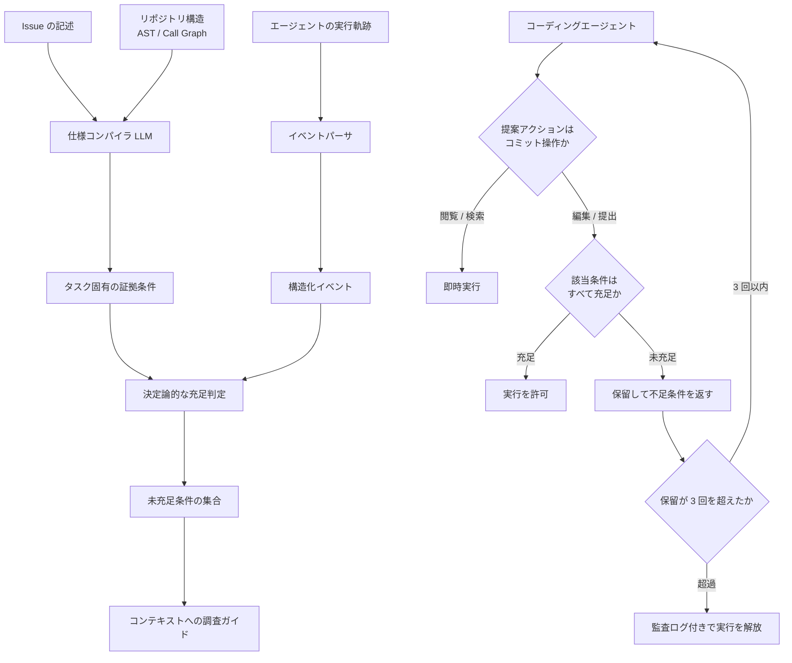

## この記事の対象と得られるもの

LLM コーディングエージェントを実務に組み込むと、次の失敗が繰り返し起きます。

- 編集対象の関数だけを見て、呼び出し元を確認せずにパッチを当てる
- 既存テストの意図を読まずに書き換え、別の箇所を壊す
- 壊れた前提のまま試行錯誤を続け、トークンを浪費する

これを「拙速なコミット(Premature Commitment)」と呼びます。2026 年 7 月公表の論文 [arXiv:2607.28815] は、この問題をプロンプトではなく**実行層**で解く手法 **ECLoop** を提案しました。

この記事では次を扱います。

- なぜ「先に調査せよ」というプロンプト指示が効かないのか
- ECLoop が何を機械判定し、どこで編集を止めるのか
- SWE-bench Verified での効果と、報告されている限界
- 自分のエージェント基盤(Claude Code / Codex CLI / 自作ハーネス)へ持ち込むときの設計指針

対象読者は、コーディングエージェントの品質とコストを運用で管理する立場の方です。


*この記事の全体像。以下、順に解説します。*

## なぜプロンプトでの指示では止まらないのか

「編集前に呼び出し元をすべて確認せよ」とシステムプロンプトへ書いても、エージェントはそれを守る義務を負いません。プロンプトは**行動選択への助言**であって、実行の前提条件ではないためです。エージェントが「十分に調査した」と内部で判断すれば、その時点で編集ツールが呼ばれます。

既存の対策にも構造的な限界があります。

| アプローチ | 何をするか | 限界 |
| :--- | :--- | :--- |
| プロンプト指示 | 調査手順を文章で伝える | エージェントが自己判断で無視できる |
| パイプラインゲート(EviACT, SWE-Doctor 等) | 再現テスト成功など固定ステップを検証 | Issue ごとに異なる調査要件へ対応できない |
| 事後の自己修正(Self-Refine) | 提出後にセルフレビューさせる | 誤った前提の上での反省は元に戻せない |

論文が指摘する要点は、**「調査したか」の判定をエージェント自身に委ねている限り強制力が生まれない**ことです。ECLoop はこの判定主体を、エージェントの外側へ移します。

## ECLoop は何をしているのか

ECLoop はエージェントとリポジトリの間に挟まる**実行制御層(Execution Control Layer)**です。モデルの再学習も、エージェントの行動ポリシーの変更も必要としません。ツール実行の直前に割り込み、条件を満たさない操作を保留します。

動作は 3 つのフェーズに分かれます。



### フェーズ 1: タスクごとに証拠条件を作る

固定ルールを押し付けるのではなく、Issue の文章とリポジトリの構造情報(AST、Call Graph、クラス階層)から、そのタスクで必要な観測条件を生成します。たとえば「関数 `f` を編集する前に、その全呼び出し元を閲覧する」といった条件です。

生成された抽象条件は、実在するファイルパスや関数名へ**グラウンディング**され、具体的な検証対象に変換されます。ここが固定ゲートとの決定的な差です。

各条件は 4 要素で表現されます。

| 要素 | 内容 |
| :--- | :--- |
| 対象アクション種別 | `Edit` / `Submit` などコミット操作の種類 |
| 対象エンティティ | 具体的な関数名・クラス・ファイルパス |
| 検出すべきイベント | `FileView(対象)` や `TestRun(再現テスト)` などのパターン |
| 充足判定 | 現在の観測イベント集合に対する 0/1 の決定論的判定 |

### フェーズ 2: 実行軌跡から観測事実を追跡する

エージェントの「十分調査しました」という自己申告は使いません。ファイル閲覧ログ、検索コマンド、テスト実行結果といった**実行軌跡をパースし、決定論的な述語で**充足状態を更新します。LLM による曖昧な要約は挟みません。

この時点で未充足の条件全体を**グローバルギャップ**と呼び、自然言語のガイドに変換してエージェントのコンテキストへ渡します。これは「次にどこを調べるべきか」の道案内です。

### フェーズ 3: コミット操作だけを厳格に止める

すべての操作を止めるわけではありません。閲覧・検索・診断は素通しします。

編集やパッチ提出などのコミット操作が提案されたときだけ、そのアクションに直接適用される条件を抜き出した**アクション別ギャップ**を評価します。

- 空であれば実行を許可する
- 空でなければ実行を保留し、不足している条件をエージェントへ返す

グローバルギャップ(ガイド用)とアクション別ギャップ(遮断用)を分けている点が設計の要です。全条件を満たすまで一切編集させない設計にすると、無関係な条件でデッドロックします。

### デッドロックを避けるフォールバック

同一ターゲットに対する保留が **3 回**に達すると、ECLoop は監査ログを残したうえで実行を解放します。条件を満たすツール操作がそもそも実行できないケース(複雑な呼び出し関係の特定など)で、エージェントが同じ編集を延々と提案し続ける状態を避けるためです。

## 効果はどれくらいか

評価は SWE-bench Verified の全 500 件に対し、2 種類のモデル(MiniMax-M2.5 の high reasoning effort、GPT-5-mini)と 2 種類のハーネス(mini-swe-agent v2、OpenAI Codex CLI v0.144.4)の組み合わせで実施されています。

### 解決率(Pass@1)

| ハーネス | モデル | Baseline | ECLoop | 差分 | 新規解決 | 回帰 |
| :--- | :--- | :--- | :--- | :--- | :--- | :--- |
| mini-swe-agent v2 | GPT-5-mini | 56.2% | 68.0% | +11.8 pp | 68 件 | 9 件 |
| mini-swe-agent v2 | MiniMax-M2.5 | 75.8% | 80.6% | +4.8 pp | 33 件 | 9 件 |
| Codex CLI v0.144.4 | GPT-5-mini | 40.4% | 50.8% | +10.4 pp | 68 件 | 16 件 |
| Codex CLI v0.144.4 | MiniMax-M2.5 | 74.8% | 79.8% | +5.0 pp | 35 件 | 10 件 |

いずれも McNemar 検定で有意差が報告されています(GPT-5-mini 構成は $p < 0.001$、MiniMax-M2.5 構成は $p < 0.01$)。

読み取るべき点は 2 つあります。

1. **伸びは元の性能に依存する**。Baseline が低い GPT-5-mini 構成で +10 pp 超、もともと強い MiniMax-M2.5 構成では +5 pp 前後です。弱いモデルほど拙速なコミットで損をしていた、という解釈になります。
2. **回帰はゼロではない**。新規に解けたタスクの裏で、9〜16 件は Baseline で解けていたのに失敗へ転じています。ゲートは純粋な上乗せではありません。

### トークンとコスト

追加の仕様コンパイル呼び出しを行うにもかかわらず、4 構成すべてで平均トークン数とコストが減っています。

| ハーネス | モデル | 平均トークン(Baseline → ECLoop) | 削減率 | 平均コスト(Baseline → ECLoop) |
| :--- | :--- | :--- | :--- | :--- |
| mini-swe-agent v2 | GPT-5-mini | 421k → 370k | -12.1% | $0.59 → $0.53 |
| mini-swe-agent v2 | MiniMax-M2.5 | 512k → 493k | -3.8% | $0.81 → $0.78 |
| Codex CLI v0.144.4 | GPT-5-mini | 390k → 369k | -5.4% | $0.55 → $0.52 |
| Codex CLI v0.144.4 | MiniMax-M2.5 | 485k → 478k | -1.4% | $0.77 → $0.76 |

根拠のない編集が引き起こすデバッグループを未然に断つ効果が、コンパイル分のコストを上回った形です。ここも Baseline が弱い構成ほど削減幅が大きくなっています。

### 事後の自己修正との比較

パッチ提出後に 3 回のセルフレビューを行わせる Self-Refine を適用した場合、mini-swe-agent v2 では Pass@1 が GPT-5-mini で 54.4%(-1.8 pp)、MiniMax-M2.5 で 74.4%(-1.4 pp)と、いずれも低下しています。

誤った証拠の上に建てた修正は、後から反省させても元に戻らない、という結果です。介入位置は**提出後ではなくコミット直前**である必要があります。

## どの部品が効いているのか

GPT-5-mini と 100 件のランダムサブセットによるアブレーション結果です。

| 構成 | 解決数 | Full からの差 |
| :--- | :--- | :--- |
| Full ECLoop | 68 件 | — |
| コミットチェックなし(提示のみ) | 58 件 | -10 pp |
| 証拠状態の更新なし | 59 件 | -9 pp |
| グローバルギャップの提示なし | 63 件 | -5 pp |
| 状態を自然言語要約で渡す | 58 件 | -10 pp |

ここから 3 つの設計原則が読み取れます。

1. **遮断しないなら効果は消える**。ギャップを提示するだけでは、エージェントは無視して編集を強行します(-10 pp)。情報提供と強制は別物です。
2. **状態更新は必須**。観測に応じて充足状態を更新しないと、すでに見た情報を未充足と誤認識してエージェントを混乱させます(-9 pp)。
3. **自然言語要約では機能しない**。構造化された述語ではなくフリーテキストで状態を渡すと、曖昧化によってチェックの効果が失われます(-10 pp)。ガードレールの判定材料に LLM の要約を挟むと、強制力そのものが溶けます。

## 導入時に踏むべき限界

論文が挙げる制約は、そのまま実務の設計課題になります。

### Issue の品質に依存する

証拠条件は Issue の文章とコード構造から生成されます。Issue が曖昧・不完全・誤導的であれば、不適切な条件が生成されたり、必要な条件が脱落します。

対策として、ECLoop の前段に Issue の構造化・要件整理ステップを置くことが推奨されています。エージェント基盤へ組み込むなら、チケットのテンプレート整備が実質的な前提工程になります。

### 保留上限(3 回)の副作用

回帰した 9〜16 件を分析すると、主因は次の 2 つでした。

- 保留予算が尽きて、条件が未充足のままフォールバック実行されたケース
- 不要な条件を提示された結果、探索の軌跡が乱れたケース

保留上限はデッドロック回避のために必要ですが、同時に「不十分な状態での通過」を生みます。**監査ログを取るだけでなく、フォールバック実行された件数を運用指標として監視する**設計が要ります。

### 同じモデルを検証側に使うバイアス

証拠仕様を生成するモデルとコードを書くモデルが同一だと、そのモデル固有の盲点が条件生成にも反映されます。仕様コンパイラ側に別系統のモデルを使うか、AST / LSP ベースの静的解析器をハイブリッドで組み込む設計が改善方向として示されています。

## 自分のエージェント基盤へどう持ち込むか

ECLoop 自体を導入しなくても、考え方は既存のハーネスへ移植できます。

### 1. 指示ではなくフックで止める

`First inspect caller functions before editing` とプロンプトへ書くのをやめ、ハーネスのフック機構(Claude Code の `PreToolUse`、Codex CLI の Hook など)で実行層に割り込みます。判定主体をエージェントの外へ出すことが本質です。

```python
# エージェントハーネスの擬似インターポーザ
def pre_tool_execution_hook(tool_name: str, tool_args: dict, context: AgentContext):
    if is_commitment_action(tool_name):  # edit_file, apply_patch, submit など
        target_entity = extract_target_entity(tool_name, tool_args)
        unmet = context.evidence_tracker.get_unmet_conditions(target_entity)

        if unmet:
            hold_count = context.increment_hold_count(target_entity)
            if hold_count <= 3:
                # 編集をブロックし、不足している観測条件を返す
                return BlockExecution(
                    reason="Premature Commitment Blocked "
                           f"({hold_count}/3). Missing evidence:\n"
                           + "\n".join(f"- {c.description}" for c in unmet)
                )
            log_audit_warning(f"Fallback released after 3 holds for {target_entity}")

    return AllowExecution()
```

このコードは論文の設計を説明するための擬似コードで、そのままでは動きません。実装時は `evidence_tracker` の充足判定を、LLM ではなく決定論的な述語で書く点だけは崩さないでください。アブレーションが示すとおり、そこを要約に置き換えると効果が消えます。

### 2. 観測契約はアクション種別ごとに分ける

すべての編集を一律に重くブロックすると、デッドロックと待ち時間だけが増えます。

| 変更の種類 | 課すべき観測条件 |
| :--- | :--- |
| 新規関数・独立モジュールの追加 | 要件の明文化、再現テストの存在 |
| 既存コアロジックの変更 | Call Graph による呼び出し元の閲覧ログ、既存テストの非破壊確認 |
| ドキュメント / 単純リファクタリング | 条件を緩和、またはバイパス |

### 3. 効果を測る指標を先に決める

導入判断のために、少なくとも次を取ります。

- 保留(Hold)の発生回数と、そのうちフォールバック実行へ至った割合
- 保留後に条件が充足された割合(ガイドが機能しているか)
- 変更あたりの平均トークン数とコストの差分
- Baseline で成功していたタスクの回帰件数

論文の結果は「回帰を含めた差し引きで勝つ」ことを示しているだけで、回帰がないとは言っていません。自分の環境で差し引きを測れる状態にしてから広げるのが安全です。

## まとめ

- 拙速なコミットは、エージェントが「調査したか」を自己判断していることに起因する。プロンプト指示では強制力が生まれない
- ECLoop は判定主体を実行層へ移し、Issue とリポジトリ構造からタスク固有の証拠条件を生成、実行軌跡を決定論的に検証して、編集・提出だけを保留する
- SWE-bench Verified 全 500 件で Pass@1 が +4.8〜11.8 pp、トークンは最大 -12.1%。Baseline が弱い構成ほど効果が大きい
- 提示だけでは -10 pp、状態を自然言語要約に置き換えても -10 pp。遮断すること、判定を構造化述語で行うことが効果の中核
- 限界は Issue 品質への依存、保留上限 3 回によるフォールバック通過、検証側に同一モデルを使うバイアスの 3 点
- 自分の基盤へ持ち込むなら、フックでの遮断・アクション種別ごとの観測契約・回帰件数を含む効果測定の 3 点から始める

この記事が少しでも参考になった、あるいは改善点などがあれば、ぜひリアクションやコメント、SNSでのシェアをいただけると励みになります！

## 参考リンク

1. [arXiv:2607.28815](https://arxiv.org/abs/2607.28815) ECLoop: Preventing Premature Commitment in Coding Agents with an Evidence-Conditioned Execution Layer (2026)
2. [arXiv:2605.07769](https://arxiv.org/abs/2605.07769) Gloaguen et al. Coding agents don't know when to act (2026)
3. [arXiv:2605.27238](https://arxiv.org/abs/2605.27238) Meng et al. EviACT: an evidence-to-action framework for agentic program repair (2026)
4. [arXiv:2503.18666](https://arxiv.org/abs/2503.18666) Wang et al. AgentSpec: customizable runtime enforcement for safe and reliable LLM agents (2025)
5. Madaan et al. Self-Refine: Iterative Refinement with Self-Feedback (NeurIPS 2023)
6. Jimenez et al. SWE-bench: Can Language Models Resolve Real-World Software Engineering Problems? (ICLR 2024)
