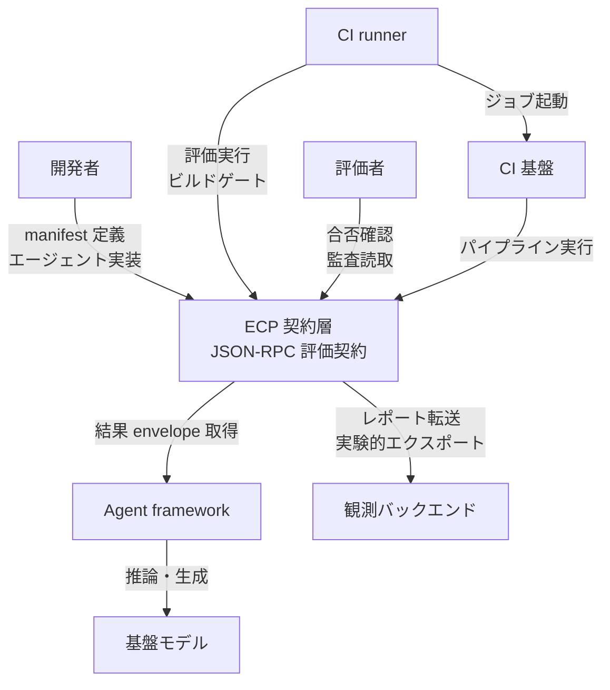
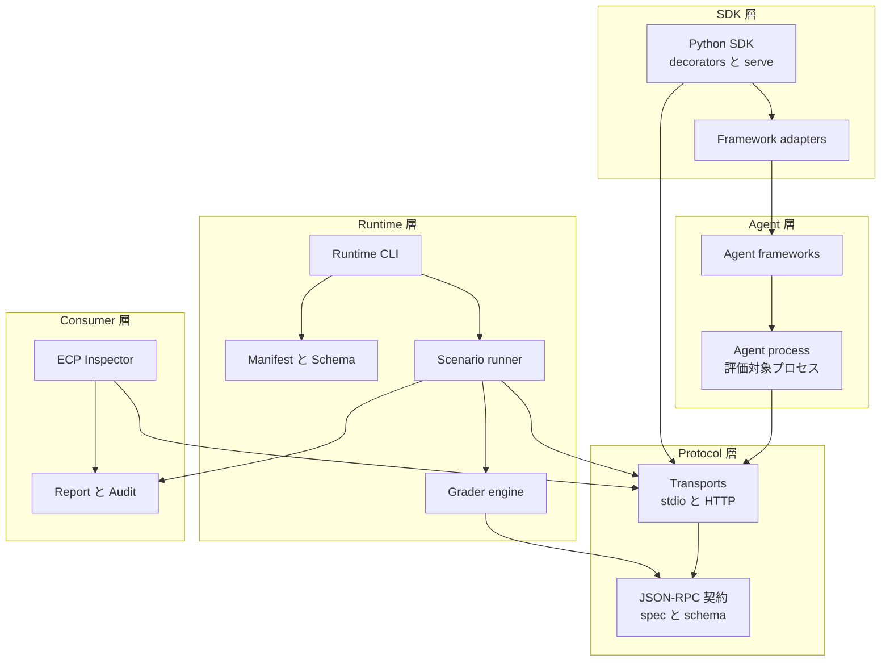
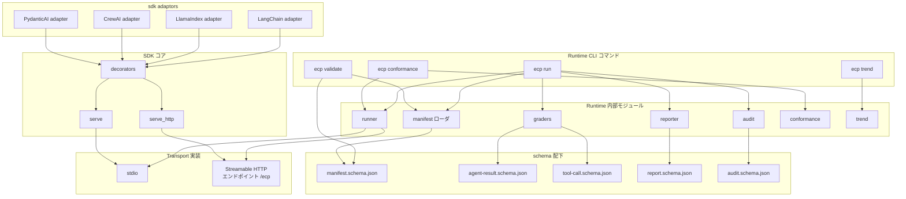
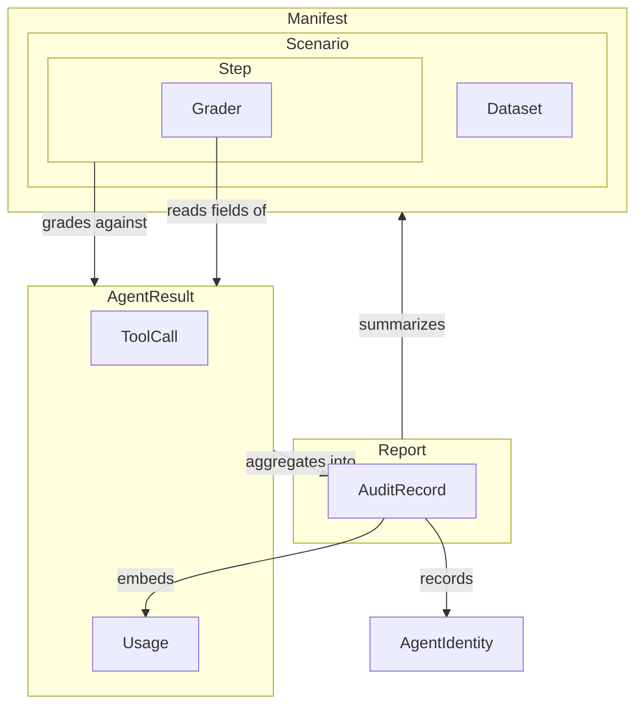
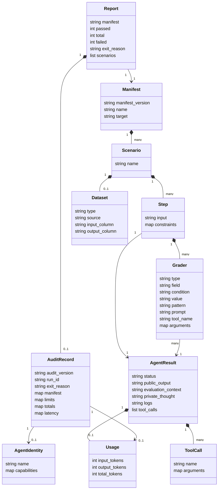

Evaluation Context Protocol（ECP）は、AI エージェントの評価を「フレームワークに依存しない JSON-RPC の契約」として定義する提案です。2026-08-18 に arXiv へ公開された論文 [The Evaluation Context Protocol (ECP): A Portable Contract for AI Agent Evaluation](https://arxiv.org/abs/2608.19263) と、Apache-2.0 の参照実装 [evaluation-context-protocol/ecp](https://github.com/evaluation-context-protocol/ecp) がセットになっています。

この記事では、ECP の契約面・内部構造・データモデルを整理し、実際に `ecp` CLI を CI へ組み込むところまでを扱います。あわせて、論文が主張する範囲と参照実装が実際にできることの差分、および現時点で期待してはいけない機能も明示します。

記述はすべて 2026-08-22 時点の参照実装（パッケージ線 `0.9.0`）を基準にしています。

## ECP とは何か

ECP は、エージェントが返す 3 つの情報を、フレームワーク横断で同じ形に揃えて検査するための契約層です。

- `public_output` — ユーザーに見える最終出力
- `tool_calls` — エージェントが宣言したツール呼び出し列
- `evaluation_context` — 評価者向けの監査文脈

論文の出発点は、静的ベンチマークと最終出力だけの採点では、不正な経路・ショートカット・実行ごとの一貫性不足を見逃すという問題意識です。ツール実行面は MCP が共通言語になりつつある一方、評価面には同等の契約が無い。ECP はその欠落を、小さな JSON-RPC インタフェースと宣言的な manifest で埋めようとします。

### 現行の契約面

| 契約要素 | 現状 |
|---|---|
| メソッド | `agent/initialize` / `agent/step` / `agent/reset` |
| 採点フィールド | `public_output` / `tool_calls` / `evaluation_context` |
| 付帯フィールド | 契約上の必須 `status`（`done` / `paused`）、任意の `logs` / `usage` |
| Transport | stdio（既定）、Streamable HTTP（慣習エンドポイント `/ecp`） |
| Grader | `text_match` / `llm_judge` / `tool_usage` |
| Adapter | LangChain / LlamaIndex / CrewAI / PydanticAI |
| CLI | `run` / `validate` / `init` / `conformance` / `doctor` / `trend` |

### MCP との関係

ECP と MCP は競合せず、直交する面を担当します。


| 要素名 | 説明 |
|---|---|
| 実行面 MCP | エージェントが外部ツールへ到達する共通契約 |
| 評価面 ECP | 評価者・CI が出力・ツール・監査文脈を検査する共通契約 |
| 観測プラットフォーム | トレース保管・可視化・実験管理。ECP の供給先 |

ECP は観測バックエンド・ベンチマークコーパス・本番オーケストレータを置き換えるものではありません。

### 論文の主張と参照実装の現状

採用判断で最も重要なのは、論文が語る設計と、いま動く実装の差です。

| 観点 | 論文の主張 | 参照実装の現状（2026-08-22） |
|---|---|---|
| 成熟度 | 完成した標準ではなく議論の起点 | Experimental バッジ。動く参照実装はある |
| 評価面 | 暫定。失敗モードからの逆算 | 3 採点フィールドに加え `status` / `logs` / `usage` |
| 移植性 | 契約とオーケストレータの分離 | 4 フレームワークの薄い adapter |
| 観測連携 | 観測基盤を置換せず供給する | `--export langsmith` のみ。一般化は計画段階 |
| OTel 連携 | GenAI semantic conventions への写像を計画 | 未完了 |
| 実証 | 設計と成果物の提示 | fault injection / 相互運用 / オーバーヘッド測定は未実施 |
| authority limits | 設計議論と roadmap | 現行 grader に `policy_check` は無い |

### 先行研究との位置関係

| 系譜 | 関係 |
|---|---|
| MCP | 実行プレーンの標準。ECP は評価プレーンの対になる候補 |
| AgentBench / GAIA / SWE-bench / WebArena | インタラクティブ・軌跡評価の先行。ECP はタスク集ではなく契約層 |
| [Kapoor et al. *AI Agents That Matter*](https://arxiv.org/abs/2407.01502) | holdout 不足とショートカットによる見かけの成功の脆さ。held-out 分離の根拠 |
| pass@k と pass^k | ピーク能力と本番一貫性のギャップ。現行 ECP は単発実行の合否が主 |
| LLM-as-a-judge のバイアス | 論文が引用する position / verbosity バイアスの数値は 2024 年の GPT-3.5 世代を対象にした歴史的ベースラインです。2026 年のモデルへそのまま当てはめません |
| [MAESTRO](https://arxiv.org/abs/2601.00481) | マルチエージェント系は構造が安定でも時間変動が大きく、アーキテクチャがモデル差より支配的になり得る |
| LangSmith / Langfuse / Phoenix | 観測・実験 UI。ECP はゲート契約として供給する側 |

## 特徴と類似技術との比較

ECP の性質を、実装できることベースで並べます。

- ベンダー中立の評価契約として、エージェント結果を JSON-RPC 2.0 で露出する。
- 最終出力・ツール呼び出し列・監査文脈を独立に採点できる。
- 必須ツールの呼び出し漏れや引数の不一致があれば、最終出力が正しくてもシナリオを失敗にできる。ただし `tool_usage` は肯定チェックのみで、禁止ツールを呼んだことを理由に落とす grader はありません。
- 監査文脈は evaluator-safe な正当化でよく、生の推論トレース開示は必須ではない。
- plain Python と主要フレームワークを同一契約へ寄せられる。
- manifest YAML でシナリオと grader を宣言できる。
- ローカル実行と CI 実行を同じ契約で扱える。
- HTML / JSON レポートと構造化 audit を出せる。
- conformance harness で独立実装の適合を確認できる。
- pytest fixture で既存の Python テストへ段階導入できる。
- CSV / JSONL データセットからシナリオを展開できる。
- RPC 単位と wall-clock の実行上限を持てる。
- 障害時は失敗として記録しつつ後続シナリオへ進み、レポートを残す。
- 保存済みレポート列から pass-rate の回帰シグナルを取れる。

### 類似ツールとの比較

| 技術 | 実行方式 | 評価契約の分離 | 対応機能 | CI 接続 |
|---|---|---|---|---|
| ECP | JSON-RPC。stdio または Streamable HTTP。runtime がエージェントを駆動 | 契約をプラットフォームから分離。manifest でシナリオ定義 | 出力・ツール・監査文脈の独立採点。レポート。audit。conformance | 失敗時に非ゼロ終了。pytest。trend |
| MCP | エージェントとツールの標準接続 | 実行契約に特化 | ツール到達・セッション境界 | 実行面の接続が主 |
| LangSmith | ホスト型の観測・評価 | 契約はプラットフォーム内に閉じがち | トレース再生・データセット・judge | プラットフォーム機能経由 |
| Langfuse | OSS / セルフホスト中心の観測 | トレース上にスコアを載せる | トレース・prompt・judge | パイプライン組立が前提 |
| Arize Phoenix | OTel ネイティブ寄りの観測 | テレメトリ規約に寄せる | トレース・メタ評価 | 観測基盤側の連携 |
| OpenTelemetry GenAI | 計装規約 | テレメトリ語彙に特化 | LLM・ツール・エージェントのスパン語彙 | 収集の土台 |
| Eval Protocol | 既存エージェントの RL ロールアウト接続 | trainer 接続が主 | ロールアウト API | 学習パイプライン中心 |

### ユースケース別の選び方

| ユースケース | 推奨 | 理由 |
|---|---|---|
| 複数フレームワークで同じ評価契約を CI に載せる | ECP | 契約と runtime がオーケストレータから分離される |
| ツール接続だけを標準化する | MCP | 実行面の共通契約に特化する |
| LangChain 系の深いトレースと実験 UI | LangSmith | エコシステム密結合の観測が強い |
| セルフホストとデータ主権を優先する | Langfuse | OSS / 自前運用の観測が強い |
| ベンダー中立のトレース送出 | OpenTelemetry GenAI | 観測データ平面の共通語彙になる |
| 本番エージェントへの強化学習接続 | Eval Protocol | RL ロールアウトが主目的 |
| タスク難易度のコミュニティ比較 | 専用ベンチマーク | コーパス選定はベンチマーク側の責務 |
| 観測ダッシュボードと契約ゲートの併用 | ECP + 観測プラットフォーム | 契約でゲートし、トレースは観測側で扱う |

## 構造

ECP の層構成は、論文 Fig. 2 の Agent → SDK → Protocol → Runtime → Consumer と、リポジトリの `sdk/` / `runtime/` / `schema/` / `spec/` / `client/` / `server/` が対応します。以下では C4 の 3 段階で整理します。

### システムコンテキスト

開発者・CI runner・評価者と、ECP 契約層、および外部のエージェント実行基盤・基盤モデル・観測バックエンド・CI 基盤との関係です。



| 要素名 | 説明 |
|---|---|
| 開発者 | 評価対象エージェントを実装し、manifest でシナリオと grader を定義する利用者 |
| CI runner | プルリクエストや定期ジョブで ECP 評価を起動し、終了コードをビルドゲートに使う実行主体 |
| 評価者 | HTML / JSON レポートと audit 記録を読む人、または監査プロセス |
| ECP 契約層 | 出力・ツール呼び出し・監査文脈をフレームワーク横断で検査する JSON-RPC 契約 |
| Agent framework | 評価対象エージェントを構成するオーケストレーション基盤 |
| 基盤モデル | エージェントの推論と、`llm_judge` が参照する二次モデルの実行先 |
| 観測バックエンド | 評価結果の転送先として接続可能なトレース・分析基盤 |
| CI 基盤 | ホストされた継続的インテグレーション環境 |

grader engine はこの粒度では ECP 契約層（runtime）の責務に含まれます。次のコンテナ図で独立コンテナとして現れます。

### コンテナ

各層は直下の契約だけに依存します。SDK と runtime は参照実装であり、契約そのものは JSON-RPC なので、適合する任意言語の実装が参加できます。



| 層 | 要素 | 説明 |
|---|---|---|
| Agent | Agent process | runtime が起動または接続する評価対象プロセス |
| Agent | Agent frameworks | Plain Python、LangChain、LlamaIndex、CrewAI、PydanticAI、独自 runtime 上の実装 |
| SDK | Python SDK | `@agent` / `@on_step` / `@on_reset` と `serve` / `serve_http`。配置は `sdk/python/` |
| SDK | Framework adapters | 既存フレームワークの実行結果を単一の `Result` へ正規化する薄い変換層 |
| Protocol | JSON-RPC 契約 | `agent/initialize` / `agent/step` / `agent/reset`。正本は `spec/`、機械可読契約は `schema/` |
| Protocol | Transports | 既定の stdio と、慣習エンドポイント `/ecp` の Streamable HTTP |
| Runtime | Runtime CLI | `ecp` エントリポイント。配置は `runtime/python/src/ecp_runtime/` |
| Runtime | Manifest と Schema | YAML を読み、公開 JSON Schema と整合する pydantic モデルで検証 |
| Runtime | Scenario runner | シナリオ単位で RPC を進め、実行境界を適用し envelope を grader へ渡す |
| Runtime | Grader engine | `text_match` / `llm_judge` / `tool_usage` を実行 |
| Consumer | Report と Audit | HTML / JSON レポートと、run_id・manifest digest・`exit_reason` を含む構造化 audit |
| Consumer | ECP Inspector | ローカル UI（`client/`）とプロキシ（`server/`） |

### コンポーネント

CLI コマンド・runtime 内部モジュール・schema ファイル・adapter・transport の依存関係です。



CLI コマンドの責務です。`init` と `doctor` は runner も manifest ローダも使わないため、図では省いています。

| コマンド | 説明 |
|---|---|
| `ecp run` | manifest に基づきエージェントを駆動し、grader を適用してレポートと audit を生成 |
| `ecp validate` | エージェントを起動せず、pydantic モデルで manifest を検証 |
| `ecp conformance` | 候補実装がプロトコルメソッドへ正しく応答するかを確認 |
| `ecp trend` | 保存済み JSON レポート列から合格率の回帰信号を算出 |
| `ecp init` | スターターの `agent.py` と `manifest.yaml` をファイルへ直接書き出す |
| `ecp doctor` | Python・作業ディレクトリ・API キーの有無・git を表示する |

runtime 内部モジュールと schema の対応です。

| モジュール | 説明 | 主に参照する schema |
|---|---|---|
| manifest ローダ | YAML を読み、シナリオと grader 設定を内部表現へ展開 | `manifest.schema.json` |
| runner | エージェントへ RPC を送り、実行境界と劣化記録を管理 | — |
| graders | 宣言された検査を result envelope へ適用 | `agent-result.schema.json` / `tool-call.schema.json` |
| reporter | HTML および JSON レポートを組み立て | `report.schema.json` |
| audit | run_id・digest・latency・`exit_reason` を純関数的に構築 | `audit.schema.json` |
| conformance | initialize / step / reset の応答形を検証 | — |
| trend | 複数レポートから回帰信号を計算 | — |

adapter は各フレームワークの実行結果を `Result` へ写します。

| Adapter | 実装方式 |
|---|---|
| LangChain | `BaseCallbackHandler` として実行時の LLM 生成と tool イベントを捕捉 |
| LlamaIndex | workflow 型の async 実行を同期 step インタフェースへ橋渡し |
| CrewAI | crew の kickoff 結果を ECP 結果オブジェクトへ写像 |
| PydanticAI | 構造化 message history から tool 呼び出しと推論文脈を抽出 |

adapter が薄い翻訳であることが移植性の根拠です。一方で、各フレームワークの中間推論の露出度が異なるため、`evaluation_context` は構造化された証跡ではなく、捕捉テキストの連結になり得ます。構造化スキーマ化は未完了の課題です。

TypeScript SDK は `sdk/typescript/package.json` があるだけで、ツリー上にソースはありません（package 版 0.1.0）。論文の記述より実体は薄い状態です。

### JSON-RPC メソッド

契約面のメソッドは 3 つだけです。

| メソッド | パラメータ | 結果 |
|---|---|---|
| `agent/initialize` | `config`（任意） | `{ name, capabilities }`。capabilities は現状 informational |
| `agent/step` | `input`（string） | `status` / `public_output` / `evaluation_context` / `tool_calls`、任意で `logs` / `usage` |
| `agent/reset` | なし | `true` |

## データモデル

属性は `schema/*.schema.json` と SDK の `Result` dataclass を正とします。論文の散文との差分は後段で明示します。

### 概念モデル

入れ子は所有、矢印は利用を表します。



| 要素名 | 説明 |
|---|---|
| Manifest | 評価ランの契約定義。シナリオ集合と実行対象を所有 |
| Scenario | 1 つの評価シナリオ。手書きの Step 列、または Dataset 由来の入力展開のいずれかを所有 |
| Step | シナリオ内の 1 ターン。入力と採点器集合を所有 |
| Grader | Step に対する個別チェック |
| Dataset | Scenario の入力を外部の表形式から供給。steps の代替経路 |
| AgentResult | `agent/step` が返す結果エンベロープ |
| ToolCall | エージェントが宣言したツール呼び出し 1 件 |
| Usage | ステップ単位のトークン会計 |
| Report | ラン全体の合否要約 |
| AuditRecord | 実行テレメトリの監査記録 |
| AgentIdentity | `agent/initialize` が返す識別情報 |

### 情報モデル

所有は `*--`、利用は `-->` です。



### Manifest と Scenario と Step

| エンティティ | 属性 | 備考 |
|---|---|---|
| Manifest | `manifest_version` | 必須。const `v1` のみ |
| Manifest | `name` | 必須。評価スイート名 |
| Manifest | `target` | 必須。起動コマンドまたは HTTP エンドポイント |
| Scenario | `name` | 必須 |
| Scenario | `steps` / `dataset` | `anyOf` でいずれかが必須 |
| Step | `input` | 必須。`agent/step` に渡す入力 |
| Step | `constraints` | 任意。自由形式 |
| Step | `graders` | Grader の所有集合 |

### Grader

| 属性 | 型 | 備考 |
|---|---|---|
| `type` | string | enum: `text_match` / `llm_judge` / `tool_usage` |
| `field` | string | enum: `public_output` / `evaluation_context` / `private_thought`。`text_match` と `llm_judge` が対象。`tool_usage` では不要 |
| `condition` | string | `text_match` で必須。`contains` / `equals` / `does_not_contain` / `regex` |
| `value` | string | `regex` 以外の `text_match` で必須 |
| `pattern` | string | `condition` が `regex` のとき必須 |
| `prompt` | string | `llm_judge` で必須 |
| `assertion` | string | 任意 |
| `tool_name` | string | `tool_usage` 向け |
| `arguments` | map | `tool_usage` の引数部分集合照合 |

### AgentResult と ToolCall と Usage

論文の散文が採点対象として挙げるのは `public_output` / `tool_calls` / `evaluation_context` と任意の `logs` です。機械可読契約である `agent-result.schema.json` は、これに加えて `status` と `usage` を定義します。しかも唯一の必須フィールドは `status` です。論文だけを読んで実装すると、この差分を取りこぼします。

| 属性 | 型 | 備考 |
|---|---|---|
| `status` | string | 必須。enum: `done` / `paused`。`paused` の意味論は仕様上まだ薄い |
| `public_output` | string | ユーザー可視の最終出力。nullable |
| `evaluation_context` | string | 評価者向け監査文脈。nullable |
| `private_thought` | string | deprecated。`evaluation_context` と相互同期 |
| `tool_calls` | list | ToolCall 集合。nullable |
| `logs` | string | 任意。専用の grader 家族は未整備 |
| `usage` | Usage | 観測できない場合は 0 埋めではなく省略 |

ToolCall は `name`（必須）と `arguments`（任意の map）で、`additionalProperties` は true です。Usage は `input_tokens` / `output_tokens` / `total_tokens` の非負整数で、未観測ならフィールドごと省略します。

### Report と AuditRecord

Report で注意すべき点は集計単位です。runner の集計処理により、`passed` と `total` は **シナリオ数ではなく check 件数** を数えます。シナリオ 1 件に grader を 5 個書けば、`total` は 5 増えます。

| エンティティ | 属性 | 備考 |
|---|---|---|
| Report | `manifest` / `passed` / `total` / `failed` | `failed` は `total - passed` |
| Report | `exit_reason` | ラン終了理由 |
| Report | `scenarios` | シナリオ単位の結果 |
| Report | `audit` | AuditRecord の任意埋め込み |
| AuditRecord | `audit_version` / `run_id` | 必須 |
| AuditRecord | `exit_reason` | enum: `ok` / `timeout` / `transport_error` / `protocol_error` / `agent_error` / `max_duration_exceeded` / `error` |
| AuditRecord | `manifest.digest` | `sha256:` + hex。入力の固定化に使う |
| AuditRecord | `totals` | `steps_planned` / `steps_executed` / `steps_failed` / `steps_skipped` / `checks_*` |
| AuditRecord | `latency` | 実行済み step のみ集約 |
| AuditRecord | `usage` | 報告が無い場合は null |
| AuditRecord | `agent` | initialize 結果の埋め込み。capabilities は informational |

### 論文と実装の差分

| 項目 | 論文 | 実装 schema / SDK |
|---|---|---|
| 結果エンベロープ | 3 採点フィールド + 任意 `logs` | 上記に加え `status` / `usage` / deprecated な `private_thought` |
| `manifest_version` | 散文では明示しない | const `v1` |
| grader type | 家族として言及 | enum 3 種 |
| `Report.passed` | 成果物として言及 | check 件数 |

## 導入手順

### 前提

- Python は `>=3.9`。
- CLI エントリポイントは `ecp`。
- サブコマンドは `run` / `validate` / `doctor` / `init` / `conformance` / `trend` のみ。
- `llm_judge` を使う場合は `OPENAI_API_KEY` が必要。

### インストール

現行線は 0.9.0 です。公式ドキュメントの quickstart には 0.7.0 の pin が残っていますが、PyPI の現行版が正です。

```bash
pip install "ecp-runtime==0.9.0" "ecp-sdk==0.9.0"
```

フレームワーク別の extras です。

```bash
pip install "ecp-sdk[langchain]==0.9.0"
pip install "ecp-sdk[crewai]==0.9.0"
pip install "ecp-sdk[llamaindex]==0.9.0"
pip install "ecp-sdk[pydanticai]==0.9.0"
```

`ecp-sdk` 本体はゼロ依存です。extras は `crewai` / `langchain` / `llama-index` / `pydantic-ai` を引き込みます。`ecp-runtime` は typer / pyyaml / pydantic / rich / litellm / Jinja2 に依存します。

### バージョン確認

```bash
python -c "import importlib.metadata as m; print(m.version('ecp-runtime'), m.version('ecp-sdk'))"
ecp doctor
```

`ecp doctor` は Python 版・実行ファイル・作業ディレクトリ・`OPENAI_API_KEY` の有無・`git` の有無を表示するだけです。エージェントには接続しません。

### 初期プロジェクト作成

```bash
ecp init
ecp validate ecp_eval/manifest.yaml
ecp run --manifest ecp_eval/manifest.yaml
```

既存ファイルがある場合、`ecp init` は上書きせず終了します。上書きするには `--force` を付けます。

`init` が書き出すスターターは、`@agent` / `@on_step` / `@on_reset` / `Result` / `serve` の最小構成です。

```python
from ecp import Result, agent, on_reset, on_step, serve


@agent(name="StarterAgent")
class StarterAgent:
    def __init__(self):
        self.seen = []

    @on_step
    def step(self, user_input: str):
        self.seen.append(user_input)
        return Result(
            public_output=f"Echo: {user_input}",
            evaluation_context="The starter agent echoed the user input.",
            tool_calls=[{"name": "echo", "arguments": {"text": user_input}}],
        )

    @on_reset
    def reset(self):
        self.seen.clear()


if __name__ == "__main__":
    serve(StarterAgent())
```

## 利用方法

### 必須パラメータと既定値

| 項目 | 値 |
|---|---|
| `ecp run --manifest` / `-m` | 必須 |
| 失敗時の終了コード | `failed > 0` かつ `--fail-on-error`（既定 true）で **exit 2** |
| `OPENAI_API_KEY` | `llm_judge` 利用時に必要 |
| `ECP_LLM_JUDGE_MODEL` | 既定 `gpt-4o-mini` |
| `ECP_LLM_JUDGE_TEMPERATURE` | 既定 `0` |
| `--timeout` | 未指定時は `ECP_RPC_TIMEOUT`、それも無ければ 30 秒 |
| `--max-duration` | 未指定時は `ECP_MAX_DURATION`、未設定なら無制限 |
| `--export` | 実装は `langsmith` のみ |
| `ecp conformance --target` | 必須。失敗時 exit 1 |
| `ecp trend --exit-on-regression` | 回帰検出時 exit 2 |

### Manifest の検証と実行

公開契約は `schema/manifest.schema.json` で、必須項目は `manifest_version`（const `v1`）/ `name` / `target` / `scenarios` です。ただし `ecp validate` は schema ファイルを直接読むのではなく、それと整合する pydantic モデルで検証します。

```bash
ecp validate examples/customer_support_demo/manifest.yaml
ecp run --manifest examples/customer_support_demo/manifest.yaml --json
ecp run --manifest examples/customer_support_demo/manifest.yaml --report report.html
ecp run --manifest examples/customer_support_demo/manifest.yaml --json-out report.json
ecp run --manifest examples/customer_support_demo/manifest.yaml --audit-out ecp_audit.json
```

| オプション | 役割 |
|---|---|
| `--manifest` / `-m` | Manifest YAML のパス（必須） |
| `--report` | HTML レポート出力 |
| `--json-out` | JSON レポート保存 |
| `--json` | JSON を stdout へ |
| `--export langsmith` | LangSmith へエクスポート |
| `--fail-on-error` / `--no-fail-on-error` | 失敗時に非ゼロ終了（既定 on） |
| `--timeout` | 1 RPC あたりの秒数 |
| `--max-duration` | ラン全体の秒数上限 |
| `--audit-out` | audit ペイロードの単体保存 |

`target` は stdio 用のコマンド、または Streamable HTTP のエンドポイントです。

```yaml
target: "http://127.0.0.1:8765/ecp"
```

### grader を書く

参照実装のデモ manifest がそのまま実例になります。

```yaml
manifest_version: "v1"
name: "Customer Support Refund Policy"
target: "python examples/customer_support_demo/agent.py"

scenarios:
  - name: "Eligible refund uses order lookup and policy check"
    steps:
      - input: "I want a refund for order A100."
        graders:
          - type: text_match
            field: public_output
            condition: contains
            value: "eligible for a refund"
          - type: text_match
            field: evaluation_context
            condition: contains
            value: "refund_eligible=True"
          - type: llm_judge
            field: public_output
            prompt: "Does the output clearly state if the order is eligible for a refund? Must confirm eligibility."
          - type: tool_usage
            tool_name: "lookup_order"
            arguments:
              order_id: "A100"
          - type: tool_usage
            tool_name: "check_refund_policy"
            arguments:
              order_id: "A100"
```

grader の挙動です。

- `text_match` は指定フィールドへの文字列一致・不一致・正規表現。
- `llm_judge` は LiteLLM 経由で判定し、応答内の `RESULT: PASS` / `RESULT: FAIL` を読み取る。
- `tool_usage` は `tool_name` の完全一致と `arguments` の部分集合一致。照合時のツール名キーは `name` / `tool` / `id`、引数キーは `arguments` / `args` を順に試す。

この manifest 1 件で check は 5 件になります。前述のとおり Report の `total` はシナリオ数ではなく、この 5 を数えます。

### SDK でエージェントを実装する

```python
from ecp import Result, agent, on_step, serve


@agent(name="SupportAgent")
class SupportAgent:
    @on_step
    def step(self, user_input: str):
        return Result(
            public_output="Order A100 is eligible for a refund.",
            evaluation_context="Checked order A100 and confirmed it is inside the 30-day refund window.",
            tool_calls=[
                {"name": "lookup_order", "arguments": {"order_id": "A100"}},
                {"name": "check_refund_policy", "arguments": {"order_id": "A100"}},
            ],
        )


if __name__ == "__main__":
    serve(SupportAgent())
```

Streamable HTTP で待ち受ける場合は `serve_http` を使います。

```python
from ecp import serve_http

if __name__ == "__main__":
    serve_http(SupportAgent(), host="127.0.0.1", port=8765, path="/ecp")
```

### pytest から使う

`ecp-runtime` は pytest プラグインを登録するため、既存のテストへ段階的に混ぜられます。

```python
def test_customer_support(ecp_agent):
    result = ecp_agent.step("I need a refund")
    assert "refund" in result.get("public_output", "").lower()
```

```bash
pytest test_agent.py --ecp-target="python agent.py"
```

### conformance と trend

```bash
ecp conformance --target "python examples/customer_support_demo/agent.py"
ecp trend "results/run-*.json" --window 20 --exit-on-regression
```

### CI への組み込み

流れは、プルリクエスト → manifest 検証 → `ecp run` → grader 判定 → 非ゼロ終了でビルドを落とす、です。

参照実装リポジトリの `.github/workflows/ci.yml` は参照実装自身の unittest / ruff / mkdocs / package build であって、利用者向けのテンプレートではありません。利用者向けの YAML 例は公式の `docs/ci.md` にあります。

```yaml
name: ECP evals

on:
  pull_request:
  push:
    branches: [main]

jobs:
  evals:
    runs-on: ubuntu-latest
    steps:
      - uses: actions/checkout@v4
      - uses: actions/setup-python@v5
        with:
          python-version: "3.11"
      - run: pip install "ecp-runtime==0.9.0" "ecp-sdk==0.9.0"
      - run: ecp validate examples/customer_support_demo/manifest.yaml
      - run: |
          ecp run --manifest examples/customer_support_demo/manifest.yaml \
            --timeout 60 --max-duration 900 \
            --json-out ecp-report.json --audit-out ecp-audit.json
      - uses: actions/upload-artifact@v4
        if: always()
        with:
          name: ecp-report
          path: |
            ecp-report.json
            ecp-audit.json
```

## 運用

### 起動と実行順序

評価の起動単位は manifest です。runtime は `target` を spawn し、`agent/initialize` → 各 `agent/step` → シナリオ間の `agent/reset` を駆動します。

- 起動前に `ecp validate` を通す。
- 契約適合だけを見たいときは `ecp conformance` を使う。
- 既定では grader 失敗が 1 件以上あれば `ecp run` は exit 2。

```bash
ecp validate examples/customer_support_demo/manifest.yaml
ecp run --manifest examples/customer_support_demo/manifest.yaml \
  --timeout 60 --max-duration 900 \
  --json-out ecp-report.json --audit-out ecp-audit.json \
  --report report.html
```

### 実行境界と degrade

| 限界 | フラグ / 環境変数 | 既定 | 役割 |
|---|---|---|---|
| Per-RPC | `--timeout` / `ECP_RPC_TIMEOUT` | 30 秒 | 単一 RPC 応答の上限 |
| Wall-clock | `--max-duration` / `ECP_MAX_DURATION` | 未設定 | ラン全体の天井 |

限界超過・クラッシュ・プロトコル違反が起きても、ラン全体を abort せず degrade します。

1. 当該 step を failed として記録する。結果が返らなくても `execution` 系の failed check を最低 1 件付与する。
2. 同一シナリオの残り step を `skipped` にする。
3. 次のシナリオは新しいエージェントプロセスで継続する。
4. JSON / HTML / audit はラン末尾まで残す。

これは破壊的変更を伴う改善で、以前はハングがラン全体を殺し、レポート自体が欠落し得ました。現行はレポートに failed check が残ります。

### 状態確認

| 層 | 取得方法 | 見るもの |
|---|---|---|
| JSON report | `--json` / `--json-out` | `passed` / `total` / `failed` / `exit_reason` / `scenarios` / `audit` |
| Audit | report 内の `audit`、または `--audit-out` | run_id、manifest digest、limits、step ごとの latency と `exit_reason`、usage、totals |
| HTML report | `--report` | 人間向けのシナリオ別結果 |

step 級の `exit_reason` です。

| 値 | 意味 |
|---|---|
| `ok` | エージェントが応答し grader が実行された |
| `timeout` | RPC ごとの timeout 内に応答が無い |
| `transport_error` | クラッシュ・stream 切断・到達不能 |
| `protocol_error` | 応答はあるが仕様違反 |
| `agent_error` | JSON-RPC の error 応答 |
| `max_duration_exceeded` | wall-clock の予算超過 |
| `skipped` | 先行 step の失敗により未実行 |

ラン級の `exit_reason` には `skipped` がありません。`ok` / `timeout` / `transport_error` / `protocol_error` / `agent_error` / `max_duration_exceeded` / `error` の 7 値です。`ok` 以外なら degrade 済みと読みます。

読み違えを避ける要点は 1 つです。`steps_planned` と `steps_executed` の差は、その pass rate が意図より少ないステップ上で測られたことを意味します。合格率だけを見るとハングが成功に見えます。

### ログと版の追従

CLI は標準の logging を使い、既定 INFO、`--verbose` で DEBUG です。エージェント側の評価者向け実行ログは任意の `logs`、トークン会計は任意の `usage` で、観測できない場合は 0 ではなく省略します。

| ソース | 版（2026-08-22 時点） |
|---|---|
| PyPI `ecp-runtime` / `ecp-sdk`、README | 0.9.0 |
| 公式ドキュメントの quickstart | 0.7.0 と記載 |

### 回帰ゲート

```bash
ecp trend "results/run-*.json" --window 20 --exit-on-regression
```

これは pass^k の推定ではなく、集約 pass-rate に対する粗い第一歩と位置づけられています。

## ベストプラクティス

### CI での組み立て順

1. `ecp validate` で manifest 検証を先に通す。
2. `ecp conformance` で契約適合を分離して確認する。
3. `ecp run` に `--timeout` と `--max-duration` を必ず付ける。
4. `if: always()` で report / audit を artifact 化する。
5. 蓄積した JSON に `ecp trend ... --exit-on-regression` を掛ける。
6. `llm_judge` を使うときだけ secrets 経由で API キーを渡す。

決定的な grader（`text_match` / `tool_usage`）を先に通し、`llm_judge` は主観の残差に限定する tiered 構成が現実的です。ただし、安価な grader で高価な judge をゲートするネイティブな tiered 実行は roadmap であり、1 つの manifest に grader を並べても judge 呼び出しは省略されません。コストを実際に削るなら、決定的チェック用と `llm_judge` 用で manifest と CI ジョブを分け、前者が成功したときだけ後者を起動します。評価コストの目安として、LLM judge の費用を本番 LLM 費用の 10〜15% 以下に抑えるガードレールが提唱されています。これは評価スイート全体の実測値ではなく運用上の目安で、25% に近づいたらサンプリング削減か judge モデルの格下げを検討します。

### held-out を分離する

**誤解**: 評価セットの失敗信号でプロンプトを直接直せば、スコア上昇は汎化の改善を意味する。

**反証**: holdout 不足とショートカットにより、見かけの成功は脆いことが繰り返し示されています。開発中のセットに合わせ込むと、そのセット上でしか通らないエージェントができます。

**推奨**: 開発用セットと held-out ゲートを分ける。封印された held-out manifest は roadmap にあるものの現行未実装なので、当面はディレクトリ分離とレビュー規約で境界を運用します。

### LLM judge を校正する

論文が紹介する推奨は、golden label 最低 100 件、Cohen's κ ≥ 0.6、典型 30 日での再校正、binary の pass/fail です。これらは ECP の JSON-RPC や manifest が定める規範要件ではありません。現行の `llm_judge` は判定文字列のパースだけを行い、κ・golden・再校正日を機械的に検査する仕組みは持ちません。

**推奨**: 決定可能な期待は `text_match` / `tool_usage` に寄せる。judge 領域だけ人間ラベルで校正し、κ と再校正日はチーム側の台帳で管理する。温度は 0 固定、モデルは環境変数で明示する。

### evaluation_context を生の CoT にしない

ECP は raw chain-of-thought の開示を必須にしません。`evaluation_context` は evaluator-safe な正当化を書く場所です。

- 新規エージェントは `evaluation_context` を使う。`private_thought` は互換 alias。
- redaction hook は roadmap で現行未実装なので、発行前にアプリ側でマスキングする。

### 現時点で期待してはいけないこと

- experimental / early-stage であり、完成した標準ではない。
- 評価面・メソッド集合・grader 家族は暫定で、変更予定である。
- 実証（fault injection / 独立実装の相互運用 / オーバーヘッド）は未実施である。
- adapter 由来の `evaluation_context` は構造化証跡ではなく、捕捉テキストの連結になり得る。
- delegation のネイティブ表現が無い。マルチエージェントの handoff は通常の `tool_calls` へ写像される。
- 公式ドキュメントの quickstart は 0.7.0、パッケージ線は 0.9.0 とずれている。
- `policy_check` / authority limits は roadmap で、現行 grader には無い。
- `--export` の実装対象は `langsmith` のみである。
- `capabilities` は informational である。
- `paused` の human-in-the-loop 意味論は仕様上まだ薄い。
- Streamable HTTP は評価面の契約であり、認証・認可は別責務である。

### マルチエージェントの扱い

論文の two-agent 例では、planner と writer の handoff を通常の tool call として記録します。採点はできますが、ECP に delegation のネイティブ表現はありません。拡張候補として `agent/handoff` 通知と subagent 識別子が挙がっている段階です。現行契約の語彙は「単一エージェントが他エージェントをツールとして呼ぶ」に留まります。

### adapter に構造化を期待しすぎない

**誤解**: adapter 経由にした瞬間、構造化された evidence が揃う。

**反証**: 出力の構造度は、下位フレームワークが露出する情報の上限に束縛されます。マルチエージェント系は時間変動が大きく、アーキテクチャの差がモデル差より支配的になり得ることも報告されています。

**推奨**: 重要な契約は `tool_usage` と `public_output` の決定的 grader で固定する。adapter 由来の `evaluation_context` には緩い `contains` に留めるか、実装側で明示的な構造化要約を返すようにする。

### pass@k と pass^k を混同しない

| 指標 | 意味 | 用途 |
|---|---|---|
| pass@k | k 回中少なくとも 1 回成功 | ピーク能力の上限感 |
| pass^k | k 回すべて成功 | 本番で求められる一貫性 |

各試行が独立で成功確率が一定と仮定したとき、1 試行の成功率が 70% なら pass@3 は約 97.3%、pass^3 は約 34.3% です。同じエージェントでも、どちらを見るかで印象が正反対になります。実際のランはタスク難度・共有障害・キャッシュ・同一プロンプトによって試行間が相関するため、この算術例をそのまま当てはめず、反復実行から直接推定します。現行の `ecp trend` は単発実行の pass-rate 回帰であり、k 回実行のネイティブ対応は roadmap です。

### 成熟度を運用へ翻訳する

| 論文の指摘 | 運用上の推奨 |
|---|---|
| 設計と成果物であり validated result ではない | 本番ゲートに使うなら、自組織の held-out で欠陥検出を測ってから信頼度を上げる |
| 軌跡テレメトリは肥大しやすい | ECP を観測バックエンドの代替にしない |
| capabilities は informational | handshake の capabilities を機能ゲートに使わない |
| `policy_check` 未実装 | allow/deny は `tool_usage` の肯定チェックとアプリ側ガードで暫定する |
| 非目標が明示されている | トレース保管・タスク設計・本番スケジューリングは別コンポーネントに任せる |

なお GitHub リポジトリの説明文には “enforcing authority limits” が含まれますが、現行の grader 家族は 3 種のみです。説明文どおりの権限強制を期待すると過大評価になります。

## トラブルシューティング

### 実行境界と終了コード

- ハングを pass と読まないために、`exit_reason` と `steps_planned` / `steps_executed` を必ず照合する。
- CI では `--timeout` と `--max-duration` を併用する。

### 版・依存・エクスポート

- インストール pin は公式サイトの記載ではなく PyPI の 0.9.0 を正とする。
- `llm_judge` は litellm と `OPENAI_API_KEY` に依存する。
- `--export` の実装対象は `langsmith` のみ。

### 契約フィールドと権限の読み違い

- 新規エージェントは `evaluation_context` を使う。`private_thought` は互換 alias。
- `capabilities` は informational で、機能ゲートには使えない。
- リポジトリ説明文の authority limits と、`policy_check` 未実装という現実を切り分ける。

### 症状別の対処

| 症状 | 原因 | 対処 |
|---|---|---|
| ハング / timeout が pass に見える、またはレポートが無い | 旧挙動の記憶。現行は degrade + failed execution check | `--timeout` と `--max-duration` を併用し、audit の `exit_reason` と totals を確認 |
| ドキュメントが 0.7.0、PyPI が 0.9.0 | 公開サイトの版記載が遅れている | インストールと CI は `==0.9.0` を明示 |
| `llm_judge` が `litellm library not installed` | import 失敗時は判定不可を返す | `pip install "ecp-runtime==0.9.0"` をやり直す |
| `llm_judge` が API エラー、`doctor` が key not set | 資格情報が不足 | `OPENAI_API_KEY` を設定し、モデルと温度を環境変数で明示 |
| `--export langsmith` がスキップされる | `langsmith` は optional import | `pip install langsmith` と認証を用意 |
| `--export` に langsmith 以外を渡した | 現行サポートは langsmith のみ | JSON レポートを自前で連携する |
| `private_thought` と `evaluation_context` のどちらを書くか迷う | 前者は deprecated alias | 新規は `evaluation_context` |
| `capabilities` を見て機能分岐した | 現状は informational | `ecp conformance` と明示ドキュメントで確認する |
| authority limits を期待したが allow/deny が無い | `policy_check` は roadmap | `tool_usage` で必須呼び出しを固定し、禁止操作は基盤側で強制する |
| pass rate が高くても本番で不安定 | 単発の合否や pass@k 的な読みが楽観側に寄る | held-out で繰り返し実行し、全成功率を見る |

## まとめ

ECP は、エージェント評価を「ホスト型プラットフォームの内側」から「移植可能な JSON-RPC 契約」へ引き出す提案です。

- 契約面は小さい。メソッド 3 種、採点フィールド 3 種、grader 3 種。
- 出力だけでなくツール呼び出しと監査文脈を独立に採点できるため、最終出力が正しくても必須ツールを踏んでいなければ落とせる。禁止経路の拒否はアプリ側の責務。
- CI からは `validate` → `conformance` → `run` → `trend` を起動でき、終了コードをゲートに使える。本番ゲートとして信頼するかは、自組織での検証後に判断する。
- 一方で experimental であり、`policy_check`・sealed held-out・k 回実行・OTel 写像・redaction hook はいずれも roadmap。
- 読み違えやすい落とし穴は 3 つ。Report の `total` は check 件数であること、`capabilities` は informational であること、リポジトリ説明文の authority limits は未実装であること。

いま採用するなら、決定的 grader を CI のゲートに置き、`llm_judge` は主観の残差に限定し、held-out はディレクトリ分離で自前運用する構成が現実的です。

この記事が少しでも参考になった、あるいは改善点などがあれば、ぜひリアクションやコメント、SNSでのシェアをいただけると励みになります！

## 参考リンク

### 論文

- [The Evaluation Context Protocol (ECP): A Portable Contract for AI Agent Evaluation（arXiv abs）](https://arxiv.org/abs/2608.19263)
- [HTML 全文](https://arxiv.org/html/2608.19263)
- [PDF](https://arxiv.org/pdf/2608.19263)

### 公式仕様・実装

- [Specification](https://www.evaluationcontextprotocol.io/spec/)
- [Quickstart](https://www.evaluationcontextprotocol.io/quickstart/)
- [GitHub evaluation-context-protocol/ecp](https://github.com/evaluation-context-protocol/ecp)
- [README](https://github.com/evaluation-context-protocol/ecp/blob/main/README.md)
- [CHANGELOG](https://github.com/evaluation-context-protocol/ecp/blob/main/CHANGELOG.md)
- [spec/protocol.md](https://github.com/evaluation-context-protocol/ecp/blob/main/spec/protocol.md)
- [runtime cli.py](https://github.com/evaluation-context-protocol/ecp/blob/main/runtime/python/src/ecp_runtime/cli.py)
- [runtime graders.py](https://github.com/evaluation-context-protocol/ecp/blob/main/runtime/python/src/ecp_runtime/graders.py)
- [sdk decorators.py](https://github.com/evaluation-context-protocol/ecp/blob/main/sdk/python/src/ecp/decorators.py)
- [manifest.schema.json](https://github.com/evaluation-context-protocol/ecp/blob/main/schema/manifest.schema.json)
- [agent-result.schema.json](https://github.com/evaluation-context-protocol/ecp/blob/main/schema/agent-result.schema.json)
- [audit.schema.json](https://github.com/evaluation-context-protocol/ecp/blob/main/schema/audit.schema.json)
- [report.schema.json](https://github.com/evaluation-context-protocol/ecp/blob/main/schema/report.schema.json)
- [tool-call.schema.json](https://github.com/evaluation-context-protocol/ecp/blob/main/schema/tool-call.schema.json)
- [customer_support_demo/manifest.yaml](https://github.com/evaluation-context-protocol/ecp/blob/main/examples/customer_support_demo/manifest.yaml)
- [docs/ci.md](https://github.com/evaluation-context-protocol/ecp/blob/main/docs/ci.md)
- [PyPI ecp-runtime](https://pypi.org/project/ecp-runtime/)
- [PyPI ecp-sdk](https://pypi.org/project/ecp-sdk/)

### 関連する研究・記事

- [Kapoor et al., AI Agents That Matter](https://arxiv.org/abs/2407.01502)
- [MAESTRO（arXiv:2601.00481）](https://arxiv.org/abs/2601.00481)
- [Towards a Science of AI Agent Reliability（arXiv:2602.16666）](https://arxiv.org/abs/2602.16666)
- [Digital Applied, Building an AI Agent Evaluation Pipeline: 2026 Methodology](https://www.digitalapplied.com/blog/ai-agent-evaluation-pipeline-2026-testing-methodology)

### 関連ツール

- [Model Context Protocol](https://modelcontextprotocol.io/)
- [Eval Protocol](https://evalprotocol.io/introduction)
- [OpenTelemetry GenAI semantic conventions](https://github.com/open-telemetry/semantic-conventions-genai)
- [LangSmith docs](https://docs.langchain.com/langsmith)
- [Langfuse docs](https://langfuse.com/docs)
- [Arize Phoenix](https://arize.com/docs/phoenix)
