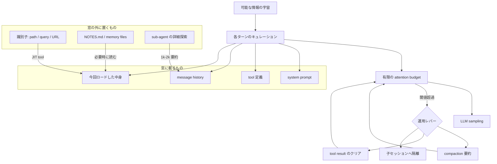

AIエージェントを長く動かすと、途中から指示を忘れる・同じ調査を繰り返す・規約を破る、といった劣化が起きます。原因はモデルの賢さではなく、**各推論ターンでモデルに渡しているトークン集合の設計**にあることが多いです。

この記事では、Anthropic の [Effective context engineering for AI agents](https://www.anthropic.com/engineering/effective-context-engineering-for-ai-agents)(2025-09-29)を軸に、コンテキストエンジニアリングの考え方と実務での使い分けを整理します。読み終えると、次の判断ができるようになります。

- 何を毎ターン載せ、何を窓の外に置くか
- 長時間タスクで compaction / 外部メモ / サブエージェントのどれを選ぶか
- 1M トークンの大きな窓が、どこまで設計の代わりになるか

想定読者は、エージェントを本番運用する開発者と、その設計方針を判断する立場の方です。

*この記事の全体像。以下、順に解説します。*

## コンテキストエンジニアリングとは何か

Anthropic は context を「sampling 時にモデルへ載るトークン一式」と定義し、コンテキストエンジニアリングを**その有限資源の効用を最大化する仕事**と位置づけます。対象は system prompt だけではありません。

| 対象 | 具体例 |
|---|---|
| System prompt | 役割・制約・出力形式 |
| Tools | ツール定義、MCP サーバのスキーマ |
| Examples | few-shot の実例 |
| History | 過去の発話・ツール応答 |
| 外部データ | 実行時に読み込んだファイルや検索結果 |

プロンプトエンジニアリングは、このうち system 指示の書き方に関する部分集合です。単発のチャットでは文言の工夫が効きますが、数十ターン回るエージェントでは、**毎ターン何を組み立てるか**が支配的になります。

原則は一貫して「smallest possible set of high-signal tokens(可能な限り小さい高信号トークン集合)」です。ここで注意したいのは、minimal と short が同義ではないことです。判断に必要な前提を削ると、モデルは推測で埋めます。削るべきは信号の薄いトークンであり、文字数そのものではありません。

用語の由来としては、2025-06 に Tobi Lütke 氏と Andrej Karpathy 氏の発言が広まりました。Karpathy 氏の「次のステップにちょうど足りる情報を窓に入れる art and science」という表現が、過不足の両方を戒める定義として今も有効です。

## なぜ「全部載せ」が壊れるのか

窓を広く取れば解決する、という直感は部分的にしか正しくありません。理由は次の3点です。

1. **注意の希釈**: Transformer は全トークンが全トークンに attend します。n トークンなら n² のペア関係を、有限の注意力で分配することになります。
2. **訓練分布の偏り**: 長い依存関係の事例は相対的に少なく、長距離の参照は苦手になりがちです。
3. **位置埋め込みの補間**: 訓練窓より長い系列は position interpolation([Chen et al., arXiv:2306.15595](https://arxiv.org/pdf/2306.15595))などで適応させますが、位置理解はいくらか劣化する、というのが Anthropic の解釈です。

この「長くすると効かなくなる」現象を、Chroma のテクニカルレポート [Context Rot](https://www.trychroma.com/research/context-rot)(2025-07、18 モデル)は、入力長を独立変数にした拡張 NIAH で観測し、長さとともに非一様に劣化すると報告しています。

独立した観測も複数あります。

| 研究 | 観測 |
|---|---|
| [Lost in the Middle](https://arxiv.org/abs/2307.03172)(TACL 2023) | 関連情報が入力の中央にあると精度が落ちる。GPT-3.5-Turbo の multi-document QA で 20% 超の低下、中央配置では closed-book(56.1%)を下回る場合もある |
| [NoLiMa](https://arxiv.org/abs/2502.05167)(ICML 2025) | 字面一致の少ない needle では、32K 時点で 13 モデル中 11 が短文 baseline の 50% を割る。GPT-4o は base 99.3% → 32K 69.7% |
| [LongMemEval](https://arxiv.org/abs/2410.10813)(ICLR 2025) | 履歴を全部載せる方式は、証拠セッションだけを渡す Oracle に劣る。GPT-4o は 0.870 → 0.606(約 115k tokens/question) |

読み取るべきは「**広告された窓長と実効的に使える長さは一致しない**」という一点です。なお Context Rot 自身は「この実験では needle の位置差は目立たない」とも書いており、位置効果とその他の劣化は別の話として扱う必要があります。

## 窓に載る4部品をどう設計するか

Anthropic は窓の中身を4部品に分解し、それぞれに「両極の失敗」を挙げています。

| 部品 | 失敗の両極 | 処方 |
|---|---|---|
| System prompt | ハードコードされた脆い if-else / 共有前提を仮定した曖昧な指示 | 最小から始め、観測した失敗モードだけ足す。XML や Markdown でセクション分割 |
| Tools | 機能が重複し選択が曖昧 | 人間でも選べる粒度にする。自己完結し、エラーに強い設計 |
| Examples | エッジケースの百科事典化 | 少数の canonical な例に絞る |
| History | 全履歴の堆積 | 後述の運用レバーで圧縮・隔離する |

ツール設計は、[Writing effective tools for agents](https://www.anthropic.com/engineering/writing-tools-for-agents)(2025-09-11)が「決定論的システムと非決定論的エージェントの契約」と定義しています。実務上のポイントは3つです。

- `list_*` を並べるより、`search_*` や複合ワークフローを1本用意する
- 戻り値は UUID の羅列ではなく、自然言語の識別子を優先する(同記事の Slack 例では詳細形式 206 tokens に対し簡潔形式 72 tokens)
- 戻り値のサイズに上限を設ける(Claude Code のツール応答は既定 25,000 tokens 上限)

なお、system prompt の設計高度は**モデル世代で動きます**。[The new rules of context engineering for Claude 5 generation models](https://claude.com/blog/the-new-rules-of-context-engineering-for-claude-5-generation-models)(2026-07-24)では、Claude Code の system prompt を 80% 超削除してもコーディング評価で測定可能な損失はなかった、と述べられています。同記事は examples についても「探索空間を縛る」として、2025-09 時点の推奨を反転させています。**どのモデル世代に向けた指針かを外すと誤用します。**

## 事前投入と JIT をどう使い分けるか

情報を推論前に載せるか(事前投入)、識別子だけ持って必要時に読むか(JIT: just-in-time)。この選択が設計の中心です。

判断基準は次のとおりです。

| 方式 | 向く場面 | 弱点 |
|---|---|---|
| 事前投入(埋め込み検索など) | 静的で更新の少ないコーパス(法務・財務文書など) | 情報が古くなる。無関係チャンクが窓を汚す |
| JIT | 変化するファイル群、探索的な調査 | 往復が増えて遅い。ツール誤用で無駄に窓を消費する |
| ハイブリッド | 実運用の多く | 両方の設計が必要 |

Claude Code はハイブリッドの例です。`CLAUDE.md` は素朴に先頭へ載せる一方、コードは glob / grep で探し、`head` や `tail` で必要な範囲だけを窓に入れます。全ファイルを事前にインデックス化しないので、stale なインデックスや巨大な構文木を抱え込まずに済みます。

整理の枠として、LangChain(2025-07-02)の Write / Select / Compress / Isolate の4分類も便利です。Anthropic の JIT は Select、compaction は Compress、サブエージェントは Isolate、外部メモは Write に対応します。

## 長時間タスクの3レバー

窓に収まらない長さの仕事では、次の3レバーを使い分けます。

| レバー | 仕組み | 向く仕事 | 失敗 |
|---|---|---|---|
| Compaction | 履歴を要約して新しい窓を張り直す | 往復が多い会話の継続 | 微妙だが後で効く制約が落ちる |
| Notes / memory | 進捗や決定を窓の外のファイルへ書く | マイルストーンのある反復開発 | 書き忘れると次セッションで消失する |
| Sub-agent | 子エージェントが深く探索し、親へ 1,000〜2,000 tokens の要約だけ返す | 並列探索が効く調査 | handoff で文脈が落ちる。コストが大きい |

窓の外に何を置くかの整理は、次のように考えると迷いません。

| 置くもの | 置き場 | 再入場の手段 |
|---|---|---|
| 不変の契約(system / tool schema) | 毎ターンの prefix | prompt cache の対象 |
| 識別子(path、保存済みクエリ、URL) | 履歴に残してよい | JIT ツールで展開 |
| 大きな成果物(検索結果、ファイル全文) | ファイルシステム | `view` / `head` / grep |
| 進捗・決定・未解決事項 | NOTES.md、memory の `/memories` | 次セッション冒頭に読む |
| 子エージェントの探索トレース | 子の窓だけ | 親へは要約かファイル参照 |

この分離は新しい発想ではなく、[MemGPT](https://arxiv.org/abs/2310.08560)が OS のメタファ(main context = 物理メモリ、external = ディスク、function call でページング)で先行して定式化しています。

サブエージェントについては、判断材料が両方向にあります。[How we built our multi-agent research system](https://www.anthropic.com/engineering/multi-agent-research-system)(2025-06-13)は、内部の research 評価で Opus 4 lead + Sonnet 4 子の構成が single-agent Opus 4 を 90.2% 上回ったと報告します。ただし同記事は、BrowseComp の性能分散の 80% がトークン使用量で説明でき、3要因(token / tool calls / model)で 95% に達するとも書いています。つまり**効いた主因は「トークンを十分に使えたこと」**であり、隔離そのものの勝利と読むのは飛躍です。同記事は、依存関係が多く全エージェントが同一文脈を共有すべきコーディングには不適合とも明記しています。

反対の立場もあります。Cognition の [Don't Build Multi-Agents](https://cognition.com/blog/dont-build-multi-agents)(2025-06-12)は、並列サブエージェントが暗黙の決定共有を壊すとして、フルトレース共有を原則に置きます。同じ時期の2つのエッセイが、隔離の適否で対立している状態です。

判断の目安は「**探索ノイズは隔離してよい。決定と規約は隔離してはいけない**」に集約できます。

## compaction は安全装置ではない

3レバーのうち compaction は最も自動化しやすく、そのぶん過信されがちです。Claude Developer Platform では server-side compaction が長い会話の一次戦略として案内されています。

| 項目 | 値 |
|---|---|
| Beta header / type | `compact-2026-01-12` / `compact_20260112` |
| 既定トリガー | 150,000 input tokens(下限 50,000) |
| `instructions` | 既定の要約プロンプトを完全置換する |
| 課金 | 追加 sampling がレート制限と課金に加算される(`usage.iterations`) |
| 停止理由 | `stop_reason: compaction` |

関連して context editing(`context-management-2025-06-27`)は、古い tool_result や thinking をサーバ側で削除します。ここで見落としやすいのが**キャッシュとの干渉**です。ツール結果のクリアは prompt cache の prefix を無効化するため、`clear_at_least` で「キャッシュを壊すに値する削減量」を保証する設計になっています。既定では 100,000 input tokens で発火し、直近 3 件の tool use を保持します。

要約が落とすものは、量ではなく**種類**が問題になります。preprint の Governance Decay([arXiv:2606.22528](https://arxiv.org/abs/2606.22528)、2026-06-21)は、standing policy(常時有効な方針)が要約時に低 salience として落ちる現象を測定しています。

- 方針が全文脈に残る control 条件では、7 モデルで違反 0%
- compaction 後は pooled 30%、最大 59%
- 制約が要約に残れば 0%、落ちれば 38%
- ソフトな組織方針は、ハードな安全制約の 8.3 倍落ちやすい
- 制約を要約の外に固定する pinning(約 47 tokens)では、両攻撃で違反 0%

preprint であり、判定に LLM judge を使うなどの限界は著者自身が述べていますが、方向としては現場の報告とも整合します。Claude Code の Issue には、`/compact` 後に `CLAUDE.md` の規則が失われた([#4517](https://github.com/anthropics/claude-code/issues/4517))、autocompact のループでトークンが急増した([#9579](https://github.com/anthropics/claude-code/issues/9579))、頻繁な compact で規則が失われた([#32691](https://github.com/anthropics/claude-code/issues/32691))といった報告が並びます(いずれも 2026-08-22 時点で closed)。

レンダリング層の不具合が品質事故になった例もあります。[An update on recent Claude Code quality reports](https://www.anthropic.com/engineering/april-23-postmortem)(2026-04-23)では、`clear_thinking_20251015` を `keep:1` で「1時間以上のアイドル後に一度だけ」適用するつもりが、以降毎ターン発火し、忘却・反復・不自然なツール選択として表面化しました。

実装上の結論はシンプルです。**禁止操作・完了定義・運用規約は要約の対象にせず、毎ターンの固定領域に置きます。**

なお memory ツール(`memory_20250818`)を自前実装する場合は、パス検証を先に書いてください。モデルが `view` / `create` / `str_replace` / `insert` / `delete` / `rename` を要求し、アプリ側が実行する構造のため、`/memories/../../secrets.env` のようなパストラバーサルが公式ドキュメントでも警告されています。canonical path へ解決したうえで prefix を検証する実装が必要です。

## 大きな窓は代替になるか

ここは意見が割れる論点なので、一次情報の言い分を並べます。

| 主張 | 出典 |
|---|---|
| 75,000 行超のコードベースを単一リクエストで扱える | [1M context](https://claude.com/blog/1m-context)(2025-08-12) |
| 従来必要だった lossy summarization や context clearing はもう不要 | [1M context GA](https://claude.com/blog/1m-context-ga)(2026-03-13) |
| 窓が広いなら関連情報を全部先に渡してよい。ただし複数 needle では精度が落ちる | Google の long-context ドキュメント |
| NIAH は簡単すぎる。字面一致の少ない検索では実効長が短い | Context Rot / NoLiMa |

同じ組織の中でも、2025-09 の playbook と 2026-03 のマーケティング文言は緊張関係にあります。後者は顧客引用として compaction 15% 減を挙げますが、独立ベンチマークではありません。

実務的な線引きはこうなります。

- **大きな窓が効く**: 字面での検索、単一コーパスの読解、一度きりの大量入力
- **設計が残る**: 方針遵守、意味的な検索、数十ターン以上の長時間ループ

2025-09 の記事自身も「予見しうる将来のどのサイズでも context pollution は起きる」と書いています。大きな窓は保険であって、playbook の廃止ではありません。

## 実務への落とし込み

自分のエージェント基盤に適用するときのチェックリストです。

1. **窓の設計単位をターンにする。** セッション開始時に全部載せる構成を既定にしない。
2. **規約は要約の外にピン留めする。** 禁止操作・完了定義・運用規約は compaction 対象から外す。
3. **探索だけを子に出す。** 依存の多い実装や文章統合は親が保持するか、生成果物をファイルに残して親が読む。
4. **常駐ドキュメントは gotcha と参照に絞る。** 手順書は遅延ロードできる形へ移し、失敗モードの百科事典を system に積み続けない。
5. **大窓は用途を限って使う。** 字面検索には使い、方針遵守と長時間ループでは外部メモと選択的クリアを残す。
6. **memory を実装するならパス検証を先に書く。** 公式デモの一部は検証を省略している、とドキュメント自身が警告している。

親エージェントが計画し、子が実行して成果だけを返す構成は、Anthropic の orchestrator-worker と同型です。その際、子の生成果物をファイルに残しておくと、親が要約だけを信じる「伝言ゲーム」を避けられます。隔離は常に情報損失とセットである、と理解しておくのが安全です。

なお、レンダリングやブラウザ実行のようなプロセス隔離と、ここで扱った**注意力の隔離**は別レイヤの話です。前者は信頼性境界、後者は attention budget の配分であり、混同すると設計を誤ります。

## 未解決の論点

断定を避けるべき点も明示しておきます。

- Anthropic が公表する改善率(memory + editing で 39%、editing 単独で 29%、100ターンの web 検索でトークン 84% 削減、マルチエージェントの 90.2% など)は、いずれも評価セットが非公開の内部評価です。
- Context Rot の第三者による独立再現は確認できていません。引用元は査読論文ではなく、retrieval 製品ベンダーのテクニカルレポートです。
- Governance Decay は preprint で、セルあたりの n は控えめです。
- 1M 窓世代のモデルで劣化曲線がどれだけ緩むかは、ベンダー主張と第三者ベンチマークの間に溝が残っています。

これらは設計を止める理由にはなりませんが、「子は常に切る」「compact すれば安全」「1M なら要約不要」という3つのスローガンについては、確信度を下げて扱うのが妥当です。

## まとめ

- コンテキストエンジニアリングは、system prompt・ツール・履歴・外部データを含む**毎ターンのトークン集合の設計**です。
- 窓を広げるだけでは解決しません。Lost in the Middle / NoLiMa / LongMemEval が、広告窓長と実効長の差を一次情報として示しています。
- 大きな成果物は識別子とファイルへ逃がし、必要になったときにツールで読み込みます(JIT)。静的コーパスでは事前投入が向きます。
- 長時間タスクでは compaction / 外部メモ / サブエージェントを使い分けます。ただし **standing policy は要約に載せず、固定領域にピン留め**します。
- 大きな窓は字面検索では効きますが、方針遵守と長時間ループの設計を置き換えるものではありません。

この記事が少しでも参考になった、あるいは改善点などがあれば、ぜひリアクションやコメント、SNSでのシェアをいただけると励みになります！

## 参考リンク

- [Effective context engineering for AI agents](https://www.anthropic.com/engineering/effective-context-engineering-for-ai-agents) — Anthropic Applied AI, 2025-09-29
- [Writing effective tools for agents — with agents](https://www.anthropic.com/engineering/writing-tools-for-agents) — Anthropic, 2025-09-11
- [How we built our multi-agent research system](https://www.anthropic.com/engineering/multi-agent-research-system) — Anthropic, 2025-06-13
- [Managing context on the Claude Developer Platform](https://claude.com/blog/context-management) — Anthropic, 2025-09-29
- [The new rules of context engineering for Claude 5 generation models](https://claude.com/blog/the-new-rules-of-context-engineering-for-claude-5-generation-models) — Anthropic, 2026-07-24
- [An update on recent Claude Code quality reports](https://www.anthropic.com/engineering/april-23-postmortem) — Anthropic, 2026-04-23
- [1M context is now generally available](https://claude.com/blog/1m-context-ga) — Anthropic, 2026-03-13
- [Compaction (Claude Developer Platform docs)](https://platform.claude.com/docs/en/build-with-claude/compaction)
- [Context editing (Claude Developer Platform docs)](https://platform.claude.com/docs/en/build-with-claude/context-editing)
- [Memory tool (Claude Developer Platform docs)](https://platform.claude.com/docs/en/agents-and-tools/tool-use/memory-tool)
- [Memory and context management cookbook](https://platform.claude.com/cookbook/tool-use-memory-cookbook)
- [Context Rot](https://www.trychroma.com/research/context-rot) — Hong, Troynikov, Huber, Chroma, 2025-07
- [Lost in the Middle (arXiv:2307.03172)](https://arxiv.org/abs/2307.03172) — Liu et al., TACL 2023
- [NoLiMa (arXiv:2502.05167)](https://arxiv.org/abs/2502.05167) — Modarressi et al., ICML 2025
- [LongMemEval (arXiv:2410.10813)](https://arxiv.org/abs/2410.10813) — Wu et al., ICLR 2025
- [MemGPT (arXiv:2310.08560)](https://arxiv.org/abs/2310.08560) — Packer et al.
- [Extending Context Window via Position Interpolation (arXiv:2306.15595)](https://arxiv.org/pdf/2306.15595) — Chen et al.
- [Governance Decay (arXiv:2606.22528)](https://arxiv.org/abs/2606.22528) — 2026-06-21, preprint
- [Don't Build Multi-Agents](https://cognition.com/blog/dont-build-multi-agents) — Cognition, 2025-06-12
- [Andrej Karpathy, X, 2025-06-25](https://x.com/karpathy/status/1937902205765607626)
- [Tobi Lütke, X, 2025-06-19](https://x.com/tobi/status/1935533422589399127)
