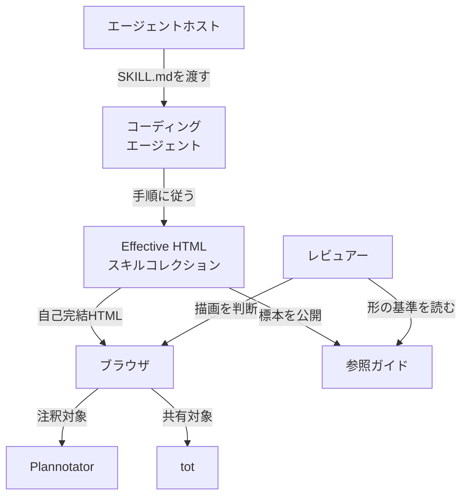
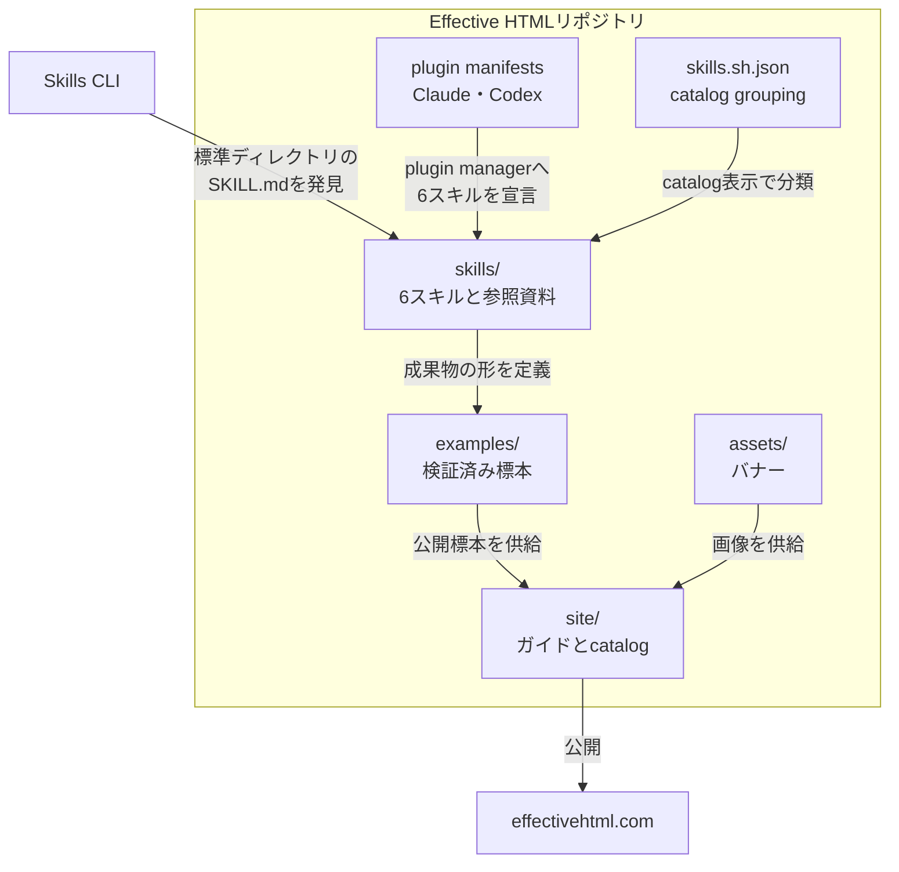
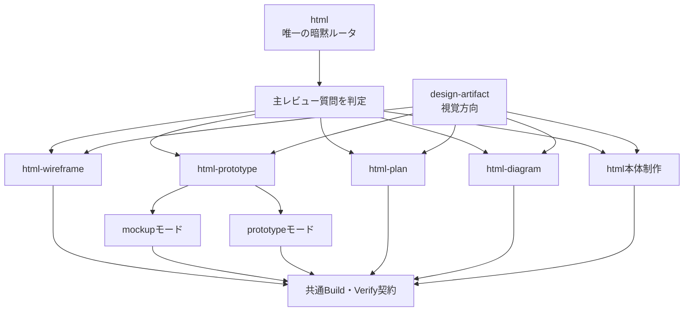
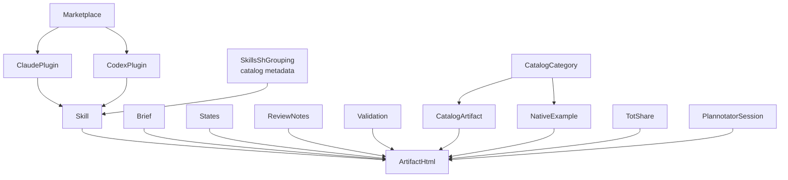
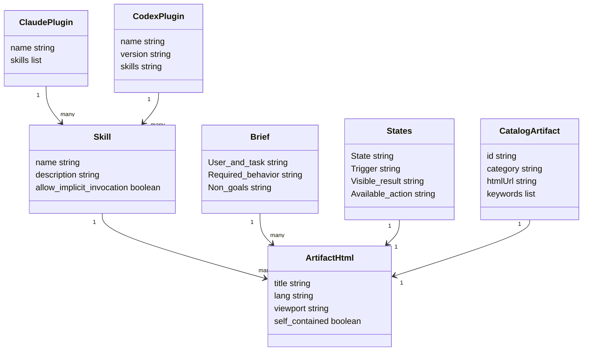

Effective HTMLは、コーディングエージェントに「見栄えのよいページ」を作らせるだけのスキル集ではありません。実装前の不確実性を、ブラウザで確認できる自己完結HTMLへ変換するためのAgent skillsコレクションです。

この記事では、Effective HTMLの6スキル、成果物を支える構造とデータ、導入方法、wireframe・mockup・prototypeの使い分け、運用上の注意点を整理します。コーディングエージェントと人間の間で、設計判断を速く正確に進めたい開発者を対象にしています。

レビューHTMLの情報設計やfeedback loop全体、関連ツールの比較は、別記事の[コーディングエージェントの成果を、人がレビューしやすいHTMLにする](https://zenn.dev/suwash/articles/coding-agent-human-html-review_20260807)で扱っています。本稿は重複を避け、Effective HTML固有のスキル構成、生成workflow、配布構造、導入・運用手順に焦点を絞ります。


*この記事の全体像。以下、順に解説します。*

## 概要

[Effective HTML](https://github.com/plannotator/effective-html)は、wireframe、mockup、prototype、plan、diagram、report、explainerなどを、単一のHTMLファイルとして作るためのAgent skillsコレクションです。2026年8月26日時点の`main`ブランチには6スキルがあり、MIT Licenseで公開されています。

中心にある考え方は、READMEが掲げる「Fat artifacts + fat context」です。エージェントへ十分な文脈を渡し、判断に必要な意味を成果物そのものへ埋め込みます。文章だけでは比較しにくい状態、フロー、空間関係、操作をHTMLで可視化し、人間が実装前に問いを検証できるようにします。

6スキルの役割は次のとおりです。

| スキル | 役割 | 主な成果物 |
|---|---|---|
| `html` | コレクション唯一の暗黙ルータ | report、explainer、deck、landing page、混合成果物 |
| `design-artifact` | 題材に合う視覚方向を決める | palette、type、layout、theme、register |
| `html-wireframe` | 構造と情報階層を検証する | 低フィデリティwireframe、2〜3方向の比較 |
| `html-prototype` | 見た目または操作を検証する | 静的mockup、1フローのinteractive prototype |
| `html-plan` | 計画の順序と追跡性を高める | phase、dependency、owner、acceptance、open question |
| `html-diagram` | 関係を適切な視覚モデルへ変換する | topology、sequence、state、hierarchy、timeline、matrix |

一般的な依頼を暗黙に受ける入口は`html`です。`html-wireframe`、`html-prototype`、`html-plan`、`html-diagram`は、ユーザーが明示的に呼ぶか、`html`が主なレビュー質問に合わせて振り分けます。`design-artifact`は成果物の種類を選ぶルータではなく、視覚方向が未確定なときにcomposeされるスキルです。

作成・注釈・共有は別々の道具に分かれています。

- Effective HTML: 自己完結HTMLの作成
- [Plannotator](https://github.com/backnotprop/plannotator): ローカルHTMLへの注釈
- [tot](https://github.com/plannotator/tot): HTMLの共有リンク化
- [effective-svg](https://github.com/plannotator/effective-svg): SVG標本

この分離により、成果物はローカルで完結させつつ、必要な段階だけレビューや共有を追加できます。

## 特徴

### 判断したい問いからフィデリティを選ぶ

Effective HTMLでは、完成度を一方向に上げ続けません。開いている問いに必要なフィデリティだけを選びます。

| 段階 | 主な問い | 作るもの | この段階で避けるもの |
|---|---|---|---|
| Wireframe | 何が必要で、どの順で見せるか | 階層、文言、ナビ、タスク順、レスポンシブ構造 | ブランド色、影、完成コンポーネント |
| Mockup | 合意した構造をどう見せるか | 視覚階層、余白、色、タイポ、ブレークポイント | 見た目の判断に不要な状態機械 |
| Prototype | 操作でき、状態を理解し、回復できるか | trigger、遷移、loading、error、success、keyboard path | 広範囲な偽プロダクト |
| Diagram | 関係や順序をどう理解するか | topology、sequence、process、stateなど | 題材に合わない箱と矢印の乱用 |
| Plan | 何をどの順で実施するか | phase、owner、dependency、acceptance、open question | 根拠のない進捗率やtimeline |

構造が合意済みならwireframeを省略できます。行為そのものが最大の不確実性なら、sketchからprototypeへ直接進めます。多くのケースでは、wireframeか、焦点を絞ったprototypeで十分です。


### 自己完結HTMLを品質契約にする

全スキルに共通する成果物契約があります。

- 1つの`.html`へCSSとJavaScriptをインライン化する
- ブラウザで直接開けるようにする
- 外部ネットワークはユーザーが許可した場合だけ使う
- lorem ipsumではなく、判断に影響する実ラベルと代表データを使う
- セマンティックHTML、十分なコントラスト、可視フォーカス、キーボード操作を備える
- `prefers-reduced-motion`を扱う
- wideとnarrowの両方で操作、console、clipping、overlap、overflowを確認する

外部CDNへ依存しないため、ローカルレビューで再現しやすくなります。フォントが必要なら、`design-artifact`はGoogle FontsなどのCDNではなく、`@font-face`のdata URI埋め込みを求めます。

### 題材固有の見た目を毎回設計する

`design-artifact`は、成功した過去の見た目をhouse styleとして再利用することを禁止しています。再利用するのは、観客、目的、題材からregister、palette、type、layoutを導く過程です。

判断の優先順位は次のとおりです。

1. ユーザーの明示指示
2. プロジェクトのデザインシステム
3. 題材、観客、目的
4. エージェント自身の判断

納品前にはoriginality checkを一度行います。題材を隣の話題へ置き換えても同じ見た目が成立するなら、方向が汎用的すぎます。

## 構造

Effective HTMLの本体は、6スキルの手順書、共有参照資料、ホスト別マニフェスト、検証済み標本、公開ガイドサイトです。ここでは、C4に近い3段階で全体を見ます。

### システムコンテキスト図

レビュアーとコーディングエージェントはEffective HTMLを中心に、ブラウザ、Plannotator、tot、公開ガイドを使い分けます。



成果物はブラウザで直接確認できます。注釈と共有は任意の外部経路であり、作成時から必須ではありません。

### コンテナ図

リポジトリ上の主な配布単位は`skills/`、pluginマニフェスト、`examples/`、`site/`、`assets/`です。



ホスト別の宣言は少し異なります。

| 宣言ファイル | スキルの指し方 |
|---|---|
| `.claude-plugin/plugin.json` | 6個の`./skills/<name>`を列挙 |
| `.codex-plugin/plugin.json` | Codex plugin manager向けに`./skills/`ディレクトリ全体を宣言、version `0.4.0` |
| `skills.sh.json` | catalog表示用のgrouping metadataとして6スキル名を列挙。Skills CLIのインストールマニフェストではない |
| `.claude-plugin/marketplace.json` | marketplace `effective-html`とplugin `plannotator-effective-html`を宣言 |

2026年7月29日の`examples/release-readiness/validation.md`には5スキルと記録されていますが、`design-artifact`は同年8月3日に復元されています。現行構成の正はREADMEとpluginマニフェストの6スキルです。

### コンポーネント図

`html`は依頼を分類し、必要ならspecialistへ振り分けます。視覚方向が開いている場合は`design-artifact`をcomposeします。



`html`自身が複合成果物を作る場合は、用途に応じて`creative-direction.md`、`documents-and-presentations.md`、`interfaces.md`、`diagrams.md`、`charts-and-data.md`を読みます。個別インストールでspecialistしかない場合でも、各スキルは独立利用できます。

## データ

Effective HTMLが扱う中心データは、インストール可能なSkill、Skillが生成するArtifactHtml、制作前後のBrief・States・Validation、サイトcatalogの標本です。

### 概念モデル

Claude・Codexのpluginマニフェストは各plugin managerへSkillを宣言します。Skills CLIは標準ディレクトリの`SKILL.md`を発見して導入し、`skills.sh.json`はcatalog表示上の分類だけを担います。SkillはArtifactHtmlを生成し、Brief、States、ReviewNotes、Validationは成果物の意味と検証状態を支えます。



公式ガイドが推奨する作業単位は、`brief.md`、HTML、`states.md`、`review-notes.md`の同居です。リポジトリに同梱された`examples/release-readiness/`では、`brief.md`、`states.md`、`validation.md`、`wireframe.html`、`prototype.html`を確認できます。`review-notes.md`は推奨ファイルですが、この例には含まれていません。

### 情報モデル

マニフェスト、Skill、成果物、catalog標本の主要属性と多重度は次の関係です。



重要な値を抜き出すと次のとおりです。

| データ | 値または制約 |
|---|---|
| `Skill.name` | `html`、`design-artifact`、`html-wireframe`、`html-prototype`、`html-plan`、`html-diagram` |
| `allow_implicit_invocation` | `html`と`design-artifact`は`true`、4 specialistは`false` |
| `CodexPlugin.version` | `0.4.0` |
| `ArtifactHtml.self_contained` | 記事上の派生概念。essential CSS/JSを原則inline化し、外部依存はユーザーが明示的に許可した場合だけ使う |
| `States`の列 | State、Trigger、Visible result、Available action |
| `PlannotatorSession.decision` | `approved`、`annotated`、`dismissed` |
| `TotShare.kind` | `markdown`または`html` |

`self_contained`は、実在するJSON/APIフィールドやschemaではありません。Build contractと検証項目を説明するために、この記事で置いた派生概念です。同梱例の`validation.md`は外部script、style、image、font、API、serviceがないことを記録していますが、公式Build contractはユーザーが明示的に許可した外部依存まで禁止していません。

同様に、内部のcatalog型やDOM構造は、CLI/APIの公開JSON出力とは別物です。実装内部の型を公開APIレスポンスとして扱わない点が重要です。

## 構築方法

### 前提条件を確認する

Skills CLI経路ではNode.jsが必要です。2026年8月26日に照合されたnpm `skills` 1.5.23の`engines`は`node >=22.20.0`です。tot 0.1.2は`node >=20.19`です。現在の公開値は導入時に再確認してください。

```bash
node -v
npm view skills version
npm view skills engines
npm view @plannotator/tot version
```

### まずリポジトリを参照として使う

インストールは必須ではありません。SKILL.mdとbriefをエージェントへ渡し、自己完結HTMLを作らせられます。

```text
Read https://github.com/plannotator/effective-html/blob/main/skills/html/SKILL.md
and examples/release-readiness/brief.md.
Create one self-contained HTML wireframe from the brief.
```

### Skills CLIで追加する

コレクション全体をプロジェクトスコープへ追加する基本コマンドです。

```bash
npx skills add plannotator/effective-html
```

一覧確認と個別導入もできます。

```bash
npx skills add plannotator/effective-html --list
npx skills add plannotator/effective-html --skill html-wireframe
npx skills add plannotator/effective-html --skill html-prototype
npx skills add plannotator/effective-html --skill '*' -a claude-code
```

`-g`または`--global`を付けるとユーザースコープへ導入されます。Claude Codeの既定先はプロジェクト`.claude/skills/`、Codexは`.agents/skills/`です。

### Claude Code pluginで追加する

marketplace名とplugin名は異なります。

```text
/plugin marketplace add plannotator/effective-html
/plugin install plannotator-effective-html@effective-html
```

シェルから実行する場合は次の形です。

```bash
claude plugin marketplace add plannotator/effective-html
claude plugin install plannotator-effective-html@effective-html
```

### Codex pluginで追加する

Codexでもplugin識別子は同じです。

```bash
codex plugin marketplace add plannotator/effective-html --ref main
codex plugin add plannotator-effective-html@effective-html
```

`.codex-plugin/plugin.json`の`interface.defaultPrompt`は、`$html`で適切なworkflowを選び、視覚方向が開いている場合は`$design-artifact`をcomposeするよう促します。

## 利用方法

### 1. 主レビュー質問を一つ決める

最初に「何を判断したいか」を一文にします。

| 主レビュー質問 | 選ぶスキル |
|---|---|
| 構造、情報階層、ナビ、タスクフロー | `html-wireframe` |
| 視覚階層、レイアウト、色、タイポ | `html-prototype`のmockupモード |
| ナビ、入力、状態変化、回復 | `html-prototype`のprototypeモード |
| 計画、roadmap、実装順、rollout | `html-plan` |
| 関係、順序、位相、状態、階層 | `html-diagram` |
| report、explainer、deck、複合成果物 | `html` |

### 2. working notesを固定する

コーディング前に5項目を決めます。

- Audience and job: 誰に何を理解または実行してほしいか
- Form: document、presentation、interface、diagram、data visualizationのどれか
- Register: 実務的、editorial、表現的などの調子
- Fidelity: ユーザーの構造と文言をどこまで保つか
- Interaction: 探索、順序、filter、motionが必要な箇所

### 3. briefとstatesを先に書く

画面を先に想像で広げず、利用者、必須情報、必須挙動、対象外を`brief.md`へ固定します。操作を検証する場合は、状態、trigger、見える結果、次に取れるactionを`states.md`へ置きます。

```text
html-wireframes-prototypes/
├── brief.md
├── release-readiness.html
├── states.md
└── review-notes.md
```

### 4. wireframeで構造を比較する

構造が未確定なら、色替えやカード位置の微調整ではなく、意味の異なる2〜3方向を同じHTMLで比較します。公式例はDecision first、Evidence ledger、Guided gateの3方向です。


### 5. prototypeは一つのフローを深く作る

`html-prototype`では、広い偽プロダクトより、1フローの正しさを優先します。公式例は、失敗したsmoke testを見て、再実行結果をdialogで記録し、blockedからreadyへ変わり、本番リリース要求の境界で止まります。


```text
Preserve the approved mockup. Implement only the blocked-to-ready flow in
states.md. Use native buttons and a complete keyboard path.
```

### 6. ブラウザで検証する

ソースコードの目視だけで完了にしません。

- desktopとmobileで開く
- 全コントロールを操作する
- console errorを確認する
- clipping、overlap、低コントラスト、ページ全体の横overflowを探す
- キーボードだけで主フローを完了できるか確認する
- `prefers-reduced-motion`時の挙動を確認する

## 運用

### インストール状態を確認・更新する

インストール済みスキルと、リポジトリが提供するスキルは別のコマンドで確認します。

```bash
npx skills list
npx skills ls -g
npx skills add plannotator/effective-html --list
npx skills update
```

`skills list`と`skills ls -g`は読み取り専用の状態確認です。`skills update`は差分確認と再インストールを同時に行う変更系コマンドです。`skills` 1.5.23では`check`も`update`と同じ処理へdispatchされるため、読み取り専用の確認コマンドとしては使いません。更新後に5スキルしか見えない場合は、古い検証記録と現行構成を混同していないか確認してください。

### Plannotatorで注釈する

ローカルHTMLを注釈対象にできます。

```bash
plannotator annotate release-readiness.html
plannotator annotate docs/guide.html --markdown
plannotator annotate release-readiness.html --gate --json
```

HTMLはsandboxed iframeで描画されます。スクリプトは実行でき、outbound requestも可能です。注釈UIへのsame-origin accessが遮断されても、raw HTMLが安全になるわけではありません。raw HTMLでの注釈は信頼済み成果物に限定し、未信頼HTMLは`--markdown`で`script`、`style`、`noscript`を除去して確認します。`--gate --json`の`decision`は`approved`、`annotated`、`dismissed`です。

### totで共有する

共有はユーザーの明示同意後だけ行います。

```bash
npm install -g @plannotator/tot
tot path/to/artifact.html
```

同じ可変リンクを更新でき、各版には`@hash`付きの固定snapshot URLがあります。`tot remove <link>`で削除できるのは可変リンクだけです。公開済みの`@hash` snapshotはworkspaceが存在する限り残り、後から回収できません。リンク保有者にview、update、deleteが開かれることに加え、固定snapshotを消せない前提で、秘密情報を含む成果物は公開しないでください。

### 本番コードへ移る境界を決める

次の問いが実データ、framework部品、権限、性能、結合なら、自己完結HTMLではなく本番コードへ移ります。コンポーネントライブラリ、ベクター編集、同時編集、正式handoffが必要ならFigmaなどの共有デザインツールが適しています。

## ベストプラクティス

### 実コンテンツを最初から使う

lorem ipsumや装飾用の統計は、文言によって変わるレイアウト判断を隠します。実ラベル、代表データ、現実的な長さのerror messageを使います。レビュー対象外の操作はdead buttonとして残さず、out of scopeとして境界を示します。

### brief・states・HTMLを一緒に版管理する

同じbriefをwireframe、mockup、prototypeで保つと、段階間で要求が勝手に変わることを防げます。受け入れ済みの判断と未決事項は`review-notes.md`で分離します。

### 外部依存を減らして再現性を高める

外部CDNを使わない方針は、ローカルでの再現性と可搬性を高めます。ただし、self-containedであることはセキュリティ境界ではありません。インラインscriptからもoutbound requestを実行できます。raw HTMLは信頼済み成果物だけを開き、未信頼HTMLは`plannotator annotate file.html --markdown`で確認します。ローカルHTMLだから私的だとは限らないため、秘密情報も含めません。

### 一つの操作フローを深くする

prototypeでは、trigger、遷移、loading、error、success、recovery、keyboard pathを一つの流れとして完成させます。画面数を増やすより、レビュー質問に答えられる状態遷移を優先します。

### wide・narrow・themeを最低セットにする

公式例の検証記録では、desktop 1440×1000とmobile 390×844が使われています。themeを持つ場合は、`prefers-color-scheme`と`data-theme`の両方でトークンを再代入し、色付き面ごとにcomputed foreground/backgroundを確認します。

### planへ根拠のない情報を足さない

`html-plan`では、見栄えのためにtimeline、progress percentage、status badge、dashboard summaryを補いません。原文が支えるscope、order、commitment、terminologyを保ち、accepted decision、assumption、open questionを分けます。

## トラブルシューティング

| 症状 | 主な原因 | 対処 |
|---|---|---|
| `file://`でfontやscriptが欠ける | CDNや相対依存が残っている | CSS/JSをinline化し、fontはdata URIで埋め込む |
| ページ全体が横スクロールする | table、code、diagramがbodyへ漏れている | 広い要素だけを`overflow-x: auto`のcontainerへ入れる |
| dark面で文字が消える | foregroundの継承と背景が衝突 | 面ごとのcomputed colorを確認し、theme tokenを再代入する |
| keyboard操作が途中で止まる | hover依存、非native control、focus未管理 | native要素、可視focus、`Escape`、focus復帰を実装する |
| wireframeがブランドレビューになる | 色、影、完成コンポーネントを入れすぎた | grayscale、system type、plain borderへ戻す |
| mockupが複雑な状態機械になる | 見た目の問いにbehaviorを足した | 静的境界を明示し、操作検証はprototypeへ分ける |
| planが戦略dashboardになる | sourceにない進捗や要約を合成した | 元のscope、order、terminologyへ戻す |
| plugin名が見つからない | marketplace名とplugin名を混同した | `plannotator-effective-html@effective-html`を使う |
| 更新後も5スキルしかない | 2026年7月時点の記録を参照している | `--list`で現行6スキルを確認する |
| totを実行できない | 未導入、または公開同意前 | `command -v tot`を確認し、同意後だけ導入・公開する |

ブラウザtoolingを利用できない環境では、「未検証」を明示して納品します。エージェントが動くと述べたことと、wide/narrowで実測したことは分けて扱います。

## まとめ

Effective HTMLは、HTMLを最終製品ではなく、実装前の判断装置として使うスキルコレクションです。`html`が主レビュー質問を判定し、wireframe、mockup、prototype、plan、diagramへ適切に振り分けます。

使いこなす鍵は、完成度ではなく問いに合わせてフィデリティを選ぶことです。実コンテンツを入れたself-contained HTMLを作り、briefとstatesを保ち、wide/narrow・keyboard・consoleまで実測します。次の問いが本番データ、権限、性能、正式handoffへ移ったら、HTML成果物の役目は完了です。

この記事が少しでも参考になった、あるいは改善点などがあれば、ぜひリアクションやコメント、SNSでのシェアをいただけると励みになります！

## 参考リンク

- [plannotator/effective-html](https://github.com/plannotator/effective-html)
- [Effective HTML README](https://github.com/plannotator/effective-html/blob/main/README.md)
- [Effective HTML guide](https://www.effectivehtml.com/docs)
- [Choosing fidelity](https://www.effectivehtml.com/docs/choosing-fidelity)
- [html SKILL.md](https://github.com/plannotator/effective-html/blob/main/skills/html/SKILL.md)
- [design-artifact SKILL.md](https://github.com/plannotator/effective-html/blob/main/skills/design-artifact/SKILL.md)
- [html-wireframe SKILL.md](https://github.com/plannotator/effective-html/blob/main/skills/html-wireframe/SKILL.md)
- [html-prototype SKILL.md](https://github.com/plannotator/effective-html/blob/main/skills/html-prototype/SKILL.md)
- [html-plan SKILL.md](https://github.com/plannotator/effective-html/blob/main/skills/html-plan/SKILL.md)
- [html-diagram SKILL.md](https://github.com/plannotator/effective-html/blob/main/skills/html-diagram/SKILL.md)
- [Release readiness examples](https://github.com/plannotator/effective-html/tree/main/examples/release-readiness)
- [Annotate HTML in Plannotator](https://docs.plannotator.ai/open-source/workflows/html)
- [plannotator/tot](https://github.com/plannotator/tot)
- [vercel-labs/skills](https://github.com/vercel-labs/skills)
