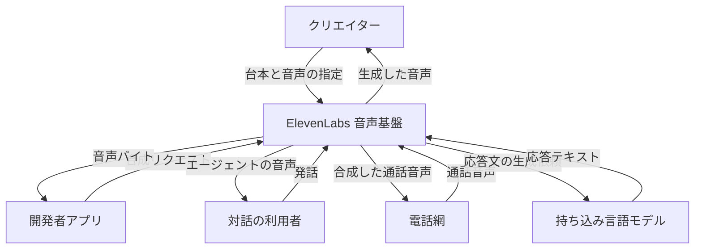
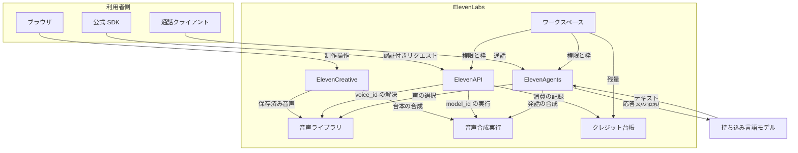
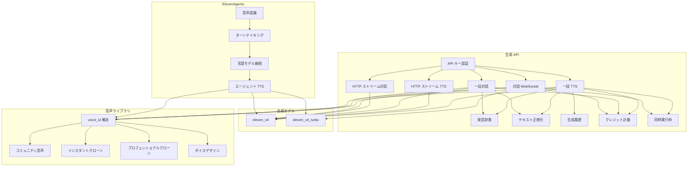
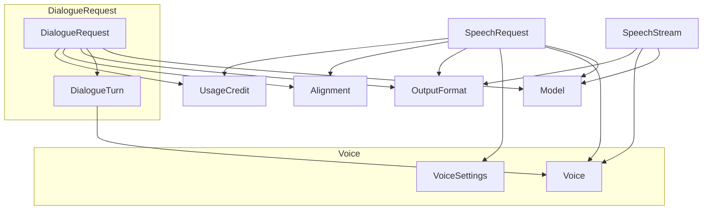
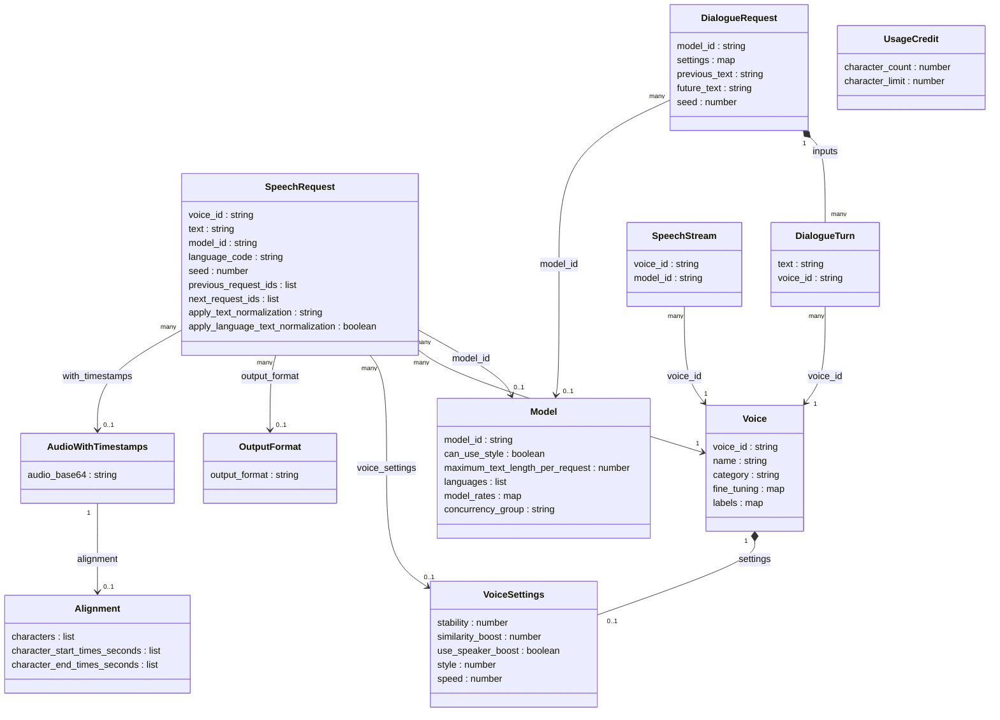

ElevenLabs が 2026-09-28 に公開した音声合成モデル Eleven v4 を、API から使う開発者向けに整理します。
対象は品質版 `eleven_v4` と低遅延版 `eleven_v4_turbo` の 2 モデルです。
記事では、サービスの構造、リクエストとレスポンスのデータ、導入手順、呼び出し例、運用の数字、つまずきやすい症状を順に扱います。
数値と仕様は 2026-09-29 時点の公式ドキュメント、API リファレンス、料金ページの表示に基づきます。


*この記事の全体像。以下、順に解説します。*

## Eleven v4とは

Eleven v4 は、ElevenLabs の Text to Speech の新しい世代です。
モデルの重みと層構成は公開されておらず、利用は ElevenLabs のサービス経由に限られます。

| モデル ID | 位置づけ | 公式が挙げる用途 |
| --- | --- | --- |
| `eleven_v4` | 品質版 | コンテンツ、オーディオブック、キャラクター音声 |
| `eleven_v4_turbo` | 低遅延版 | 会話エージェント、リアルタイム体験 |

- 両モデルとも 90 以上の言語を扱います。
- 声のクローン、角括弧の audio tag、複数話者の対話に対応します。
- 利用面は ElevenAgents、ElevenCreative、ElevenAPI の 3 つです。
- `eleven_v4` のモデル表の文字数上限は 1 リクエスト 10,000 文字（目安約 10 分）です。
- `eleven_v4_turbo` のモデルカードは、推論レイテンシの中央値を約 100ms と記載します。この値はアプリケーションとネットワークを除いたものです。

API の既定モデルは v4 ではありません。
Create speech の既定 `model_id` は `eleven_multilingual_v2`、Create dialogue の既定は `eleven_v3` です。
v4 を使うときは `model_id` を必ず明示します。

## 特徴

- **文脈を踏まえた読み上げ**: 品質版は話者、直前の出来事、行の着地を踏まえて読み上げます。劇的、優しい、緊急、喜劇的、会話的な話し方を、話者の同一性を保ったまま出せると案内されています。
- **audio tag**: 感情、間、効果音は本文中の角括弧で指定します。声の例は `[whispers]`、`[laughs]`、`[sighs]`、効果音の例は `[applause]`、`[explosion]` です。
- **声の設定は 2 つ**: Stability（発話の一貫性）と Similarity（参照音声への近さ）です。Style と Speed のスライダーは無く、SSML には対応しません。
- **発音の指定**: 固有名詞は発音辞書と、スラッシュで囲んだ IPA で指定します。IPA の追従は前世代より安定したと公式ブログは記載します。
- **出力形式**: MP3、PCM、WAV、Opus、μ-law、A-law です。既定は `mp3_44100_128` です。
- **クローン**: Instant Voice Clone（IVC）と Professional Voice Clone（PVC）の両方で使えます。既存の PVC は My Voices から v4 向けの追加学習を始めます。
- **言語をまたぐ挙動**: 生成言語と参照音声の言語が同じなら参照のアクセントを保ちます。違う場合は、目標言語として流暢に話します。
- **Voice Design**: 文章の説明から作った声も v4 で読み上げられます。
- **ベンダー公表の評価**: 公式ブログは Artificial Analysis の Provider Voice Arena（2026 年 9 月）で 1 位、ブラインド比較で聴取者の約 75% が v4 を選んだと記載します。


既存モデルとの位置づけは次のとおりです。

| 項目 | `eleven_v4` | `eleven_v4_turbo` | `eleven_v3` | `eleven_flash_v2_5` | `eleven_multilingual_v2` |
| --- | --- | --- | --- | --- | --- |
| 位置づけ | 高品質 | リアルタイム | 前世代の感情表現 | 高速・低単価 | 長尺の安定 |
| 言語 | 90 以上 | 90 以上 | 70 以上 | 32 | 29 |
| 文字数（モデル表） | 10,000 | 記載なし | 5,000 | 40,000 | 10,000 |
| レイテンシの公式記載 | 品質優先 | 推論中央値 約 100ms | 記載なし | 約 75ms | 速度より安定 |
| 対話 | 複数話者 | WebSocket の登録ボイスはちょうど 1 | 複数話者 | 高速合成 | 話者性の維持 |

`eleven_turbo_v2_5` と `eleven_turbo_v2` は旧世代の非推奨モデルで、`eleven_v4_turbo` とは別物です。

## 構造

公開されている境界は、制作画面、開発者 API、対話エージェントの 3 つです。

### システムコンテキスト図

利用者が触る外側と、ElevenLabs の音声基盤の境界を示します。



| 要素名 | 説明 |
| --- | --- |
| クリエイター | ElevenCreative でナレーション、対話、長文音声を作る人 |
| 開発者アプリ | 公式 SDK または HTTP で合成 API を呼ぶ顧客側のソフトウェア |
| 対話の利用者 | ElevenAgents と音声で会話する人 |
| 電話網 | エージェントへ通話を運ぶ外部の電話系 |
| 持ち込み言語モデル | エージェントの言語処理に接続できる、利用者指定の外部モデル |
| ElevenLabs 音声基盤 | 音声ライブラリ、合成モデル、API、エージェント、クレジットをまとめたサービス |

### コンテナ図

公式が製品として分けている実行境界です。



| 要素名 | 説明 |
| --- | --- |
| 公式 SDK | Python の `elevenlabs`、TypeScript の `@elevenlabs/elevenlabs-js` |
| ElevenCreative | ブラウザで音声、スタジオ、音声作成を行う制作面 |
| ElevenAgents | 音声認識、言語モデル、合成、ターンテイキングを組み合わせる対話基盤 |
| ElevenAPI | REST と WebSocket。既定ホストに加え、米国、EU、インド、シンガポールの本番ホストがある |
| 音声ライブラリ | コミュニティ音声、IVC、PVC、Voice Design の声を保管する |
| 音声合成実行 | `eleven_v4` と `eleven_v4_turbo` を実行する。内部は非公開 |
| クレジット台帳 | 生成の消費単位。消費量はプラン、Web か API か、製品、モデルで変わる |
| ワークスペース | プラン、API キー、同時実行枠、商用利用権を持つアカウント境界 |

### コンポーネント図

公開エンドポイント、公開モデル ID、公開のエージェント構成だけで組んだ図です。



TTS の HTTP から `eleven_v4` への矢印は、quickstart と request stitching の公式例に合わせています。
`eleven_v4_turbo` への矢印は、対話 WebSocket の公式例に合わせています。

| 要素名 | 説明 |
| --- | --- |
| API キー認証 | HTTP ヘッダーは `xi-api-key`。対話 WebSocket は最初の JSON の `xi_api_key` でも渡せる |
| 一括 TTS | `POST /v1/text-to-speech/{voice_id}` |
| HTTP ストリーム TTS | `POST /v1/text-to-speech/{voice_id}/stream`。チャンク転送で音声バイトを返す |
| 一括対話 | `POST /v1/text-to-dialogue`。`inputs` の各要素が `text` と `voice_id` を持つ |
| HTTP ストリーム対話 | `POST /v1/text-to-dialogue/stream`。ユニークな `voice_id` は最大 10 |
| 対話 WebSocket | `wss://api.elevenlabs.io/v1/text-to-dialogue/stream-input` |
| 発音辞書 | リクエストあたり最大 3 件。並んだ順に適用する |
| テキスト正規化 | `apply_text_normalization` は `auto`、`on`、`off`。言語別正規化は日本語のみで、遅延が増える |
| 生成履歴 | 既定でログを残す。`enable_logging=false` のゼロ保持は Enterprise のみで、履歴と request stitching が使えなくなる |
| クレジット計量 | 応答ヘッダー `character-cost` がその生成の文字コスト |
| 同時実行枠 | HTTP の TTS と対話は生成中だけ数える。対話 WebSocket は開いている間、対話セッションを 1 つ占有する |
| voice_id 解決 | 生成は ID で声を選ぶ。無料枠は API からライブラリ音声を使えない |
| プロフェッショナルクローン | 長い収録で専用モデルを学習する。作成は Creator 以上。`use_pvc_as_ivc` で IVC 版を使える |

`seed` は 0 から 4294967295 の整数です。
同じ入力で同じ結果を返すよう努めますが、決定性は保証されません。

## データ

エンティティ名は公開スキーマに合わせます。
audio tag は独立したフィールドではなく、`text` の中の角括弧です。

### 概念モデル

subgraph は所有、矢印は利用を表します。



| 要素名 | 説明 |
| --- | --- |
| Model | `GET /v1/models` の 1 件。対象 ID は `eleven_v4` と `eleven_v4_turbo` |
| Voice | `GET /v1/voices/{voice_id}` の音声 |
| VoiceSettings | Voice が持つ設定。リクエスト単位で上書きできる |
| SpeechRequest | `POST /v1/text-to-speech/{voice_id}` |
| SpeechStream | `POST /v1/text-to-speech/{voice_id}/stream`。応答は音声ストリーム |
| DialogueRequest | `POST /v1/text-to-dialogue`。複数ターンを 1 回で音声化する |
| DialogueTurn | `inputs` の要素。`text` と `voice_id` の組 |
| OutputFormat | クエリ `output_format`。MP3 と Opus は `codec_sample_rate_bitrate`、PCM、WAV、μ-law、A-law は `codec_sample_rate` |
| UsageCredit | `GET /v1/user/subscription` の文字数とクレジット枠 |
| Alignment | timestamps 付き応答の文字タイミング |

### 情報モデル

属性は公開スキーマのフィールドです。
入れ子のオブジェクトは `list` または `map` にまとめ、内訳は表に書きます。



| 要素名 | 主なフィールドと制約 |
| --- | --- |
| Model | 図の他に `name`、`token_cost_factor` がある。`languages` の要素は `language_id` と `name`。`model_rates` は `character_cost_multiplier` と `cost_discount_multiplier`。有効な文字数上限は `maximum_text_length_per_request`。どの枠の同時実行かは `concurrency_group` |
| Voice | `category` は `generated`、`cloned`、`premade`、`professional`、`famous`、`high_quality` |
| VoiceSettings | TTS の `voice_settings`。スキーマの既定は stability 0.5、similarity_boost 0.75、use_speaker_boost true、style 0、speed 1。v4 の Similarity は API では `similarity_boost` |
| SpeechRequest | 必須は path の `voice_id` と body の `text`。図の他に `previous_text`、`next_text`、`use_pvc_as_ivc`、`pronunciation_dictionary_locators`（最大 3 件）がある。`output_format` と `enable_logging` は本文ではなくクエリパラメータで指定する。`previous_request_ids` と `next_request_ids` は各最大 3 件。ID とテキストを両方送るとテキスト側は無視される。クエリの `enable_logging` の既定は true |
| DialogueRequest | 必須は `inputs`。`settings` は `stability` と `similarity`（既定 0.5 と 0.75）。`previous_text` と `future_text` は各最大 100 文字。ユニーク `voice_id` は最大 10。`inputs[].text` の合計 2,000 文字以下で安定する |
| DialogueTurn | スキーマ名は `DialogueInput`。必須は `text` と `voice_id` |
| OutputFormat | 既定は `mp3_44100_128`。HTTP ストリームの許可値に `wav_*` は含まれない |
| UsageCredit | `current_overage` は `amount` と `currency` |
| Alignment | `CharacterAlignmentResponseModel`。timestamps 付き応答は `alignment` と `normalized_alignment` を各 0 または 1 個返す |
| AudioWithTimestamps | `POST /v1/text-to-speech/{voice_id}/with-timestamps` の応答。`audio_base64` と Alignment を返す |

対話の timestamps 応答には `voice_segments` も付きます。
要素は `voice_id`、`start_time_seconds`、`end_time_seconds`、`character_start_index`、`character_end_index`、`dialogue_input_index` です。

## 導入

用意するものは API キー、公式 SDK または HTTP クライアント、明示する `model_id` の 3 つです。
モデル重みのダウンロード手順はありません。

### API キーと環境変数

- キーはダッシュボードの [API keys](https://elevenlabs.io/app/settings/api-keys) で作成します。
- SDK が読む環境変数は `ELEVENLABS_API_KEY` です。
- HTTP の認証ヘッダーは `xi-api-key` です。
- キーはマネージドシークレットに置き、ブラウザやモバイルアプリへ埋め込みません。

```bash
export ELEVENLABS_API_KEY="your_api_key_here"
```

### SDK のインストール

| 言語 | パッケージ | クライアント | TTS メソッド | モデル指定 |
| --- | --- | --- | --- | --- |
| Python | `elevenlabs` | `ElevenLabs` | `text_to_speech.convert` | `model_id` |
| TypeScript | `@elevenlabs/elevenlabs-js` | `ElevenLabsClient` | `textToSpeech.convert` | `modelId` |

```bash
pip install elevenlabs python-dotenv
npm install @elevenlabs/elevenlabs-js dotenv
brew install elevenlabs/tap/elevenlabs
```

2026-09-29 時点の npm の最新版は `@elevenlabs/elevenlabs-js` 2.70.0 です。
Python の再生には mpv または ffmpeg が必要になることがあります。

### リージョンホスト

| 区分 | HTTP ホスト |
| --- | --- |
| 既定 | `https://api.elevenlabs.io` |
| 米国 | `https://api.us.elevenlabs.io` |
| EU | `https://api.eu.residency.elevenlabs.io` |
| インド | `https://api.in.residency.elevenlabs.io` |
| シンガポール | `https://api.sg.residency.elevenlabs.io` |

WebSocket は同じホストでスキームを `wss://` にします。

## 利用方法

v4 の呼び出しでは `model_id` を省略しません。

| エンドポイント | パス | 必須 | 既定 model_id |
| --- | --- | --- | --- |
| Create speech | `POST /v1/text-to-speech/{voice_id}` | path `voice_id`、body `text`、ヘッダー `xi-api-key` | `eleven_multilingual_v2` |
| Stream speech | `POST /v1/text-to-speech/{voice_id}/stream` | 同上 | `eleven_multilingual_v2` |
| Create dialogue | `POST /v1/text-to-dialogue` | `inputs[].text` と `inputs[].voice_id` | `eleven_v3` |
| Stream dialogue | `POST /v1/text-to-dialogue/stream` | 同上 | `eleven_v3` |

### 単一話者の一括生成

`output_format` はクエリパラメータです。
例の voice ID `JBFqnCBsd6RMkjVDRZzb` は公式 quickstart のものです。

```python
import os
from dotenv import load_dotenv
from elevenlabs.client import ElevenLabs
from elevenlabs.play import play

load_dotenv()

elevenlabs = ElevenLabs(api_key=os.getenv("ELEVENLABS_API_KEY"))

audio = elevenlabs.text_to_speech.convert(
    text="The first move is what sets everything in motion.",
    voice_id="JBFqnCBsd6RMkjVDRZzb",
    model_id="eleven_v4",
    output_format="mp3_44100_128",
)

play(audio)
```

```typescript
import { ElevenLabsClient, play } from "@elevenlabs/elevenlabs-js";
import "dotenv/config";

const elevenlabs = new ElevenLabsClient();
const audio = await elevenlabs.textToSpeech.convert("JBFqnCBsd6RMkjVDRZzb", {
  text: "The first move is what sets everything in motion.",
  modelId: "eleven_v4",
  outputFormat: "mp3_44100_128",
});

await play(audio);
```

```bash
curl -X POST "https://api.elevenlabs.io/v1/text-to-speech/JBFqnCBsd6RMkjVDRZzb?output_format=mp3_44100_128" \
  -H "xi-api-key: $ELEVENLABS_API_KEY" \
  -H "Content-Type: application/json" \
  -d '{"text":"The first move is what sets everything in motion.","model_id":"eleven_v4"}' \
  -o out.mp3
```

### HTTP ストリーム

`/stream` は HTTP のチャンク転送です。
WebSocket の `/stream-input` とは別のエンドポイントです。

```python
import os
from dotenv import load_dotenv
from elevenlabs import stream
from elevenlabs.client import ElevenLabs

load_dotenv()

elevenlabs = ElevenLabs(api_key=os.getenv("ELEVENLABS_API_KEY"))

audio_stream = elevenlabs.text_to_speech.stream(
    text="This is a test",
    voice_id="JBFqnCBsd6RMkjVDRZzb",
    model_id="eleven_v4",
)

stream(audio_stream)
```

### 複数話者の対話

Create dialogue は完成した音声ファイルを 1 つ返します。
各ターンの `text` に audio tag を入れます。
2 人目の voice ID `Aw4FAjKCGjjNkVhN1Xmq` は公式の対話例のものです。

```python
import os
from dotenv import load_dotenv
from elevenlabs import ElevenLabs, DialogueInput

load_dotenv()

client = ElevenLabs(api_key=os.getenv("ELEVENLABS_API_KEY"))

audio = client.text_to_dialogue.convert(
    inputs=[
        DialogueInput(text="[giggling] Knock knock", voice_id="JBFqnCBsd6RMkjVDRZzb"),
        DialogueInput(text="[curious] Who is there?", voice_id="Aw4FAjKCGjjNkVhN1Xmq"),
    ],
    model_id="eleven_v4",
)
```

HTTP で送るときの JSON は次の形です。
対話の類似度は `similarity` で、TTS の `similarity_boost` とは名前が違います。

```json
{
  "model_id": "eleven_v4",
  "settings": {
    "stability": 0.5,
    "similarity": 0.75
  },
  "inputs": [
    { "text": "[giggling] Knock knock", "voice_id": "JBFqnCBsd6RMkjVDRZzb" },
    { "text": "[curious] Who is there?", "voice_id": "Aw4FAjKCGjjNkVhN1Xmq" }
  ]
}
```

ストリームで受けるときは Python の `text_to_dialogue.stream`、TypeScript の `textToDialogue.stream` を使います。

```typescript
import { ElevenLabsClient } from "@elevenlabs/elevenlabs-js";
import "dotenv/config";

const client = new ElevenLabsClient();

const audioStream = await client.textToDialogue.stream({
  modelId: "eleven_v4",
  inputs: [
    { text: "[giggling] Knock knock", voiceId: "JBFqnCBsd6RMkjVDRZzb" },
    { text: "[curious] Who is there?", voiceId: "Aw4FAjKCGjjNkVhN1Xmq" },
  ],
});
```

### 音声設定と audio tag

- Stability を下げると抑揚が広がり、上げると基準の話し方に寄ります。
- Similarity を上げると参照音声に寄りますが、自然さが下がることがあります。
- audio tag の声の例は `[whispers]`、`[laughs]`、`[sighs]`、`[sarcastic]`、`[curious]`、`[excited]`、`[crying]` です。
- 効果音の例は `[gunshot]`、`[applause]`、`[clapping]`、`[explosion]` です。
- タグは声質が分かる句の方が通りやすく、公式例は `[low, gravelly voice]` です。
- 間は SSML の `<break>` ではなく、audio tag、省略記号、文の区切りで作ります。

```json
{
  "text": "[whispers] I never knew it could be this way, but I'm glad we're here.",
  "model_id": "eleven_v4",
  "voice_settings": {
    "stability": 0.5,
    "similarity_boost": 0.75
  }
}
```

### 出力形式

形式名は、MP3 と Opus が `codec_sample_rate_bitrate`、PCM、WAV、μ-law、A-law が `codec_sample_rate` です。
高音質の形式はプランで制限されます。

| 値 | 条件 |
| --- | --- |
| `mp3_44100_128` | 既定 |
| `mp3_44100_192` | Creator 以上 |
| `pcm_44100` | Pro 以上 |
| `wav_44100` | Pro 以上。一括生成のみ |
| `opus_48000_128` | — |
| `ulaw_8000` / `alaw_8000` | 電話向け |

### 発音と日本語の正規化

- IPA は `eleven_v4` 向けにスラッシュで囲みます。XML の phoneme タグは使いません。
- ストレス記号 ˈ と ˌ を付け、必要な語だけを囲みます。
- `apply_text_normalization` の既定は `auto`、`on` は常に適用、`off` はスキップです。
- `apply_language_text_normalization` の既定は false です。現時点で対応は日本語のみで、レイテンシが大きく増えます。
- `language_code` は ISO 639-1 の 2 文字コードです。
- 発音辞書は大文字小文字を区別し、最初の置換だけを使います。

```python
import os
from elevenlabs.client import ElevenLabs

client = ElevenLabs(api_key=os.getenv("ELEVENLABS_API_KEY"))
audio = client.text_to_speech.convert(
    voice_id="21m00Tcm4TlvDq8ikWAM",
    text='The term "/ˌbaɪoʊˈkemɪstri/" refers to the study of chemical processes.',
    model_id="eleven_v4",
)
```

日本語で日付や金額を読ませる例です。

```json
{
  "text": "注文番号は 2026-09-29 です。合計は 1280 円です。",
  "model_id": "eleven_v4",
  "language_code": "ja",
  "apply_text_normalization": "on",
  "apply_language_text_normalization": true
}
```

## 運用

本番では、モデル ID、文字コスト、同時実行、ログ、キーを分けて管理します。

### モデルの使い分け

| 用途 | モデル |
| --- | --- |
| ナレーション、オーディオブック、キャラクターの書き出し | `eleven_v4` |
| 会話エージェントの発話（表現優先） | `eleven_v4_turbo` |
| 約 75ms の低遅延を優先する大量変換 | `eleven_flash_v2_5` |
| 長尺の安定を優先する既存の制作 | `eleven_multilingual_v2` |

- 章をまたいでつなぐ音声は、同じ `model_id` にそろえます。
- 公開後も学習が続くため、挙動が変わり得ます。固定した台本、声、seed、タグで定期的に聞き比べます。
- テキストがリアルタイムに伸びる用途は、Text to Dialogue WebSocket に接続します。登録ボイスは `eleven_v4` が最大 10、`eleven_v4_turbo` がちょうど 1 です。


### クレジットと料金

- クレジットは旧称 characters と同じ価値です。消費量はプラン、Web か API か、製品、モデルで変わります。
- API 料金ページは 2026-09-29 時点で、v4 と v4 Turbo に「72% off until Oct 12」を表示しています。

| モデル | 1,000 文字あたりの定価 | 2026-10-12 までの表示 | 目安 |
| --- | --- | --- | --- |
| v4 | 0.08 ドル | 0.022 ドル | 約 0.02 ドル/分 |
| v4 Turbo | 0.04 ドル | 0.011 ドル | 約 0.01 ドル/分 |

プランごとに含まれる文字数は次のとおりです。

| プラン | 月額 | v4 | v4 Turbo |
| --- | --- | --- | --- |
| Free | 0 ドル | 10,000 | 20,000 |
| Starter | 6 ドル | 273,000 | 545,000 |
| Creator | 22 ドル（初月 11 ドル） | 1,000,000 | 2,000,000 |
| Pro | 99 ドル | 4,500,000 | 9,000,000 |
| Scale | 299 ドル | 13,591,000 | 27,182,000 |
| Business | 990 ドル | 45,000,000 | 90,000,000 |

- 未使用クレジットは最大 2 か月分まで繰り越されます。ダウングレードと解約のときは繰り越されません。
- 有料プランの生成物には商用権があります。Free は帰属表示つきの非商用です。
- 応答ヘッダー `character-cost` で 1 回の消費を、`GET /v1/user/subscription` で残量を確認します。

```bash
curl -sS -D - -o out.mp3 -X POST \
  "https://api.elevenlabs.io/v1/text-to-speech/JBFqnCBsd6RMkjVDRZzb?output_format=mp3_44100_128" \
  -H "xi-api-key: ${ELEVENLABS_API_KEY}" \
  -H "Content-Type: application/json" \
  -d '{"text":"The first move is what sets everything in motion.","model_id":"eleven_v4"}'

curl -sS "https://api.elevenlabs.io/v1/user/subscription" \
  -H "xi-api-key: ${ELEVENLABS_API_KEY}"
```

### 同時実行

制限の単位は 1 分あたりのリクエスト数ではなく、同時に処理中のリクエスト数です。
TTS の同時実行はヘルプの表で 2 列に分かれます。

| プラン | Flash and Turbo models | All other models |
| --- | --- | --- |
| Free | 4 | 2 |
| Starter | 6 | 3 |
| Creator | 10 | 5 |
| Pro | 20 | 10 |
| Scale | 30 | 15 |
| Business | 30 | 15 |

- 応答ヘッダー `current-concurrent-requests` と `maximum-concurrent-requests` をメトリクスにします。
- HTTP の Text to Dialogue は、生成中だけ TTS の同時実行に数えます。
- Text to Dialogue WebSocket は、接続中ずっと対話セッションを 1 本確保します。上限は Free 14、Starter 21、Creator 35、Pro 70、Scale 105、Business 105 です。
- ElevenAgents の同時実行は TTS の表とは別枠です。
- 429 の `code` は `rate_limit_exceeded`、`concurrent_limit_exceeded`、`system_busy` の 3 つです。

エラーコードごとに待ち方を変える再試行の例です。

```python
import time
from elevenlabs import ElevenLabs
from elevenlabs.core import ApiError

client = ElevenLabs()

def convert_with_backoff(text: str, attempts: int = 5):
    delay = 0.5
    for _attempt in range(attempts):
        try:
            return client.text_to_speech.convert(
                voice_id="JBFqnCBsd6RMkjVDRZzb",
                text=text,
                model_id="eleven_v4",
                voice_settings={"stability": 0.5, "similarity_boost": 0.75},
            )
        except ApiError as exc:
            detail = exc.body.get("detail", {}) if isinstance(exc.body, dict) else {}
            code = detail.get("code")
            if exc.status_code == 429 and code in {"rate_limit_exceeded", "system_busy"}:
                time.sleep(delay)
                delay *= 2
                continue
            if exc.status_code == 429 and code == "concurrent_limit_exceeded":
                time.sleep(delay)
                continue
            raise
    raise RuntimeError("retry budget exhausted")
```

TypeScript SDK の例外型は `ElevenLabsError` です。

### WebSocket

- URL は `wss://api.elevenlabs.io/v1/text-to-dialogue/stream-input` です。
- 最初のメッセージで `voices` を登録します。
- サーバーは、おおよそ 40 文字かつ 8 語が揃うまでバッファします。短い発話は `flush` で出します。
- `close_socket` は残りを出してから `is_final: true` で閉じます。
- クライアントからのメッセージが 20 秒無いと接続が切れます。`{"keep_alive": true}` でタイマーを戻せます。音声は作られません。
- `new_turn: true` または `voice_id` の変更で新しいターンになります。
- クエリ `sync_alignment=true` で alignment が付きます。項目は `chars`、`char_start_times_ms`、`char_durations_ms` です。
- TTS 用の `/v1/text-to-speech/{voice_id}/stream-input` は `eleven_v3` と `eleven_v4` に対応しません。

```json
{"keep_alive": true}
```

### リクエスト連結

長文を分割して生成するときは、`previous_request_ids` と `next_request_ids` で前後の生成をつなぎます。

- 各最大 3 件です。
- ID は 2 時間より古いものを使いません。
- ストリームでは、ボディを最後まで読んでから次の条件付けに使います。
- ID とテキストを両方送ると、テキスト側は無視されます。
- `enable_logging=false` では使えません。
- `eleven_v3` では使えません。

```python
import os
from dotenv import load_dotenv
from elevenlabs.client import ElevenLabs

load_dotenv()

elevenlabs = ElevenLabs(api_key=os.getenv("ELEVENLABS_API_KEY"))

paragraphs = [
    "The advent of technology has transformed countless sectors, with education ",
    "one of the most significantly impacted fields.",
]

request_ids = []
audio_buffers = []

for paragraph in paragraphs:
    with elevenlabs.text_to_speech.with_raw_response.convert(
        text=paragraph,
        voice_id="T7QGPtToiqH4S8VlIkMJ",
        model_id="eleven_v4",
        previous_request_ids=request_ids[-3:],  # 直前の最大 3 件で条件付け
    ) as response:
        audio_buffers.append(b"".join(response.data))  # 音声を最後まで読み切る
        request_ids.append(response._response.headers.get("request-id"))

audio = b"".join(audio_buffers)
```

### キーの運用

- 本番はサービスアカウントのキーを使います。利用者の脱退で止まらず、管理はワークスペース管理者が行います。
- 利用者キーの有効期限は 15 分から 30 日で設定でき、既定は無期限です。期限後は 401 になります。
- ローテーションは、旧キーと同じ権限で新キーを作り、アプリを切り替え、旧キーを消す順です。
- 公開 GitHub に載ったキーは secret scanning で無効化され、`disable_reason` が `exposed_publicly` になります。
- IP 許可リストは公開 IPv4、IPv6、CIDR で 1〜100 件です。範囲外は 403 です。
- Enterprise ではキー単位の `tts_concurrency_limit` を設定できます。サービスアカウントのキーには `character_limit` を付けられます。

## ベストプラクティス

### 用途でモデルを固定する

- 最終書き出しは `eleven_v4`、会話の発話は `eleven_v4_turbo` に固定します。
- 公式値は、推論が中央値約 100ms、音が聞こえるまでが中央値約 150ms です。どちらもネットワーク遅延を除いた値なので、利用者側の時間予算には通信とアプリ処理を加えて見積もります。
- 約 75ms は Flash v2.5 の数字です。v4 Turbo の見積もりに使いません。
- `seed` を付けても決定性は保証されません。回帰の確認は、聴取と `character-cost` で行います。

### 日本語の読みを固定する

- 本番の日本語は `language_code` を `ja`、`apply_text_normalization` を `on` に固定します。
- 日付、通貨、電話番号を日本語の読みに寄せるときは `apply_language_text_normalization` を true にします。遅延が増えるので、ターンの時間予算と合わせて判断します。
- 低遅延が主目的の経路では、言語モデル側で読みを展開した文字列を渡します。
- 電話番号、通貨、URL、略語は事前展開の代表的な対象です。

### タグは声質で書く

- 効果音と紛れる短い名詞は避け、声質や感情が分かる句にします。
- 本番で使うタグは、その `voice_id` で数回生成してから固定します。
- 固有名詞はスラッシュ IPA だけを埋め、文全体は通常の表記のままにします。
- `[strong X accent]` や `[sings]` のような実験的タグは声によって安定しません。

### クローン音源を整える

- 学習音源は静かな環境の単一話者、単一の話し方にします。v4 はノイズ、歪み、音量のムラも写します。
- IVC の音源は少なくとも 1 分、推奨 1〜2 分です。3 分を超えても改善は小さく、不利になることもあります。
- 音量の目安は -23 dB から -18 dB RMS、トゥルーピーク -3 dB です。コーデックは MP3 192kbps 以上を推奨します。
- PVC の収録は最低 30 分、最適は 2〜3 時間です。歌は対象外です。
- 既存 PVC は、My Voices で声にホバーし、Eleven v4 の横のプラスで追加学習を始めます。完了するまで本番の `model_id` を切り替えません。

## 注意点

2026-09-29 時点の公式資料のあいだで、記載が 1 つにまとまっていない項目です。
実装前に、手元の API キーで最新の挙動を確認してください。

### ドキュメントと実装の乖離

| 対象 | 資料の記載 | 読者への影響 |
| --- | --- | --- |
| Style と Speed | v4 の解説はスライダーが無いと書く。一方、Create speech の `VoiceSettings` スキーマには `style`、`speed`、`use_speaker_boost` が残る | v4 のリクエストには `stability` と `similarity_boost` だけを置く。`style` や `speed` が 400 で拒否されるかは公式に明記されていない |
| Streaming ハウツーの例 | ハウツーの Python 例は `eleven_flash_v2_5` や `eleven_multilingual_v2` を使い、`style`、`speed` を含む | その `VoiceSettings` を v4 の呼び出しへコピーしない |
| 対話の類似度 | TTS は `similarity_boost`、対話 HTTP は `similarity`。対話 WebSocket の voice settings の公開項目は `stability` のみ | エンドポイントごとにフィールド名を変える |
| 対話 WebSocket の model_id | API リファレンスは `eleven_v3` で始まる ID と書く。ハウツーは `eleven_v3` または `eleven_v4` と書き、例は `eleven_v4_turbo` | 実装はハウツーの例に合わせ、実際の接続で受理されるかを確認する |
| モデルの入口 | models ページは `eleven_v4` を Text to Dialogue、turbo を対話 WebSocket と書く。quickstart は TTS HTTP に `eleven_v4` を渡す | `eleven_v4` の TTS HTTP は公式例がある。turbo の TTS HTTP は公式例が見当たらない |
| `optimize_streaming_latency` | Create speech に 0〜4 のクエリが残るが deprecated。4 はテキスト正規化も止める | v4 の遅延制御には使わない |

### 資料間の食い違い

| 対象 | 資料ごとの記載 | 読者への影響 |
| --- | --- | --- |
| レイテンシ | モデルカードとブログのリードは推論中央値約 100ms。ブログの脚注は WebSocket で音が聞こえるまで中央値約 150ms | 仕様比較は 100ms、初回音声までは 150ms（どちらもネットワーク遅延を除く）、75ms は Flash v2.5 |
| 選好率 | ブログ本文は約 75%。同じページの図は対戦相手ごとに 65%〜81% | 75% は要約値。ベンダーによる記載として扱う |
| IVC の長さ | 発表は 10 秒の音声で捉えられると書く。IVC ガイドは少なくとも 1 分、推奨 1〜2 分 | 作業標準は 1〜2 分にする |
| 文字数 | `eleven_v4` は 10,000 文字。turbo の行は無い。Web UI の上限は有料 5,000、無料 2,500。対話の安定ラインは合計 2,000 | 上限を混ぜない。turbo は `GET /v1/models` で確認する |
| 言語数 | TTS 概要は 32 言語、v4 は 90 以上。models ページの一覧は 3 文字コード | API の `language_code` は 2 文字。3 文字コードを流用しない |
| 同時実行の列 | ヘルプは「Flash and Turbo」対「All other」、models ページは「Multilingual v2」対「Flash」。どちらも v4 を名指ししない | v4 の割り当ては `GET /v1/models` の `concurrency_group` で確認する |
| クレジット倍率 | 古い FAQ は v4 に触れない。Web の「2x credits」告知は API 対象外 | 金額は表示日を付けて扱う。倍率は `GET /v1/models` の値を正とする |
| エラーコード | API エラー一覧とヘルプで別名がある（`insufficient_credits` と `quota_exceeded` など） | 返った `detail.code` をそのまま受け、両方を処理する |
| ElevenAgents の TTS | ブログは両モデルが使えると書く。Expressive mode の手順は Eleven v3 Conversational と書く | エージェント設定画面で選べる ID を確認する |
| PVC の待ち | FAQ は 3〜6 時間、ステータス説明は 6〜24 時間 | 待ち時間はステータス表示で見る |
| 話者数 | 対話 FAQ は上限なし。エンドポイントは最大 10、turbo の WebSocket は 1 | 上限はエンドポイントの記載に従う |
| seed の下限 | HTTP は 0 から、対話 WebSocket のクエリは 1 から | ソケットでは 1 以上を使う |
| alignment | HTTP は秒単位の 3 リスト、WebSocket は `chars`、`char_start_times_ms`、`char_durations_ms` | HTTP 用のパーサをソケットに流用しない |
| audio tag の綴り | モデルページは `[whispering]`、ベストプラクティスは `[whispers]` | 閉じた一覧ではない。その声で聞こえた綴りを採用する |
| 正規化の既定 | 全 TTS で既定有効と書く箇所と、Flash v2.5 は既定無効で `on` が Enterprise と書く箇所がある | v4 は `auto` 任せにせず `on` か事前展開に固定する |

### 公式に明記されていない事項

| 対象 | 状況 | 読者への影響 |
| --- | --- | --- |
| `GET /v1/models` の v4 実値 | `token_cost_factor`、`character_cost_multiplier`、`concurrency_group` の値は公開ページに無い | 本番キーで取得して決める |
| turbo の文字数上限 | 表に行が無い | 10,000 や 40,000 をハードコードしない |
| 対話の request stitching | 対話の `previous_request_ids` は「Not supported by every model」 | v4 で有効な前提にしない |
| 2026-10-12 以降の単価 | 割引終了後の表示が無い | 見積もりに終了日を付ける |
| アクセント切替のトグル | 研究中で、時期と API フィールドは未公開 | 参照言語と生成言語の組で試聴する |
| 継続学習の版管理 | モデルカードに版番号が無い | 固定台本で定期的に聞き比べる |

## トラブルシューティング

分岐のために、返った `detail.type`、`detail.code`、`detail.request_id` を記録しておきます。

| 症状 | 原因 | 対処 |
| --- | --- | --- |
| HTTP 429 で生成が止まる | `rate_limit_exceeded`、`concurrent_limit_exceeded`、`system_busy` | レートと混雑は待ち時間を倍にする。同時実行超過は進行中の完了を待つ |
| クレジット不足 | `insufficient_credits`（HTTP 402）、ヘルプ表記の `quota_exceeded` | 両方のコードを受ける。キーの `character_limit` とワークスペース残量を分けて見る |
| 401 で拒否される | `invalid_api_key`、`missing_api_key`、期限切れ、`exposed_publicly` | ヘッダー名 `xi-api-key` を確認する。公開されたキーはローテーションする |
| 声が見つからない | `voice_not_found`、`invalid_voice_id`、`voice_access_denied` | My Voices の ID を使う。無料枠は API からライブラリ音声を使えない |
| リクエストが長すぎる | `text_too_long`、`max_character_limit_exceeded` | `eleven_v4` は 10,000 文字、対話は合計 2,000 文字を目安に分割する |
| 設定を変えても声が変わらない | v4 のつまみは Stability と Similarity のみ | TTS は `stability` と `similarity_boost`、対話は `similarity` を送る |
| タグどおりに演じない | タグ追従は声に依存する | 声質が分かるタグにし、複数回生成して採用テイクを選ぶ |
| 他言語で元のアクセントが乗らない | 生成言語が参照言語と違うと、目標言語として流暢に話す仕様 | 同一言語に戻すか、タグで誘導して試聴する |
| 数字や日付の読みが崩れる | 正規化が `auto` か `off`。日本語の言語正規化は既定 false | `language_code` を `ja`、正規化を `on`、必要なら言語正規化を true にする |
| WebSocket が途中で切れる | 20 秒無通信で切断。短い発話はバッファに残る | `{"keep_alive": true}` を送る。ターン末で `flush` する |
| 対話ソケットが拒否される | 対話セッションの枯渇。turbo は登録ボイス 1 | 不要な接続を閉じる。複数話者は `eleven_v4` で接続する |
| つなぎが不自然 | ID が 2 時間超、3 件超、ストリーム未読了、`enable_logging=false` | ログを有効にし、同一モデルの直近 3 件を、ボディを読み切ってから使う |
| PVC で「No model found for this voice」 | v4 向けの追加学習が完了していない | My Voices でモデルごとの状態を見る。v4 のプラスを押して完了を待つ |
| クローンがノイズごと似る | v4 は参照音声の欠点も写す | 単一話者、単一スタイル、RMS -23〜-18 dB で録り直す |
| 同じ文なのに毎回違う | モデルは非決定的で、seed はベストエフォート | seed を固定したうえで複数候補から選ぶ |
| 音が出るまで 100ms より長い | 100ms は推論のみ。聞こえるまでの約 150ms もネットワーク遅延を除いた値。日本語の言語正規化やバッファも加わる | 150ms に通信とアプリ処理を加えて予算を組む。読みを事前展開し、短い発話は `flush` する |
| 対話ストリームが途中で終わる | `inputs[].text` の合計が 2,000 文字を超えた | ターンを分割し、合計を 2,000 文字以下にする |
| サポートが生成内容を追えない | ゼロ保持では入出力が保持されない | `request_id`、時刻、`model_id`、`voice_id` を自分で記録する |

## まとめ

- Eleven v4 は品質版 `eleven_v4` と低遅延版 `eleven_v4_turbo` の 2 モデルで、90 以上の言語と audio tag に対応します。
- API の既定モデルは v4 ではないので、`model_id` を必ず明示します。
- 声の調整は Stability と Similarity の 2 つで、フィールド名は TTS が `similarity_boost`、対話が `similarity` です。
- リアルタイム用途は Text to Dialogue WebSocket を使い、turbo は登録ボイス 1 本です。
- 日本語は `language_code` と正規化を明示して読みを固定します。
- 料金、文字数上限、同時実行の割り当ては資料間で揃っていない部分があるため、`GET /v1/models` と料金ページで確認してから本番に載せます。

この記事が少しでも参考になった、あるいは改善点などがあれば、ぜひリアクションやコメント、SNSでのシェアをいただけると励みになります！

## 参考リンク

### 製品とモデル

- [Eleven v4](https://elevenlabs.io/docs/overview/capabilities/text-to-speech/eleven-v4)
- [Models](https://elevenlabs.io/docs/overview/models)
- [Text to Speech](https://elevenlabs.io/docs/overview/capabilities/text-to-speech)
- [Best practices](https://elevenlabs.io/docs/overview/capabilities/text-to-speech/best-practices)
- [Text to Dialogue](https://elevenlabs.io/docs/overview/capabilities/text-to-dialogue)
- [ブログ Eleven v4（2026-09-28）](https://elevenlabs.io/blog/eleven-v4)
- [What is Eleven v4?](https://elevenlabs.io/docs/help-center/product/core-capabilities/text-to-speech/what-is-eleven-v4)
- [モデルの選び方](https://elevenlabs.io/docs/eleven-api/choosing-the-right-model)

### API リファレンス

- [ElevenAPI quickstart](https://elevenlabs.io/docs/eleven-api/quickstart)
- [Create speech](https://elevenlabs.io/docs/api-reference/text-to-speech/convert)
- [Stream speech](https://elevenlabs.io/docs/api-reference/text-to-speech/stream)
- [Create dialogue](https://elevenlabs.io/docs/api-reference/text-to-dialogue/convert)
- [Stream dialogue](https://elevenlabs.io/docs/api-reference/text-to-dialogue/stream)
- [List models](https://elevenlabs.io/docs/api-reference/models/list)
- [Realtime Text to Dialogue](https://elevenlabs.io/docs/eleven-api/guides/how-to/websockets/realtime-tdd)
- [Text to Dialogue WebSocket](https://elevenlabs.io/docs/api-reference/text-to-dialogue/ttd-websocket)
- [Errors](https://elevenlabs.io/docs/eleven-api/resources/errors)

### 運用と料金

- [API pricing](https://elevenlabs.io/pricing/api)
- [Pricing](https://elevenlabs.io/pricing)
- [Billing](https://elevenlabs.io/docs/overview/administration/billing)
- [Instant Voice Cloning](https://elevenlabs.io/docs/overview/capabilities/voices/voice-cloning/instant-voice-cloning)
- [Professional Voice Cloning](https://elevenlabs.io/docs/overview/capabilities/voices/voice-cloning/professional-voice-cloning)
- [API error code 429](https://elevenlabs.io/docs/help-center/technical/api-error-code-429)
