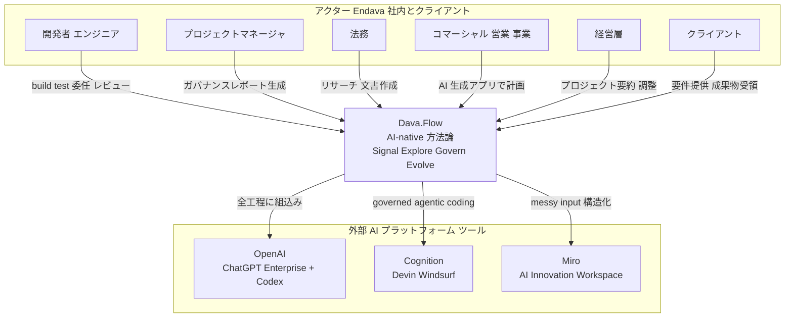
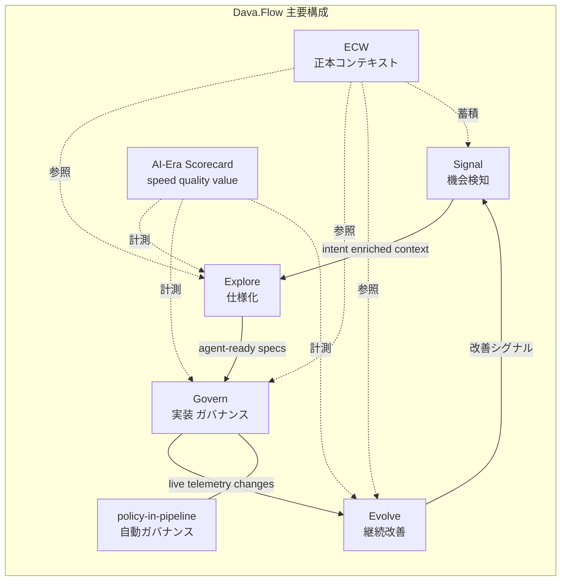
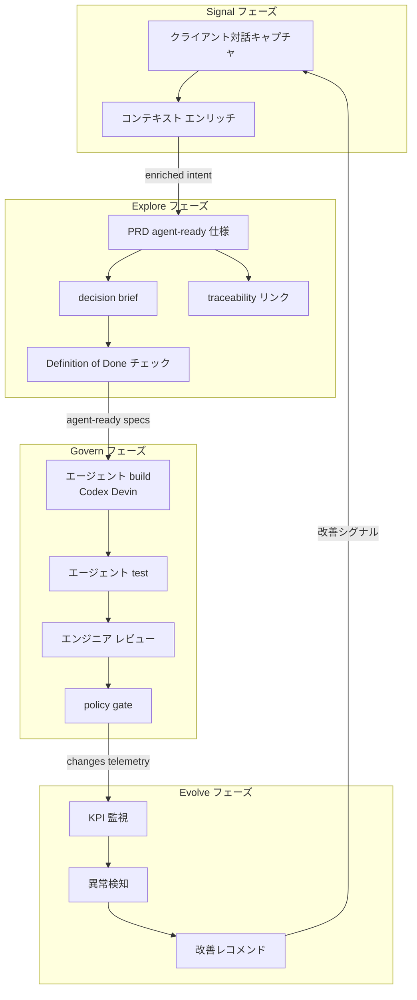
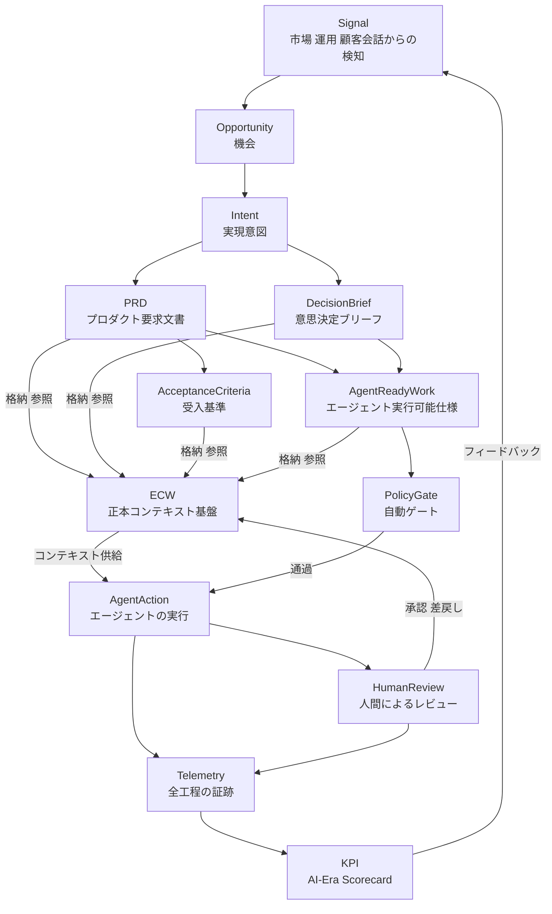
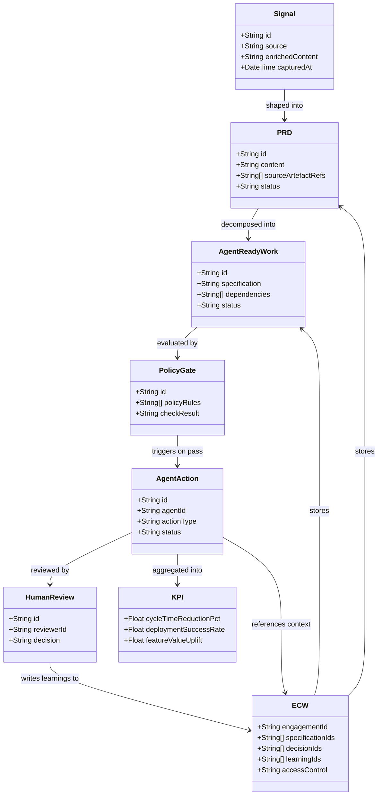

> 調査日: 2026-06-05 / 起点: OpenAI Frontiers「How Endava is redesigning software delivery around AI agents」
> 一次情報と二次情報、自己申告値と独立検証を区別して記述します。効果数値は当事者の自己申告が中心で、独立した第三者検証は本調査の範囲では確認できませんでした。反証(METR / DORA / Goodhart / Klarna)はすべて上位カテゴリからの外挿であり、Dava.Flow を名指しで否定する独立証拠は存在しません。

## 概要

Endava plc(NYSE: DAVA、2000 年設立、本社 London、従業員 約11,636人〈2025-09-30 時点。Q2 FY2026 の 2025-12-31 時点では約11,385人に減少〉、72 都市/32 か国)は、金融・モビリティ・通信など多業種向けにソフトウェアデリバリーを担う IT サービス企業です。CTO の Matthew Cloke は OpenAI との共同事例で「To be AI-native at Endava, it's about thinking about AI to solve the problem first」(AI を最後ではなく最初に考える)と語り、AI 導入を「新しいツールを配ること」ではなく、ワークフロー・リーダー行動・チーム間協働を作り替える行動変容として定義しました。

Cloke が主導して設計した自社デリバリー方法論が **Dava.Flow™**(OpenAI の表記は DavaFlow)です。アイデア・機能・修正のすべてを単一の連続フローでつなぐ「AI-native engagement system」と位置づけ、4 フェーズ **Signal → Explore → Govern → Evolve** で構成します。スローガンは **"Agents do; people govern."**(エージェントが実行し、人が統治する)です。OpenAI 技術(ChatGPT Enterprise と Codex)は「Dava.Flow ライフサイクルのあらゆる部分に組み込まれている」とされます。

本記事は、AI をツール配布ではなく制度として扱う具体例として Dava.Flow を構造化し、開発者だけでなく PM・法務・経営まで巻き込む成果物と評価制度の設計を整理します。あわせて、METR・DORA など利害中立の大規模研究を反証として突き合わせ、自組織へ持ち込む際の意思決定材料を提示します。結論を先に述べると、制度化の方向性そのものは先進企業の型と整合しますが、効果は当事者の自己申告に偏っており、自己申告 KPI を真に受けず実測と下流統制で検証することが前提になります。

## 特徴

### 4 フェーズ: Signal から Evolve まで

- **Signal** ── クライアント対話・運用データ・市場インサイトから重要な機会を捕捉・エンリッチします。
- **Explore** ── 意図を「明確で、統治可能で、エージェントが処理できる(governable, agent-ready)」作業へ変換します。PRD・decision brief・ストーリーマップなどを生成し、成果物はすべてソース成果物へトレース可能(traceability 内蔵)です。Miro の AI Innovation Workspace と連携して具体化します。
- **Govern** ── AI エージェントが build/test の大半を担い、エンジニアはオーケストレーションとレビューに集中します。コンプラ・品質チェックは別委員会ではなく **policy-in-pipeline**(パイプライン内に自動内蔵)です。
- **Evolve** ── AI が本番のビジネス KPI・機能 KPI をリアルタイム監視し、異常検知と改善提案を継続的に出します。

フェーズは段階ゲートではなくエージェント速度の連続フローとして設計し、「プロジェクト管理から成果(outcome)管理へ」の転換を掲げます。

### "Agents do; people govern."

Govern フェーズを象徴するスローガンです。AI エージェントが実行を担い、人間はガバナンスとオーケストレーションへ役割を移します。これが「ツール配布で開発者を速くする」に留まらない核心です。

### policy-in-pipeline と telemetry everywhere

- **policy-in-pipeline**: コンプライアンス・品質・セキュリティのチェックをパイプライン内に自動で組み込みます。従来の後付けガバナンス委員会モデルと対比されます。
- **telemetry everywhere**: 全フェーズがトレーサビリティデータを残し、顧客に見せられる証跡を常時生成します。

### ECW(Engagement Context Warehouse)

全フェーズを横断する基盤が **ECW** です。仕様・要件・設計判断・学びを一元的に蓄積し、エージェントが参照する正本コンテキストを提供します。同様の設計は Thoughtworks の spec ファイル群や McKinsey QuantumBlack の `.sdlc/project-overview.md` にも見られ、「エージェントに渡す構造化コンテキストの正本化」は業界横断で収斂するパターンです。ECW はその一実装にあたります。

### AI-Era Scorecard: speed × quality × value

Endava は利用率(adoption rate)を主要 KPI に置きません。代わりに独自の **AI-Era Scorecard** で speed(cycle time / lead time)× quality(deployment success)× value(feature value uplift)の 3 軸を計測するとしています。

公開された定量値は次のとおりです。

| 数値 | 内容 | 注記 |
|---|---|---|
| 最大40% | cycle time / time-to-market の短縮 | 原文 "typically reduces time-to-market by up to 40 per cent"。上限・特定文脈の自己申告値で測定方法は非開示 |
| weeks, not quarters | PoC から本番までの期間 | 定性表現 |
| 40〜80%削減 | 法務カスタム GPT による特定タスクの時短 | Endava 自己申告値、測定方法は非開示 |

実務に近い指標としては「idea → definition のサイクルタイム」と「rework(要件再オープン率)」が示されています。

### 役割別の適用

開発者に留まらず、全職種への展開が制度化の要点です。

| 役割 | AI の使われ方 |
|---|---|
| 開発者 | AI エージェントを engineering workflow に統合し、デリバリーを加速 |
| プロジェクトマネージャ | Codex で governance report を生成し、エンジニアリング進捗を要約 |
| 法務 | リサーチと文書作成のワークフローを AI で効率化(カスタム GPT 活用) |
| コマーシャル(営業/事業) | スプレッドシート中心の計画を軽量 AI 生成アプリに置換 |
| 経営層 | エージェントでプロジェクト要約・コミュニケーション自動化・受信箱管理・非同期調整 |

法務・コマーシャルへの具体適用は一次(OpenAI 事例ページ)で確認できる範囲です。「2 時間の会議トランスクリプトを投入して要件分析を weeks → hours に短縮」という具体例は二次メディアが紹介していますが、取得できた一次本文では定性表現にとどまり逐語は未確認(二次扱い)です。

### AI fluency を採用・昇進基準に制度化

OpenAI 事例の "Results at a glance" の最後に **"Established AI fluency as part of hiring and promotion expectations across the company."**(AI フルエンシーを全社の採用・昇進の期待値に組み込んだ)が明記されています。これが「ツール配布」と「行動変容・制度化」を分ける最も明確な一次的根拠です。

あわせて次の展開プロセスが確認できます。

- **150 人のパイロット**から開始し、最終的に **約9,000人に ChatGPT Enterprise を付与**(全社母数 約11,636人とは別の数値で、全員が使っているとは読めません)。
- **300超のカスタム GPT** を全社で作成。
- グローバル変革プログラム "Keystone"、各チームの **champions network**、役割ごとに段階を変える **tiered training** を実施。
- 「Legal・HR・leadership がデリバリーチームと同時に前進しないと適応は停滞した」という教訓を明示。

## 構造

C4 モデルの「システムコンテキスト / コンテナ / コンポーネント」を、提案手法 Dava.Flow™ の論理構造に読み替えて 3 段階でドリルダウンします。

### システムコンテキスト



| 要素名 | 説明 |
|---|---|
| 開発者 エンジニア | build/test を委任し、エージェントをオーケストレーション、成果物をレビュー |
| プロジェクトマネージャ | Codex でガバナンスレポート生成・進捗要約 |
| 法務 | リサーチ・文書作成ワークフローの AI 効率化 |
| コマーシャル | スプレッドシート計画を AI 生成の軽量アプリに置換 |
| 経営層 | エージェントによる要約・調整の自動化 |
| クライアント | 要件・インサイトの提供元、成果物・証跡の受領者 |
| Dava.Flow | アイデアから機能・修正までを単一連続フローで統括する AI-native 方法論 |
| OpenAI ChatGPT Enterprise + Codex | 約9,000人に付与された enterprise AI platform。単一商用 API への密結合がリスク |
| Cognition Devin Windsurf | Govern フェーズの governed agentic coding をスケールさせる coding agent(Endava の提携・利用文脈であり Dava.Flow の必須構成要素とは限らない) |
| Miro AI Innovation Workspace | Explore フェーズで messy inputs を structured outputs に変換 |

### コンテナ



| 要素名 | 説明 |
|---|---|
| Signal | クライアント対話・運用データ・市場インサイトから重要情報を捕捉・エンリッチ |
| Explore | 意図を governable・agent-ready な作業へ変換。artifact は traceability 内蔵 |
| Govern | AI エージェントが build/test を担い、エンジニアがオーケストレーション・レビュー |
| Evolve | AI が本番 KPI を監視し、異常検知・改善提案を出力 |
| ECW | 仕様・要件・設計判断・学びを蓄積する正本コンテキスト基盤 |
| AI-Era Scorecard | speed × quality × value を計測。利用率ではなく成果で評価 |
| policy-in-pipeline | コンプラ・品質チェックをパイプライン内に自動組込み |

### コンポーネント



| 要素名 | 説明 |
|---|---|
| クライアント対話キャプチャ | 会議トランスクリプト・ヒアリングを構造化して取り込み |
| PRD agent-ready 仕様 | Definition of Done・受入基準を内包した、エージェント実行可能な粒度の仕様 |
| decision brief | 意思決定の根拠・前提・リスクをまとめたブリーフ |
| traceability リンク | 生成 artifact を source artefact に逆引きリンク |
| エージェント build test | OpenAI Codex・Cognition Devin が実装・テストを担当 |
| エンジニア レビュー | 人間が成果物をレビューし標準・ポリシーを強制 |
| policy gate | コンプラ・セキュリティ・品質チェックを自動実行 |
| KPI 監視 異常検知 改善レコメンド | 本番 KPI を監視し、検知結果から改善を Signal へ戻す |

## データ

Dava.Flow が扱う主要概念とその関連を示します。Signal を起点に、Explore で各種アーティファクト(PRD・DecisionBrief・AcceptanceCriteria・AgentReadyWork)を生成し、すべて ECW に格納してエージェントの参照基盤とします。Govern では PolicyGate を通過した AgentAction を実行し HumanReview で監督します。Evolve では Telemetry と KPI を収集し、フィードバックループとして Signal へ戻します。

### 概念モデル



| 概念 | 説明 |
|---|---|
| Signal | 顧客会話・運用データ・市場インサイトから検知・エンリッチした情報 |
| Opportunity | Signal を解釈して見出した事業機会 |
| Intent | Opportunity を具体的な実現意図に変換した中間概念 |
| PRD | 構造化要件。ソースへのトレーサビリティを内蔵 |
| DecisionBrief | 設計・方針の意思決定を記録、根拠と選択肢を保持 |
| AcceptanceCriteria | Definition of Done を含む受入基準 |
| AgentReadyWork | エージェントが安全に処理できる粒度に正規化した仕様 |
| ECW | 仕様・要件・設計判断・学びを蓄積する正本コンテキスト基盤 |
| PolicyGate | コンプラ・品質・リスクチェックを自動実行するゲート |
| AgentAction | PolicyGate 通過後にエージェントが実行する build・test・変更 |
| HumanReview | AgentAction を監督・承認・差戻しする統治行為 |
| Telemetry | 全フェーズの実行証跡、顧客に開示可能なエビデンス |
| KPI | speed × quality × value の 3 軸スコアカード |

注: 「Signal → Opportunity → Intent」の 3 段変換は、一次の公式定義(Signal → Explore 直結)に対する本記事の概念補完です。

### 情報モデル



| エンティティ | 主な属性 |
|---|---|
| Signal | source, enrichedContent, capturedAt |
| PRD | content, sourceArtefactRefs(traceability), status |
| AgentReadyWork | specification, dependencies, status |
| ECW | specificationIds, decisionIds, learningIds, accessControl |
| PolicyGate | policyRules, checkResult |
| AgentAction | agentId, actionType, status |
| HumanReview | reviewerId, decision |
| KPI | cycleTimeReductionPct, deploymentSuccessRate, featureValueUplift |

公式に未記載の属性は実装上の補完です。traceability は PRD の `sourceArtefactRefs` と ECW への格納で実装し、「各フェーズが顧客に開示可能な証跡を残す」という設計原則を支えます。

## 構築方法

ここからは Endava 公式発表・McKinsey QuantumBlack の知見・GitHub Actions 公式ドキュメント等を参考に設計した実装案です。Endava 公式の主張・数値とは区別します。

### ECW 相当のコンテキスト正本をリポジトリに置く

ECW は「仕様・要件・設計判断・学びを蓄積し、エージェントが参照する正本コンテキストを一元化する」基盤です。McKinsey QuantumBlack は同機能を `.sdlc/project-overview.md` で実装し、「工程間の引き継ぎでコンテキストが死ぬ」問題を防ぎます。3 社が収斂する設計パターンは、エージェントが安全に参照できる構造化コンテキストの正本を単一の場所に置くことです。

実装案のディレクトリ構造を示します。

```
<repo-root>/
├── .context/
│   ├── project-overview.md       # 目的・スコープ・ステークホルダー
│   ├── architecture.md           # 全体構成・技術選定の決定記録
│   ├── agents/AGENTS.md          # エージェントへの共通指示
│   ├── specs/requirements/       # agent-ready な要件票
│   ├── specs/decisions/          # 設計判断ログ
│   └── telemetry/scorecard.yaml  # AI-Era Scorecard 指標定義
```

agent-ready 要件票の実装案です。`status: agent_ready` が付いた要件のみエージェントに渡し、未確定仕様の先行着手を防ぎます。

```yaml
# specs/requirements/US-042-invoice-export.yaml
id: US-042
title: "請求書 PDF エクスポート"
phase: Explore
status: agent_ready          # draft / review / agent_ready / done
priority: must
acceptance_criteria:
  - PDF が JIS X 0208 準拠フォントで出力される
  - 生成は 3 秒以内
  - エクスポート操作は監査ログに記録される
traceability:
  source: "2026-05-20 キックオフ議事録 p.3"
  decision_brief: "decisions/2026-05-20-pdf-format.md"
ai_constraints:
  - "外部 PDF ライブラリのライセンスを事前確認する"
  - "個人情報を含む場合は暗号化必須"
```

### policy-in-pipeline を GitHub Actions で実装する

Govern フェーズは "policy-in-pipeline automation" を掲げ、コンプライアンス・品質チェックをパイプライン内に自動組込みします。AI 生成 PR に対して lint / test / security scan / ポリシーチェックを人間の承認前に完走させることが「Agents do; people govern.」の技術実装です。DORA 2024 は「AI adoption が 25% 増加した場合、delivery stability −7.2% と推定」と報告しており、policy-in-pipeline の整備は方法論の前提条件でもあります。

実装案のワークフロー骨格です。

```yaml
# .github/workflows/ai-governed-pr.yml
name: AI-Governed PR Pipeline
on:
  pull_request:
    types: [opened, synchronize, reopened, closed]  # closed を含めないと scorecard ジョブが発火しない
permissions:
  contents: read
  pull-requests: write
  security-events: write
jobs:
  lint:
    runs-on: ubuntu-latest
    steps:
      - uses: actions/checkout@v4
      - uses: actions/setup-node@v4
        with: { node-version: "20", cache: "npm" }
      - run: npm ci
      - run: npm run lint
  test:
    runs-on: ubuntu-latest
    needs: lint
    steps:
      - uses: actions/checkout@v4
      - run: npm ci && npm test -- --coverage
  security:
    runs-on: ubuntu-latest
    needs: lint
    steps:
      - uses: actions/checkout@v4
      - uses: github/codeql-action/init@v3
        with: { languages: javascript-typescript }
      - uses: github/codeql-action/autobuild@v3
      - uses: github/codeql-action/analyze@v3
      - run: npm audit --audit-level=high
  policy:
    runs-on: ubuntu-latest
    needs: [test, security]
    steps:
      - uses: actions/checkout@v4
      - name: License Policy Check
        run: npx license-checker --onlyAllow "MIT;Apache-2.0;BSD-2-Clause;BSD-3-Clause;ISC" --excludePrivatePackages
```

### 段階展開を設計する

Endava は「150 人パイロット → 約9,000人へ展開」に際し、トップダウンの号令ではなく各チームの champions が日々の行動をモデル化する方式をとりました。BCG「AI at Work 2025」は「5 時間超の研修を受けた人の 79% が regular user(5 時間未満は 67%)」と示し、研修量の閾値効果を裏づけます。

実装案の 3 段階ロードマップです。

```
Phase 0 パイロット(〜3ヶ月): 50〜150名で ECW 初期整備 + policy-in-pipeline 最小構成 + Scorecard baseline 計測
Phase 1 Champions Network(4〜9ヶ月): 全部門に Champions 配置 + 役割別「AI 前提の成果物」定義 + 浮いた時間ガイドライン制定
Phase 2 全社標準化(10ヶ月〜): AI fluency を採用・昇進の期待値に。ただし Scorecard 数値を個人の人事評価ターゲットに直結させない(Goodhart 回避)
```

## 利用方法

### 開発者: Govern での build/test とレビュー

Govern フェーズは "AI agents handle more of the build and test, while engineers orchestrate" です。エンジニアは「全部自分でビルド」から「オーケストレーション + 変更レビュー + 標準の強制」へ役割が移ります。

実装案の日常ワークフローです。

```bash
# コンテキスト正本を確認してからエージェントを起動する
cat .context/project-overview.md
cat .context/specs/requirements/US-042-invoice-export.yaml

# agent_ready 要件を渡してコード生成を依頼する
codex "以下の要件票を実装してください: $(cat .context/specs/requirements/US-042-invoice-export.yaml)"

# 生成差分を確認し、[ai-generated] ラベルで PR を作成する
git commit -m "feat(invoice): PDF エクスポート実装 [ai-generated]"
gh pr create --label "ai-generated" --draft
```

### PM: ガバナンスレポート生成

「プロジェクトマネージャが Codex でガバナンスレポートを生成し、エンジニアリング進捗を要約した」のが一次本文の記述です。実装案として、マージ済み PR と Scorecard 値を集約し、AI に週次レポートを生成させる構成が考えられます。AI-Era Scorecard の指標定義は次のように具体化できます。

```yaml
# .context/telemetry/scorecard.yaml
metrics:
  speed:
    idea_to_definition_days: { baseline: 14, target: 7 }
    definition_to_merge_days: { baseline: 5, target: 3 }
  quality:
    deployment_success_rate: { baseline: 85, target: 95 }
    ai_pr_rework_rate: { target: 15 }   # AI 生成 PR の再オープン率
  value:
    feature_value_delivery: { target: 80 }  # OKR/KPI に紐付く割合
evaluation_policy:
  warning: |
    Scorecard の数値を個人の人事評価ターゲットに直結させない。
    Goodhart の罠を回避するため、チームの健全性モニタリングとして使う。
```

### BA: agent-ready spec 化

Explore フェーズは「意図を agent-ready な作業へ変換する」フェーズです。会議トランスクリプトを AI に投入して要件票の草案を生成し、曖昧さチェックと decision brief 合意を経て `status: agent_ready` に更新します。これで policy-in-pipeline のトレーサビリティチェックが通るようになります。

### 法務・コマーシャル: カスタム GPT と軽量アプリ

法務はカスタム GPT で特定タスクを 40〜80% 削減したと Endava は述べており(自己申告値、測定方法は非開示)、財務と連携して契約データ抽出を自動化します。コマーシャルはスプレッドシート中心の計画を軽量 AI 生成アプリに置換し、社内の価格設定では単一ページの pricing アプリをその場で構築しました。いずれも before/after の実測値を記録し、自己申告に頼らない検証を組み込むことが重要です。

## 運用

### AI-Era Scorecard を実測する

公開された定量値は「最大 40% 削減」という上限・特定文脈の表現にとどまります。後述する METR の RCT は「自己申告は実測と系統的に乖離する」ことを示しており、テレメトリによる実測が前提になります。計測対象は次の 3 層で設計します。

| 層 | 計測内容 |
|---|---|
| プロセス | idea-to-merge lead time(フェーズ単位)、AI-assisted PR の merge rate / revert rate |
| 品質 | change failure rate、mean time to restore、SAST finding 密度(AI 生成と非 AI を分離計上) |
| 価値 | feature value uplift(A/B・フィーチャーフラグで対照)、rework rate |

Scorecard の初期値は「Baseline Sprint」として計測します。6〜8 週のウォームアップ期間はターゲットを設定せず計測のみ行います。ターゲット先行は Goodhart 問題を誘発するためです。体感調査を取る場合はテレメトリ実測値と並置し、乖離幅を記録します。これは METR の知見(実測 −19% / 体感 +20% という乖離)に基づく補正設計です。

### 下流統制を同時に強化する

DORA 2024 は「AI adoption が 25% 増加した場合、delivery stability −7.2% と推定」と報告しています(2025 でもスループットとの関係は改善した一方、安定性との負の関係は継続)。本記事では、この負の関係を「下流統制の弱さが露呈する可能性」として解釈します。AI で変更速度が上がるほど、下流統制を同時に強化する必要があります。

| 統制 | ツール例 | 閾値設計の原則 |
|---|---|---|
| 単体/統合テスト | pytest / Jest / JUnit | AI 生成コードのカバレッジを非 AI と同水準に維持 |
| SAST | Veracode / Semgrep | AI 生成ファイル分離計上、high/critical は merge block |
| SCA / ライセンス | FOSSA / Scancode | AI 訓練データ由来の GPL 汚染をフラグ |
| コードレビュー | PR テンプレート + CODEOWNERS | AI 生成 PR は人間レビュアー 1 名以上を必須化 |

### 法務・HR と同時に前進する

「Legal / HR / leadership がデリバリーチームと同時に前進しないと適応が停滞した」は Endava 自身の教訓です。法務は EU AI Act の deployer / provider 再分類、AI 生成コードの著作権保護空洞化、ライセンス汚染対応を並走させます。HR は「浮いた時間の使い道」ガイドライン策定(Gartner 調査では 7% の組織しか持っていません)と、AI 利用への不安の定期サーベイを並走させます。

## ベストプラクティス

各項目は「誤解 → 反証 → 推奨」の構造で示します。前提として、以下の反証はすべて上位カテゴリへの外挿であり、Dava.Flow を名指しで否定する独立証拠は存在しません。

### 利用率 KPI で成功を測る誤解

**反証**: METR「Measuring the Impact of Early-2025 AI on Experienced Open-Source Developer Productivity」(METR ブログ 2025-07-10 / arXiv:2507.09089、一次・RCT)は、熟練 OSS 開発者 16 名・246 タスク(平均 2.2 万 stars / 100 万行超、主に Cursor Pro + Claude 3.5/3.7 Sonnet)を対象に、AI 使用時のタスク完了が **19% 長くかかった**(遅くなった)と報告しました。さらに被験者は事前に「24% 速くなる」と予測し、遅くなった後ですら「20% 速かった」と誤認しました。主観的有用感と実測値が逆方向になります(ただし 16 名・OSS 熟練者・early-2025 モデルの限定条件で、一般化はできません)。

**推奨**: 利用率は「展開の確認」に使い、「成功指標」には使いません。成功指標は lead time・change failure rate・rework rate のテレメトリ実測に移します。体感調査は必ずテレメトリと突き合わせます。

### AI 加速すれば配信品質も良くなる誤解

**反証**: DORA 2024 は「AI adoption が 25% 増加した場合、delivery stability −7.2% と推定」と報告し、2025 でもスループットとの関係は改善した一方、安定性との負の関係は継続しました。Veracode「2025 GenAI Code Security Report」は **AI 生成コードサンプルの 45% がセキュリティテストに失敗**と報告します(「人間比 2.74 倍」は Veracode 一次では未確認で二次/別研究由来)。

**推奨**: AI 加速と下流統制の強化を常にセットで実施します。AI 生成コードの分離 SAST 計上、change failure rate と MTTR の Scorecard 組込み、人間レビュアー必須化、デプロイ後 24h 以内の DAST 自動実行が具体策です。

### AI 利用を評価・昇進ターゲットに直結させる誤解

**反証**: Goodhart's Law(測定が目標になると良い測定でなくなる)により、AI 利用率を個人評価ターゲットにすると、プロンプトの水増しや見せかけの PR 分割を誘発します。DORA 実務ガイドも「DORA 指標を個人の人事評価ターゲットに直結させるな」と警告します。二次報道によれば、先進企業の Meta は個人の AI 利用・採用メトリクスを 2025 年のパフォーマンスレビューに含めない方針をとっており、「評価制度化が先進的」という枠組みへの直接的な反例です。Gartner 調査では「浮いた時間のガイドラインを持つ組織はわずか 7%」です。

**推奨**: 「AI フルエンシーを期待値として定義する」ことと「AI 利用率を評価ターゲットにする」を分けて設計します。期待値は役割ごとの「AI 前提の成果物」で表現し、評価は AI 利用量ではなく delivery outcome への貢献に紐付けます。その outcome 指標も個人の絶対ターゲットにはせず、チームレベルのトレンドとして見ます。

### ベンダー事例を額面で信じる誤解

**反証**: 本調査の範囲では、Dava.Flow の効果数値を独立に検証した第三者報告・監査・アナリストレポートは見つかりませんでした。流通ソースはほぼすべて利害関係者発の一次プロモーション素材か、それを額面どおり再掲する二次記事です。OpenAI 顧客事例が「初期の華々しい数値 → 後の静かな撤回」を辿った前例として **Klarna** があります。2024 年に AI チャットボットが 700 人分相当・4,000 万ドルの利益改善を喧伝しましたが、2025 年には CS 評価低下を受け、人間の CS 要員の採用を再開しハイブリッド運用へ転換したと複数の二次報道が伝えています。加えて Endava は Q2 FY2026 で売上前年同期比 −5.9% と減速しており(複数の二次報道は顧客契約の終了やレイオフにも言及)、こうした逆風下での事例発信であるため、投資家・採用向けのポジティブな語りが混じる可能性は考慮すべきです。

**推奨**: ベンダー事例の数値は「参照範囲」として使い、自組織の前後比較テレメトリで独自に実測します。数値引用時は「当事者の自己申告値、独立検証なし」を明記します。新しい AI 投資の ROI 判断には、1〜2 年後の品質・顧客満足・人材定着まで追跡するサイクルを設けます。

### 全工程 AI 化 = 効率化の誤解

**反証**: EU AI Act は 2026-08-02 から高リスク AI システム義務が適用開始されます(全条項の全面適用ではなく一部は 2027-08)。高リスク適合性評価のコストは 1 システムあたり €5,000〜€50,000(二次のコスト統計、公式手数料ではなく案件規模・notified body 要否で変動)です。罰則は違反類型で異なり、禁止行為・特定データ要件違反は最大 €3,500 万または全世界売上の 7%、高リスク義務違反は最大 €1,500 万または 3% です(高リスク文脈で 7% のみを示すと過大表現になります)。知財面では、米国著作権局(2025-01)等が「人間の表現的寄与なき AI 生成物は著作権保護不可」と判示し、顧客への知財保証が空洞化するリスクがあります。

**推奨**: 全工程 AI 化の前に規制スコープと知財リスクを工程ごとにマッピングします。EU 顧客向けは deployer/provider 分類を法務と事前確定し、適合性評価コストを見積りに算入します。AI 生成コードの provenance 追跡を義務化し、顧客への知財保証範囲を契約条項に明記します。OpenAI API 単独への密結合を避け、マルチモデルへの切替経路をアーキテクチャに残します。

## トラブルシューティング

### 現場の抵抗が想定より強い

Gartner 調査(従業員 2,986 名、2025-12-16)は「65% は職場での AI 利用に excited、77% は研修が提供されれば受講」と示し、「C-suite は AI の価値不足を従業員の抵抗のせいにするが実態ではない」と結論づけました。真因は AI への抵抗より、変化一般への低信頼(change fatigue)・拙速導入・浮いた時間の使い道が未設計にあります。対処として、「AI そのものが不安か」「変化のペースが速すぎるか」を分けて聞くサーベイを実施し、change fatigue が原因なら導入ペースを落とし、浮いた時間ガイドラインを即座に策定し、マネージャーをエンパワーします。

### workslop(低品質 AI 出力の無自覚な量産)

Stack Overflow Developer Survey 2025 では約半数の開発者が「AI 生成コードのデバッグは自分で書くより時間がかかる」と回答しました。AI 出力をそのまま通すワークフローと、検証ループを挟むワークフローでは生産性が大きく異なります。対処として、PR テンプレートに「AI 生成チェックリスト」を追加し、AI 生成コードのレビュー観点を研修に組み込み、change failure rate と MTTR を可視化して悪化トレンド時に検証ループを強制します。

### メトリクスのゲーミング

cycle time は改善するのにビジネス価値が変わらない、PR 数は増えるが 1 件あたりの変更量が極端に小さい、といった症状は Goodhart's Law の典型です。対処として、Scorecard の価値計測(feature value uplift)をプロセス計測(lead time)と同等のウェイトに引き上げ、PR サイズ分布をモニタリングし、指標を個人評価ターゲットから切り離します。

### ベンダーロックインの顕在化

Dava.Flow は OpenAI 技術がライフサイクル全体に組み込まれており、方法論レベルで単一商用 API に密結合しています。価格改定・仕様変更・モデル退役が delivery プロセス全体の単一障害点になり得ます。対処として、各フェーズで利用する API とモデル ID を棚卸しし、代替モデルへの切替コストを試算し、プロンプト・ワークフロー定義を API ベンダー非依存の形式で管理してアダプタ層を設けます。

## まとめ

Endava の Dava.Flow は「AI 導入 = ツール配布」を否定し、方法論・成果物・評価制度・採用昇進基準まで作り替えた先進事例で、その方向性は BCG・McKinsey が挙げる高成果企業の型と整合します。一方で効果数値は当事者の自己申告に偏り独立検証がなく、METR・DORA という中立・大規模研究は熟練者×成熟コードベースでむしろ逆効果・安定性悪化を示すため、自己申告 KPI を真に受けず実測と下流統制で検証し、評価指標を個人ターゲットに直結させない設計が前提になります。

この記事が少しでも参考になった、あるいは改善点などがあれば、ぜひリアクションやコメント、SNSでのシェアをいただけると励みになります！

## 参考リンク

- 一次ソース(Endava / OpenAI / 規制・研究)
  - [OpenAI: How Endava is redesigning software delivery around AI agents](https://openai.com/index/endava-frontiers/)
  - [Endava: Dava.Flow](https://www.endava.com/dava-flow)
  - [Endava: What Is Dava.Flow(CTO Matt Cloke インタビュー)](https://www.endava.com/insights/articles/what-is-dava.flow-a-conversation-with-endavas-cto-endava)
  - [Endava: Becoming AI Native](https://www.endava.com/insights/articles/becoming-ai-native-empowering-teams-with-openai-tools-and-expertise)
  - [Endava: Agentic Endava](https://www.endava.com/capabilities/artificial-intelligence/agentic-endava)
  - [Endava: Cognition agentic AI partnership 拡大](https://www.endava.com/who-we-are/newsroom/endava-expands-cognition-agentic-ai-partnership)
  - [Endava Investor Relations](https://investors.endava.com/)
  - [METR: Early-2025 AI on experienced OS dev productivity](https://metr.org/blog/2025-07-10-early-2025-ai-experienced-os-dev-study/)
  - [arXiv:2507.09089](https://arxiv.org/abs/2507.09089)
  - [DORA 2024](https://dora.dev/research/2024/dora-report/)
  - [DORA 2025](https://dora.dev/dora-report-2025/)
  - [EU AI Act(欧州委員会)](https://digital-strategy.ec.europa.eu/en/policies/regulatory-framework-ai)
- 参考実装パターン・基盤ツール
  - [Miro: Endava × Miro AI Innovation Workspace](https://miro.com/blog/endava-and-miro/)
  - [McKinsey: Redesigning technology workforce for the agentic AI era](https://www.mckinsey.com/capabilities/mckinsey-technology/our-insights/designing-an-end-to-end-technology-workforce-for-the-ai-first-era)
  - [Thoughtworks](https://www.thoughtworks.com/)
  - [GitHub Actions 公式ドキュメント](https://docs.github.com/en/actions)
  - [DORA Metrics](https://dora.dev/)
- 二次ソース(補強・反証)
  - [Veracode 2025 GenAI Code Security Report](https://www.businesswire.com/news/home/20250730694951/en/)
  - [Google Cloud: DORA 2025 解説](https://cloud.google.com/blog/products/ai-machine-learning/announcing-the-2025-dora-report)
  - [Gartner: 65% excited to use AI](https://www.gartner.com/en/newsroom/press-releases/2025-12-16-gartner-hr-survey-finds-65-percent-of-employees-are-excited-to-use-ai-at-work)
  - [HR Grapevine: Meta AI performance review 方針](https://www.hrgrapevine.com/us/content/article/2025-11-17-meta-to-formally-review-employees-ai-performance-from-2026)
  - [The Pragmatic Engineer: Klarna's AI chatbot](https://blog.pragmaticengineer.com/klarnas-ai-chatbot/)
  - [BCG: AI at Work 2025](https://www.bcg.com/publications/2025/ai-at-work-momentum-builds-but-gaps-remain)
  - [SQ Magazine: EU AI Act コスト統計](https://sqmagazine.co.uk/eu-ai-act-compliance-cost-statistics/)
