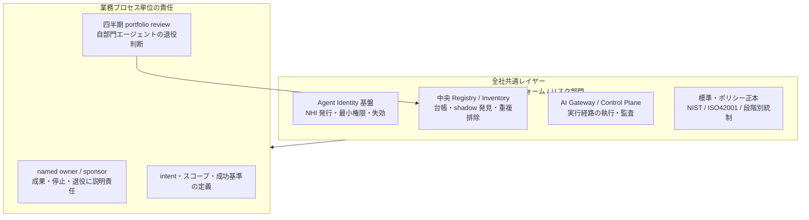
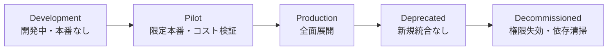

## この記事の主題

大企業が数千体規模のAIエージェントを全社導入する構想が相次いでいます。みずほフィナンシャルグループ（以下みずほFG）の「業務プロセス全体をAI前提で再設計する」方針は、その代表例として報じられました。

本記事は、この動きを発注側・経営側の視点で捉え直します。個社の成否を評価するのではなく、そこから「規模に依らず効く統制の構造」を取り出します。

先に結論を置きます。

- 経営が管理すべき単位は、エージェントの「体数」ではありません。体数は旗印にしやすい一方、それ自体を目標に置くと、重複・低価値・野良エージェントを量産する誘因になります。
- 管理すべきは、「誰が各エージェントの成果と停止・廃止に説明責任を持つか（所有）」と、「使われなくなったエージェントをどう確実に止め、権限を回収するか（廃止）」の設計です。
- 統制は、「全社共通レイヤー」と「業務プロセス単位の責任」の分担で決まります。中央がアイデンティティ発行・台帳・実行ゲート・標準を敷き、各業務部門が名前のついた責任者として運用と退役判断を担います。
- ただし「枠組みを作れば数千体を御せる」とは限りません。大規模エージェント案件の40%超は2027年末までにキャンセルされるとの予測があり、統制の実装はまだ業界全体で未成熟です。統制設計は「頓挫を防ぐ十分条件」ではなく「最低条件」として捉えるべきです。

:::message
本記事の数値・固有名詞には、一次情報（公式発表・論文・当局資料）で裏取りできたものと、報道・解説記事経由の二次情報が混在します。後者は本文で「[二次情報]」と明記します。特に「3000体」という数字は一次で確認できていないため、扱いに注意します（後述）。
:::

## なぜ「体数」を管理単位にしてはいけないのか

まず、この論点で最も注意すべき点から述べます。「3000体」という数字は、経営が掲げる目標としては危険です。

理由は2つあります。

1つ目は、事実として、この数字が一次で裏取りできないことです。みずほFG公式の表現は一貫して「数千単位」であり、「3000体」という具体数も達成年度も示されていません（詳細は後述）。

2つ目は、より本質的な問題です。体数を旗印に掲げると、エージェントを作る・残す動機が「数を積む」方向に歪みます。

これは「グッドハートの法則（測定が目標になると、それは良い測定でなくなる）」の典型です [二次情報]。「何体入れたか」を成果指標にすると、次のような逆機能が起きます。

| 逆機能 | 内容 |
|---|---|
| 重複の量産 | 同じ機能のエージェントが部門ごとに乱立 |
| 低価値の温存 | 使われないエージェントも「体数」として残る |
| 野良化 | 責任者が曖昧なまま数だけ積み上がる |

「投入体数の多さ＝再設計の好例」という評価軸そのものが、いわゆる虚栄の指標（vanity metric）に該当します。経営が管理すべきは、体数ではなく「所有」と「廃止」の設計です。

では、なぜ規模が大きくなると、この「所有」と「廃止」の設計が決定的になるのでしょうか。次にその理由を見ます。

## 規模がガバナンスの質を変える

エージェントが1桁のうちは、人手で把握できます。しかし数百から数千になると、「どのエージェントが・どの業務で・誰の責任で動いているか」が人の頭に収まらなくなります。

Gartnerは、平均的なグローバルFortune 500企業が2028年までに150,000体超のAIエージェントを使うと予測しています（2025年時点は15体未満）[二次情報]。規模は、ガバナンスを「あると便利」から「無いと崩壊する」へと変えます。

同時に、業界はエージェントを「非人間のアイデンティティ（NHI: Non-Human Identity）」として扱い、人間のIDと同じ規律（認証・認可・ガバナンス・監査）を適用する方向に収斂しています。エージェントは「便利な機能」ではなく、「管理・統治されねばならない労働力」です。この認識の有無が、統制設計の出発点を分けます。

## エージェントの群れ（fleet）を御す道具立て

数千体のエージェントは、もはや個別のツールではなく「群れ（fleet）」として扱う対象です。この群れを御す統制は、製品を問わず共通する7つのコンポーネントに分解できます。以下は、AWS・Microsoft・Oktaの公式ドキュメント（一次）とGartnerの分析（二次）を横断して抽出した構造です。

| # | コンポーネント | 役割 | 主に誰が持つか |
|---|---|---|---|
| 1 | Agent Identity（NHI） | エージェントごとの一意ID・最小権限・短命クレデンシャル・自動失効・kill switch・責任者紐付け | 全社共通 |
| 2 | Agent Registry / Inventory | 全エージェントの中央台帳。重複発見・承認ワークフロー | 全社共通 |
| 3 | Lifecycle & Decommission | 登録から退役までの5段階管理。依存分析付き廃止手順・四半期棚卸し | 中央が仕組み・現場が判断 |
| 4 | Runtime Enforcement | 実行経路上でのアクション前ポリシー執行・監査ログ | 全社共通 |
| 5 | Standards & Policy | NIST AI RMF / ISO 42001 / EU AI Act / 段階別ガバナンス | 全社共通 |
| 6 | Information Governance | エージェントがアクセスするデータの範囲統制・鮮度管理 | 中央が枠・現場が運用 |
| 7 | Human Accountability | 名前のついた責任者、責任あるAI文化 | 現場（業務部門） |

この7つは、「全社が共通に敷くレイヤー」と「各業務部門が担う責任」の2層に整理できます。これが本記事の背骨です。

| 要素名 | 説明 |
|---|---|
| central | 全社が共通に敷く統制レイヤー。中央のプラットフォーム部門とリスク部門が保持 |
| Agent Identity 基盤 | エージェントごとのID発行・最小権限・自動失効の中央基盤 |
| 中央 Registry / Inventory | 全エージェントの台帳。未登録エージェントの発見と重複排除 |
| AI Gateway / Control Plane | 実行経路上でポリシーを強制し、監査ログを残す層 |
| 標準・ポリシー正本 | 標準と段階別ガバナンスの基準を定める正本 |
| biz | 各業務部門が担うプロセス単位の責任 |
| named owner / sponsor | 各エージェントの成果・停止・退役に説明責任を持つ個人 |
| 四半期 portfolio review | 自部門のエージェントの継続・退役を定期判断する場 |

## ライフサイクルと廃止の設計

7コンポーネントのうち、経営が最も見落としやすいのが「ライフサイクルと廃止」です。

AWSのWell-Architected Agentic AI Lens（一次）は、「ライフサイクル規律のないエージェント群は、忘れられた所有者を持つ管理外サービスの墓場になる」と警告します。対策として、明示的な5段階を置きます。

| 段階 | 説明 |
|---|---|
| Development | 開発中。本番トラフィックは流さない |
| Pilot | 限定的な本番投入。コストと挙動を検証 |
| Production | 標準手順で全面展開 |
| Deprecated | 廃止予定。新規統合を止める |
| Decommissioned | サービスから除去。権限失効とリソース清掃を完了 |

各段階の遷移に、明示的な承認・検証ゲートを置きます。これにより、状態変更が「漂流」ではなく「意思決定」になります。

重要なのは、廃止（Decommission）が「業務を止める」ことでは完結しない点です。次の後始末が残ります。

- リソースの除去
- 権限（クレデンシャル・APIキー・OAuth認可）の失効
- レジストリの更新
- 依存システムへの通知

そして実行前には、上流の利用者を壊さないための依存分析が必要です。これらを手順書（runbook）として自動化しておかないと、後述する「野良化」が起きます。

## 全社共通統制 × 業務プロセス責任の分担

「全社共通統制」と「業務プロセス責任」の分担は、新しい概念ではありません。RPA（ロボティック・プロセス・オートメーション）が10年前に採った「Center of Excellence（CoE）＋3線防衛」モデルの再来です。

### 責任分担の原則

第一の原則は、説明責任の所在です。

- エージェントは、RACIの「実行（Responsible）」や「相談・報告」にはなれますが、「説明責任（Accountable）」には決してなりません。説明責任は常に名前のついた個人に残します [二次情報]。
- McKinseyは、すべてのデプロイ済みエージェントが「業務オーナー（成果に説明責任）」と「技術オーナー（性能・安全に説明責任）」の二重の責任者を持つべきだと整理しています [二次情報]。

「成果を明確に所有する個人がいない」状態こそ、AIプロジェクト失敗の最も一般的なパターンです [二次情報]。

### 金融庁の整理との対応

金融庁のAIディスカッションペーパー第1.1版（2026年3月公表。金融機関等130社が2024年10〜11月の調査に回答）も、同じ方向を示します。事前にリスクを消し切るのではなく、ライフサイクルを通じた継続的リスクマネジメント（アジャイル・ガバナンス）と、3線防衛によるリスク分類を整理しています。

| 線 | 主体 | 責務 |
|---|---|---|
| 第1線 | 業務部門・オペレーション | 低リスク業務を現場判断で自己管理 |
| 第2線 | リスク・コンプラ・法務 | 高リスク取引の事前審査、ポリシー策定 |
| 第3線 | 内部監査 | 独立したガバナンス検証、取締役会報告 |

原文で確認できるのは「低リスク業務は現場判断」「高リスク業務は専門部署の事前審査」という骨格です。次のような中間段階を含む3段階の例示は、解説記事による再構成です [中間段階は二次情報]。

- 低リスク（議事録作成）: チェックリストによる自己認証（骨格は金融庁原文）
- 中リスク（顧客向け説明文）: 部門長レビュー（解説記事の例示）
- 高リスク（顧客向けチャットボット・与信審査）: コンプラ・法務・リスクの事前審査（骨格は金融庁原文）

## 承認・停止・例外の設計

現場が責任を持つといっても、すべてをエージェントの自律に任せるわけではありません。承認・停止・例外を、設計として置きます。

### 常に人間承認を要する正準カテゴリ

エージェントの自信度に関わらず、次の5カテゴリは常に人間承認を要求すべきとされます [二次情報]。

1. 本番デプロイ
2. 外部コミュニケーションの送信
3. 閾値超の金融取引（設定可能、既定は $100）
4. データ削除
5. 権限変更

### 停止と例外の仕掛け

- kill switch のタイムアウト設計: 承認ウィンドウ（例: 30分）を超えると kill switch へエスカレーションします。保留中の承認が黙って永久にブロックし続けないための仕掛けです [二次情報]。
- 金融ガードレール: エージェントは一定金額まで取引執行や与信承認の権限を持てますが、上限超は人間の署名が必須です [二次情報]。
- 監督の3層: 実行中に介入する層、完了後にレビューする層、低リスクで自律させる層を、可逆性・影響範囲・信頼度・規制感度で使い分けます [二次情報]。

### プロンプトの中の禁止は統制にならない

BCGの分析は、重要な警告を出しています。インシデントの相当数は、境界がプロンプト内で指示されていたものの、プログラム的な強制がなかった場合に発生したと報告されます [二次情報: BCG 2026、具体的比率は原典で確認できず]。

プロンプトの中で「〜してはいけない」と書くだけでは、統制になりません。実行経路上でアクション前にポリシーを強制する技術基盤（前述のAI Gateway）が要ります。

## 評価と廃止判断のKPI

スケールは、エージェントが初期ドメインで価値・安定性・安全性を証明してから始めます。経営が見るべきシグナルは、一貫した性能・良好なビジネス成果・利用の定着、そして最小限の介入頻度です [二次情報]。

体数ではなく、統制の健全性を測るKPIを置きます [二次情報]。

| KPI | 何を測るか |
|---|---|
| 名前のついた責任者がいるエージェント割合 | 所有の徹底度 |
| 退役後の資格情報失効までの中央値時間 | 廃止の後始末の速さ |
| ポリシー判断が記録されたツール呼び出しの割合 | 実行統制の網羅度 |
| 孤児エージェント数 | 野良化の進行度 |
| インシデント発生率 | 統制の実効性 |

退役は、「業務オーナーと業務スポンサーが承認したリクエスト」で行います。本当に不要かを検証し、誤ってのシャットダウンを防ぐためです。デフォルトの期限を設けて能動的な再認証を求め、不活性をトリガーに自動廃止します。

## みずほFG事例の事実整理

ここで、起点となったみずほFGの事例を、一次情報と二次情報を厳密に区別して整理します。数字の扱いを誤ると、議論全体の信頼性が損なわれます。

### 数字の裏取り結果

| 数字 | 出所の性質 | 確認状況 |
|---|---|---|
| 3000体超のAIエージェント | 二次（日経クロステック記事の見出し・リード） | みずほ公式では未確認。公式表現は「数千単位」 |
| 15領域・100業務プロセス | 二次（日経クロステック・インタビュー） | みずほ公式原文では未確認 |
| 数千単位のAIエージェントを活用（将来） | 一次（みずほFG公式プレスリリース 2026-03-31） | 確認済み |
| 100を超えるAIエージェントが稼働（現状） | 二次（役員発言の報道） | 公式原文では未確認 |
| 3年で最大1000億円投資・10年で事務職最大5000人削減 | 二次（日経） | 別数字。3000体と混同しない |

起点の日経クロステック記事の本文は、有料会員限定で未読です。「3000体」という数値は、みずほ公式のIR・プレスリリース・DX記事の無料公開範囲では確認できませんでした。公式表現は一貫して「数千単位」です。

検索でヒットする他の「3000」は、事務員3000人の営業転換（2020年、無関係）や、ソフトバンク提携の3,000億円という「効果」目標（金額であり体数ではない）であり、「AIエージェント3000体」を裏付ける一次は確認できませんでした。

### みずほ公式で確認できた統制の骨格

- 共通基盤「エージェントファクトリー」（一次）: Agent Template、AIOA（AI Oriented Architecture）、Amazon Bedrock AgentCore、Dify を使い、開発からデプロイ・運用・改善までを標準化します。2026年2月にデジタル戦略部で本格展開を開始しました。
- AIOA は「全社ルール・標準化・統制の土台」と説明されます [二次情報]。
- 具体的な統制機能 [二次情報]: 部門ごとのアクセス権限管理、シングルサインオン認証、利用ログの一元管理、モデルリスク管理・顧客保護・ハルシネーション対策。
- 未確認（公開範囲で薄い）: エージェント単位のライフサイクル管理・廃止判断・責任者の明示・権限の粒度。

ここから読み取れる示唆があります。みずほFGは「全社共通レイヤー」（前述の道具立ての1・2・4・5）を明確に敷いています。一方で、「業務プロセス単位の所有と廃止」（3・7）の運用実態は、公開情報からは読み取れません。統制設計の成否は、まさにこの後者にかかります。

## 「枠組みを作れば御せる」への留保

本記事は統制設計を推奨しますが、それを過信しないことも同時に推奨します。以下は、「枠組みさえ作れば数千体を管理できる」という楽観を弱めるエビデンスです。

### 1. そもそも大半が本番前に頓挫する

- Gartner: エージェント型AIプロジェクトの40%超が2027年末までにキャンセルされます。理由はコスト増大・不明確なビジネス価値・不十分なリスク統制です [二次情報]。
- MIT NANDA（2025）: 生成AIパイロットの約95%が、損益に測定可能なインパクトを出せず失速したと報じられます [一次報道]。内製ビルドは外部調達より成功率が低いとの整理もありますが、具体的比率は原典で確認できていません [二次情報]。

統制フレームは、頓挫を防ぐ十分条件ではありません。作っても大半が本番に至りません。

### 2. 統制の実装が業界全体で未成熟

CSA（Cloud Security Alliance）の調査（大企業セキュリティリーダー235人）は、実装の未成熟を示します [二次情報]。

- 92%がAIアイデンティティを完全には可視化できていない
- 86%がAIアイデンティティにアクセスポリシーを強制していない
- エージェントの行動を人間スポンサーまで追跡できるのは28%のみ

「全社共通統制で御す」という結論は、統制の土台（誰が所有し、どの権限か）を追跡できている組織が3割未満という実態と衝突します。枠組みは概念として描けても、実装がまだ追いついていません。

### 3. 廃止は「業務を止める」では完結しない — 野良化のAI版

RPAの日本での先例に「野良ロボット」があります。管理責任者の不在で棚卸しが崩壊した歴史です [二次情報]。責任者を割り当てても、人事異動や引継ぎ不全で所有が蒸発するのが実務の現実です。

さらにエージェントの廃止は、業務を止めた後も、サービスアカウントがディレクトリに残り、APIキーが有効なまま、OAuth認可が残留します。孤児化したエージェントは、攻撃者の初期侵入の標的になります [二次情報]。AIエージェントはRPAより動的に権限を取得し、サブエージェントを生成する分、棚卸しが困難です。

### 4. 承認・停止ゲートは並行副作用の全域を覆えない

UC Berkeleyの論文「Why Do Multi-Agent LLM Systems Fail?」（arXiv:2503.13657、一次）は、7フレームワーク・1600以上のトレースを分析し、14の失敗モードを特定しました。失敗の多くはモデル性能ではなく設計に起因します。エージェント間のミスアラインが、原論文で約32%を占める主要カテゴリで、最もデバッグが困難です。

さらに「カスケード（誤り増幅）」があります。上流エージェントの軽微なズレが下流の入力になり、検知・訂正されないまま協調チェーンに沿って増幅します。人間が停止を判断する頃には、下流に伝播済みになりえます。

承認ゲートは、離散的な決定点でしか効きません。連続的・並行的に発生する副作用の全域は覆えません。

### みずほ個社への留保と、公平のための注記

みずほFGは2021年2〜9月に計8回のシステム障害を起こし、2021年11月26日に金融庁から業務改善命令を受けました（一次）。金融庁が挙げたガバナンス上の問題には、「IT現場の実態軽視」「言うべきことを言わず、言われたことしかしない姿勢」が含まれます。改善命令は2024年1月に事実上解除されました（一次）。

この「IT現場軽視」「言われたことしかしない組織文化」という指摘は、現場主導で数千体のエージェントを自律運用させる新方針の前提（現場が主体的に品質・停止判断を担う）と、緊張関係にあります。

一方で、公平のために明記します。今回の調査範囲では、みずほのAIエージェント方針そのものを名指しで批判する専門家論評は、確認できませんでした（賛美・技術解説の記事のみ）。反証は「個社批判」ではなく、「過去の実行力」と「大規模エージェント一般の失敗則」の合成です。同様に、銀行がエージェント大量投入で撤退した完了事例も時期尚早で不在であり、「統制で御せた証拠もまだ無い」段階です。

## 発注側・経営側への判断ポイント

数千体構想の採否・設計を判断する経営に対し、次の問いを推奨します。

1. 体数目標を掲げていないか。「何体入れるか」ではなく「どの業務プロセスの、どの判断を、誰の責任でエージェントに委ねるか」を目標の言葉にします。体数はKPIにしません。
2. 各エージェントに、名前のついた責任者（業務・技術の両方）がいるか。いなければ、それは統制ではなく放置です。所有の蒸発（異動・引継ぎ不全）を防ぐ再認証の仕組みまで設計します。
3. 廃止の手順書があるか。業務を止めるだけでなく、ID・鍵・認可・統合の後始末までを自動化し、四半期の棚卸しで孤児エージェントを検出します。廃止設計のない導入は、数年後の技術的負債とセキュリティリスクを前借りします。
4. 統制を「原則」だけにしていないか。プロンプトに禁止を書くのではなく、実行経路上でアクション前にポリシーを強制する技術基盤を用意します。
5. 一律のガバナンスにしていないか。自律度・影響度でエージェントを分類し、段階別に統制を変えます。低リスクは自己認証、高リスクは事前審査とします。
6. 統制を過信していないか。大半が頓挫し、実装は未成熟で、並行副作用は止めきれません。統制設計は「成功を保証する仕掛け」ではなく「失敗の被害を限定する最低条件」と位置づけます。

## 未解決の問い

本記事の土台には、一次で詰め切れていない点が残ります。読者が判断する際は、次の未確認を前提にしてください。

- 「3000体」「15領域・100業務」の一次確定（日経有料本文・みずほIR資料の精読）。現状は報道値。
- Gartnerの各数値（150,000体・40%キャンセル等）の原典の文言と前提（press release 本体は未取得、二次一致のみ）。
- 金融庁AIディスカッションペーパーの3線・リスク分類の記述が、解説記事の再構成か原文どおりか（PDF一次未取得）。
- 大規模エージェント導入の「撤退・ガバナンス破綻の完了事例」は現時点で不在。数年後に検証可能になります。

## まとめ

数千体のAIエージェント構想で経営が管理すべきは、体数ではなく「所有」と「廃止」の設計です。全社共通レイヤー（ID・台帳・実行ゲート・標準）と業務プロセス単位の責任者を分担させ、統制を「成功の保証」ではなく「失敗の被害を限定する最低条件」として捉えることが、規模に依らず効く構えになります。

この記事が少しでも参考になった、あるいは改善点などがあれば、ぜひリアクションやコメント、SNSでのシェアをいただけると励みになります！

## 参考リンク

- 公式ドキュメント・一次資料
  - [みずほFG エージェントファクトリー始動（PR TIMES, 2026-03-31）](https://prtimes.jp/main/html/rd/p/000000003.000177612.html)
  - [AWS Well-Architected Agentic AI Lens AGENTOPS03-BP01](https://docs.aws.amazon.com/wellarchitected/latest/agentic-ai-lens/agentops03-bp01.html)
  - [Microsoft Entra Agent ID](https://learn.microsoft.com/en-us/entra/agent-id/what-is-microsoft-entra-agent-id)
  - [Okta for AI Agents](https://www.okta.com/products/govern-ai-agent-identity/)
  - [金融庁 業務改善命令（2021-11-26）](https://www.fsa.go.jp/news/r3/ginkou/20211126/20211126.html)
- 論文
  - [Why Do Multi-Agent LLM Systems Fail?（arXiv:2503.13657）](https://arxiv.org/abs/2503.13657)
- 記事・分析
  - [みずほFG AIエージェント構想（日経クロステック, 有料）](https://xtech.nikkei.com/atcl/nxt/column/18/00001/11900/)
  - [みずほのAIネイティブプロセスとAIOA（ダイヤモンド・オンライン）](https://diamond.jp/articles/-/390752)
  - [みずほの統制機能の具体（インプレス dcross）](https://dcross.impress.co.jp/docs/usecase/004703.html)
  - [Gartner: AIエージェントスプロール管理の6ステップ](https://www.gartner.com/en/newsroom/press-releases/2026-04-28-gartner-identifies-six-steps-to-manage-artificial-intelligence-agent-sprawl)
  - [Gartner: 一律ガバナンスは失敗を招く](https://www.gartner.com/en/newsroom/press-releases/2026-05-26-gartner-says-applying-uniform-governance-across-ai-agents-will-lead-to-enterprise-ai-agent-failure)
  - [Gartner: エージェント型AIの40%超が2027年末までにキャンセル](https://www.gartner.com/en/newsroom/press-releases/2025-06-25-gartner-predicts-over-40-percent-of-agentic-ai-projects-will-be-canceled-by-end-of-2027)
  - [McKinsey: Trust in the age of agents](https://www.mckinsey.com/capabilities/risk-and-resilience/our-insights/trust-in-the-age-of-agents)
  - [CSA: Non-Human Identity / Agentic AI Governance whitepaper](https://labs.cloudsecurityalliance.org/research/csa-whitepaper-nonhuman-identity-agentic-ai-governance-v1-cs/)
  - [金融庁AIディスカッションペーパー第1.1版 解説](https://smart-governance.co.jp/resource/insights-fsa-ai-dp-personal-data-20260417)
  - [日経クロステック: 野良ロボ退治の基本ルール](https://xtech.nikkei.com/atcl/nxt/column/18/00287/051400003/)
