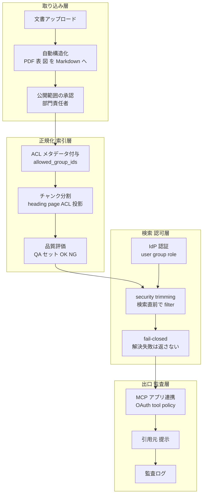
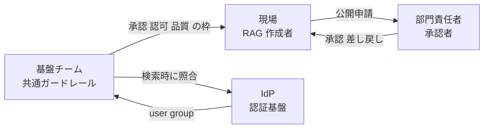

社内で生成AIの活用が広がると、部署ごとにRAG（検索拡張生成）環境が増えていきます。便利な一方で、機密データの所在、アクセス権、回答品質が全社から見えなくなります。ソフトバンクは、この「RAGの乱立」を禁止で抑えるのではなく、承認・認可・品質ゲートをシステムに組み込んだ1万9000人規模の「全社RAG基盤」で収束させたと報告しています（＠IT、社員本人の寄稿による準一次情報）。

この記事では、この事例を起点に、社内RAG乱立を収束させる設計原則を整理します。主要クラウドの公式実装パターンと国内他社事例で裏付けたうえで、過度な中央集権や自動品質評価の限界という反証でヘッジします。想定読者は、全社AI基盤の設計を判断する情シス・経営層と、permission-aware RAGを実装するエンジニアです。

## この記事の要点

- 収束の主レバーは検索精度ではありません。誰が上げ、誰が承認し、誰が見られるかを設計する認可モデルとオーナーシップが起点になります。
- ガバナンスは「承認」「認可」「品質ゲート」の3点セットで構成します。
- permission-aware RAGは、生成後に回答を隠す方式ではありません。検索時に未許可文書を根拠コンテキストへ入れない方式です。
- MCP（Model Context Protocol）は社内データへの標準接続面になりますが、それ自体は下流データの認可を代替しません。
- 「単一中央集権」「重い承認」「LLM自動評価への盲信」には、それぞれデータメッシュの失敗、Shadow AIの誘発、評価バイアスという反証があります。設計原則は低摩擦・セルフサービス・継続保守を条件とします。

## 社内RAGはなぜ乱立するのか

現場主導でAI活用が進むこと自体は前向きな動きです。しかし全社の視点では、次の3つの問題が同時に起きます（＠IT、ソフトバンクの寄稿による準一次情報）。

- 機密情報の所在が見えなくなるリスク。各部署が独自環境やSaaSへデータを上げると、誰がどこに何を置いたかを全社で把握しづらくなります。
- 環境構築の重複による非効率。似た検索パラメータやベクトルデータベースを各部署が別々に作り、コストとリードタイムが増えます。
- データ品質のばらつきによる回答精度の低下。マニュアルやExcelをそのまま大量投入すると、AIが内容を誤解し、ハルシネーション（事実と異なる生成）が起きます。

この構造は国内で広く観測されています。Gartnerの調査（2026-02実施、2026-06-18公表）は、国内企業の75%が、IT部門以外の選定した生成AIツールの利用を自由にまたは審査のうえ容認していると報告します。さらに73%がシャドーAIを有効に管理できておらず、うち43%は把握できず、30%は把握しているが対策がないとしています。RAGも部署単位でSaaSや独自環境を立てやすいため、データ所在・アクセス権・監査が見えなくなる同型のリスクを抱えます。

MSSF（生成AI活用に向けた企業内データの整備検討フォーラム、2025-03報告書）は、生成AIの出力品質がRAGを構成するデータの形式と量に依存すること、社内横断のデータ共有では部門間の「壁」が障壁になり、経営トップの継続的な関与が要ることを指摘します。乱立の根は、検索アルゴリズムより先に、データのオーナーシップと公式化にあります。

## 論点 現場の利便性と会社の安全性

全社RAG基盤の設計で最も難しいのは、相反する2つの要求の両立です（＠IT、準一次情報）。

- 現場の声。早く簡単に作りたい、複雑な審査に時間をかけたくない、多くの人に使ってほしい。
- セキュリティ部門の声。無秩序な乱立を避けたい、機密や古い情報を混入させたくない、誰が何を見られるかを厳密に管理したい。

現場の要望だけを優先すると管理リスクが増えます。管理要件だけを重視すると、使われないシステムになります。ソフトバンクはこの緊張に対し、ルール順守を利用者の運用任せにせず、ガバナンスをシステムの中に組み込む方針を採ったと説明します。

この判断は、PwC Japanの調査（生成AIに関する実態調査2025春）とも整合します。同調査は、期待を上回る効果を出す企業ほど、経営リーダーシップ・業務プロセス統合・ガバナンス整備に取り組んでいると示します。ガバナンスを点のツール運用ではなく全社プロセスへ組み込む姿勢が、効果の分かれ目になります。

## 全社基盤の全体像

全社統合RAG基盤は、単一のベクトルデータベース統合ではありません。取り込みから公開・検索・監査までを貫く4層で捉えます。

| 要素 | 説明 |
|---|---|
| 取り込み層 | 文書投入、複雑資料のMarkdown構造化、公開前の部門責任者承認 |
| 正規化 索引層 | 公開範囲のACLメタデータ変換、チャンクへのACL投影、品質評価による合否判定 |
| 検索 認可層 | ログインユーザーのIDとグループで検索候補を絞る処理、解決失敗時のfail-closed |
| 出口 監査層 | MCP経由の複数AIアプリ連携、引用元提示、入出力の監査ログ |

責任境界は次のように分かれます。

| 要素 | 説明 |
|---|---|
| 現場 RAG作成者 | ナレッジを登録し、公開範囲を指定して申請する主体 |
| 部門責任者 承認者 | 申請されたデータの目的と内容を確認し、承認または差し戻す主体 |
| 基盤チーム | 承認・認可・品質・監査・接続の共通ガードレールを提供する主体 |
| IdP 認証基盤 | 組織単位のグループ情報を提供し、検索時の認可判断に使われる基盤 |

## 収束の設計原則 承認・認可・品質ゲート

ソフトバンクは3つのアプローチを挙げます（＠IT、準一次情報）。本節はこれを一般化し、主要クラウドの公式実装で裏付けます。

### 承認 公開の瞬間に人の確認を置く

ソフトバンクは、データのアップロードからAI連携までの間に承認ワークフローを組み込みました。データ管理者はアップロード時に「個人情報に該当しないこと」などの入力ルールを画面上で確認します。AIアプリケーションと連携するには、システム上で部門責任者を選び、連携申請を出します。部門責任者は目的と内容を確認し、問題があれば差し戻し、なければ承認します。

ここで重要なのは、承認をファイル投入時ではなく、AIアプリケーションへの公開・連携の直前に置く点です。現場のPoCそのものは止めず、全社公開の瞬間にだけ責任の所在を確定します。利便性を保ちながら、組織としての責任境界を明確にできます。

### 認可 IdPグループを検索時に適用する

ソフトバンクは社員認証基盤（IdP）と連携し、個人ごとに認証・認可する仕組みを構築しました。RAG作成者は承認後に公開範囲を「本部」「統括部」「部」「課」の単位で指定できます。権限のないユーザーがChatGPTで質問しても、対象のRAGデータにはアクセスできません。

この方式の一般名がpermission-aware RAGです。要点は、生成後に回答を隠すのではなく、検索の段階で未許可文書を根拠コンテキストに入れないことにあります。最小構成は次の5ステップです。

1. 元システム（SharePoint、Google Drive、Confluenceなど）から文書単位のreader・グループ・機密ラベルを取り込む。
2. `allowed_group_ids`や`classification`などへ正規化する。表示名やメールではなく、変わりにくいIDを使う。
3. 検索インデックスのフィルタ可能フィールドに保持する。
4. ログイン時のIdPトークンからユーザーID・グループ・ロールを取り出し、検索APIのフィルタへ注入する。
5. 解決失敗やACL未設定はfail-closed（既定で返さない）にし、権限変更の再同期を設計する。

主要クラウドは、この検索時の絞り込み（security trimming）を公式にサポートします。実装には差があります。

| 基準 | Azure AI Search | Google Agent Search / Gemini Enterprise | AWS Bedrock Knowledge Bases | Glean |
|---|---|---|---|---|
| 基本方式 | セキュリティフィルタと、ビルトインACL/RBAC enforcement | data store作成時のACLとIdPフェデレーション | メタデータフィルタと、Managed KBのACL-aware retrieval | 元システムのpermissionをミラー |
| ID材料 | Entra object ID、query-source-authorizationヘッダ | google.subject / google.groups、acl_info.readers | crawlしたACL（email基準）、user context | connectorが取得するuser/group権限 |
| 認可の位置づけ | 文字列フィルタは認可ではないと明記 | data store作成時にaclEnabled固定 | ACL対応は認可の代替ではなく、検証済みuser contextを渡す前提 | source権限を尊重して結果を出し分け |
| 成熟度 | ビルトインACLは2026-05-01-preview（2026-07-10時点） | ACLとフェデレーションはGA機能 | Managed KBのACL-aware retrievalは提供済み | 提供済み |
| 権限変更の反映 | indexer実行やpush API更新に依存、timing lagあり | 同期に依存 | 最終同期のfreshnessに依存 | 変更は速やかに反映と説明 |

共通する含意は3つあります。第一に、クラウドの「ACL対応検索」は、多くが認証・認可そのものではなく、正しく認証されたコンテキストを前提としたフィルタです。ユーザーにフィルタを渡させず、基盤側のゲートウェイが必ず注入する設計にします。第二に、組織単位の公開範囲は、変わりにくいグループIDをcanonicalにします。「営業本部」などの表示名で持たず、グループのobject IDと表示名マスタを分けます。第三に、Graph APIの失敗などACL評価の失敗時は、部分結果を返さずエラーにします（Azureはこの挙動を明記）。fail-closedを既定にします。

IdP連携では、OIDCやSAMLをログイン時のclaims取得に、SCIMをインデックス側のグループ同期に使い分けます。大企業ではトークンに全グループを詰めると上限（Entraは JWT で200、SAMLで150など）に達するため、Graph・SCIM・Workforce Identity Federationで基盤側のキャッシュを更新し、検索時には安定したグループIDだけを渡す方が安全です。

### 品質ゲート 前段の構造化と後段の評価

RAGの精度を左右するのは、モデルよりデータの品質と構造です。ソフトバンクは2つの仕組みを実装しました（＠IT、準一次情報）。

- 自動構造化。複雑な表や画像内テキストを、対象箇所ごとにMarkdown形式へ変換・結合する仕組み。
- 自動精度検証。AIアプリケーションと連携する前に、LLMで精度検証用のQA（質問と回答）セットを自動生成し、RAGの回答と模範解答を比較して、システムがOK/NGを判定する仕組み。

この2段構えは、主要クラウドの機能とも対応します。前段の構造化は、Azure Document Intelligenceのlayoutモデル（v4.0 GAでMarkdown出力、表はHTMLで保持）、Google Document AIのlayout parser（表・図・見出しの文脈を保持したチャンク生成）、AWS Bedrock Data Automation（Markdown・CSV・図の切り出しをS3へ出力）が担います。後段の評価は、Azure AI FoundryのRAG evaluators（Retrieval、Groundedness、Relevanceなどを1から5で採点）、RAGAS（faithfulness、answer correctness、テストセット自動生成）、Google Gen AI evaluation serviceが担います。

品質ゲートの実務は「合否」だけでは足りません。前段では、Markdown化できない文書を手動キュレーションへ回し、表数・見出し階層・OCR崩れ率をメタデータに残します。チャンクには見出し経路・ページ番号・出典URI・ACLを必ず付けます。後段では、合成QAセットで検索再現率や根拠忠実性を測り、閾値未満はリリース不可にします。

### MCP 出口を標準化しつつ認可境界を多層化する

ソフトバンクは、将来の多様なAIアプリケーションやエージェント連携を見据えてMCPを採用しました（＠IT、準一次情報）。MCPはChatGPTを含む複数アプリと社内データをつなぐ標準接続面になります。

ただしMCPは認可境界そのものではありません。MCP仕様の最新版（2025-11-25）のAuthorizationは、保護されたMCPサーバーをOAuth 2.1のリソースサーバーとして扱い、RFC 9728のProtected Resource Metadataの実装とトークンのaudience検証を求めます。関連するSecurity Best Practicesは、token passthrough（受け取ったトークンを検証せず下流へ素通しする）を明示的に禁止します。したがって設計は多層化します。

1. MCPサーバー自体をOAuth 2.1の保護リソースとして運用し、トークンのaudience・scope・期限を検証する。
2. MCPサーバー内で下流データソースのACLを再評価する。MCPトークンの保有は、全データ読み取りを意味しない。
3. tool allowlist / denylistとaction controlをワークスペースのポリシーにする。読み取り専用RAGと書き込み可能エージェントを同じポリシーにしない。
4. 承認ワークフローを、MCPサーバー公開・データソース接続・書き込みツール有効化のゲートとしても使う。

## 国内他社事例との比較

同じ「乱立の収束」でも、企業ごとにレバーの置き方が違います。以下は各社の公式発表・事例（数値は公式またはPR、取材のみは注記）による比較です。

| 企業 | 収束モデル | 認可・アクセス制御 | 品質・監査 | 規模・効果 |
|---|---|---|---|---|
| ソフトバンク | 部署別RAG乱立を全社RAG基盤へ統合 | IdP連携、本部/統括部/部/課で公開範囲指定 | Markdown構造化とLLM QAセットでOK/NG判定 | 1万9000人利用、数万時間相当削減（社内試算、＠ITの準一次情報のみ） |
| LINEヤフー | SeekAIを全従業員へ、部門/プロジェクト単位で登録 | 部門/プロジェクト単位登録、教育試験合格を利用条件 | 生成AI統括本部がデータ作成方法を支援 | 約11,000人対象（2025年）、広告CSテスト約98%正答率（2024年テスト導入時） |
| パナソニック コネクト | 全社AIアシスタントからコーパス整備へ段階展開 | 将来は職種・権限に応じた個人特化AIを検討 | 引用元表示、社外秘情報連携で品質管理 | 約12,400人、18.6万時間削減、16か月インシデント0 |
| NEC | 全社AIチャットNGSに情報分類を明文化 | 機密区分で利用可否を制御 | 全入出力を監査可能にロギング | 約2万人、1日約1万回、資料作成50%削減 |
| 日立 | Effibotと業務別RAG高度化 | 低コストで安全な社内AI環境 | 根拠情報源提示、専門家レビュー補助（誤り箇所の警告も検討） | 約60,000人、RAG精度24%から7割超へ |
| 三菱UFJ銀行 | 手続検索支援システム（生成AIとRAG） | 金融機関の厳格なリスク評価、AIガバナンスチーム | 回答と根拠文書のリンク・プレビュー表示 | 手続文書10万ファイル超、約4万人利用（取材による準一次） |
| 中外製薬 | 複数LLM乱立を1ポータルへ統合しRAGを後付け | Amazon Bedrockのオプトアウトで再学習禁止 | SOP検索、マルチモーダルRAG | 約7,600人が利用可能、照会対応で約57%削減 |
| 富士通 | 非構造文書向けSuper RAG | エンタープライズAIとしてデータ主権を訴求 | マルチモーダルRAGで非構造文書を処理 | 金融検証で一般RAG約40%からSuper RAGで90%超（提携リリースの当社テスト） |

読み取れる型は次の通りです。

- 承認ゲート。ソフトバンクは部門責任者承認をRAG連携前に置きます。NEC・楽天・メルカリはポリシーとガイドライン型、三菱UFJは金融リスク審査型と、業種でレバーが変わります。
- 認可。ソフトバンクはIdPと組織単位公開、LINEヤフーは部門/プロジェクト登録、パナソニックは将来の権限別回答、KDDIは閉域網と、粒度と手段が分かれます。
- 品質。ソフトバンクは公開前にNGを止める設計、日立と三菱UFJは誤り前提で根拠提示とレビューを組み込む設計と、対照的です。
- 乱立の起点。ソフトバンクは部署別RAGの乱立、中外製薬は複数LLMプラットフォームの乱立と、統合対象が異なります。共通するのは、乱立を一元ポータルへ集約し、その上に認可と品質を載せる構えです。

## 反証と制約

以上の設計原則は有効ですが、無条件ではありません。次の反証を前提に、成功条件を併記する必要があります。

### 単一の中央集権として作ると失敗する

データメッシュとプラットフォーム運営の文献は、中央チームが全ユースケースを握る設計を警告します。Google CloudやAWSのデータメッシュ解説は、データプロダクトをそのデータを最も理解するドメインが所有し、中央はカタログ・発見・共通ポリシー・セルフサービス基盤を提供する構造を推奨します。中央プラットフォームがセルフサービスでないと、コーパス登録・権限設計・評価セット作成・MCP公開・リリース承認が中央チームのキューに並び、別チーム待ちの作業は単独完了より大幅に遅くなるという指摘もあります[二次情報]。

したがって「1つの全社RAG基盤」は、単一中央チームが全ナレッジを所有する意味ではありません。共通ガードレールを持つセルフサービス基盤と、ドメイン別ナレッジ所有の両立として設計します。成功条件は、オンボーディングSLA、ドメイン管理者の自己運用範囲、拡張可能な検索設定、中央バックログの可視化です。

### 重い承認はShadow AIを増やす

Microsoftの調査（Work Trend Index 2024）は、AI利用者の78%が自分のAIツールを職場へ持ち込む（BYOAI）と報告します。UpGuardの調査では、45%の労働者がブロックされたアプリの回避策を見つけるとされます[二次情報]。公式導入が遅い、または承認が長い列になると、現場は個人用ChatGPTや部門契約SaaSへ迂回します。RAGは試行錯誤が多く、コーパス追加やツール追加のたびに重い承認を課すと、公式基盤は「安全だが遅い」ものになり、乱立抑制と逆行します。

ヘッジは、承認SLA、リスク別の軽重、標準テンプレート、自動チェック、例外申請、セルフサービス公開まで設計することです。禁止ではなく、公式基盤が未承認ツールより速く便利で安全という競争力が要ります。

### permission-aware RAGはIdP連携で完結しない

Azure AI Searchの文書は、権限変更が検索結果へ即時反映されず、indexer実行やpush API更新まで反映されないtiming lagを明記します。チャンク化時にACLを各チャンク行へ投影しないと、文書単位で権限を持っていても、検索されるチャンク単位では守られません。SharePoint連携ではAnyoneリンクやゲストが未対応などの制約もあります。

加えて、embeddingそのものが機密資産です。Morrisらの研究（EMNLP 2023）は、embedding inversionにより32トークン入力の92%を復元でき、臨床ノートから個人情報も復元し得ると報告します。OWASPのLLM Top 10（2025）も、ベクトルとembeddingの弱さ（LLM08）や出力段での機密開示（LLM02）を挙げます。

ヘッジは、権限同期SLO、権限剥奪時の最大露出時間、チャンク単位ACL投影テスト、oversharingの棚卸し、embedding保護、出力フィルタ、人手監査を成功条件にすることです。permission-aware RAGは機能名ではなく、同期・評価・監査を含む継続プロセスです。

### LLMによる自動品質評価は単独ゲートにできない

LLM-as-a-judgeは有用ですが、バイアスと再現性の制約が大きいです。Zhengら（NeurIPS 2023）は、GPT-4のjudgeが人間選好と80%超一致する一方、position bias、verbosity bias、self-enhancement biasを明記します。Shiら（AACL-IJCNLP 2025）はposition biasを15万超の評価で確認し、Wataokaら（NeurIPS 2024ワークショップ）はself-preference biasを、Chenら（EMNLP 2024）は権威・美しさなどへのバイアスを報告します。生成モデルと評価モデルが同系列だと、事実性を過大評価しやすくなります。

ヘッジは、LLM judgeを人手評価・golden set・実ログ監査・複数judge・順序ランダム化・モデル更新時の再評価・見逃し追跡と組み合わせる補助信号として扱うことです。

### RAGは幻覚を減らすが解決しない

Niuらの「RAGTruth」（ACL 2024）は、RAG統合後もLLMが検索内容に対して根拠のない、または矛盾する主張を出し得ると明記します。Liuらの「Lost in the Middle」（TACL 2023）は、関連情報が入力の中央にあると性能が下がると報告します。Microsoftの公式文書も、Copilotの回答が100%事実である保証はなく、人間のレビューを前提にすると説明します。公式RAGほど利用者の信頼が高く、誤答時の被害も大きくなります。

ヘッジは、品質ゲートを「合否」だけでなく、引用の裏付け・回答可能性・検索再現率・文脈精度・根拠なし主張率・人手エスカレーション率に分けて測ることです。

## 未解決の問い

- ソフトバンクの1万9000人が利用可能者数・実利用者数・累計のどれか、数万時間削減の算定式と対象期間、MCPの実装詳細と品質ゲートの合格閾値は、公開情報では確認できません（＠ITの準一次情報に依存）。
- 国内他社の権限モデルの詳細（LINEヤフーのACL継承、パナソニックの権限別回答の実装時期、三菱UFJのRAG機能の一次数値）は、取材依存が残ります。
- Gleanの権限反映のSLAは公式に数値がなく、定量化できません。
- 「共通ガードレールとドメイン所有の両立」を、承認SLAと権限同期SLOの具体値でどう運用設計するかは、各社の公開事例だけでは埋まりません。

## 導入チェックリスト

設計原則と反証を、基盤導入時に確認できる項目へ落とします。

- 承認。公開・連携の直前に部門責任者承認、承認SLAの明示、リスク別の軽重、例外申請とセルフサービス公開の用意。
- 認可。公開範囲は変わりにくいグループIDをcanonical化、検索APIの直前でゲートウェイがフィルタ強制、ユーザーにフィルタを渡させない、権限解決失敗はfail-closed。
- 権限運用。権限同期SLOの設定、権限剥奪時の最大露出時間の測定、チャンク単位ACL投影テスト、oversharingの定期棚卸し、embeddingの保護対象化。
- 品質ゲート。前段でMarkdown構造化と手動キュレーション振り分け、後段で検索再現率と根拠忠実性の閾値化、LLM judgeは人手評価とgolden setと併用。
- 接続。MCPサーバーはOAuth 2.1保護リソース、下流ACLの再評価、token passthrough禁止、読み取りと書き込みのツールポリシー分離。
- 全体設計。単一中央集権を避け、共通ガードレールとドメイン所有の両立、中央バックログの可視化、公式ナレッジの鮮度と廃止の担当者明記。

## まとめ

社内RAGの乱立は、検索精度ではなく、認可モデルとオーナーシップの欠如から起きます。ソフトバンクの事例は、承認・認可・品質ゲートをシステムに組み込み、低摩擦とセルフサービスを条件にすれば、ガバナンスがAI活用のブレーキではなくガードレールになることを示しています。

この記事が少しでも参考になった、あるいは改善点などがあれば、ぜひリアクションやコメント、SNSでのシェアをいただけると励みになります。

## 参考リンク

- 公式・準公式（企業・団体・政府）
  - [1万9000人が利用するソフトバンクの「全社RAG基盤」構築の泥臭い舞台裏（＠IT、準一次: 社員本人寄稿）](https://atmarkit.itmedia.co.jp/ait/articles/2607/10/news002.html)
  - [生成AIサービスの回答精度の向上を支援するRAGデータ作成ツールを提供開始（ソフトバンク）](https://www.softbank.jp/corp/news/press/sbkk/2024/20240722_01/)
  - [TASUKI Annotation RAGデータ作成ツール（ソフトバンク）](https://www.softbank.jp/business/service/ai/tasuki-rag-data-creation/)
  - [ソフトバンクの独自AIゲートウェイ「Cloud Proxy」の正体（＠IT、準一次）](https://atmarkit.itmedia.co.jp/ait/articles/2607/07/news009.html)
  - [SeekAIを全従業員に本格導入（LINEヤフー）](https://www.lycorp.co.jp/ja/news/release/008806/)
  - [全従業員約11,000人を対象に生成AI活用義務化（LINEヤフー）](https://www.lycorp.co.jp/ja/news/release/018121/)
  - [生成AI導入1年の実績（パナソニック コネクト）](https://news.panasonic.com/jp/press/jn240625-1)
  - [社員1万人がKDDI AI-Chatを利用開始（KDDI）](https://newsroom.kddi.com/news/detail/kddi_pr-872.html)
  - [日本市場向け生成AIを開発・提供開始（NEC）](https://jpn.nec.com/press/202307/20230706_01.html)
  - [生成AIの社内活用を進めるNEC Generative AI Service（NEC技報）](https://jpn.nec.com/techrep/journal/g23/n02/230208.html)
  - [生成AIの活用（日立グループ社内IT）](https://www.hitachi.com/ja-jp/about/it/dx/contents4/)
  - [RAGの高度化で生成AIを次のステージへ（日立）](https://deh.hitachi.co.jp/_ct/17733925)
  - [三菱UFJ銀行への生成AIとRAGによる手続検索支援システム提供開始（Japan Digital Design）](https://prtimes.jp/main/html/rd/p/000000002.000166343.html)
  - [導入事例 中外製薬（AWS）](https://aws.amazon.com/jp/solutions/case-studies/chugai-pharm/)
  - [中外製薬 RAGを用いた文書検索（Google Cloud）](https://cloud.google.com/blog/ja/topics/customers/chugai-pharm-generating-ai-to-drive-operational-efficiency-and-value-creation/?hl=ja)
  - [Super RAGをFujitsu Kozuchi Generative AIに組み込み（Cinnamon AI）](https://cinnamon.ai/news/fujitsu-kozuchi-generative-ai-super-rag-20250219-press-release/)
  - [シャドーAI対応指針（Gartner Japan）](https://www.gartner.co.jp/ja/newsroom/press-releases/pr-20260618-aibs-shadow-ai)
  - [令和7年版 情報通信白書 企業におけるAI利用の現状（総務省）](https://www.soumu.go.jp/johotsusintokei/whitepaper/ja/r07/html/nd112220.html)
  - [生成AIに関する実態調査2025春 5カ国比較（PwC Japan）](https://www.pwc.com/jp/ja/knowledge/thoughtleadership/generative-ai-survey2025.html)
  - [生成AI活用に向けた企業内データの整備検討フォーラム報告書（MSSF）](https://www.mssf.or.jp/info220/)
- 公式ドキュメント（クラウド技術パターン）
  - [Security Filter Pattern - Azure AI Search（Microsoft Learn）](https://learn.microsoft.com/en-us/azure/search/search-security-trimming-for-azure-search)
  - [Document-Level Access Control - Azure AI Search（Microsoft Learn）](https://learn.microsoft.com/en-us/azure/search/search-document-level-access-overview)
  - [Query-Time ACL and RBAC Enforcement - Azure AI Search（Microsoft Learn）](https://learn.microsoft.com/en-us/azure/search/search-query-access-control-rbac-enforcement)
  - [Configure group claims and app roles in tokens（Microsoft Learn）](https://learn.microsoft.com/en-us/security/zero-trust/develop/configure-tokens-group-claims-app-roles)
  - [Document layout analysis - Azure Document Intelligence（Microsoft Learn）](https://learn.microsoft.com/en-us/azure/ai-services/document-intelligence/prebuilt/layout?view=doc-intel-4.0.0)
  - [RAG Evaluators - Microsoft Foundry（Microsoft Learn）](https://learn.microsoft.com/en-us/azure/foundry/concepts/evaluation-evaluators/rag-evaluators)
  - [Set up data source access control - Agent Search（Google Cloud）](https://docs.cloud.google.com/generative-ai-app-builder/docs/data-source-access-control)
  - [Workforce Identity Federation（Google Cloud）](https://docs.cloud.google.com/iam/docs/workforce-identity-federation)
  - [Process documents with Gemini layout parser（Google Cloud）](https://cloud.google.com/document-ai/docs/layout-parse-chunk)
  - [Access Control Lists awareness enablement（Amazon Bedrock User Guide）](https://docs.aws.amazon.com/bedrock/latest/userguide/kb-data-source-access-control.html)
  - [Bedrock Data Automation Documents（Amazon Bedrock User Guide）](https://docs.aws.amazon.com/bedrock/latest/userguide/bda-output-documents.html)
  - [How Glean accesses information（Glean Docs）](https://help.glean.com/en/articles/5474642-how-does-glean-access-information)
  - [MCP Authorization Specification 2025-11-25（Model Context Protocol）](https://modelcontextprotocol.io/specification/2025-11-25/basic/authorization)
  - [MCP Security Best Practices（Model Context Protocol）](https://modelcontextprotocol.io/specification/2025-11-25/basic/security_best_practices)
  - [MCP connector（Claude Docs）](https://docs.claude.com/en/docs/agents-and-tools/mcp-connector)
  - [RAGAS Metrics（RAGAS Docs）](https://docs.ragas.io/en/stable/concepts/metrics/)
- 論文・研究
  - [Text Embeddings Reveal (Almost) As Much As Text（Morris et al., EMNLP 2023）](https://aclanthology.org/2023.emnlp-main.765/)
  - [Judging LLM-as-a-Judge with MT-Bench and Chatbot Arena（Zheng et al., NeurIPS 2023）](https://arxiv.org/abs/2306.05685)
  - [Judging the Judges Position Bias in LLM-as-a-Judge（Shi et al., AACL-IJCNLP 2025）](https://arxiv.org/abs/2406.07791)
  - [Self-Preference Bias in LLM-as-a-Judge（Wataoka et al., NeurIPS 2024 Workshop）](https://arxiv.org/abs/2410.21819)
  - [RAGTruth A Hallucination Corpus for RAG（Niu et al., ACL 2024）](https://aclanthology.org/2024.acl-long.585/)
  - [Lost in the Middle How Language Models Use Long Contexts（Liu et al., TACL 2023）](https://arxiv.org/abs/2307.03172)
  - [OWASP Top 10 for LLM Applications 2025（OWASP GenAI Security Project）](https://genai.owasp.org/llm-top-10/)
- 記事・二次情報
  - [The State of Shadow AI（UpGuard、二次情報/ベンダー調査）](https://www.upguard.com/resources/the-state-of-shadow-ai)
  - [AI at Work Is Here. Now Comes the Hard Part（Microsoft WorkLab）](https://www.microsoft.com/en-us/worklab/work-trend-index/ai-at-work-is-here-now-comes-the-hard-part)
  - [How to Move Beyond a Monolithic Data Lake to a Distributed Data Mesh（martinfowler.com、二次情報）](https://martinfowler.com/articles/data-monolith-to-mesh.html)
