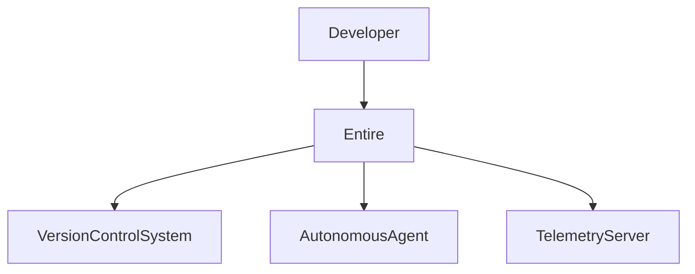
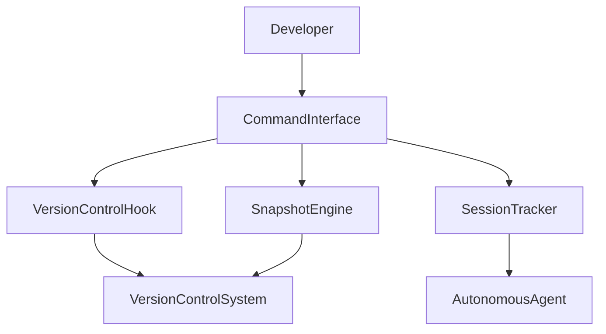
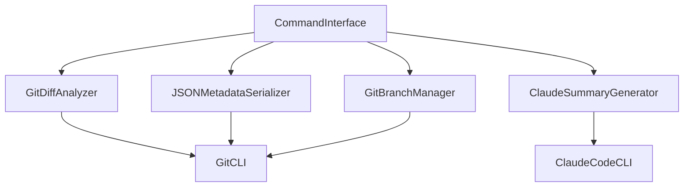
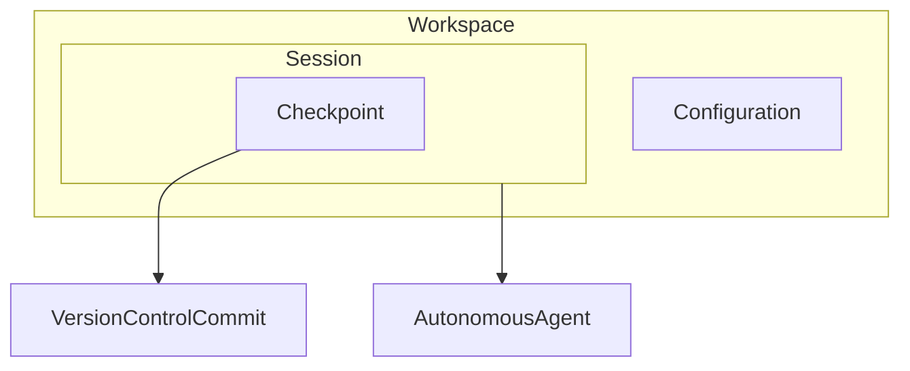
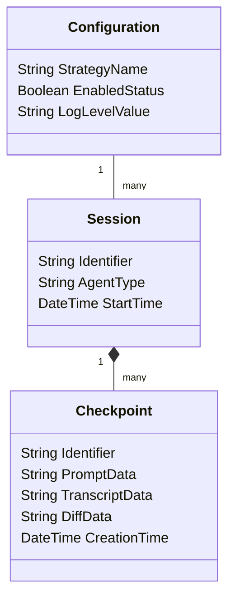
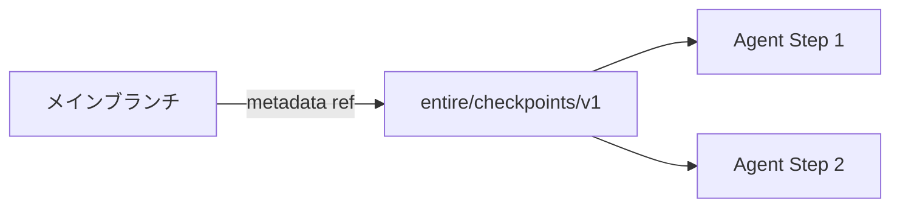

## 概要

Entireは、AIエージェントを活用したソフトウェア開発に特化した開発者向けプラットフォームです。従来のGitでは記録できなかった「AIがなぜそのコードを書いたのか」という推論プロセスを、コード変更と一体で永続化します。

元GitHub CEOのThomas Dohmke氏らが主導して開発しています。既存のGitワークフローを変更せず、Gitフックを介してバックグラウンドで動作する点が特徴です。開発者は通常どおりコミットするだけで、対話コンテキストや意思決定の背景が自動的に記録されます。

## 特徴

Entireは、AI時代のソフトウェア開発を支援する以下の機能を提供します。

- 専用のメタデータ領域により、メインブランチの履歴をクリーンに維持
- セッション状態のスナップショット生成による、過去の任意の開発フェーズへの復元
- 複数のAIモデルの並行サポートによる、最適なエージェントの柔軟な選択
- コミット時のAI自動要約による、開発履歴の理解促進
- ベストエフォート型の機密情報難読化による、安全なコード共有

### 類似ツールとの違い

| 観点                 | Git単体                        | Entire                                         |
| :------------------- | :----------------------------- | :--------------------------------------------- |
| コード変更の記録     | コミット履歴                   | コミット履歴（変更なし）                       |
| AI推論プロセスの記録 | 手動でコミットメッセージに記載 | シャドウブランチに自動保存                     |
| 過去の状態への復元   | `git checkout` でコードのみ    | `entire rewind` でコード＋AIコンテキストを復元 |
| チーム共有           | コードのみ                     | コード＋推論コンテキスト                       |

### 向いているケース

- AIエージェント（Claude Code、Geminiなど）を日常的に利用する開発チーム
- コードレビュー時に「AIがなぜこのコードを書いたか」を確認したいプロジェクト
- 試行錯誤の過程を記録し、後から振り返りたいリファクタリング作業

## 構造

### システムコンテキスト図

Entireが動作する全体環境と、外部システムとの関連を示します。



| 要素名               | 説明                                                                     |
| :------------------- | :----------------------------------------------------------------------- |
| Developer            | AIエージェントへの指示、要件定義、成果物レビューを担当する開発者         |
| Entire               | エージェントの推論コンテキストとソースコード変更を統合する中核システム   |
| VersionControlSystem | ソースコードとメタデータを永続的に管理する外部の履歴管理システム         |
| AutonomousAgent      | 開発者の指示に基づきソースコードの解析・変更提案を実行する外部AIシステム |
| TelemetryServer      | 利用状況やパフォーマンスの匿名統計情報を受信・分析する外部サーバー       |

### コンテナ図

Entire内部の論理ブロックと機能の役割分担を示します。



| 要素名             | 説明                                                                                 |
| :----------------- | :----------------------------------------------------------------------------------- |
| CommandInterface   | プラットフォーム固有のコマンドを解釈し、各モジュールへ処理を分配するインターフェース |
| VersionControlHook | バージョン管理システムのイベントを検知し、データ収集を自動起動するフック             |
| SessionTracker     | AIとの対話履歴やコンテキスト情報を継続監視し、メモリ上で状態を維持するトラッカー     |
| SnapshotEngine     | 対話履歴やコード差分を抽出し、永続化可能なスナップショットに変換するエンジン         |

### コンポーネント図

SnapshotEngine内部の構成要素間の関係を示します。



| 要素名                 | 説明                                                                        |
| :--------------------- | :-------------------------------------------------------------------------- |
| GitDiffAnalyzer        | Git CLIと連携し、AIエージェント作業前後の差分データを抽出するコンポーネント |
| JSONMetadataSerializer | プロンプトや実行履歴を構造化JSONに変換するシリアライザー                    |
| GitBranchManager       | メタデータ保存用のシャドウブランチを制御するマネージャー                    |
| ClaudeSummaryGenerator | Claude Code CLIを呼び出し、セッション全体の自動要約を生成するコンポーネント |
| GitCLI                 | コマンドライン経由でGitリポジトリ操作を提供する外部システム                 |
| ClaudeCodeCLI          | Anthropic社提供のAIコーディング支援ツールのCLI                              |

## データモデル

### 概念モデル

プラットフォーム内部で管理するデータの包含関係と外部エンティティとの関係を示します。



| 要素名               | 説明                                                           |
| :------------------- | :------------------------------------------------------------- |
| Workspace            | 開発対象プロジェクト全体を包括する論理コンテナ                 |
| Configuration        | プロジェクト・開発者の環境における動作仕様を定義した設定情報群 |
| Session              | AIとの一連のインタラクションをまとめた論理的な作業区画         |
| Checkpoint           | 特定時点の作業状態を保存したスナップショット                   |
| AutonomousAgent      | 対話相手となる自律型コーディング支援システム                   |
| VersionControlCommit | メインライン上のソースコード変更確定ポイント                   |

### 情報モデル

各エンティティの属性とエンティティ間の多重度を示します。



| 要素名                      | 説明                                                          |
| :-------------------------- | :------------------------------------------------------------ |
| Session.Identifier          | 日付とUUIDを組み合わせたセッションの一意識別子                |
| Session.AgentType           | 利用中のAIシステム名称                                        |
| Session.StartTime           | 対話開始時刻のタイムスタンプ                                  |
| Checkpoint.Identifier       | 12桁の16進数文字列で構成されるスナップショットの一意識別子    |
| Checkpoint.PromptData       | 開発者が入力した指示・要求内容の生テキスト                    |
| Checkpoint.TranscriptData   | AIの代替案検討やツール呼び出しを含む推論過程の全記録          |
| Checkpoint.DiffData         | 前回の状態からのソースコード変更差分                          |
| Checkpoint.CreationTime     | メタデータが確定した時刻のタイムスタンプ                      |
| Configuration.StrategyName  | データの記録契機を決定する方針指定値（手動/自動コミットなど） |
| Configuration.EnabledStatus | フック機能の有効/無効を示す真偽値                             |
| Configuration.LogLevelValue | ログ出力の詳細度を制御する設定値                              |

## 構築方法

### 実行バイナリの取得と配置

公式サイトのインストールスクリプトを利用します。

```bash
# インストールスクリプトの実行
curl -fsSL https://entire.io/install.sh | bash
```

スクリプトが最新バージョンのバイナリをダウンロードし、実行パスに配置します。旧バージョンが存在する場合、自動的に最新版へ置き換えます。

### パッケージマネージャーを利用した導入

HomebrewやGoを利用した導入も可能です。

```bash
# Homebrewを利用した導入
brew tap entireio/tap
brew install entireio/tap/entire

# Go環境を利用した導入
go install github.com/entireio/cli/cmd/entire@latest
```

### リポジトリへの機能有効化

管理対象のリポジトリで有効化コマンドを実行します。

```bash
# プロジェクトディレクトリでの有効化
cd your-project && entire enable
```

有効化により以下の処理が実行されます。

- プラットフォーム固有の追跡メカニズムの展開
- Gitイベントフックの自動構築
- 隠し設定ディレクトリの生成

以降のコミット操作では、バックグラウンドで自動的にデータ収集が開始されます。

### プロジェクト共有設定

チーム共通の動作方針を定義する設定ファイルをリポジトリ内に作成します。

`.entire/settings.json` を作成します。

```json
{
  "strategy": "manual-commit",
  "agent": "claude-code",
  "enabled": true
}
```

この設定ファイルをバージョン管理に含めることで、チーム全員に同一の記録方針を展開できます。

### 開発者ローカル設定

個人の検証や一時的な設定変更には、ローカル専用の設定ファイルを利用します。

`.entire/settings.local.json` を作成します。

```json
{
  "enabled": false,
  "log_level": "debug"
}
```

```bash
# ローカル専用設定で有効化
entire enable --local
```

共有設定と項目が重複する場合、ローカル設定が優先されます。このファイルはバージョン管理の追跡対象から除外します。

### クラウド開発環境への導入

コンテナや仮想マシン上のクラウド開発環境にも導入できます。認証プロキシ環境では、最小権限のトークンを配置します。

Claude Codeの `.claude/settings.json` にフックを設定し、セッション開始時にEntireの環境セットアップスクリプトを実行させます。

```json
{
  "hooks": {
    "SessionStart": [
      {
        "matcher": "",
        "hooks": [
          {
            "type": "command",
            "command": "sh .claude/scripts/setup-env.sh"
          }
        ]
      }
    ]
  }
}
```

## 利用方法

### 手動コミット戦略による状態保存

開発者がコミットを実行すると、以下の処理が自動で行われます。

1. Gitイベントフックが作動し、AIエージェントの実行コンテキストを抽出
2. 対話履歴や差分情報をJSON形式で構造化
3. メインブランチとは独立したメタデータ専用ブランチに記録
4. 生成されたメタデータの識別子を現在のコミットに関連付け

```bash
# 手動コミット戦略の指定とステータス確認
entire enable --strategy manual-commit
entire status
```

### 自動コミット戦略による継続的記録

AIエージェントが応答を完了するたびに、自動でメタデータを保存します。

```bash
# 自動コミット戦略を有効化
entire enable --strategy auto-commit
```

推論の全プロセスが連続的なスナップショットとして蓄積されるため、複雑なリファクタリング作業の追跡に適しています。メイン開発ブランチの履歴は影響を受けません。

### セッション状態の巻き戻し

エージェントが誤った方向へ進んだ場合、過去の正常な時点へ状態を復元できます。

```bash
# 巻き戻しコマンドの実行
entire rewind

# 特定のセッションIDを指定してAIエージェントを再開
claude -r a4c21963-bb4b-4410-87fa-a67884050353
```

スナップショット一覧から復元先を選択すると、ソースコードとエージェントの対話コンテキストが再現されます。

### 推論プロセスの詳細抽出

コミットの背景にあるAIの決定理由を確認できます。

```bash
# チェックポイントIDを指定して詳細を確認
entire explain --checkpoint d63130bee00b

# コミットIDを指定して詳細を確認
entire explain --commit e3e6582
```

エージェントが考慮した代替案や制約条件が可視化されるため、コードレビューの効率が向上します。

### 自動要約によるコミット情報の拡充

コミット時にAIエージェントが作業内容の要約を自動生成します。

`.entire/settings.json` の `strategy_options` で有効化します。

```json
{
  "strategy_options": {
    "summarize": {
      "enabled": true
    }
  }
}
```

生成された要約はコミットメッセージに自動追記されます。通信障害が発生しても、コミット自体は正常に完了します。

### エージェントの切り替えと並行利用

開発要件に応じて、複数のAIエージェントを切り替えて利用できます。

```bash
# 利用するAIエージェントをGeminiに切り替え
entire enable --agent gemini

# Claude Codeに指定
entire enable --agent claude-code
```

エージェントの切り替え後も、統一フォーマットでのスナップショット保存が継続します。

## 運用

### メタデータ専用ブランチの管理

セッション履歴はリポジトリ内の独立した専用ブランチ `entire/checkpoints/v1` に保存されます。このブランチはGitの孤立ブランチ（orphan branch）として作成され、メインブランチと履歴を共有しません。



| 要素名       | 説明                                           |
| :----------- | :--------------------------------------------- |
| MainBranch   | 開発のメインライン                             |
| ShadowBranch | メタデータ保存用のシャドウブランチ             |
| Step1, Step2 | エージェントの各作業ステップのスナップショット |

メインブランチの履歴に影響を与えずにデータが蓄積されます。リポジトリの複製時にこのブランチも自動的に含まれるため、チーム全員が過去の意思決定の背景を共有できます。

### 孤立チェックポイントの整理

どのコミットからも参照されなくなった孤立メタデータを整理します。

```bash
# 不要なデータを整理
entire clean
```

定期的に実行することで、リポジトリのデータ容量の肥大化を防止できます。アクティブなセッションや有効な履歴データには影響しません。

### システム状態の検知と修復

エージェントプロセスの異常終了などで記録状態が不整合になった場合に対応します。

```bash
# 状態の不整合を検知して修復
entire doctor
```

破損したロックファイルや不完全なスナップショットを自動検知し、正常な状態へ復旧します。

### セッションの一時停止と再開

アクティブなセッションをバックグラウンドへ退避し、後から再開できます。

```bash
# 退避させたセッションを再開
entire resume
```

シャドウブランチのメタデータを利用して、対話コンテキストを完全に復元します。複数日にまたがるタスクでもセッションの連続性を維持できます。

### フック機能の除去

プラットフォームの利用を停止する場合は、無効化コマンドを実行します。

```bash
# プラットフォームの機能を無効化
entire disable

# シャドウブランチと状態をリセット
entire reset
```

無効化しても、過去に記録された専用ブランチ内のメタデータは保存されたままです。再度有効化すれば、以前のデータを活用して追跡を再開できます。

### リモートリポジトリを通じたチーム間同期

デフォルトでは、コードをリモートへプッシュする際にメタデータブランチも同時に送信されます。

```bash
# git push時の自動プッシュを無効化
entire enable --skip-push-sessions
```

`.entire/settings.json` でも制御できます。

```json
{
  "strategy_options": {
    "push_sessions": false
  }
}
```

新規メンバーがリポジトリを取得した際、初日からチームの過去の意思決定背景を探索できます。

### 機密情報の難読化

認証トークンやAPIキーの混入リスクを低減する機能を内蔵しています。スナップショット生成時に自動スキャンし、検出した機密情報をベストエフォートで安全な文字列へ置換します。

この難読化は補助的な防御手段です。開発者自身による機密情報管理の原則は維持してください。

```bash
# 一時的なシャドウブランチをリモートへ誤送信しないようローカル設定を活用
entire enable --local
```

## 注意点・制約

Entireの導入にあたり、以下の点を考慮してください。

- **リポジトリサイズの増大**: シャドウブランチにメタデータが蓄積されるため、長期運用ではリポジトリサイズが増加します。`entire clean` の定期実行を推奨します
- **ベストエフォート型の難読化**: 機密情報の検出・置換は完全ではありません。公開リポジトリでの利用時は、`.gitignore` やローカル設定（`--local`）との併用を検討してください
- **対応エージェントの範囲**: Claude Code、Gemini など主要エージェントに対応していますが、全てのAIツールをサポートしているわけではありません。利用予定のエージェントの対応状況を事前に確認してください
- **Go製CLIバイナリ**: 現時点ではCLIツールとしての提供です。IDE拡張やWeb UIは公式には提供されていません

## CLIコマンド一覧

| コマンド         | 説明                                              |
| :--------------- | :------------------------------------------------ |
| `entire enable`  | リポジトリでEntireを有効化                        |
| `entire disable` | Entireのフック機能を無効化                        |
| `entire status`  | 現在の追跡状態を表示                              |
| `entire rewind`  | 過去のスナップショットへ巻き戻し                  |
| `entire explain` | 特定コミット/チェックポイントの推論プロセスを表示 |
| `entire resume`  | 退避したセッションを再開                          |
| `entire clean`   | 孤立したメタデータを削除                          |
| `entire doctor`  | 状態の不整合を検知・修復                          |
| `entire reset`   | シャドウブランチと状態をリセット                  |

## まとめ

Entireは、AIエージェントの推論プロセスをGitのシャドウブランチに自動記録し、「なぜそのコードが生まれたのか」をチーム全体で共有できるプラットフォームです。既存のGitワークフローを変更せずに導入でき、`entire enable` 一つで追跡を開始できます。AIエージェントを活用した開発でコンテキストの喪失に課題を感じている方は、まず小規模なプロジェクトで試してみてください。

この記事が少しでも参考になった、あるいは改善点などがあれば、ぜひリアクションやコメント、SNSでのシェアをいただけると励みになります！

## 参考リンク

- GitHub
  - [entireio/cli](https://github.com/entireio/cli)
- ドキュメント
  - [Entire CLI - DeepWiki](https://deepwiki.com/entireio/cli)
- 記事
  - [Ex-GitHub CEO launches a new developer platform for AI agents](https://news.ycombinator.com/item?id=46961345)
  - [Beyond Git: How Entire is Reinventing Version Control for the AI Era](https://dflow.sh/blog/beyond-git-how-entire-is-reinventing-version-control-for-the-ai-era)
  - [GitHub Won't Work for AI Agents](https://julien.danjou.info/blog/github-wont-work-for-ai-agents/)
  - [Entire CLI](https://www.mager.co/blog/2026-02-10-entire-cli/)
  - [Entire on Claude Code Web](https://zenn.dev/aromarious/articles/20260217-entire-on-ccweb?locale=en)
  - [I tried Entire's Checkpoints CLI for a week](https://tianpan.co/forum/t/i-tried-entires-checkpoints-cli-for-a-week-here-is-what-the-ai-reasoning-traces-actually-look-like/859)
  - [Former GitHub CEO Unveils Platform for AI Agent Developers](https://www.hostzealot.com/blog/news/former-github-ceo-unveils-platform-for-ai-agent-developers)
