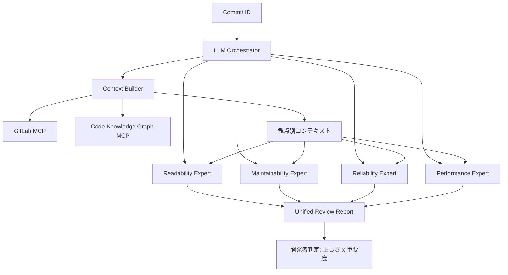
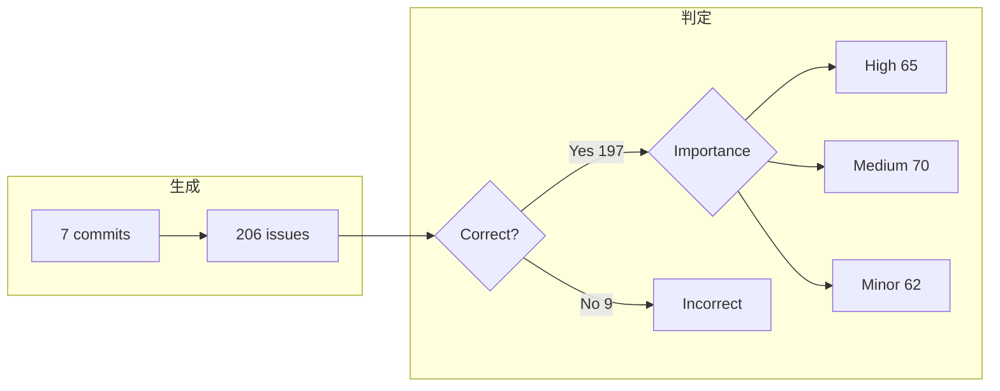

Ericssonの開発現場で、観点別の Agent Skills とリポジトリ文脈を組み合わせたマルチエージェントコードレビューが試作されました。
コミット作者が、指摘の正しさと重要度を判定しています。

本稿は、Laiq らによる [Using Agentic AI for contextualized and multifaceted code review at Ericsson](https://arxiv.org/abs/2609.15877) を対象に、システムが何をするか、数値がどの分母に閉じるか、自環境へ転用するときの判断軸を整理します。

:::message
本記事は 2026-09-14 提出の arXiv preprint（[arXiv:2609.15877v1](https://arxiv.org/abs/2609.15877)）を解説したものです。arXiv Comments は 27th PROFES（PROFES 2026）採択と記します。公式の採録一覧は 2026-09-16 時点では未掲載です。評価は static validation であり、日常のレビューフローへの常時組込みではありません。
:::

*この記事の全体像。以下、順に解説します。*

## 観点別Agent Skillsによるコードレビューとは

対象は、Ericsson の開発現場で試作したマルチエージェント型コードレビューです。
観点別の Agent Skills と、リポジトリから取った文脈を組み合わせ、変更を可読性・保守性・信頼性・性能の 4 面から評価します。

研究手法は Offermann らの Design Science Research Process です。
Ericsson での static validation として、4 プロジェクトから 7 件のコミットを対象に 206 件の指摘を出し、コミット作者である上級開発者 5 名が正しさと重要度を判定しました。
対象コードは Python です。プロジェクト内訳は小規模 2、大規模 2 です。

オーケストレータがコミット ID を受け、専門エージェントを選び、観点別に切った文脈を渡して結果を 1 本のレビューにまとめます。
専門エージェントは次の 4 つです。

- Readability
- Maintainability
- Reliability
- Performance

各エージェントは JSON 設定と、アンチパターン一覧を載せた skill 文書で定義します。
skill 文書は [Agent Skills](https://agentskills.io/home) プロトコルに沿います。
指摘の固定欄は 4 つです。アンチパターン名、位置、問題、修正案です。

文脈源は 2 系統です。

- GitLab MCP: diff、メタデータ、変更ファイル
- Code Knowledge Graph MCP: import、DEFINES、fan-in / fan-out、Cypher、意味検索

実装ランタイムは公開製品の [Kiro CLI](https://kiro.dev/cli/) です。
論文は実験モデルを「Kiro CLI’s default model」とだけ書きます。
Kiro 公式は Auto agent を既定経路とし、モデル一覧を公開します。固定の単一名ではありません。

処理は、入力のコミットから 4 エージェント並列評価を経て、統一レポートになります。

文脈の切り方は観点で違います。
可読性エージェントは局所の構造と書式を主に受け取ります。
保守性エージェントは依存関係と構造関係も受け取ります。
全ファイルを全エージェントに渡す設計ではありません。

skill 文書に載るのは文献由来のアンチパターン一覧です。

| 観点 | カタログの出典 |
|---|---|
| 可読性 | Sergeyuk ら |
| 保守性 | Fowler / Khomh ら |
| 信頼性 | De Padua & Shang の例外処理 |
| 性能 | Smith & Williams ら |

プロジェクト固有の入力は、公開された skill 本文より、GitLab と知識グラフ側にあります。
信頼性カタログは Java 例外の項目（InterruptedException 等）を含みます。評価対象は Python です。

評価の単位はコミットではなく、エージェントが出した issue です。

判定の二軸は正しさ（Correct / Incorrect）と重要度（Minor / Medium / High）です。

## 注意点

論文が報告する「約 96%」「約 69%」は、次の定義に閉じます。

| 言い方 | 分子 / 分母 | 一次の表 | 意味すること | 意味しないこと |
|---|---|---|---|---|
| 約 96% | 197 / 206 | Table 7 | 出した指摘のうち、作者が Correct とした割合 | 欠陥の網羅率（recall）。未検出は未測定 |
| 約 4% | 9 / 206 | Table 7 | Incorrect とされた指摘 | 本番での離脱閾値を超えた証明 |
| 約 69% | 135 / 197 | Table 8（High 65 + Medium 70） | **正しい指摘のうち** must / should | 全指摘のうちの重要率 |
| 全指摘ベースの must / should | 135 / 206 ≈ 65.5% | Table 7-8 の再計算 | 開発者が見る列に対する重要かつ正しい指摘 | 論文抽象の「69%」そのもの |
| Minor | 62 / 197 ≈ 31% | Table 8 | 正しいが低影響 | 無価値（論文は可読性・スタイルとして残す） |

「200 件超」は 206 件です。
コミット数は「several」ではなく 7 です。

著者は次を本文で認めます。

- ablation も代替設計比較もない。文脈が誤り 4% を減らした、は帰属であり比較証明ではない（§5.1）
- コミット作者が自コードを判定する（§7 Internal validity）
- 判定件数は偏る。§3.3 の内訳では 5 人のうち 1 人が 3 コミット・96 件（206 の約 47%）を単独判定する
- Python のみ、単一 LLM（Kiro CLI の default model）、データ非公開、非決定性（§7）
- 評価は static validation であり、日常のレビューフローへの常時組込みではない（§3.3）

PROFES 2026 について、一次で確認できたのは会議の存在と日程と締切です。

- 正式名称: 27th International Conference on Product-Focused Software Process Improvement
- 日程: 2026-11-30 〜 2026-12-02、Karlskrona（BTH）
- Notification: 2026-09-11 AoE、Camera-ready: 2026-09-25 AoE
- 採録一覧・proceedings DOI は 2026-09-16 時点で公式サイトに無い

「採択」は arXiv Comments の著者申告です。
通知の 3 日後に arXiv へ載せた時系列は整合します。不採録とは言えません。
共著者 Ricardo Britto は同会議の Industry Track Co-Chair、Muhammad Usman は Organizing Chair です（[公式 Organizing Committee](https://conf.researchr.org/committee/profes-2026/profes-2026-organizing-committee)、2026-09-16）。
査読不正の証拠はありません。
公式リストが出るまで、会議メタデータは著者申告として扱います。

論文 Discussion が Cihan et al. に付ける GPT-4o の変化率は、ICSE-SEIP 2025 の当該論文一次と一致しません。
本稿ではこの数値を使いません。

## 何を測り、何を測っていないか

規模と内訳は次のとおりです。

| 項目 | 値 | 出典 |
|---|---|---|
| コミット | 7 | §3.3 |
| プロジェクト | 4（小 2・大 2） | §3.3 |
| 指摘 | 206 | Table 6 |
| 判定者 | 上級開発者 5（各 36, 36, 27, 11, および 96） | §3.3 |
| Reliability | 64（31.1%） | Table 6 |
| Readability | 58（28.2%） | Table 6 |
| Maintainability | 50（24.3%） | Table 6 |
| Performance | 34（16.5%） | Table 6 |
| Correct | 197 | Table 7 |
| Incorrect | 9 | Table 7 |
| High / Medium / Minor | 65 / 70 / 62（正しい 197 が分母） | Table 8 |

RQ1 は設計観察です。
単一面のレビューでは高々約 1/3 しかカバーしない、と Table 6 を根拠に書きます。
定性コメントは 2 件だけ本文に載ります。

測っていないことは次です。

- 未検出の欠陥
- 判定に使った時間
- 本番キューでの採用率・無視率・リードタイム
- モデル比較、言語横断、セキュリティ観点
- 知識グラフなし・単一エージェントとの差
- Kiro default の実モデル名

Ericsson の Python 7 コミットでは、4 観点スキルと文脈付きエージェントが出した 206 件について、作者判定の reported-issue precision は 197/206、正しい指摘のうち must / should は 135/197 です。
これはレビュー AI を「出した指摘の正しさ」と「直す必要」の二軸で見る現場例になります。
品質保証性能や本番可用性の一般証明ではありません。

96% は recall ではありません。
産業の成功条件は採用率・outdated rate・ノイズ予算を含みます（BitsAI-CR、Google AutoCommenter [arXiv:2405.13565](https://arxiv.org/abs/2405.13565)）。
自己判定で κ はありません。Google は開発者と独立レーターで useful ratio がずれました。
Skills × KG の寄与は未分離です。

## 同一社の先行報告と産業の他例

Ramesh et al., ICSME 2025（[arXiv:2507.19115](https://arxiv.org/abs/2507.19115)、DOI 10.1109/ICSME64153.2025.00061）は Ericsson の Java 向け軽量 LLM レビューです。
enclosing method を Tree-sitter で取り、Llama / Code Llama に渡します。
共著者に Saini と Britto がいます。

| | ICSME 2025 | 本論文 |
|---|---|---|
| 文脈 | 変更行の enclosing method | GitLab + 知識グラフの選択的文脈 |
| エージェント | 単一プロンプト | 4 専門エージェント |
| 言語 | Java | Python |
| 評価 | 10 メソッドの LLM レビューへの専門家反応（正 / 中 / 負）。別途 9 人 × 15 日の実利用 | 206 issue の正しさ × 重要度 |
| 実利用 | 時間節約 4/9、定常利用 2/9 | 未実施（static） |

ICSME 論文 §VIII は次段として Graph-RAG と専門エージェント並列を挙げます。
本論文の設計（知識グラフ MCP + 4 エージェント）はそれに重なります。
同一ロードマップの完了報告とは一次にありません。

産業の他例です。指標は非互換なので、並べて勝敗を付けません。

- Cihan et al. ICSE-SEIP 2025（Beko）: 自動レビュー対象 PR 1,568。自動コメントの Resolved 73.8%。平均 PR クローズ時間 5h52m → 8h20m
- Sun et al. BitsAI-CR FSE 2025（ByteDance）: 4 次元 + 219 規則。本番ピーク precision 75.0%。WAU 12,000 超。precision を recall より優先
- Tantithamthavorn et al. RovoDev ICSE-SEIP 2026（Atlassian）: コメント 54,000 超。Code Resolution Rate 38.70%（人手 44.45%）。PR cycle -30.8%

「産業評価が少ない」は 2025-2026 のこれらの報告では弱いです。
本論文が残す隙間は、同一 antipattern カタログを次元別エージェントに分け、知識グラフで選択的文脈を渡し、issue 単位で正しさ × 重要度を取った static validation です。

同一社の ICSME 先行では定常利用は 2/9 です。
Beko では自動レビュー後に PR 時間が伸びています。
本番のリードタイムが Beko 型（増加）か RovoDev 型（減少）かは、本論文では未測定です。

## 転用するときの判断軸

評価設計の転用はブロックしません。
本番品質保証としての採用判断は、未測定（未検出、工数、本番キュー）があるためブロックします。

自環境へ持っていくなら、次を固定します。

1. **評価は二軸にする。** Correct / Incorrect と、直す必要（must / should / nit）。正しさだけの精度発表はしない
2. **分母を固定して書く。** precision の分母は出した指摘。重要率の分母は正しい指摘か全指摘かを毎回明示する
3. **網羅率と工数を別指標にする。** 既知欠陥の仕込み、人間レビューとの差分、判定時間
4. **skill には汎用カタログとプロジェクト制約を分ける。** 前者は Fowler 系。後者はリポジトリ規約・禁止 API・性能予算。論文の公開 skill は前者に近い
5. **文脈は観点別に切る。** 全ファイルを全エージェントに渡さない
6. **static validation を本番と書かない。** 小規模の作者判定は設計の feasibility まで

逆転条件は次です。

- 独立評価で Incorrect が産業の離脱レンジまで増える
- 確認時間が人間レビューを上回る
- 重要指摘のほとんどが既に人間が見つけている（論文の定性 2 件目は「人間より多い」と読む余地があるが、定量ではない）
- ablation で単一プロンプトと差がない

直近の次のアクションは次です。

1. 自前のレビュー skill を 4 観点（または自組織の品質軸）に分割し、プロジェクト制約を別ファイルで渡す試作
2. 評価シートを位置・説明・修正案 + 正しさ + 重要度にする
3. 同一差分について「出した指摘の precision」と「既知バグの recall」を分けて記録する
4. PROFES 公式リストを camera-ready 以降に再確認する

残る未解決は次です。

- 公式 PROFES 2026 accepted list / LNCS DOI（camera-ready 2026-09-25 以降）
- 非作者による再ラベリングと評価者間一致
- KG なし・単一エージェントとの差
- 未検出欠陥と確認時間
- Kiro default の実モデル
- Python 以外への移転
- 本番のリードタイムが Beko 型か RovoDev 型か

## まとめ

Ericsson の試作は、観点別 Agent Skills と GitLab / 知識グラフの選択的文脈を組み合わせ、指摘を正しさ × 重要度の二軸で見る現場例です。
Python 7 コミットから 206 件を出し、作者判定の reported-issue precision は 197/206、正しい指摘のうち must / should は 135/197 です。
これは出した指摘の正しさの話であり、欠陥の網羅率でも本番可用性でもありません。

公開 skill は汎用 smell カタログに近く、プロジェクト固有知識は文脈ビルダとグラフ側にあります。
評価は static validation です。
会議採録は 2026-09-16 時点で公式未確認です。

転用するなら、分母を固定した二軸評価と、汎用カタログとプロジェクト制約の分離から始めます。
品質保証としての採用は、独立評価・工数・未検出を測ってから判断します。

この記事が少しでも参考になった、あるいは改善点などがあれば、ぜひリアクションやコメント、SNSでのシェアをいただけると励みになります！

## 参考リンク

- M. Laiq, R. Britto, M. Usman, N. Saini, D. Badampudi. *Using Agentic AI for contextualized and multifaceted code review at Ericsson*. arXiv:2609.15877v1, 2026-09-14. https://arxiv.org/abs/2609.15877 / [HTML](https://arxiv.org/html/2609.15877v1) / [PDF](https://arxiv.org/pdf/2609.15877)
- PROFES 2026. https://conf.researchr.org/home/profes-2026 （確認 2026-09-16）
- PROFES 2026 Organizing Committee. https://conf.researchr.org/committee/profes-2026/profes-2026-organizing-committee
- S. Ramesh et al. *Automated code review using large language models at Ericsson: An experience report*. ICSME 2025, pp. 602-607. https://arxiv.org/abs/2507.19115
- U. Cihan et al. *Automated code review in practice*. ICSE-SEIP 2025. https://arxiv.org/abs/2412.18531
- T. Sun et al. *BitsAI-CR: Automated code review via LLM in practice*. FSE 2025. https://arxiv.org/abs/2501.15134
- K. Tantithamthavorn et al. *RovoDev code reviewer*. ICSE-SEIP 2026. https://arxiv.org/abs/2601.01129
- M. Vijayvergiya et al. *AI-Assisted Assessment of Coding Practices in Modern Code Review* (AutoCommenter). AIware 2024. https://arxiv.org/abs/2405.13565
- Agent Skills. https://agentskills.io/home
- Kiro CLI. https://kiro.dev/cli/
