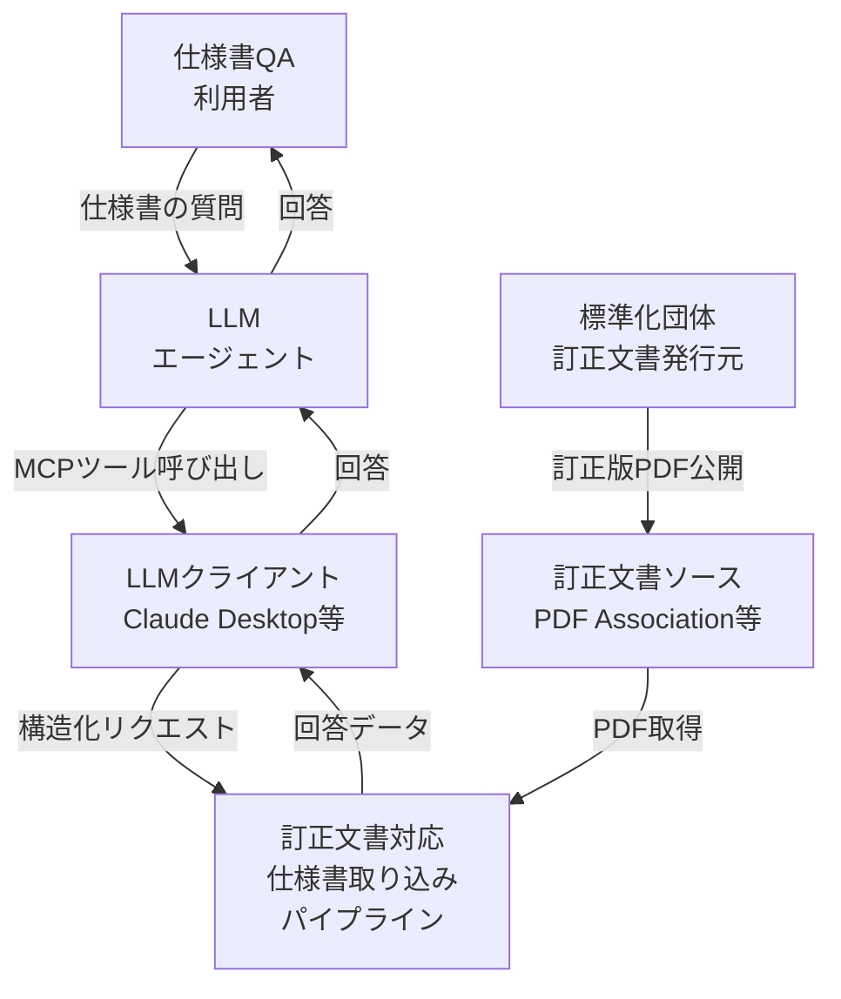
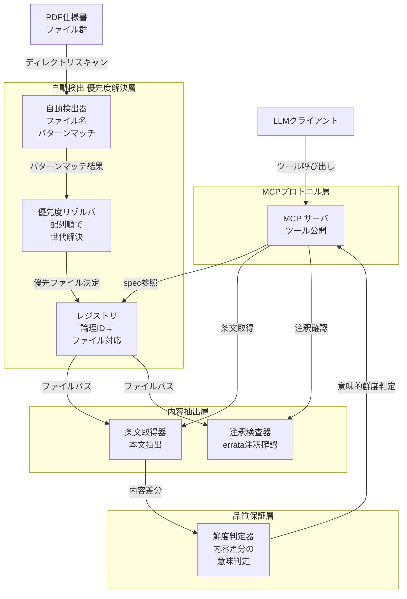
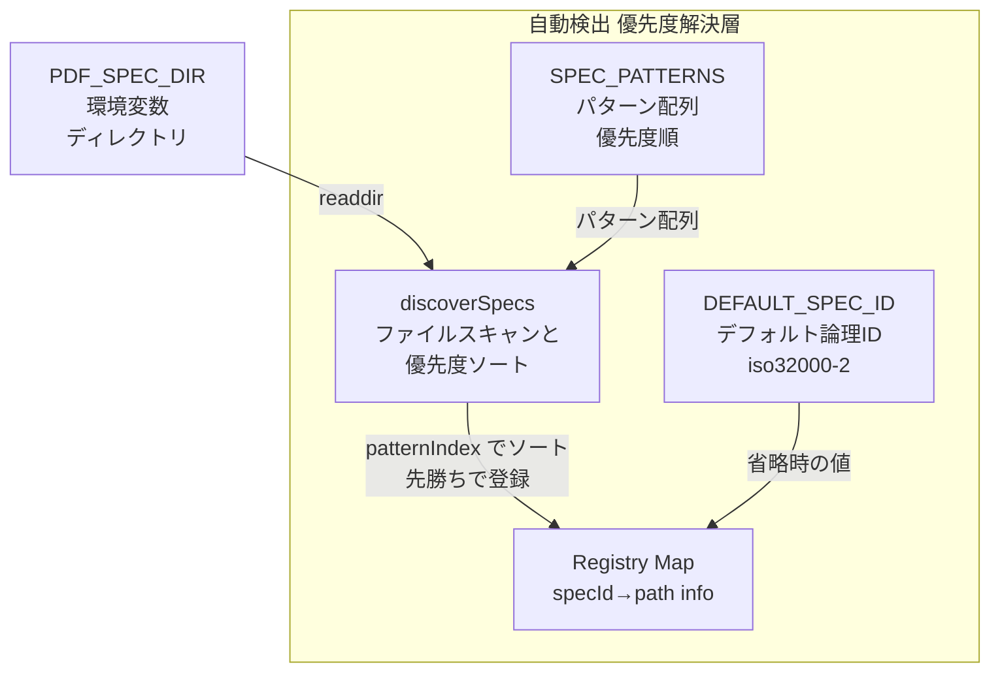
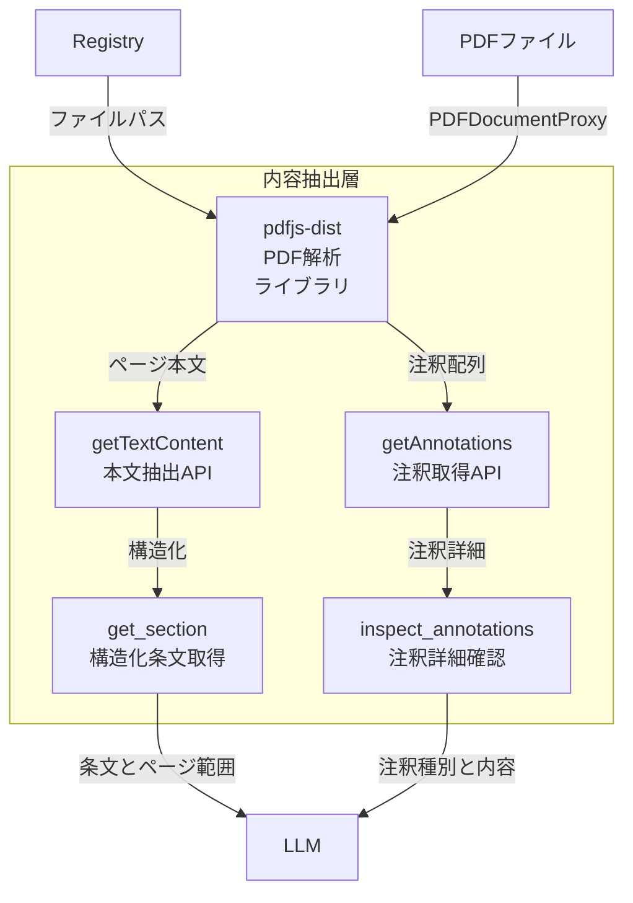
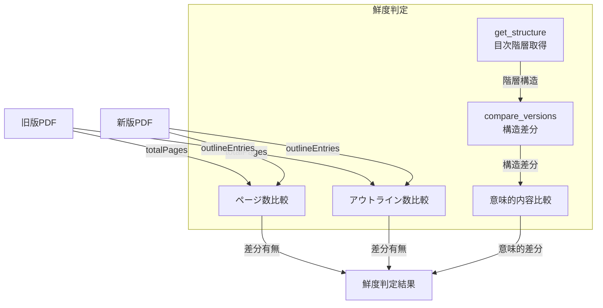
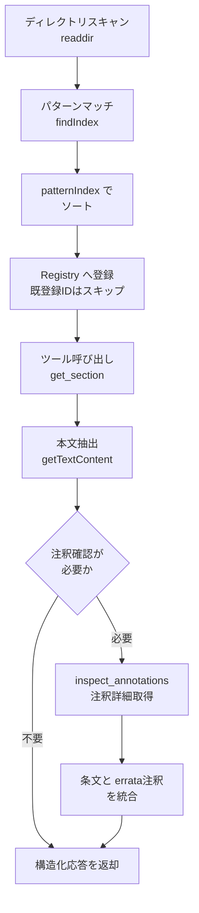
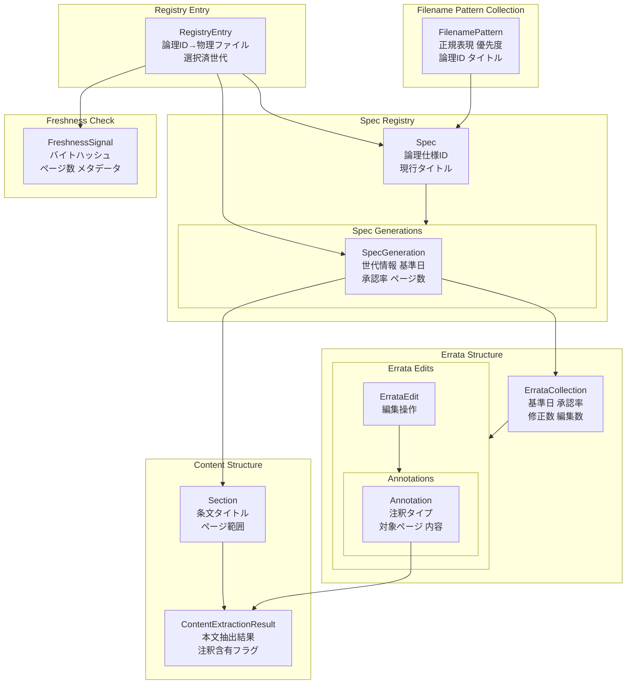
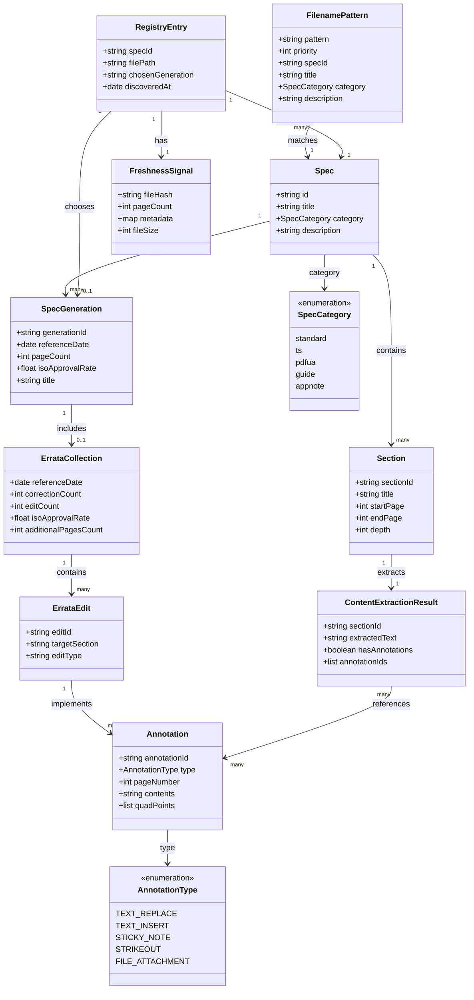

> 訂正文書（Errata / 正誤表）を持つ仕様書・規格・法令・社内規程を MCP / RAG で LLM から参照可能にするときの取り込みパターンを、実在の MCP サーバ `pdf-spec-mcp` の PDF 2.0 Errata Collection 3（EC3）対応事例を軸に構造化します。本稿は特定プロダクトの解説ではなく、**訂正文書を持つデータソース共通の取り込み方法論**として提示します。`pdf-spec-mcp` / `pdf-reader-mcp` は具体例として扱います。

> 検証日: 2026-07-12 ／ 対象: `pdf-spec-mcp` v0.3.0・`pdf-reader-mcp`・PDF 2.0 Errata Collection 3（EC3, 2026 年 6 月公開）

## 概要

### 解く問題

訂正文書を持つ文書を素朴にファイル配置するだけで取り込むと、「沈黙する不具合（エラーも警告も出さずに古い情報が正として扱われる）」が発生します。主な問題は次の 4 つです。

- **命名規約の変化による検出失敗**: 世代間でファイル名規則が変わると、自動検出が壊れます（例: `-ec2.pdf` → `_EC3.pdf`）。
- **辞書順依存の誤選択**: 複数世代のファイルが共存すると、ファイル名の ASCII 順で「どちらを正とするか」が決まり、旧版が優先されます。
- **訂正内容の不可視性**: 訂正が PDF 注釈（アノテーション）で実装されている場合、通常のテキスト抽出では訂正内容が見えません。
- **失敗の沈黙**: これらの失敗はエラーを出さずに進行するため、利用者は古い情報を正として扱ってしまいます。

このパターンは、実在の MCP サーバ `pdf-spec-mcp` が PDF 2.0 仕様書（ISO 32000-2）の Errata Collection 3（EC3）対応で直面した問題と解決策を軸に、訂正文書を持つデータソース全般へ適用できる取り込みアーキテクチャを示します。

### 位置づけ

本パターンは、MCP / RAG 実装における「ドキュメントのバージョン管理・鮮度判定・訂正の可視化」という観測性（Observability）の課題に対する具体的な解決パターンです。取り込みの段階で誤った版を選択すると、その後のすべての参照が汚染されます。

### なぜ今重要か

LLM の活用が進む中、参照元ドキュメントの正確性と最新性は信頼性の要です。次の文脈で重要性が高まっています。

- **規制・コンプライアンス**: 法令や規格の正誤表が反映されないと、誤った実装や違反リスクが生じます。
- **ドキュメント QA の信頼性**: RAG で古い版を参照すると、誤答や時代遅れの情報を返します。
- **沈黙する失敗の危険性**: エラーが出ずに進行する不具合は、発見が遅れ影響範囲が広がります。

### 関連技術との関係

| 技術 | 関係 |
|---|---|
| MCP（Model Context Protocol） | LLM がドキュメント・ツール・外部システムへ構造的にアクセスするプロトコル。本パターンは MCP サーバがデータソースを取り込む際の「どのファイルを正とするか」の判定ロジックを扱う |
| RAG（Retrieval-Augmented Generation） | 外部ドキュメントを検索して回答を生成する手法。ドキュメントの鮮度とバージョン管理が精度に直結する |
| 仕様書 QA / ドキュメント参照 | 正しい世代の特定・訂正の可視性・失敗の観測性を取り込み層で実現する |
| ドキュメント鮮度管理 | メタデータ管理・意味的差分判定・インクリメンタル更新の一般課題を、訂正文書特有の事情（注釈実装・世代共存・命名規約変化）に対応させる |

RAG における既知の課題と本パターンの対応を次に示します。

| 課題 | 影響 | 本パターンの対応 |
|---|---|---|
| 古い版の提供 | 誤答・時代遅れの情報 | 世代優先度解決 |
| 更新の遅延 | 鮮度の欠如 | 意味的鮮度判定 |
| バージョン競合 | 不整合な結果 | 配列順＝優先度の明示化 |
| 更新検知の失敗 | 古い情報が放置される | 命名規約変更耐性 |

### 素朴な取り込みとの比較

| 観点 | 素朴なファイル配置 | 本パターン |
|---|---|---|
| 命名規約変更耐性 | 固定パターンが壊れると検出不可 | 正規表現パターンを世代別に複数定義 |
| 世代共存時の優先制御 | ファイル名の辞書順（実装の都合）に依存 | 配列順＝優先度の明示化（EC3 を EC2 より前に） |
| 鮮度判定精度 | ハッシュ差分のみ（スタンプ埋め込みで誤判定） | ページ数・メタデータ・意味的内容で判定 |
| 訂正の可視性 | テキスト抽出のみ（注釈実装の訂正は欠落） | 注釈抽出との連携を前提にした設計 |
| 失敗の観測性 | エラーなし・警告なし（沈黙する失敗） | 登録済み ID のスキップをログ出力 |

### ユースケース別の推奨

| ユースケース | 訂正文書の特徴 | 適用例 |
|---|---|---|
| 規格文書（ISO / IEC / IEEE） | 正誤表（Corrigenda）が注釈または追補ページで発行 | パターン優先度 + 注釈抽出連携 |
| 法令・政令 | 改正履歴が複数世代で公開 | 配列順＝優先度 + 施行日による鮮度判定 |
| 社内規程・マニュアル | 改訂版が不定期に発行、旧版と共存 | ファイル名パターン複数定義 + メタデータ比較 |
| API 仕様書 | バージョン番号が明示的（例: v1.0, v1.1） | セマンティックバージョニング対応パターン |
| 論文・学術出版物 | Errata が別ファイルまたは注釈で提供 | 注釈抽出 + 主文書との結合 |

## 特徴

本パターンの主要な特徴を列挙します。

- **世代更新検出**: 訂正文書が「追加パッチ」か「完全置き換え」かを判別し、取り込み戦略を選びます。EC3 は EC2 の完全置き換えであり、両者を同時に参照する必要はありません。
- **配列順＝優先度**: 同一論理 ID に複数ファイルがマッチした場合、ファイル名の辞書順ではなく、パターン定義の配列順序を優先度とします。区切り文字（`-` と `_`）の ASCII 値に実装が依存しなくなります。
- **意味的鮮度判定**: バイトレベルのハッシュ差分だけでは内容変更を判定できません。ページ数・タイトル・メタデータ・アウトライン構造を比較します。スポンサー版 PDF はダウンロード時に利用者名スタンプが埋め込まれ、バイト列が毎回変わります。
- **注釈対応抽出**: 訂正が PDF 注釈で実装されている場合、通常のテキスト抽出 API では訂正内容を取得できません。注釈取得ツール（`inspect_annotations`）と連携します。
- **沈黙する失敗の可視化**: 最も危険なのは、エラーも警告も出さずに古い版が参照される状態です。重複 ID のスキップを debug ログに残し、実際に採用されたファイルは `list_specs` の `filename` で確認します。

## 制約と既知の課題

本パターンを適用する前に、次の制約と「実装済み範囲」を理解してください。

### 実装済みの範囲と一般化した提案の区別

`pdf-spec-mcp` v0.3.0 が実際に持つのは、**パターン優先度による登録**（配列順＝優先度、重複 ID は debug ログを出して先勝ち）と、`list_specs` / `get_structure` / `get_section` / `search_spec` / `get_requirements` / `get_definitions` / `get_tables` / `compare_versions` の **8 ツール**です。本稿の「鮮度判定器」「注釈統合」「フォールバック警告」「意味的鮮度判定関数」などは、**取り込みパターンとして一般化した推奨・将来設計**であり、v0.3.0 に実装されたコンポーネントではありません。掲載するコードは移植用の実装案です。

### 注釈自動統合は未実装

errata が PDF 注釈として実装されている場合、本文取得（`get_section`）と注釈確認（`inspect_annotations`）を 2 回呼び出す必要があります。1 回で本文と errata を統合取得する機能は今後の課題です。

### 世代間比較の制約

`compare_versions` は PDF 1.7 対 PDF 2.0 の固定比較です。EC2↔EC3 のような同一論理 ID の世代間比較には使えません（レジストリには優先された一方しか残りません）。世代差は、2 つのディレクトリで別々に起動して `get_structure` 出力を突き合わせるか、外部 PDF diff で確認します。

### 数値の出典階層

「1,020 → 1,023 ページ」「985 → 988 セクション」「page 40 の注釈内訳」は、`pdf-spec-mcp` / 起点記事による**実測値**です。PDF Association の公式発表が直接示すのは errata 356 件・766 編集・追補 20 ページ等です。両者を区別して扱います。

### 自動検出はファイル名規則に依存

自動検出は、ファイル名に世代表記が含まれ、区切り文字が `-` または `_` であることを前提とします。完全にランダムな命名や論理 ID を推測できない命名には、手動登録などの別手段が要ります。

## 構造

訂正文書対応の仕様書取り込みパイプラインの論理構造を、C4 モデルの 3 段階（システムコンテキスト / コンテナ / コンポーネント）で表現します。コンポーネント図のみ具体例（`pdf-spec-mcp` / `pdf-reader-mcp`）を用います。

### システムコンテキスト図



| 要素名 | 説明 |
|---|---|
| 仕様書QA利用者 | 仕様書に関する質問を LLM に投げるエンドユーザー |
| LLMエージェント | 仕様書を参照して回答するエージェント |
| 訂正文書対応仕様書取り込みパイプライン | 訂正文書を考慮して仕様書を構造化し、LLM からアクセス可能にする中核システム |
| 訂正文書ソース | 訂正版 PDF 仕様書をホスティングする外部サイト |
| LLMクライアント | MCP プロトコルでパイプラインと通信するクライアントアプリケーション |
| 標準化団体 | 仕様書の訂正版を公式発行する組織（ISO、PDF Association 等） |

### コンテナ図



#### MCPプロトコル層

| 要素名 | 説明 |
|---|---|
| MCP サーバ | MCP プロトコルでツール群を公開し、LLM クライアントからのリクエストをルーティングする |

#### 自動検出 優先度解決層

| 要素名 | 説明 |
|---|---|
| 自動検出器 | ディレクトリ内の PDF を走査し、ファイル名パターン（正規表現）で spec 種別を自動識別する |
| 優先度リゾルバ | 同一論理 ID に複数ファイルがマッチした場合、パターン配列順（＝優先度）で正を決める。readdir 順に依存しない |
| レジストリ | 論理 spec ID と物理ファイルパスの対応表を保持し、デフォルト spec 解決も担う |

#### 内容抽出層

| 要素名 | 説明 |
|---|---|
| 条文取得器 | PDF からテキストを抽出し、セクション構造・要求事項・定義・表を構造化する |
| 注釈検査器 | PDF 注釈を解析し、errata 修正を検出する。本文抽出では見えない訂正内容を可視化する |

#### 品質保証層

| 要素名 | 説明 |
|---|---|
| 鮮度判定器 | ハッシュだけでなくページ数・メタデータ・意味的内容を比較し、実質的な内容変更を判定する。スタンプ埋め込みによる偽陽性を回避する |

> 図の各層のうち、`pdf-spec-mcp` v0.3.0 に実装済みなのは「自動検出・優先度解決層」と各ツールです。「鮮度判定器」や後述の本文・errata 統合（`Merge`）は、取り込みパターンとして一般化した提案・将来設計であり、実装済みコンポーネントではありません（詳細は「制約と既知の課題」を参照）。

### コンポーネント図

各コンテナの内部を具体実装例（`pdf-spec-mcp` / `pdf-reader-mcp`）で示します。

#### 自動検出 優先度解決層



| 要素名 | 説明 |
|---|---|
| SPEC_PATTERNS | SpecPattern の順序付き配列。配列順＝優先度（EC3 パターンが EC2 より前） |
| discoverSpecs | readdir で PDF 一覧を取得し、各ファイルを findIndex でマッチングし、patternIndex でソートし、優先順に登録する。既登録 ID はスキップする |
| DEFAULT_SPEC_ID | ツール呼び出しで spec 省略時のフォールバック値。`iso32000-2` |
| Registry Map | 論理 ID からファイルパスとメタデータへの対応表 |

#### 内容抽出層



| 要素名 | 説明 |
|---|---|
| pdfjs-dist | Mozilla PDF.js ライブラリ。PDFDocumentProxy / PDFPageProxy を提供する |
| getTextContent | pdfjs の本文抽出 API。ページのコンテンツストリームからテキストを取得する。注釈の中身は含まれない |
| getAnnotations | pdfjs の注釈取得 API。ページの注釈配列を返す |
| get_section | `pdf-spec-mcp` の主要ツール。`section`（節番号）を指定し、ページ範囲を含む構造化条文を取得する |
| inspect_annotations | `pdf-reader-mcp` のツール。指定ページの注釈詳細を返し、errata 注釈を確認できる |

#### 品質保証層



| 要素名 | 説明 |
|---|---|
| get_structure | 目次階層（セクション構造）を取得する。totalSections / totalPages も返す |
| compare_versions | PDF 1.7 と PDF 2.0 の**固定比較**でセクションの追加・削除・変更を報告する（`pdf-spec-mcp` 実装ツール。EC2↔EC3 のような同一 ID 世代間の比較には使えない） |
| ページ数比較・アウトライン数比較・意味的内容比較 | 世代間の鮮度判定は、別インスタンスで得た `get_structure` 出力どうしを突き合わせる**一般化した手法**（v0.3.0 に専用ツールはない） |

### 処理フローと落とし穴の位置付け



| 落とし穴 | 発生箇所 | 対策 |
|---|---|---|
| 命名規約変化でマッチ失敗 | SPEC_PATTERNS のパターン | 区切り文字を吸収する `[-_]ec3` |
| readdir 順で古い版が勝つ | discoverSpecs の登録順 | patternIndex 優先ソート |
| errata が本文抽出で見えない | getTextContent | inspect_annotations で注釈確認 |
| ファイルサイズ差＝内容差の誤判定 | 単純ハッシュ比較 | ページ数・構造・意味的比較 |
| 沈黙する失敗（警告なし） | 全体 | 重複スキップの debug ログ + `list_specs` の `filename` 確認（世代差は別インスタンスの `get_structure` 比較） |

## データ

> 以下は取り込みパターンを説明するために**一般化した論理モデル**です。`pdf-spec-mcp` の実在する型定義やレスポンスそのものではありません（`SpecPattern` など一部は実装に対応しますが、`SpecGeneration` / `ErrataCollection` / `FreshnessSignal` 等は論理モデルです）。

### 概念モデル

エンティティ間の所有関係（入れ子）と利用関係（矢印）で表現します。



| 要素名 | 説明 |
|---|---|
| Spec | 論理的な仕様書（例: ISO 32000-2）。仕様 ID・現行タイトルを持つ |
| SpecGeneration | 仕様書の世代／errata 版（例: EC2 / EC3）。基準日・ISO 承認率・ページ数を持つ |
| FilenamePattern | ファイル名検出パターン。正規表現・優先度（配列 index）・論理 ID・タイトル・カテゴリを持つ |
| RegistryEntry | 論理 ID から解決済みファイルへのマッピング。物理ファイルパス・選択済み世代を持つ |
| ErrataCollection | 訂正集の全体情報。基準日・修正数・編集数・ISO 承認率を持つ |
| ErrataEdit | 個別の訂正編集操作。注釈の集合として実装される |
| Annotation | PDF 注釈。タイプ・対象ページ・内容を持つ |
| Section | 仕様書の条文。タイトル・ページ範囲を持つ |
| ContentExtractionResult | 本文抽出結果。抽出テキスト・注釈含有フラグを持つ |
| FreshnessSignal | 鮮度判定に使うシグナル。バイトハッシュ・ページ数・メタデータを持つ |

### 情報モデル

主要属性のみ記載します（メソッドなし）。多重度は文字列で表記します。



| クラス | 主要属性の説明 |
|---|---|
| Spec | id: 論理 ID（例: `iso32000-2`）／ title: 現行タイトル／ category: 仕様カテゴリ／ description: 説明 |
| SpecGeneration | generationId: 世代識別子（例: EC3）／ referenceDate: 基準日／ pageCount: ページ数／ isoApprovalRate: ISO 承認率／ title: 世代タイトル |
| FilenamePattern | pattern: 正規表現／ priority: 優先度（配列 index、小さいほど高優先）／ specId: 論理 ID／ title・category・description |
| RegistryEntry | specId: 論理 ID／ filePath: 物理ファイルパス／ chosenGeneration: 選択済み世代／ discoveredAt: 検出日時 |
| ErrataCollection | referenceDate: 基準日（例: 2026-06-01）／ correctionCount: 修正数（例: 356）／ editCount: 編集数（例: 766）／ isoApprovalRate: ISO 承認率（例: 0.86）／ additionalPagesCount: 追補ページ数（例: 20） |
| ErrataEdit | editId: 編集 ID／ targetSection: 対象セクション／ editType: 編集タイプ |
| Annotation | annotationId: 注釈 ID／ type: 注釈タイプ／ pageNumber: ページ番号／ contents: 内容／ quadPoints: 座標リスト |
| AnnotationType | テキスト置換／テキスト挿入／付箋／取り消し線／ファイル添付 |
| Section | sectionId／ title／ startPage／ endPage／ depth: 階層深度 |
| ContentExtractionResult | sectionId／ extractedText: 抽出テキスト／ hasAnnotations: 注釈含有フラグ／ annotationIds: 注釈 ID リスト |
| FreshnessSignal | fileHash: ファイルハッシュ／ pageCount: ページ数／ metadata: メタデータ／ fileSize: ファイルサイズ |
| SpecCategory | 仕様カテゴリ。実装の値は `standard` / `ts` / `pdfua` / `guide` / `appnote` |

### EC3 の数値（実例）

| 項目 | 値 |
|---|---|
| 基準日 | 2026 年 6 月 1 日 |
| errata 修正数 | 356 件（766 編集として実装） |
| ISO 承認率 | 766 編集中 655（86%、EC2 では 54%） |
| ページ数 | 1,023 頁（EC2: 1,020 頁） |
| 追補ページ | 20 頁（図表差し替え等、page 1004 付近から） |
| セクション数 | 988（EC2: 985） |
| 対象文書 | ISO 32000-2 本体、ISO/TS 32001、ISO/TS 32002 |

編集の実装方法別内訳（公式アナウンス）です。errata 本文はページのコンテンツストリームではなく PDF 注釈として実装されています。

| 実装方法 | 件数 |
|---|---|
| テキスト置換注釈 | 322 |
| テキスト挿入注釈 | 200 |
| 付箋（sticky note） | 124 |
| 取り消し線（削除）注釈 | 113 |
| ファイル添付 | 6 |
| 合計 | 765 |

> 補足: 内訳の合計は 765（322 + 200 + 124 + 113 + 6）で、公式が示す「766 編集」と 1 件の差があります。差の理由は公式発表・起点記事とも明記していません。数値は起点記事と公式アナウンスの表記をそのまま採用しています。

## 構築方法

### 前提条件

| 項目 | 要件 |
|---|---|
| Node.js | バージョン 20 以上 |
| MCP クライアント | Claude Desktop / Cursor / VS Code 等 |

### pdf-spec-mcp のインストールと起動

`pdf-spec-mcp` は npm パッケージ `@shuji-bonji/pdf-spec-mcp`（2026 年 7 月時点の最新は 0.3.0）として提供され、MCP クライアントから npx 経由で起動します。

デバッグ用途でシェルから直接起動する場合は次のとおりです。

```bash
PDF_SPEC_DIR=/path/to/pdf-specs npx -y @shuji-bonji/pdf-spec-mcp
```

環境変数は次の 1 つです。

| 変数名 | 説明 |
|---|---|
| `PDF_SPEC_DIR` | PDF 仕様書ファイルを配置するディレクトリのパス（必須） |

### 仕様書 PDF の入手と配置

仕様書 PDF はパッケージに含まれません。利用者が [PDF Association の Sponsored Standards](https://pdfa.org/sponsored-standards/) から入手し、`PDF_SPEC_DIR` に配置します。ISO 32000-2（PDF 2.0）は Adobe・Apryse・Foxit のスポンサードにより無償で入手できます。無償版には ISO 承認済みと業界承認済みの正誤表（errata）が注釈として適用されており、そのまとまりが Errata Collection です。

`pdf-spec-mcp` は最大 17 種の PDF 関連文書をファイル名パターンで自動検出します。すべてを配置する必要はなく、必要な仕様書のみを配置できます（最低限 ISO 32000-2 の配置を推奨）。検出パターンと論理 ID の主な対応は次のとおりです（`src/config.ts` の `SPEC_PATTERNS` からの抜粋・簡略表記。EC3・EC2・原版・PDF 1.7 のパターンは厳密一致で、TS・PDF/UA のパターンは版・サフィックスを許容する `.*\.pdf$` を含みます。完全な式は config.ts を参照してください）。

| 論理 ID | 検出パターン（正規表現） | 内容 |
|---|---|---|
| `iso32000-2`（EC3・優先） | `/ISO_32000-2_sponsored[-_]ec3\.pdf$/i` | PDF 2.0 with Errata Collection 3 |
| `iso32000-2`（EC2・フォールバック） | `/ISO_32000-2_sponsored[-_]ec2\.pdf$/i` | PDF 2.0 with Errata Collection 2 |
| `iso32000-2-2020` | `/ISO_32000-2-2020_sponsored\.pdf$/i` | PDF 2.0 original（errata なし） |
| `pdf17` | `/PDF32000_2008\.pdf$/i` | ISO 32000-1:2008（PDF 1.7） |
| `pdf17old` | `/pdfreference1\.7old\.pdf$/i` | Adobe PDF Reference 1.7 |
| `ts32001` | `/ISO_TS_32001.*\.pdf$/i` | ハッシュ拡張（SHA-3） |
| `ts32002` | `/ISO_TS_32002.*\.pdf$/i` | デジタル署名拡張（ECC/PAdES） |
| `ts32003` / `ts32004` / `ts32005` | `/ISO_TS_32003.*/` ほか | AES-GCM / 完全性保護 / 名前空間マッピング |
| `pdfua1` / `pdfua2` | `/ISO[-_]14289[-_]1.*/` ほか | PDF/UA-1 / PDF/UA-2 |
| `tagged-bpg` / `wtpdf` / `declarations` | `/Tagged-PDF-Best-Practice/i` ほか | ガイド文書 |
| `an001` / `an002` / `an003` | `/PDF20_AN001/i` ほか | Application Notes |

> EC3 と EC2 は同じ論理 ID（`iso32000-2`）を共有し、パターン配列の順序で EC3 が優先されます（詳細は「運用」「ベストプラクティス」を参照）。

### MCP クライアント設定

Claude Desktop の場合、`claude_desktop_config.json` に次を追加します。Cursor も同形式の `mcpServers` を用います。VS Code は `.vscode/mcp.json` のトップレベルキーが `servers` である点が異なります（`command` / `args` / `env` の中身は同じです）。

```json
{
  "mcpServers": {
    "pdf-spec": {
      "command": "npx",
      "args": ["-y", "@shuji-bonji/pdf-spec-mcp"],
      "env": {
        "PDF_SPEC_DIR": "/path/to/pdf-specs"
      }
    }
  }
}
```

### pdf-reader-mcp のセットアップ

`pdf-reader-mcp` は PDF 内部構造の解読に特化した姉妹プロジェクトです。errata の注釈を確認する際に併用します。主要ツールは階層構造になっています。

| 階層 | ツール例 |
|---|---|
| tier1 | get_metadata / get_page_count / read_text / search_text / summarize |
| tier2 | extract_tables / inspect_annotations / inspect_fonts / inspect_signatures |
| tier3 | compare_structure / validate_metadata / validate_tagged |

errata 確認に使うのは tier2 の `inspect_annotations` です（上表は主要ツール例で、網羅ではありません）。

## 利用方法

### 共通パラメータ

| パラメータ | 型 | デフォルト | 説明 |
|---|---|---|---|
| `spec` | string | `iso32000-2` | 対象仕様書の ID。省略時は ISO 32000-2（PDF 2.0） |

> 以下の JSON レスポンスは、構造を示すための代表例です（実際のフィールドは版・ツールにより異なります）。数値（totalPages 1023 / totalSections 988 等）は起点記事および `pdf-spec-mcp` v0.3.0 による実測値です。PDF Association の公式発表が直接示すのは追補 20 ページ等であり、総ページ数・セクション数は実測値として扱います。

### list_specs（仕様書一覧）

利用可能な仕様書を一覧表示し、返却された ID を他ツールの `spec` に使います。

```json
{
  "specs": [
    {
      "id": "iso32000-2",
      "title": "ISO 32000-2:2020 (PDF 2.0) with Errata Collection 3",
      "filename": "ISO_32000-2_sponsored_EC3.pdf",
      "category": "standard"
    }
  ]
}
```

### get_structure（目次取得）

セクション階層（目次ツリー）と totalPages / totalSections を取得します。

```json
{
  "spec": "iso32000-2",
  "totalPages": 1023,
  "totalSections": 988,
  "sections": [
    { "title": "7.3.4 String objects", "page": 40 },
    { "title": "Additional errata pages", "page": 1004 }
  ]
}
```

### get_section（セクション内容取得）

指定セクションの構造化コンテンツ（見出し・段落・リスト・表・注記）を取得します。v0.3.0 の入力は `spec`（省略可）と必須の `section`（節番号）だけです。ページ範囲はレスポンス側の `pageRange` として返ります。

```json
{
  "name": "get_section",
  "arguments": {
    "spec": "iso32000-2",
    "section": "7.3.4"
  }
}
```

### search_spec / get_requirements / get_definitions / get_tables

| ツール | 用途 |
|---|---|
| `search_spec` | 仕様書全体をキーワード検索し、セクション情報付きスニペットを返す |
| `get_requirements` | 規範的言語（shall / must / may）を抽出する |
| `get_definitions` | Definitions セクションから用語定義を検索する |
| `get_tables` | セクション内の表構造を抽出する（複数ページの表は自動マージ） |

### compare_versions（バージョン比較）

PDF 1.7（ISO 32000-1）と PDF 2.0（ISO 32000-2）のセクション構造をタイトルベースで比較します。入力は `section`（省略時は全トップレベル）だけです。PDF 1.7 ファイル（`PDF32000_2008.pdf`）と PDF 2.0 ファイルの両方が `PDF_SPEC_DIR` に必要です。

> このツールは **PDF 1.7 対 PDF 2.0 の固定比較**です。EC2 と EC3 は同じ論理 ID（`iso32000-2`）でレジストリに片方しか残らないため、`compare_versions` で EC2↔EC3 を比較することはできません。世代間の差分を見るには、2 つのディレクトリで別々に起動して `get_structure` の出力を突き合わせるか、外部の PDF diff を使います。

### inspect_annotations（注釈確認）と errata 確認ワークフロー

errata の多くが注釈として実装されている場合、本文テキスト抽出では適用済み修正を確認できません。`pdf-reader-mcp`（tier2）の `inspect_annotations` で注釈を確認します。`inspect_annotations` は必須の `file_path` に加え、任意の `pages` と `response_format` を受け取ります。次は 7.3.4 節（String objects）のある page 40 について、起点記事に載る著者の実測例です（レスポンス形式は版により異なります）。

```typescript
// pdf-reader-mcp（v0.6.2）: 必須 file_path + 任意 pages / response_format
inspect_annotations({
  file_path: "/path/to/pdf-specs/ISO_32000-2_sponsored_EC3.pdf",
  pages: "40",
  response_format: "json"
})
```

上記の呼び出しに対する出力の実測例です。

```json
{
  "totalAnnotations": 13,
  "byType": {
    "Link": 9,
    "Popup": 2,
    "Caret": 1,
    "Text": 1
  }
}
```

`Caret` はテキスト挿入 errata、`Text` は付箋（sticky note）errata に対応します。条文と errata を突き合わせる手順は 2 ステップです。

1. `pdf-spec-mcp` の `get_section` で条文を取得し、レスポンスの `pageRange` でページ番号を得る。
2. `pdf-reader-mcp` の `inspect_annotations` に対象 PDF の `file_path` と該当ページ（`pages`）を渡し、errata 注釈を確認する。

この 2 回の呼び出しで、条文の本文と適用された errata の両方を把握できます。現状では errata 注釈を `get_section` の結果へ自動統合する機能はなく、恒久対応は今後の課題です。

### 一般化パターンの実装案（他ドメインへの移植）

「配列順＝優先度」で世代を解決する検出器の実装案です。`pdf-spec-mcp` v0.3.0 の `src/config.ts` / `src/services/pdf-registry.ts` を参照した実装例であり、規格・法令・社内規程・API 仕様など訂正文書を持つ任意のデータソースに移植できます。

```typescript
interface SpecPattern {
  pattern: RegExp;
  id: string;
  title: string;
}

// 配列順 = 優先度（最新版を先頭、旧版をフォールバック）
const SPEC_PATTERNS: SpecPattern[] = [
  {
    pattern: /ISO_32000-2_sponsored[-_]ec3\.pdf$/i,
    id: 'iso32000-2',
    title: 'ISO 32000-2:2020 (PDF 2.0) with Errata Collection 3',
  },
  {
    pattern: /ISO_32000-2_sponsored[-_]ec2\.pdf$/i,
    id: 'iso32000-2',
    title: 'ISO 32000-2:2020 (PDF 2.0) with Errata Collection 2',
  },
];

async function discoverSpecs(dir: string) {
  const registry = new Map<string, string>();
  const files = await readdir(dir);
  const pdfFiles = files.filter((f) => f.toLowerCase().endsWith('.pdf'));

  // 1. ファイル名を SPEC_PATTERNS の優先度順にソート（readdir 順に依存しない）
  const prioritized = pdfFiles
    .map((filename) => ({
      filename,
      patternIndex: SPEC_PATTERNS.findIndex((p) => p.pattern.test(filename)),
    }))
    .sort((a, b) => a.patternIndex - b.patternIndex);

  // 2. 優先度順に処理
  for (const { filename, patternIndex } of prioritized) {
    if (patternIndex < 0) {
      console.debug(`Skipping unrecognized file: ${filename}`);
      continue;
    }
    const pattern = SPEC_PATTERNS[patternIndex];
    // 3. 同一 ID が既に登録済みならスキップ（先勝ち）
    if (registry.has(pattern.id)) {
      console.debug(`Duplicate match for "${pattern.id}", keeping first`);
      continue;
    }
    registry.set(pattern.id, join(dir, filename));
  }
  return registry;
}
```

## 運用

### 世代更新の運用フロー

訂正文書の新版（例: EC2 → EC3）がリリースされたときの手順です。

**1. 新版ファイルの配置と優先度確認**

| 手順 | 内容 |
|---|---|
| 新版ファイルのダウンロード | 公式サイトから最新版（例: `ISO_32000-2_sponsored_EC3.pdf`）を入手する |
| ファイル配置 | `PDF_SPEC_DIR` に配置する。旧版（EC2）は削除せず共存させることも可能 |
| 優先度パターンの確認 | `SPEC_PATTERNS` 配列で新版パターンが旧版より前にあるか確認する（配列順＝優先度） |
| 自動検出の実行 | `list_specs` を実行し、期待する新版が登録されているか確認する |

**2. 鮮度の意味的検証**

ハッシュ差分だけに頼らず、意味レベルで内容変更を確認します。

| 検証項目 | 方法 |
|---|---|
| ページ数の比較 | `get_structure` の totalPages を確認する。EC2 は 1,020 頁、EC3 は 1,023 頁 |
| セクション数の比較 | totalSections を確認する。EC2 は 985、EC3 は 988 |
| メタデータの確認 | タイトルに世代表記（"with Errata Collection 3"）が含まれるか確認する |
| 追補ページの有無 | アウトラインに "Additional errata pages" があるか確認する |
| ハッシュ差分の注意点 | スポンサー版 PDF は DL 時に利用者名スタンプが埋め込まれ、バイト列が毎回変わる |

```javascript
// get_structure の出力を比較する
{
  "totalPages": 1023,      // EC2: 1020 -> EC3: 1023
  "totalSections": 988,    // EC2: 985 -> EC3: 988
  "sections": [
    { "title": "Additional errata pages", "page": 1004 }
  ]
}
```

TS 32003 / 32004 / 32005 はファイルサイズが旧版と異なりますが、ページ数・タイトル・内容は同一でした。公式アナウンスの "Other sponsored ISO publications are unchanged since Errata Collection 2" と一致します。実質の更新は 3 ファイル（ISO 32000-2 本体、TS 32001、TS 32002）だけです。

**3. リグレッション確認**

| ツール | 確認内容 |
|---|---|
| `get_section` | 既存の条文が正しく取得できるか |
| `search_spec` | 検索結果が新版の内容を反映しているか |
| `compare_versions` | PDF 1.7↔2.0 の固定比較が機能するか（EC2↔EC3 の比較には使えない。世代差は別インスタンスの `get_structure` 出力を突き合わせる） |
| `get_requirements` | 規範的表現（shall/must/may）の抽出が正常か |

### 更新検出の運用

命名規約の変化を監視し、パターン配列を更新します。検出優先度については、EC4 が出たら配列の先頭にエントリを 1 つ追加するだけで対応できます（あわせて `PDF_CONFIG.primaryPdf`・タイトル・README・テストの更新は必要です）。

```javascript
// EC4 が出た場合の対応（配列の先頭に追加）
const SPEC_PATTERNS = [
  { pattern: /ISO_32000-2_sponsored[-_]ec4\.pdf$/i, id: 'iso32000-2', title: 'PDF 2.0 with EC4' },
  { pattern: /ISO_32000-2_sponsored[-_]ec3\.pdf$/i, id: 'iso32000-2', title: 'PDF 2.0 with EC3' },
  { pattern: /ISO_32000-2_sponsored[-_]ec2\.pdf$/i, id: 'iso32000-2', title: 'PDF 2.0 with EC2' },
];
```

## ベストプラクティス

訂正文書を持つ任意のデータソース（規格、法令、社内規程、API 仕様など）を RAG/MCP で扱う際の一般化されたベストプラクティスです。

### 世代優先度は明示配列で管理する

暗黙の辞書順（readdir 順、ASCII コード順）に依存せず、パターン配列の順序で優先度を表現します。ファイル一覧をパターン優先度順にソートしてから登録し、同一論理 ID は最初にマッチしたファイルを採用します（first-wins）。

```typescript
// 悪い例: readdir 順に依存（ファイル名の辞書順で決まる）
const files = fs.readdirSync(dir);
for (const file of files) {
  if (pattern.test(file) && !registered.has(id)) {
    register(file);
  }
}

// 良い例: パターン優先度順にソート
const prioritized = files
  .map((filename) => ({
    filename,
    patternIndex: SPEC_PATTERNS.findIndex((p) => p.pattern.test(filename)),
  }))
  .filter((f) => f.patternIndex >= 0)
  .sort((a, b) => a.patternIndex - b.patternIndex);
```

### 訂正の可視化を設計に含める

テキスト抽出層だけでなく、注釈取得機能も提供します。注釈タイプ（挿入・付箋・取り消し線・添付）を分類して返し、ページ番号ベースで本文取得ツールと注釈確認ツールを連携させます。追補ページの存在は、アウトライン抽出時に特殊セクションとして明示します。

### 沈黙する失敗を可視化する

v0.2.x では、旧版が黙って勝つ・期待ファイルが未検出という問題がエラーも警告も出さずに発生していました。検出失敗時に警告を出し、フォールバック使用時は明示し、優先度スキップを記録します。

```typescript
if (!registered.has(id)) {
  console.log(`Registered ${id} from ${filename} (priority: ${patternIndex})`);
  register(filename, id, title, { priority: patternIndex });
} else {
  console.warn(`Skipped ${filename} for ${id} (already registered with higher priority)`);
}
```

### 鮮度の意味的判定を行う

| 判定軸 | 方法 |
|---|---|
| ページ数の比較 | 実質的な更新があれば総ページ数が変わることが多い |
| メタデータの確認 | タイトル・作成日・世代表記を確認する |
| セクション数の比較 | アウトライン構造の変化を検出する |
| 意味レベルの検証 | 重要な条文をサンプル抽出し、内容が変わっているか確認する |
| ハッシュは補助的 | バイト差はスタンプ埋め込みでも発生するため参考程度に留める |

### 命名規約変更への耐性を高める

世代ごとにパターンを分離し、緩い `.*` を避け、区切り文字は `[-_]` で吸収し、大文字小文字は `i` フラグで吸収します。将来世代は配列先頭への追加で対応します。

```javascript
// 良い例: 厳密で拡張容易なパターン
const SPEC_PATTERNS = [
  { pattern: /ISO_32000-2_sponsored[-_]ec3\.pdf$/i, id: 'iso32000-2' },
  { pattern: /ISO_32000-2_sponsored[-_]ec2\.pdf$/i, id: 'iso32000-2' },
];

// 悪い例: 緩すぎて世代を区別できない
const SPEC_PATTERNS_BAD = [
  { pattern: /ISO_32000-2.*\.pdf$/i, id: 'iso32000-2' },
];
```

### 他ドメインへの適用と取り込みチェックリスト

| ドメイン例 | 訂正文書の種類 | 適用可能なプラクティス |
|---|---|---|
| 法令・法規 | 改正版、施行規則、解釈通知 | 世代優先度管理、注釈対応抽出、意味的鮮度判定 |
| 業界規格（ISO 等） | 正誤表（Corrigenda）、追補（Amendment） | 命名規約変更対応、フォールバック明示、リグレッション確認 |
| 社内規程 | 改訂版、補足資料 | 沈黙する失敗の可視化、優先度明示、検出失敗時の警告 |
| API 仕様書 | バージョンアップ、パッチノート | 世代別パターン分離、意味的差分検証 |
| 医薬品添付文書 | 改訂指示、重要な安全性情報 | 訂正の可視化、注釈連携、トレーサビリティ確保 |

訂正文書を RAG に取り込むときのチェックリストです。

- 訂正文書が「完全置き換え」か「追加パッチ」かを確認した
- 世代優先度を明示配列で定義した
- 命名規約のバリエーション（区切り文字、大文字小文字）に対応した
- ファイル一覧をパターン優先度順にソートしている
- 訂正内容の抽出方法（注釈／差分／追補ページ）を把握した
- 鮮度判定をハッシュだけでなく意味レベルで行っている
- 検出失敗・フォールバック時に警告を出すようにした
- リグレッション確認用のテストケースを用意した

## トラブルシューティング

| 症状 | 原因 | 対処方法 |
|---|---|---|
| primary spec が未検出（全ツールがエラー） | ファイル名パターンが新版に対応していない／区切り文字が変わった（`-ec2` → `_EC3`） | パターン配列に新版の正規表現を追加し、`[-_]` で両方に対応する |
| 旧版が黙って勝つ（エラーも警告もなし） | readdir 順（ASCII コード順）で旧版が先に登録／パターンが緩すぎて複数世代にマッチ | ファイル一覧を patternIndex でソートし、世代ごとにパターンを分離する |
| errata が条文取得で見えない | errata が PDF 注釈として実装され、`getTextContent` は注釈を返さない | `inspect_annotations` で注釈を確認し、本文取得と注釈取得をツールとして分ける |
| ファイルが変わったのに内容が同じ判定 | スポンサー版 PDF に DL 時のスタンプが埋め込まれる | ハッシュ差分でなく、ページ数・メタデータ・意味レベルで判定する |
| 追補ページが見落とされる | アウトラインに追補ページが現れないと気づかない | `get_structure` でアウトライン全体を確認し、総ページ数の増加を検知したら差分ページを確認する |
| フォールバックが黙って発動 | 新版未検出時に旧版がエラーなく使われる | 検出時にログを出力し、フォールバック使用時は明示する |
| EC4 が出たときに対応できない | パターンが固定されている | 配列の先頭に新パターンを追加するだけで済む設計にする |
| 同じファイルが複数パターンにマッチ | パターンが曖昧 | `findIndex` で最初にマッチしたパターンだけを採用し、既登録 ID はスキップする |

### よくある誤解

| 誤解 | 正しい理解 |
|---|---|
| ファイルが変わったら必ず内容も変わっている | スタンプ埋め込みでバイト列だけ変わることがある |
| ハッシュ比較で内容差分を判定できる | 意味的な変更がなくてもハッシュは変わり得る |
| 訂正文書は本文に反映されている | PDF 注釈として実装され、テキスト抽出では見えないことがある |
| ファイル名の辞書順で優先度を決めても問題ない | `-` と `_` の ASCII コードの違いで意図しない動作になる |
| エラーが出ないなら正しく動いている | 旧版が黙って勝つ・検出失敗が沈黙する問題がある |

## まとめ

訂正文書（Errata）を持つ仕様書を MCP/RAG に取り込むときは、命名規約の変化・世代共存・注釈実装・沈黙する失敗という 4 つの落とし穴が同時に効きます。`pdf-spec-mcp` v0.3.0 の「配列順＝優先度」による世代解決と、`pdf-reader-mcp` の注釈確認を組み合わせる設計は、規格・法令・社内規程など訂正文書を持つデータソースへ**世代解決の基本部品として応用できます**。ただし法令や医薬品文書では、first-wins だけでなく施行日・適用範囲・経過措置・廃止状態といった時間軸を別途モデル化します。

この記事が少しでも参考になった、あるいは改善点などがあれば、ぜひリアクションやコメント、SNSでのシェアをいただけると励みになります！

## 参考リンク

### 起点・解説記事

- [PDF 2.0 Errata Collection 3 対応と落とし穴（Zenn / shuji_bonji）](https://zenn.dev/shuji_bonji/articles/pdf-spec-mcp-ec3-support)
- [pdf-spec-mcp の紹介記事（Zenn / shuji_bonji）](https://zenn.dev/shuji_bonji/articles/ab30e8318d8be9)

### 実装（一次ソース）

- [pdf-spec-mcp（GitHub）](https://github.com/shuji-bonji/pdf-spec-mcp)
- [pdf-spec-mcp config.ts（raw）](https://raw.githubusercontent.com/shuji-bonji/pdf-spec-mcp/main/src/config.ts)
- [pdf-spec-mcp pdf-registry.ts（raw）](https://raw.githubusercontent.com/shuji-bonji/pdf-spec-mcp/main/src/services/pdf-registry.ts)
- [pdf-reader-mcp（GitHub）](https://github.com/shuji-bonji/pdf-reader-mcp)
- [@shuji-bonji/pdf-spec-mcp（npm）](https://www.npmjs.com/package/@shuji-bonji/pdf-spec-mcp)

### 標準・仕様（プロバイダ公式）

- [PDF 2.0 Errata Collection 3 Now Available（PDF Association）](https://pdfa.org/pdf-2-0-errata-collection-3-now-available/)
- [Sponsored Standards（PDF Association）](https://pdfa.org/sponsored-standards/)
- [pdf-association/pdf-issues（GitHub）](https://github.com/pdf-association/pdf-issues)

### 関連技術

- [Model Context Protocol 公式ドキュメント](https://modelcontextprotocol.io/)
- [C4 model for visualising software architecture](https://c4model.com/)
- [PDF.js API documentation](https://mozilla.github.io/pdf.js/api/draft/)
