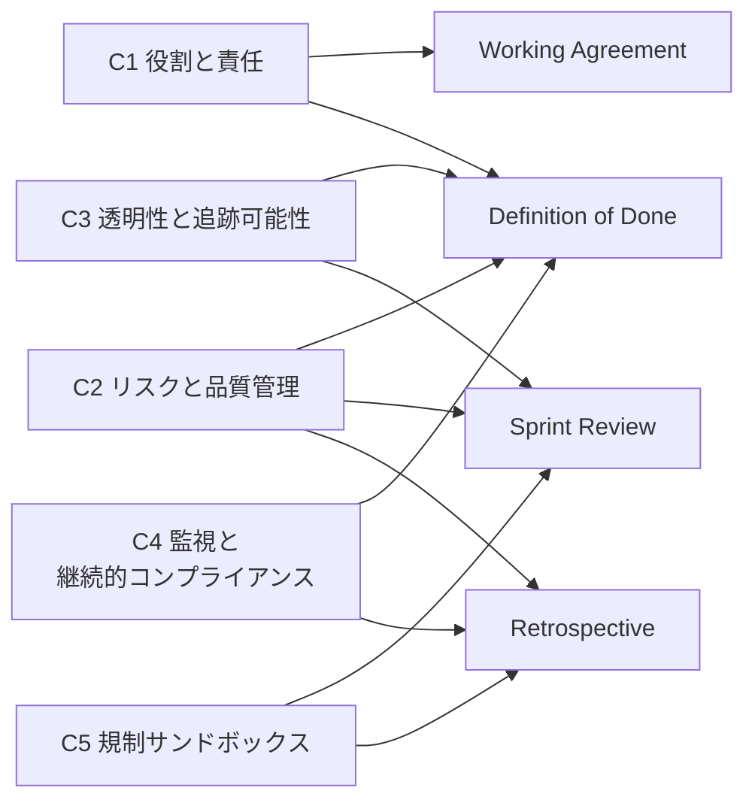

EU AI Act への対応というと、専任のコンプライアンス担当者を立て、レビュー会議を新設し、承認フローを一段増やす——そんな重量級の絵を思い浮かべがちです。開発チームから見れば、スプリントの外側に増えるオーバーヘッドでしかありません。

これに対して「新しいプロセスを作らず、既存のアジャイルイベントと成果物へ規制要件を分解して載せる」というアプローチを示した論文があります。arXiv に公開された [Operationalizing the EU AI Act in Agile Software Development: A Guideline-Based Approach](https://arxiv.org/abs/2608.16526)（arXiv:2608.16526）です。抽象的な法的義務を 12 の実務項目へ変換し、Definition of Done や Sprint Review へマッピングします。

この記事では次を扱います。

- 12 項目が何で、5 つのクラスターにどう整理されるか
- どのアジャイル成果物のどこへ載せるか
- 組織成熟度に応じた導入順序
- このアプローチだけでは埋まらない、監査・法務側の 3 つの論点
- 実務上の落としどころとしてのハイブリッド型

対象読者は、AI 機能を含むプロダクトを開発しているチームのリードと、その体制を決める立場の方です。

*この記事の全体像。以下、順に解説します。*

## 前提: この記事が扱う範囲

EU AI Act は AI システムをリスクに応じて分類し、義務の重さを変える規制です。ここで扱うのは主に**ハイリスク分類のシステムに課される義務を、開発チームの日常へどう落とすか**という論点です。

また、この記事は法的助言ではありません。自組織が provider（プロバイダー）に当たるのか deployer（デプロイヤー）に当たるのか、どのリスク分類に該当するのかの判定そのものは、法務・コンプライアンス部門の領分です。ここで扱うのは、**その判定が済んだあとに開発チーム側で何をどう回すか**です。

## 12 項目と 5 つのクラスター

論文は義務を 12 のガイドライン項目へ変換し、5 クラスターへ整理します。いずれも「新しい会議体を作る」ものではない点が特徴です。

| クラスター | 対応条文 | 項目 | 内容 |
| --- | --- | --- | --- |
| C1: 役割と責任 | Art. 3, 16, 26 | G1.1 | AI 利用の責任を provider / deployer 要件に沿って明示する |
| | | G1.2 | 責任の割り当てを Working Agreement や Definition of Done へ文書化する |
| C2: リスクと品質管理 | Art. 9, 10, 14 | G2.1 | データ品質をチーム内で継続的に確認・文書化する |
| | | G2.2 | AI 関連リスクを反復的に特定・評価・文書化する |
| | | G2.3 | AI システムの出力を人間の監視下で定期レビューする |
| C3: 透明性と追跡可能性 | Art. 11, 13, 50 | G3.1 | 作業成果物に対する AI の影響を追跡可能に文書化する |
| | | G3.2 | AI の影響に関する透明性を定期イベントで確保する |
| C4: 監視と継続的コンプライアンス | Art. 17, 72 | G4.1 | Retrospective を活用して規制の変更をチームの働き方へ統合する |
| | | G4.2 | コンプライアンスを継続的に検証・文書化する手順を確立する |
| C5: 規制サンドボックス | Art. 57 | G5.1 | 本番適用前にサンドボックス環境へ AI システムを展開する |
| | | G5.2 | サンドボックスの結果を Sprint Review や Retrospective へ反映する |
| | | G5.3 | 追跡可能性と説明責任のためサンドボックスの利用を文書化する |

読み方のコツは、**クラスターを「規制の章立て」ではなく「チームの動作の種類」として見る**ことです。C1 は決め事、C2 と C3 は毎スプリント回る動作、C4 は定期的な見直し、C5 は本番投入前のゲートに相当します。動作の種類が違うので、載せるべき成果物も違います。

## どのアジャイル成果物へ載せるか

12 項目は、既存の 4 つの成果物・イベントへ分散して載ります。

成果物ごとに整理すると次のようになります。

| 成果物・イベント | 載る項目 | 実務上の意味 |
| --- | --- | --- |
| Working Agreement | G1.1, G1.2 | 誰が provider / deployer としての責任を持つかを、チーム発足時に一度決めて明文化する |
| Definition of Done | G1.2, G2.1, G3.1, G4.2 | 完了条件へ「データ品質の確認」「AI の影響の記録」を 1 行ずつ足す |
| Sprint Review | G2.3, G3.2, G5.2 | ステークホルダーの前で AI 出力のレビュー結果とサンドボックス結果を示す |
| Retrospective | G2.2, G4.1, G4.2, G5.2 | 規制の変更とリスク評価の更新を、働き方の見直しと同じ場で扱う |

注目すべきは **Definition of Done の使われ方**です。DoD は本来「品質の下限をチームで合意する」ための道具ですが、ここでは規制要件の常設チェックポイントとして機能します。スプリントごとに人が思い出す必要がなくなるので、忘却による抜けは減ります。

たとえば、レコメンド機能を追加するチームなら、DoD へ足す行は次のような粒度になります。

- 学習・推論に使うデータの出所と更新日を、対象データセットの記録へ追記した
- この変更が AI の出力に与える影響を、Pull Request の説明へ 3 行以上で記述した
- 出力サンプルを 20 件抽出し、担当者名と確認日を添えてレビュー記録へ残した

「AI ガバナンスを遵守した」といった抽象語を DoD へ書くと形骸化します。**確認する対象・件数・残す場所が書かれているかどうか**が、機能する DoD とそうでない DoD の分かれ目です。

## 組織成熟度に応じた導入順序

12 項目を一斉に導入すると、チームは確実に破綻します。論文では、アジャイルの成熟度が低い組織ほど段階的に入れることが推奨されています。

現実的な順序は次のとおりです。

1. **C1 から入る**: Working Agreement へ責任の所在を書く。会議も工数もほぼ増えません
2. **C2 を DoD へ定着させる**: データ品質と人間による出力レビューを完了条件へ載せる
3. **C3 を Sprint Review へ組み込む**: 既存のデモ枠で AI の影響を説明する時間を数分取る
4. **C4・C5 は後回しにする**: 継続的検証やサンドボックス運用は、上記が定着してから着手する

C4 と C5 を先に入れたくなるのは、規制文書上の重みが大きく見えるからです。しかし C1・C2 が回っていない状態でサンドボックス運用だけ導入しても、そこから出た結果を受け止める責任者もレビュー導線も存在しません。**手前が空洞のまま奥の仕組みを作ると、成果物だけが増えて誰も読まなくなります。**

## 共同所有は説明責任を消しうる

このアプローチの中核には、コンプライアンスを専任者へ委ねず**チームの共同所有（Collective Ownership）とする**という思想があります。開発の現実に沿った考え方ですが、法務・監査の観点からは、そのままでは成立しない論点が残ります。以下は論文の主張ではなく、監査要件と照らしたときに実務側で検討が必要になる点です。

### 論点 1: DoD のチェックは監査証跡にならない

監査で問われるのは「**誰が、いつ、どのような根拠で承認したか**」です。DoD のチェックボックスが埋まっている事実は、この問いのどれにも答えません。

さらに根が深いのは、アジャイルの「包括的なドキュメントよりも動くソフトウェアを」という価値観が、ハイリスク AI に求められる技術文書（Art. 11）や品質管理システム（Art. 17）と正面から衝突する点です。前者はドキュメントを削る方向へ、後者は残す方向へ働きます。この緊張はプロセス設計の工夫では消えません。**どこで意図的にドキュメントを残すかを決める**しかありません。

### 論点 2: 全員の責任は誰の責任でもない

共同所有は、監査上「最終説明責任者が不在」と読まれるリスクを抱えます。加えて、EU AI Act が求める公平性・バイアス・基本的人権に関わる評価は、高度な法務・倫理の知識を要します。これを開発チームへ一任すると、認知負荷が増えるわりに見落としが起きやすくなり、結果としてチェックボックスを埋めるだけの運用へ退化します。

対処としては、共同所有の上へ RACI を明示的に重ねる方法が考えられます。

| 役割 | 担当 | 内容 |
| --- | --- | --- |
| Responsible（実行責任） | 開発チーム | DoD を通じた実装とデータ品質の担保 |
| Accountable（説明責任） | プロダクトオーナー | AI リスクと人間による監視に対する最終的な法的説明責任 |
| Consulted（相談先） | コンプライアンス・法務部門 | 規制変更の解釈 |
| Informed（報告先） | ステークホルダー | Sprint Review での報告 |

重要なのは **Accountable が 1 人に定まっているか**です。ここが複数名や「チーム」になっている時点で、監査の問いには答えられません。

### 論点 3: ベロシティの相殺

12 項目すべてを毎スプリントの DoD として厳密に消化しようとすれば、迅速な価値提供というアジャイル最大の強みが削られます。**規制対応の網羅性と提供速度はトレードオフの関係にあり、どちらも最大化はできません。**したがって、全項目を毎スプリントへ載せるのではなく、リスク分類と変更の性質に応じて適用範囲を絞る判断が必要になります。

## 落としどころ: 薄いゲートを外側へ置くハイブリッド型

ここまでを踏まえると、実務上の選択肢は「アジャイルへ全部載せる」か「外側に重量級のゲートを置く」かの二択ではありません。両者を組み合わせる形になります。

- **内側（アジャイル）**: 新しい会議体は増やさず、C1・C2 を Working Agreement と DoD への 1 行追加から始める。日常的に回る確認はここへ集約する
- **外側（薄いゲート）**: 監査に耐える厳密な証跡と、法務・倫理判断を要する評価は、法務・監査レビューとしてアジャイルの外側へ置く。ただし**通過待ちでスプリントが止まらない粒度に保つ**
- **接続点**: Working Agreement を見直す際、Responsible（共同所有）だけでなく Accountable（法的説明責任）を誰が負うのかを明記する

外側のゲートは「薄い」ことが条件です。厚くすればウォーターフォールへ戻り、内側へ全部吸収させれば監査で詰まります。**どちらの失敗も、境界線を引かずに済ませようとしたときに起きます。**

## 残る問い: DoD の完了を CI/CD で証跡化できるか

このアプローチには、まだ答えの出ていない問いがあります。

> DoD の完了要件を CI/CD パイプライン上でどのように自動化・ログ化すれば、監査に耐える客観的証跡として法務部門に認められるか。

技術的には、パイプライン実行時に承認者・タイムスタンプ・入力データのハッシュ・レビュー結果を構造化ログとして残すことは可能です。難しいのは**それが法務・監査部門に証跡として受理されるか**であり、これは技術ではなく合意形成の問題です。

したがって、パイプラインを組む前に「どの形式なら証跡として認めるか」を法務部門と先に握るのが順序として正しくなります。ログの設計は、その合意のあとに始めるものです。

## まとめ

- EU AI Act の義務は 12 項目・5 クラスターへ分解でき、既存のアジャイル成果物へ載せられる
- 中心となるのは Definition of Done。抽象語ではなく、確認対象・件数・記録先を書くと機能する
- 導入は C1（役割）→ C2（リスクと品質）の順。C4・C5 を先に入れると空洞化する
- 共同所有だけでは、監査証跡・最終説明責任・ベロシティの 3 点で不足が残る
- 実務上は、内側にアジャイルの日常確認、外側に薄い法務・監査ゲートを置くハイブリッド型が現実的
- Accountable を 1 人に定めることと、証跡形式を法務と先に合意することが、着手前に決めるべき 2 点

この記事が少しでも参考になった、あるいは改善点などがあれば、ぜひリアクションやコメント、SNSでのシェアをいただけると励みになります！

## 参考リンク

- [Operationalizing the EU AI Act in Agile Software Development: A Guideline-Based Approach (arXiv:2608.16526)](https://arxiv.org/abs/2608.16526)
