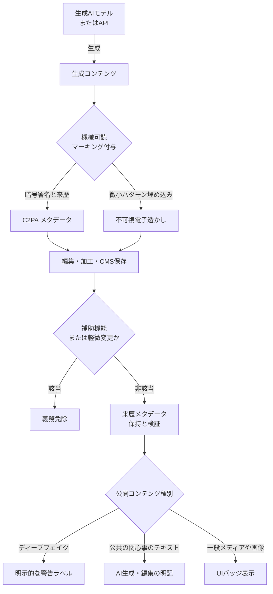

## この記事の対象

2026年8月2日、EU AI Act（Regulation (EU) 2024/1689）の**第50条 透明性義務**が適用開始されました。これに先立ち欧州委員会は2026年6月10日、実務への落とし込みを示す「AI生成コンテンツのマーキングおよびラベル表示に関する行動規範（Code of Practice on Marking and Labelling AI-generated Content）」の最終版を公表しています。

この記事は、生成AIを製品やコンテンツ配信に組み込んでいるプロダクト側の設計者・意思決定者に向けて、次の3点を整理します。

- 誰が何を義務づけられるのか（Provider と Deployer の責任分界）
- 「AI生成です」の画面表示だけでは要件を満たせない理由
- 機械可読マーキングが剥がれる前提で組む、来歴保持パイプラインの設計方針

先に結論を書きます。**この規制対応は「AI検知器の精度」の問題ではなく、生成から公開までのトレーサビリティと責任分界を、自社のデータモデルで持てるかどうかの問題です。**

## 何がいつから効くのか

まず、動いている日付を押さえます。

| 日付 | 何が起きるか |
|---|---|
| 2026年6月10日 | 欧州委員会が行動規範（Code of Practice）最終版を公表 |
| 2026年8月2日 | EU AI Act 第50条（透明性義務）が法的に適用開始 |
| 2026年12月2日 | 既存の生成AIシステムに対する機械可読マーキング適合の猶予期限 |
| 2027年2月2日 | 行動規範の署名事業者における、電子透かし検知の相互運用性の達成期限 |

実務上の意味は次のとおりです。

- **新規に出す機能**は、すでに適用開始済みです。特に Deployer 側のラベル表示は猶予がありません。
- **2026年8月2日より前から動いている既存システム**の機械可読マーキング対応は、2026年12月2日までの猶予があります。つまり、この記事を読んでいる時点で残りは約4か月です。
- 相互運用性（他社の透かしを自社検知器が読めるか）は2027年2月2日が目標時期であり、**現時点ではベンダー間で検知が通らない前提**で設計する必要があります。

## 誰が何を負うのか（Provider と Deployer）

第50条の要点は、義務が**生成する側**と**公開する側**に分かれていることです。

- **Provider（提供事業者）**: モデル開発者やAPI提供者。生成時に電子透かしやメタデータなどの「**機械可読マーキング（machine-readable marking）**」を埋め込む義務を負います。
- **Deployer（利用事業者）**: 生成AIを自社サービスやメディアで利用・公開する事業者。エンドユーザーに対して視覚的・聴覚的に「**人間が認識可能な表示（human-readable labelling）**」を提供する義務を負います。

条文レベルでは、調査時点で次のように整理されています。

- **第50条(1) 対話型AIの透明性**: AIシステムが自然人と直接対話する場合、合理的な理由（捜査等）がない限り、「AIと対話している」旨を通知しなければならない。
- **第50条(2) 生成物の機械可読マーキング**: 合成音声・画像・動画・テキストを生成または操作するAIシステムの Provider は、その出力が人工的に生成・操作されたものであることを、検出可能かつ機械可読な形式でマーキングしなければならない。技術的に実現可能な範囲で、業界標準（state of the art）に適合させることが求められる。
- **第50条(4) ディープフェイクおよびテキストの表示責任**: ディープフェイク（実在の人物・場所・イベントが真正であるかのように見せかける画像・音声・動画）を公開する Deployer は、AIによって生成・操作されたものであることを開示しなければならない。公共の関心事に関するテキストを、人間による編集・監視なしに公開する場合も同様。

ここで判断の分かれ目になるのは、**多くの企業は同時に両方の顔を持つ**という点です。自社でモデルをホストして生成機能を提供していれば Provider であり、その出力を自社メディアに載せれば Deployer です。SaaS の API を呼んで生成しているだけなら Provider 義務は API 提供者側にありますが、**その出力を公開する時点で Deployer 義務は自社に発生します**。

## 行動規範（Code of Practice）は任意だが、事実上の基準線

行動規範そのものはボランタリー（任意参加）です。ただし、準拠・署名することで第50条への適合が推定される「事実上の標準」として機能します。

判断としては次のようになります。

- **署名する**: 規範に沿った実装であれば適合が推定される。実装の設計根拠を規範に委ねられる。
- **署名しない**: 同等の透明性を**自力で証明する**必要がある。つまり、なぜ自社の方式で第50条を満たすのかを、自前のドキュメントと監査証跡で説明する責任を負う。

エンジニアリング上のコストで言えば、署名しない選択は「独自方式の証明責任」を継続的に背負う選択です。独自の来歴管理基盤をすでに持っている企業以外は、規範に寄せたほうが説明コストは下がります。

## 技術手段: C2PA と 電子透かしは役割が違う

行動規範が整理している技術的アプローチは、大きく2種類です。**どちらか一方ではなく、弱点が補完関係にあるため多層で使う**という位置づけになっています。

| 技術手段 | メカニズム | 長所 | 短所・限界 |
|---|---|---|---|
| **C2PA（コンテンツ来歴）** | マニフェストと暗号署名をファイルフォーマット（JUMBF領域等）に埋め込む | 作成者・モデル名・編集履歴を正確に保持できる | SNSの再圧縮やリサイズ、メタデータ削除処理で容易に失われる |
| **不可視電子透かし** | ピクセル群や音声周波数の微小パターンとして非破壊的に埋め込む | ファイル変換やスクリーンショットにも比較的高い耐性がある | 画質・音質への影響調整が必要。ベンダー間の検知の相互運用性が課題 |

C2PA は「正確だが壊れやすい」、電子透かしは「壊れにくいが精密な情報は載せられず、他社の検知器で読めるとは限らない」という関係です。したがって、**C2PA を情報の正本にし、電子透かしを最後の耐久層にする**構成が基本形になります。

## 「埋め込んだから大丈夫」が成立しない3つの理由

ここが設計上いちばん重要な部分です。ファイルにマーキングを埋め込むこと自体は、ライブラリの導入で解決します。問題は、そのマーキングが**公開チャネルを通過した瞬間に消えること**です。

### 1. メタデータの剥がれ（stripping）

X（旧Twitter）や Instagram、各種CMS、画像最適化プロキシは、配信パフォーマンス向上やプライバシー保護の目的で EXIF や C2PA のメタデータを自動的に除去します。自社で正しく署名を付けても、配信先を通った時点で残っている保証はありません。

### 2. アナログホール（analog hole）

画面のスクリーンショット、動画の再撮影、フォーマット変換（PNG→JPG）によって、C2PA の署名は失われます。ここは「ほぼ確実に消える」と考えて設計すべき経路です。

### 3. 判定の偽陽性・偽陰性

- **偽陽性**: 人間のクリエイターの作品が統計的な電子透かし検知器で「AI生成」と誤判定され、企業の信用が毀損される。
- **偽陰性**: 悪意ある攻撃者が軽微なノイズ攻撃で電子透かしを無効化し、表示責任を回避する。

つまり、**検知器の出力を唯一の判断根拠にする運用は、両方向に事故を起こします**。「検知できたからラベルを出す／検知できないから出さない」という条件分岐を製品の中心に置いてはいけません。

## 責任分界のグレーゾーンをどう扱うか

義務の適用範囲には明確な例外規定があります。

- **補助的機能（assistive function）**: 文法校正など、単なる支援にとどまる利用。
- **軽微な加工（minor alteration）**: 入力データの意味（semantics）を変更しない加工。
- **法執行用途（law enforcement）**: 捜査機関による用途。

ここで実務が詰まるのは、**「意味を変更しない」の客観的なしきい値が自動判定しづらい**点です。たとえば次のようなケースです。

- 画像の背景をAIで生成し、手動でトリミングし、人間がコピーを乗せたバナーは「AI生成物」なのか「人間の作品」なのか。
- 自動要約は意味を変えていないのか、要点の取捨選択は意味の変更にあたるのか。

自動判定に寄せると、判定ロジックの妥当性そのものが説明責任の対象になります。現実的な落としどころは、**機能単位で分類を人が確定させ、その判断理由を設計文書と免除判定ログとして残す**ことです。コンテンツ1件ごとの動的判定ではなく、機能ごとの静的な分類にすると、説明可能性とテスト容易性が上がります。

## 来歴保持パイプラインの設計方針

以上を踏まえると、設計の中心は「ファイルにどう埋めるか」ではなく、**ファイルからマーキングが失われても来歴を再構成できるか**になります。

### 生成時（Provider の面）

- 生成API呼び出し時に、プロンプト・モデルID・生成日時・**生成物のハッシュ**を内部の監査ログに保存する。
- C2PA マニフェストと電子透かしを両方付与する。

### 管理・編集時（パイプライン）

- CMS 内で、C2PA メタデータが失われても**生成物ハッシュから内部監査ログを参照して来歴を復元できる**バインド設計にする。
- ここが設計の要です。ファイル内のメタデータは「あれば速い経路」であり、正本は自社の監査ログ側に置きます。

### 配信・公開時（Deployer の面）

- 自社UI上の表示ラベルは、**C2PAメタデータの有無ではなく、CMSに記録された来歴フラグに基づいて動的にレンダリングする**。
- 外部SNSへ配信する経路では、メタデータが剥がれる前提で、キャプションや画面内の視認可能な表示など**ファイル外の手段**で human-readable な開示を担保する。

この構成にすると、前述の偽陽性・偽陰性の問題も回避できます。自社が生成したコンテンツについては検知器に頼る必要がなく、**生成時点の事実を自社のデータとして持っている**からです。検知器は、外部から持ち込まれたコンテンツの一次スクリーニングに用途を限定するのが妥当です。

## 12月2日に向けた棚卸しの進め方

既存システムは2026年12月2日が機械可読マーキング適合の猶予期限です。残り時間を踏まえると、全面対応より**機能単位の分類と優先度付け**が先です。棚卸しのマトリクスは次の形になります。

| 機能・モジュール | AI関与度 | 分類 | 対応方針 | 期限 |
|---|---|---|---|---|
| 自動画像生成機能 | フル生成 | Provider要件 | C2PA・透かし付与エンジンの組み込み | 2026年12月2日 |
| 文章の自動要約・翻訳 | 意味変更なし | 例外対象（minor） | 免除理由をアーキテクチャ文書に明記 | 対応不要 |
| SNS投稿用ディープフェイク合成 | 構造変更 | Deployer要件 | UI上に人間認識可能なラベル表示を義務化 | 2026年8月2日（即時） |
| テキストの文法校正 | 補助的機能 | 例外対象（assistive） | 免除判定ログの保持 | 対応不要 |

優先順位は次のとおりです。

1. **Deployer 要件（すでに適用中）**: ディープフェイク公開や、人間の監視なしに公開される公共の関心事のテキスト。ここは猶予がないため最優先。
2. **Provider 要件（12月2日期限）**: 生成機能へのマーキング組み込み。
3. **例外対象**: 実装は不要だが、**なぜ免除にあたるかの記録**が必要。ここを空欄にすると、後から説明できません。

判断のポイントは、3列目の「分類」を誰が確定させるかです。エンジニアが技術的に判断するのではなく、機能オーナーが分類を確定し、その根拠をドキュメント化するプロセスにしておくと、監査時の説明が成立します。

## まとめ

- EU AI Act 第50条の透明性義務は2026年8月2日に適用開始。既存システムの機械可読マーキングは2026年12月2日まで猶予がある。
- 義務は Provider（機械可読マーキング）と Deployer（人間が認識可能な表示）に分かれる。API利用者でも、公開する時点で Deployer 義務は自社に発生する。
- 行動規範は任意参加だが、準拠すれば適合が推定される。署名しない場合は同等性の証明責任を自前で負う。
- C2PA は正確だが剥がれやすく、電子透かしは頑健だが相互運用性が未達。多層で使う前提が必要。
- ファイル埋め込みだけの設計は、SNS配信・スクリーンショット・フォーマット変換で無効化する。**生成物ハッシュと内部監査ログで来歴を再構成できるバインド設計**が中心になる。
- 例外規定（補助的機能・軽微な加工）は、コンテンツ単位の自動判定ではなく機能単位の静的分類と免除判定ログで扱う。

この記事が少しでも参考になった、あるいは改善点などがあれば、ぜひリアクションやコメント、SNSでのシェアをいただけると励みになります！

## 参考リンク

- [European Commission: Commission publishes Code of Practice on marking and labelling AI-generated content (2026-06-10)](https://digital-strategy.ec.europa.eu/en/news/commission-publishes-code-practice-marking-and-labelling-ai-generated-content)
- Regulation (EU) 2024/1689 of the European Parliament and of the Council (EU AI Act) — Article 50: Transparency obligations for providers and deployers of certain AI systems
- Coalition for Content Provenance and Authenticity (C2PA) Technical Specification v2.1
