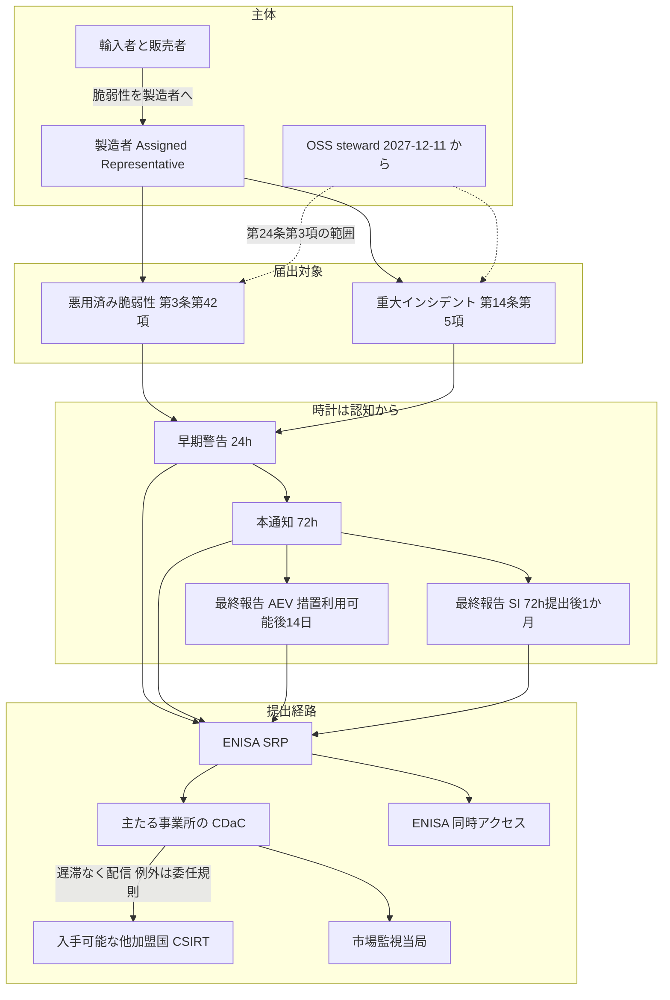
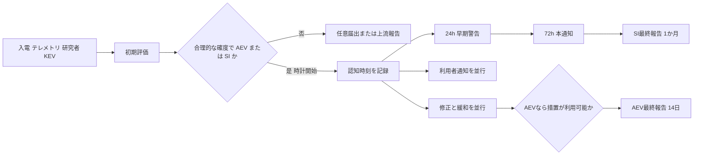

**EU の Cyber Resilience Act**（規則 (EU) 2024/2847）は、デジタル要素付き製品（products with digital elements）を対象とする横断的なサイバーセキュリティ規則です。
製造者に対する悪用済み脆弱性（actively exploited vulnerability）と重大インシデント（severe incident）の届出義務は、本則（2027-12-11）より早く、**2026-09-11 から適用されています**。
本稿の適用日と届出内容は、規則本文と、欧州委員会が 2026-09-11 に更新した [報告義務の解説ページ](https://digital-strategy.ec.europa.eu/en/policies/cra-reporting) に依拠します。

この記事では、誰が届出の名宛人か、時計がいつ動き、24 時間と 72 時間と最終報告で何を出すか、提出経路と製造者が先に固定する運用判断を整理します。
想定読者は、EU 市場へデジタル要素付き製品を置く製造者のセキュリティとコンプライアンス、および輸入者や販売者として製造者へ脆弱性を知らせる立場です。

*この記事の全体像。以下、順に解説します。*

## EU CRAの報告義務とは

Cyber Resilience Act は、ハードウェアとソフトウェアを含む「デジタル要素付き製品」へ横断適用する水平規制です。
対象の定義は第 2 条と第 3 条第 1 項にあります。

届出義務の核は第 14 条です。
製造者は、自製品における悪用済み脆弱性または重大インシデントを認知したら、ENISA が運用する Single Reporting Platform（SRP）へ一度提出します。
提出先の受け手は、主たる事業所の調整 CSIRT（CSIRT designated as coordinator、以下 CDaC）と ENISA です。

適用日は条項ごとに分かれます。

- 第 14 条（製造者の届出）：2026-09-11（第 71 条第 2 項）
- 第 4 章（適合性評価機関の通知）：2026-06-11
- 本則のその他：2027-12-11
- オープンソースソフトウェア steward の報告義務（第 24 条第 3 項）：2027-12-11

第 69 条第 3 項により、2027-12-11 より前に上市した対象製品にも第 14 条は及びます。
サポート期間終了後も第 14 条は残る、という読みが委員会ガイダンスにあります。
脆弱性取扱い（附属書 I 第 II 部）のサポート期間とは、時計の長さが異なります。

### 名宛人と届出対象

第 14 条の SRP 届出の名宛人は **製造者** です。
輸入者は第 19 条第 5 項、販売者は第 20 条第 4 項で、脆弱性を製造者へ遅滞なく知らせます。
製品が重大なサイバーセキュリティリスクを呈する場合は、上市または提供した加盟国の市場監視当局へも直ちに知らせます。

届出対象は次の 2 種です。

- **悪用済み脆弱性（AEV）**：第 3 条第 42 項。システム所有者の許可なく、悪意ある行為者が悪用した信頼できる証拠があること
- **重大インシデント（SI）**：第 14 条第 5 項。(a) 機微または重要なデータや機能の機密性、完全性、可用性を損なう、または損ない得ること。(b) 製品または利用者のネットワーク情報システムに悪意あるコードを導入または実行した、またはし得ること。「capable of」がある

オープンソースソフトウェア steward は、第 24 条第 3 項で第 14 条第 1 項、第 3 項、第 8 項を限定的に引き込みます。
開始は 2027-12-11 です。
行政罰金は第 64 条第 10 項 (b) で適用しません。
製造者として自社名でオープンソースソフトウェアを上市する場合は、steward ではなく製造者義務です。

利用者通知は第 14 条第 8 項です。
影響利用者（必要なら全利用者）へ、必要に応じて機械可読形式で知らせます。
任意届出は第 15 条（脆弱性、脅威、インシデント、ニアミス）です。
2026-09-11 時点の SRP には未実装です。

### 三段の届出と最終報告の分岐

届出は三段です。
条文は「without undue delay and in any event within …」と書くため、24 時間と 72 時間は上限です。
第 14 条第 6 項で、CDaC は中間報告を求め得ます。

| 段階 | AEV（第 14 条第 2 項） | SI（第 14 条第 4 項） |
|---|---|---|
| 早期警告 24 時間 | 製品が入手可能な加盟国 | 違法または悪意の疑いの有無と加盟国 |
| 本通知 72 時間 | 製品の一般情報、exploit と脆弱性の一般的性質、是正または緩和、利用者向け措置、機微度 | 性質、初期評価、是正または緩和、利用者向け、機微度 |
| 最終報告 | 是正または緩和措置が**利用可能になってから 14 日以内**。重大度と影響、行為者（あれば）、更新または是正の詳細 | **72 時間通知の提出から 1 か月以内**。詳細、脅威または根本原因、適用中の緩和 |

AEV の最終報告は「パッチまたはワークアラウンドが利用可能になった時刻」起算です。
SI の最終報告は「発生から 1 か月」ではなく、72 時間通知の提出起算です。

届出の主体、事象、時計、提出経路の関係は次のとおりです。

製造者側の工程は、認知時刻の確定、対象製品と版の特定、SRP の Primary / Secondary Assigned Representative（AR）、休日の初報代行、修正作業との並行です。

提出先は第 14 条第 7 項です。
主たる事業所（サイバーセキュリティ意思決定の中心。不明なら EU 内従業員最多）の CDaC エンドポイントです。
EU 内事業所が無い場合は、授権代表者、輸入者、販売者、利用者数の順です。
第 16 条第 2 項により、受信 CDaC は、製造者が示した入手可能加盟国の CDaC へ遅滞なく配信します。
委任規則 (EU) 2026/881 は、配信遅延のサイバーセキュリティ事由を定めます。
遅延はできるが義務ではありません。
ENISA の同時アクセス制限は、第 16 条第 2 項第 3 段落の特に例外的な状況（particularly exceptional circumstances）に限られます。

ポータルは `https://portal.cra-srp.enisa.europa.eu/` です。
ENISA は 2026-09-11 に初期運用能力を展開した、と発表しています。

## 注意点

委員会の cra-reporting ページ、FAQ、ガイダンスは実装の地図になります。
ただし FAQ 前文とガイダンス para 8 は、拘束力がなく、権威ある解釈は EU 司法裁判所に限ると書きます。
認知（becoming aware）の定義も規則本文には無く、ガイダンス上の運用定義です。

「EU 市場に製品を置く者は全員 24 時間で SRP へ」は過大です。
第 14 条の名宛人は製造者です。
輸入者と販売者の主義務は製造者への通知です。

「CVE が出たら 24 時間」も過大です。
第 3 条第 42 項は、悪意ある悪用の信頼できる証拠を求めます。
Recital 68 と委員会 FAQ 5.2 は、善意のテスト、調査、開示を mandatory の対象から外します。
パッチ未提供のゼロデイでも、悪意ある悪用の証拠があるときだけ第 14 条です。
バグバウンティ開示のみでは足りません。
時計を動かすのは「脆弱性の存在」ではなく「自製品における悪用の認知」です。
第三者コンポーネントでも、自製品で到達不能または未悪用なら、その製造者の mandatory 対象外です。
コンポーネント製造者が上市していれば、その製造者は別途届出します。

「1 回出せば他のサイバー報告は不要」は、CRA 内部の加盟国 CSIRT 多重通知の省略を指します（ENISA FAQ 1）。
GDPR 第 33 条の個人データ侵害通知は別義務です。
製造者は他の EU 法令でも類似の報告義務を負い得ます。
NIS2 第 23 条のインシデント通知も別制度として残ります。
同一票にまとめるか別票にするかは組織依存です。

SRP は 2026-09-11 の初期運用能力です。
ローンチ時点で API は無く、UI は英語のみです（ENISA FAQ 15, 24）。
72 時間カウンタは現行版では早期警告提出の 48 時間後を示します（FAQ 26）。
画面表示は法定時計の代替ではありません。
誤った CDaC は無効化され再提出になります（FAQ 18）。
SRP 障害時は復旧を待ちます。
直接 CSIRT 連絡をしても、復旧後に SRP 再提出が必要です（FAQ 25）。
FAQ 25 は運用指示であり、24 時間徒過の免責条項ではありません。

医療機器、車両、航空認証品、舶用、防衛専用は第 2 条で除外されます。
非接続製品は第 2 条第 1 項の適用条件を満たしません。
自社使用は上市に当たりません。

Bitkom が 2026 年 KW16–23 に実施した調査（N=1003）の設問は CRA の認知です。
「29% は自社にとっての意味が分かる、38% は聞いたが意味を判断できない」と Bitkom が報告します。
見出しの「準備」は設問より広く、届出チャネルの実測ではありません。

## 届出の時計はいつ動き何を出すか

規則本文は becoming aware を定義しません（委員会 FAQ 5.1）。
委員会ガイダンス C(2026) 5252 annex para 212-213 は、NIS2 実施規則 (EU) 2024/2690 Recital 31 と EDPB Guidelines 9/2022 に揃え、疑わしい事象は直ちに評価し、初期評価後に合理的な確度を得た時点を認知とします。
フォレンジック完了は待ちません。
ガイダンスは非拘束です。
裁判所が同じ「合理的な確度」で読むかは未解決です。

2026-09-11 より前に悪用を認知済みなら遡及届出を求めない、という解釈がガイダンス para 217、FAQ 5.3、ENISA FAQ 13 にあります。
同日以降に悪用を認知したら、脆弱性自体が古くても対象です。
規則本文に非遡及条項は無いため、票には認知日を残します。

休日を暦日から外す明文は見当たらないため、認知が休日に起き得るなら初報の代行が要ります。
24/7 配置の義務明文は無く、零細と小企業の 24 時間早期警告の期限徒過には、第 64 条第 10 項 (a) の行政罰金を適用しません。
72 時間と最終報告はこの免除の対象外です。
義務自体は残ります。
Corrigendum OJ L 2025/90555（2025-07-02）が、第 64 条第 10 項の導入文を「paragraphs 3 to 9」から「paragraphs 2 to 9」へ訂正し、第 14 条の罰金条（第 2 項）に免除が届きます。

利用者通知（第 14 条第 8 項）に数値期限はありません。
ガイダンス para 220 は、リスクベースで公開範囲を限定してよいとします。
修正と緩和、利用者通知、SRP 届出は並行します。

最終報告のカレンダーは事象で分岐させます。

- AEV：是正または緩和措置の公開時刻 + 14 日
- SI：72 時間通知の提出時刻 + 1 か月

SRP の overdue 表示は使いません。

## 提出経路とSRPのいまの制約

ENISA FAQ 9 によれば、Primary AR は製造者あたり 1、Secondary は最大 20 です。
認証は EU Login と MFA です。
検証待ちでも最大 20 件まで提出できます。

24 時間票は英語の早期警告必須項目だけを先に出し、72 時間で性質、初期評価、緩和を足す、という運用が現実的です。
ローンチ時点の UI が英語のみだからです。

認知時刻、製品と版、加盟国、Primary AR と Secondary（代行）、CDaC 選択理由は、1 件票で固定します。
誤った CDaC は無効化されるため、選択理由を残さないと再提出のたびに同じ誤りを踏みます。

## 製造者が先に固定する運用判断

製造者は、AEV と SI 専用の 24 時間初報レーンを、修正レーンとは別に置きます。
OSS 受付は「自製品で悪用されているか」を関門にします。
steward 義務と製造者義務は台帳で分けます。
第 24 条適用（2027-12-11）までに、オープンソースソフトウェアを自社名で上市しているか、steward に過ぎないかを仕分けます。

直近で固定する項目は次のとおりです。

1. 認知時刻、製品と版、加盟国、Primary AR と Secondary、CDaC 選択理由を 1 件票にする
2. EU Login と MFA の AR を少なくとも 2 人用意する。検証は届出と並行できる
3. 24 時間票は早期警告必須項目だけを先に出す
4. 最終報告カレンダーを AEV と SI で分岐させる
5. 利用者通知の公開範囲を、製品の機微に応じて事前に決める
6. 2026-09-11 より前に悪用認知済みの案件は、票に認知日を残す
7. オープンソースソフトウェアの製造者か steward かを仕分ける

罰金の上限は第 64 条第 2 項です。
附属書 I および第 13 条、第 14 条違反は、最大 1 500 万 EUR または全世界年商の 2.5% の高い方です。

次の場合は、第 14 条の SRP 届出を前提にしません。

- 自社が製造者ではなく輸入者または販売者のみ：SRP ではなく製造者への通知が主義務。重大リスクなら市場監視当局へも通知する
- 対象が第 2 条除外製品：第 14 条は乗らない。他法の報告は残る
- 悪用証拠が無く、自製品で到達不能：mandatory ではなく任意届出または上流報告（第 13 条第 6 項）

## まとめ

2026-09-11 以降、EU 市場の対象製品の製造者は、悪用済み脆弱性または重大インシデントを認知したら、SRP 経由で 24 時間の早期警告、72 時間の本通知、最終報告を出します。
最終報告の起算は事象で分岐します。
修正と利用者通知は並行します。

広げて読むと誤る点は、名宛人が製造者に限ること、CVE や善意開示だけでは足りないこと、OSS steward は 2027-12-11 まで待ること、CRA の一度の提出が他法を消さないことです。
認知ログと 24 時間初報レーンは止めず、SRP の画面時計は法定期限の代替にしない、という運用がいまの実体に合います。

この記事が少しでも参考になった、あるいは改善点などがあれば、ぜひリアクションやコメント、SNSでのシェアをいただけると励みになります！

## 参考リンク

- [Regulation (EU) 2024/2847](https://eur-lex.europa.eu/legal-content/EN/TXT/HTML/?uri=CELEX:32024R2847)（ELI: <http://data.europa.eu/eli/reg/2024/2847/oj>）
- [Corrigendum OJ L 2025/90555](https://eur-lex.europa.eu/eli/reg/2024/2847/corrigendum/2025-07-02/oj)（第 64 条第 10 項の導入文）
- [Commission Delegated Regulation (EU) 2026/881](http://data.europa.eu/eli/reg_del/2026/881/oj)
- [Cyber Resilience Act - Reporting obligations](https://digital-strategy.ec.europa.eu/en/policies/cra-reporting)（欧州委員会、最終更新 11 September 2026）
- [The Cyber Resilience Act - Summary of the legislative text](https://digital-strategy.ec.europa.eu/en/policies/cra-summary)
- [Cyber Resilience Act - Open source](https://digital-strategy.ec.europa.eu/en/policies/cra-open-source)
- [Commission guidance on the application of the CRA](https://digital-strategy.ec.europa.eu/en/library/commission-publishes-new-guidance-support-timely-cyber-resilience-act-implementation)（C(2026) 5252 Annex、section 9.1）
- [FAQs on the Cyber Resilience Act](https://ec.europa.eu/newsroom/dae/redirection/document/122331)（version 1.4、4 September 2026、section 5）
- [ENISA Single Reporting Platform](https://www.enisa.europa.eu/topics/product-security/single-reporting-platform-srp)
- [ENISA SRP Frequently Asked Questions](https://www.enisa.europa.eu/topics/product-security/single-reporting-platform-srp/frequently-asked-questions)（updated 12 September 2026）
- [The CRA Single Reporting Platform is launched](https://www.enisa.europa.eu/news/the-cra-single-reporting-platform-is-launched)（ENISA、11 September 2026）
- [Bitkom, Cyber Resilience Act: Nur 3 von 10 Unternehmen sind vorbereitet](https://www.bitkom.org/Presse/Presseinformation/Cyber-Resilience-Act-3-von-10-Unternehmen-vorbereitet)
