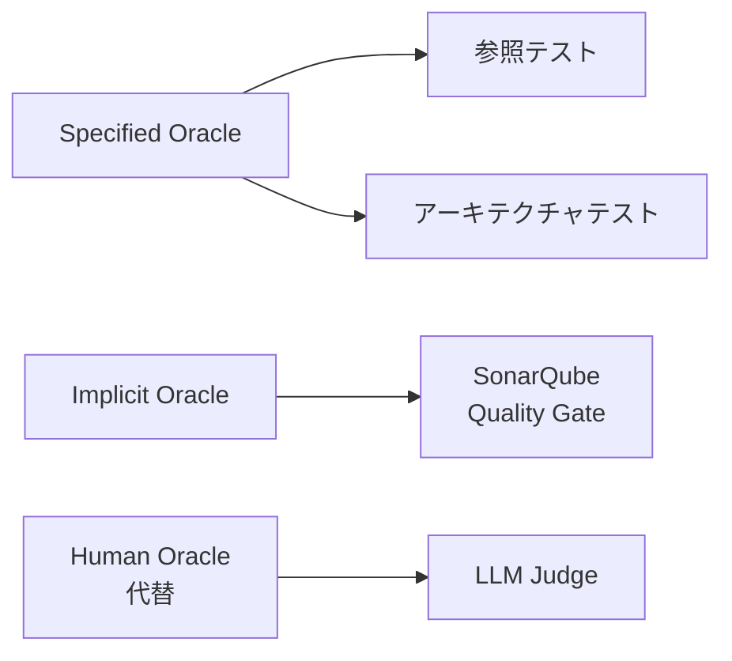
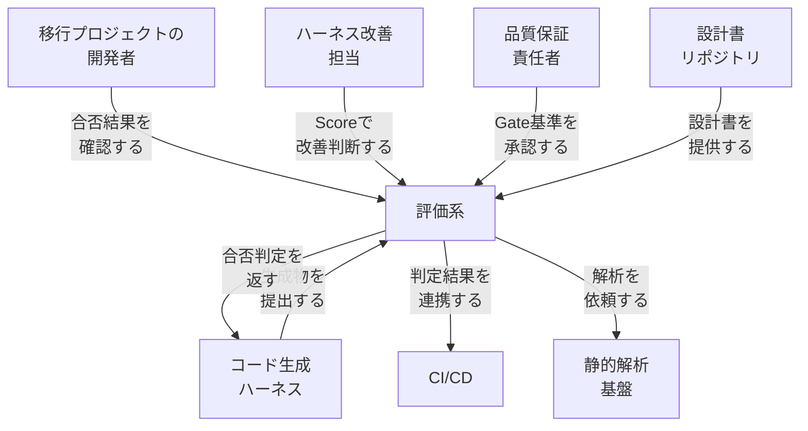
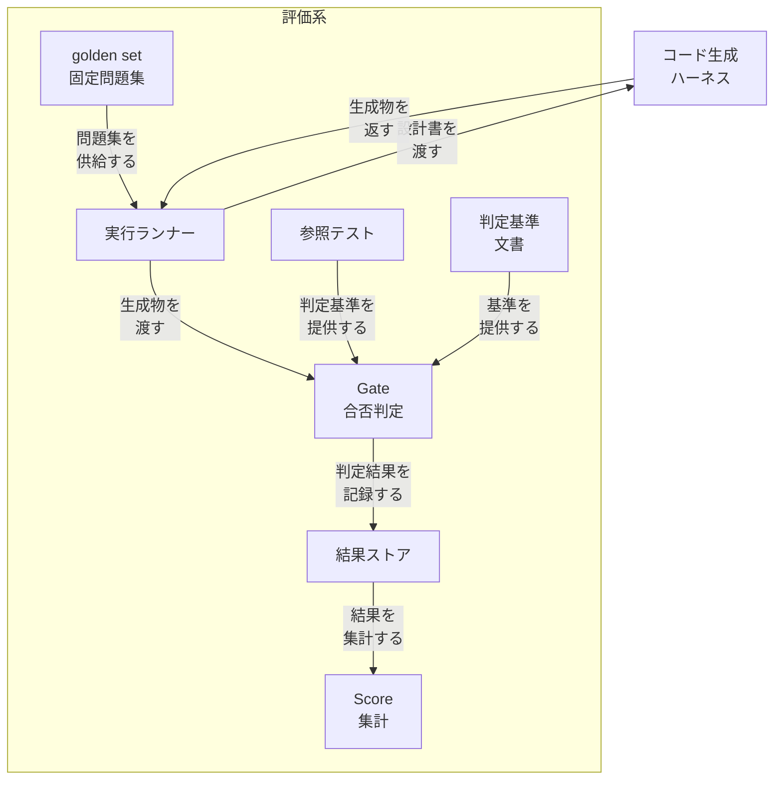
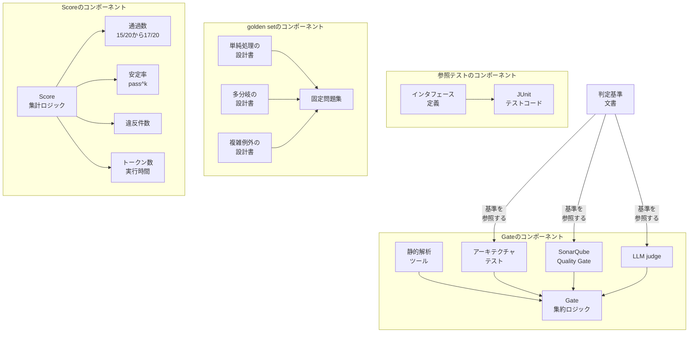
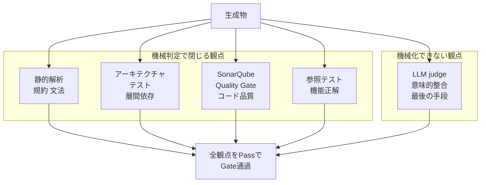
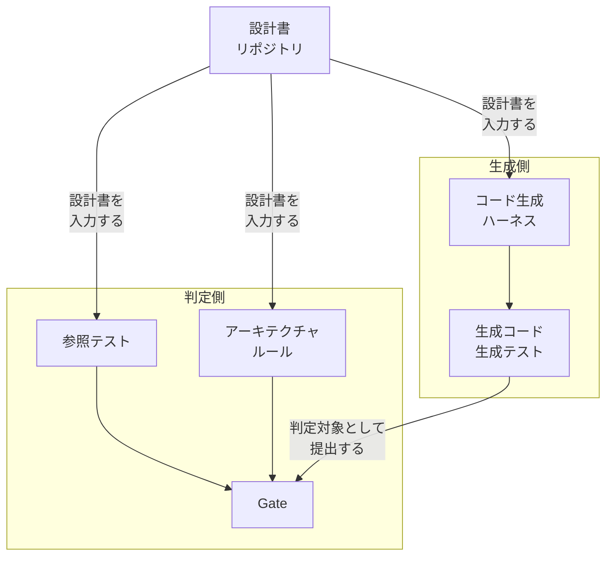
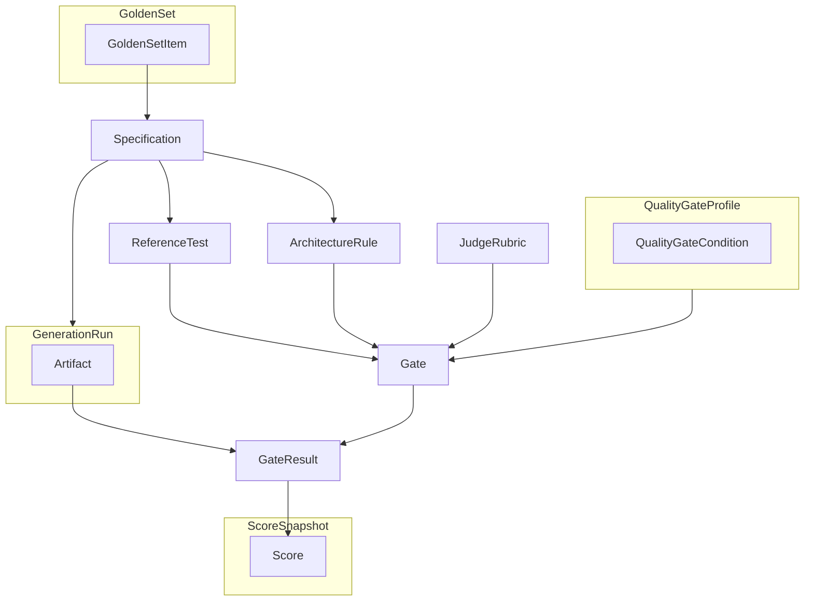
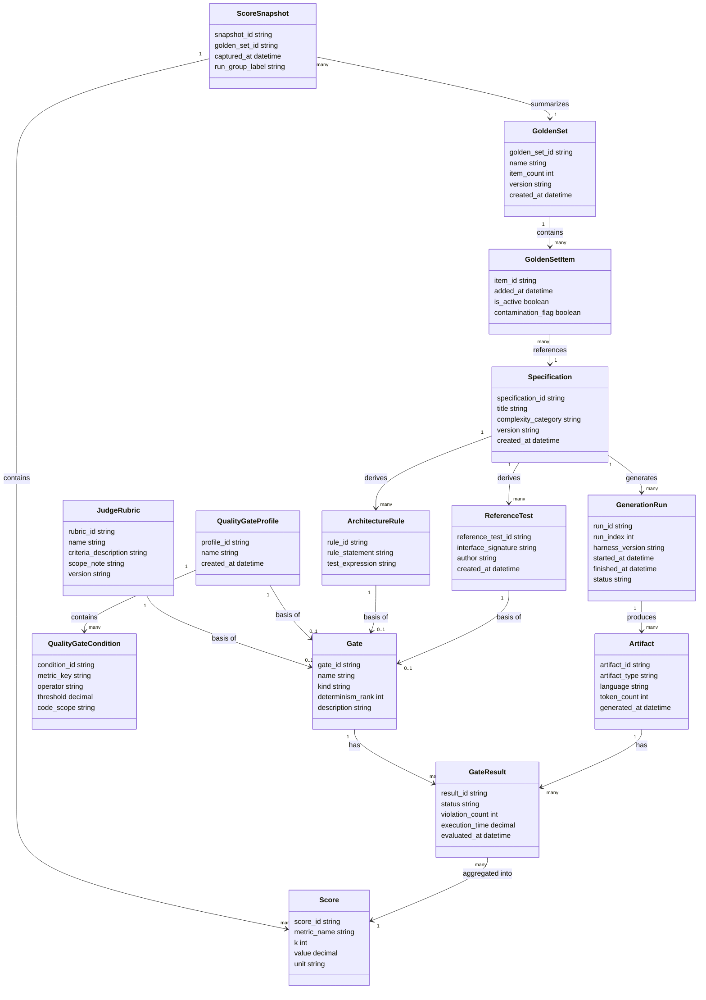
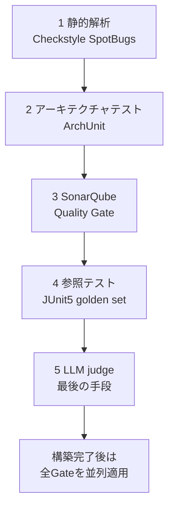
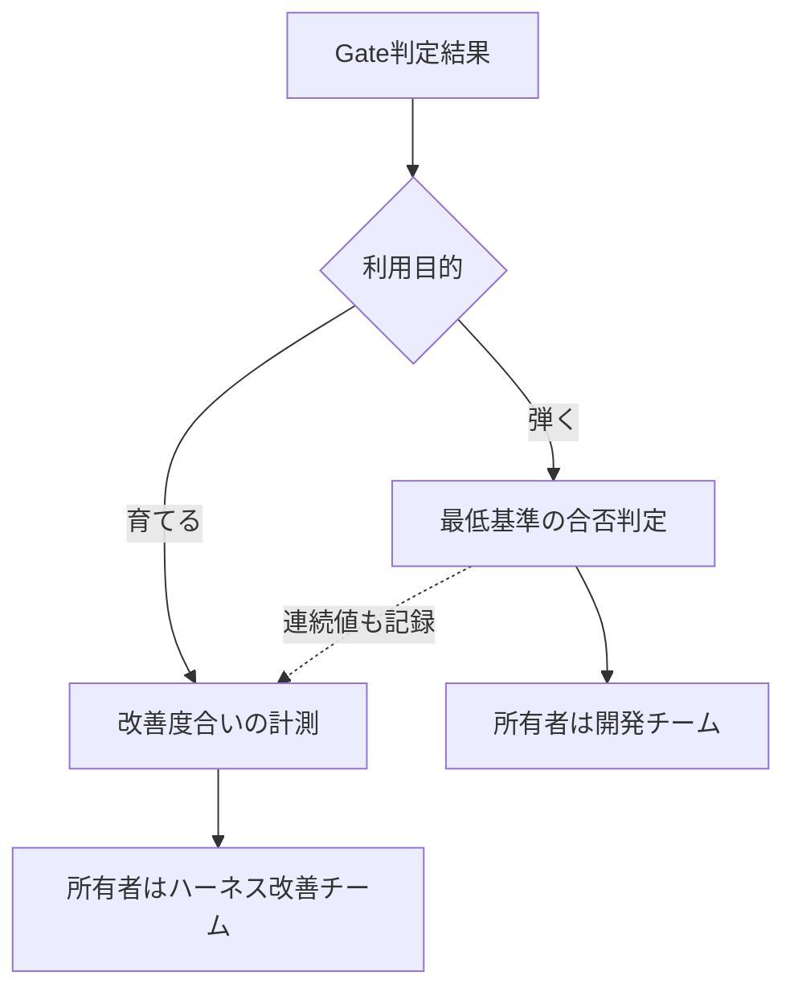

AIにコードを書かせる議論は、生成する側に偏りがちです。生成物の正しさを何で判定するかという、評価する側の設計はあまり語られません。

本記事は、レガシー言語から Java への移行 R&D において、設計書から Java コードと JUnit テストを生成するハーネスの生成物をどう判定するか、その評価系をゼロから設計した方法論を整理します。起点は Zenn 記事「AIにコードを書かせる記事は溢れているのに、『正しさの保証』の話が少なすぎる」(inaki 氏、2026-07-19 公開) です。

あわせて、この設計をソフトウェア工学の test oracle problem に対応づけ、公式ドキュメントと論文で裏付けを取りながら、実装レベルまで具体化します。

> **帰属の注記**: 起点記事は「評価オラクル」という学術用語を使いません。学術分類との対応づけ、および静的解析 (Checkstyle / SpotBugs) と ArchUnit の名指しは、本記事による補完です。記事の主張と本記事の補完は、本文の該当箇所で区別して示します。

> **調査時点**: 2026-07-20。バージョンは ArchUnit 1.4.2 / JUnit 5 (Jupiter) / SonarQube Server 2026.1 LTA / maven-checkstyle-plugin 3.6.0 を前提とします。

## 概要

### この方法論が何か

本記事で扱う方法論 (以下、評価オラクル設計) は、レガシー言語から Java へのコード移行 R&D において、設計書から Java コードと JUnit テストを生成する「ハーネス」(LLM を組み込んだコード生成パイプライン) の生成物を判定するために、評価系をゼロから設計した方法論です。

起点記事はレガシー移行シリーズの第1回にあたります。起点記事は「評価オラクル」という学術用語を使っていません。以下の学術的対応づけは、本記事側の整理です。

記事の最初の問いは、評価は「弾くため」か「育てるため」かというものです。この問いに対する記事の答えは、評価対象を成果物(個別の生成コード)とハーネス自体(生成パイプライン)の 2 層に分け、前者を Gate(Pass/Fail の二値判定)、後者を Score(Gate 判定を golden set 全件で集計した指標)として統合することです。

基本思想は「非決定的な生成を、決定的な判定で受け止める」ことです。加えて「生成した本人に採点させない」という原則を置いています。同じ LLM に生成と検証をさせると、生成時に埋め込まれた誤解が検証をすり抜けるためです。

### test oracle problem との対応

ソフトウェア工学には、この問題に対応する古典的な学術領域があります。Barr, Harman, McMinn, Shahbaz, Yoo による調査論文 "The Oracle Problem in Software Testing: A Survey" (IEEE Transactions on Software Engineering, 2015, vol.41, no.5, pp.507-525, DOI: 10.1109/TSE.2014.2372785) は、これを次のように定義しています。

> 入力に対して、システムの望ましい正しい振る舞いを、潜在的に誤った振る舞いから区別する課題を「test oracle problem」と呼ぶ。

同論文は、テストオラクルを起点となる情報の出所によって 4 分類しています。

| 分類 | 定義 | 具体例 (論文内) |
|---|---|---|
| specified oracle | 形式仕様(モデルベース仕様言語、状態遷移システム、表明・契約、代数仕様)から期待動作を定義するオラクル | Z、VDM、B、UML/OCL、LARCH |
| derived oracle | 仕様が無くても、既存バージョンや実行履歴、ドキュメントなどの成果物からオラクル情報を導出するオラクル | 回帰テスト、metamorphic testing、N-version、ログ解析 |
| implicit oracle | 特定の仕様が無くても「明らかに誤り」と判定できる普遍的な性質を検出するオラクル | クラッシュ、null 参照、デッドロック、メモリリーク |
| lack of automated oracle (human oracle) | 自動化できるオラクルが存在しない場合に、人間の判断コスト("human oracle cost problem")を下げる手段 | パーティションテスト、テストスイート削減 |

起点記事の 4 評価資産を、この分類に対応づけると次のとおりです(対応づけは本記事による整理であり、記事自身の主張ではありません)。

| 記事の評価資産 | Barr et al. の分類 | 対応の根拠 |
|---|---|---|
| 参照テスト | specified oracle (広義) | 設計書という自然言語仕様から期待値を導出する点で、形式仕様に基づく specified oracle と構造が同じです。Barr et al. の specified oracle は形式仕様言語を主眼としており、自然言語の設計書はより緩い対応です |
| アーキテクチャテスト | specified oracle | 設計書から自動生成する構造ルールを検証する点で、形式仕様への準拠を判定する specified oracle に近い分類です |
| SonarQube Quality Gate | implicit oracle (拡張) | 個別システムの仕様によらず、複雑度・重複・コードスメルなど業界標準の欠陥パターンを汎用的に検出します。Barr et al. の implicit oracle はクラッシュ等の普遍的な欠陥検出を指しており、SonarQube のルールセットはこれを拡張した位置づけと整理できます |
| LLM judge | lack of automated oracle (human oracle) の代替 | Barr et al. の第 4 分類は、自動化オラクルが存在しない場合の人間判断コスト低減を扱います。記事は LLM judge を「最後の手段」「意味的検証限定」と位置づけており、人間判定の代替として機能します |
| golden set / Score / pass^k | 分類外(オラクルの種類ではなく、判定の集計対象・集計指標) | golden set は判定に使う固定の問題集、Score・pass^k は個々のオラクル判定を集計した二次指標です |



| 要素名 | 説明 |
|---|---|
| Specified Oracle | 形式仕様から期待動作を定義するオラクル分類 (Barr et al. 2015) |
| Implicit Oracle | 仕様によらず明白な欠陥を検出するオラクル分類 (Barr et al. 2015) |
| Human Oracle代替 | 自動化オラクルが存在しない場合の人間判断代替の枠組み (Barr et al. 2015) |
| 参照テスト | 設計書から生成側と独立に作成する機能検証テスト (起点記事) |
| アーキテクチャテスト | 設計書から自動生成する構造ルール検証テスト (起点記事) |
| SonarQube Quality Gate | 業界標準のコード品質しきい値による判定 (起点記事) |
| LLM Judge | 意味的検証に限定した最後の手段としての LLM 判定 (起点記事) |

### なぜ LLM 時代にオラクル問題が再燃するか

Barr et al. は 2015 年の時点で、オラクル自動化が「テスト全体の自動化を妨げる重要なボトルネック」であり、自動化できるオラクルが無い場合は人間が振る舞いの正誤を判定するしかないと述べています。この "human oracle cost problem" は LLM 登場以前から存在した構造です。

LLM によるコード生成は、この構造を 2 つの軸で悪化させます。

1. **非決定性**: 同一の入力(設計書)に対しても、生成のたびに異なるコードが出力されます。単一の「正解コード」との一致ではなく、許容範囲を判定する仕組みが必要になります。
2. **生成量の増大**: golden set の全設計書を複数回実行して pass^k を測るような運用では、判定対象の件数がバッチ生成のたびに線形に増えます。人手レビューはこの増加に追随できません。

起点記事はこれを製造業の比喩で説明しています。自動化の歴史では、作る速度が上がるほど不良を見逃した被害も加速するため、製造装置と検査工程は常にセットで発展してきました。LLM コード生成は、生成能力の拡大に検証論が追いついていない「片方だけ」の状態にある、というのが記事の指摘です。判定側がボトルネックになる、という意味で、これは古典的なオラクル問題の LLM 時代における再燃と整理できます。

## 特徴

### 関連手法との比較

レガシー移行における「正しさの判定」という文脈で、evaluation-oracle-design が採用する要素(参照テスト・アーキテクチャテスト・SonarQube・LLM judge の階層)を、関連するテスト手法と比較します。

| 手法 | オラクルの出所 | 決定性 | レガシー移行での適用可否 | 既存コードを正解にできるか |
|---|---|---|---|---|
| metamorphic testing | 入力変換に対する出力の関係性 (metamorphic relation) | 高 (関係性が形式化されていれば決定的に判定可能) | 絶対的な正解が定義しにくい箇所で有効。入出力の関係が移行前後で保たれるかは検証できるが、個別の期待値は与えない | できない (相対的な一貫性のみを検証する) |
| differential testing | 複数実装 (新旧・多言語) の出力比較 | 高 (同一入力での出力一致・不一致は決定的に判定可能) | 高。旧実装を新実装と突き合わせる、レガシー移行に直結する手法 | できる。旧実装の出力そのものを参照値にできる |
| characterization testing / golden master testing | 既存システムの実測出力そのもの | 高 (記録済み出力との比較は決定的) | 非常に高い。レガシーコードの振る舞い保護を目的として考案された手法 | できる。旧システムの出力を唯一の正解として固定する |
| property-based testing | 開発者が明示する不変条件 (property) | 高 (性質が形式化されていれば決定的) | 中。移行後コードが満たすべき性質は書けるが、性質の記述自体は人手に依存する | できない。性質は仕様から導出するもので、既存コードの出力とは独立している |
| LLM-as-a-judge | 別の LLM による意味的判断 | 低 (同一入力でも判定が揺らぎうる確率的判定) | 意味的等価性など、機械判定が困難な観点に限り、他のオラクルが使えない場合の補完として適用可能 | できない。既存コードではなく LLM の妥当性判断が正解の代わりになる |

起点記事は、参照テストを「設計書から生成側と独立に作成する」と明記しており、旧コードの出力をそのまま正解とする differential testing や characterization testing とは異なる出所のオラクルを採用しています。記事にはこの選択と両手法を比較検討した記述はないため、この対比は本記事による整理です。

### 弾くため / 育てるための二分と guardrail / evaluation

起点記事の「弾くため」「育てるため」という二分は、ML/LLMOps の文脈で語られる guardrail と evaluation の区別に対応づけられます。

業界の整理では、guardrail は有害・非安全・幻覚的な出力を LLM の応答が届く前にブロックまたは監視するプログラム可能なルールであり、evaluation はモデルの性能を体系的に測定し、改善点を特定し、更新の効果を検証する仕組みとされています。

| 記事の概念 | 対応する LLMOps 概念 | 対応の根拠 |
|---|---|---|
| Gate (個々の生成物の Pass/Fail 二値判定) | guardrail | 個々の生成物を通過させるかブロックするかを、その場で決定する機能が一致します |
| Score (golden set 全件での Gate 集計、pass^k) | evaluation | ハーネス全体の性能を継続的に測定し、傾向 (例: 15/20 → 17/20) を把握する機能が一致します |

### 特徴の一覧

- 判定根拠を決定性の高い順に階層化し、参照テスト / アーキテクチャテスト / SonarQube Quality Gate を機械判定で固め、LLM judge に残る範囲を意図的に狭める設計になっています (本記事は実装上、規約検証を担う静的解析の層を補完しています)
- LLM judge は、機械的に判定できない意味的検証に限定した最後の手段として位置づけられています
- 「生成した本人に採点させない」という原則により、生成側と検証側を独立させています
- 個別生成物の合否 (Gate) とハーネス全体の実力 (Score) を明確に分離しています
- 機能・アーキテクチャ・コード品質という 3 つの正解系統を、それぞれ独立した経路 (参照テスト・ルール検証テスト・SonarQube) で用意し、単一のオラクルに依存しません
- golden set という固定の問題集に対する複数回実行 (pass^k) により、生成の揺らぎと実力を区別する評価設計になっています
- Barr et al. の分類でいう specified oracle・implicit oracle・human oracle 代替の複数タイプを、決定性の順に段階配置している点が、単一オラクルに頼る従来のテスト手法との違いです

## 構造

ここでは、レガシー移行におけるAI生成コードの評価系を、C4 modelの3段階(システムコンテキスト図・コンテナ図・コンポーネント図)で図解します。加えて、判定手段の決定性の階梯と、生成側と判定側の独立性の担保を図解します。

評価系は方法論であり、特定の製品ではありません。C4 modelは「提案フレームワークの論理構造」を表すために用います。

### システムコンテキスト図

評価系を中心に、関わるアクターと外部システムの関係を示します。具体例は含みません。



| 要素名 | 説明 |
|---|---|
| 移行プロジェクトの開発者 | 生成物の合否結果を確認し、修正の要否を判断する役割 |
| ハーネス改善担当 | Scoreを見てハーネス自体の改善に反映させる役割 |
| 品質保証責任者 | Gateの判定基準を承認する役割 |
| 評価系 | 生成物を決定的な基準で判定する本体 |
| コード生成ハーネス | 設計書からJavaコードとJUnitテストを生成するパイプライン |
| CI/CD | 判定結果を後続の配布・展開工程に連携する基盤 |
| 静的解析基盤 | Gateの判定に用いる静的解析を実行する基盤 |
| 設計書リポジトリ | 評価系とハーネスが共通の入力として参照する設計書の格納場所 |

### コンテナ図

評価系を構成する主要な要素(Gate / 参照テスト / golden set / Score)と、それを支える補助要素(実行ランナー / 結果ストア / 判定基準文書)を示します。具体例は含みません。



#### 評価系

| 要素名 | 説明 |
|---|---|
| golden set | 単純処理・多分岐・複雑例外など性質の異なる設計書10〜20件からなる固定の問題集 |
| 実行ランナー | golden setの設計書をハーネスに投入し、生成物を回収する補助要素 |
| Gate | 個々の生成物をPass/Failで二値判定する要素 |
| 参照テスト | 設計書から生成側と独立に作成する機能検証の基準 |
| 判定基準文書 | Gateが参照する固定の判定基準を文書化したもの |
| 結果ストア | Gateの判定結果を蓄積する補助要素 |
| Score | 結果ストアの記録を集計する要素 |

#### 外部

| 要素名 | 説明 |
|---|---|
| コード生成ハーネス | golden setの設計書を受け取り生成物を返す、評価系の外部にある生成側 |

### コンポーネント図

各コンテナのドリルダウンです。ここでは具体例(ツール名)を用います。



#### Gateのコンポーネント

| 要素名 | 説明 |
|---|---|
| 静的解析ツール | 決定性が最も高い判定手段。コード規約違反を機械的に検出する。**記事の記載でなく本記事による補完** |
| アーキテクチャテスト | 設計書のアーキテクチャ記述からテストを生成し、構造ルールを検証する。ArchUnitの利用は記事の記載でなく本記事による補完 |
| SonarQube Quality Gate | コード品質面の正解系統として、業界標準の品質ゲートで判定する |
| LLM judge | 決定性の低い最後の手段。意味的検証に限定し、基準を固定文書に錨づけ、手順を固定し、出力を構造化して用いる |
| Gate集約ロジック | 4つの判定手段の結果を束ね、最終的なPass/Failを確定する |

#### 参照テストのコンポーネント

| 要素名 | 説明 |
|---|---|
| インタフェース定義 | 生成側と判定側で事前に共通化するクラス・メソッドのインタフェース |
| JUnitテストコード | 設計書から生成側と独立に作成する、機能検証のための外部参照テスト |

#### golden setのコンポーネント

| 要素名 | 説明 |
|---|---|
| 単純処理の設計書 | golden setを構成する設計書の性質の1つ |
| 多分岐の設計書 | golden setを構成する設計書の性質の1つ |
| 複雑例外の設計書 | golden setを構成する設計書の性質の1つ |
| 固定問題集 | 性質の異なる設計書10〜20件をまとめた固定の問題集 |

#### Scoreのコンポーネント

| 要素名 | 説明 |
|---|---|
| Score集計ロジック | 結果ストアの記録からScoreの各指標を算出する |
| 通過数 | golden setに対する通過数の推移(例: 15/20から17/20) |
| 安定率 | 各設計書を3回実行した際に3回とも通った率(pass^k) |
| 違反件数 | Gateで検出された違反の件数 |
| トークン数・実行時間 | 生成および判定にかかったコストと時間の指標 |

### 決定性の階梯

Gateの判定手段を、決定性が高い順に並べます。

ここで重要なのは、この並びが**1つの生成物を上から順に流して最初に判定できた段で打ち切る fallback ではない**という点です。4つの手段は**検証する観点が異なり、いずれも全生成物に適用されます**。生成物は全観点を通過してはじめて Pass になります。

階梯が意味するのは適用順ではなく**担当範囲の切り分け**です。機械的に表現できる観点は決定的な手段で網羅し、**どうしても機械で表現できない意味的な観点だけが LLM judge に残る**、という設計です。だからこそ LLM judge は「最後の手段」であり、その担当範囲は意図的に小さく保たれます。



#### 機械判定で閉じる観点

| 要素名 | 説明 |
|---|---|
| 静的解析 | 決定性が最も高い判定手段。コード規約違反を機械的に検出する。**記事の記載でなく本記事による補完** |
| アーキテクチャテスト | 設計書のアーキテクチャ記述から導いた構造ルールを検証する。層間依存違反を機械的に検出する |
| SonarQube Quality Gate | 業界標準のコード品質基準で判定する。自前の基準を発明せず説明責任を外部に委ねる |
| 参照テスト | 設計書から生成側と独立に作成した機能検証。生成物の内部実装に依存しない |

#### 機械化できない観点

| 要素名 | 説明 |
|---|---|
| LLM judge | 決定性の低い最後の手段。他の観点で機械的に表現できない意味的整合の確認に限定する。判定基準を固定文書に錨づけ、手順を固定し、出力を構造化して揺らぎを抑える |

#### 判定の集約

| 要素名 | 説明 |
|---|---|
| 全観点をPassでGate通過 | 各観点は独立に評価され、すべてを通過した生成物だけがPassになる。いずれか1つでもFailなら生成物はFailになる |

### 独立性の担保

生成側(ハーネス)と判定側(評価系)がどこで分離され、どの情報(設計書)を共通の上流に持つかを示します。生成物が判定基準に影響しない構造であることを表しています。



#### 生成側

| 要素名 | 説明 |
|---|---|
| コード生成ハーネス | 設計書を入力としてJavaコードとJUnitテストを生成するパイプライン |
| 生成コード・生成テスト | ハーネスが出力する生成物。判定側の基準を作る材料には使われない |

#### 判定側

| 要素名 | 説明 |
|---|---|
| 参照テスト | 設計書のみを入力として、生成側と独立に作成する機能検証の基準 |
| アーキテクチャルール | 設計書のみを入力として作成する構造ルールの検証基準 |
| Gate | 生成物を判定対象として受け取り、参照テストとアーキテクチャルールで判定する要素 |

## データ

評価系が扱うエンティティを、概念モデルと情報モデルの2段階で整理します。

起点記事([Zenn, inaki](https://zenn.dev/inaki/articles/7e1d38c7356a1d))は「評価オラクル」という語を使いません。以下は記事の記述をもとに、登場概念をモデル化したものです。記事に明記のない属性・関係には、そのつど注記を付けます。

### 概念モデル



| 要素名 | 説明 |
|---|---|
| Specification | 移行対象の設計書。生成の入力であり、正解系統の起点でもあります |
| GoldenSet | 性質の異なる設計書10〜20件を集めた固定問題集です |
| GoldenSetItem | GoldenSet を構成する1件です。1件が1つの Specification を指します |
| GenerationRun | ハーネスが1件の Specification に対して行う1回の実行です |
| Artifact | GenerationRun が生成したコードとテストです |
| ReferenceTest | Specification から生成側と独立に作る機能検証です。生成されたテストではありません |
| ArchitectureRule | Specification のアーキテクチャ記述から導くルールです。テストコードとして表現します |
| QualityGateProfile | SonarQube 側の合否基準です |
| QualityGateCondition | QualityGateProfile を構成する1条件です。メトリクス・演算子・閾値の組です |
| JudgeRubric | LLM judge が使う固定の判定基準文書です |
| Gate | 個々の Artifact に対する Pass/Fail の判定定義です |
| GateResult | 1つの Artifact と1つの Gate の組に対する Pass/Fail 結果です |
| ScoreSnapshot | ある時点で GoldenSet 全体を集計した結果のまとまりです |
| Score | ScoreSnapshot に含まれる個別の集計指標です |

**Gate の判定手段について**

起点記事が Gate の判定根拠として挙げるのは、次の4つです。

| 判定根拠 | 記事での位置づけ | 本モデルのエンティティ |
|---|---|---|
| 参照テスト | 機能の正解。設計書から生成側と独立に作る | ReferenceTest |
| アーキテクチャテスト | アーキテクチャの正解。設計書のアーキテクチャ記述からルール検証テストを作る | ArchitectureRule |
| SonarQube Quality Gate | コード品質の正解。自前の基準を発明せず業界標準に説明責任を委ねる | QualityGateProfile |
| LLM judge | 最後の手段。意味的検証に限定する | JudgeRubric |

**静的解析について (重要な帰属の注記)**: 記事本文には「静的解析」「Lint」という語は登場しません。記事はコーディング規約の遵守を「保証すべき問い」として提起したうえで、コード品質の正解を SonarQube Quality Gate に委ねる構成をとっています。本記事は実装の具体化にあたり、規約レベルの検証を担う層として Checkstyle / SpotBugs 等の静的解析を**補完**しています。以降の構造図・構築方法に登場する「静的解析」は、**記事の主張ではなく本記事による補完**です。

### 情報モデル



| 要素名 | 説明 |
|---|---|
| Specification | complexity_category は記事の「単純な処理」「分岐が多いもの」「例外処理が複雑なもの」という分類軸です |
| GoldenSet | item_count は記事の「10〜20件」に対応します。version は経年劣化管理のための補完属性です |
| GoldenSetItem | contamination_flag は汚染検知用の補完属性です。記事に明記はありません |
| GenerationRun | run_index は「各設計書3回実行」のような複数回実行の何回目かを表します |
| Artifact | artifact_type はコードとテストを区別します。token_count は記事の「トークン数」記録に対応します |
| ReferenceTest | interface_signature は「クラス/メソッドのインタフェースを事前共通化」に対応します |
| ArchitectureRule | rule_statement は「業務ロジックの層は画面の層に依存してはいけない」のような記述に対応します |
| QualityGateProfile | SonarQube の Quality Gate 定義です。複数の QualityGateCondition から成ります |
| QualityGateCondition | metric・operator・threshold・code_scope は SonarQube 公式ドキュメントの condition 構造に対応する補完属性です |
| JudgeRubric | scope_note は記事の「仕方なく、最小限の範囲で、制御しながら」使うという原則を保持する属性です |
| Gate | kind は記事由来の参照テスト・アーキテクチャテスト・SonarQube Quality Gate・LLM judge に、本記事が補完した静的解析を加えた5値です。determinism_rank は決定性の順位です |
| GateResult | status が Pass/Fail の二値です。violation_count と execution_time は記事の副次指標です |
| ScoreSnapshot | ある評価サイクルで GoldenSet 全体を回した結果のまとまりです。golden_set_id で対象の GoldenSet を特定します |
| Score | metric_name と k で pass_rate や pass^k などの指標種別を区別します |

**pass@k と pass^k の違い**

記事の Score は「各設計書3回実行して、3回とも通った率」を再現性の指標としています。これは pass^k と呼ばれる指標で、k回すべて成功する確率です。k を大きくするほど値は下がり、一貫性の厳しさを表します。

これとは別に、コード生成評価の文献では pass@k という指標が広く使われます。pass@k は k回のうち少なくとも1回成功する確率で、Chen et al. 2021 (arXiv:2107.03374) の不偏推定量では次の式で定義されます。

```
pass@k = 1 - C(n-c, k) / C(n, k)
```

n は生成したサンプル総数、c はそのうち正解だった数、k は評価に使うサンプル数です。pass@k は k を大きくするほど値が上がります。

pass@k と pass^k は k の増加に対して逆方向に動きます。pass@k は「最良ケースの発見力」、pass^k は「毎回の再現性」を測る指標です。記事が採用しているのは pass^k のほうであり、Score.metric_name には pass^k 系の値のみが記事由来として含まれます。pass@k は文献上の対比として本節で説明したものであり、記事中には登場しません。

**SonarQube Quality Gate のデータモデル**

SonarQube 公式ドキュメントによると、Quality Gate の condition はメトリクス・比較演算子・エラー値の3要素で構成されます。condition は new code(直近の変更分)と overall code(全体)のどちらかに適用されます。プルリクエスト分析では new code に適用される condition のみが評価対象です。いずれかの condition が満たされないと、その Quality Gate は Fail になります。

**golden set の汚染とバージョニング**

固定問題集は、生成側モデルの学習データに問題集自体や類似問題が混入すると、判定が甘くなる汚染のリスクを持ちます。また、設計書の記述慣習やアーキテクチャ方針が変わると、問題集が実態とずれて陳腐化します。この2点への対処として、GoldenSet に version、GoldenSetItem に contamination_flag と is_active を補完属性として持たせています。これらは記事に明記のない、既存の評価データセット運用の一般的な知見から補完した属性です。

## 構築方法

評価系の構築とは、記事が挙げる3つの独立した正解系統 (機能正解 = 参照テスト / アーキテクチャ正解 = ルール検証テスト / コード品質正解 = SonarQube Quality Gate) と、最後の手段としての LLM judge を、実際に動くパイプラインとして組み立てる作業です。

以下のコード例は、記事の主張を実装に落とした「実装案」です。使用ライブラリ名・バージョンはすべて公式ドキュメントで現行版を確認しています。

> **帰属の注記**: 以下で最初の層として扱う**静的解析 (Checkstyle / SpotBugs) は記事に登場しません**。記事はコーディング規約の遵守を「保証すべき問い」として提起していますが、判定根拠としては SonarQube Quality Gate を挙げています。規約レベルを担う静的解析の層は、実装を具体化するための**本記事による補完**です。同様に **ArchUnit も記事は名指ししていません** (記事は「そのためのテストライブラリがJavaにはあります」とだけ書いています)。

### 前提条件

- Java プロジェクトのビルドツールは Maven または Gradle。
- テストランナーは JUnit 5(JUnit Platform)。
- SonarQube Server または SonarQube Cloud のいずれかを利用可能。
- LLM judge には構造化出力(JSON Schema 制約)に対応したモデルを利用。

| 項目 | バージョン/対象 | 出典 |
|---|---|---|
| ArchUnit | 1.4.2 | archunit.org / GitHub TNG/ArchUnit |
| JUnit | JUnit 5(Jupiter) | junit.org |
| SonarQube | Server 2026.1 LTA(本記事は Server を前提。Cloud は手順が一部異なる) | docs.sonarsource.com |
| Checkstyle | maven-checkstyle-plugin 3.6.0 | maven.apache.org |

### 導入順序

決定性の高い Gate から順に**組み立てます**。ここで示すのは**構築の順序であり、実行時の判定順序ではありません**。稼働後は「決定性の階梯」で述べたとおり、全 Gate が各生成物に並列に適用され、全観点の Pass で初めて Gate 通過となります。

決定性の高い Gate を先に作る理由は、早い段階で機械判定の網を広げておくほど、最後に LLM judge へ残る「機械で表現できない観点」が小さくなるからです。



> 上図の矢印は**構築していく順番**を表します。実行時の依存関係ではありません。

なお、実行コストを下げる目的で「前段が Fail した生成物は後段の実行を省略する」という早期終了 (fail-fast) を実装するのは有効です。ただしこれは**コスト最適化であり、判定の意味論とは別レイヤー**です。判定の意味論は「全観点を Pass して初めて Pass」で一貫しており、早期終了は「どうせ Fail が確定した生成物に後段を走らせない」という実装上の省略にすぎません。

1. **静的解析**(Checkstyle / SpotBugs / PMD): ビルド設定に組み込むだけで最初に導入できる。ルールが固定的で機械的に pass/fail が決まる。
2. **アーキテクチャテスト**(ArchUnit): 設計書のアーキテクチャ記述(層構造・依存方向)をルール化する。設計書が変わるたびにルールを更新する運用が前提。
3. **SonarQube Quality Gate**: プロジェクト全体の品質指標(カバレッジ・重複・新規課題)を集約判定する。CI に scanner を組み込む。
4. **参照テスト**(JUnit5 + golden set): 機能正解を判定する。生成コードとは独立したテストコードを事前に用意する。
5. **LLM judge**: 上記4段で機械的に判定できない観点(可読性、設計意図との整合性など)だけを担当する最後の手段。

### 最小構成

最小構成では、1プロジェクトに対して以下のディレクトリ構成を置きます。

```text
project-root/
├── pom.xml
├── sonar-project.properties
├── src/main/java/...
├── src/test/java/
│   ├── ArchitectureTest.java       # アーキテクチャ正解 (ArchUnit)
│   └── ReferenceContractTest.java  # 機能正解 (JUnit5 参照テスト)
├── config/checkstyle/checkstyle.xml
└── eval/
    ├── golden_set/                 # 設計書 10〜20 件
    ├── rubric.md                   # LLM judge の判定基準
    └── run_eval.py                 # harness スクリプト
```

#### 1. 静的解析(Checkstyle)の最小設定

Maven プロジェクトに `maven-checkstyle-plugin` を追加します。`failOnViolation` と `violationSeverity` が build failure を制御するパラメータです。

```xml
<plugin>
  <groupId>org.apache.maven.plugins</groupId>
  <artifactId>maven-checkstyle-plugin</artifactId>
  <version>3.6.0</version>
  <configuration>
    <configLocation>config/checkstyle/checkstyle.xml</configLocation>
    <failOnViolation>true</failOnViolation>
    <violationSeverity>error</violationSeverity>
    <maxAllowedViolations>0</maxAllowedViolations>
  </configuration>
  <executions>
    <execution>
      <goals>
        <goal>check</goal>
      </goals>
    </execution>
  </executions>
</plugin>
```

`checkstyle:check` ゴールは `verify` フェーズに標準でバインドされます。CI で `mvn verify` を実行するだけで Gate として機能します。

SpotBugs を追加する場合は次の設定です。`failOnError` が build failure を制御します。

```xml
<plugin>
  <groupId>com.github.spotbugs</groupId>
  <artifactId>spotbugs-maven-plugin</artifactId>
  <configuration>
    <effort>Max</effort>
    <threshold>Low</threshold>
    <failOnError>true</failOnError>
  </configuration>
</plugin>
```

#### 2. アーキテクチャテスト(ArchUnit)の最小設定

Maven 依存関係を追加します。

```xml
<dependency>
  <groupId>com.tngtech.archunit</groupId>
  <artifactId>archunit-junit5</artifactId>
  <version>1.4.2</version>
  <scope>test</scope>
</dependency>
```

Gradle の場合は次のとおりです。

```gradle
dependencies {
    testImplementation 'com.tngtech.archunit:archunit-junit5:1.4.2'
}
```

**実装案**(記事はテストライブラリ名を明示していません。以下は ArchUnit を用いた実装例です)。`@AnalyzeClasses` + `@ArchTest` で JUnit 5 拡張として実行します。JUnit 5 では `@RunWith` は不要です。

```java
import com.tngtech.archunit.junit.AnalyzeClasses;
import com.tngtech.archunit.junit.ArchTest;
import com.tngtech.archunit.lang.ArchRule;

import static com.tngtech.archunit.lang.syntax.ArchRuleDefinition.classes;

@AnalyzeClasses(packages = "com.example.myapp")
public class ArchitectureTest {

    @ArchTest
    static final ArchRule controllerShouldNotBeAccessedByRepository =
        classes()
            .that().resideInAPackage("..controller..")
            .should().onlyDependOnClassesThat()
            .resideOutsideOfPackage("..repository..");
}
```

層間依存ルールは `layeredArchitecture()` でまとめて定義できます。設計書の「Controller → Service → Repository」という層構造をそのままコード化する例です。

```java
import static com.tngtech.archunit.library.Architectures.layeredArchitecture;

@AnalyzeClasses(packages = "com.example.myapp")
public class LayeredArchitectureTest {

    @ArchTest
    static final ArchRule layerDependenciesAreRespected =
        layeredArchitecture()
            .consideringAllDependencies()
            .layer("Controller").definedBy("..controller..")
            .layer("Service").definedBy("..service..")
            .layer("Repository").definedBy("..repository..")
            .whereLayer("Controller").mayNotBeAccessedByAnyLayer()
            .whereLayer("Service").mayOnlyBeAccessedByLayers("Controller")
            .whereLayer("Repository").mayOnlyBeAccessedByLayers("Service");
}
```

アーキテクチャテストは通常の JUnit テストとして実行されるため、`mvn test` に組み込むだけで CI の Gate になります。

#### 3. SonarQube Quality Gate の最小設定

SonarQube Server(2026.1 LTA)を前提とします。Cloud を使う場合は CI 連携の手順が異なるため、公式ドキュメントの該当ページを別途確認してください。

`sonar-project.properties` を配置します。

```properties
# 一意な識別子 (必須)
sonar.projectKey=com.example:myapp
sonar.projectName=My App
sonar.projectVersion=1.0

sonar.sources=src/main/java
sonar.tests=src/test/java
sonar.sourceEncoding=UTF-8

# CI で Quality Gate の結果をブロッキングで受け取る
sonar.qualitygate.wait=true
```

CI から scanner を実行します。

```bash
sonar-scanner \
  -Dsonar.projectKey=com.example:myapp \
  -Dsonar.token=$SONAR_TOKEN \
  -Dsonar.host.url=$SONAR_HOST_URL \
  -Dsonar.qualitygate.wait=true
```

`sonar.qualitygate.wait=true` を指定すると、scanner は解析結果の処理完了を待ち、Quality Gate が failed の場合は非ゼロ終了コードを返します。CI 側で追加のポーリング処理を書く必要がありません。デフォルトの Sonar way Quality Gate には以下の条件が含まれます。

| 条件 | 内容 |
|---|---|
| 新規課題ゼロ | 新規コードに issue が無いこと |
| セキュリティホットスポットレビュー | 新規コードのホットスポットが全てレビュー済み |
| 新規コードカバレッジ | 80.0% 以上 |
| 新規コード重複率 | 3.0% 以下 |

カスタム条件は SonarQube の管理画面(Administer Quality Gates 権限が必要)から、対象メトリクス・比較演算子・閾値を指定して追加します。

#### 4. 参照テスト(JUnit5)の最小設定

参照テストは「生成されたテストコード」ではなく、外部で用意する参照実装に対するテストです。生成物と参照テストが同じインタフェースを指すよう、クラス・メソッドのインタフェースを事前に共通化しておきます。

```java
// 事前に共通化するインタフェース (設計書から確定させる)
public interface OrderCalculator {
    BigDecimal calculateTotal(List<OrderLine> lines);
}
```

生成コードはこのインタフェースを実装する前提で作られます。参照テストはインタフェース越しにしか生成コードへ触れないため、生成コードの内部実装に依存しません。

```java
import org.junit.jupiter.params.ParameterizedTest;
import org.junit.jupiter.params.provider.MethodSource;
import java.util.stream.Stream;
import org.junit.jupiter.params.provider.Arguments;

class OrderCalculatorReferenceTest {

    // テスト対象の実装は DI やファクトリで差し替え可能にしておく
    private final OrderCalculator target = OrderCalculatorFactory.createUnderTest();

    @ParameterizedTest
    @MethodSource("goldenCases")
    void calculatesExpectedTotal(List<OrderLine> lines, BigDecimal expected) {
        assertEquals(expected, target.calculateTotal(lines));
    }

    static Stream<Arguments> goldenCases() {
        return Stream.of(
            Arguments.of(List.of(new OrderLine("A", 2, new BigDecimal("100"))), new BigDecimal("200")),
            Arguments.of(List.of(), BigDecimal.ZERO)
        );
    }
}
```

`@MethodSource` はデフォルトでテストメソッドと同名のファクトリメソッドを探索します。別クラスの静的メソッドを参照する場合は、完全修飾名を指定します。

```java
@ParameterizedTest
@MethodSource("com.example.eval.GoldenSetProvider#loadFromGoldenSetDirectory")
void referenceTestOverGoldenSet(DesignDoc doc, ExpectedResult expected) {
    // ...
}
```

#### 5. LLM judge の最小設定(実装案)

LLM judge は他の4段で機械的に判定できない場合の最後の手段です。判定基準は外部の rubric ファイルに固定し、プロンプトへ埋め込みます。出力は構造化(JSON Schema 制約)で受け取り、パース失敗を起こさない形にします。

判定基準ファイルの例です。

```markdown
<!-- eval/rubric.md -->
# コード品質判定 rubric (v1)

## 判定対象
生成された Java クラス 1 件と、対応する設計書の抜粋。

## 判定観点
1. 設計書に記載された責務が実装に反映されているか
2. 命名が設計書の用語と一致しているか
3. エラーハンドリングが設計書の例外方針と一致しているか

## 出力
各観点を pass/fail で判定し、fail の場合は理由を1文で述べる。
```

構造化出力を使った実装案です(Anthropic Claude API の例。判定基準は上記 rubric.md の内容をプロンプトに埋め込みます)。

```python
import anthropic
import json

client = anthropic.Anthropic()

def judge(rubric_text: str, design_excerpt: str, generated_code: str) -> dict:
    response = client.messages.create(
        model="claude-sonnet-5",
        max_tokens=1024,
        messages=[{
            "role": "user",
            "content": (
                f"以下の rubric に従い、生成コードを設計書と照合して判定してください。\n\n"
                f"# rubric\n{rubric_text}\n\n"
                f"# 設計書抜粋\n{design_excerpt}\n\n"
                f"# 生成コード\n{generated_code}"
            )
        }],
        output_config={
            "format": {
                "type": "json_schema",
                "schema": {
                    "type": "object",
                    "properties": {
                        "responsibility_match": {"type": "boolean"},
                        "naming_match": {"type": "boolean"},
                        "error_handling_match": {"type": "boolean"},
                        "fail_reasons": {
                            "type": "array",
                            "items": {"type": "string"}
                        }
                    },
                    "required": [
                        "responsibility_match",
                        "naming_match",
                        "error_handling_match",
                        "fail_reasons"
                    ],
                    "additionalProperties": False
                }
            }
        }
    )
    # content は TextBlock / ThinkingBlock などの union です。type で絞り込みます
    text = next(b.text for b in response.content if b.type == "text")
    return json.loads(text)
```

`output_config.format` に JSON Schema を渡すと、モデルはスキーマに違反するトークンを生成できなくなります。パース失敗時のリトライ処理が不要になります。

### 骨格全体の確認

構築が完了した時点で、各 Gate が独立に pass/fail を返せることを確認します。

```bash
# 静的解析 + アーキテクチャテスト + 参照テスト
mvn verify

# SonarQube Quality Gate
sonar-scanner -Dsonar.qualitygate.wait=true
```

LLM judge は上記のスクリプト化した Gate と分離し、eval harness(次節)から呼び出す構成にします。

## 利用方法

### 必須パラメータ

| パラメータ | 説明 | 例 |
|---|---|---|
| `golden_set_dir` | 設計書 golden set のディレクトリ | `eval/golden_set/` |
| `k` | 各設計書の実行回数(pass^k 算出用) | `3` |
| `gate` | 実行対象の Gate 名 | `archunit` / `sonarqube` / `llm_judge` |
| `sonar.qualitygate.wait` | SonarQube 実行をブロッキングにするか | `true` |
| `SONAR_TOKEN` / `SONAR_HOST_URL` | SonarQube 接続情報 | 環境変数 |
| `ANTHROPIC_API_KEY` | LLM judge 実行用 API キー | 環境変数 |

### golden set の追加

golden set は性質の異なる設計書 10〜20 件を固定します。追加する場合は既存のケース番号を変えず、末尾に追加します。

```bash
mkdir -p eval/golden_set/case_021
cp new_design_doc.md eval/golden_set/case_021/design.md
```

追加した設計書に対応する参照テストとアーキテクチャルールも同時に用意します。参照テストは `@MethodSource` の golden set 読み込みメソッドが自動で拾う構成にしておくと、テストコード自体の追加が不要になります。

```java
static Stream<Arguments> loadFromGoldenSetDirectory() throws IOException {
    return Files.list(Path.of("eval/golden_set"))
        .map(GoldenSetProvider::toArguments);
}
```

### Gate の追加

新しい Gate を追加する場合は、判定手段の階梯(静的解析 / アーキテクチャテスト / SonarQube / 参照テスト / LLM judge)のどの決定性レベルに置くかを先に決めます。決定性の高い手段で表現できる観点を増やすほど、LLM judge に残る「機械で表現できない観点」が小さくなり、判定全体の再現性が上がります。

早期終了 (fail-fast) を実装している場合は、決定性が高く実行コストの低い Gate を先に走らせるほど、Fail が確定した生成物に対する後段の実行を省略でき、コストも下がります。

```bash
# 例: PMD を静的解析層に追加する場合
mvn org.apache.maven.plugins:maven-pmd-plugin:check
```

harness 側では Gate 一覧に追記するだけで済むようにしておきます。

```python
# eval/gates.py
GATES = [
    "checkstyle",
    "spotbugs",
    "archunit",
    "sonarqube",
    "reference_test",
    "llm_judge",   # 新規追加はここに列挙するだけ
]
```

### 1件だけ再実行

golden set の特定ケースだけ再実行したい場合は、ケース ID を指定します。

```bash
python eval/run_eval.py --golden-set-dir eval/golden_set --case case_007 --k 3
```

ArchUnit だけを1ケースに絞って再実行したい場合は、JUnit の `-Dtest` 相当ではなく、`@AnalyzeClasses` の対象パッケージを一時的にケース固有のディレクトリへ切り替えます(ArchUnit はクラスパス上のバイトコードを解析するため、ケースごとにビルド成果物を分離しておく必要があります)。

### スコア比較

スコアは通過数(例: 15/20 → 17/20)と、各設計書を k 回実行した際の pass^k で表します。

```python
# eval/run_eval.py
"""
golden set を k 回ずつ実行し、Gate 結果を集計する最小スクリプト。
実装案。pass^k は「同一ケースを k 回実行してすべて pass した割合」を指す。
"""
import argparse
import json
import subprocess
from pathlib import Path

def run_case_once(case_dir: Path) -> dict:
    """1ケース分の生成〜Gate実行〜結果収集を行う。"""
    result = {}
    # 静的解析 + アーキテクチャテスト + 参照テスト
    proc = subprocess.run(
        ["mvn", "-q", "verify"],
        cwd=case_dir,
        capture_output=True,
        text=True,
    )
    result["build_gates_passed"] = proc.returncode == 0

    # SonarQube Quality Gate
    sonar_proc = subprocess.run(
        ["sonar-scanner", "-Dsonar.qualitygate.wait=true"],
        cwd=case_dir,
        capture_output=True,
        text=True,
    )
    result["sonarqube_passed"] = sonar_proc.returncode == 0

    result["passed"] = result["build_gates_passed"] and result["sonarqube_passed"]
    return result

def run_case_k_times(case_dir: Path, k: int) -> dict:
    runs = [run_case_once(case_dir) for _ in range(k)]
    all_passed = all(r["passed"] for r in runs)
    return {"case": case_dir.name, "runs": runs, "pass_k": all_passed}

def main():
    parser = argparse.ArgumentParser()
    parser.add_argument("--golden-set-dir", required=True)
    parser.add_argument("--case", default=None)
    parser.add_argument("--k", type=int, default=3)
    args = parser.parse_args()

    golden_set_dir = Path(args.golden_set_dir)
    case_dirs = (
        [golden_set_dir / args.case]
        if args.case
        else sorted(golden_set_dir.iterdir())
    )

    results = [run_case_k_times(d, args.k) for d in case_dirs if d.is_dir()]
    passed_count = sum(1 for r in results if r["pass_k"])

    summary = {
        "score": f"{passed_count}/{len(results)}",
        "k": args.k,
        "cases": results,
    }
    print(json.dumps(summary, indent=2, ensure_ascii=False))

if __name__ == "__main__":
    main()
```

2回のスコアを比較する場合は、実行結果の JSON を保存しておき差分を取ります。

```bash
python eval/run_eval.py --golden-set-dir eval/golden_set --k 3 > eval/results/run_20260701.json
python eval/run_eval.py --golden-set-dir eval/golden_set --k 3 > eval/results/run_20260720.json

python -c "
import json
before = json.load(open('eval/results/run_20260701.json'))
after = json.load(open('eval/results/run_20260720.json'))
print(f\"score: {before['score']} -> {after['score']}\")
"
```

出力は「15/20 → 17/20」の形でスコア変化を確認できます。各設計書の `pass_k` を突き合わせれば、どのケースが新たに通過したか、あるいは後退したかを個別に特定できます。

## 運用

評価系は作って終わりではありません。
稼働後に「回し続ける」ための運用設計が必要です。
ここでは Gate と eval の目的分岐、golden set の保守、pass^k のコスト管理、LLM judge の運用ルールの4本柱を扱います。

### Gate と Eval で運用ルールを変える

同じ Gate 判定でも、目的が「弾く」か「育てる」かで運用は変わります。

| 観点 | Gate(弾く) | Eval(育てる) |
|---|---|---|
| 閾値の性質 | 固定の最低基準(例: 違反0件) | 相対的な目標値(例: 前回比+2件通過) |
| 失敗時のアクション | マージ・リリースを止める | プロンプトやハーネスの改善タスクを起票する |
| 判定の頻度 | 生成のたびに毎回 | golden set 全件を一定間隔でまとめて |
| 所有者 | 開発チーム(該当コードの責任者) | ハーネス改善チーム |
| 求める性質 | 決定性・再現性 | トレンドの可視性 |

同じ Gate 結果を両方に転用する場合、次の点に注意します。

- Gate は合否の二値情報しか残さないため、eval 用には**違反件数・トークン・実行時間などの連続値も同時に記録**する
- 二値の通過率だけを eval に流用すると、僅差の劣化(例: 違反0件が1件に増えたが Gate は通過)を見逃す
- Gate の閾値変更は eval のトレンドを不連続にする。閾値変更のタイミングは記録し、トレンドグラフに変更点として注記する



### golden set の保守: 汚染と過学習

golden set は放置すると腐ります。
腐り方は大きく2つあります。

- **contamination(汚染)**: 固定問題集の内容がモデルの学習データや few-shot 例に混入し、判定対象の実力を正しく測れなくなる
- **overfitting to the eval set(過学習)**: 開発者が golden set の通過を目的化し、ハーネスや生成プロンプトを golden set の癖に最適化してしまう。Goodhart's law の典型例で、「測定対象が目標になった瞬間、測定として機能しなくなる」現象

対処の型は次の通りです。

- **held-out set を分ける**: 日常のチューニングに使う golden set とは別に、変更を加えないまま最終確認だけに使う set を用意する
- **定期的な入れ替え**: 一定周期で golden set の一部を差し替え、ハーネスが特定の問題集にだけ強くなっていないか検証する
- **バージョニング**: golden set 自体をバージョン管理し、どのバージョンでの pass 率かをスコアに必ず併記する。バージョン間の pass 率は単純比較できない前提を持つ

サンプルサイズ 10〜20 件の統計的な弱さも運用上の急所です。

起点記事は「15/20 → 17/20」を、**Score によって改善が数字で見えるようになることの例示**として挙げています。記事はこの数値を統計的に有意な実測結果として主張していません。以下は、その桁のサンプルサイズで通過数を運用指標として読むときに何に注意すべきかという、**本記事による補足分析**です。

まず、通過率を二項比率の信頼区間で見ます (本記事による計算)。

| 通過数 | 通過率 | 95%信頼区間(Wilson score) |
|---|---|---|
| 15/20 | 75.0% | 53.1% 〜 88.8% |
| 17/20 | 85.0% | 64.0% 〜 94.8% |

2つの信頼区間は大きく重なります。

さらに重要な点として、golden set は**固定の問題集**であり、改造の前後で同じ20件を解かせます。つまり2つの通過率は独立標本ではなく**対応のあるデータ**です。したがって適切な検定は2標本比率の z 検定ではなく **McNemar 検定**です。記事は前後で合否が入れ替わった件数 (不一致ペア) を公開していないため厳密な検定はできませんが、正味 +2 件を説明する不一致ペアの組み合わせを総当たりすると、**最も有意になりやすいケース (改善2件・悪化0件) でも正確検定の両側 p 値は 0.50** です (本記事による計算)。悪化が混じるほど p 値はさらに上がります。

つまり20件規模では、**どの分割を仮定しても数件の増減から改善を statistically に主張することはできません**。これは特定の数値の当否ではなく、サンプルサイズに由来する構造的な限界です。

- golden set が20件程度の場合、1〜2件の増減を単独で「改善した」の根拠にしない
- 改善を主張するなら、同一問題集での複数回試行 (pass^k) を併用して偶然を切り分けるか、golden set の規模を拡大して信頼区間を狭める
- 前後比較を検定する場合は、対応のあるデータとして**不一致ペアの件数 (改善何件 / 悪化何件) を記録**する。これが無いと後から検定できない
- 経営・チームへの報告では、通過数の変化とあわせて信頼区間か「有意差は判定不能」の注記を添える

### pass^k のコストと運用

pass^k(各設計書を k 回実行して全回通った率)は、k を増やすほど実行コストが k 倍に近づきます。
同時に、pass^k は k とともに**下がっていく**指標です。

| 1回あたりの通過確率 p | pass^3 | pass^5 |
|---|---|---|
| 90% | 72.9% | 59.0% |
| 95% | 85.7% | 77.4% |
| 99% | 97.0% | 95.1% |

> この表は「1回あたりの通過確率 p」を仮定して `p^k` で算出した**理論値**です (本記事による計算)。golden set を実際に k 回回して数える**実測 pass^k** とは別物なので、報告時に混同しないでください。
>
> また `p^k` は**各試行が独立**であることを前提にします。実際には同じ設計書に対する生成は相関を持ちやすく (同じ箇所で同じ失敗をする)、実測 pass^k は理論値より高く出ることがあります。理論値は「この程度は落ちるはず」という下限の目安として使い、目標値は実測の推移から決めてください。

この性質は、コード生成の一般的なベンチマーク指標である **pass@k**(k 回のうち少なくとも1回通れば成功、k を増やすほど値が上がる)とは逆方向です。
pass@k は「いつか成功できるか」を測り、pass^k は「毎回安定して成功するか」を測ります。
他所の pass@k の目標値をそのまま pass^k の目標値に転用すると、達成不可能な基準を設定してしまいます。

運用上の推奨は次の通りです。

- k は 3 を既定にし、回帰の疑いがある設計書だけ k=5 などに引き上げる。全件を高い k で回し続けるとコストが線形以上に膨らむ
- 目標値は「他ベンチマークの pass@k の水準」ではなく、自分たちの過去の pass^k の推移を基準にする
- flaky なテスト(タイミング依存・共有状態依存など)が混じっていると、コード自体は変わっていないのに pass^k が変動する。pass^k が下がったら、まず**ハーネス側の再現性**を疑ってから生成コードを疑う

### LLM judge の運用ルール

LLM judge を Gate の最後の手段に置く方針は、学術的な裏付けがあります。

Zheng et al. (2023)「Judging LLM-as-a-Judge with MT-Bench and Chatbot Arena」(arXiv:2306.05685) は、GPT-4・GPT-3.5・Claude-v1 を judge として使った際の3つのバイアスを実測しています。

| バイアス | 内容 | 実測値 |
|---|---|---|
| position bias | 回答の提示順で判定が変わる | GPT-4(default)は一貫性65.0%、先頭寄り30.0%。Claude-v1(default)は一貫性23.8%、先頭寄り75.0% |
| verbosity bias | 内容を変えず冗長にした回答を高評価する | 「repetitive list」攻撃への失敗率は Claude-v1・GPT-3.5が91.3%、GPT-4が8.7% |
| self-enhancement bias | judge が特定モデルの出力を高評価する | GPT-4は自モデル出力を+10%高い勝率で評価、Claude-v1は+25%、GPT-3.5は自己優遇なし |

同論文は、GPT-4 judge と人間評価の一致率が80%を超え、人間同士の一致率と同水準になることも示しています(3K件の統制された専門家投票と3K件のクラウドソース投票による検証)。
ただし数学・推論問題では judge の誤判定率が高く(デフォルトプロンプトで20問中14問=70%が誤判定)、reference-guided(参照解答を先に生成してから採点)にすることで3/20=15%まで改善しています。

「生成した本人に採点させない」原則は、Panickssery et al. (2024)「LLM Evaluators Recognize and Favor Their Own Generations」(arXiv:2404.13076, NeurIPS 2024)が実証的に裏付けます。

- GPT-4 は、ファインチューニングなしでも自分の生成物を73.5%の精度で識別できる(self-recognition)
- GPT-3.5 と Llama 2 は、500件のファインチューニングで self-recognition 精度を90%超まで引き上げられる (この実験でファインチューニングされたのは GPT-3.5 と Llama 2 であり、GPT-4 ではありません)
- self-recognition の精度が上がると、self-preference(自己生成物を高評価する傾向)も連動して強くなる。両者には線形の相関がある
- 順序を入れ替えると判定が反転する割合(ordering bias)は GPT-4で25%、GPT-3.5で58%、Llama 2で89%

これらの実測値を運用ルールに翻訳すると、次のようになります。

- **自己採点の禁止を徹底する**: 生成に使ったモデルと judge に使うモデルを分ける。同一モデルでの自己評価は self-preference bias が理論的にも実証的にも避けられない
- **位置バイアス対策**: pairwise 比較を使う場合は順序を入れ替えて2回判定し、結果が一致しない場合はタイ扱いにする
- **冗長性対策**: judge プロンプトに「簡潔さは評価対象外」「内容の充足のみで判定」と明記する
- **意味的検証に限定する**: 数学的な正誤判定や機械的なルール検証は judge に任せず、静的解析やテスト実行など決定的な手段に任せる
- **基準を固定文書に錨づけ、手順を固定し、出力を構造化する**: これらは MT-Bench の reference-guided judge が誤判定率を70%→15%に下げた効果と同じ方向の工夫

## ベストプラクティス

「誤解 → 反証 → 推奨」の構造で、レガシー移行固有の論点を中心にまとめます。

### 誤解: 既存コードを正解とみなせば安全

- **誤解**: レガシーコードの現行の振る舞いをそのまま正解にすれば、評価は簡単になる
- **反証**: Michael Feathers は「Working Effectively with Legacy Code」で characterization test(現行の振る舞いをそのまま固定するテスト、pinning test とも呼ばれる)を提唱していますが、これは「あるべき仕様」ではなく「現状の挙動」を固定する手法です。レガシーコードにバグがあれば、そのバグごと正解として固定してしまいます
- **推奨**:
  - characterization test は「移行前後で挙動が変わっていないか」の検知には有効だが、「移行後のコードが正しいか」の保証にはならないと切り分けて使う
  - 設計書がある場合は、設計書とレガシーの実挙動を突き合わせ、乖離を見つけたら「意図的な仕様変更」か「レガシー側のバグ」かを人間が判定してから golden set の正解に採用する
  - 突き合わせをせずに characterization test だけで Gate を作ると、バグの再現をもって合格とする逆転が起きる

### 誤解: 設計書があれば正解の出所として万全

- **誤解**: 設計書からコードを生成し、同じ設計書で採点すれば一貫している
- **反証**: 設計書は「生成の入力」と「正解の出所」を兼ねる二重の役割を持ちます。設計書自体に仕様の欠落や矛盾があると、生成にもGateの判定基準にも同じ誤りが伝播し、誤りごと合格してしまいます。生成物とGateが同じ誤った前提を共有するため、通常のテストでは検知できません
- **推奨**:
  - golden set の設計書は、生成プロンプトを書くチームとは別の目でレビューする(仕様レビューをGate投入前の独立工程にする)
  - golden set の一部に、意図的に既知の欠陥や境界条件を含む設計書を混ぜ、Gate が欠陥を見抜けるかも定期的に検証する
  - 設計書の欠落が疑われる不合格が出た場合、生成コードの修正ではなく設計書の修正を先に検討するフローを用意する

### 誤解: 移行元と移行先を両方走らせれば自動で正解が出る

- **誤解**: レガシー実装と生成した Java コードを同じ入力で両方実行し、出力を比較すれば(differential testing)機械的に正解を判定できる
- **反証**: differential testing は「正解を用意しなくても、複数実装の食い違いからバグを見つけられる」手法として広く使われますが、前提として**両実装が同じ入出力インターフェースで同じ意味論の値を返せる**ことが必要です。言語間で型表現・丸め誤差・エラー処理の仕様が異なると、出力の形式差なのか意味的なバグなのかを自動で区別できません
- **推奨**: 使える条件と使えない条件を分けて運用する

| 条件 | 使えるか | 理由 |
|---|---|---|
| 数値計算・バッチ処理など入出力が明確な機能 | 使える | 入出力を正規化すれば比較可能 |
| 例外・エラーコードの扱いが言語間で異なる機能 | 条件付き | 出力の正規化ルールを事前に定義する必要がある |
| 並行処理・タイミング依存の機能 | 使いにくい | 非決定性が結果比較のノイズになる |
| UIやフレームワーク依存の挙動 | 使いにくい | 言語・フレームワークの違いが本質的な差になり、比較の意味が薄い |

- 使える範囲では、golden set の参照テストの補完として differential testing の結果を Score に加える
- 使いにくい範囲は無理に自動比較せず、人間のレビューか characterization test に委ねる

### 誤解: LLM judge の一致率が高ければ信頼してよい

- **誤解**: 論文で「人間と80%以上一致」と実証されているなら、そのまま自分たちのハーネスでも信頼できる
- **反証**: MT-Bench の80%一致率は、多様な自然言語タスクを想定した実測値です。コード生成・設計書充足確認のような専門領域への一般化を、同論文自体は保証していません。また同論文は数学・推論問題での judge の弱さ(reference なしで70%誤判定)も同時に示しています
- **推奨**:
  - 自分たちの golden set の一部で、LLM judge の判定と人間レビューの一致率を定期的にサンプル測定し、80%という数字を鵜呑みにしない
  - 意味的検証(設計書の趣旨を満たしているか)に限定して使い、機械的に正誤が決まる領域には使わない

### 誤解: golden set 20件の改善はいつも意味がある

- **誤解**: 通過数が数件増えれば、それだけでハーネスが改善したと言える
- **反証**: 前掲の補足分析の通り、20件規模の golden set では数件の増減を統計的な改善として主張できません。固定問題集の前後比較は対応のあるデータなので McNemar 検定が適切ですが、正味 +2 件なら最も有利な分割でも両側 p 値は 0.50 です。これは測定設計の限界であり、ハーネスが実際に改善していないという意味ではありません
- **推奨**:
  - 改善を主張する際は pass^k との併用で偶然を排除する
  - 不一致ペア (改善何件 / 悪化何件) を記録し、後から検定できる形でログを残す
  - golden set の規模を増やせる場合は増やす。信頼区間の幅はサンプルサイズの平方根に反比例して狭まるため、件数を4倍にすれば信頼区間の幅はおおよそ半分になる
  - 通過数は「意思決定のための粗い信号」として扱い、単独の合否根拠にしない

## トラブルシューティング

| 症状 | 原因 | 対処 |
|---|---|---|
| Gate は全部通るのに実際は動かない | Gate の判定範囲が静的解析・アーキテクチャテストなど「動く前」の性質に偏り、実行時の統合部分をカバーしていない | golden set に統合実行(実際にJVMで起動して疎通確認するテスト)を追加する。Gate の判定範囲図と実運用でのカバレッジを突き合わせる |
| pass^k が突然下がった | 生成コードの劣化ではなく、テスト自体が flaky(タイミング依存・共有状態依存・外部リソース依存)になっている | 同一コードで pass^k を再測定し、コードを変えずに結果が揺れるか確認する。揺れる場合はハーネス側のテスト独立性を疑う |
| LLM judge の判定が日によってぶれる | judge の温度設定・モデルのマイナーアップデート・プロンプトの微差が原因。position bias や verbosity bias が個別ケースで表面化している | 温度を下げる。順序入れ替えの2回判定+不一致はタイ扱いにする。judge に使うモデルのバージョンを固定し、変更時は golden set 全体を再測定する |
| golden set の通過率だけ上がって実案件が改善しない | golden set への overfitting(過学習)。プロンプトやハーネスが golden set の傾向にだけ最適化されている | held-out set で別途検証する。golden set を定期的に入れ替える。プロンプト変更の際は「golden setのどの傾向に効いたか」を言語化してから採用する |
| 参照テストがハーネス側の変更で落ちる | 参照テスト(機能正解)とハーネスの実装(採点ロジック・実行環境)が分離されておらず、独立性が壊れている | 参照テストとハーネスのバージョンを別管理にする。ハーネス変更時は「参照テストへの影響有無」を変更履歴に明記し、影響がある場合は参照テスト側も明示的に更新する |
| SonarQube Quality Gate が new code だけ見ていて全体が悪化 | 既定の「Sonar way」Quality Gate は new code(差分)の条件のみで構成されており、既存コード全体の技術的負債は対象外 | 移行プロジェクトでは overall code に対する条件を別途追加するか、new code の定義(リーク期間)を移行単位に合わせて調整する。既存コード全体のメトリクスは別のダッシュボードで追跡する |

## まとめ

AI生成コードの評価系は、判定根拠を決定性の高い順に階層化し、機械判定で閉じる観点を最大化したうえで、LLM judge の担当範囲を意図的に小さく保つ設計になります。個々の生成物を弾く Gate と、ハーネス自体の実力を測る Score を分離し、golden set と pass^k で生成の揺らぎと実力を切り分けます。

一方で、20件規模の golden set における数件の増減は、統計的な改善根拠になりません。通過数は意思決定のための粗い信号として扱い、pass^k の併用と不一致ペアの記録で判断の質を担保してください。

この記事が少しでも参考になった、あるいは改善点などがあれば、ぜひリアクションやコメント、SNSでのシェアをいただけると励みになります！

## 参考リンク

起点記事は Zenn の実務記事です。学術・公式ドキュメントは本記事による裏付けとして追加しました。

### 概要 / 特徴

- [AIにコードを書かせる記事は溢れているのに、「正しさの保証」の話が少なすぎる (inaki, 2026-07-19)](https://zenn.dev/inaki/articles/7e1d38c7356a1d)
- [The Oracle Problem in Software Testing: A Survey (PDF)](https://eecs481.org/readings/testoracles.pdf)
- [The oracle problem in software testing: A survey - bibliographic detail (TSE 2015, vol.41 no.5, pp.507-525)](https://pure.kaist.ac.kr/en/publications/the-oracle-problem-in-software-testing-a-survey/)
- [Metamorphic Testing: A Review of Challenges and Opportunities - ACM Computing Surveys, Vol 51, No 1](https://dl.acm.org/doi/10.1145/3143561)
- [Differential Testing for Software - McKeeman 1998 (PDF)](https://www.cs.tufts.edu/comp/150FP/archive/bill-mckeeman/DifferentailTesting.pdf)
- [Differential testing - dblp bibliographic entry](https://dblp.org/rec/journals/dtj/McKeeman98.html)
- [Characterization test - Wikipedia](https://en.wikipedia.org/wiki/Characterization_test)
- [QuickCheck: a lightweight tool for random testing of Haskell programs - ACM](https://dl.acm.org/doi/10.1145/351240.351266)
- [Judging LLM-as-a-Judge with MT-Bench and Chatbot Arena (arXiv 2306.05685)](https://arxiv.org/abs/2306.05685)
- [LLM guardrails: Best practices for deploying LLM apps securely - Datadog](https://www.datadoghq.com/blog/llm-guardrails-best-practices/)

### データ

- [Pass@k, Pass^k - philschmid](https://www.philschmid.de/agents-pass-at-k-pass-power-k)
- [Pass@k - hippocampus-garden](https://hippocampus-garden.com/pass_k/)
- [Evaluating Large Language Models Trained on Code (arXiv:2107.03374)](https://arxiv.org/abs/2107.03374)
- [Understanding quality gates - Sonar Documentation](https://docs.sonarsource.com/sonarqube-server/quality-standards-administration/managing-quality-gates/introduction-to-quality-gates)

### 構築方法 / 利用方法

- [ArchUnit User Guide](https://www.archunit.org/userguide/html/000_Index.html)
- [ArchUnit公式サイト](https://www.archunit.org/)
- [GitHub - TNG/ArchUnit](https://github.com/TNG/ArchUnit)
- [JUnit 5 Parameterized Tests and Classes](https://github.com/junit-team/junit-framework/blob/main/documentation/modules/ROOT/pages/writing-tests/parameterized-classes-and-tests.adoc)
- [SonarScanner CLI | SonarQube Server 2026.1 LTA](https://docs.sonarsource.com/sonarqube-server/2026.1/analyzing-source-code/scanners/sonarscanner)
- [Understanding quality gates | SonarQube Server](https://docs.sonarsource.com/sonarqube-server/2026.1/quality-standards-administration/managing-quality-gates/introduction-to-quality-gates)
- [Overview | CI Integration | SonarQube Server](https://docs.sonarsource.com/sonarqube-server/10.8/analyzing-source-code/ci-integration/overview)
- [Apache Maven Checkstyle Plugin – checkstyle:check](https://maven.apache.org/plugins/maven-checkstyle-plugin/check-mojo.html)
- [Violation Checking – spotbugs-maven-plugin](https://spotbugs.github.io/spotbugs-maven-plugin/examples/violationChecking.html)
- [Structured outputs - Claude Platform Docs](https://platform.claude.com/docs/en/build-with-claude/structured-outputs)
- [com.tngtech.archunit:archunit-junit5 - Maven Central](https://central.sonatype.com/artifact/com.tngtech.archunit/archunit-junit5)

### 運用 / ベストプラクティス / トラブルシューティング

- [LLM Evaluators Recognize and Favor Their Own Generations (arXiv:2404.13076)](https://arxiv.org/abs/2404.13076)
- [Quality standards and new code | SonarQube Server | Sonar Documentation](https://docs.sonarsource.com/sonarqube-server/user-guide/about-new-code)
- [Characterization Tests - DaedTech](https://daedtech.com/characterization-tests/)
- [The key points of Working Effectively with Legacy Code - understandlegacycode.com](https://understandlegacycode.com/blog/key-points-of-working-effectively-with-legacy-code/)
- [Cross-Language Differential Testing of JSON Parsers - ResearchGate](https://www.researchgate.net/publication/381875603_Cross-Language_Differential_Testing_of_JSON_Parsers)
- [HumanEval: Functional Code Generation Evaluation with Pass@k](https://mbrenndoerfer.com/writing/humaneval-code-generation-benchmark-pass-at-k)
