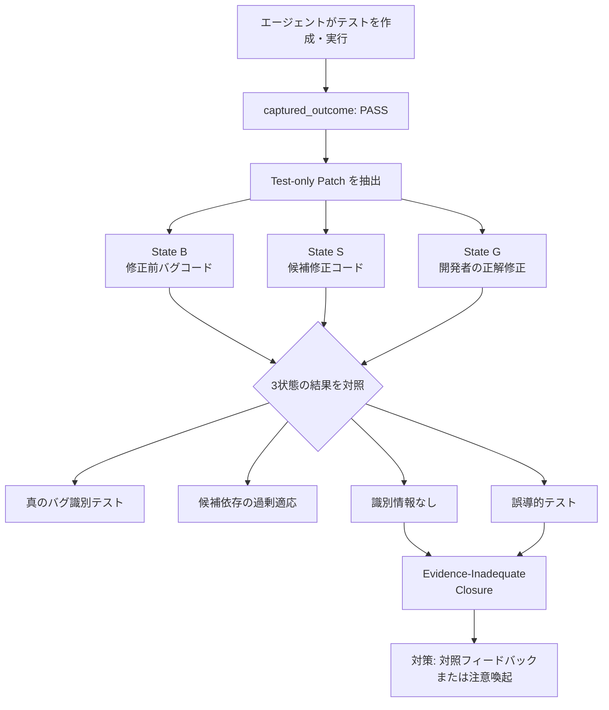

*この記事の全体像。以下、順に解説します。*

## この記事の対象と、読んで得られるもの

LLM に不具合修正を任せると、エージェントは自分でテストを書き、実行し、「通りました」と言って作業を終えます。その「通りました」を、私たちはどこまで信じてよいのでしょうか。

arXiv:2607.28871 の論文は、この問いに定量的な答えを出しました。修復エージェントが実行して合格したテストのうち **46.0% は、対象の不具合について何も識別していなかった**という結果です。

この記事では次を整理します。

- 「テストが通った」を疑うための **BSG-VA** という検証手法の考え方
- 合格テストを 4 つの証拠役割に分類した実測データ
- 「介入すれば直るのか」を検証した 3-Arm 実験の結果と、その限界
- 自分の CI・エージェント評価にすぐ持ち込める設計指針

対象読者は、AI エージェントに開発作業を任せる判断をする立場の方、および評価ハーネスや CI の証跡設計を担う方です。

## 全体像



## なぜ「テストが通った」だけでは不十分なのか

従来のエージェント評価は、テストの実行結果を Pass / Fail の 2 値で扱ってきました。しかしこの 2 値は「そのテストが何を証明したか」を持ちません。

たとえば、エージェントが修正後に次のテストを書いたとします。

```python
def test_parse_config():
    cfg = parse_config("a=1\nb=2")
    assert cfg["a"] == "1"
```

これは通ります。しかし、修正前のコードでも通るなら、不具合が治った証拠にはなりません。単に「壊れていない部分が壊れていないこと」を確認しただけです。

この区別を機械的に取るには、同じテストを **修正前のコードでも実行してみる**必要があります。それがこの論文の出発点です。

## BSG-VA: 3 つのコード状態で同じテストを再実行する

BSG-VA（buggy-state / candidate-state / gold-fix validation analysis）は、エージェントの作業軌跡からテストの変更（Test-only patch）だけを抽出し、3 つのコード状態の上でクロスカット再実行（Replay）する枠組みです。

| 状態 | 中身 | 問いたいこと |
|---|---|---|
| B (Buggy) | 修正前のバグを含むコード | このテストはバグを落とせるか |
| S (Candidate) | エージェントの候補修正 | エージェントの主張どおり通るか |
| G (Gold fix) | 開発者の正解修正 | 正しい修正を誤って弾かないか |

コード編集の差分とテストの差分を分けて扱うところが要点です。テストだけを取り出して別状態に当てるので、「テストの妥当性」と「修正の正しさ」を独立に評価できます。

対象は SWE-bench Verified と SWE-rebench から抽出した 110 タスク（64 リポジトリ）、643 ロールアウト、3,730 件のポストエディット検証イベントです。

## 実測: 合格テストの証拠役割は 4 つに割れる

Replay の結果を、B / S / G の合否の組み合わせで分類します。比較可能な 2,548 件の Positive イベントの内訳は次のとおりです。

| 証拠役割 | B | S | G | 件数 | 割合 |
|---|---|---|---|---|---|
| GOLD_ALIGNED_BUG_DISCRIMINATING | Fail | Pass | Pass | 1,007 | 39.5% |
| CANDIDATE_SPECIFIC | Fail | Pass | Fail | 370 | 14.5% |
| REGRESSION_ONLY | Pass | Pass | Pass | 1,141 | 44.8% |
| MISLEADING | Pass | Pass | Fail | 30 | 1.2% |

読み方は次のとおりです。

- **GOLD_ALIGNED_BUG_DISCRIMINATING**: 理想の証拠。バグコードで落ち、候補修正でも正解修正でも通る。不具合の本質を捉えている。
- **CANDIDATE_SPECIFIC**: バグは落とせるが、開発者の正解修正まで落としてしまう。実装の細部に過剰適合したテスト。
- **REGRESSION_ONLY**: バグコードでも通る。壊れていないことの確認であり、治った証明にはならない。
- **MISLEADING**: バグコードで通り、正解修正で落ちる。方向が逆を向いた壊れたテスト。

ここから 2 つの数字が出ます。

- 合格した検証イベントの **46.0%**（REGRESSION_ONLY 1,141 件 + MISLEADING 30 件）は、対象不具合の識別情報を含まない。
- バグコードを落とせたテスト（B-fail / S-pass、1,377 件）のうち **26.9%（370 件）** は、開発者の正解修正すら拒絶する。

後者は見落とされがちですが、実務上のリスクは大きいところです。「バグを落とせた」だけを条件にエージェント生成テストを回帰スイートへ自動採用すると、4 分の 1 強が **正しい修正を誤って拒絶する**ゲートになります。

## ロールアウト単位で見ると、23.8% が証拠ゼロで完了している

イベント単位ではなく、エージェントの 1 回の作業単位（ロールアウト）で見ます。

- ベースラインの **72.9%** は、少なくとも 1 つのバグ識別テストを含んでいた。
- 一方でベースラインの **23.8%** は、集めた合格テストがすべて REGRESSION_ONLY か MISLEADING だった。

論文はこの状態を **Evidence-Inadequate Closure（EIC）** と呼びます。エージェントは手を抜いたわけではありません。テストを書き、実行し、緑を確認し、「完了」と判断しています。それでも、バグが治った証拠は 1 つも手元にない状態です。

つまり約 4 回に 1 回、「検証したから完了です」という報告の中身が空になっている、ということになります。

## 介入すれば直るのか: BCF と Static Reminder の 3-Arm 実験

次に、エージェントへ情報を返せば行動が変わるかを検証します。110 タスク × 2 試行（660 planned cells、モデルは `gpt-5.6-sol`）の 3 条件比較です。

| 条件 | 与えるもの |
|---|---|
| Baseline | 何も返さない |
| Static Reminder | 「そのテストは妥当か」と問い直す注意喚起プロンプトのみ |
| Bug-Contrast Feedback (BCF) | 修正前コード（State B）での再実行結果をリアルタイムで返す |

結果は次のとおりです。

| 指標 | Baseline | Static Reminder | BCF | BCF - Reminder |
|---|---|---|---|---|
| EIC 発生率 | 22.4% | 19.2% | 11.4% | -7.8%p (p=0.0029) |
| バグ識別証拠の獲得率 | 73.1% | 77.2% | 84.6% | +7.4%p (p=0.011) |

BCF は Static Reminder との比較で EIC を **7.8 %ポイント削減**（95% CI [-12.9, -2.7], p=0.0029）し、バグ識別証拠の獲得率を **7.4 %ポイント向上**させました。Baseline との比較では EIC -10.5 %ポイントです。

ただし、この結果には次の留保が付きます。

- **事前設定した最小関心効果量（SESOI）10 %ポイントには届いていない**。効果の方向は確実でも、実務的な大きさには不確実性が残る。
- **公式ベンチマークの合格率（Official Resolution）は有意に上がらなかった**（+0.5 %ポイント）。検証の質は上がったが、修正そのものが上手くなったわけではない。
- **検証なしでの提出を抑制する効果もなかった**（+0.4 %ポイント）。

「証拠の質」と「修正の成功率」は別の軸である、という点がここで明確になります。

## 重い仕組みと軽い一言、どちらが効くのか

さらに要因分解（Active-Control Decomposition）が行われています。ここが実務的にはいちばん使えるところです。

- 全体効果（BCF - Baseline = -10.5 %ポイント）のうち **約 3.2 %ポイント、およそ 3 分の 1 は「B の実行結果情報」ではなく、単に注意喚起されたこと**によるものだった。
- 別モデル `gpt-5.6-terra` では、**Static Reminder 単体で EIC が 7.5 %ポイント削減**され、BCF を足しても上乗せがなかった。
- plan-execute-verify を強制する Scaffold の下では、**ベースラインの EIC 自体が 8.3% まで低下**し、フィードバック介入の伸び代がほとんど残らなかった。

一方でコストを見ると、BCF のリアルタイム Replay 基盤（State B の作成と再実行）はメディアン **11.0 秒**のオーバーヘッドを要します。

判断は次のように整理できます。

| 打ち手 | コスト | 期待効果 | 優先度 |
|---|---|---|---|
| プロンプトに検証の問い直しを 1 行足す | ほぼゼロ | モデルによっては BCF 相当 | 高 |
| plan-execute-verify の構造を強制する | 設計工数のみ | EIC を 8.3% 台まで低下 | 高 |
| 修正前コードでの Replay 基盤を作る | 実行あたり約 11 秒 + 構築工数 | 上記の上乗せ分 | 条件付き |

まず軽いプロンプト側と構造側を入れ、それでも EIC が残る場合に Replay 基盤を検討する、という順序が妥当です。

## 自分の環境に持ち込むなら

### テスト結果を 0 / 1 で記録しない

CI やエージェントの証跡で、テスト結果を Pass / Fail だけで残していると、この記事の問題は永久に観測できません。最小の一歩は、記録に「修正前コードでの結果」を 1 列足すことです。

| 記録する項目 | 例 |
|---|---|
| テスト識別子 | `tests/test_parser.py::test_parse_config` |
| 修正前（B）での結果 | Fail |
| 修正後（S）での結果 | Pass |
| 導出される証拠役割 | BUG_DISCRIMINATING |

B が Pass のまま S も Pass なら、それは回帰確認であって修正の証明ではない、と機械的に判定できます。

### 状態を再現可能に保存する

証拠役割を後から判定するには、`buggy` / `candidate` / `gold` の各コード状態と実行環境を再現できる必要があります。コミット ID だけでなく、依存関係を含めた実行環境の固定まで含めて設計します。

### エージェント生成テストの自動採用にゲートを置く

「バグを落とせた」だけを条件に回帰スイートへ取り込むと、CANDIDATE_SPECIFIC を混入させます。参照実装や別の正しい修正でも通ることを確認できない限り、自動採用は保留にするのが安全です。

### プロンプトに 1 行足す

もっとも安い改善です。テスト実行後に、次のような自問を挟みます。

```text
そのテストは、修正前のコードでも通るのではないですか。
通るなら、それはバグが治った証拠ではありません。
バグコードで確実に失敗するテストを 1 つ用意してから完了と判断してください。
```

要因分解の結果からすると、これだけで効果の 3 分の 1、モデルによっては全量をカバーできる可能性があります。

## 読み取るべき論点

この論文が本当に押しているのは、「エージェントが下手だ」という話ではありません。**評価オラクルの意味論**が空白のまま放置されてきた、という指摘です。

これまでの議論は「LLM にテストを生成させる」「SWE-bench のスコアを伸ばす」に集中していました。そこに欠けていたのは、実行結果が何を証明したのかという問いです。緑信号を数えるだけの評価は、その 46% が中身のない緑であっても気付けません。

同時に、限界も正直に読む必要があります。効果は SESOI に届かず、ベンチマーク合格率は動かず、モデルや Scaffold によって効き方が大きく変わりました。「BCF を入れれば解決」ではなく、「検証の証拠を型として扱う設計に切り替える」ことが、この結果から引き出せる実装可能な結論です。

## まとめ

- LLM 修復エージェントの合格テストのうち **46.0%** は、対象不具合の識別情報を持たない。
- ロールアウトの **23.8%** は、バグが治った証拠を 1 つも持たずに「完了」と判断していた（EIC）。
- バグを落とせたテストの **26.9%** は、開発者の正解修正すら拒絶する過剰適応であり、そのまま回帰スイートへ入れると二次災害になる。
- 対照フィードバック（BCF）は EIC を Reminder 比 7.8 %ポイント削減したが、SESOI 未達で、公式合格率は動かなかった。
- 効果の約 3 分の 1 は「注意喚起されたこと」だけで説明でき、モデルによっては注意喚起単体で同等だった。重い Replay 基盤より先に、プロンプトと plan-execute-verify 構造を試す価値がある。
- 実務の第一歩は、テスト結果を Pass / Fail の 2 値でなく「修正前でどうだったか」を含む証拠役割として記録すること。

この記事が少しでも参考になった、あるいは改善点などがあれば、ぜひリアクションやコメント、SNSでのシェアをいただけると励みになります！

## 参考リンク

- Xiaonan Xu, Wenjing Wu. *"Validation Evidence in LLM Repair Agents: How Much of What Passes Actually Tests the Bug?"* arXiv:2607.28871 (2026-07). https://arxiv.org/abs/2607.28871
- データセット (Zenodo Open Data): https://doi.org/10.5281/zenodo.21642576
