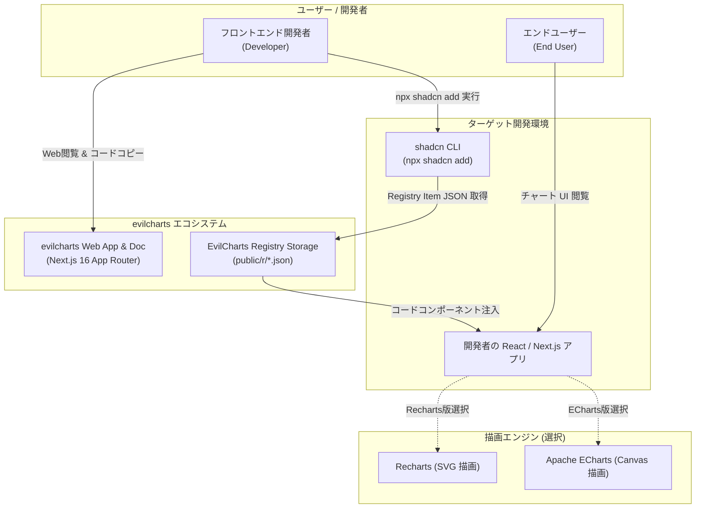
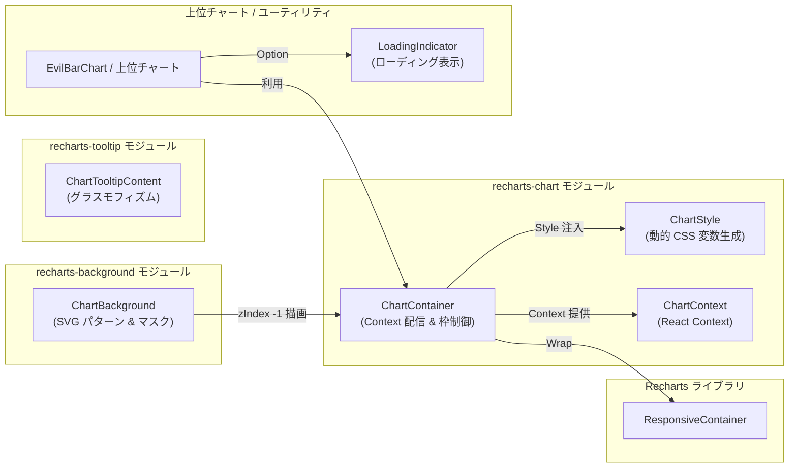
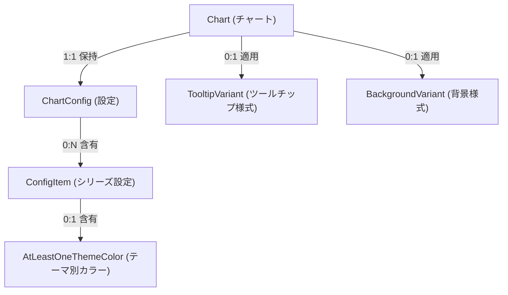

`evilcharts`（[https://github.com/legions-developer/evilcharts](https://github.com/legions-developer/evilcharts)）は、React 19 および Next.js 16（App Router）環境向けに開発された、shadcn/ui をベースに Recharts と ECharts を二つの選択可能な描画バックエンドとして提供するオープンソースのチャートコンポーネント集および Web プラットフォームです。

従来のチャートライブラリの多くが単一の npm パッケージとしてモノリシックに提供されていたのに対し、`evilcharts` は **shadcn CLI による分散型 Component Registry モデル** を全面的に採用しています。開発者はライブラリ全体を依存関係に追加することなく、必要なチャート UI や視視覚エフェクトのソースコードを CLI コマンド（`npx shadcn add`）で自分のプロジェクト（`components/evilcharts/ui/`）に直接取り込んでカスタマイズ運用することができます。

本記事では、`evilcharts` のアーキテクチャ、コンポーネント構造、CSS 変数を活かした動的カラーテーマ設計、11 種類の SVG 背景パターン描画、および Recharts を中心とした低レベルコンポーネント設計について詳しく解説します。

---

## ■特徴と主要機能

`evilcharts` には現代的な Web アプリケーション開発に応える様々な機能が組み込まれています。

- **shadcn Registry 互換の配布アーキテクチャ**
  `bun run registry:build` コマンドにより、コンポーネントのコードと依存定義が `public/r/*.json` 形式の Registry Item ペイロードとして静的生成されます。開発者は `npx shadcn add` コマンド経由でソースコードを直接取得可能です。
- **Recharts (v3.8) & ECharts (v6.1) 二大バックエンドの選択肢**
  標準的で宣言的な React チャート（Recharts: SVG描画）と、大容量データや Canvas 描画に適した ECharts の双方が独立した選択肢として提供されています。
- **動的カラーテーマ展開 (`ChartStyle` & `distributeColors`)**
  `ChartConfig` 内で定義したテーマ別カラー配列（`light`, `dark`）の要素数を揃えるため、均等分配アルゴリズム（`distributeColors`）によって短配列の既存色を複製し、`<style>` タグ経由で CSS カスタムプロパティ（`--color-${key}-${index}`）をデータキー毎にスコープ注入します。
- **リッチな視覚効果（すりガラス・SVG背景パターン）**
  `backdrop-blur-sm` を使用したグラスモフィズムツールチップ（Frosted Glass Tooltip）や Glowing エフェクト、11 種類の SVG 装飾パターン背景（`ChartBackground`）を標準提供しています。
- **スケルトン・ローディングユーティリティの提供**
  上位コンポーネント向けに `LoadingIndicator` と `getLoadingData` ユーティリティが用意されており、データフェッチ中や初期ロード中のアニメーション表示を構成可能です。

---

## ■システム構造 (C4 Model)

### システムコンテキスト図 (C4 Level 1)

`evilcharts` プラットフォームと外部システム、開発者の関係性を以下に示します。開発者はチャートごとに Recharts 版または ECharts 版のいずれかを選択して取り込みます。



### コンポーネント構造 (C4 Level 3)

`recharts-chart` モジュール周辺の内部コンポーネント構造です。



| コンポーネント名 | ファイルパス | 役割・機能 |
|---|---|---|
| `ChartContainer` | `src/registry/ui/recharts-chart.tsx` | ルート要素。`ChartConfig` のバリデーション、`<style>` タグによる CSS 変数注入、レスポンシブ枠の提供 |
| `ChartStyle` | `src/registry/ui/recharts-chart.tsx` | 各テーマ（Light/Dark）のカラー配列を DOM 上の `<style>` タグへ変換して CSS カスタムプロパティを展開 |
| `ChartTooltipContent` | `src/registry/ui/recharts-tooltip.tsx` | すりガラス効果 (`frosted-glass`) やグラデーションインジケータを備えた高機能ツールチップ |
| `ChartBackground` | `src/registry/ui/recharts-background.tsx` | 11 種類の SVG パターンとガウシアンブラーマスクを組み合わせてチャート背景を描画 |
| `LoadingIndicator` | `src/registry/ui/recharts-chart.tsx` | 上位チャートがオーバーレイ表示用に使用するローディングインジケータユーティリティ |

---

## ■データモデル設計

### 概念モデル

`evilcharts` 内で扱われる主要データ構造の関係性です。



※ `ChartConfig` は空オブジェクトを含む任意のキー集合 (`0..N`) であり、`ConfigItem` における `label`, `icon`, `colors` もすべてオプショナル (`0..1`) です。

### TypeScript インターフェース定義

`evilcharts` で利用される型定義コードの抜粋です（※内部型は説明用）。

```typescript
// 内部型定義（説明用）
type ThemeKey = "light" | "dark";

type ThemeColorsBase = {
  [K in ThemeKey]?: string[];
};

type AtLeastOneThemeColor = {
  [K in ThemeKey]: Required<Pick<ThemeColorsBase, K>> & Partial<Omit<ThemeColorsBase, K>>;
}[ThemeKey];

// 公開型定義
export type ChartConfig = Record<
  string,
  {
    label?: React.ReactNode;
    icon?: React.ComponentType;
    colors?: AtLeastOneThemeColor;
  }
>;

// 11 種類の背景パターン識別名
export type BackgroundVariant =
  | "dots"
  | "grid"
  | "cross-hatch"
  | "diagonal-lines"
  | "plus"
  | "falling-triangles"
  | "4-pointed-star"
  | "tiny-checkers"
  | "overlapping-circles"
  | "wiggle-lines"
  | "bubbles";

// ツールチップの表現バリエーション
export type TooltipVariant = "default" | "frosted-glass";
```

---

## ■導入と実装コード例

### 1. shadcn CLI による導入

標準パッケージ名（例: `@evilcharts/recharts-bar-chart`）または個別 JSON URL を指定して導入します。

```bash
# 公式パッケージ指定による導入例
npx shadcn@latest add @evilcharts/recharts-bar-chart

# 個別 JSON URL を直接指定して低レベルコンポーネントを取り込む場合
npx shadcn@latest add https://evilcharts.com/r/recharts-chart.json
npx shadcn@latest add https://evilcharts.com/r/recharts-tooltip.json
npx shadcn@latest add https://evilcharts.com/r/recharts-background.json
```

### 2. 実際のコンポーネントコード例

`BarChart` に対し、すりガラス風ツールチップ（`frosted-glass`）と 4-pointed-star 背景パターンを組み合わせた実装例です。

```tsx
"use client";

import React from "react";
import { Bar, BarChart, CartesianGrid, XAxis, YAxis } from "recharts";
import { ChartContainer, ChartConfig } from "@/components/evilcharts/ui/recharts-chart";
import { ChartTooltip, ChartTooltipContent } from "@/components/evilcharts/ui/recharts-tooltip";
import { ChartBackground } from "@/components/evilcharts/ui/recharts-background";

// 1. チャート設定とテーマカラー
const chartConfig = {
  desktop: {
    label: "Desktop Users",
    colors: {
      light: ["#3b82f6", "#60a5fa"],
      dark: ["#2563eb", "#3b82f6"],
    },
  },
  mobile: {
    label: "Mobile Users",
    colors: {
      light: ["#f43f5e"],
      dark: ["#e11d48"],
    },
  },
} satisfies ChartConfig;

const chartData = [
  { month: "Jan", desktop: 186, mobile: 80 },
  { month: "Feb", desktop: 305, mobile: 200 },
  { month: "Mar", desktop: 237, mobile: 120 },
  { month: "Apr", desktop: 73, mobile: 190 },
  { month: "May", desktop: 209, mobile: 130 },
  { month: "Jun", desktop: 214, mobile: 140 },
];

export function MyEvilBarChart() {
  return (
    <div className="w-full max-w-2xl p-4 rounded-xl border bg-card text-card-foreground shadow-sm">
      <h3 className="text-lg font-semibold mb-4">Monthly Active Users</h3>
      
      {/* 2. ChartContainer の配置 */}
      <ChartContainer config={chartConfig} className="h-[300px]">
        <BarChart data={chartData}>
          {/* 背景に SVG 星柄パターンを挿入 */}
          <ChartBackground variant="4-pointed-star" />
          
          <CartesianGrid strokeDasharray="3 3" className="stroke-border/40" />
          <XAxis dataKey="month" tickLine={false} axisLine={false} />
          <YAxis tickLine={false} axisLine={false} />
          
          {/* すりガラス風ツールチップ */}
          <ChartTooltip
            content={<ChartTooltipContent variant="frosted-glass" roundness="xl" />}
          />
          
          {/* CSS 変数 --color-desktop-0 を適用 */}
          <Bar dataKey="desktop" fill="var(--color-desktop-0)" radius={[4, 4, 0, 0]} />
          <Bar dataKey="mobile" fill="var(--color-mobile-0)" radius={[4, 4, 0, 0]} />
        </BarChart>
      </ChartContainer>
    </div>
  );
}
```

---

## ■運用上の注意点とトラブルシューティング

### 1. SSR と Hydration / レスポンシブ境界の扱い
Recharts コンポーネントはクライアントサイドでのみ安全に動作します。
- 生の Recharts 部品を直接組み合わせて独自のラッパーを作成する場合は、そのファイル冒頭に `"use client";` を明記してください。なお、`EvilBarChart` などあらかじめ境界が定義されたコンポーネントは Server Component から直接呼ぶことも可能です。
- `ChartContainer` には `initialDimension={{ width: 320, height: 200 }}` がプリセットされており、初回のレイアウトシフト（CLS）を防ぐ工夫がなされています。

### 2. カラー分配処理（`distributeColors`）
`ChartConfig` 内の同一データキーについて `light` と `dark` の配列長が異なる場合、`distributeColors` アルゴリズムが短い配列要素を複製・拡張し、両テーマ間で同一数の配色スロット（`--color-${key}-0`〜`--color-${key}-${n}`）を安全に揃えます。

### 3. トラブルシューティング一覧

| 現象 | 主な原因 | 対処方法 |
|---|---|---|
| `Invalid chart config...` エラーが発生する | `colors` オブジェクトに `light` や `dark` のキーが存在しない | `colors: { light: ["#3b82f6"] }` のように有効なテーマキーを設定する |
| Tooltip が画面左上 (0,0) からアニメーションする | Recharts 初期ロード時にマウント位置が未確定のまま描画される | `recharts-tooltip.tsx` 内で Guard (`if (!active) return <span className="p-4" />`) を通す |
| チャートの幅・高さが 0 になる | リサイズ領域が非ゼロ寸法を持たない | 通常 `ChartContainer` には `aspect-video` が適用されます。上書き時や `footer` 使用時は `ChartContainer` 自身に `h-[300px]` などを設定してください |

---

## まとめ

`evilcharts` は、shadcn CLI の分散配信エコシステムと Recharts / ECharts を組み合わた、非常に現代的で洗練されたチャートライブラリです。モノリシックなライブラリに縛られず、コンポーネント単位でコードを取り込み、Tailwind CSS v4 や CSS 変数を活かした自由度の高いスタイリングと表現力を実現できます。

React 19 / Next.js 16 環境でリッチでインタラクティブなデータビジュアライゼーションを構築する際の有力な選択肢となるでしょう。

---

## 参考リンク

- **evilcharts GitHub リポジトリ**: [https://github.com/legions-developer/evilcharts](https://github.com/legions-developer/evilcharts)
- **evilcharts Web サイト**: [https://evilcharts.com](https://evilcharts.com)
- **Recharts 公式**: [https://recharts.org](https://recharts.org)
- **Apache ECharts 公式**: [https://echarts.apache.org](https://echarts.apache.org)
- **shadcn/ui Registry 仕様**: [https://ui.shadcn.com/docs/registry](https://ui.shadcn.com/docs/registry)
