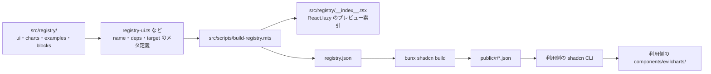
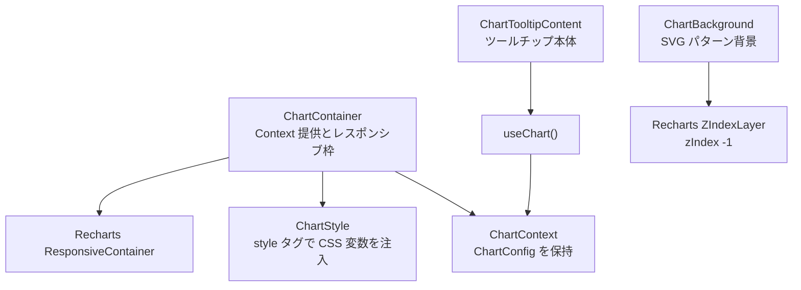
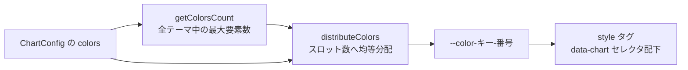

[evilcharts](https://github.com/legions-developer/evilcharts) は、React 向けのチャートコンポーネントを **shadcn registry 経由でソースコードごと配る** OSS です。npm パッケージとして依存に加えるのではなく、CLI で自分のリポジトリに `.tsx` をコピーして使います。

この記事では、evilcharts の配布の仕組み、設定モデル（`ChartConfig` と CSS 変数）、実際の導入・利用手順、そしてコピー型ゆえの運用上の注意点を、リポジトリの現行実装と照合して整理します。読み終えると「自分のプロジェクトに入れるべきか」「入れたあと何を自分で面倒みることになるか」を判断できます。

なお evilcharts は Recharts 系と ECharts 系の 2 系統を持ちますが、内部構造・型・コード例は **Recharts 系を対象**に説明します。ECharts 系については、両系統の関係と設計上の含意だけを扱います。

検証時点は 2026-07-29、対象は `main` ブランチ（最終 push 2026-07-28）です。ライセンスは MIT、GitHub スター数は約 2,700 です。

主要な依存バージョンは `package.json` で次のとおり固定されています。

| 依存 | バージョン |
|---|---|
| react / react-dom | 19.2.3 |
| next | ^16.2.11 |
| recharts | 3.8.0 |
| echarts | ^6.1.0 |
| motion | ^12.23.26 |
| shadcn | ^4.14.0 |

## 特徴

- **配布単位がソースコード**: `npx shadcn add` で `.tsx` が利用側リポジトリに書き込まれます。取り込んだあとは自分のコードなので、自由に改変できます。
- **Recharts 系と ECharts 系の 2 系統**: SVG 描画の Recharts 系と、Canvas 描画の ECharts 系が並列に用意されています。両者は同じ設定契約を持ちますが、コードは共有していません。
- **compound component の API**: `<EvilBarChart>` の下に `<EvilBarChart.Bar />`、`<EvilBarChart.Tooltip />` のように、必要な部品だけを合成します。
- **設定は 1 つの `ChartConfig` に集約**: ライト/ダークのテーマ別カラーをここで宣言すると、`--color-<キー>-<番号>` という CSS 変数として DOM に注入されます。
- **装飾のバリエーションが組み込み**: バーの塗り（`hatched` / `duotone` / `gradient` / `stripped` など）、すりガラス調ツールチップ、11 種の SVG 背景パターン、ローディングスケルトンが最初から入っています。

## 構造

### リポジトリから利用側リポジトリまで

evilcharts の本体は「コンポーネント群」と「それを配信するビルドパイプライン」の 2 つでできています。



| 要素 | 役割 |
|---|---|
| `src/registry/ui/` | 土台コンポーネント。`recharts-chart` / `recharts-tooltip` / `recharts-background` など 11 ファイル |
| `src/registry/charts/` | 完成品チャート。`recharts-bar-chart` など。`ui/` に依存 |
| `src/registry/registry-*.ts` | 各アイテムの名前・npm 依存・registry 依存・配置先パスのメタ定義 |
| `build-registry.mts` | 上記メタから `__index__.tsx` と `registry.json` を生成し `shadcn build` を呼ぶ |
| `public/r/*.json` | 配信される registry item。`https://evilcharts.com/r/<name>.json` で公開 |

ビルドは `bun run registry:fresh`（`registry:clean` + `registry:build`）で走ります。`build-registry.mts` の処理は次の 3 段です。

1. `src/registry/__index__.tsx` を生成する。ドキュメントサイトのプレビュー用に、各コンポーネントを `React.lazy` で動的 import する索引
2. `registry.json` を生成し `public/r/` へコピーする
3. `bunx --bun shadcn build registry.json --output public/r` を実行し、アイテムごとの `<name>.json` を出力する

配信される JSON は、たとえば `recharts-chart` なら次の形です（`files[].content` は省略）。

```json
{
  "$schema": "https://ui.shadcn.com/schema/registry-item.json",
  "name": "recharts-chart",
  "type": "registry:component",
  "dependencies": ["recharts"],
  "files": [
    {
      "path": "src/registry/ui/recharts-chart.tsx",
      "type": "registry:component",
      "target": "components/evilcharts/ui/recharts-chart.tsx"
    }
  ]
}
```

ここで重要なのは `target` です。**取り込み先は `components/ui/` ではなく `components/evilcharts/` 配下**になります。土台は `components/evilcharts/ui/`、完成品チャートは `components/evilcharts/charts/` です。既存の shadcn/ui コンポーネントとはディレクトリが分かれるため、名前の衝突は起きません。

### Recharts 系コンポーネントの内部

`recharts-chart.tsx` が土台で、ここから設定とスタイルが配られます。



| 名前 | ファイル | 役割 |
|---|---|---|
| `ChartContainer` | `recharts-chart.tsx` | `ChartConfig` の実行時検証、Context 提供、`ResponsiveContainer` のラップ |
| `ChartStyle` | `recharts-chart.tsx` | テーマ別カラーを CSS 変数へ展開し `<style>` として出力 |
| `LoadingIndicator` / `getLoadingData` | `recharts-chart.tsx` | ローディング表示とスケルトン用ダミーデータ。個別に export され、上位のチャートが組み込む |
| `ChartTooltipContent` | `recharts-tooltip.tsx` | `useChart()` で config を読み、ラベルとインジケータを描画 |
| `ChartBackground` | `recharts-background.tsx` | 11 種の `<pattern>` を `PATTERN_MAP` から引き、ガウシアンブラーのマスクで縁をぼかす |

背景の重ね順は `ZIndexLayer`（`zIndex={-1}`）で制御しています。これは evilcharts 独自の部品ではなく、**Recharts 3.5.0 で追加された export** です（3.4.0 の型定義には存在しません）。`recharts-background` を使うなら Recharts 3.5.0 以上が必要になります。

ECharts 系（`echarts-chart.tsx` ほか）は `ChartConfig` や `distributeColors` といった同名・同契約のユーティリティを持ちますが、Recharts 系からは何も import していません。ソースにも「no recharts ui imports」と明記された意図的な複製です。registry から片方だけを取り込んでも動くようにするための設計で、裏を返すと **同じ概念の実装が 2 箇所に存在する**ことになります。

## データ

### ChartConfig の型

設定はデータキー（`desktop`、`mobile` など）をキーにしたマップです。

```typescript
// THEMES = { light: "", dark: ".dark" } の keyof
type ThemeKey = "light" | "dark";

type ThemeColorsBase = {
  [K in ThemeKey]?: string[];
};

// light / dark のうち最低 1 つを必須にする
type AtLeastOneThemeColor = {
  [K in ThemeKey]: Required<Pick<ThemeColorsBase, K>> & Partial<Omit<ThemeColorsBase, K>>;
}[ThemeKey];

export type ChartConfig = Record<
  string,
  {
    label?: React.ReactNode;
    icon?: React.ComponentType;
    colors?: AtLeastOneThemeColor;
  }
>;
```

`colors` が **配列**である点がポイントです。1 シリーズに複数色を渡せて、グラデーションや複数スロットの塗りに使われます。

型だけでは防げないケース（`colors: {}` や無効なキーだけを渡す場合）に備えて、`ChartContainer` は実行時にも検証します。該当すると次の例外が投げられます。

```text
[EvilCharts] Invalid chart config for "desktop": colors object must have at least one theme key (light, dark). Received empty object or invalid keys.
```

### 色が CSS 変数になるまで

`ChartStyle` は config から `[data-chart=<id>]` セレクタ配下の CSS 変数を組み立てます。



スロット数はテーマをまたいだ最大色数（最低 1）です。ライトに 3 色、ダークに 1 色を指定した場合、スロット数は 3 になり、ダーク側の 1 色が 3 スロットへ複製されます。分配規則は「余りは後ろの色に配る」です。

| 入力色数 | スロット数 | 結果 |
|---|---|---|
| 2 | 4 | `[c0, c0, c1, c1]` |
| 3 | 4 | `[c0, c1, c2, c2]` |
| 4 | 2 | `[c0, c1]`。先頭から切り詰め |

生成される CSS は、ライトが `[data-chart=chart-xxx]`、ダークが `.dark [data-chart=chart-xxx]` の 2 ブロックです。`next-themes` などで `<html class="dark">` を切り替える構成にそのまま乗ります。

ツールチップのインジケータも同じ変数を読みます。色が 1 つなら単色、複数なら `linear-gradient(to right, var(--color-desktop-0) 0%, var(--color-desktop-1) 100%)` のように等間隔のグラデーションになります。

## 導入方法

Next.js + shadcn/ui 初期化済みのプロジェクトに取り込む手順です。

### 1. Recharts を入れる

```bash
npm install recharts
```

registry item の `dependencies` にも `recharts` が入っているため CLI が自動で入れますが、**バージョンは固定されません**。`recharts-background` を使うなら 3.5.0 以上を自分で担保してください。

### 2. チャートを追加する

公式のインストール手順は `@evilcharts/...` という namespace 形式です。

```bash
npx shadcn@latest add @evilcharts/recharts-bar-chart
```

この namespace は shadcn CLI の公開 registry index に登録済みで、**利用側での設定は不要**です。空のディレクトリでも `npx shadcn@latest view @evilcharts/recharts-chart` が JSON を返すことを確認しました。未登録の namespace を指定した場合は `Unknown registry "@..."` で失敗します。

URL を固定したい場合や、namespace 非対応の古い CLI を使う場合は、`components.json` に明示登録するか、registry JSON の URL を直接渡します。

```json
{
  "$schema": "https://ui.shadcn.com/schema.json",
  "registries": {
    "@evilcharts": "https://evilcharts.com/r/{name}.json"
  }
}
```

```bash
npx shadcn@latest add https://evilcharts.com/r/recharts-chart.json
```

`recharts-bar-chart` は registry 依存として `recharts-chart` / `recharts-tooltip` / `recharts-legend` / `recharts-brush` / `recharts-background` を宣言しているため、土台一式がまとめて入ります。生成されるのは次のファイル群です。

```text
components/evilcharts/charts/recharts-bar-chart.tsx
components/evilcharts/ui/recharts-chart.tsx
components/evilcharts/ui/recharts-tooltip.tsx
components/evilcharts/ui/recharts-legend.tsx
components/evilcharts/ui/recharts-brush.tsx
components/evilcharts/ui/recharts-background.tsx
```

チャート種別は `recharts-` / `echarts-` の接頭辞つきで、`area` / `line` / `bar` / `composed` / `pie` / `radial` / `radar` / `sankey` の 8 種類が両系統に用意されています。

## 利用方法

リポジトリ同梱の例（`src/registry/examples/recharts/ex-bar-chart.tsx`）を、取り込み後の import パスに置き換えたものです。

```tsx
"use client";

import { EvilBarChart } from "@/components/evilcharts/charts/recharts-bar-chart";
import { type ChartConfig } from "@/components/evilcharts/ui/recharts-chart";

const data = [
  { month: "January", desktop: 342, mobile: 184 },
  { month: "February", desktop: 876, mobile: 491 },
  { month: "March", desktop: 512, mobile: 290 },
  { month: "April", desktop: 629, mobile: 391 },
  { month: "May", desktop: 458, mobile: 309 },
  { month: "June", desktop: 781, mobile: 449 },
];

const chartConfig = {
  desktop: {
    label: "Desktop",
    colors: {
      light: ["#047857"],
      dark: ["#10b981"],
    },
  },
  mobile: {
    label: "Mobile",
    colors: {
      light: ["#be123c"],
      dark: ["#f43f5e"],
    },
  },
} satisfies ChartConfig;

export function ExampleBarChart() {
  return (
    <EvilBarChart
      data={data}
      config={chartConfig}
      className="h-full w-full p-4"
      xDataKey="month"
    >
      <EvilBarChart.Grid />
      <EvilBarChart.XAxis dataKey="month" tickFormatter={(value) => value.substring(0, 3)} />
      <EvilBarChart.Brush formatLabel={(value) => String(value).substring(0, 3)} />
      <EvilBarChart.Legend isClickable />
      <EvilBarChart.Tooltip />
      <EvilBarChart.Bar dataKey="desktop" variant="default" isClickable />
      <EvilBarChart.Bar dataKey="mobile" variant="default" isClickable />
    </EvilBarChart>
  );
}
```

Recharts の `<BarChart>` を直接書くのではなく、`EvilBarChart` のルートに部品をぶら下げる形です。部品はルートの静的メンバー（`EvilBarChart.Bar` など）なので、複数種類のチャートを 1 ファイルに置いても import 名が衝突しません。

`config` のキーはデータ行の型と突き合わされます。`data` に存在しないキーを `config` に書くと型エラーになるため、シリーズ名のタイポはコンパイル時に落とせます。

主なルート props は次のとおりです。

| props | 既定値 | 用途 |
|---|---|---|
| `stackType` | `"default"` | `"stacked"` / `"percent"` で積み上げ・100% 積み上げ |
| `layout` | `"vertical"` | `"horizontal"` で横棒 |
| `barRadius` | `2` | 各バーの既定角丸 |
| `animationType` | `"left-to-right"` | 出現順。`"none"` / `"center-out"` / `"edges-in"` など |
| `backgroundVariant` | なし | 背景パターン。`"dots"` `"grid"` ほか計 11 種 |
| `isLoading` | `false` | ローディングスケルトンの表示 |
| `xDataKey` | なし | `<Brush />` を使うときの X 軸キー |

バー側は `variant`（`default` / `hatched` / `duotone` / `duotone-reverse` / `gradient` / `stripped`）と `glowing`、`isClickable` を持ちます。ツールチップは `variant="frosted-glass"` ですりガラス調（`bg-background/70 backdrop-blur-sm`）になり、`roundness` は `sm` / `md` / `lg` / `xl` から選べます。

## 運用

### Client Component 境界

`recharts-chart.tsx`、`recharts-background.tsx`、および各チャート本体は先頭に `"use client"` を持ちます。したがって Server Component から import すること自体は可能です。ただし上の例のように `tickFormatter` などの関数を props で渡す場合、渡す側も Client Component である必要があります。

一方 `recharts-tooltip.tsx` には `"use client"` が付いていません。チャート経由で使う前提の作りなので、単体で切り出して Server Component から読むことは想定されていません。

### レイアウトと初期サイズ

`ChartContainer` は `ResponsiveContainer` に `initialDimension = { width: 320, height: 200 }` を渡します。初回描画で 0px にならないための保険であり、**最終的な高さは利用側が決める**必要があります。

`ChartContainer` に渡した `className` は外側の `div` にそのまま適用されるため、高さは `className="h-[300px]"` のように自分自身へ指定できます。`footer` を渡さない場合は既定で `aspect-video` が付くので、アスペクト比に任せる選択もあります。どちらも使わないなら、レイアウトを確定させる祖先要素側で高さを決めてください。

### アニメーションのコスト

evilcharts は Recharts 側のバーアニメーションを常時無効化し、代わりに motion による「ベースラインから伸びる」演出を自前で描いています。これはフレームごとの描画になるため静的チャートより重く、ソースコードにも注意書きがあります。

- 大量データや低スペック端末では `animationType="none"` で無効化する
- OS の「視差効果を減らす」設定が有効な端末では、自動的に `none` 相当へフォールバックする

### 更新の取り込み

コピー型配布の裏返しとして、**アップストリームの修正は自動で降ってきません**。再度 `npx shadcn add` すると取り込み済みファイルが上書きされるため、ローカルで手を入れている場合は自分で差分をマージすることになります。改変するなら、取り込んだファイルを直接編集するのではなく、ラッパーを一段かぶせて差分を局所化しておくと更新が楽になります。

前述のとおり Recharts 系と ECharts 系はコードを共有していません。片系統で見つけた不具合の修正が、もう片方に自動で効くこともありません。

## 注意点

導入時に踏みやすい箇所をまとめます。

| 症状 | 原因 | 対処 |
|---|---|---|
| `@evilcharts/...` が解決できない | shadcn CLI が古く namespace 未対応 | CLI を `shadcn@latest` にする。それでも解決しなければ `components.json` に `registries` を書くか、registry JSON の URL を直接指定する |
| 取り込んだファイルが見つからない | 配置先が `components/ui/` ではない | `components/evilcharts/ui/` と `components/evilcharts/charts/` を見る |
| `[EvilCharts] Invalid chart config...` で落ちる | `colors` に `light` / `dark` のいずれも無い | 最低 1 テーマ分の色配列を渡す |
| 背景パターンでビルドが通らない | `ZIndexLayer` は Recharts 3.5.0 以降の export | Recharts を 3.5.0 以上に上げる |
| チャートが潰れる、親をはみ出す | 高さの決定が利用側任せ | `ChartContainer` に `className="h-[300px]"` を与えるか、既定の `aspect-video` に任せる |
| 描画が重い | 自前アニメーションがフレームごとに走る | `animationType="none"` にする、データ点数を減らす |

## まとめ

- evilcharts は npm パッケージではなく **shadcn registry でソースを配る**チャート集で、取り込み先は `components/evilcharts/` 配下です。
- `@evilcharts` は shadcn CLI の公開 index に登録済みなので、`npx shadcn@latest add @evilcharts/recharts-bar-chart` がそのまま通ります。
- 設定は `ChartConfig` に集約され、テーマ別の色配列が `--color-<キー>-<番号>` の CSS 変数へ展開されます。色数がスロット数に足りなければ自動で分配されます。
- API は `<EvilBarChart>` と静的メンバーによる compound 形式で、必要な部品だけを合成します。
- コピー型なので、更新の取り込みと改変のマージは自分の責任になります。Recharts 系と ECharts 系が独立実装である点も含め、「ライブラリを使う」より「テンプレートをもらう」感覚が近いです。

デザイン込みのチャートを短時間で立ち上げたい、かつ後から自由に手を入れたい場合に噛み合います。逆に、依存を薄く保ってバージョン管理をパッケージマネージャに任せたい場合は、方向性が合いません。

## 参考リンク

- [evilcharts リポジトリ（legions-developer/evilcharts）](https://github.com/legions-developer/evilcharts)
- [evilcharts 公式サイト](https://evilcharts.com)
- [evilcharts インストール手順（Recharts）](https://evilcharts.com/docs/recharts/installation)
- [shadcn/ui Registry ドキュメント](https://ui.shadcn.com/docs/registry)
- [shadcn/ui Registry Namespaces](https://ui.shadcn.com/docs/registry/namespace)
- [Recharts 公式サイト](https://recharts.org)
- [Apache ECharts 公式サイト](https://echarts.apache.org)
