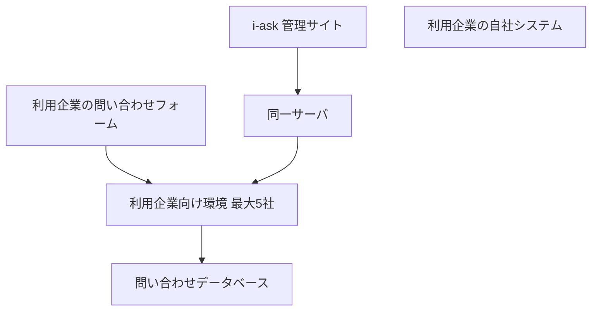

2026年10月2日夜から10月3日朝にかけて、株式会社スカラコミュニケーションズのクラウド型FAQシステム「i-ask」で、管理サイトへの不正ログインと、不正プログラムの設置があった。親会社の株式会社スカラは2026年10月6日、同一サーバ上の利用企業向け環境（最大5社）の問い合わせ情報が、外部に漏えいした可能性がある、と公表した。対象の上限は、問い合わせ単位の延べで最大713,126件である。2026年10月7日までに、大和証券、シチズン時計、損害保険ジャパン、東武鉄道の4社が、自社の問い合わせで同社サービスを利用していることを公表した。

件数と範囲は、ベンダーと利用企業の公表を正とする。日経クロステック2026年10月7日の記事は各社の公表をまとめたものであり、件数の定義は一次の公表に従う。この記事は、何が起きたかを先に置き、件数の読み方をその後に整理し、発注側が委託範囲を確認する項目を最後に示す。

*この記事の全体像。以下、順に解説します。*

## i-askとは

[i-ask](https://www.scala-com.jp/i-ask/) は、よくある質問の作成と管理を行うクラウド型FAQシステムである。公開側のFAQと、管理サイトがある。運営は株式会社スカラコミュニケーションズである。

[親会社のIR](https://scalagrp.jp/pdf/ir/news/2026_IRnews1006.pdf)（2026年10月6日）が書く経緯は、2026年10月2日20時30分頃から2026年10月3日8時頃までである。第三者が管理サイトに不正ログインし、スカラコミュニケーションズが管理するサーバ上に不正プログラムを設置した。同じ文書は、取得の可能性を、同一サーバ上の利用企業向け環境（最大5社）のデータベースに置いている。利用企業名は、この公表では示していない。[提供元の告知](https://scala-com.jp/news/2026/10-1/)も、同じ上限と定義を書いている。

件数は最大713,126件である。問い合わせ単位の延べ件数であり、同一顧客の複数回を含む。人数は名寄せ中である。項目は、氏名、メールアドレス、問い合わせ内容等である。企業により異なる。

検知は、2026年10月3日朝のデータベース監視アラートである。同日8時頃に遮断し、利用企業へ同日中に第一報を出している。

問い合わせ情報は、利用企業向け環境のデータベースにある。管理サイトと、その利用企業向け環境は、同一サーバ上にある。利用企業の自社システムは、別の箱である。「最大5社」は、親会社のIRが同一サーバ上の利用企業向け環境について書いた上限である。

## 利用4社の公表

ベンダー自身のページが書く時刻は、20時30分頃から8時頃である。4社が委託先の説明として書く時刻は、2026年10月2日20時33分頃から2026年10月3日8時1分頃である。どちらも「頃」付きの別表記である。

公表日は、大和証券が2026年10月5日、シチズン時計が2026年10月6日、損害保険ジャパンと東武鉄道が2026年10月7日である。

| 公表者 | 公表日 | 対象の言い方 | 自社システム |
|---|---|---|---|
| 大和証券 | 2026-10-05 | 約11万名の氏名、メールアドレス、口座番号等。個人を特定できない問い合わせを合算すると約22万件。本件情報だけでは証券口座へのアクセスや取引はできない、と書く | 確認されていない |
| シチズン時計 | 2026-10-06 | シチズン、ブローバ、フレデリック・コンスタントの各ブランドWebの問い合わせフォーム。約10万名分の氏名、住所、電話番号、メールアドレス等。本文に口座やカードを書いていた場合は、それも対象になり得る、と書く | 公式EC、MY CITIZEN、オーナーズクラブ、生産系、社内網へのアクセスは確認されていない |
| 損害保険ジャパン | 2026-10-07 | SMILING ROADのFAQと問い合わせ。延べ約6万件。項目は氏名、電話、住所、メール、勤務先、ドライバーID、運転アラート、ドラレコのシリアル番号等、申込番号、件名、本文。金融機関の口座、クレジットカード、マイナンバーカード情報は含まれない、と明記 | 確認されていない |
| 東武鉄道 | 2026-10-07 | お客さまセンターの「お問い合わせ」フォームで同社サービスを利用。閲覧および取得の形跡は確認されていない。件数の公表なし | 当社が管理するシステムへの不正アクセスは確認されていない |

シチズン時計の本文に、サービス名「i-ask」は無い。委託先名と時刻の一致で、同一事案と同定する。同社は、本件システムを他システムへ移行中であり、新規問い合わせには使っていない、と書く。2026年10月中旬に利用を終え、終了後に保管する個人情報を全て削除する予定である。

大和証券と損害保険ジャパンは、委託先の点検と、管理強化策および実施時期を決める、と書く。

一次の所在は次のとおりである。

- 大和証券（2026年10月5日、TDnetミラー）: [PDF](https://www.nikkei.com/markets/ir/irftp/data/tdnr/tdnetg3/20261005/g5y22r/140120261005545891.pdf)。表紙は大和証券株式会社である。
- シチズン時計（2026年10月6日）: [公式リリース](https://www.citizen.co.jp/release/news/detail/2026/20261006.html)
- 損害保険ジャパン（2026年10月7日）: [PDF](https://www.sompo-japan.co.jp/-/media/SJNK/files/news/2026/20261007_1.pdf)
- 東武鉄道（2026年10月7日）: [PDF](https://www.tobu.co.jp/cms-pdf/news/20261007153424wpo2m-MJPLTJzWJHnUDkVw.pdf)

## 注意点

713,126件は、4社の合計でも、確定した漏えい人数でもない。親会社のIRと提供元サイトは、問い合わせ単位の延べ、名寄せ前、最大5社、漏えいした可能性、と書いている。2026年10月8日時点で、5社目の社名は公表されていない。

東武鉄道の一次（2026年10月7日）は、「現時点の調査では自社に関する情報の閲覧および取得の形跡は確認されていない」、と書く。件数の公表はない。利用者であることの公表と、取得なしの報告は、同じ文書に共存する。

単位は会社ごとに違う。足せない。

| 公表 | 一次の言い方 | 単位 |
|---|---|---|
| ベンダー上限 | 最大713,126件 | 問い合わせの延べ。最大5社。名寄せ前 |
| 大和証券 | 約11万名。特定できない分を足して約22万件 | 名と件が併記 |
| シチズン時計 | 約10万名分 | 名。件ではない |
| 損害保険ジャパン | 延べ約6万件 | 問い合わせの延べ。同一顧客の複数回を含む |
| 東武鉄道 | 件数の記載なし | 取得の形跡は確認されていない |

大和証券の約22万件と、損害保険ジャパンの延べ約6万件を足すと、約28万件である。シチズン時計の「名」を件と同一視しても約38万であり、713,126件に届かない。差の内訳は一次に無い。

公表済みの記事には、この単位を落としている例がある。

- [INTERNET Watch 2026年10月7日](https://internet.watch.impress.co.jp/docs/news/2146225.html) は「合計最大71万3126件」と書く。シチズン時計を「約10万件」とする。追記の損害保険ジャパンは「最大で約6万件」であり、一次の「延べ」が落ちている。
- [日経電子版 2026年10月5日](https://www.nikkei.com/article/DGXZQOUB053ZF0V01C26A0000000/) のリードは、大和証券について「個人情報が22万件漏洩したと発表」とする。一次は「漏洩した可能性」である。本文側の「約11万件」と「約11万件」は、大和証券の一次の「約11万名」と、特定できない分を足した「約22万件」の言い換えである。残りを約11万件とは、大和証券の一次は書いていない。
- [日経電子版 2026年10月7日](https://www.nikkei.com/article/DGXZQOUB0761D0X01C26A0000000/) は、損害保険ジャパンを約6万件とし、一次の「延べ」が落ちている。
- 起点の [日経クロステック 2026年10月7日](https://xtech.nikkei.com/atcl/nxt/news/24/03417/) は、713,126件を延べ、シチズン時計を約10万人分と書いている。同じ本文の損害保険ジャパンは「問い合わせ情報約6万件」であり、一次の「延べ」は落ちている。

次の読みは、一次からは言えない。

- テナント分離が無かった、と断定すること。提供元は、調査結果に基づき「環境間の分離」と「多要素認証の導入等」を今後講じる、と書く。将来形である。親会社のPDFには、この2語は無い。同一サーバ上に最大5社の環境がある、までは一次の事実である。
- 不正プログラムの設置経路を、アップロードされたファイルの実行と断定すること。両一次にある「アップロードされたファイルをプログラムとして実行できない設定変更」は、実施済み対策の一つである。経緯の段落は、管理サイトへの不正ログインと、不正プログラムの設置までである。
- 4社すべてで取得が確証された、と書くこと。ベンダー自身の公開文は「可能性」である。大和証券だけが、委託先から「不正アクセスおよび不正取得の形跡が確認された」と報告を受けた、と書く。同じ文書は「漏洩した可能性」と「調査継続」も書く。シチズン時計と損害保険ジャパンは可能性である。東武鉄道は形跡なしである。フォレンジック完了とは、どの一次も書いていない。
- 再委託先の社名。4社とベンダーの一次に、スカラコミュニケーションズより先の社名は無い。「再委託は無かった」とも書いていない。親会社の株式会社スカラは、連結子会社の事故として開示している。
- 本件のCVE番号。一次に番号は無い。2026年10月8日時点で、本件に番号を付ける公開記事は見つかっていない。
- 大和証券の契約期間。[朝日新聞 2026年10月5日](https://www.asahi.com/articles/ASVB535NDVB5ULFA01RM.html) は、2013年4月から2025年12月まで請け負った、と書く。大和証券の一次PDFは「利用している」と現在形で、開始日も終了日も書かない。契約終了後もデータが残っていた、とは一次からは言えない。[朝日グループのやさしいニュース](https://yasashii.asahi.com/articles/article_0015095.html) は同じ期間を繰り返すだけで、独立した一次ではない。

時刻の2表記は、どちらも「頃」付きである。矛盾とは読まない。

2026年10月8日時点で、一次に無いものは次である。

- 5社目の社名。ベンダーの本件文書は、2026年10月6日の初報のままである。4社の訂正版は見つかっていない。
- 713,126件と、公表済み概数の差の内訳。
- 論理的なテナント分離の有無。同一サーバ同居は一次にある。分離の不在は一次に無い。
- スカラコミュニケーションズより先の再委託の有無。社名は一次に無い。
- フォレンジックの完了と、持ち出しファイルの確認。各社は調査継続と書いている。
- 大和証券の契約期間。一次は書いていない。
- シチズン時計の一次におけるサービス名「i-ask」。同定は、委託先名と時刻によっている。

## 発注側が分ける確認項目

発注側の確認項目は、2つに分ける。1つは、自社が管理するシステムへの不正アクセスの有無である。もう1つは、委託先の管理サイトと、同一サーバ上の自社向け環境への不正アクセスの有無である。

この分け方を支える公表は、次のとおりである。

- 親会社のIRは、起点をi-askの管理サイトへの不正ログインとし、影響の可能性を同一サーバ上の利用企業環境に置いている。
- 4社の一次は、自社システムへの不正アクセスは確認されていない、と別項目で書いている。問い合わせ履歴の保存先は、委託先サーバ側である。
- 713,126件の定義（延べ、最大5社、名寄せ前）は、親会社のIRと提供元サイトで一致する。
- 2026年10月8日時点で、この骨子を覆す一次は見つかっていない。

次の読みは、この分け方を弱める。

- 713,126件を、4社の確定漏えい人数として優先度の根拠にすること。東武鉄道の取得形跡なしと、単位の違いが、この読みを崩す。
- 「環境間の分離を今後行う」から、論理分離が無かったと断定すること。文言は将来形である。
- 朝日新聞の契約終了日を、データ残存の根拠にすること。大和証券の一次の現在形と衝突する。
- 4社を同じ強さで「漏えいした」と書くこと。大和証券の「取得の形跡」は委託先報告であり、確定でもフォレンジック完了でもない。

境界を2つに分ける結論は残る。件数の確定と、分離の有無は、未解決のままである。

次の一次が出たときは、読みを戻す。

- 一次が、管理サイトの侵害が他社のデータベースに届かない論理分離だった、と示した場合。同一サーバの箱の意味は弱まる。管理サイトは、委託先の認証境界として残る。
- フォレンジック完了文書が、取得範囲を5社未満に限定した場合。件数の読みは訂正する。確認項目を2つに分ける判断は、件数に依存しない。

## 委託範囲に足すものと、聞くこと

委託範囲図には、他社と同居し得る管理サイトと、同一サーバを、自社システムとは別の箱として置く。図に載せる根拠は、親会社IRの「同一サーバ上の利用企業向け環境（最大5社）」である。箱の中身は、管理サイトと同一サーバである。

ベンダーと委託先に聞くことは、次に限る。

- 同一サーバ上に、自社以外の利用企業環境が何社あるか。
- 管理サイトの管理者認証が何か。提供元が今後書く「多要素認証の導入等」は、当時の方式そのものではない。
- 問い合わせ履歴を、どのサーバに、どの期間保存するか。
- 契約終了後の保管と削除を、誰がどの期限で行うか。

人数と延べ件数は足さない。713,126件は、名寄せ前の延べ上限として扱う。

優先しない読みは、次のとおりである。

- 自社システムに侵入が無いことだけで、本件を閉じる。
- 71万件を4社の確定人数として扱う。
- 「環境間の分離を今後行う」を、分離が無かった証拠として扱う。
- アップロード実行禁止の設定変更を、今回の設置経路の断定として扱う。

直近に足す作業は、3つである。

1. 委託範囲図に、管理サイトと同一サーバの箱を足す。
2. 点検表に、自社システムと委託先環境の2行を分ける。
3. 続報では、5社目、名寄せ後の人数、フォレンジック完了の3点だけを追う。

## まとめ

i-askで起きたのは、管理サイトへの不正ログインと、同一サーバ上の利用企業向け環境（最大5社）にある問い合わせ情報の漏えい可能性である。713,126件は、名寄せ前の延べ上限として扱う。4社の「名」と「件」は足さない。

発注側の確認は、自社システムと、委託先の管理サイトおよび同一サーバ上の自社向け環境の、2つに分ける。自社システムへの侵入が確認されていないことは、委託先環境の確認を閉じない。続報で追うのは、5社目、名寄せ後の人数、フォレンジック完了の3点である。

この記事が少しでも参考になった、あるいは改善点などがあれば、ぜひリアクションやコメント、SNSでのシェアをいただけると励みになります！

## 参考リンク

公表元:

- [株式会社スカラ IR（2026年10月6日）](https://scalagrp.jp/pdf/ir/news/2026_IRnews1006.pdf)
- [スカラコミュニケーションズ（2026年10月6日）](https://scala-com.jp/news/2026/10-1/)
- [i-ask 製品](https://www.scala-com.jp/i-ask/)
- [i-ask FAQ](https://www.scala-com.jp/i-ask/faq/)
- [大和証券（2026年10月5日、TDnetミラー）](https://www.nikkei.com/markets/ir/irftp/data/tdnr/tdnetg3/20261005/g5y22r/140120261005545891.pdf)
- [シチズン時計（2026年10月6日）](https://www.citizen.co.jp/release/news/detail/2026/20261006.html)
- [損害保険ジャパン（2026年10月7日）](https://www.sompo-japan.co.jp/-/media/SJNK/files/news/2026/20261007_1.pdf)
- [東武鉄道（2026年10月7日）](https://www.tobu.co.jp/cms-pdf/news/20261007153424wpo2m-MJPLTJzWJHnUDkVw.pdf)

報道:

- [日経クロステック（2026年10月7日、齊藤貴之）](https://xtech.nikkei.com/atcl/nxt/news/24/03417/)
- [INTERNET Watch（2026年10月7日）](https://internet.watch.impress.co.jp/docs/news/2146225.html)
- [日経電子版（2026年10月5日）](https://www.nikkei.com/article/DGXZQOUB053ZF0V01C26A0000000/)
- [日経電子版（2026年10月7日）](https://www.nikkei.com/article/DGXZQOUB0761D0X01C26A0000000/)
- [朝日新聞（2026年10月5日）](https://www.asahi.com/articles/ASVB535NDVB5ULFA01RM.html)
- [朝日グループ やさしいニュース（2026年10月6日）](https://yasashii.asahi.com/articles/article_0015095.html)
