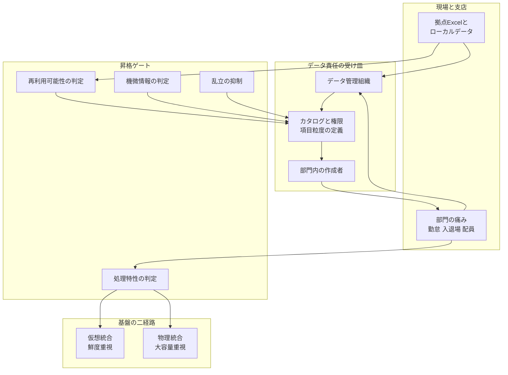

データ基盤の構築プロジェクトは、カットオーバー日を置くと計画が書けます。しかし「基盤ができたのに使われない」という失敗は、まさにそのカットオーバー定義から生まれます。

この記事では、清水建設が2021年から進めてきた全社データ管理基盤の公開情報を材料に、発注側が「完成」をどう定義し直すべきかを整理します。想定する読者は、データ基盤やデータ活用の投資判断をする立場の方、およびその判断を支援する立場の方です。製品選定の比較はしません。

扱う論点は3つです。

- 5年という期間の中身が、実際には何の積み上げだったのか
- 器の完成とは別に必要な「受け皿」が、どの4要素で構成されるのか
- 個別部門の要求を共通データモデルへ昇格させる判断基準をどう置くか

なお、記事の起点になった日経クロステックの報道は本文が有料であり、本記事は公開されているリード文、企業の公式発表、当事者が登場する公開事例記事の範囲で構成しています。数値の確度が落ちる箇所は都度明記します。

*この記事の全体像。以下、順に解説します。*

## 5年の中身は「仮想統合の限界を認めるまでの時間」

清水建設のデータ基盤は、単一のシステムを5年かけて作ったものではありません。公開情報を時系列に並べると、層を足していった経過が見えます。

| 時期 | 出来事 | 出典の性質 |
|---|---|---|
| 2021年 | 全社データマネジメントの専門グループが発足 | 複数の取材記事が一致 |
| 2022年2月 | データ仮想化基盤 Denodo の PoC | ベンダー事例（二次情報） |
| 2022年10月 | Denodo 本稼働 | ベンダー事例 + Denodo 公式プレス |
| 2024年7月 | 中期DX戦略〈2024－2026〉を公表 | 企業公式 |
| 2024年10月 | DX経営推進室が発足、室長は副社長兼CIO | ベンダー事例（二次情報） |
| 2025年8月 | Snowflake と TROCCO がカットオーバー | ベンダー事例 + 専門メディア |

ここで重要なのは、2022年に本稼働した仮想統合基盤に対して、2025年に物理統合の層が追加されている点です。

データ仮想化は「データを動かさない」ことを前提に、鮮度の高い参照を実現するアプローチです。清水建設のデータマネジメントグループ長である半田貴志氏は、ベンダー事例のなかで、仮想化基盤はリアルタイム取得に長ける一方、大容量データの迅速な処理や外部クラウド連携はカバーしきれず補完が必要だった、という趣旨を述べています。

つまり「5年がかりの基盤整備」の実質は、**当初アーキテクチャの適用限界を運用のなかで確認し、経路を分けるまでにかかった時間**と読むのが妥当です。ここから発注側が持ち帰れる示唆は明快です。

> 鮮度を優先する参照経路と、大容量を処理する経路は、最初から別物として設計する。

清水建設は後から分けました。同じ順序をなぞる必然性はありません。

なお、報道は2026年10月に基盤が完成する見込みだと伝えていますが、この完成日と完成範囲は企業の公式発表では確認できません。2022年10月の本稼働、2024年3月のベンダープレス、2026年10月の完成見込みが並ぶ状態は、後述する「完成の多重宣言」そのものです。

## 器の完成と、受け皿の成立は別物

基盤という器がカットオーバーしても、それだけでは使われません。使われる状態を作っているのは、器の外側にある4つの要素です。

1. **データ責任を持つ組織** — 誰が全社データの面倒を見るか
2. **カタログと権限** — どの項目が、どの粒度で、誰に見えるか
3. **部門内の作成者** — 各部門で実際にダッシュボードを組む人
4. **要求の昇格ゲート** — 個別要求を共通化するかどうかの判断基準

この4つと基盤層の関係を図にすると、現場の痛みが基盤へ届くまでの経路が見えます。

この構造が公式方針として存在することは、清水建設自身の発表で確認できます。同社が2024年7月に公表した中期DX戦略のPDFは、データ利活用基盤の構成要素として、データの集約だけでなく業務プロセスの再定義と「企業風土・文化の変革とルール・制度」を明記しています。

つまり、**風土とルールを基盤の一部として数えるという設計思想は、報道の発見ではなく企業の公式方針として先にあります**。基盤投資を検討する立場であれば、報道に出てくる施策名より先に、この「基盤に何を含めるか」の定義を自社で書くべきです。

### 定着の設計思想は「全員が作る」ではない

受け皿の3番目、部門内の作成者について、公開取材では明確な方針が語られています。全部員がダッシュボードを作る必要はなく、各部門に作れる人がいればよい、という考え方です。

これは全社データ民主化のスローガンとは異なる、より現実的な設計です。実際、公開されている利用者数はパワーユーザー約100名、ライトユーザー約500名（Denodo導入から約1年時点のベンダー事例による二次情報）であり、ライトユーザーは参照者です。数千人規模の従業員に対して、この数字は全社民主化の達成ではなく、**作成者を絞って参照者を広げる設計が意図どおりに動いていること**を示すスナップショットと読むべきです。

## 個別要求を共通モデルへ上げる判断基準

全国の支店を回って個別の要求を拾う活動は、それ自体では成果になりません。拾った要求を共通モデルへ昇格させる基準がなければ、個別成果物が増えるだけで終わります。

成文の基準書は公開されていませんが、当事者の公開発言からは次のゲートが復元できます。これはそのまま、自社で昇格基準を書くときのたたき台になります。

| ゲート | 判断内容 |
|---|---|
| 処理特性 | 鮮度重視・小規模は仮想統合、数千万件規模は物理DWHへ振る |
| 連携頻度 | 少量多頻度は iPaaS、夜間大量転送は ETL ツールへ振る |
| セキュリティ | オンプレの実データを外部SaaSへ経由させない経路を選ぶ |
| 公開粒度 | 全社に開ける項目はカタログ掲載、機微な項目は申請ワークフロー |
| 再利用 | 拠点独自のExcelは標準化して初めて横展開の対象にする |
| 乱立抑制 | 同一目的の成果物が増え始めたら、文書と業務の標準化を先に行う |
| ユーザー部門 | 基盤の前に、最初に使う部門を特定しておく |

このうち最後の「ユーザー部門」は順序の問題であり、最も見落とされます。清水建設が最初のユーザー部門に選んだのは人事でした。建設業の時間外労働上限規制、いわゆる2024年問題という、痛みが規制によって定量化されている領域です。現場の入退場管理や動線分析は後段に位置します。

痛みが定量化できる単位を最初のユーザー部門に固定する。この順序は、同業他社の事例でも支持されます。戸田建設の事例では、使うユーザーを見定めてからスタートしたことが語られ、データマネジメントの専任組織の公式化はむしろ後になっています。

ここから読めるのは、**受け皿を先に完成させてから基盤を作る、という順序だけが正解ではない**ということです。必要なのは、どちらの順序を取るにせよ、昇格ゲートが存在することです。

### ゲートの積集合で判断する

昇格の条件は、いずれか1つを満たすことではありません。上表の積集合です。

- カタログに論理名を書けること
- 権限を付与できること
- 他拠点が再利用できること
- 機微な項目を分離できること

「現場に痛みがある」ことだけでは、共通データモデルへ上げる理由になりません。この線引きを事前に文書化しておかないと、訪問した部門の要求を断れなくなります。

## FDEというラベルは、計画の必須要素にしない

近年、Forward Deployed Engineer（FDE）という職種名が国内でも語られるようになりました。顧客環境に入り込み、end-to-end で実装まで行う役割です。原義は Palantir の公式求人で定義されており、日立製作所は2026年度第1四半期の決算説明資料で、国内FDEを7月時点で約300人、年度末に約1,000人とする計画を公表しています。

一方で、このラベルの扱いには注意が必要です。

- **主語が定まらない** — 社内のデータマネジメント組織を指すのか、伴走するベンダーを指すのか、社内のDXコア人財を指すのかで、意味がまったく変わります
- **人数目標が人月置換と区別しにくい** — 人数KPIを置いた瞬間、常駐エンジニアの肩書き変更と見分けがつかなくなります
- **原義は受け皿を前提にしない** — Palantir 原義のFDEは、顧客側にカタログや昇格ゲートがあることを条件としていません

清水建設の公式サイトには、本記事で確認した公開ページの範囲でFDEという語は見当たりません。報道の見出しやタグには現れますが、企業の公式呼称としては未確認です。

したがって、この役割を自社の計画に組み込むなら、ラベルではなく機能で書くことを勧めます。

> 現場に出て個別要求を実装し、その成果を共通カタログへ還流する役割。

そして、この役割の成功は人数では数えません。**カタログ記載・権限付与・横展開の3つを通過したときだけ、共通化の成功として計上します**。これはFDEに限らず、社内の伴走組織でもベンダーの常駐でも同じです。

## 完成条件を4点で書き直す

ここまでの整理を、発注側が実際に使える形にまとめます。データ基盤の完成を、カットオーバー日ではなく次の4点で定義します。

1. **利用部門が特定されているか** — 全社同時ではなく、痛みが定量化できる単位に固定されているか
2. **データ項目の責任者がいるか** — 項目粒度で誰が公開可否を判断するかが決まっているか
3. **改善要求の受付と否決があるか** — 受け付ける経路と、断る会議体の両方があるか
4. **個別を共通へ上げるゲートがあるか** — 前述の積集合が文書になっているか

この4点を満たさないまま日付だけで完成を宣言すると、次の逆転条件が発動します。

- 個別ダッシュボードや個別アシスタントの増殖を成果とみなした時点で、標準化ゲートは機能を止めます
- 埋め込み型エンジニアの人数を脱・人月のKPIに置いた時点で、肩書きの置換になります
- 完成をカレンダーだけで切った時点で、本稼働・プレス発表・完成見込みという多重宣言が再発します

### 定着施策の測り方を変える

支店を巡回する活動や研修を成果として報告するとき、訪問回数は指標になりません。受け皿の成立を測る指標に置き換えます。

| 測らない指標 | 代わりに測る指標 |
|---|---|
| 訪問した支店数 | 部門内作成者が存在する部門の数 |
| 実施した研修回数 | カタログ掲載データの数 |
| 作られたダッシュボード数 | 他部門で再利用されたビューの数 |

左列は活動量、右列は受け皿の成立度です。左列だけを追うと、活動が続く限り数字は伸び続けます。

## 何が確かめられていないか

この記事の結論は「完成条件に利用側を含める」という設計上の主張であり、清水建設が成功した証明ではありません。公開情報の範囲で確かめられていない点を明示します。

- 2026年10月に完成するとされる範囲（全ドメインか、特定パイプラインか）は企業の公式発表にありません
- 業務成果の一次KPI（残業削減時間、人員配置の最適化人数）は公開されていません
- 支店巡回の対象・頻度・持ち帰る成果物・否決の会議体は、有料記事の本文を確認していないため不明です
- 利用者数、処理時間、データ件数に関する数値はいずれもベンダー事例に依る二次情報であり、計測方法は非公開です
- データマネジメント組織の社外要員の契約形態は特定できていません

数値の扱いとしては、100名/500名という利用者数、および処理性能に関する記述は、いずれも導入ベンダー側の事例記事に由来するスナップショットとして読む必要があります。自社の投資判断でベンチマークに使うには根拠が足りません。

一方で、**完成条件に利用側を含めるという判断は、これらの未確認事項を待たずに下せます**。企業の公式方針と当事者の公開発言だけで、判断材料は揃っています。

## まとめ

- 5年がかりの基盤整備の実質は、仮想統合の適用限界を確認して経路を分けるまでの時間でした。鮮度経路と大容量経路は最初から分けて設計します
- 器の完成と受け皿の成立は別物です。受け皿は、データ責任組織・カタログと権限・部門内の作成者・要求の昇格ゲートの4要素で構成されます
- 昇格ゲートは積集合で判断します。痛みがあることだけでは、共通データモデルへ上げる理由になりません
- FDEというラベルは計画の必須要素にせず、機能で書きます。成功は人数ではなく、カタログ記載・権限付与・横展開の通過数で数えます
- 完成をカットオーバー日で定義せず、利用部門・データ責任者・要求の受付と否決・昇格ゲートの4点で定義します
- 定着施策は訪問回数ではなく、部門内作成者の数・カタログ掲載数・再利用ビュー数で測ります

この記事が少しでも参考になった、あるいは改善点などがあれば、ぜひリアクションやコメント、SNSでのシェアをいただけると励みになります！

## 参考リンク

企業公式:

- 清水建設「中期DX戦略〈2024－2026〉を策定」2024-07-31 <https://www.shimz.co.jp/company/about/news-release/2024/2024026.html>
- 同 資料PDF <https://www.shimz.co.jp/company/about/news-release/2024/pdf/2024026.pdf>
- 清水建設 人財育成（DXコア人財の育成KPI） <https://www.shimz.co.jp/company/csr/development/>
- 日立製作所 2026年度第1四半期 決算説明資料 2026-07-29 <https://www.hitachi.com/content/dam/hitachi/global/ja_jp/press/files/2026/07/0729/2026_1Qpre.pdf>
- Palantir Careers, Forward Deployed Software Engineer <https://jobs.lever.co/palantir/289ad049-7b4e-41e3-8a39-146fbeb6fb64>
- 日立ソリューションズ Workato に関するプレスリリース 2026-04-14 <https://www.hitachi-solutions.co.jp/company/press/news/2026/0414.html>
- Denodo「清水建設、データ仮想化基盤を導入し全社データ利活用システムを本格稼働」2024-03-21 <https://www.denodo.com/ja/press-release/2024-03-21/denodo-customer-Shimizu-realtime-data-infra>

報道:

- 森岡 麗「清水建設がデータ管理基盤を5年かけて整備、全国行脚とFDEで活用浸透へ」日経クロステック 2026-08-24 <https://xtech.nikkei.com/atcl/nxt/column/18/00678/081000188/>
- 「IT大手4社、脱・人月へFDE拡充に意欲」日経クロステック 2026-08-17 <https://xtech.nikkei.com/atcl/nxt/column/18/00001/11956/>
- 今林敏子「できることから進める、清水建設が取り組む“草の根活動”のデータ活用とは」TECH+ 2024-06-11 <https://news.mynavi.jp/techplus/article/20240611-2951314/>
- IT Leaders「清水建設、Snowflakeでデータ基盤をクラウドに移行」2026-06-26 <https://it.impress.co.jp/articles/-/29505>

当事者発言を含む導入事例（数値は二次情報として扱う）:

- ジール Denodo 導入事例 <https://www.zdh.co.jp/customer/shimz/>
- ジール Snowflake / TROCCO 導入事例 <https://www.zdh.co.jp/customer/shimz-snowflake-trocco/>
- primeNumber 清水建設 導入事例 <https://primenumber.com/cases/shimizu-corporaion/>
- primeNumber 戸田建設 導入事例 <https://primenumber.com/cases/toda-1/>
- Lightblue 清水建設 事例 2025-08-21 <https://www.lightblue-tech.com/project/shimiz-dx/>
